# AI智能体系统

<cite>
**本文引用的文件**
- [BaseAgent.java](file://src/main/java/com/yupi/yuaiagent/agent/BaseAgent.java)
- [ReActAgent.java](file://src/main/java/com/yupi/yuaiagent/agent/ReActAgent.java)
- [ToolCallAgent.java](file://src/main/java/com/yupi/yuaiagent/agent/ToolCallAgent.java)
- [YuManus.java](file://src/main/java/com/yupi/yuaiagent/agent/YuManus.java)
- [AgentState.java](file://src/main/java/com/yupi/yuaiagent/agent/model/AgentState.java)
- [CompetitorAnalysisAgent.java](file://src/main/java/com/yupi/yuaiagent/competitor/agent/CompetitorAnalysisAgent.java)
- [CompetitorAnalysisAgentFactory.java](file://src/main/java/com/yupi/yuaiagent/competitor/agent/CompetitorAnalysisAgentFactory.java)
- [CompetitorMonitorController.java](file://src/main/java/com/yupi/yuaiagent/competitor/controller/CompetitorMonitorController.java)
- [CompetitorMonitorScheduler.java](file://src/main/java/com/yupi/yuaiagent/competitor/scheduler/CompetitorMonitorScheduler.java)
- [CompetitorMonitorServiceImpl.java](file://src/main/java/com/yupi/yuaiagent/competitor/service/impl/CompetitorMonitorServiceImpl.java)
- [CompetitorComparisonTool.java](file://src/main/java/com/yupi/yuaiagent/competitor/tools/CompetitorComparisonTool.java)
- [AppStoreReviewCrawler.java](file://src/main/java/com/yupi/yuaiagent/competitor/crawler/AppStoreReviewCrawler.java)
- [AppMonitoringConfig.java](file://src/main/java/com/yupi/yuaiagent/competitor/entity/AppMonitoringConfig.java)
- [CompetitorAnalysisReport.java](file://src/main/java/com/yupi/yuaiagent/competitor/entity/CompetitorAnalysisReport.java)
- [CompetitorReview.java](file://src/main/java/com/yupi/yuaiagent/competitor/entity/CompetitorReview.java)
- [AlertService.java](file://src/main/java/com/yupi/yuaiagent/competitor/service/AlertService.java)
- [AlertServiceImpl.java](file://src/main/java/com/yupi/yuaiagent/competitor/service/impl/AlertServiceImpl.java)
- [competitor-schema.sql](file://src/main/resources/db/competitor-schema.sql)
- [ToolRegistration.java](file://src/main/java/com/yupi/yuaiagent/tools/ToolRegistration.java)
- [TerminalOperationTool.java](file://src/main/java/com/yupi/yuaiagent/tools/TerminalOperationTool.java)
- [WebSearchTool.java](file://src/main/java/com/yupi/yuaiagent/tools/WebSearchTool.java)
- [PDFGenerationTool.java](file://src/main/java/com/yupi/yuaiagent/tools/PDFGenerationTool.java)
- [FileOperationTool.java](file://src/main/java/com/yupi/yuaiagent/tools/FileOperationTool.java)
- [AiController.java](file://src/main/java/com/yupi/yuaiagent/controller/AiController.java)
- [application.yml](file://src/main/resources/application.yml)
- [YuAiAgentApplication.java](file://src/main/java/com/yupi/yuaiagent/YuAiAgentApplication.java)
- [MyLoggerAdvisor.java](file://src/main/java/com/yupi/yuaiagent/advisor/MyLoggerAdvisor.java)
- [YuManusTest.java](file://src/test/java/com/yupi/yuaiagent/agent/YuManusTest.java)
- [LoveApp.java](file://src/main/java/com/yupi/yuaiagent/app/LoveApp.java)
- [FileConstant.java](file://src/main/java/com/yupi/yuaiagent/constant/FileConstant.java)
</cite>

## 目录
1. [简介](#简介)
2. [项目结构](#项目结构)
3. [核心组件](#核心组件)
4. [架构总览](#架构总览)
5. [详细组件分析](#详细组件分析)
6. [竞争对手监控智能体](#竞争对手监控智能体)
7. [依赖分析](#依赖分析)
8. [性能考虑](#性能考虑)
9. [故障排查指南](#故障排查指南)
10. [结论](#结论)
11. [附录](#附录)

## 简介
本项目是一个基于Spring AI的AI智能体系统，重点实现ReAct（推理-行动）模式与工具调用能力，并提供"鱼皮"超级智能体（YuManus）的自主规划能力。系统通过统一的状态管理、可扩展的代理基类、以及工具注册与调用机制，支撑从简单对话到复杂任务编排的多种场景。**新增**竞争对手监控智能体模块，专门用于印尼金融科技市场的竞品分析与监控，实现了从数据采集、LLM分析到报告生成和预警管理的完整闭环。

## 项目结构
系统采用模块化组织，主要分为以下层次：
- 控制层：对外提供REST接口，负责接收请求并调度智能体或应用。
- 应用层：封装业务场景（如恋爱咨询），集成记忆、RAG、工具调用等能力。
- 智能体层：抽象基类与具体智能体（ReAct、工具调用、超级智能体、**新增**竞争对手分析智能体）。
- 工具层：各类工具（文件、终端、网页搜索、PDF生成、终止、**新增**竞品对比工具）。
- 配置层：Spring Boot配置、日志Advisor、工具注册等。
- **新增**竞争对手监控层：专门的监控编排、数据分析和预警管理模块。

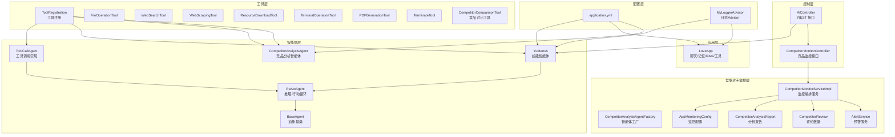

**图表来源**
- [AiController.java:1-106](file://src/main/java/com/yupi/yuaiagent/controller/AiController.java#L1-L106)
- [CompetitorMonitorController.java:1-117](file://src/main/java/com/yupi/yuaiagent/competitor/controller/CompetitorMonitorController.java#L1-L117)
- [CompetitorAnalysisAgent.java:1-134](file://src/main/java/com/yupi/yuaiagent/competitor/agent/CompetitorAnalysisAgent.java#L1-L134)
- [CompetitorMonitorServiceImpl.java:1-200](file://src/main/java/com/yupi/yuaiagent/competitor/service/impl/CompetitorMonitorServiceImpl.java#L1-L200)
- [CompetitorAnalysisAgentFactory.java:1-73](file://src/main/java/com/yupi/yuaiagent/competitor/agent/CompetitorAnalysisAgentFactory.java#L1-L73)

**章节来源**
- [AiController.java:1-106](file://src/main/java/com/yupi/yuaiagent/controller/AiController.java#L1-L106)
- [application.yml:1-66](file://src/main/resources/application.yml#L1-L66)
- [CompetitorMonitorController.java:1-117](file://src/main/java/com/yupi/yuaiagent/competitor/controller/CompetitorMonitorController.java#L1-L117)

## 核心组件
- BaseAgent：抽象基类，提供统一的运行生命周期、状态管理、消息上下文、同步与流式执行能力。
- ReActAgent：在BaseAgent之上实现"思考-行动"循环，子类需实现think与act两个阶段。
- ToolCallAgent：具体实现ReActAgent，负责与大模型交互以获取工具调用决策，并执行工具调用。
- YuManus：继承ToolCallAgent，作为"鱼皮"超级智能体，具备自主规划能力与较高步数上限。
- AgentState：智能体执行状态枚举，涵盖空闲、运行中、完成、错误。
- 工具体系：集中注册所有可用工具，支持文件操作、终端命令、网页搜索、PDF生成、终止等。
- **新增**CompetitorAnalysisAgent：专门的竞品分析智能体，基于BaseAgent实现，支持并发安全的独立实例创建。
- **新增**CompetitorMonitorServiceImpl：竞品监控编排服务，实现完整的监控流程（采集→分析→报告→预警）。

**章节来源**
- [BaseAgent.java:1-193](file://src/main/java/com/yupi/yuaiagent/agent/BaseAgent.java#L1-L193)
- [ReActAgent.java:1-53](file://src/main/java/com/yupi/yuaiagent/agent/ReActAgent.java#L1-L53)
- [ToolCallAgent.java:1-136](file://src/main/java/com/yupi/yuaiagent/agent/ToolCallAgent.java#L1-L136)
- [YuManus.java:1-38](file://src/main/java/com/yupi/yuaiagent/agent/YuManus.java#L1-L38)
- [AgentState.java:1-27](file://src/main/java/com/yupi/yuaiagent/agent/model/AgentState.java#L1-L27)
- [ToolRegistration.java:1-38](file://src/main/java/com/yupi/yuaiagent/tools/ToolRegistration.java#L1-L38)
- [CompetitorAnalysisAgent.java:1-134](file://src/main/java/com/yupi/yuaiagent/competitor/agent/CompetitorAnalysisAgent.java#L1-L134)
- [CompetitorMonitorServiceImpl.java:1-200](file://src/main/java/com/yupi/yuaiagent/competitor/service/impl/CompetitorMonitorServiceImpl.java#L1-L200)

## 架构总览
系统通过控制器对外暴露接口，智能体与应用分别承担不同职责：
- 控制器负责路由与流式输出（SSE）。
- 应用层LoveApp整合记忆、RAG与工具调用，适合复杂对话场景。
- 智能体层YuManus专注于任务规划与工具编排，适合端到端自动化任务。
- **新增**竞争对手监控层提供专业的商业分析能力，支持定时监控和手动触发分析。

```mermaid
sequenceDiagram
participant U as "用户"
participant C as "AiController"
participant CC as "CompetitorMonitorController"
participant A as "YuManus"
participant B as "BaseAgent"
participant R as "ReActAgent"
participant T as "ToolCallAgent"
participant M as "ChatClient/LLM"
U->>C : GET /ai/manus/chat?message=...
C->>A : runStream(message)
A->>B : runStream(userPrompt)
B->>B : 状态切换为RUNNING
loop 步骤循环
B->>R : step()
R->>T : think()
T->>M : 调用模型获取工具调用决策
M-->>T : 工具调用列表
alt 需要行动
T->>T : act()
T->>M : 执行工具调用
M-->>T : 工具返回结果
T-->>R : 行动结果
else 不需要行动
T-->>R : 无需行动
end
R-->>B : 当前步结果
B-->>A : 最终结果SSE
A-->>C : 流式响应
C-->>U : 实时输出
```

**图表来源**
- [AiController.java:94-104](file://src/main/java/com/yupi/yuaiagent/controller/AiController.java#L94-L104)
- [BaseAgent.java:94-177](file://src/main/java/com/yupi/yuaiagent/agent/BaseAgent.java#L94-L177)
- [ReActAgent.java:35-50](file://src/main/java/com/yupi/yuaiagent/agent/ReActAgent.java#L35-L50)
- [ToolCallAgent.java:59-134](file://src/main/java/com/yupi/yuaiagent/agent/ToolCallAgent.java#L59-L134)

## 详细组件分析

### BaseAgent 抽象基类设计与扩展机制
- 设计要点
  - 统一的生命周期：run与runStream，支持同步与流式输出。
  - 状态机：IDLE → RUNNING → FINISHED/ERROR，异常时自动进入ERROR并清理。
  - 步骤控制：maxSteps限制，currentStep跟踪当前步数。
  - 上下文管理：messageList维护消息历史，便于后续工具调用或对话增强。
  - 可扩展清理：cleanup钩子供子类释放资源。
- 扩展机制
  - 子类只需实现step，即可接入统一的执行框架。
  - 可通过覆写cleanup实现资源回收（如关闭流、释放句柄等）。

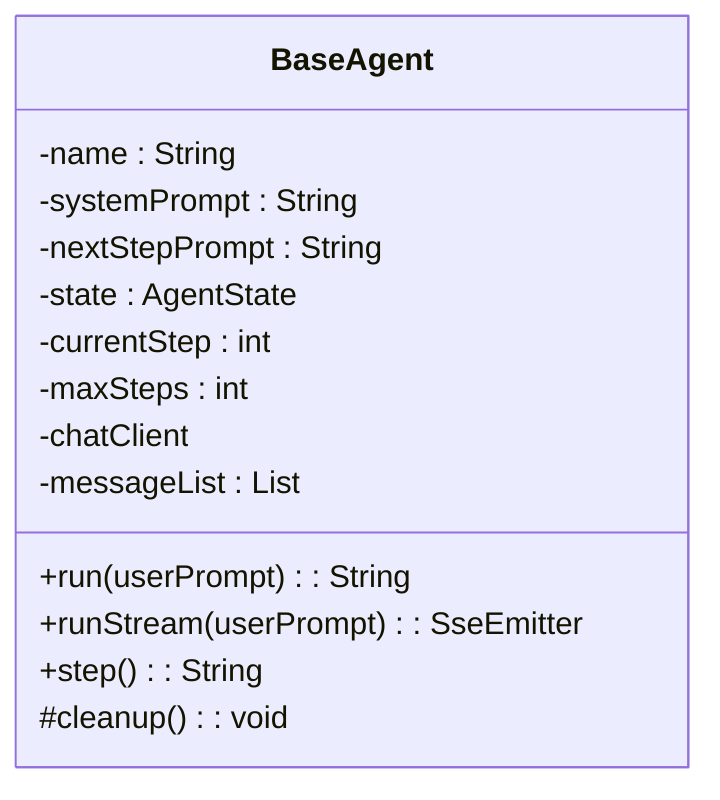

**图表来源**
- [BaseAgent.java:23-192](file://src/main/java/com/yupi/yuaiagent/agent/BaseAgent.java#L23-L192)

**章节来源**
- [BaseAgent.java:47-92](file://src/main/java/com/yupi/yuaiagent/agent/BaseAgent.java#L47-L92)
- [BaseAgent.java:94-177](file://src/main/java/com/yupi/yuaiagent/agent/BaseAgent.java#L94-L177)
- [BaseAgent.java:179-191](file://src/main/java/com/yupi/yuaiagent/agent/BaseAgent.java#L179-L191)

### ReActAgent 推理-行动循环机制
- 思考阶段（think）：基于当前上下文与系统提示词，调用大模型判断是否需要执行工具。
- 行动阶段（act）：若需要行动，则执行工具调用；否则返回"无需行动"的结论。
- 步骤执行：step将think与act串联，捕获异常并返回友好提示。

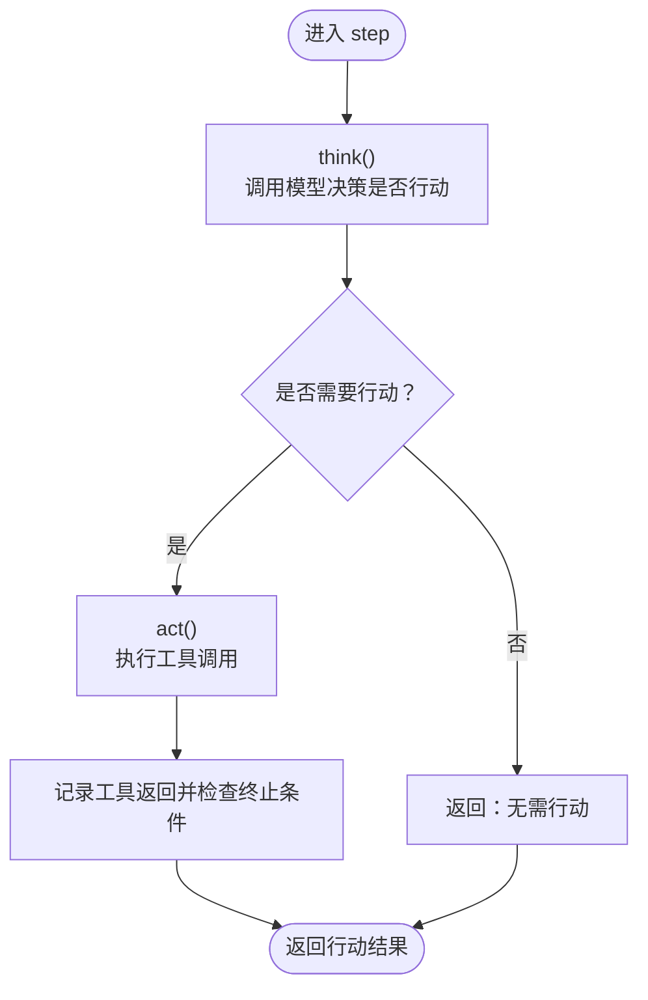

**图表来源**
- [ReActAgent.java:35-50](file://src/main/java/com/yupi/yuaiagent/agent/ReActAgent.java#L35-L50)
- [ToolCallAgent.java:59-104](file://src/main/java/com/yupi/yuaiagent/agent/ToolCallAgent.java#L59-L104)
- [ToolCallAgent.java:111-134](file://src/main/java/com/yupi/yuaiagent/agent/ToolCallAgent.java#L111-L134)

**章节来源**
- [ReActAgent.java:16-50](file://src/main/java/com/yupi/yuaiagent/agent/ReActAgent.java#L16-L50)

### ToolCallAgent 工具调用机制与工具选择策略
- 工具选择策略
  - 在think阶段，将当前消息上下文与系统提示词组合为Prompt，调用模型返回工具调用列表。
  - 若返回空列表，则记录助手消息并判定为"无需行动"；否则进入行动阶段。
- 行动执行
  - 使用ToolCallingManager执行工具调用，更新消息上下文为包含工具返回结果的新历史。
  - 检测是否调用了终止工具，若是则将状态置为FINISHED。
- 选项与禁用
  - 显式禁用Spring AI内置工具执行，改为自管消息与选项，确保可控性与可观测性。

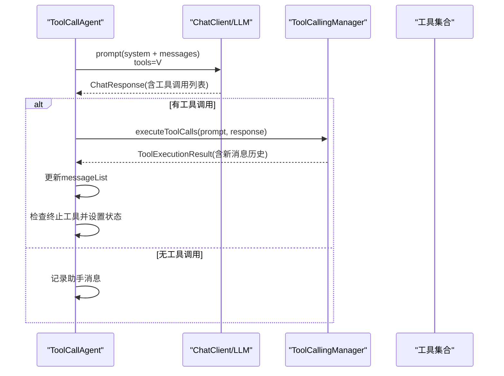

**图表来源**
- [ToolCallAgent.java:59-104](file://src/main/java/com/yupi/yuaiagent/agent/ToolCallAgent.java#L59-L104)
- [ToolCallAgent.java:111-134](file://src/main/java/com/yupi/yuaiagent/agent/ToolCallAgent.java#L111-L134)

**章节来源**
- [ToolCallAgent.java:44-52](file://src/main/java/com/yupi/yuaiagent/agent/ToolCallAgent.java#L44-L52)
- [ToolCallAgent.java:59-104](file://src/main/java/com/yupi/yuaiagent/agent/ToolCallAgent.java#L59-L104)
- [ToolCallAgent.java:111-134](file://src/main/java/com/yupi/yuaiagent/agent/ToolCallAgent.java#L111-L134)

### YuManus 超级智能体的自主规划能力
- 角色定位：作为"鱼皮"超级智能体，具备更强的系统提示词与下一步提示词，鼓励分解复杂任务并逐步求解。
- 参数配置：较高的maxSteps（20步），便于复杂任务的多步规划与执行。
- 日志与可观测性：默认装配自定义日志Advisor，便于观察思考与行动过程。
- 使用方式：通过控制器接口触发，支持SSE流式输出，实时反馈每一步结果。

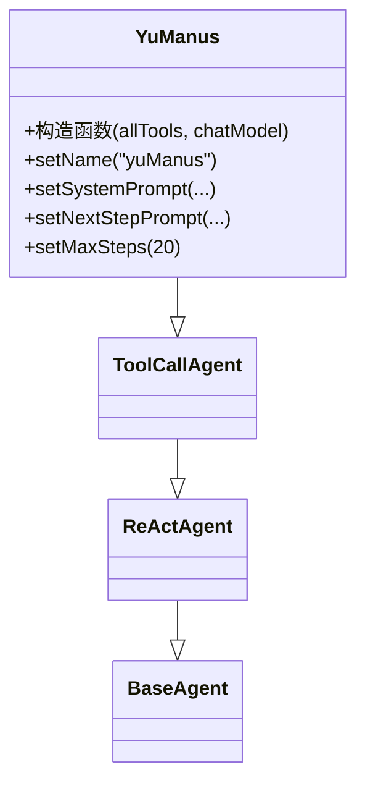

**图表来源**
- [YuManus.java:13-36](file://src/main/java/com/yupi/yuaiagent/agent/YuManus.java#L13-L36)
- [ToolCallAgent.java:30-52](file://src/main/java/com/yupi/yuaiagent/agent/ToolCallAgent.java#L30-L52)
- [ReActAgent.java:14-28](file://src/main/java/com/yupi/yuaiagent/agent/ReActAgent.java#L14-L28)
- [BaseAgent.java:25-45](file://src/main/java/com/yupi/yuaiagent/agent/BaseAgent.java#L25-L45)

**章节来源**
- [YuManus.java:15-36](file://src/main/java/com/yupi/yuaiagent/agent/YuManus.java#L15-L36)

### AgentState 状态管理系统
- 状态枚举：IDLE、RUNNING、FINISHED、ERROR，覆盖正常流转与异常处理路径。
- 状态转换：
  - run/runStream开始时由IDLE转RUNNING。
  - 正常结束：达到maxSteps或满足终止条件后转FINISHED。
  - 异常：抛出异常时转ERROR，并在finally中清理资源。
- 持久化：当前未见显式持久化逻辑，状态主要在内存中流转；如需持久化，可在cleanup或外部存储中扩展。

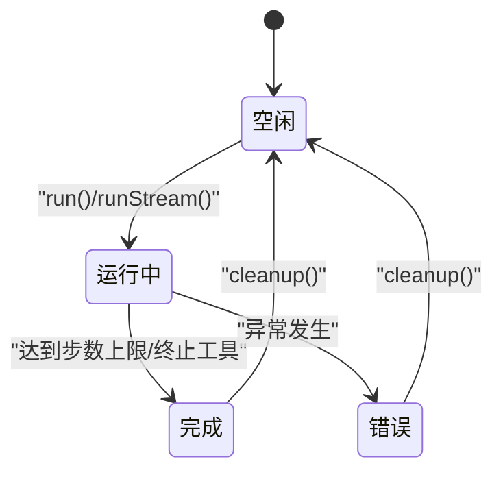

**图表来源**
- [AgentState.java:6-27](file://src/main/java/com/yupi/yuaiagent/agent/model/AgentState.java#L6-L27)
- [BaseAgent.java:53-92](file://src/main/java/com/yupi/yuaiagent/agent/BaseAgent.java#L53-L92)
- [BaseAgent.java:179-191](file://src/main/java/com/yupi/yuaiagent/agent/BaseAgent.java#L179-L191)

**章节来源**
- [AgentState.java:1-27](file://src/main/java/com/yupi/yuaiagent/agent/model/AgentState.java#L1-L27)
- [BaseAgent.java:53-92](file://src/main/java/com/yupi/yuaiagent/agent/BaseAgent.java#L53-L92)

### 工具体系与工具选择策略
- 工具注册：集中通过ToolRegistration装配所有工具，便于统一管理与注入。
- 工具类型：
  - 文件操作：读写文件，路径位于统一目录。
  - 终端操作：执行系统命令，注意安全风险。
  - 网页搜索：调用第三方搜索API，返回结构化结果。
  - PDF生成：生成PDF文件，保存至指定目录。
  - 终止工具：用于主动结束交互。
  - **新增**竞品对比工具：支持多App横向对比分析，统计评分和差评主题分布。
- 工具选择策略：由模型在think阶段根据用户需求与上下文动态选择，支持单一或组合工具。

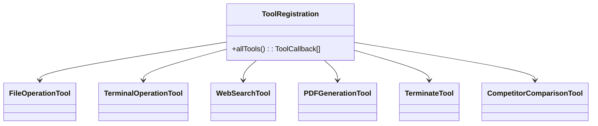

**图表来源**
- [ToolRegistration.java:18-36](file://src/main/java/com/yupi/yuaiagent/tools/ToolRegistration.java#L18-L36)
- [CompetitorComparisonTool.java:1-112](file://src/main/java/com/yupi/yuaiagent/competitor/tools/CompetitorComparisonTool.java#L1-L112)

**章节来源**
- [ToolRegistration.java:1-38](file://src/main/java/com/yupi/yuaiagent/tools/ToolRegistration.java#L1-L38)
- [FileOperationTool.java:1-41](file://src/main/java/com/yupi/yuaiagent/tools/FileOperationTool.java#L1-L41)
- [TerminalOperationTool.java:1-38](file://src/main/java/com/yupi/yuaiagent/tools/TerminalOperationTool.java#L1-L38)
- [WebSearchTool.java:1-54](file://src/main/java/com/yupi/yuaiagent/tools/WebSearchTool.java#L1-L54)
- [PDFGenerationTool.java:1-53](file://src/main/java/com/yupi/yuaiagent/tools/PDFGenerationTool.java#L1-L53)
- [CompetitorComparisonTool.java:1-112](file://src/main/java/com/yupi/yuaiagent/competitor/tools/CompetitorComparisonTool.java#L1-L112)

### 控制器与应用层集成
- 控制器AiController提供统一入口，支持同步与SSE两种调用方式。
- LoveApp封装聊天、记忆、RAG与工具调用，演示如何在应用层集成智能体能力。
- **新增**CompetitorMonitorController提供竞品监控专用接口，支持App配置管理、评论数据查询、分析报告管理和预警处理。
- 日志Advisor：MyLoggerAdvisor统一拦截请求与响应，便于调试与审计。

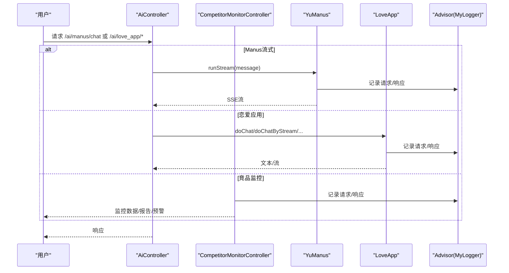

**图表来源**
- [AiController.java:94-104](file://src/main/java/com/yupi/yuaiagent/controller/AiController.java#L94-L104)
- [CompetitorMonitorController.java:1-117](file://src/main/java/com/yupi/yuaiagent/competitor/controller/CompetitorMonitorController.java#L1-L117)
- [LoveApp.java:71-97](file://src/main/java/com/yupi/yuaiagent/app/LoveApp.java#L71-L97)
- [MyLoggerAdvisor.java:30-52](file://src/main/java/com/yupi/yuaiagent/advisor/MyLoggerAdvisor.java#L30-L52)

**章节来源**
- [AiController.java:1-106](file://src/main/java/com/yupi/yuaiagent/controller/AiController.java#L1-L106)
- [LoveApp.java:1-227](file://src/main/java/com/yupi/yuaiagent/app/LoveApp.java#L1-L227)
- [MyLoggerAdvisor.java:1-54](file://src/main/java/com/yupi/yuaiagent/advisor/MyLoggerAdvisor.java#L1-L54)
- [CompetitorMonitorController.java:1-117](file://src/main/java/com/yupi/yuaiagent/competitor/controller/CompetitorMonitorController.java#L1-L117)

## 竞品监控智能体

### 竞品分析智能体架构
**新增**竞争对手监控智能体是系统的重要扩展，专门用于印尼金融科技市场的竞品分析。该智能体基于BaseAgent设计，实现了并发安全的独立实例创建，支持从数据采集到LLM分析的完整工作流。

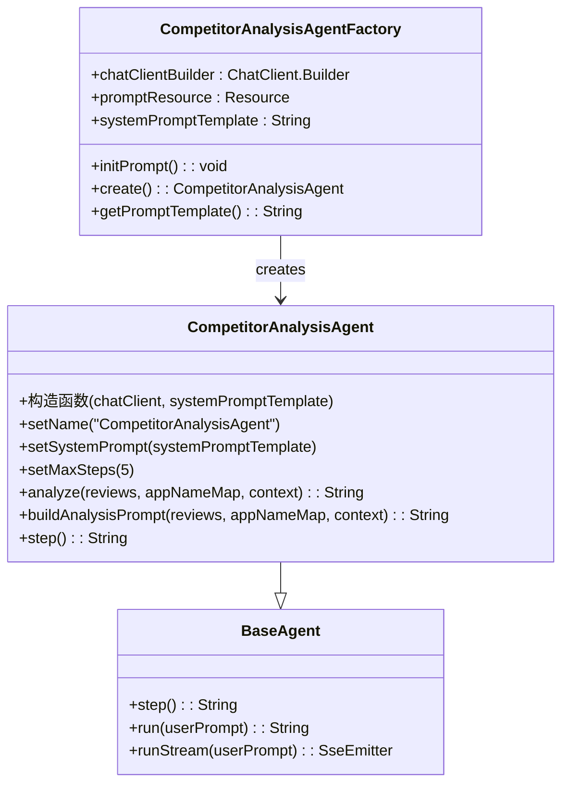

**图表来源**
- [CompetitorAnalysisAgent.java:26-134](file://src/main/java/com/yupi/yuaiagent/competitor/agent/CompetitorAnalysisAgent.java#L26-L134)
- [CompetitorAnalysisAgentFactory.java:23-73](file://src/main/java/com/yupi/yuaiagent/competitor/agent/CompetitorAnalysisAgentFactory.java#L23-L73)
- [BaseAgent.java:23-192](file://src/main/java/com/yupi/yuaiagent/agent/BaseAgent.java#L23-L192)

### 竞品监控编排服务
**新增**CompetitorMonitorServiceImpl实现了完整的监控编排流程，包括数据采集、LLM分析、报告生成和预警管理：

- **数据采集**：通过AppStoreReviewCrawler抓取App Store评论，通过AppStoreUpdateLogCrawler抓取更新日志，通过OfficialSiteMonitor监控官网政策变化。
- **LLM分析**：使用CompetitorAnalysisAgentFactory创建分析智能体，执行竞品归因分析。
- **报告生成**：将分析结果持久化到数据库，支持分页查询和查看详情。
- **预警管理**：基于风险权重和分析结果生成预警，支持预警状态管理。

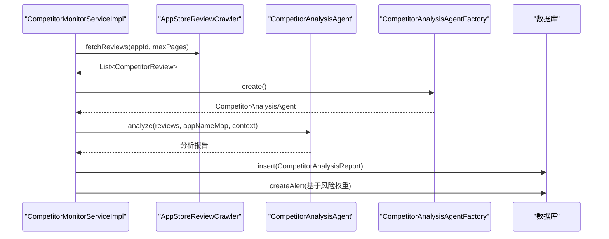

**图表来源**
- [CompetitorMonitorServiceImpl.java:135-184](file://src/main/java/com/yupi/yuaiagent/competitor/service/impl/CompetitorMonitorServiceImpl.java#L135-L184)
- [CompetitorAnalysisAgentFactory.java:53-56](file://src/main/java/com/yupi/yuaiagent/competitor/agent/CompetitorAnalysisAgentFactory.java#L53-L56)
- [CompetitorAnalysisAgent.java:50-68](file://src/main/java/com/yupi/yuaiagent/competitor/agent/CompetitorAnalysisAgent.java#L50-L68)

### 竞品监控API接口
**新增**CompetitorMonitorController提供了完整的竞品监控API接口：

- **App配置管理**：查询监控App列表、新增监控App、更新App配置
- **评论数据查询**：分页查询评论数据，支持按App ID筛选
- **分析报告查询**：查询分析报告列表和详情
- **手动触发分析**：采集指定App评论后执行LLM归因分析
- **预警管理**：查询预警列表、标记预警已处理

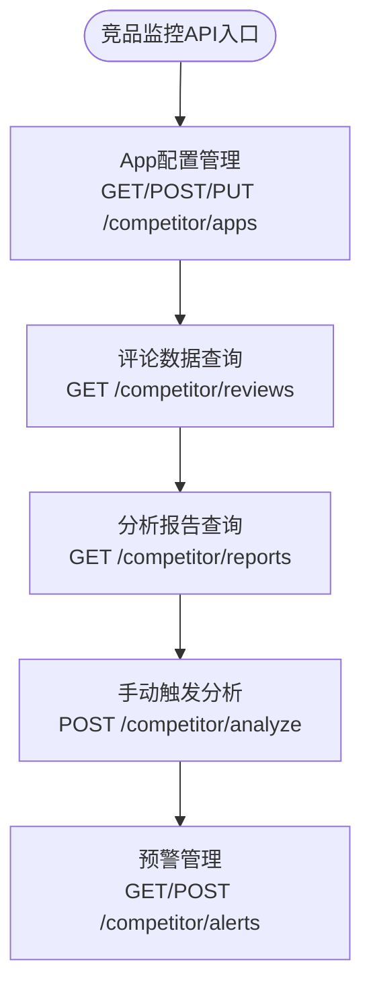

**图表来源**
- [CompetitorMonitorController.java:41-116](file://src/main/java/com/yupi/yuaiagent/competitor/controller/CompetitorMonitorController.java#L41-L116)

### 数据库架构
**新增**系统配套了完整的数据库架构，支持竞品监控的所有数据存储需求：

- **t_app_monitoring_config**：应用监控配置表，包含App ID、名称、分类、风险权重等信息
- **t_competitor_review**：App Store评论原始数据表，存储评论内容、评分、时间戳等
- **t_competitor_analysis_report**：LLM生成的结构化分析报告表
- **t_competitor_alert**：智能预警记录表，支持预警级别和状态管理

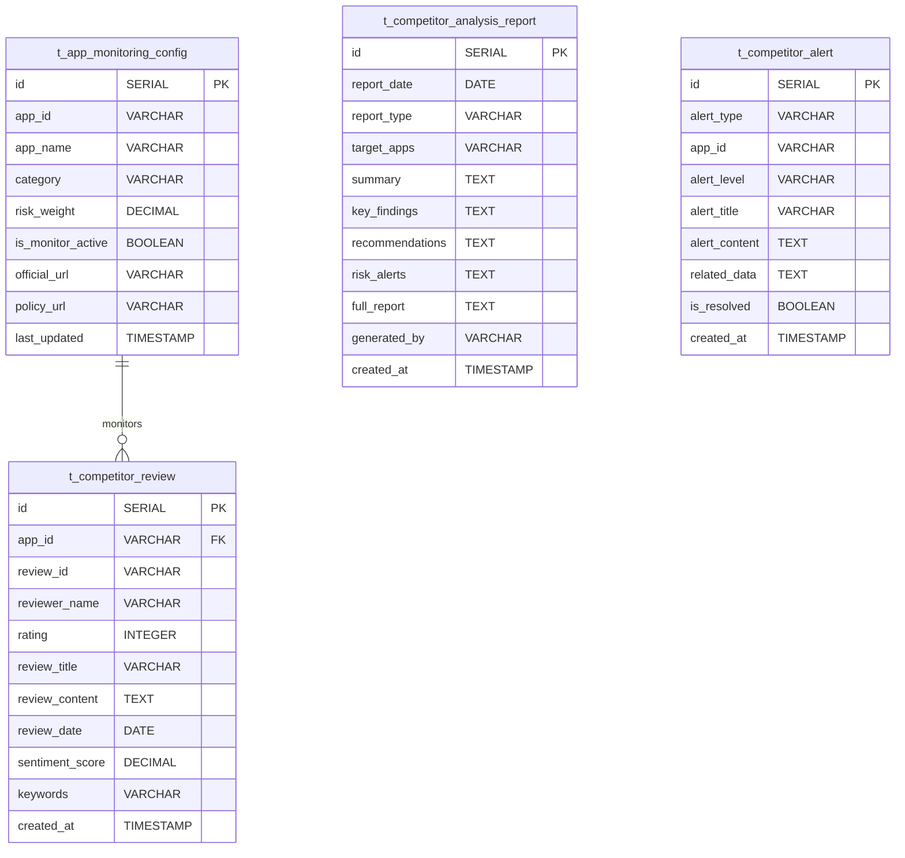

**图表来源**
- [competitor-schema.sql:6-117](file://src/main/resources/db/competitor-schema.sql#L6-L117)

### 竞品对比工具
**新增**CompetitorComparisonTool提供了专业的竞品对比分析能力：

- **评分对比**：支持多App横向对比，统计各App的评论总数和平均评分
- **差评主题分析**：分析指定App的差评主题分布，识别用户关注的主要问题
- **关键词统计**：基于印尼语常见投诉词汇，统计差评中的主题分布

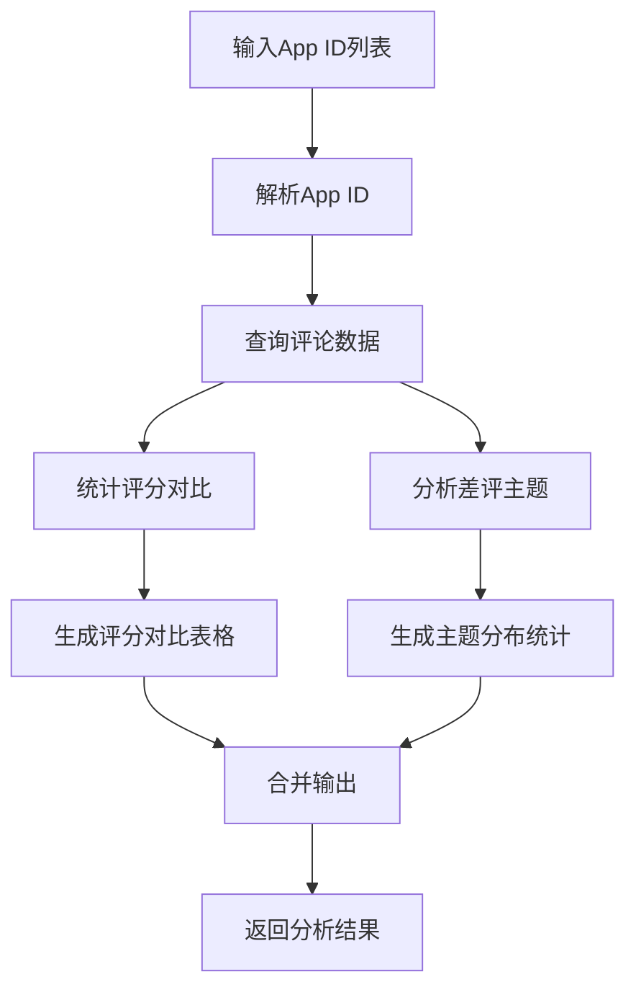

**图表来源**
- [CompetitorComparisonTool.java:30-105](file://src/main/java/com/yupi/yuaiagent/competitor/tools/CompetitorComparisonTool.java#L30-L105)

**章节来源**
- [CompetitorAnalysisAgent.java:1-134](file://src/main/java/com/yupi/yuaiagent/competitor/agent/CompetitorAnalysisAgent.java#L1-L134)
- [CompetitorAnalysisAgentFactory.java:1-73](file://src/main/java/com/yupi/yuaiagent/competitor/agent/CompetitorAnalysisAgentFactory.java#L1-L73)
- [CompetitorMonitorServiceImpl.java:1-200](file://src/main/java/com/yupi/yuaiagent/competitor/service/impl/CompetitorMonitorServiceImpl.java#L1-L200)
- [CompetitorMonitorController.java:1-117](file://src/main/java/com/yupi/yuaiagent/competitor/controller/CompetitorMonitorController.java#L1-L117)
- [CompetitorComparisonTool.java:1-112](file://src/main/java/com/yupi/yuaiagent/competitor/tools/CompetitorComparisonTool.java#L1-L112)
- [AppStoreReviewCrawler.java:1-130](file://src/main/java/com/yupi/yuaiagent/competitor/crawler/AppStoreReviewCrawler.java#L1-L130)
- [competitor-schema.sql:1-117](file://src/main/resources/db/competitor-schema.sql#L1-L117)

## 依赖分析
- 组件耦合
  - YuManus强依赖ToolRegistration提供的工具数组与ChatModel。
  - BaseAgent与ReActAgent/ToolCallAgent形成清晰的继承链，职责分离明确。
  - **新增**CompetitorAnalysisAgentFactory依赖ChatClient.Builder和外部Prompt模板资源。
  - **新增**CompetitorMonitorServiceImpl依赖多个爬虫、分析器和数据库访问组件。
  - 控制器仅依赖IoC容器注入的组件，低耦合高内聚。
- 外部依赖
  - Spring AI ChatClient/ChatModel、工具回调、向量存储Advisor等。
  - **新增**第三方API（App Store RSS、网页搜索）与系统命令执行（终端工具）。
  - **新增**数据库连接池、MyBatis Plus ORM框架。

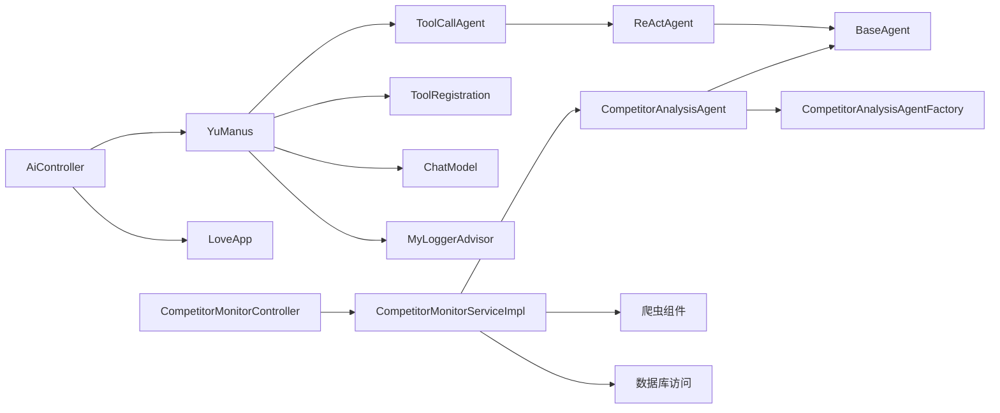

**图表来源**
- [YuManus.java:15-36](file://src/main/java/com/yupi/yuaiagent/agent/YuManus.java#L15-L36)
- [ToolCallAgent.java:30-52](file://src/main/java/com/yupi/yuaiagent/agent/ToolCallAgent.java#L30-L52)
- [ReActAgent.java:14-28](file://src/main/java/com/yupi/yuaiagent/agent/ReActAgent.java#L14-L28)
- [BaseAgent.java:25-45](file://src/main/java/com/yupi/yuaiagent/agent/BaseAgent.java#L25-L45)
- [CompetitorAnalysisAgentFactory.java:26-55](file://src/main/java/com/yupi/yuaiagent/competitor/agent/CompetitorAnalysisAgentFactory.java#L26-L55)
- [CompetitorMonitorServiceImpl.java:3-27](file://src/main/java/com/yupi/yuaiagent/competitor/service/impl/CompetitorMonitorServiceImpl.java#L3-L27)
- [AiController.java:94-104](file://src/main/java/com/yupi/yuaiagent/controller/AiController.java#L94-L104)
- [MyLoggerAdvisor.java:18-52](file://src/main/java/com/yupi/yuaiagent/advisor/MyLoggerAdvisor.java#L18-L52)

**章节来源**
- [YuManus.java:1-38](file://src/main/java/com/yupi/yuaiagent/agent/YuManus.java#L1-L38)
- [ToolRegistration.java:1-38](file://src/main/java/com/yupi/yuaiagent/tools/ToolRegistration.java#L1-L38)
- [AiController.java:1-106](file://src/main/java/com/yupi/yuaiagent/controller/AiController.java#L1-L106)
- [CompetitorAnalysisAgentFactory.java:1-73](file://src/main/java/com/yupi/yuaiagent/competitor/agent/CompetitorAnalysisAgentFactory.java#L1-L73)
- [CompetitorMonitorServiceImpl.java:1-200](file://src/main/java/com/yupi/yuaiagent/competitor/service/impl/CompetitorMonitorServiceImpl.java#L1-L200)

## 性能考虑
- 步数上限与超时控制：合理设置maxSteps与SSE超时时间，避免长时间占用资源。
- 工具调用成本：工具执行可能涉及网络I/O或系统命令，建议在工具内部增加超时与重试策略。
- **新增**竞品监控性能优化：
  - 爬虫请求超时设置：AppStoreReviewCrawler设置了30秒超时，避免阻塞整个监控流程。
  - 分页查询优化：数据库查询使用索引和分页，支持大量数据的高效检索。
  - 缓存策略：分析结果可考虑缓存，减少重复计算。
- 日志级别：生产环境建议调整日志级别，减少高频日志对性能的影响。
- 缓存与复用：对于重复的工具调用结果，可引入缓存以降低重复计算与网络请求。

## 故障排查指南
- 常见问题
  - 状态异常：若非IDLE状态调用run/runStream，将抛出异常。请确保上一次执行已完成或清理。
  - 空提示词：传入空提示词将被拒绝执行。请检查前端输入与参数传递。
  - 工具执行失败：终端工具可能因权限或命令不可用导致失败；文件工具可能因路径或编码问题失败。
  - **新增**竞品监控问题：
    - App Store API限制：RSS接口可能返回空数据或格式异常，需要重试机制。
    - 数据库连接问题：监控服务启动时需要确保数据库连接正常。
    - LLM分析失败：Prompt模板加载失败时会回退到默认模板。
- 调试技巧
  - 启用DEBUG日志：在配置中提高Spring AI日志级别，观察请求与响应文本。
  - 使用自定义Advisor：MyLoggerAdvisor可帮助定位思考与行动阶段的问题。
  - **新增**竞品监控调试：
    - 检查爬虫日志：确认App Store评论抓取是否成功。
    - 验证数据库连接：确保监控配置和分析报告能够正确持久化。
    - 监控定时任务：确认每天9:00的定时任务是否正常执行。
  - 单元测试：参考YuManusTest，验证端到端流程与期望输出。

**章节来源**
- [BaseAgent.java:53-60](file://src/main/java/com/yupi/yuaiagent/agent/BaseAgent.java#L53-L60)
- [application.yml:64-66](file://src/main/resources/application.yml#L64-L66)
- [MyLoggerAdvisor.java:30-52](file://src/main/java/com/yupi/yuaiagent/advisor/MyLoggerAdvisor.java#L30-L52)
- [YuManusTest.java:14-22](file://src/test/java/com/yupi/yuaiagent/agent/YuManusTest.java#L14-L22)
- [AppStoreReviewCrawler.java:40-76](file://src/main/java/com/yupi/yuaiagent/competitor/crawler/AppStoreReviewCrawler.java#L40-L76)

## 结论
本系统以ReAct模式为核心，结合统一的状态管理与工具调用机制，构建了从简单对话到复杂任务规划的完整智能体能力。**新增**的竞争对手监控智能体模块进一步扩展了系统的应用领域，展示了AI智能体在商业分析领域的强大能力。通过专门的监控编排服务、数据分析工具和预警管理机制，系统能够自动监控竞品动态、生成结构化分析报告并及时发出风险预警。YuManus作为超级智能体，展示了如何通过系统提示词与下一步提示词引导模型进行自主规划与工具编排。通过清晰的组件划分与可扩展的基类设计，开发者可以快速扩展新的智能体与工具，满足多样化的应用场景。

## 附录
- 最佳实践
  - 明确职责边界：BaseAgent负责生命周期，ReActAgent负责推理-行动循环，ToolCallAgent负责工具选择与执行，**新增**CompetitorAnalysisAgent负责专业竞品分析。
  - 安全优先：对终端工具与文件操作加强白名单与权限控制，避免高危操作。
  - **新增**竞品监控安全：
    - 爬虫请求限速：避免频繁请求App Store API导致IP封禁。
    - 数据脱敏：敏感的用户评论内容需要适当的脱敏处理。
    - 权限控制：竞品监控API需要适当的身份认证和权限控制。
  - 可观测性：保留日志Advisor与SSE流式输出，便于问题定位与用户体验优化。
  - 可靠性：为工具调用增加超时与重试策略，提升鲁棒性。
  - **新增**竞品监控可靠性：
    - 异常处理：监控流程中的每个环节都需要完善的异常处理机制。
    - 数据一致性：确保监控数据的完整性和一致性。
    - 报告质量：建立报告质量评估机制，确保分析结果的准确性。
- 扩展指南
  - 新增工具：在ToolRegistration中注册，并在系统提示词中描述其用途。
  - 新增智能体：继承BaseAgent或ReActAgent，实现step或think/act，按需覆写cleanup。
  - **新增**新增竞品监控智能体：实现CompetitorAnalysisAgent接口，使用CompetitorAnalysisAgentFactory创建实例。
  - 新增控制器：在AiController中新增接口，路由到对应智能体或应用。
  - **新增**新增监控配置：在AppMonitoringConfig中添加新的监控维度和指标。