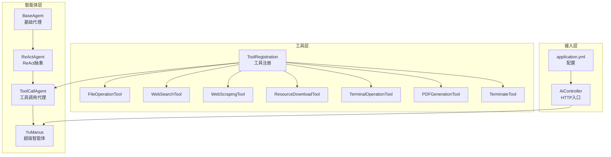
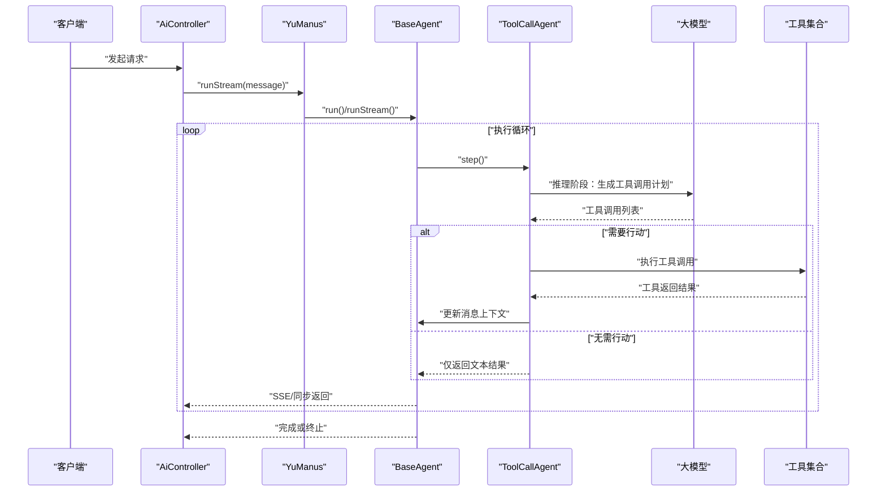
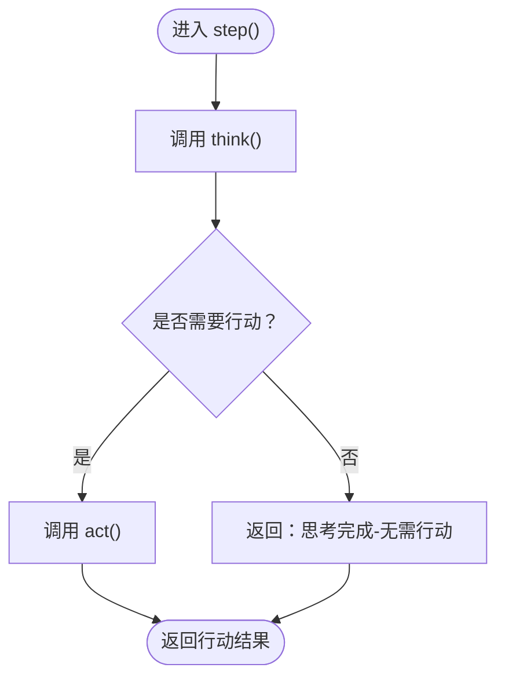
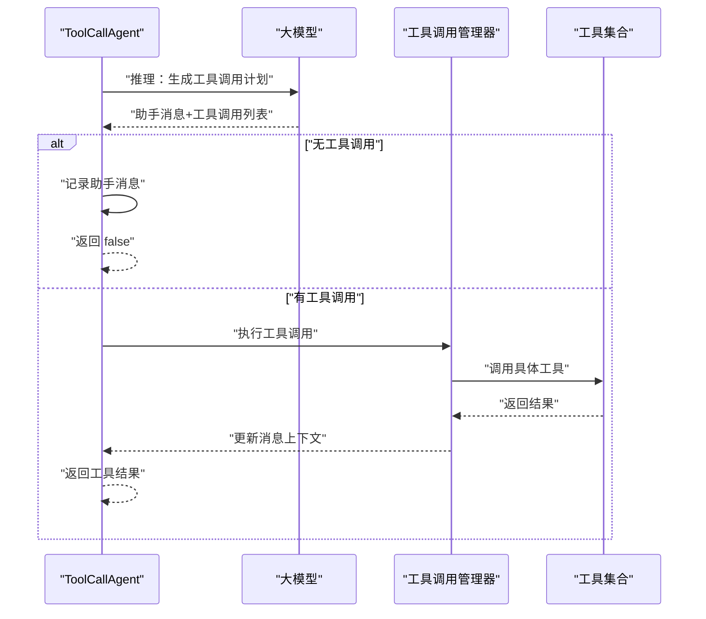
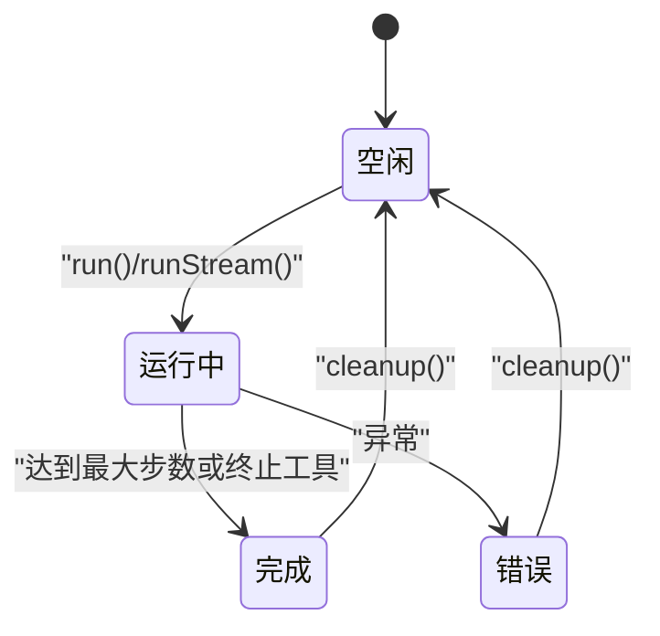
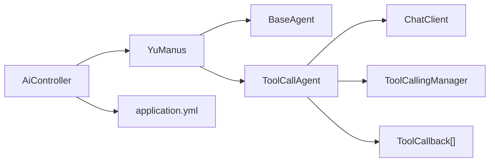

# ReAct智能体

<cite>
**本文引用的文件**
- [ReActAgent.java](file://src/main/java/com/yupi/yuaiagent/agent/ReActAgent.java)
- [BaseAgent.java](file://src/main/java/com/yupi/yuaiagent/agent/BaseAgent.java)
- [AgentState.java](file://src/main/java/com/yupi/yuaiagent/agent/model/AgentState.java)
- [ToolCallAgent.java](file://src/main/java/com/yupi/yuaiagent/agent/ToolCallAgent.java)
- [YuManus.java](file://src/main/java/com/yupi/yuaiagent/agent/YuManus.java)
- [ToolRegistration.java](file://src/main/java/com/yupi/yuaiagent/tools/ToolRegistration.java)
- [TerminalOperationTool.java](file://src/main/java/com/yupi/yuaiagent/tools/TerminalOperationTool.java)
- [WebSearchTool.java](file://src/main/java/com/yupi/yuaiagent/tools/WebSearchTool.java)
- [FileOperationTool.java](file://src/main/java/com/yupi/yuaiagent/tools/FileOperationTool.java)
- [PDFGenerationTool.java](file://src/main/java/com/yupi/yuaiagent/tools/PDFGenerationTool.java)
- [WebScrapingTool.java](file://src/main/java/com/yupi/yuaiagent/tools/WebScrapingTool.java)
- [AiController.java](file://src/main/java/com/yupi/yuaiagent/controller/AiController.java)
- [application.yml](file://src/main/resources/application.yml)
</cite>

## 目录
1. [引言](#引言)
2. [项目结构](#项目结构)
3. [核心组件](#核心组件)
4. [架构总览](#架构总览)
5. [详细组件分析](#详细组件分析)
6. [依赖分析](#依赖分析)
7. [性能考虑](#性能考虑)
8. [故障排查指南](#故障排查指南)
9. [结论](#结论)
10. [附录](#附录)

## 引言
本文件系统性梳理ReAct（Reasoning and Acting）智能体在本项目中的实现与工作机制，重点覆盖以下方面：
- ReAct模式的“思考-行动-观察”循环在代码中的落地方式
- 推理（Reasoning）与行动（Acting）两阶段的实现细节
- 智能体的消息格式与工具调用机制
- 状态转换与决策逻辑
- 配置参数与性能优化建议
- 实际使用案例与调试技巧

## 项目结构
该项目采用模块化组织，ReAct智能体位于agent包，配套工具位于tools包，控制器位于controller包，Spring配置位于resources。

图表来源
- [BaseAgent.java:1-193](file://src/main/java/com/yupi/yuaiagent/agent/BaseAgent.java#L1-L193)
- [ReActAgent.java:1-53](file://src/main/java/com/yupi/yuaiagent/agent/ReActAgent.java#L1-L53)
- [ToolCallAgent.java:1-136](file://src/main/java/com/yupi/yuaiagent/agent/ToolCallAgent.java#L1-L136)
- [YuManus.java:1-38](file://src/main/java/com/yupi/yuaiagent/agent/YuManus.java#L1-L38)
- [ToolRegistration.java:1-38](file://src/main/java/com/yupi/yuaiagent/tools/ToolRegistration.java#L1-L38)
- [AiController.java:1-106](file://src/main/java/com/yupi/yuaiagent/controller/AiController.java#L1-L106)
- [application.yml:1-66](file://src/main/resources/application.yml#L1-L66)

章节来源
- [BaseAgent.java:1-193](file://src/main/java/com/yupi/yuaiagent/agent/BaseAgent.java#L1-L193)
- [ReActAgent.java:1-53](file://src/main/java/com/yupi/yuaiagent/agent/ReActAgent.java#L1-L53)
- [ToolCallAgent.java:1-136](file://src/main/java/com/yupi/yuaiagent/agent/ToolCallAgent.java#L1-L136)
- [YuManus.java:1-38](file://src/main/java/com/yupi/yuaiagent/agent/YuManus.java#L1-L38)
- [ToolRegistration.java:1-38](file://src/main/java/com/yupi/yuaiagent/tools/ToolRegistration.java#L1-L38)
- [AiController.java:1-106](file://src/main/java/com/yupi/yuaiagent/controller/AiController.java#L1-L106)
- [application.yml:1-66](file://src/main/resources/application.yml#L1-L66)

## 核心组件
- 基础代理（BaseAgent）
  - 负责状态管理、执行循环、消息上下文维护、同步与流式输出
  - 关键点：状态枚举（IDLE/RUNNING/FINISHED/ERROR）、最大步数限制、消息列表、清理钩子
- ReAct代理（ReActAgent）
  - 抽象定义think()与act()，step()实现“先思考再行动”的单步循环
- 工具调用代理（ToolCallAgent）
  - 在think()阶段调用大模型以获取工具调用计划（含工具名与参数），并在act()阶段执行工具调用，更新消息上下文
- 超级智能体（YuManus）
  - 具体实现，配置系统提示词与下一步提示词，启用日志Advisor，设置最大步数
- 工具注册（ToolRegistration）
  - 统一注册可用工具，供代理在推理阶段选择与在行动阶段执行

章节来源
- [BaseAgent.java:1-193](file://src/main/java/com/yupi/yuaiagent/agent/BaseAgent.java#L1-L193)
- [ReActAgent.java:1-53](file://src/main/java/com/yupi/yuaiagent/agent/ReActAgent.java#L1-L53)
- [ToolCallAgent.java:1-136](file://src/main/java/com/yupi/yuaiagent/agent/ToolCallAgent.java#L1-L136)
- [YuManus.java:1-38](file://src/main/java/com/yupi/yuaiagent/agent/YuManus.java#L1-L38)
- [ToolRegistration.java:1-38](file://src/main/java/com/yupi/yuaiagent/tools/ToolRegistration.java#L1-L38)

## 架构总览
ReAct智能体通过“思考-行动-观察”循环迭代推进任务。思考阶段由大模型根据当前消息上下文与系统/下一步提示词生成工具调用计划；行动阶段执行工具调用并将结果回写到消息上下文，形成“观察”。该过程在BaseAgent的run/runStream循环中受状态与步数约束。

图表来源
- [AiController.java:100-104](file://src/main/java/com/yupi/yuaiagent/controller/AiController.java#L100-L104)
- [YuManus.java:15-36](file://src/main/java/com/yupi/yuaiagent/agent/YuManus.java#L15-L36)
- [ToolCallAgent.java:59-134](file://src/main/java/com/yupi/yuaiagent/agent/ToolCallAgent.java#L59-L134)
- [BaseAgent.java:53-92](file://src/main/java/com/yupi/yuaiagent/agent/BaseAgent.java#L53-L92)

## 详细组件分析

### ReActAgent：思考-行动抽象
- 思考阶段（think）：返回布尔值，指示是否需要执行行动
- 行动阶段（act）：执行具体的工具调用或逻辑处理
- 单步执行（step）：先think，若返回true则执行act，否则返回“思考完成-无需行动”

图表来源
- [ReActAgent.java:35-50](file://src/main/java/com/yupi/yuaiagent/agent/ReActAgent.java#L35-L50)

章节来源
- [ReActAgent.java:1-53](file://src/main/java/com/yupi/yuaiagent/agent/ReActAgent.java#L1-L53)

### ToolCallAgent：推理与行动的具体实现
- 推理阶段（think）
  - 将“下一步提示词”作为用户消息加入上下文
  - 调用大模型，传入系统提示词、工具回调数组与当前消息上下文
  - 解析助手消息中的工具调用列表，记录工具名与参数
  - 若无工具调用，则将助手消息加入上下文并返回false；否则返回true
- 行动阶段（act）
  - 使用工具调用管理器执行工具调用，更新消息上下文
  - 判断是否调用了终止工具，若是则将状态置为FINISHED
  - 汇总工具返回结果并返回

图表来源
- [ToolCallAgent.java:59-134](file://src/main/java/com/yupi/yuaiagent/agent/ToolCallAgent.java#L59-L134)

章节来源
- [ToolCallAgent.java:1-136](file://src/main/java/com/yupi/yuaiagent/agent/ToolCallAgent.java#L1-L136)

### BaseAgent：执行循环与状态管理
- run()/runStream()负责：
  - 状态校验与初始化
  - 将用户提示词加入消息上下文
  - 在maxSteps限制内循环执行step()
  - 异常时置ERROR状态，最终cleanup()
- 状态枚举（AgentState）：IDLE/RUNNING/FINISHED/ERROR

图表来源
- [BaseAgent.java:53-92](file://src/main/java/com/yupi/yuaiagent/agent/BaseAgent.java#L53-L92)
- [AgentState.java:1-27](file://src/main/java/com/yupi/yuaiagent/agent/model/AgentState.java#L1-L27)

章节来源
- [BaseAgent.java:1-193](file://src/main/java/com/yupi/yuaiagent/agent/BaseAgent.java#L1-L193)
- [AgentState.java:1-27](file://src/main/java/com/yupi/yuaiagent/agent/model/AgentState.java#L1-L27)

### YuManus：超级智能体
- 继承ToolCallAgent，配置系统提示词与下一步提示词，启用日志Advisor，设置最大步数
- 作为对外可直接使用的入口，通过AiController暴露SSE流式接口

章节来源
- [YuManus.java:1-38](file://src/main/java/com/yupi/yuaiagent/agent/YuManus.java#L1-L38)
- [AiController.java:100-104](file://src/main/java/com/yupi/yuaiagent/controller/AiController.java#L100-L104)

### 工具注册与工具集
- ToolRegistration统一注册所有可用工具，供代理在推理与行动阶段使用
- 已注册工具包括：文件读写、网页搜索、网页抓取、资源下载、终端命令、PDF生成、终止工具

章节来源
- [ToolRegistration.java:1-38](file://src/main/java/com/yupi/yuaiagent/tools/ToolRegistration.java#L1-L38)
- [FileOperationTool.java:1-41](file://src/main/java/com/yupi/yuaiagent/tools/FileOperationTool.java#L1-L41)
- [WebSearchTool.java:1-54](file://src/main/java/com/yupi/yuaiagent/tools/WebSearchTool.java#L1-L54)
- [WebScrapingTool.java:1-23](file://src/main/java/com/yupi/yuaiagent/tools/WebScrapingTool.java#L1-L23)
- [TerminalOperationTool.java:1-38](file://src/main/java/com/yupi/yuaiagent/tools/TerminalOperationTool.java#L1-L38)
- [PDFGenerationTool.java:1-53](file://src/main/java/com/yupi/yuaiagent/tools/PDFGenerationTool.java#L1-L53)

## 依赖分析
- 控制器依赖：AiController注入LoveApp、ToolCallback[]与DashScope ChatModel，提供SSE流式聊天接口
- 配置依赖：application.yml提供DashScope API Key、模型选择、日志级别等
- 组件耦合：
  - ToolCallAgent依赖ChatClient、ToolCallback[]、ToolCallingManager
  - BaseAgent与状态机解耦，便于扩展不同策略的代理
  - 工具注册集中化，便于动态扩展

图表来源
- [AiController.java:22-29](file://src/main/java/com/yupi/yuaiagent/controller/AiController.java#L22-L29)
- [YuManus.java:32-35](file://src/main/java/com/yupi/yuaiagent/agent/YuManus.java#L32-L35)
- [ToolCallAgent.java:44-52](file://src/main/java/com/yupi/yuaiagent/agent/ToolCallAgent.java#L44-L52)
- [application.yml:11-21](file://src/main/resources/application.yml#L11-L21)

章节来源
- [AiController.java:1-106](file://src/main/java/com/yupi/yuaiagent/controller/AiController.java#L1-L106)
- [application.yml:1-66](file://src/main/resources/application.yml#L1-L66)

## 性能考虑
- 步数限制：通过maxSteps避免无限循环，建议根据任务复杂度调整
- 工具调用批量化：在think阶段聚合工具调用，减少往返次数
- 日志级别：适当降低日志级别以减少I/O开销
- SSE超时：合理设置SseEmitter超时时间，避免长时间占用连接
- 工具幂等性：确保工具调用具备幂等性，便于重试与恢复

## 故障排查指南
- 状态异常
  - 现象：从非空闲状态调用run
  - 处理：检查状态机流转，确保在cleanup后回到空闲
- 工具调用失败
  - 现象：act阶段返回错误信息
  - 处理：查看工具返回结果与消息上下文，确认工具参数与权限
- 大模型调用异常
  - 现象：think阶段抛出异常
  - 处理：检查系统提示词、下一步提示词与工具回调配置
- SSE连接问题
  - 现象：连接超时或中断
  - 处理：检查超时设置、网络状况与服务端日志

章节来源
- [BaseAgent.java:53-92](file://src/main/java/com/yupi/yuaiagent/agent/BaseAgent.java#L53-L92)
- [ToolCallAgent.java:99-103](file://src/main/java/com/yupi/yuaiagent/agent/ToolCallAgent.java#L99-L103)
- [AiController.java:100-104](file://src/main/java/com/yupi/yuaiagent/controller/AiController.java#L100-L104)

## 结论
本项目以清晰的分层架构实现了ReAct智能体：BaseAgent提供通用执行循环与状态管理，ReActAgent抽象“思考-行动”，ToolCallAgent将推理与工具调用结合，YuManus作为可直接使用的超级智能体。通过集中化的工具注册与SSE流式输出，系统具备良好的扩展性与可观测性。

## 附录

### 消息格式与交互规范
- 思考阶段（推理）
  - 输入：系统提示词、消息上下文、下一步提示词、工具回调数组
  - 输出：助手消息与工具调用列表（工具名与参数）
- 行动阶段（执行）
  - 输入：消息上下文、工具调用计划
  - 输出：工具执行结果，更新消息上下文
- 观察阶段（上下文更新）
  - 将工具返回结果写入消息上下文，供后续推理使用

章节来源
- [ToolCallAgent.java:59-134](file://src/main/java/com/yupi/yuaiagent/agent/ToolCallAgent.java#L59-L134)

### 配置参数说明
- DashScope API Key与模型
  - 位置：application.yml
  - 作用：配置大模型服务与模型选择
- 日志级别
  - 位置：application.yml
  - 作用：提升Spring AI调用细节可见性
- 工具API Key
  - 位置：application.yml
  - 作用：网页搜索工具所需密钥

章节来源
- [application.yml:11-21](file://src/main/resources/application.yml#L11-L21)
- [application.yml:60-62](file://src/main/resources/application.yml#L60-L62)
- [application.yml:64-66](file://src/main/resources/application.yml#L64-L66)

### 实际使用案例
- 超级智能体SSE流式对话
  - 路径：/ai/manus/chat
  - 说明：通过AiController触发YuManus的流式输出，适合长对话与实时反馈
- 恋爱应用同步/流式对话
  - 路径：/ai/love_app/chat/sync 与 /ai/love_app/chat/sse
  - 说明：LoveApp提供基础对话与RAG增强能力，可选工具调用

章节来源
- [AiController.java:38-53](file://src/main/java/com/yupi/yuaiagent/controller/AiController.java#L38-L53)
- [AiController.java:77-92](file://src/main/java/com/yupi/yuaiagent/controller/AiController.java#L77-L92)
- [AiController.java:100-104](file://src/main/java/com/yupi/yuaiagent/controller/AiController.java#L100-L104)

### 调试技巧
- 启用DEBUG日志：在application.yml中提高日志级别，观察大模型调用细节
- 使用MyLoggerAdvisor：在YuManus构造中启用，打印关键交互信息
- 分步验证：先验证think阶段的工具选择是否符合预期，再验证act阶段的工具执行
- 终止工具：通过终止工具快速结束任务，便于测试循环控制

章节来源
- [application.yml:64-66](file://src/main/resources/application.yml#L64-L66)
- [YuManus.java:32-35](file://src/main/java/com/yupi/yuaiagent/agent/YuManus.java#L32-L35)
- [ToolCallAgent.java:122-128](file://src/main/java/com/yupi/yuaiagent/agent/ToolCallAgent.java#L122-L128)