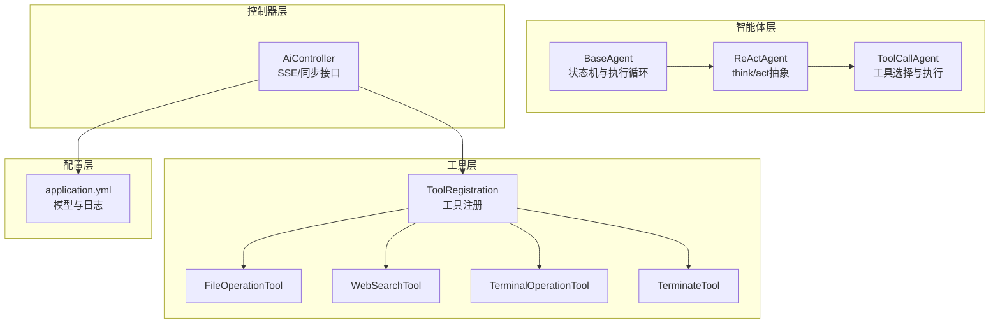
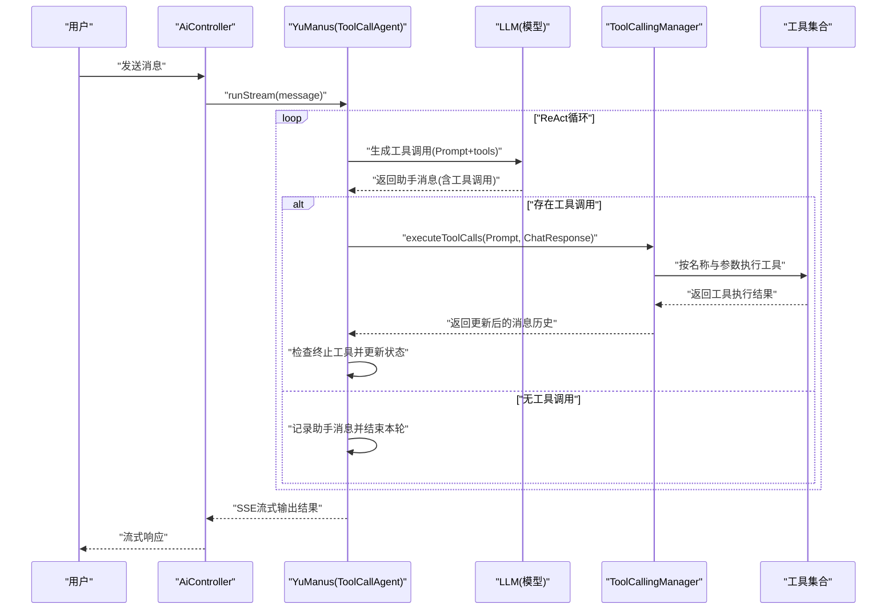
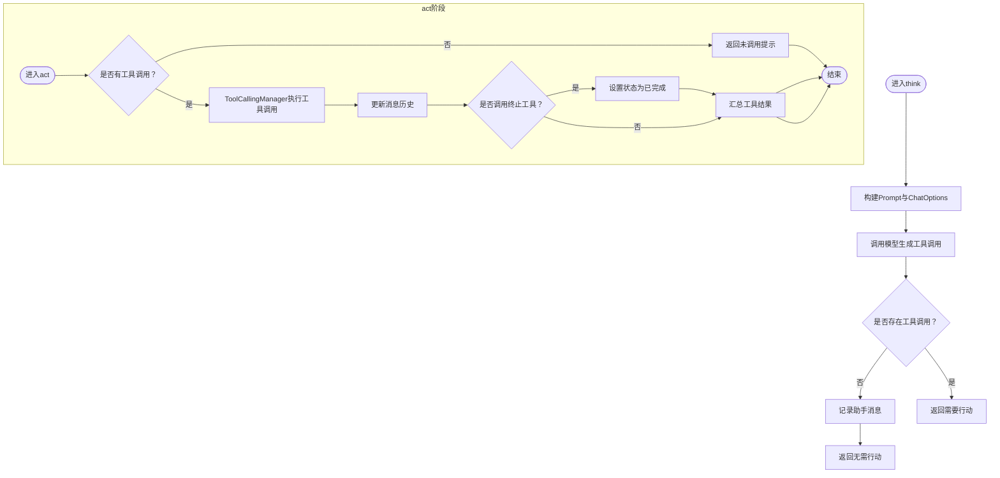
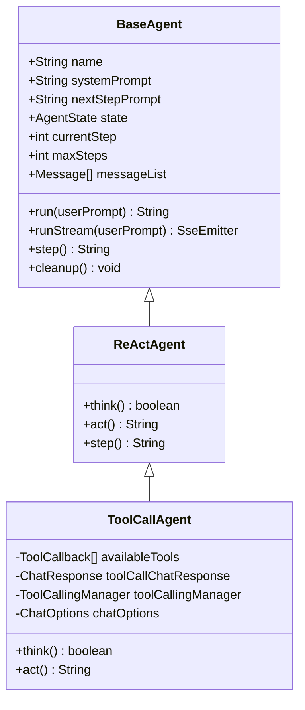
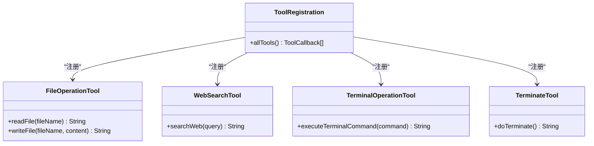
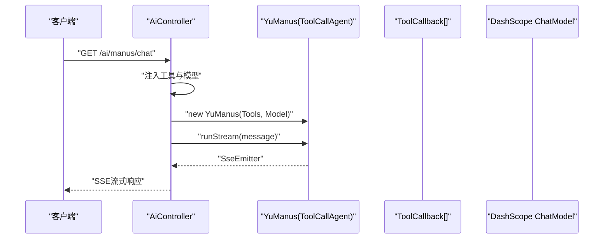
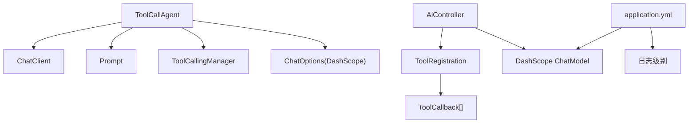

# 工具调用智能体

<cite>
**本文引用的文件**   
- [ToolCallAgent.java](file://src/main/java/com/yupi/yuaiagent/agent/ToolCallAgent.java)
- [BaseAgent.java](file://src/main/java/com/yupi/yuaiagent/agent/BaseAgent.java)
- [ReActAgent.java](file://src/main/java/com/yupi/yuaiagent/agent/ReActAgent.java)
- [AgentState.java](file://src/main/java/com/yupi/yuaiagent/agent/model/AgentState.java)
- [ToolRegistration.java](file://src/main/java/com/yupi/yuaiagent/tools/ToolRegistration.java)
- [FileOperationTool.java](file://src/main/java/com/yupi/yuaiagent/tools/FileOperationTool.java)
- [WebSearchTool.java](file://src/main/java/com/yupi/yuaiagent/tools/WebSearchTool.java)
- [TerminalOperationTool.java](file://src/main/java/com/yupi/yuaiagent/tools/TerminalOperationTool.java)
- [TerminateTool.java](file://src/main/java/com/yupi/yuaiagent/tools/TerminateTool.java)
- [FileConstant.java](file://src/main/java/com/yupi/yuaiagent/constant/FileConstant.java)
- [application.yml](file://src/main/resources/application.yml)
- [AiController.java](file://src/main/java/com/yupi/yuaiagent/controller/AiController.java)
- [YuAiAgentApplication.java](file://src/main/java/com/yupi/yuaiagent/YuAiAgentApplication.java)
- [FileOperationToolTest.java](file://src/test/java/com/yupi/yuaiagent/tools/FileOperationToolTest.java)
</cite>

## 目录
1. [简介](#简介)
2. [项目结构](#项目结构)
3. [核心组件](#核心组件)
4. [架构总览](#架构总览)
5. [详细组件分析](#详细组件分析)
6. [依赖分析](#依赖分析)
7. [性能考虑](#性能考虑)
8. [故障排查指南](#故障排查指南)
9. [结论](#结论)
10. [附录](#附录)

## 简介
本文件面向“工具调用智能体”（ToolCallAgent），系统性解析其工具选择与调用机制，覆盖以下主题：
- 工具评估与选择：智能体如何依据用户需求与上下文选择工具、如何解析大模型返回的工具调用列表。
- 调用执行流程：从“思考-行动”的ReAct循环，到工具调用管理器执行、上下文更新与终止条件判断。
- 错误处理：模型调用失败、工具执行异常、终止工具触发等场景的处理策略。
- 上下文与状态：消息历史、代理状态机、最大步数限制与清理逻辑。
- 配置与调优：Spring AI集成、DashScope选项、日志级别、工具注册与可用工具集合。
- 监控与日志：建议的最佳实践与可观测性要点。

## 项目结构
该模块围绕“智能体-工具-控制器-配置”四层组织：
- 智能体层：BaseAgent、ReActAgent、ToolCallAgent，定义状态机、执行循环与工具调用智能体。
- 工具层：ToolRegistration集中注册工具；各具体工具实现（文件、网络搜索、终端、终止等）。
- 控制器层：AiController对外暴露SSE/同步接口，注入工具与模型。
- 配置层：application.yml定义模型与日志级别，便于调试与性能观察。

**图表来源**
- [BaseAgent.java:17-193](file://src/main/java/com/yupi/yuaiagent/agent/BaseAgent.java#L17-L193)
- [ReActAgent.java:7-52](file://src/main/java/com/yupi/yuaiagent/agent/ReActAgent.java#L7-L52)
- [ToolCallAgent.java:24-136](file://src/main/java/com/yupi/yuaiagent/agent/ToolCallAgent.java#L24-L136)
- [ToolRegistration.java:9-38](file://src/main/java/com/yupi/yuaiagent/tools/ToolRegistration.java#L9-L38)
- [AiController.java:18-106](file://src/main/java/com/yupi/yuaiagent/controller/AiController.java#L18-L106)
- [application.yml:11-66](file://src/main/resources/application.yml#L11-L66)

**章节来源**
- [BaseAgent.java:17-193](file://src/main/java/com/yupi/yuaiagent/agent/BaseAgent.java#L17-L193)
- [ReActAgent.java:7-52](file://src/main/java/com/yupi/yuaiagent/agent/ReActAgent.java#L7-L52)
- [ToolCallAgent.java:24-136](file://src/main/java/com/yupi/yuaiagent/agent/ToolCallAgent.java#L24-L136)
- [ToolRegistration.java:9-38](file://src/main/java/com/yupi/yuaiagent/tools/ToolRegistration.java#L9-L38)
- [AiController.java:18-106](file://src/main/java/com/yupi/yuaiagent/controller/AiController.java#L18-L106)
- [application.yml:11-66](file://src/main/resources/application.yml#L11-L66)

## 核心组件
- ToolCallAgent：继承ReActAgent，实现“思考-行动”中的工具选择与执行，禁用Spring AI内置工具执行，自管上下文与选项。
- ReActAgent：定义think/act抽象与step执行循环。
- BaseAgent：统一的状态机、消息历史、最大步数与清理逻辑。
- 工具注册：集中注册所有可用工具，形成ToolCallback数组供智能体使用。
- 工具实现：文件读写、网页搜索、终端命令执行、终止工具等。
- 控制器：对外提供SSE流式对话接口，注入工具与模型。
- 配置：DashScope模型、日志级别、外部搜索API Key等。

**章节来源**
- [ToolCallAgent.java:24-136](file://src/main/java/com/yupi/yuaiagent/agent/ToolCallAgent.java#L24-L136)
- [ReActAgent.java:7-52](file://src/main/java/com/yupi/yuaiagent/agent/ReActAgent.java#L7-L52)
- [BaseAgent.java:17-193](file://src/main/java/com/yupi/yuaiagent/agent/BaseAgent.java#L17-L193)
- [ToolRegistration.java:9-38](file://src/main/java/com/yupi/yuaiagent/tools/ToolRegistration.java#L9-L38)
- [AiController.java:18-106](file://src/main/java/com/yupi/yuaiagent/controller/AiController.java#L18-L106)
- [application.yml:11-66](file://src/main/resources/application.yml#L11-L66)

## 架构总览
工具调用智能体采用“ReAct循环 + 自主工具调用管理”的架构：
- 输入：用户消息与系统提示词。
- 思考阶段：构建Prompt，调用大模型，解析助手消息中的工具调用列表。
- 行动阶段：使用工具调用管理器执行工具，更新消息历史，检查终止工具并切换状态。
- 输出：返回工具执行结果或自然语言总结。

**图表来源**
- [AiController.java:94-104](file://src/main/java/com/yupi/yuaiagent/controller/AiController.java#L94-L104)
- [ToolCallAgent.java:59-134](file://src/main/java/com/yupi/yuaiagent/agent/ToolCallAgent.java#L59-L134)
- [ReActAgent.java:35-50](file://src/main/java/com/yupi/yuaiagent/agent/ReActAgent.java#L35-L50)
- [BaseAgent.java:47-92](file://src/main/java/com/yupi/yuaiagent/agent/BaseAgent.java#L47-L92)

## 详细组件分析

### ToolCallAgent：工具选择与执行
- 工具选择
  - 在think阶段，构造Prompt并调用模型，获取助手消息与其中的工具调用列表。
  - 若工具调用列表为空，则记录助手消息并返回“无需行动”；否则返回“需要行动”。
- 工具执行
  - 在act阶段，使用工具调用管理器执行工具调用，更新消息历史。
  - 检查工具返回中是否存在终止工具，若存在则将代理状态设为已完成。
  - 将各工具返回结果汇总后返回给上层。
- 错误处理
  - think阶段捕获异常并记录错误消息，返回“无需行动”。
  - act阶段依赖工具调用管理器与工具实现的异常处理，返回可读错误信息。

**图表来源**
- [ToolCallAgent.java:59-134](file://src/main/java/com/yupi/yuaiagent/agent/ToolCallAgent.java#L59-L134)

**章节来源**
- [ToolCallAgent.java:24-136](file://src/main/java/com/yupi/yuaiagent/agent/ToolCallAgent.java#L24-L136)

### ReActAgent与BaseAgent：状态机与执行循环
- BaseAgent
  - 维护代理状态（空闲/运行中/已完成/错误）、消息历史、最大步数。
  - 提供run与runStream两种执行方式，支持SSE流式输出。
  - 在finally中统一清理资源，保证异常安全。
- ReActAgent
  - 定义think/act抽象，并在step中先think再act，异常时返回可读错误信息。

**图表来源**
- [BaseAgent.java:17-193](file://src/main/java/com/yupi/yuaiagent/agent/BaseAgent.java#L17-L193)
- [ReActAgent.java:7-52](file://src/main/java/com/yupi/yuaiagent/agent/ReActAgent.java#L7-L52)
- [ToolCallAgent.java:24-136](file://src/main/java/com/yupi/yuaiagent/agent/ToolCallAgent.java#L24-L136)

**章节来源**
- [BaseAgent.java:17-193](file://src/main/java/com/yupi/yuaiagent/agent/BaseAgent.java#L17-L193)
- [ReActAgent.java:7-52](file://src/main/java/com/yupi/yuaiagent/agent/ReActAgent.java#L7-L52)
- [AgentState.java:1-27](file://src/main/java/com/yupi/yuaiagent/agent/model/AgentState.java#L1-L27)

### 工具注册与工具实现
- 工具注册
  - ToolRegistration集中创建并导出ToolCallback数组，包含文件操作、网页搜索、网页抓取、资源下载、终端操作、PDF生成、终止工具。
- 工具实现
  - 文件操作：读写文件，异常时返回错误信息。
  - 网页搜索：调用外部搜索API，解析前N条结果，异常时返回错误信息。
  - 终端操作：执行系统命令，收集输出与退出码，异常时返回错误信息。
  - 终止工具：标记任务结束，触发状态变更。

**图表来源**
- [ToolRegistration.java:9-38](file://src/main/java/com/yupi/yuaiagent/tools/ToolRegistration.java#L9-L38)
- [FileOperationTool.java:8-41](file://src/main/java/com/yupi/yuaiagent/tools/FileOperationTool.java#L8-L41)
- [WebSearchTool.java:15-54](file://src/main/java/com/yupi/yuaiagent/tools/WebSearchTool.java#L15-L54)
- [TerminalOperationTool.java:10-38](file://src/main/java/com/yupi/yuaiagent/tools/TerminalOperationTool.java#L10-L38)
- [TerminateTool.java:5-18](file://src/main/java/com/yupi/yuaiagent/tools/TerminateTool.java#L5-L18)

**章节来源**
- [ToolRegistration.java:9-38](file://src/main/java/com/yupi/yuaiagent/tools/ToolRegistration.java#L9-L38)
- [FileOperationTool.java:8-41](file://src/main/java/com/yupi/yuaiagent/tools/FileOperationTool.java#L8-L41)
- [WebSearchTool.java:15-54](file://src/main/java/com/yupi/yuaiagent/tools/WebSearchTool.java#L15-L54)
- [TerminalOperationTool.java:10-38](file://src/main/java/com/yupi/yuaiagent/tools/TerminalOperationTool.java#L10-L38)
- [TerminateTool.java:5-18](file://src/main/java/com/yupi/yuaiagent/tools/TerminateTool.java#L5-L18)
- [FileConstant.java:1-13](file://src/main/java/com/yupi/yuaiagent/constant/FileConstant.java#L1-L13)

### 控制器与应用入口
- 控制器
  - AiController提供SSE流式接口，注入工具数组与DashScope Chat Model，创建工具调用智能体并返回SseEmitter。
- 应用入口
  - YuAiAgentApplication排除数据库自动配置，便于本地开发与部署。

**图表来源**
- [AiController.java:94-104](file://src/main/java/com/yupi/yuaiagent/controller/AiController.java#L94-L104)
- [YuAiAgentApplication.java:7-17](file://src/main/java/com/yupi/yuaiagent/YuAiAgentApplication.java#L7-L17)

**章节来源**
- [AiController.java:18-106](file://src/main/java/com/yupi/yuaiagent/controller/AiController.java#L18-L106)
- [YuAiAgentApplication.java:7-17](file://src/main/java/com/yupi/yuaiagent/YuAiAgentApplication.java#L7-L17)

## 依赖分析
- 组件耦合
  - ToolCallAgent依赖Spring AI的ChatClient、Prompt、ToolCallingManager与ChatOptions。
  - 工具通过ToolRegistration集中注册，控制器注入ToolCallback数组。
- 外部依赖
  - DashScope模型配置与日志级别在application.yml中定义。
  - 网页搜索工具依赖外部SearchAPI，需配置API Key。

**图表来源**
- [ToolCallAgent.java:44-52](file://src/main/java/com/yupi/yuaiagent/agent/ToolCallAgent.java#L44-L52)
- [ToolRegistration.java:18-36](file://src/main/java/com/yupi/yuaiagent/tools/ToolRegistration.java#L18-L36)
- [AiController.java:22-30](file://src/main/java/com/yupi/yuaiagent/controller/AiController.java#L22-L30)
- [application.yml:11-66](file://src/main/resources/application.yml#L11-L66)

**章节来源**
- [ToolCallAgent.java:44-52](file://src/main/java/com/yupi/yuaiagent/agent/ToolCallAgent.java#L44-L52)
- [ToolRegistration.java:18-36](file://src/main/java/com/yupi/yuaiagent/tools/ToolRegistration.java#L18-L36)
- [AiController.java:22-30](file://src/main/java/com/yupi/yuaiagent/controller/AiController.java#L22-L30)
- [application.yml:11-66](file://src/main/resources/application.yml#L11-L66)

## 性能考虑
- 工具选择与调用
  - 减少不必要的工具调用：在think阶段仅当模型明确返回工具调用时才进入act，避免无效调用。
  - 并行化工具执行：当前实现串行执行工具调用，如需提升吞吐可在工具层面引入并发（注意工具间资源竞争与幂等性）。
- 消息历史与上下文
  - 控制消息长度与轮次，避免上下文过长导致延迟与成本上升。
  - 对工具返回进行裁剪与摘要，减少后续模型输入大小。
- 模型与网络
  - 合理设置最大步数，防止无限循环。
  - 为外部API（如网页搜索）设置超时与重试策略，避免阻塞主流程。
- 日志与可观测性
  - 开启DEBUG级别日志以观察Spring AI内部调用细节，便于定位性能瓶颈。
  - 为工具执行增加耗时统计与错误计数，形成指标上报。

**章节来源**
- [application.yml:63-66](file://src/main/resources/application.yml#L63-L66)
- [BaseAgent.java:37-42](file://src/main/java/com/yupi/yuaiagent/agent/BaseAgent.java#L37-L42)

## 故障排查指南
- 模型调用失败
  - 现象：think阶段抛出异常，记录错误消息并返回“无需行动”。
  - 排查：检查模型配置（API Key、模型名）、网络连通性与限流情况。
- 工具不可用或参数错误
  - 现象：act阶段工具返回错误信息或未产生预期结果。
  - 排查：确认工具已正确注册、参数类型匹配、外部服务可用（如搜索引擎API Key）。
- 终止工具未生效
  - 现象：调用终止工具但代理未结束。
  - 排查：确认工具返回名称为“doTerminate”，并在act阶段被识别与状态更新。
- SSE连接问题
  - 现象：SSE超时或连接提前关闭。
  - 排查：检查SSE超时配置、网络稳定性与控制器异常处理逻辑。

**章节来源**
- [ToolCallAgent.java:99-103](file://src/main/java/com/yupi/yuaiagent/agent/ToolCallAgent.java#L99-L103)
- [ToolCallAgent.java:122-128](file://src/main/java/com/yupi/yuaiagent/agent/ToolCallAgent.java#L122-L128)
- [BaseAgent.java:100-177](file://src/main/java/com/yupi/yuaiagent/agent/BaseAgent.java#L100-L177)

## 结论
ToolCallAgent通过ReAct循环与自管工具调用管理器，实现了可控、可观测且可扩展的工具调用智能体。其关键优势在于：
- 明确的工具选择与执行边界，便于调试与优化。
- 完整的状态机与消息历史管理，保障流程稳定。
- 集中的工具注册与清晰的工具职责划分，便于新增与替换工具。
建议结合性能与可观测性配置，持续迭代工具集与调用策略，以满足复杂业务场景的需求。

## 附录

### 工具调用智能体配置项
- 模型配置
  - DashScope API Key、模型名、聊天选项（禁用内置工具执行）。
- 日志级别
  - Spring AI DEBUG级别，便于观察内部调用细节。
- 外部服务
  - 搜索API Key，用于网页搜索工具。

**章节来源**
- [application.yml:11-66](file://src/main/resources/application.yml#L11-L66)
- [ToolCallAgent.java:48-51](file://src/main/java/com/yupi/yuaiagent/agent/ToolCallAgent.java#L48-L51)

### 工具调用智能体的监控与日志记录最佳实践
- 关键指标
  - 工具调用次数与成功率、平均耗时、错误分布。
  - 模型调用次数、Token消耗、失败率。
- 日志建议
  - think/act阶段的关键事件与参数摘要。
  - 工具调用前后的时间戳与结果摘要。
  - 异常栈与上下文信息（如消息历史片段）。

**章节来源**
- [application.yml:63-66](file://src/main/resources/application.yml#L63-L66)
- [ToolCallAgent.java:82-89](file://src/main/java/com/yupi/yuaiagent/agent/ToolCallAgent.java#L82-L89)
- [ToolCallAgent.java:129-132](file://src/main/java/com/yupi/yuaiagent/agent/ToolCallAgent.java#L129-L132)