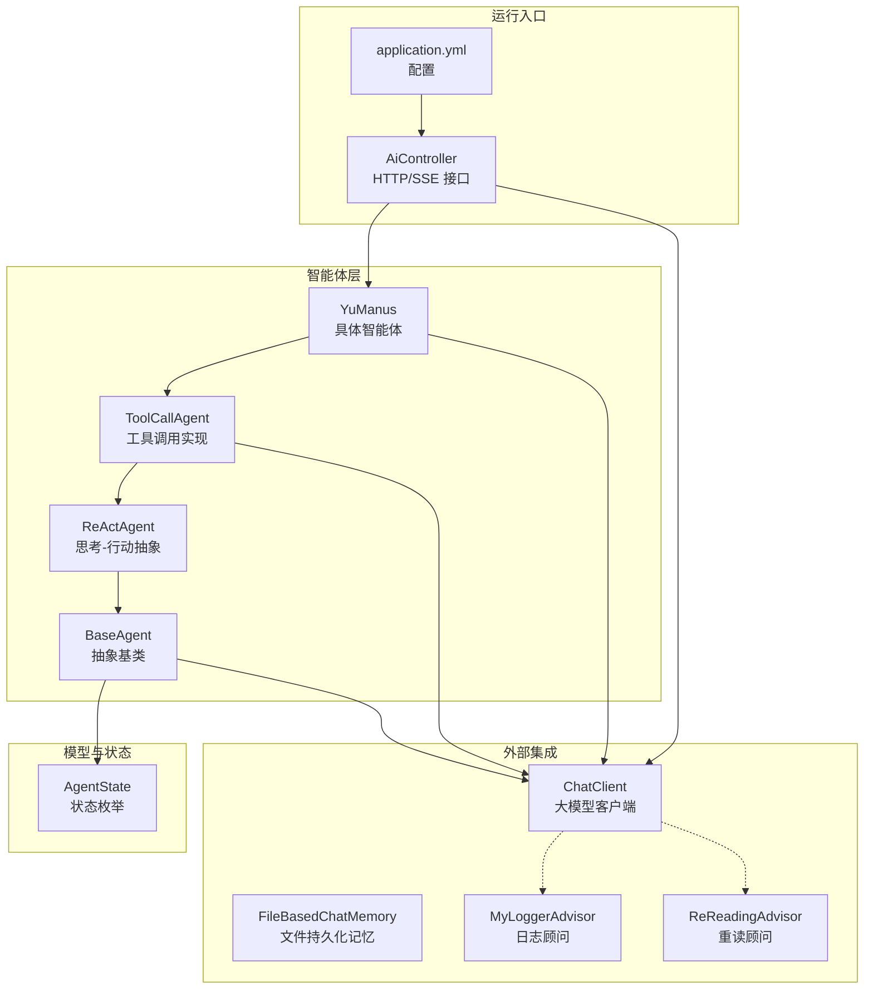
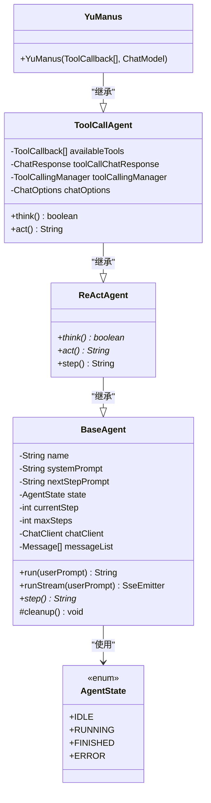
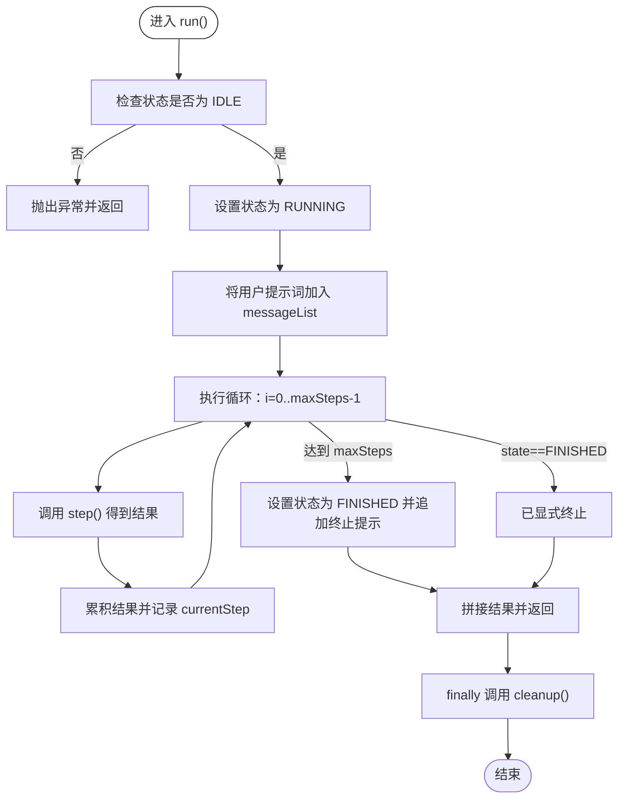
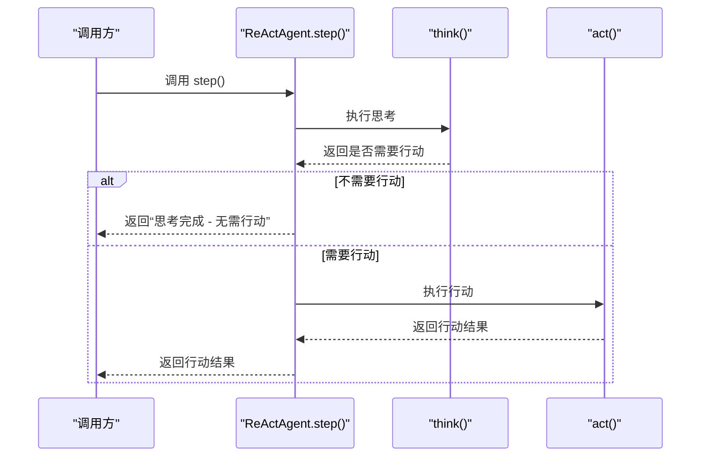
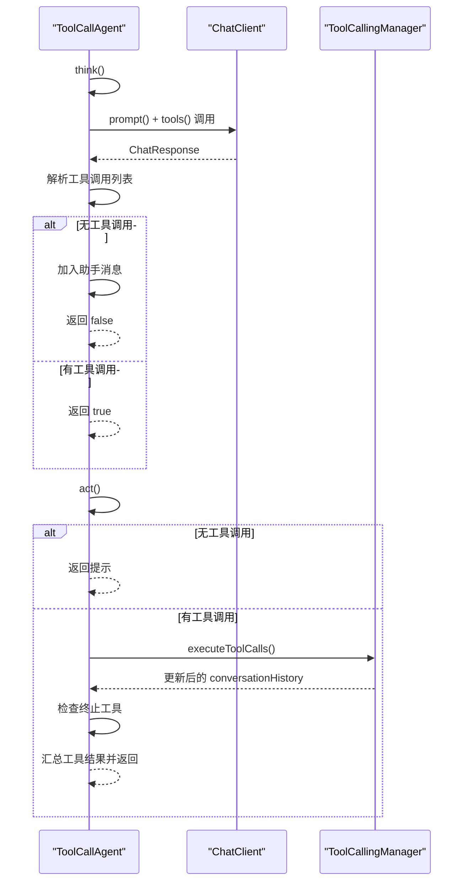
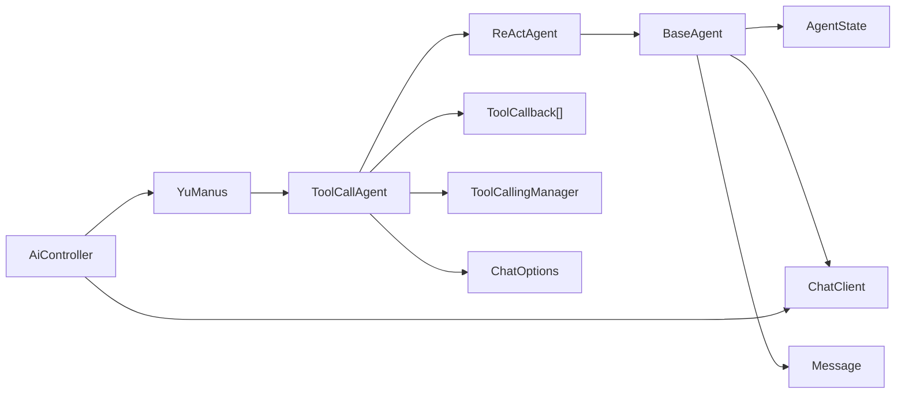

# 智能体基础架构

<cite>
**本文引用的文件**
- [BaseAgent.java](file://src/main/java/com/yupi/yuaiagent/agent/BaseAgent.java)
- [AgentState.java](file://src/main/java/com/yupi/yuaiagent/agent/model/AgentState.java)
- [ReActAgent.java](file://src/main/java/com/yupi/yuaiagent/agent/ReActAgent.java)
- [ToolCallAgent.java](file://src/main/java/com/yupi/yuaiagent/agent/ToolCallAgent.java)
- [YuManus.java](file://src/main/java/com/yupi/yuaiagent/agent/YuManus.java)
- [FileBasedChatMemory.java](file://src/main/java/com/yupi/yuaiagent/chatmemory/FileBasedChatMemory.java)
- [MyLoggerAdvisor.java](file://src/main/java/com/yupi/yuaiagent/advisor/MyLoggerAdvisor.java)
- [ReReadingAdvisor.java](file://src/main/java/com/yupi/yuaiagent/advisor/ReReadingAdvisor.java)
- [AiController.java](file://src/main/java/com/yupi/yuaiagent/controller/AiController.java)
- [application.yml](file://src/main/resources/application.yml)
- [YuManusTest.java](file://src/test/java/com/yupi/yuaiagent/agent/YuManusTest.java)
</cite>

## 目录
1. [简介](#简介)
2. [项目结构](#项目结构)
3. [核心组件](#核心组件)
4. [架构总览](#架构总览)
5. [详细组件分析](#详细组件分析)
6. [依赖分析](#依赖分析)
7. [性能考虑](#性能考虑)
8. [故障排查指南](#故障排查指南)
9. [结论](#结论)
10. [附录](#附录)

## 简介
本文件面向智能体基础架构的技术文档，重点围绕 BaseAgent 抽象基类的设计与实现进行系统性解析。内容涵盖：
- 智能体状态管理：IDLE、RUNNING、FINISHED、ERROR 的状态机设计与转换约束
- 执行循环机制：maxSteps 限制、currentStep 计数与异常处理策略
- 同步执行 run() 与流式执行 runStream() 的差异及适用场景
- 消息上下文管理：messageList 的维护与 ChatClient 的交互
- 扩展开发最佳实践：如何继承 BaseAgent 并实现自定义 step()
- 生命周期与资源清理：cleanup() 的职责与调用时机
- 以 ReActAgent、ToolCallAgent、YuManus 为例的完整链路说明

## 项目结构
该工程采用按功能域分层的组织方式，智能体相关代码集中在 agent 包，配套有状态模型、工具、顾问（Advisor）、控制器与配置等模块。

图表来源
- [BaseAgent.java:1-193](file://src/main/java/com/yupi/yuaiagent/agent/BaseAgent.java#L1-L193)
- [AgentState.java:1-27](file://src/main/java/com/yupi/yuaiagent/agent/model/AgentState.java#L1-L27)
- [ReActAgent.java:1-53](file://src/main/java/com/yupi/yuaiagent/agent/ReActAgent.java#L1-L53)
- [ToolCallAgent.java:1-136](file://src/main/java/com/yupi/yuaiagent/agent/ToolCallAgent.java#L1-L136)
- [YuManus.java:1-38](file://src/main/java/com/yupi/yuaiagent/agent/YuManus.java#L1-L38)
- [FileBasedChatMemory.java:1-94](file://src/main/java/com/yupi/yuaiagent/chatmemory/FileBasedChatMemory.java#L1-L94)
- [MyLoggerAdvisor.java:1-54](file://src/main/java/com/yupi/yuaiagent/advisor/MyLoggerAdvisor.java#L1-L54)
- [ReReadingAdvisor.java:1-57](file://src/main/java/com/yupi/yuaiagent/advisor/ReReadingAdvisor.java#L1-L57)
- [AiController.java:1-106](file://src/main/java/com/yupi/yuaiagent/controller/AiController.java#L1-L106)
- [application.yml:1-66](file://src/main/resources/application.yml#L1-L66)

章节来源
- [BaseAgent.java:1-193](file://src/main/java/com/yupi/yuaiagent/agent/BaseAgent.java#L1-L193)
- [AgentState.java:1-27](file://src/main/java/com/yupi/yuaiagent/agent/model/AgentState.java#L1-L27)
- [ReActAgent.java:1-53](file://src/main/java/com/yupi/yuaiagent/agent/ReActAgent.java#L1-L53)
- [ToolCallAgent.java:1-136](file://src/main/java/com/yupi/yuaiagent/agent/ToolCallAgent.java#L1-L136)
- [YuManus.java:1-38](file://src/main/java/com/yupi/yuaiagent/agent/YuManus.java#L1-L38)
- [FileBasedChatMemory.java:1-94](file://src/main/java/com/yupi/yuaiagent/chatmemory/FileBasedChatMemory.java#L1-L94)
- [MyLoggerAdvisor.java:1-54](file://src/main/java/com/yupi/yuaiagent/advisor/MyLoggerAdvisor.java#L1-L54)
- [ReReadingAdvisor.java:1-57](file://src/main/java/com/yupi/yuaiagent/advisor/ReReadingAdvisor.java#L1-L57)
- [AiController.java:1-106](file://src/main/java/com/yupi/yuaiagent/controller/AiController.java#L1-L106)
- [application.yml:1-66](file://src/main/resources/application.yml#L1-L66)

## 核心组件
- BaseAgent：定义智能体的统一抽象，负责状态管理、执行循环、消息上下文与资源清理；子类需实现 step()。
- AgentState：定义智能体的四种状态，作为状态机的合法值集合。
- ReActAgent：在 BaseAgent 基础上引入 think()/act() 的思考-行动模式，step() 默认先 think 再 act。
- ToolCallAgent：在 ReActAgent 基础上实现“思考”阶段的工具选择与“行动”阶段的工具执行，支持终止工具。
- YuManus：具体智能体实现，配置系统提示词、下一步提示词、最大步数、ChatClient 与顾问。
- FileBasedChatMemory：基于文件的对话记忆实现，可作为 ChatMemory 的持久化存储。
- MyLoggerAdvisor/ReReadingAdvisor：顾问（Advisor），用于增强 ChatClient 的调用前后日志与提示词重写。
- AiController：对外提供同步与流式（SSE）调用接口，连接前端与智能体。
- application.yml：全局配置，包含大模型接入、日志级别等。

章节来源
- [BaseAgent.java:17-25](file://src/main/java/com/yupi/yuaiagent/agent/BaseAgent.java#L17-L25)
- [AgentState.java:6-27](file://src/main/java/com/yupi/yuaiagent/agent/model/AgentState.java#L6-L27)
- [ReActAgent.java:14-52](file://src/main/java/com/yupi/yuaiagent/agent/ReActAgent.java#L14-L52)
- [ToolCallAgent.java:30-136](file://src/main/java/com/yupi/yuaiagent/agent/ToolCallAgent.java#L30-L136)
- [YuManus.java:13-37](file://src/main/java/com/yupi/yuaiagent/agent/YuManus.java#L13-L37)
- [FileBasedChatMemory.java:20-94](file://src/main/java/com/yupi/yuaiagent/chatmemory/FileBasedChatMemory.java#L20-L94)
- [MyLoggerAdvisor.java:18-54](file://src/main/java/com/yupi/yuaiagent/advisor/MyLoggerAdvisor.java#L18-L54)
- [ReReadingAdvisor.java:16-57](file://src/main/java/com/yupi/yuaiagent/advisor/ReReadingAdvisor.java#L16-L57)
- [AiController.java:18-106](file://src/main/java/com/yupi/yuaiagent/controller/AiController.java#L18-L106)
- [application.yml:11-66](file://src/main/resources/application.yml#L11-L66)

## 架构总览
下面以类图展示智能体核心类之间的继承与组合关系，并标注关键方法与职责。

图表来源
- [BaseAgent.java:25-193](file://src/main/java/com/yupi/yuaiagent/agent/BaseAgent.java#L25-L193)
- [AgentState.java:6-27](file://src/main/java/com/yupi/yuaiagent/agent/model/AgentState.java#L6-L27)
- [ReActAgent.java:14-52](file://src/main/java/com/yupi/yuaiagent/agent/ReActAgent.java#L14-L52)
- [ToolCallAgent.java:30-136](file://src/main/java/com/yupi/yuaiagent/agent/ToolCallAgent.java#L30-L136)
- [YuManus.java:13-37](file://src/main/java/com/yupi/yuaiagent/agent/YuManus.java#L13-L37)

## 详细组件分析

### BaseAgent：状态机与执行循环
- 状态管理
  - 初始状态为 IDLE；RUNNING 由 run()/runStream() 在校验通过后进入；FINISHED 在达到 maxSteps 或显式终止时进入；ERROR 在异常发生或 SSE 超时时进入。
  - 状态转换受严格约束：非 IDLE 状态不可再次 run，空提示词不可执行。
- 执行循环
  - currentStep 从 1 开始递增，循环条件为 i < maxSteps 且 state != FINISHED。
  - 每步调用 step()，并将结果累积；达到 maxSteps 后自动设置 FINISHED 并追加终止提示。
- 异常处理
  - run() 捕获异常并设置 ERROR 状态，返回错误信息；runStream() 将错误通过 SSE 发送并 complete。
  - finally 中统一调用 cleanup()，确保资源释放。
- 消息上下文
  - run()/runStream() 在开始时将用户提示词加入 messageList，后续由子类维护（如 ToolCallAgent 在 think/act 中更新）。
- 同步 vs 流式
  - run() 返回最终聚合字符串；runStream() 通过 SseEmitter 逐条推送每步结果，适合长耗时任务的实时反馈。

图表来源
- [BaseAgent.java:53-92](file://src/main/java/com/yupi/yuaiagent/agent/BaseAgent.java#L53-L92)

章节来源
- [BaseAgent.java:34-46](file://src/main/java/com/yupi/yuaiagent/agent/BaseAgent.java#L34-L46)
- [BaseAgent.java:53-92](file://src/main/java/com/yupi/yuaiagent/agent/BaseAgent.java#L53-L92)
- [BaseAgent.java:100-177](file://src/main/java/com/yupi/yuaiagent/agent/BaseAgent.java#L100-L177)
- [BaseAgent.java:189-192](file://src/main/java/com/yupi/yuaiagent/agent/BaseAgent.java#L189-L192)

### AgentState：状态枚举
- IDLE：初始空闲态，等待执行。
- RUNNING：正在执行，可能处于循环中。
- FINISHED：正常结束，通常因达到 maxSteps 或显式终止。
- ERROR：异常或超时导致的错误态。

章节来源
- [AgentState.java:6-27](file://src/main/java/com/yupi/yuaiagent/agent/model/AgentState.java#L6-L27)

### ReActAgent：思考-行动模式
- think()：根据当前上下文决定是否需要执行行动，返回布尔值。
- act()：执行决策后的行动，返回结果字符串。
- step()：默认先 think()，若无需行动则返回提示；否则执行 act() 并返回结果。
- 异常处理：捕获异常并返回错误信息，同时打印日志。

图表来源
- [ReActAgent.java:35-50](file://src/main/java/com/yupi/yuaiagent/agent/ReActAgent.java#L35-L50)

章节来源
- [ReActAgent.java:14-52](file://src/main/java/com/yupi/yuaiagent/agent/ReActAgent.java#L14-L52)

### ToolCallAgent：工具调用实现
- think()：
  - 若存在 nextStepPrompt，则将其作为用户消息加入 messageList。
  - 基于当前 messageList 与可用工具调用 ChatClient，获取 ChatResponse。
  - 解析 AssistantMessage 的工具调用列表，记录工具选择信息；若无工具调用则手动加入助手消息，返回 false；否则返回 true。
- act()：
  - 若无工具调用，返回提示；否则通过 ToolCallingManager 执行工具调用，更新 messageList。
  - 检测是否存在终止工具调用，若有则设置状态为 FINISHED。
  - 汇总工具返回结果并返回。

图表来源
- [ToolCallAgent.java:59-136](file://src/main/java/com/yupi/yuaiagent/agent/ToolCallAgent.java#L59-L136)

章节来源
- [ToolCallAgent.java:30-136](file://src/main/java/com/yupi/yuaiagent/agent/ToolCallAgent.java#L30-L136)

### YuManus：具体智能体实现
- 构造函数中设置 name、systemPrompt、nextStepPrompt、maxSteps，并通过 ChatClient.builder() 绑定 ChatModel 与顾问（Advisor）。
- 作为 ToolCallAgent 的实例，具备完整的 ReAct+工具调用能力，适合复杂任务的自主规划与执行。

章节来源
- [YuManus.java:13-37](file://src/main/java/com/yupi/yuaiagent/agent/YuManus.java#L13-L37)

### 消息上下文与 ChatClient 交互
- messageList：在 run()/runStream() 开始时加入用户消息；后续由子类在 think/act 中维护（如 ToolCallAgent 在 act 中用 ToolCallingManager 的 conversationHistory 替换）。
- ChatClient：通过 ChatClient.builder() 构建，支持顾问（Advisor）链，如 MyLoggerAdvisor 与 ReReadingAdvisor，分别用于日志增强与提示词重写。
- 文件记忆：FileBasedChatMemory 实现 ChatMemory 接口，提供基于文件的持久化存储，便于跨会话恢复。

章节来源
- [BaseAgent.java:44-45](file://src/main/java/com/yupi/yuaiagent/agent/BaseAgent.java#L44-L45)
- [ToolCallAgent.java:67-121](file://src/main/java/com/yupi/yuaiagent/agent/ToolCallAgent.java#L67-L121)
- [MyLoggerAdvisor.java:18-54](file://src/main/java/com/yupi/yuaiagent/advisor/MyLoggerAdvisor.java#L18-L54)
- [ReReadingAdvisor.java:16-57](file://src/main/java/com/yupi/yuaiagent/advisor/ReReadingAdvisor.java#L16-L57)
- [FileBasedChatMemory.java:20-94](file://src/main/java/com/yupi/yuaiagent/chatmemory/FileBasedChatMemory.java#L20-L94)

### 扩展开发最佳实践
- 继承 BaseAgent 并实现 step()：适用于简单顺序执行或自定义循环逻辑。
- 继承 ReActAgent 并实现 think()/act()：适用于需要“思考-行动”解耦的任务。
- 继承 ToolCallAgent 并在构造中注入工具数组：适用于需要大模型驱动工具调用的复杂任务。
- 注意事项：
  - 在 step()/think()/act() 中维护 messageList，确保上下文连贯。
  - 在 act() 中检测终止条件并设置 FINISHED，避免无限循环。
  - 在 cleanup() 中释放外部资源（如文件句柄、网络连接等）。
  - 使用顾问（Advisor）增强日志与提示词质量，便于调试与优化。

章节来源
- [BaseAgent.java:184-184](file://src/main/java/com/yupi/yuaiagent/agent/BaseAgent.java#L184-L184)
- [ReActAgent.java:21-28](file://src/main/java/com/yupi/yuaiagent/agent/ReActAgent.java#L21-L28)
- [ToolCallAgent.java:32-52](file://src/main/java/com/yupi/yuaiagent/agent/ToolCallAgent.java#L32-L52)
- [BaseAgent.java:189-192](file://src/main/java/com/yupi/yuaiagent/agent/BaseAgent.java#L189-L192)

### 生命周期与资源清理
- run()/runStream() 的 finally 块中统一调用 cleanup()，保证无论成功、异常还是超时都能释放资源。
- SSE 场景下，onTimeout/onCompletion 也会将状态置为 ERROR/FINISHED 并触发 cleanup()，确保连接安全回收。

章节来源
- [BaseAgent.java:88-91](file://src/main/java/com/yupi/yuaiagent/agent/BaseAgent.java#L88-L91)
- [BaseAgent.java:163-176](file://src/main/java/com/yupi/yuaiagent/agent/BaseAgent.java#L163-L176)

## 依赖分析
- 组件耦合
  - BaseAgent 依赖 AgentState、ChatClient、Message；ReActAgent/ToolCallAgent/ YuManus 依次向下依赖。
  - ToolCallAgent 依赖 ToolCallback、ToolCallingManager、ChatOptions；YuManus 依赖 ChatModel。
- 外部依赖
  - Spring AI ChatClient、Advisor、Tool 管理器；Kryo 用于 FileBasedChatMemory 的序列化。
- 控制器集成
  - AiController 通过 GET /ai/manus/chat 暴露流式接口，内部创建 YuManus 并调用 runStream()。

图表来源
- [BaseAgent.java:3-10](file://src/main/java/com/yupi/yuaiagent/agent/BaseAgent.java#L3-L10)
- [ReActAgent.java:1-14](file://src/main/java/com/yupi/yuaiagent/agent/ReActAgent.java#L1-L14)
- [ToolCallAgent.java:3-23](file://src/main/java/com/yupi/yuaiagent/agent/ToolCallAgent.java#L3-L23)
- [AiController.java:3-29](file://src/main/java/com/yupi/yuaiagent/controller/AiController.java#L3-L29)

章节来源
- [BaseAgent.java:3-10](file://src/main/java/com/yupi/yuaiagent/agent/BaseAgent.java#L3-L10)
- [ReActAgent.java:1-14](file://src/main/java/com/yupi/yuaiagent/agent/ReActAgent.java#L1-L14)
- [ToolCallAgent.java:3-23](file://src/main/java/com/yupi/yuaiagent/agent/ToolCallAgent.java#L3-L23)
- [AiController.java:3-29](file://src/main/java/com/yupi/yuaiagent/controller/AiController.java#L3-L29)

## 性能考虑
- 执行上限：maxSteps 限制避免无限循环，建议根据任务复杂度合理设置。
- 流式输出：runStream() 通过 SSE 实时推送，降低前端等待时间，但需注意网络抖动与超时处理。
- 日志与顾问：MyLoggerAdvisor/ReReadingAdvisor 有助于定位问题，但过多的日志与重写可能增加延迟，建议在生产环境按需启用。
- 序列化成本：FileBasedChatMemory 使用 Kryo，适合大体量历史数据持久化，但需关注序列化/反序列化开销与兼容性。

## 故障排查指南
- 状态异常
  - 非 IDLE 状态调用 run()/runStream()：检查业务调用顺序，确保每次调用前状态正确。
  - 空提示词：确认输入参数校验逻辑，避免传入空字符串。
- 超时与中断
  - SSE 超时：onTimeout 会将状态置为 ERROR 并清理资源，检查网络与客户端消费速率。
  - 显式终止：ToolCallAgent 在 act() 中检测终止工具后设置 FINISHED，确认工具名称与返回值一致。
- 日志与诊断
  - 启用 DEBUG 级别日志，观察 ChatClient 请求/响应文本与工具调用详情。
  - 使用 MyLoggerAdvisor 观察单次请求与响应摘要，快速定位问题。

章节来源
- [BaseAgent.java:55-60](file://src/main/java/com/yupi/yuaiagent/agent/BaseAgent.java#L55-L60)
- [BaseAgent.java:107-116](file://src/main/java/com/yupi/yuaiagent/agent/BaseAgent.java#L107-L116)
- [BaseAgent.java:163-176](file://src/main/java/com/yupi/yuaiagent/agent/BaseAgent.java#L163-L176)
- [ToolCallAgent.java:123-128](file://src/main/java/com/yupi/yuaiagent/agent/ToolCallAgent.java#L123-L128)
- [application.yml:64-66](file://src/main/resources/application.yml#L64-L66)

## 结论
BaseAgent 通过清晰的状态机、可扩展的执行循环与完善的异常处理，为智能体提供了稳定可靠的执行框架。ReActAgent 与 ToolCallAgent 进一步将“思考-行动”的范式落地为可复用的实现，YuManus 则展示了如何在真实场景中组合工具与顾问，形成具备自主规划能力的智能体。配合 SSE 流式输出与文件记忆持久化，整体架构既满足易用性也兼顾可扩展性与可观测性。

## 附录
- 使用示例参考：YuManusTest 展示了如何通过智能体执行复杂任务并断言结果非空。
- 控制器接口：AiController 提供同步与多种 SSE 形式的流式接口，便于前端集成。

章节来源
- [YuManusTest.java:14-22](file://src/test/java/com/yupi/yuaiagent/agent/YuManusTest.java#L14-L22)
- [AiController.java:100-104](file://src/main/java/com/yupi/yuaiagent/controller/AiController.java#L100-L104)