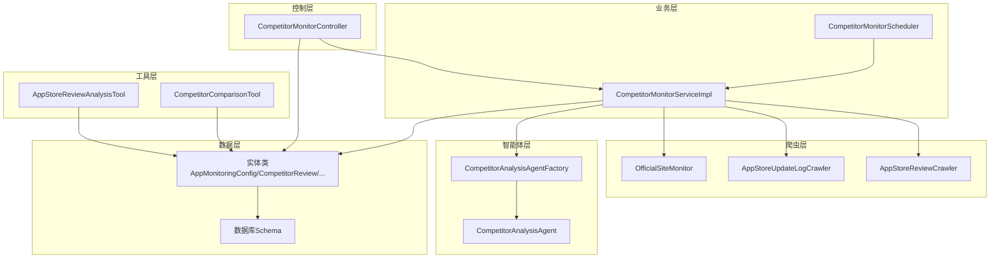
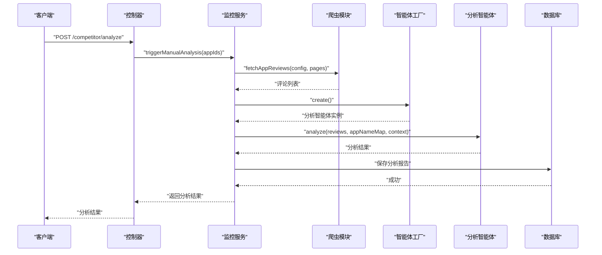
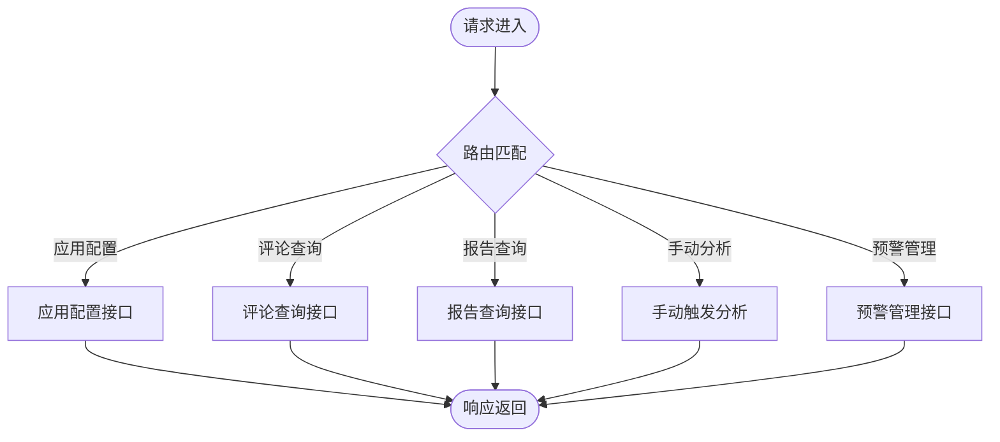
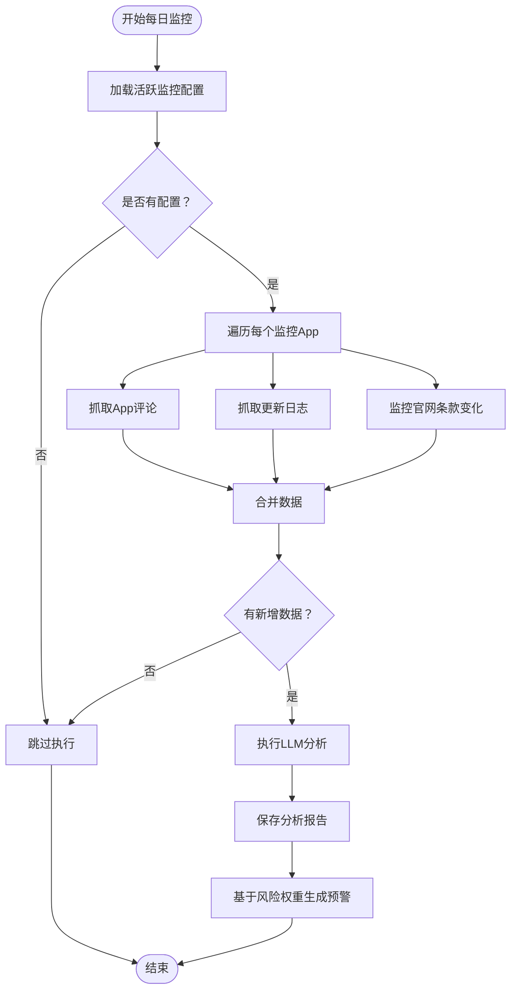
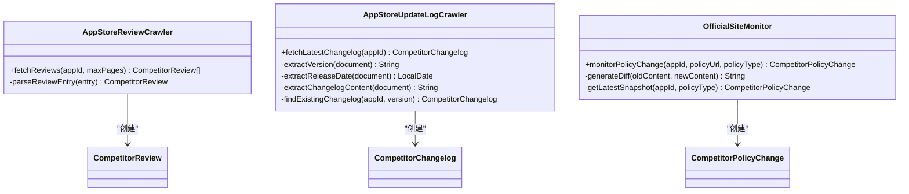
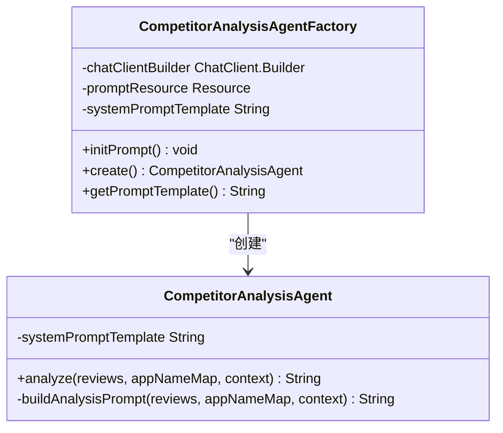
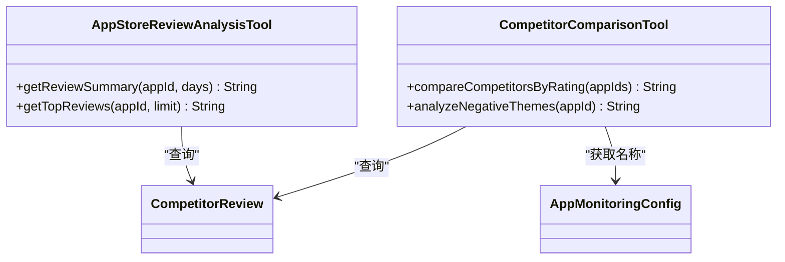
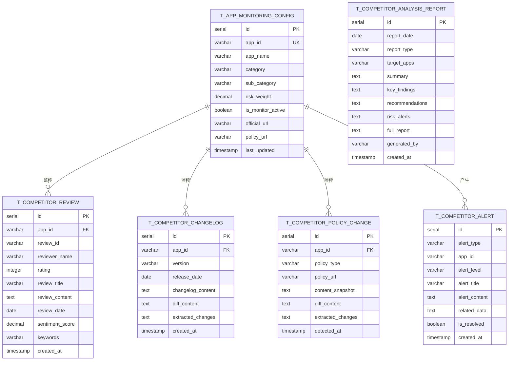
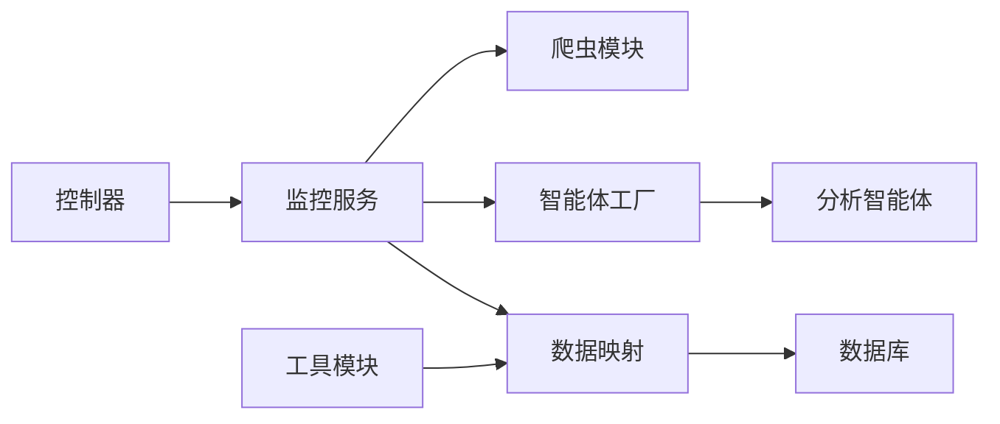

# 竞争对手监控系统

<cite>
**本文档引用的文件**
- [CompetitorMonitorController.java](file://src/main/java/com/yupi/yuaiagent/competitor/controller/CompetitorMonitorController.java)
- [CompetitorMonitorServiceImpl.java](file://src/main/java/com/yupi/yuaiagent/competitor/service/impl/CompetitorMonitorServiceImpl.java)
- [CompetitorMonitorScheduler.java](file://src/main/java/com/yupi/yuaiagent/competitor/scheduler/CompetitorMonitorScheduler.java)
- [CompetitorAnalysisAgent.java](file://src/main/java/com/yupi/yuaiagent/competitor/agent/CompetitorAnalysisAgent.java)
- [CompetitorAnalysisAgentFactory.java](file://src/main/java/com/yupi/yuaiagent/competitor/agent/CompetitorAnalysisAgentFactory.java)
- [AppStoreReviewCrawler.java](file://src/main/java/com/yupi/yuaiagent/competitor/crawler/AppStoreReviewCrawler.java)
- [AppStoreUpdateLogCrawler.java](file://src/main/java/com/yupi/yuaiagent/competitor/crawler/AppStoreUpdateLogCrawler.java)
- [OfficialSiteMonitor.java](file://src/main/java/com/yupi/yuaiagent/competitor/crawler/OfficialSiteMonitor.java)
- [AppMonitoringConfig.java](file://src/main/java/com/yupi/yuaiagent/competitor/entity/AppMonitoringConfig.java)
- [CompetitorReview.java](file://src/main/java/com/yupi/yuaiagent/competitor/entity/CompetitorReview.java)
- [CompetitorAnalysisReport.java](file://src/main/java/com/yupi/yuaiagent/competitor/entity/CompetitorAnalysisReport.java)
- [CompetitorAlert.java](file://src/main/java/com/yupi/yuaiagent/competitor/entity/CompetitorAlert.java)
- [AppStoreReviewAnalysisTool.java](file://src/main/java/com/yupi/yuaiagent/competitor/tools/AppStoreReviewAnalysisTool.java)
- [CompetitorComparisonTool.java](file://src/main/java/com/yupi/yuaiagent/competitor/tools/CompetitorComparisonTool.java)
- [competitor-schema.sql](file://src/main/resources/db/competitor-schema.sql)
</cite>

## 目录
1. [简介](#简介)
2. [项目结构](#项目结构)
3. [核心组件](#核心组件)
4. [架构总览](#架构总览)
5. [详细组件分析](#详细组件分析)
6. [依赖关系分析](#依赖关系分析)
7. [性能考虑](#性能考虑)
8. [故障排除指南](#故障排除指南)
9. [结论](#结论)

## 简介
本系统是一个面向印尼市场的竞争对手监控与分析平台，通过自动化采集竞品应用的App Store评论、更新日志及官网条款变化，结合大语言模型进行归因分析，生成结构化分析报告并触发智能预警。系统采用Spring Boot微服务架构，集成定时任务、爬虫模块、智能体分析与数据库持久化，支持手动触发与每日自动执行两种运行模式。

## 项目结构
系统采用按功能域划分的包结构，核心模块包括：
- 控制层：提供REST API接口，支持应用配置管理、评论查询、报告查看、手动触发分析与预警管理
- 业务层：实现监控调度、数据采集、LLM分析、报告生成与预警逻辑
- 爬虫层：封装App Store评论、更新日志与官网条款监控
- 智能体层：基于Spring AI的分析智能体与工厂，负责构建Prompt并执行分析
- 工具层：提供评论统计与竞品对比等工具方法
- 实体与映射：定义数据模型与MyBatis Plus映射
- 数据库：提供完整的schema定义与索引设计

**图表来源**
- [CompetitorMonitorController.java:1-117](file://src/main/java/com/yupi/yuaiagent/competitor/controller/CompetitorMonitorController.java#L1-L117)
- [CompetitorMonitorServiceImpl.java:1-213](file://src/main/java/com/yupi/yuaiagent/competitor/service/impl/CompetitorMonitorServiceImpl.java#L1-L213)
- [CompetitorMonitorScheduler.java:1-36](file://src/main/java/com/yupi/yuaiagent/competitor/scheduler/CompetitorMonitorScheduler.java#L1-L36)
- [AppStoreReviewCrawler.java:1-130](file://src/main/java/com/yupi/yuaiagent/competitor/crawler/AppStoreReviewCrawler.java#L1-L130)
- [AppStoreUpdateLogCrawler.java:1-151](file://src/main/java/com/yupi/yuaiagent/competitor/crawler/AppStoreUpdateLogCrawler.java#L1-L151)
- [OfficialSiteMonitor.java:1-155](file://src/main/java/com/yupi/yuaiagent/competitor/crawler/OfficialSiteMonitor.java#L1-L155)
- [CompetitorAnalysisAgentFactory.java:1-73](file://src/main/java/com/yupi/yuaiagent/competitor/agent/CompetitorAnalysisAgentFactory.java#L1-L73)
- [CompetitorAnalysisAgent.java:1-134](file://src/main/java/com/yupi/yuaiagent/competitor/agent/CompetitorAnalysisAgent.java#L1-L134)
- [competitor-schema.sql:1-117](file://src/main/resources/db/competitor-schema.sql#L1-L117)

**章节来源**
- [CompetitorMonitorController.java:1-117](file://src/main/java/com/yupi/yuaiagent/competitor/controller/CompetitorMonitorController.java#L1-L117)
- [CompetitorMonitorServiceImpl.java:1-213](file://src/main/java/com/yupi/yuaiagent/competitor/service/impl/CompetitorMonitorServiceImpl.java#L1-L213)
- [CompetitorMonitorScheduler.java:1-36](file://src/main/java/com/yupi/yuaiagent/competitor/scheduler/CompetitorMonitorScheduler.java#L1-L36)
- [competitor-schema.sql:1-117](file://src/main/resources/db/competitor-schema.sql#L1-L117)

## 核心组件
- 控制器：提供监控配置、评论查询、报告查看、手动分析触发与预警管理的REST接口
- 监控服务：协调数据采集、LLM分析、报告生成与预警创建
- 爬虫模块：App Store评论抓取、更新日志解析、官网条款监控
- 分析智能体：基于外部Prompt模板的分析Agent，支持并发安全实例化
- 工具模块：评论统计与竞品对比工具，辅助数据分析
- 数据模型：涵盖监控配置、评论、更新日志、政策变化、分析报告与预警记录

**章节来源**
- [CompetitorMonitorController.java:1-117](file://src/main/java/com/yupi/yuaiagent/competitor/controller/CompetitorMonitorController.java#L1-L117)
- [CompetitorMonitorServiceImpl.java:1-213](file://src/main/java/com/yupi/yuaiagent/competitor/service/impl/CompetitorMonitorServiceImpl.java#L1-L213)
- [AppStoreReviewCrawler.java:1-130](file://src/main/java/com/yupi/yuaiagent/competitor/crawler/AppStoreReviewCrawler.java#L1-L130)
- [AppStoreUpdateLogCrawler.java:1-151](file://src/main/java/com/yupi/yuaiagent/competitor/crawler/AppStoreUpdateLogCrawler.java#L1-L151)
- [OfficialSiteMonitor.java:1-155](file://src/main/java/com/yupi/yuaiagent/competitor/crawler/OfficialSiteMonitor.java#L1-L155)
- [CompetitorAnalysisAgent.java:1-134](file://src/main/java/com/yupi/yuaiagent/competitor/agent/CompetitorAnalysisAgent.java#L1-L134)
- [CompetitorAnalysisAgentFactory.java:1-73](file://src/main/java/com/yupi/yuaiagent/competitor/agent/CompetitorAnalysisAgentFactory.java#L1-L73)
- [AppStoreReviewAnalysisTool.java:1-109](file://src/main/java/com/yupi/yuaiagent/competitor/tools/AppStoreReviewAnalysisTool.java#L1-L109)
- [CompetitorComparisonTool.java:1-112](file://src/main/java/com/yupi/yuaiagent/competitor/tools/CompetitorComparisonTool.java#L1-L112)
- [AppMonitoringConfig.java:1-41](file://src/main/java/com/yupi/yuaiagent/competitor/entity/AppMonitoringConfig.java#L1-L41)
- [CompetitorReview.java:1-42](file://src/main/java/com/yupi/yuaiagent/competitor/entity/CompetitorReview.java#L1-L42)
- [CompetitorAnalysisReport.java:1-41](file://src/main/java/com/yupi/yuaiagent/competitor/entity/CompetitorAnalysisReport.java#L1-L41)
- [CompetitorAlert.java:1-36](file://src/main/java/com/yupi/yuaiagent/competitor/entity/CompetitorAlert.java#L1-L36)

## 架构总览
系统采用分层架构，控制层接收请求，业务层编排数据采集与分析，爬虫层负责外部数据获取，智能体层执行LLM分析，工具层提供数据分析能力，数据层负责持久化与查询。

**图表来源**
- [CompetitorMonitorController.java:93-98](file://src/main/java/com/yupi/yuaiagent/competitor/controller/CompetitorMonitorController.java#L93-L98)
- [CompetitorMonitorServiceImpl.java:148-176](file://src/main/java/com/yupi/yuaiagent/competitor/service/impl/CompetitorMonitorServiceImpl.java#L148-L176)
- [AppStoreReviewCrawler.java:38-76](file://src/main/java/com/yupi/yuaiagent/competitor/crawler/AppStoreReviewCrawler.java#L38-L76)
- [CompetitorAnalysisAgentFactory.java:53-56](file://src/main/java/com/yupi/yuaiagent/competitor/agent/CompetitorAnalysisAgentFactory.java#L53-L56)
- [CompetitorAnalysisAgent.java:50-68](file://src/main/java/com/yupi/yuaiagent/competitor/agent/CompetitorAnalysisAgent.java#L50-L68)

## 详细组件分析

### 控制器层：CompetitorMonitorController
- 功能职责
  - 应用配置管理：列出、新增、更新监控App配置
  - 评论数据查询：按App分页查询评论
  - 分析报告查询：分页查看分析报告列表与详情
  - 手动触发分析：根据指定App ID列表触发分析任务
  - 预警管理：查询预警列表与标记已处理
- 关键接口
  - GET /competitor/apps：支持按类别筛选
  - POST /competitor/apps：新增监控App
  - PUT /competitor/apps/{appId}：更新App配置
  - GET /competitor/reviews：分页查询评论
  - GET /competitor/reports：分页查询报告
  - GET /competitor/reports/{id}：查看报告详情
  - POST /competitor/analyze：手动触发分析
  - GET /competitor/alerts：查询预警列表
  - POST /competitor/alerts/{id}/resolve：标记预警已处理

**图表来源**
- [CompetitorMonitorController.java:41-116](file://src/main/java/com/yupi/yuaiagent/competitor/controller/CompetitorMonitorController.java#L41-L116)

**章节来源**
- [CompetitorMonitorController.java:1-117](file://src/main/java/com/yupi/yuaiagent/competitor/controller/CompetitorMonitorController.java#L1-L117)

### 业务层：CompetitorMonitorServiceImpl
- 功能职责
  - 每日监控执行：遍历活跃监控配置，抓取评论与更新日志，监控官网条款变化，执行LLM分析，生成报告并触发预警
  - 评论抓取：调用App Store评论爬虫，批量保存评论
  - 手动分析：根据指定App ID集合执行分析流程
  - 预警生成：基于风险权重阈值生成高风险预警
- 关键流程
  - 数据采集阶段：逐个App抓取评论、更新日志与条款变化
  - LLM分析阶段：通过智能体工厂创建分析智能体，执行归因分析
  - 报告持久化：将分析结果保存为结构化报告
  - 预警生成：根据配置风险权重触发预警

**图表来源**
- [CompetitorMonitorServiceImpl.java:54-133](file://src/main/java/com/yupi/yuaiagent/competitor/service/impl/CompetitorMonitorServiceImpl.java#L54-L133)

**章节来源**
- [CompetitorMonitorServiceImpl.java:1-213](file://src/main/java/com/yupi/yuaiagent/competitor/service/impl/CompetitorMonitorServiceImpl.java#L1-L213)

### 爬虫层
- AppStoreReviewCrawler
  - 通过苹果公开RSS接口抓取App Store评论
  - 解析JSON响应，提取评论ID、作者、标题、内容、评分与更新时间
  - 支持最大页数限制，避免无限抓取
- AppStoreUpdateLogCrawler
  - 通过HTML解析App Store应用页面，提取版本号、发布日期与更新日志内容
  - 去重保存，避免重复记录相同版本
- OfficialSiteMonitor
  - 使用WebScrapingTool抓取官网条款页面
  - 基于java-diff-utils进行精确行级差异检测，生成diff内容
  - 首次监控仅保存快照，后续对比生成变化记录

**图表来源**
- [AppStoreReviewCrawler.java:1-130](file://src/main/java/com/yupi/yuaiagent/competitor/crawler/AppStoreReviewCrawler.java#L1-L130)
- [AppStoreUpdateLogCrawler.java:1-151](file://src/main/java/com/yupi/yuaiagent/competitor/crawler/AppStoreUpdateLogCrawler.java#L1-L151)
- [OfficialSiteMonitor.java:1-155](file://src/main/java/com/yupi/yuaiagent/competitor/crawler/OfficialSiteMonitor.java#L1-L155)

**章节来源**
- [AppStoreReviewCrawler.java:1-130](file://src/main/java/com/yupi/yuaiagent/competitor/crawler/AppStoreReviewCrawler.java#L1-L130)
- [AppStoreUpdateLogCrawler.java:1-151](file://src/main/java/com/yupi/yuaiagent/competitor/crawler/AppStoreUpdateLogCrawler.java#L1-L151)
- [OfficialSiteMonitor.java:1-155](file://src/main/java/com/yupi/yuaiagent/competitor/crawler/OfficialSiteMonitor.java#L1-L155)

### 智能体层：CompetitorAnalysisAgent与工厂
- CompetitorAnalysisAgentFactory
  - 负责加载外部Prompt模板资源，支持默认回退机制
  - 每次创建新的分析智能体实例，确保并发安全
- CompetitorAnalysisAgent
  - 继承BaseAgent，执行单次分析调用
  - 构建用户Prompt，包含评论概览、各App详情与补充上下文
  - 通过ChatClient调用LLM，返回Markdown格式分析结果

**图表来源**
- [CompetitorAnalysisAgentFactory.java:1-73](file://src/main/java/com/yupi/yuaiagent/competitor/agent/CompetitorAnalysisAgentFactory.java#L1-L73)
- [CompetitorAnalysisAgent.java:1-134](file://src/main/java/com/yupi/yuaiagent/competitor/agent/CompetitorAnalysisAgent.java#L1-L134)

**章节来源**
- [CompetitorAnalysisAgentFactory.java:1-73](file://src/main/java/com/yupi/yuaiagent/competitor/agent/CompetitorAnalysisAgentFactory.java#L1-L73)
- [CompetitorAnalysisAgent.java:1-134](file://src/main/java/com/yupi/yuaiagent/competitor/agent/CompetitorAnalysisAgent.java#L1-L134)

### 工具层：数据分析工具
- AppStoreReviewAnalysisTool
  - 查询指定App最近N天的评论统计摘要，包括评论数、平均评分、评分分布与低分评论摘要
  - 支持获取评分最高的N条评论
- CompetitorComparisonTool
  - 对多个竞品App进行横向对比，统计平均评分与评论数量
  - 分析指定App的差评主题分布（基于关键词统计）

**图表来源**
- [AppStoreReviewAnalysisTool.java:1-109](file://src/main/java/com/yupi/yuaiagent/competitor/tools/AppStoreReviewAnalysisTool.java#L1-L109)
- [CompetitorComparisonTool.java:1-112](file://src/main/java/com/yupi/yuaiagent/competitor/tools/CompetitorComparisonTool.java#L1-L112)

**章节来源**
- [AppStoreReviewAnalysisTool.java:1-109](file://src/main/java/com/yupi/yuaiagent/competitor/tools/AppStoreReviewAnalysisTool.java#L1-L109)
- [CompetitorComparisonTool.java:1-112](file://src/main/java/com/yupi/yuaiagent/competitor/tools/CompetitorComparisonTool.java#L1-L112)

### 数据模型与数据库设计
- 实体模型
  - AppMonitoringConfig：监控配置，包含App ID、名称、分类、风险权重、官网与条款URL等
  - CompetitorReview：App Store评论，包含评分、标题、内容、日期等
  - CompetitorAnalysisReport：分析报告，包含摘要、关键发现、建议、风险预警与完整报告
  - CompetitorAlert：预警记录，包含类型、级别、标题、内容与处理状态
- 数据库Schema
  - t_app_monitoring_config：监控配置表，含唯一索引与注释
  - t_competitor_review：评论表，含外键约束与索引
  - t_competitor_changelog：更新日志表，含外键约束
  - t_competitor_policy_change：政策变化表，含外键约束
  - t_competitor_analysis_report：分析报告表，含索引
  - t_competitor_alert：预警表，含索引

**图表来源**
- [competitor-schema.sql:1-117](file://src/main/resources/db/competitor-schema.sql#L1-L117)
- [AppMonitoringConfig.java:1-41](file://src/main/java/com/yupi/yuaiagent/competitor/entity/AppMonitoringConfig.java#L1-L41)
- [CompetitorReview.java:1-42](file://src/main/java/com/yupi/yuaiagent/competitor/entity/CompetitorReview.java#L1-L42)
- [CompetitorAnalysisReport.java:1-41](file://src/main/java/com/yupi/yuaiagent/competitor/entity/CompetitorAnalysisReport.java#L1-L41)
- [CompetitorAlert.java:1-36](file://src/main/java/com/yupi/yuaiagent/competitor/entity/CompetitorAlert.java#L1-L36)

**章节来源**
- [competitor-schema.sql:1-117](file://src/main/resources/db/competitor-schema.sql#L1-L117)
- [AppMonitoringConfig.java:1-41](file://src/main/java/com/yupi/yuaiagent/competitor/entity/AppMonitoringConfig.java#L1-L41)
- [CompetitorReview.java:1-42](file://src/main/java/com/yupi/yuaiagent/competitor/entity/CompetitorReview.java#L1-L42)
- [CompetitorAnalysisReport.java:1-41](file://src/main/java/com/yupi/yuaiagent/competitor/entity/CompetitorAnalysisReport.java#L1-L41)
- [CompetitorAlert.java:1-36](file://src/main/java/com/yupi/yuaiagent/competitor/entity/CompetitorAlert.java#L1-L36)

## 依赖关系分析
- 控制器依赖业务服务接口，通过Spring依赖注入装配
- 监控服务依赖爬虫模块、智能体工厂、数据映射与预警服务
- 爬虫模块依赖HTTP工具与HTML解析库，部分模块依赖MyBatis Plus进行数据持久化
- 智能体工厂依赖ChatClient Builder与外部Prompt资源
- 工具模块依赖数据映射进行查询统计
- 数据模型与数据库Schema保持一致，实体类与表字段一一对应

**图表来源**
- [CompetitorMonitorController.java:24-37](file://src/main/java/com/yupi/yuaiagent/competitor/controller/CompetitorMonitorController.java#L24-L37)
- [CompetitorMonitorServiceImpl.java:29-51](file://src/main/java/com/yupi/yuaiagent/competitor/service/impl/CompetitorMonitorServiceImpl.java#L29-L51)
- [CompetitorAnalysisAgentFactory.java:25-27](file://src/main/java/com/yupi/yuaiagent/competitor/agent/CompetitorAnalysisAgentFactory.java#L25-L27)

**章节来源**
- [CompetitorMonitorController.java:1-117](file://src/main/java/com/yupi/yuaiagent/competitor/controller/CompetitorMonitorController.java#L1-L117)
- [CompetitorMonitorServiceImpl.java:1-213](file://src/main/java/com/yupi/yuaiagent/competitor/service/impl/CompetitorMonitorServiceImpl.java#L1-L213)
- [CompetitorAnalysisAgentFactory.java:1-73](file://src/main/java/com/yupi/yuaiagent/competitor/agent/CompetitorAnalysisAgentFactory.java#L1-L73)

## 性能考虑
- 爬虫并发与限流：App Store RSS接口每页约50条评论，建议合理设置最大页数，避免过度请求
- 数据去重：更新日志与条款监控已实现去重逻辑，减少重复存储与分析开销
- 缓存策略：可考虑在智能体工厂层面缓存Prompt模板，减少I/O开销
- 异步处理：对于大量App的监控，可引入异步队列或分批处理，提升吞吐量
- 索引优化：数据库已建立必要索引，建议定期分析查询计划，优化热点查询

## 故障排除指南
- 爬虫异常
  - App Store评论：检查国家代码配置与网络连通性；解析失败时查看日志中的异常信息
  - 更新日志：确认App Store页面结构变化，必要时调整选择器
  - 官网条款：网页抓取失败时检查URL有效性与反爬策略
- LLM分析失败
  - 检查智能体工厂的Prompt模板加载情况；确认ChatClient配置正确
  - 分析失败时返回错误信息，可在日志中定位具体原因
- 数据持久化
  - 评论重复插入：系统会忽略重复记录并记录调试日志，无需人工干预
  - 报告保存失败：检查数据库连接与表结构一致性
- 预警生成
  - 风险权重阈值：确保配置中的风险权重设置符合预期
  - 预警状态：通过接口标记已处理，避免重复提醒

**章节来源**
- [AppStoreReviewCrawler.java:72-74](file://src/main/java/com/yupi/yuaiagent/competitor/crawler/AppStoreReviewCrawler.java#L72-L74)
- [AppStoreUpdateLogCrawler.java:70-73](file://src/main/java/com/yupi/yuaiagent/competitor/crawler/AppStoreUpdateLogCrawler.java#L70-L73)
- [OfficialSiteMonitor.java:87-90](file://src/main/java/com/yupi/yuaiagent/competitor/crawler/OfficialSiteMonitor.java#L87-L90)
- [CompetitorMonitorServiceImpl.java:123-127](file://src/main/java/com/yupi/yuaiagent/competitor/service/impl/CompetitorMonitorServiceImpl.java#L123-L127)
- [CompetitorAnalysisAgent.java:63-67](file://src/main/java/com/yupi/yuaiagent/competitor/agent/CompetitorAnalysisAgent.java#L63-L67)

## 结论
本系统通过自动化采集、结构化存储与智能分析，实现了对印尼市场竞品的全链路监控与预警。其模块化设计便于扩展与维护，定时任务与手动触发相结合满足不同场景需求。建议持续优化爬虫稳定性、增强Prompt模板的可配置性，并完善异常监控与告警机制，以提升系统的可靠性与可运维性。