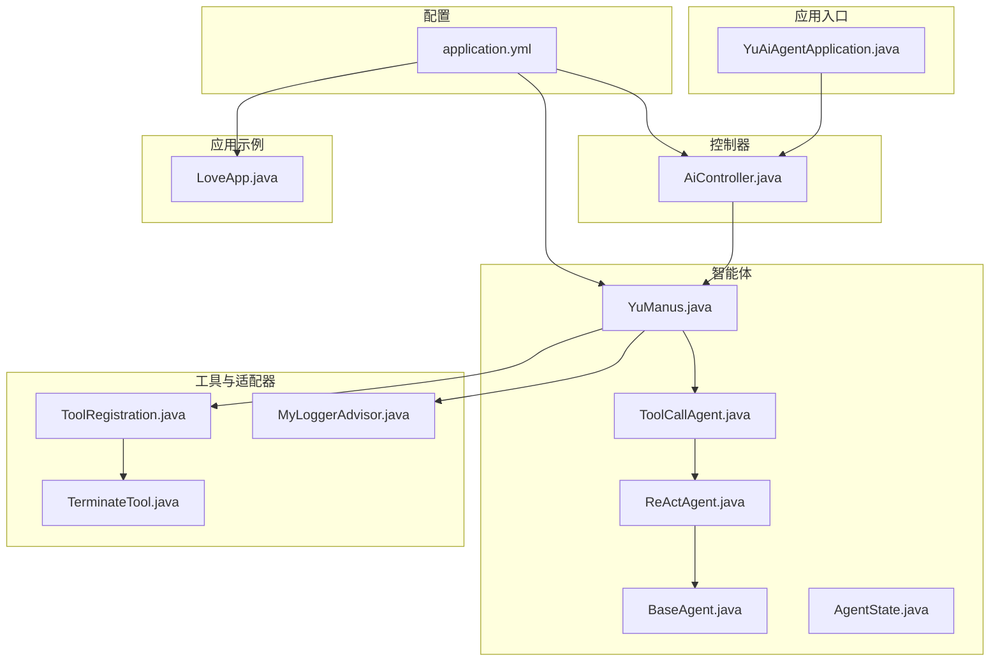
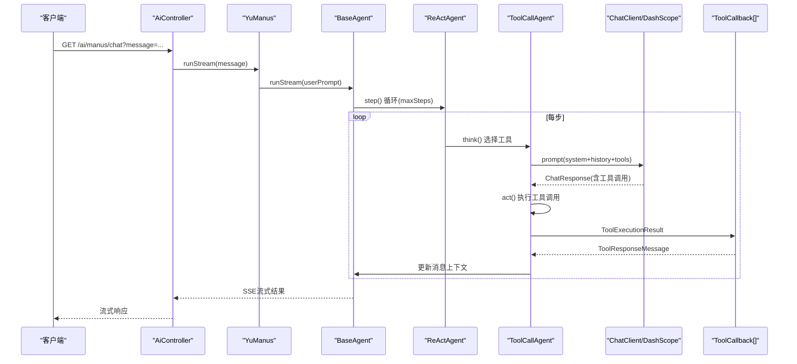
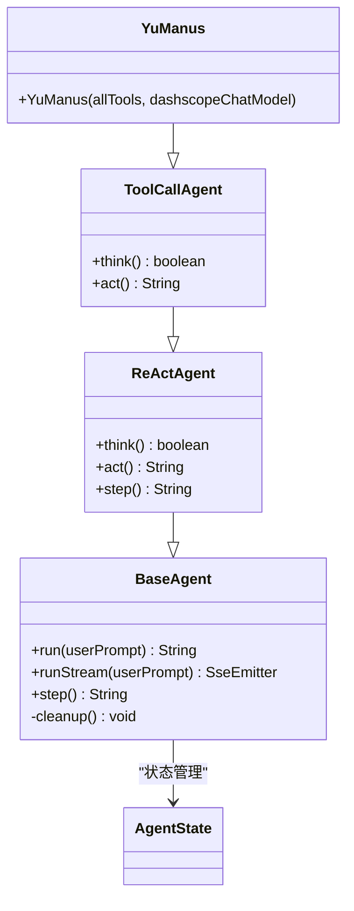
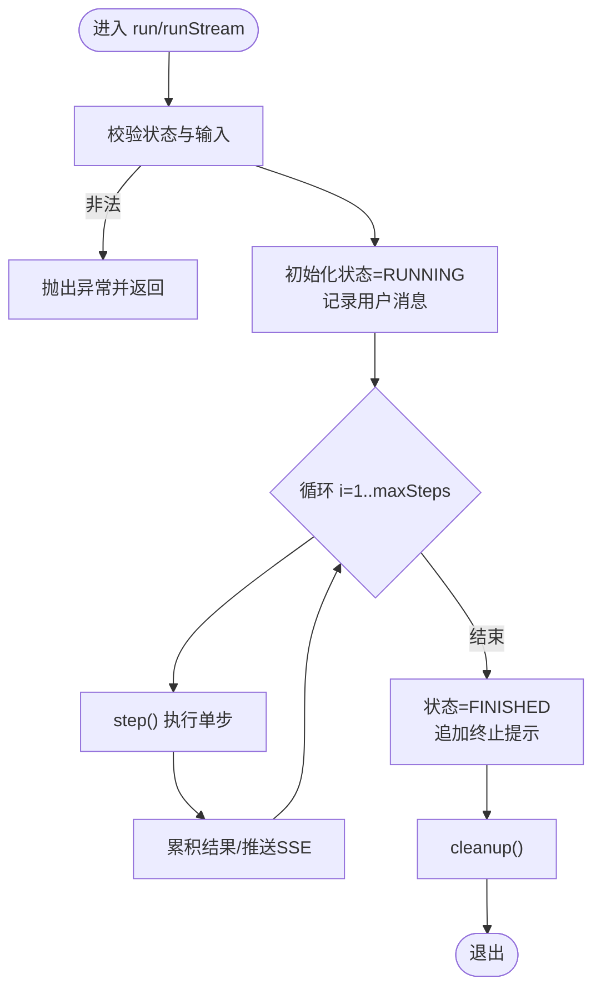
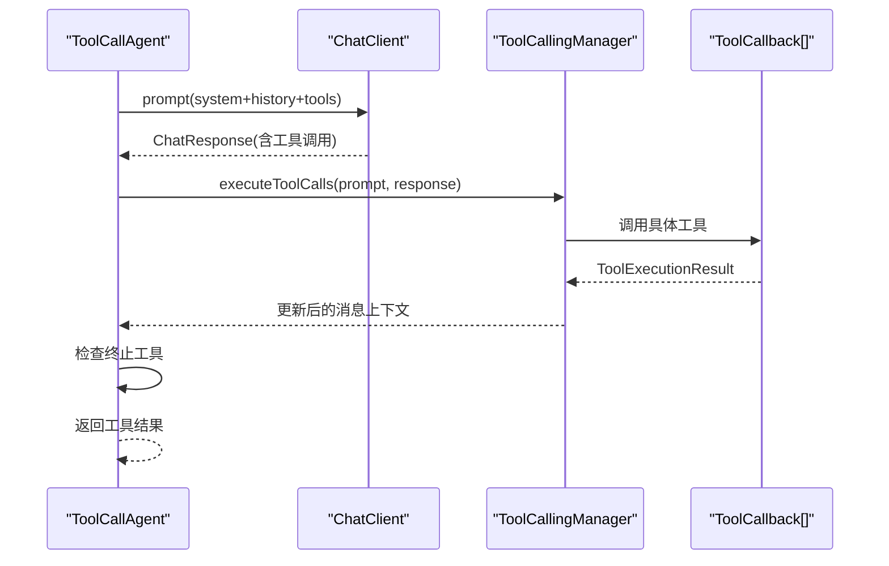
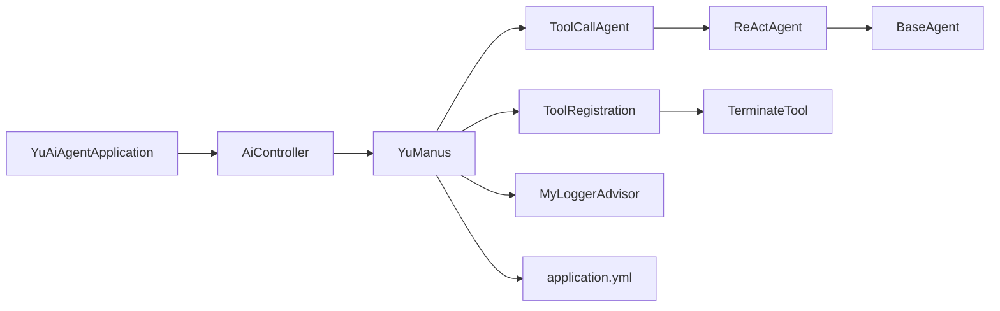

# 超级智能体YuManus

<cite>
**本文引用的文件**
- [YuManus.java](file://src/main/java/com/yupi/yuaiagent/agent/YuManus.java)
- [BaseAgent.java](file://src/main/java/com/yupi/yuaiagent/agent/BaseAgent.java)
- [AgentState.java](file://src/main/java/com/yupi/yuaiagent/agent/model/AgentState.java)
- [ReActAgent.java](file://src/main/java/com/yupi/yuaiagent/agent/ReActAgent.java)
- [ToolCallAgent.java](file://src/main/java/com/yupi/yuaiagent/agent/ToolCallAgent.java)
- [ToolRegistration.java](file://src/main/java/com/yupi/yuaiagent/tools/ToolRegistration.java)
- [TerminateTool.java](file://src/main/java/com/yupi/yuaiagent/tools/TerminateTool.java)
- [MyLoggerAdvisor.java](file://src/main/java/com/yupi/yuaiagent/advisor/MyLoggerAdvisor.java)
- [application.yml](file://src/main/resources/application.yml)
- [AiController.java](file://src/main/java/com/yupi/yuaiagent/controller/AiController.java)
- [YuAiAgentApplication.java](file://src/main/java/com/yupi/yuaiagent/YuAiAgentApplication.java)
- [LoveApp.java](file://src/main/java/com/yupi/yuaiagent/app/LoveApp.java)
- [pom.xml](file://pom.xml)
- [YuManusTest.java](file://src/test/java/com/yupi/yuaiagent/agent/YuManusTest.java)
</cite>

## 目录
1. [简介](#简介)
2. [项目结构](#项目结构)
3. [核心组件](#核心组件)
4. [架构总览](#架构总览)
5. [详细组件分析](#详细组件分析)
6. [依赖分析](#依赖分析)
7. [性能考虑](#性能考虑)
8. [故障排查指南](#故障排查指南)
9. [结论](#结论)
10. [附录](#附录)

## 简介
本文件面向“超级智能体YuManus”的技术文档，系统性解析其自主规划能力与高级智能特性。重点涵盖：
- 多步骤任务的分解与协调执行
- 自主决策机制与动态调整策略
- 高级状态管理与任务恢复
- 与工具生态的协作与通信协议
- 配置参数与扩展接口
- 性能监控与故障诊断
- 实际应用场景与效果评估

## 项目结构
项目采用模块化分层组织，核心智能体位于agent包，工具集由tools包统一注册，控制器通过REST接口对外提供服务，配置集中在resources目录，应用入口为Spring Boot启动类。

**图表来源**
- [YuAiAgentApplication.java:1-18](file://src/main/java/com/yupi/yuaiagent/YuAiAgentApplication.java#L1-L18)
- [AiController.java:1-106](file://src/main/java/com/yupi/yuaiagent/controller/AiController.java#L1-L106)
- [YuManus.java:1-38](file://src/main/java/com/yupi/yuaiagent/agent/YuManus.java#L1-L38)
- [ToolCallAgent.java:1-136](file://src/main/java/com/yupi/yuaiagent/agent/ToolCallAgent.java#L1-L136)
- [ReActAgent.java:1-53](file://src/main/java/com/yupi/yuaiagent/agent/ReActAgent.java#L1-L53)
- [BaseAgent.java:1-193](file://src/main/java/com/yupi/yuaiagent/agent/BaseAgent.java#L1-L193)
- [AgentState.java:1-27](file://src/main/java/com/yupi/yuaiagent/agent/model/AgentState.java#L1-L27)
- [ToolRegistration.java:1-38](file://src/main/java/com/yupi/yuaiagent/tools/ToolRegistration.java#L1-L38)
- [TerminateTool.java:1-18](file://src/main/java/com/yupi/yuaiagent/tools/TerminateTool.java#L1-L18)
- [MyLoggerAdvisor.java:1-54](file://src/main/java/com/yupi/yuaiagent/advisor/MyLoggerAdvisor.java#L1-L54)
- [application.yml:1-66](file://src/main/resources/application.yml#L1-L66)
- [LoveApp.java:1-227](file://src/main/java/com/yupi/yuaiagent/app/LoveApp.java#L1-L227)

**章节来源**
- [pom.xml:1-227](file://pom.xml#L1-L227)
- [application.yml:1-66](file://src/main/resources/application.yml#L1-L66)

## 核心组件
- 基础代理基类：提供状态机、消息上下文、步骤循环与SSE流式输出能力。
- ReAct代理：定义“思考-行动”两阶段的抽象流程。
- 工具调用代理：封装LLM工具选择、调用与上下文维护，支持终止工具触发任务结束。
- 超级智能体YuManus：继承工具调用代理，注入系统提示词与下一步提示词，设定最大步数，绑定DashScope模型与自定义日志Advisor。
- 工具注册中心：集中装配所有可用工具回调。
- 终止工具：标准化任务结束信号，便于智能体主动停止。
- 控制器：对外提供同步与SSE两种调用方式，支持流式输出。
- 配置：模型参数、日志级别、端口与OpenAPI文档等。

**章节来源**
- [BaseAgent.java:1-193](file://src/main/java/com/yupi/yuaiagent/agent/BaseAgent.java#L1-L193)
- [ReActAgent.java:1-53](file://src/main/java/com/yupi/yuaiagent/agent/ReActAgent.java#L1-L53)
- [ToolCallAgent.java:1-136](file://src/main/java/com/yupi/yuaiagent/agent/ToolCallAgent.java#L1-L136)
- [YuManus.java:1-38](file://src/main/java/com/yupi/yuaiagent/agent/YuManus.java#L1-L38)
- [ToolRegistration.java:1-38](file://src/main/java/com/yupi/yuaiagent/tools/ToolRegistration.java#L1-L38)
- [TerminateTool.java:1-18](file://src/main/java/com/yupi/yuaiagent/tools/TerminateTool.java#L1-L18)
- [AiController.java:1-106](file://src/main/java/com/yupi/yuaiagent/controller/AiController.java#L1-L106)
- [application.yml:1-66](file://src/main/resources/application.yml#L1-L66)

## 架构总览
YuManus采用“ReAct范式 + 工具调用 + 流式输出”的架构，结合Spring AI与DashScope模型，通过Advisor链路实现日志与上下文增强。控制器负责接收请求并委派至智能体执行，工具注册中心统一管理工具集合。

**图表来源**
- [AiController.java:94-104](file://src/main/java/com/yupi/yuaiagent/controller/AiController.java#L94-L104)
- [BaseAgent.java:94-177](file://src/main/java/com/yupi/yuaiagent/agent/BaseAgent.java#L94-L177)
- [ReActAgent.java:30-50](file://src/main/java/com/yupi/yuaiagent/agent/ReActAgent.java#L30-L50)
- [ToolCallAgent.java:54-134](file://src/main/java/com/yupi/yuaiagent/agent/ToolCallAgent.java#L54-L134)
- [YuManus.java:15-36](file://src/main/java/com/yupi/yuaiagent/agent/YuManus.java#L15-L36)

## 详细组件分析

### YuManus：超级智能体
- 角色定位：具备自主规划能力的通用型智能体，面向复杂任务的多步骤分解与执行。
- 关键行为：
  - 设定系统提示词与下一步提示词，指导工具选择与步骤推进。
  - 最大步数限制，防止无限循环。
  - 绑定ChatClient与自定义日志Advisor，确保可观测性。
- 与工具生态协作：通过ToolCallback数组注入工具集，借助工具调用管理器执行工具并更新上下文。

**图表来源**
- [YuManus.java:1-38](file://src/main/java/com/yupi/yuaiagent/agent/YuManus.java#L1-L38)
- [ToolCallAgent.java:1-136](file://src/main/java/com/yupi/yuaiagent/agent/ToolCallAgent.java#L1-L136)
- [ReActAgent.java:1-53](file://src/main/java/com/yupi/yuaiagent/agent/ReActAgent.java#L1-L53)
- [BaseAgent.java:1-193](file://src/main/java/com/yupi/yuaiagent/agent/BaseAgent.java#L1-L193)
- [AgentState.java:1-27](file://src/main/java/com/yupi/yuaiagent/agent/model/AgentState.java#L1-L27)

**章节来源**
- [YuManus.java:1-38](file://src/main/java/com/yupi/yuaiagent/agent/YuManus.java#L1-L38)

### BaseAgent：状态机与执行循环
- 状态枚举：IDLE/RUNNING/FINISHED/ERROR，贯穿整个生命周期。
- 执行流程：
  - run：非空校验、状态切换、消息上下文记录、循环执行step、超步终止、资源清理。
  - runStream：与run一致，但将每步结果通过SSE实时推送。
- 资源清理：子类可覆盖cleanup以释放外部资源。

**图表来源**
- [BaseAgent.java:53-92](file://src/main/java/com/yupi/yuaiagent/agent/BaseAgent.java#L53-L92)
- [BaseAgent.java:100-177](file://src/main/java/com/yupi/yuaiagent/agent/BaseAgent.java#L100-L177)

**章节来源**
- [BaseAgent.java:1-193](file://src/main/java/com/yupi/yuaiagent/agent/BaseAgent.java#L1-L193)
- [AgentState.java:1-27](file://src/main/java/com/yupi/yuaiagent/agent/model/AgentState.java#L1-L27)

### ReActAgent：思考-行动范式
- think：基于当前上下文与下一步提示词，驱动LLM做出“是否需要行动”的决策。
- act：在需要行动时执行具体动作；否则返回“无需行动”的结论。
- step：封装think-act顺序，异常捕获并返回友好提示。

**章节来源**
- [ReActAgent.java:1-53](file://src/main/java/com/yupi/yuaiagent/agent/ReActAgent.java#L1-L53)

### ToolCallAgent：工具调用与上下文维护
- think阶段：
  - 将“下一步提示词”作为用户消息加入上下文。
  - 调用ChatClient，传入system提示词、历史消息与工具集合，获取ChatResponse。
  - 解析工具调用列表，记录工具名与参数，若无工具则回退为纯对话。
- act阶段：
  - 使用ToolCallingManager执行工具调用，更新消息上下文。
  - 若检测到终止工具被调用，则将状态置为FINISHED。
  - 汇总工具返回结果并返回给上层。

**图表来源**
- [ToolCallAgent.java:54-134](file://src/main/java/com/yupi/yuaiagent/agent/ToolCallAgent.java#L54-L134)

**章节来源**
- [ToolCallAgent.java:1-136](file://src/main/java/com/yupi/yuaiagent/agent/ToolCallAgent.java#L1-L136)

### 工具注册与终止工具
- ToolRegistration：集中装配文件读写、网页搜索、网页抓取、资源下载、终端操作、PDF生成、终止工具等。
- TerminateTool：提供标准的“doTerminate”工具，用于智能体在满足条件或无法继续时主动结束任务。

**章节来源**
- [ToolRegistration.java:1-38](file://src/main/java/com/yupi/yuaiagent/tools/ToolRegistration.java#L1-L38)
- [TerminateTool.java:1-18](file://src/main/java/com/yupi/yuaiagent/tools/TerminateTool.java#L1-L18)

### 控制器与流式输出
- AiController：
  - 提供同步与SSE两种调用路径。
  - /ai/manus/chat 接收消息，构造YuManus并返回SseEmitter，实现流式输出。
  - /ai/love_app/chat* 提供恋爱应用的聊天接口（与YuManus同构的流式设计思路）。

**章节来源**
- [AiController.java:1-106](file://src/main/java/com/yupi/yuaiagent/controller/AiController.java#L1-L106)

### 配置与模型参数
- application.yml：
  - 模型配置：DashScope API Key、模型名、Ollama本地模型。
  - 日志级别：开启Spring AI调试，便于观察工具调用细节。
  - 服务器端口与上下文路径。
  - OpenAPI文档与Knife4j集成。
  - 搜索API Key预留项。
  - 注释掉的PgVector与MCP示例，便于按需启用。

**章节来源**
- [application.yml:1-66](file://src/main/resources/application.yml#L1-L66)

## 依赖分析
- 模块耦合：
  - YuManus依赖ToolCallAgent、ReActAgent、BaseAgent形成清晰的继承层次。
  - 工具生态通过ToolRegistration集中注入，降低耦合度。
  - 控制器仅依赖智能体接口，便于扩展其他智能体。
- 外部依赖：
  - Spring AI Alibaba（DashScope）、Ollama、PGVector、MCP客户端等。
  - 工具侧依赖Hutool、jsoup、iTextPDF等库。

**图表来源**
- [YuManus.java:1-38](file://src/main/java/com/yupi/yuaiagent/agent/YuManus.java#L1-L38)
- [ToolCallAgent.java:1-136](file://src/main/java/com/yupi/yuaiagent/agent/ToolCallAgent.java#L1-L136)
- [ReActAgent.java:1-53](file://src/main/java/com/yupi/yuaiagent/agent/ReActAgent.java#L1-L53)
- [BaseAgent.java:1-193](file://src/main/java/com/yupi/yuaiagent/agent/BaseAgent.java#L1-L193)
- [ToolRegistration.java:1-38](file://src/main/java/com/yupi/yuaiagent/tools/ToolRegistration.java#L1-L38)
- [TerminateTool.java:1-18](file://src/main/java/com/yupi/yuaiagent/tools/TerminateTool.java#L1-L18)
- [MyLoggerAdvisor.java:1-54](file://src/main/java/com/yupi/yuaiagent/advisor/MyLoggerAdvisor.java#L1-L54)
- [AiController.java:1-106](file://src/main/java/com/yupi/yuaiagent/controller/AiController.java#L1-L106)
- [YuAiAgentApplication.java:1-18](file://src/main/java/com/yupi/yuaiagent/YuAiAgentApplication.java#L1-L18)
- [application.yml:1-66](file://src/main/resources/application.yml#L1-L66)

**章节来源**
- [pom.xml:1-227](file://pom.xml#L1-L227)

## 性能考虑
- 步数上限：通过maxSteps限制执行深度，避免长尾任务导致资源耗尽。
- 流式输出：SSE减少等待延迟，适合交互式场景。
- 日志级别：DEBUG有助于定位问题，生产环境可根据需要调整。
- 工具调用：工具数量与复杂度直接影响响应时间，建议按需裁剪工具集。
- 模型选择：云端模型与本地模型可按场景切换，兼顾延迟与成本。

## 故障排查指南
- 状态异常：
  - 若状态非IDLE直接运行，将抛出异常；检查控制器调用时机与并发控制。
- 工具调用失败：
  - 查看MyLoggerAdvisor输出的请求与响应摘要，确认工具参数与权限。
  - 检查TerminateTool是否被正确识别并触发状态变更。
- SSE连接问题：
  - 关注onTimeout与onCompletion回调，必要时延长超时时间。
- 配置问题：
  - 确认DashScope API Key与模型名正确；检查日志级别与OpenAPI文档路径。

**章节来源**
- [BaseAgent.java:53-92](file://src/main/java/com/yupi/yuaiagent/agent/BaseAgent.java#L53-L92)
- [BaseAgent.java:100-177](file://src/main/java/com/yupi/yuaiagent/agent/BaseAgent.java#L100-L177)
- [MyLoggerAdvisor.java:1-54](file://src/main/java/com/yupi/yuaiagent/advisor/MyLoggerAdvisor.java#L1-L54)
- [ToolCallAgent.java:112-134](file://src/main/java/com/yupi/yuaiagent/agent/ToolCallAgent.java#L112-L134)

## 结论
YuManus以ReAct范式为核心，结合工具调用与流式输出，构建了具备自主规划能力的通用智能体。通过清晰的状态机、可插拔的工具生态与完善的日志观测，能够在复杂任务中实现稳健的分解、执行与恢复。配合控制器与配置体系，可快速扩展到更多应用场景。

## 附录

### 配置参数与扩展接口清单
- 模型配置
  - dashscope.api-key：模型访问密钥
  - dashscope.chat.options.model：模型名
  - ollama.base-url：本地模型服务地址
  - ollama.chat.model：本地模型名
- 日志与监控
  - logging.level.org.springframework.ai：调试级别
  - springdoc.*：OpenAPI文档配置
  - knife4j.*：在线文档增强
- 工具扩展
  - 在ToolRegistration中新增ToolCallback，即可自动注入到智能体工具集
- 控制器扩展
  - 在AiController中新增路由，即可接入新的智能体或应用

**章节来源**
- [application.yml:1-66](file://src/main/resources/application.yml#L1-L66)
- [ToolRegistration.java:1-38](file://src/main/java/com/yupi/yuaiagent/tools/ToolRegistration.java#L1-L38)
- [AiController.java:1-106](file://src/main/java/com/yupi/yuaiagent/controller/AiController.java#L1-L106)

### 使用案例与效果评估
- 案例描述：根据用户需求，在指定地理范围内寻找约会地点，结合网络图片制定详细计划，并输出PDF。
- 评估指标：
  - 响应时间：SSE流式输出降低首包延迟
  - 任务完成率：工具链路成功率与终止工具触发合理性
  - 可观测性：日志Advisor输出便于审计与优化
- 测试参考：单元测试验证智能体可正常运行并返回结果。

**章节来源**
- [YuManusTest.java:1-23](file://src/test/java/com/yupi/yuaiagent/agent/YuManusTest.java#L1-L23)