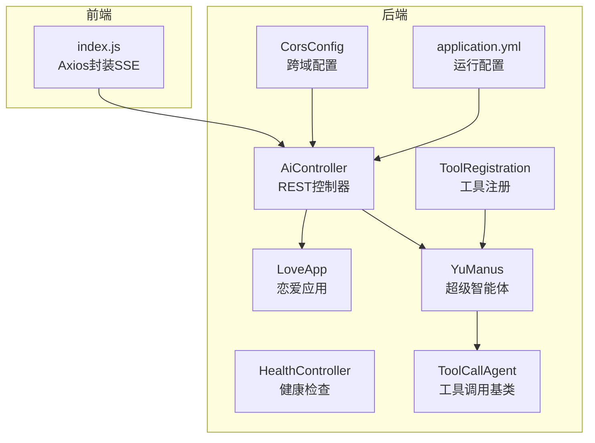
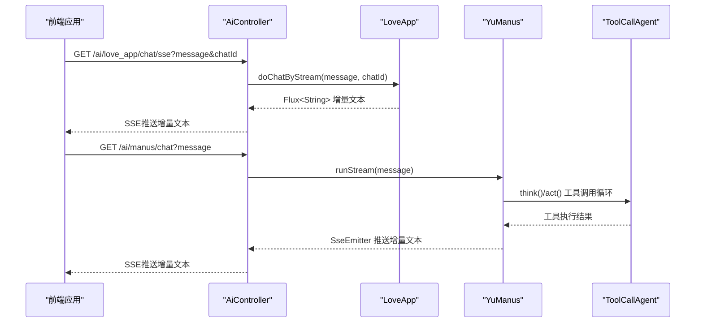
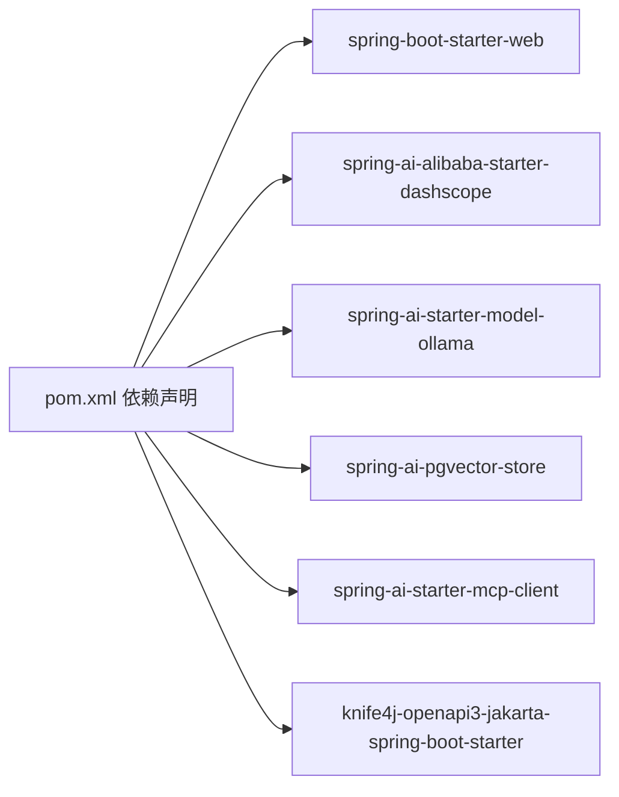

# API接口文档

<cite>
**本文引用的文件**
- [AiController.java](file://src/main/java/com/yupi/yuaiagent/controller/AiController.java)
- [HealthController.java](file://src/main/java/com/yupi/yuaiagent/controller/HealthController.java)
- [LoveApp.java](file://src/main/java/com/yupi/yuaiagent/app/LoveApp.java)
- [YuManus.java](file://src/main/java/com/yupi/yuaiagent/agent/YuManus.java)
- [ToolCallAgent.java](file://src/main/java/com/yupi/yuaiagent/agent/ToolCallAgent.java)
- [ToolRegistration.java](file://src/main/java/com/yupi/yuaiagent/tools/ToolRegistration.java)
- [application.yml](file://src/main/resources/application.yml)
- [CorsConfig.java](file://src/main/java/com/yupi/yuaiagent/config/CorsConfig.java)
- [index.js](file://yu-ai-agent-frontend/src/api/index.js)
- [pom.xml](file://pom.xml)
- [YuAiAgentApplication.java](file://src/main/java/com/yupi/yuaiagent/YuAiAgentApplication.java)
</cite>

## 目录
1. [简介](#简介)
2. [项目结构](#项目结构)
3. [核心组件](#核心组件)
4. [架构总览](#架构总览)
5. [详细组件分析](#详细组件分析)
6. [依赖分析](#依赖分析)
7. [性能考虑](#性能考虑)
8. [故障排查指南](#故障排查指南)
9. [结论](#结论)
10. [附录](#附录)

## 简介
本项目提供一套基于Spring Boot与Spring AI的智能体与聊天服务API，涵盖以下能力：
- 同步聊天：一次性返回完整回答，适合简单问答与非实时场景。
- SSE流式聊天：逐步推送增量文本，适合需要“打字机”体验的交互。
- 智能体聊天：内置工具调用能力的超级智能体，可自动选择并执行工具完成复杂任务。
- 健康检查：轻量级可用性检测接口。

后端服务默认监听端口与上下文路径由配置文件定义，前端通过Axios封装SSE连接，统一管理消息与错误回调。

## 项目结构
后端采用分层设计：
- 控制器层：对外暴露REST API
- 应用层：业务编排（如恋爱咨询应用）
- 智能体层：工具调用与ReAct流程
- 工具层：集中注册各类工具
- 配置层：CORS、OpenAPI文档、运行参数等

图表来源
- [AiController.java:18-106](file://src/main/java/com/yupi/yuaiagent/controller/AiController.java#L18-L106)
- [HealthController.java:7-16](file://src/main/java/com/yupi/yuaiagent/controller/HealthController.java#L7-L16)
- [LoveApp.java:27-227](file://src/main/java/com/yupi/yuaiagent/app/LoveApp.java#L27-L227)
- [YuManus.java:9-38](file://src/main/java/com/yupi/yuaiagent/agent/YuManus.java#L9-L38)
- [ToolCallAgent.java:24-136](file://src/main/java/com/yupi/yuaiagent/agent/ToolCallAgent.java#L24-L136)
- [ToolRegistration.java:9-38](file://src/main/java/com/yupi/yuaiagent/tools/ToolRegistration.java#L9-L38)
- [CorsConfig.java:7-26](file://src/main/java/com/yupi/yuaiagent/config/CorsConfig.java#L7-L26)
- [application.yml:1-66](file://src/main/resources/application.yml#L1-L66)
- [index.js:1-60](file://yu-ai-agent-frontend/src/api/index.js#L1-L60)

章节来源
- [AiController.java:18-106](file://src/main/java/com/yupi/yuaiagent/controller/AiController.java#L18-L106)
- [application.yml:38-41](file://src/main/resources/application.yml#L38-L41)

## 核心组件
- AiController：提供聊天与健康检查接口，支持同步与SSE两种模式。
- HealthController：提供健康检查接口。
- LoveApp：恋爱咨询应用，支持多轮对话记忆、RAG检索增强、工具调用、MCP服务调用等。
- YuManus：超级智能体，继承工具调用基类，具备ReAct规划与工具链路执行能力。
- ToolRegistration：集中注册工具集合，供智能体使用。
- ToolCallAgent：工具调用基类，实现think/act循环与终止工具判断。
- CorsConfig：全局跨域配置。
- application.yml：服务端口、上下文路径、OpenAPI文档、日志级别等配置。

章节来源
- [AiController.java:18-106](file://src/main/java/com/yupi/yuaiagent/controller/AiController.java#L18-L106)
- [HealthController.java:7-16](file://src/main/java/com/yupi/yuaiagent/controller/HealthController.java#L7-L16)
- [LoveApp.java:27-227](file://src/main/java/com/yupi/yuaiagent/app/LoveApp.java#L27-L227)
- [YuManus.java:9-38](file://src/main/java/com/yupi/yuaiagent/agent/YuManus.java#L9-L38)
- [ToolRegistration.java:9-38](file://src/main/java/com/yupi/yuaiagent/tools/ToolRegistration.java#L9-L38)
- [ToolCallAgent.java:24-136](file://src/main/java/com/yupi/yuaiagent/agent/ToolCallAgent.java#L24-L136)
- [CorsConfig.java:7-26](file://src/main/java/com/yupi/yuaiagent/config/CorsConfig.java#L7-L26)
- [application.yml:1-66](file://src/main/resources/application.yml#L1-L66)

## 架构总览
后端通过控制器暴露REST接口，前端通过Axios封装SSE连接，统一处理消息与错误。聊天接口支持同步与SSE两种模式，SSE模式提供更流畅的交互体验。

图表来源
- [AiController.java:38-104](file://src/main/java/com/yupi/yuaiagent/controller/AiController.java#L38-L104)
- [LoveApp.java:90-97](file://src/main/java/com/yupi/yuaiagent/app/LoveApp.java#L90-L97)
- [YuManus.java:12-38](file://src/main/java/com/yupi/yuaiagent/agent/YuManus.java#L12-L38)
- [ToolCallAgent.java:59-134](file://src/main/java/com/yupi/yuaiagent/agent/ToolCallAgent.java#L59-L134)

## 详细组件分析

### REST API 总览
- 基础路径：/api
- 控制器包扫描：com.yupi.yuaiagent.controller
- OpenAPI文档：/v3/api-docs，Swagger UI：/swagger-ui.html

章节来源
- [application.yml:42-53](file://src/main/resources/application.yml#L42-L53)

### 健康检查接口
- 描述：用于检测服务可用性。
- 方法：GET
- 路径：/api/health
- 请求参数：无
- 响应：字符串“ok”
- 适用场景：容器探针、负载均衡健康检查

章节来源
- [HealthController.java:11-14](file://src/main/java/com/yupi/yuaiagent/controller/HealthController.java#L11-L14)

### 聊天接口

#### 同步聊天（恋爱应用）
- 方法：GET
- 路径：/api/ai/love_app/chat/sync
- 参数：
  - message：用户输入文本
  - chatId：会话标识，用于多轮对话记忆
- 响应：字符串（完整回答）
- 适用场景：简单问答、不需要实时反馈的场景

章节来源
- [AiController.java:38-41](file://src/main/java/com/yupi/yuaiagent/controller/AiController.java#L38-L41)
- [LoveApp.java:71-81](file://src/main/java/com/yupi/yuaiagent/app/LoveApp.java#L71-L81)

#### SSE流式聊天（恋爱应用）
- 方法：GET
- 路径：/api/ai/love_app/chat/sse
- 参数：
  - message：用户输入文本
  - chatId：会话标识
- 响应：text/event-stream，逐块推送增量文本
- 特点：前端通过EventSource接收消息，遇到“[DONE]”表示结束
- 适用场景：需要实时反馈的对话体验

章节来源
- [AiController.java:50-53](file://src/main/java/com/yupi/yuaiagent/controller/AiController.java#L50-L53)
- [LoveApp.java:90-97](file://src/main/java/com/yupi/yuaiagent/app/LoveApp.java#L90-L97)
- [index.js:14-45](file://yu-ai-agent-frontend/src/api/index.js#L14-L45)

#### SSE流式聊天（ServerSentEvent包装）
- 方法：GET
- 路径：/api/ai/love_app/chat/server_sent_event
- 参数：
  - message：用户输入文本
  - chatId：会话标识
- 响应：Flux<ServerSentEvent<String>>
- 适用场景：需要标准ServerSentEvent格式的客户端

章节来源
- [AiController.java:62-68](file://src/main/java/com/yupi/yuaiagent/controller/AiController.java#L62-L68)

#### SSE流式聊天（SseEmitter）
- 方法：GET
- 路径：/api/ai/love_app/chat/sse_emitter
- 参数：
  - message：用户输入文本
  - chatId：会话标识
- 响应：SseEmitter，支持较长超时（3分钟）
- 适用场景：需要更灵活的SSE控制或兼容旧版客户端

章节来源
- [AiController.java:77-92](file://src/main/java/com/yupi/yuaiagent/controller/AiController.java#L77-L92)

#### 智能体聊天（超级智能体）
- 方法：GET
- 路径：/api/ai/manus/chat
- 参数：
  - message：用户输入文本
- 响应：SseEmitter，内部通过工具调用循环执行think/act
- 特点：具备ReAct规划能力，可自动选择并执行工具
- 适用场景：复杂任务分解与执行

章节来源
- [AiController.java:100-104](file://src/main/java/com/yupi/yuaiagent/controller/AiController.java#L100-L104)
- [YuManus.java:12-38](file://src/main/java/com/yupi/yuaiagent/agent/YuManus.java#L12-L38)
- [ToolCallAgent.java:59-134](file://src/main/java/com/yupi/yuaiagent/agent/ToolCallAgent.java#L59-L134)

### 智能体接口与参数配置
- 工具注册：集中注册文件操作、网络搜索、网页抓取、资源下载、终端操作、PDF生成、终止工具等。
- 系统提示词：超级智能体具备系统提示词与下一步提示词，限制最大步数。
- 工具调用循环：think阶段生成工具调用计划，act阶段执行工具并记录结果，支持终止工具。

章节来源
- [ToolRegistration.java:18-36](file://src/main/java/com/yupi/yuaiagent/tools/ToolRegistration.java#L18-L36)
- [YuManus.java:18-36](file://src/main/java/com/yupi/yuaiagent/agent/YuManus.java#L18-L36)
- [ToolCallAgent.java:59-134](file://src/main/java/com/yupi/yuaiagent/agent/ToolCallAgent.java#L59-L134)

### 健康检查接口
- 方法：GET
- 路径：/api/health
- 响应：字符串“ok”
- 用途：容器探针、负载均衡健康检查

章节来源
- [HealthController.java:11-14](file://src/main/java/com/yupi/yuaiagent/controller/HealthController.java#L11-L14)

### 前端集成示例
- 基础URL：开发环境指向本地后端，生产环境使用相对路径。
- SSE封装：connectSSE负责构建URL、创建EventSource、处理消息与错误。
- 调用示例：
  - 调用恋爱应用SSE：chatWithLoveApp(message, chatId)
  - 调用超级智能体SSE：chatWithManus(message)

章节来源
- [index.js:3-12](file://yu-ai-agent-frontend/src/api/index.js#L3-L12)
- [index.js:14-55](file://yu-ai-agent-frontend/src/api/index.js#L14-L55)

## 依赖分析
- 运行时依赖：Spring Boot Web、DashScope SDK、Ollama、PGVector、MCP客户端、Knife4j OpenAPI等。
- 关键特性：
  - SSE支持：Spring MVC与Reactor Flux
  - CORS：全局允许凭据、通配符Origin模式
  - OpenAPI：Knife4j集成，扫描控制器包

图表来源
- [pom.xml:50-164](file://pom.xml#L50-L164)

章节来源
- [pom.xml:50-164](file://pom.xml#L50-L164)

## 性能考虑
- SSE超时：SseEmitter默认超时较长（3分钟），适合长时间流式输出。
- 日志级别：可通过配置提升Spring AI日志级别以观察调用细节。
- 会话记忆：恋爱应用使用内存窗口记忆，避免过长历史导致性能下降。
- 工具调用：智能体在think/act循环中可能多次调用外部工具，注意工具延迟与失败重试策略。

章节来源
- [AiController.java:77-92](file://src/main/java/com/yupi/yuaiagent/controller/AiController.java#L77-L92)
- [application.yml:64-66](file://src/main/resources/application.yml#L64-L66)
- [LoveApp.java:48-51](file://src/main/java/com/yupi/yuaiagent/app/LoveApp.java#L48-L51)
- [ToolCallAgent.java:59-134](file://src/main/java/com/yupi/yuaiagent/agent/ToolCallAgent.java#L59-L134)

## 故障排查指南
- 健康检查失败：确认服务端口与上下文路径配置正确，检查控制器映射。
- SSE无法接收：检查前端EventSource连接与后端SSE响应头设置，确认跨域配置允许SSE。
- 工具调用异常：查看工具注册与可用性，检查工具执行结果与终止工具触发逻辑。
- OpenAPI文档：访问/v3/api-docs与/swagger-ui.html确认Knife4j配置生效。

章节来源
- [HealthController.java:11-14](file://src/main/java/com/yupi/yuaiagent/controller/HealthController.java#L11-L14)
- [CorsConfig.java:14-24](file://src/main/java/com/yupi/yuaiagent/config/CorsConfig.java#L14-L24)
- [ToolRegistration.java:18-36](file://src/main/java/com/yupi/yuaiagent/tools/ToolRegistration.java#L18-L36)
- [ToolCallAgent.java:122-128](file://src/main/java/com/yupi/yuaiagent/agent/ToolCallAgent.java#L122-L128)
- [application.yml:42-53](file://src/main/resources/application.yml#L42-L53)

## 结论
本API提供了从基础同步聊天到SSE流式聊天，再到具备工具调用能力的超级智能体的完整能力矩阵。通过统一的控制器与前端SSE封装，开发者可以快速集成并扩展聊天与智能体能力。建议在生产环境中完善限流、鉴权与监控策略，并根据业务场景选择合适的聊天模式与智能体配置。

## 附录

### 接口一览表
- 健康检查
  - 方法：GET
  - 路径：/api/health
  - 参数：无
  - 响应：字符串“ok”
- 恋爱应用同步聊天
  - 方法：GET
  - 路径：/api/ai/love_app/chat/sync
  - 参数：message, chatId
  - 响应：字符串
- 恋爱应用SSE聊天
  - 方法：GET
  - 路径：/api/ai/love_app/chat/sse
  - 参数：message, chatId
  - 响应：text/event-stream
- 恋爱应用SSE（ServerSentEvent）
  - 方法：GET
  - 路径：/api/ai/love_app/chat/server_sent_event
  - 参数：message, chatId
  - 响应：Flux<ServerSentEvent<String>>
- 恋爱应用SSE（SseEmitter）
  - 方法：GET
  - 路径：/api/ai/love_app/chat/sse_emitter
  - 参数：message, chatId
  - 响应：SseEmitter
- 超级智能体聊天
  - 方法：GET
  - 路径：/api/ai/manus/chat
  - 参数：message
  - 响应：SseEmitter

章节来源
- [HealthController.java:11-14](file://src/main/java/com/yupi/yuaiagent/controller/HealthController.java#L11-L14)
- [AiController.java:38-104](file://src/main/java/com/yupi/yuaiagent/controller/AiController.java#L38-L104)

### 最佳实践
- 选择合适的聊天模式：简单问答用同步，需要实时反馈用SSE。
- 合理使用chatId：确保同一会话的连续性与一致性。
- 工具调用安全：限制工具范围，对工具输出进行校验与脱敏。
- 前端SSE处理：统一处理“[DONE]”标记与错误回调，避免连接泄漏。
- 文档与监控：启用OpenAPI文档，结合日志级别定位问题。

章节来源
- [index.js:14-45](file://yu-ai-agent-frontend/src/api/index.js#L14-L45)
- [application.yml:64-66](file://src/main/resources/application.yml#L64-L66)