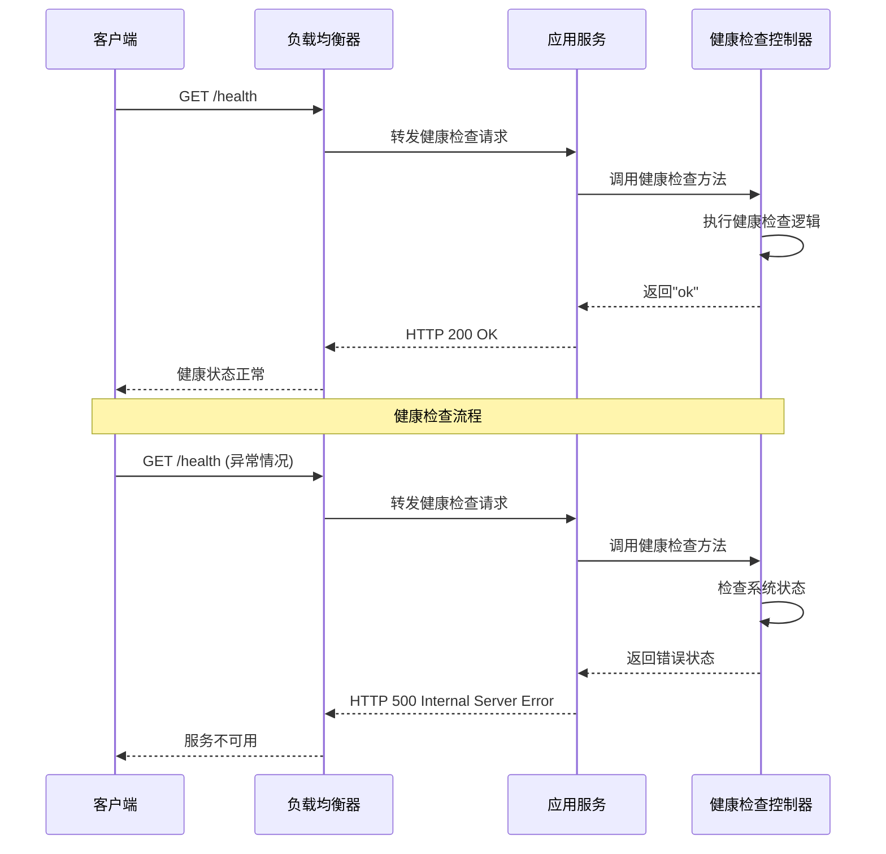
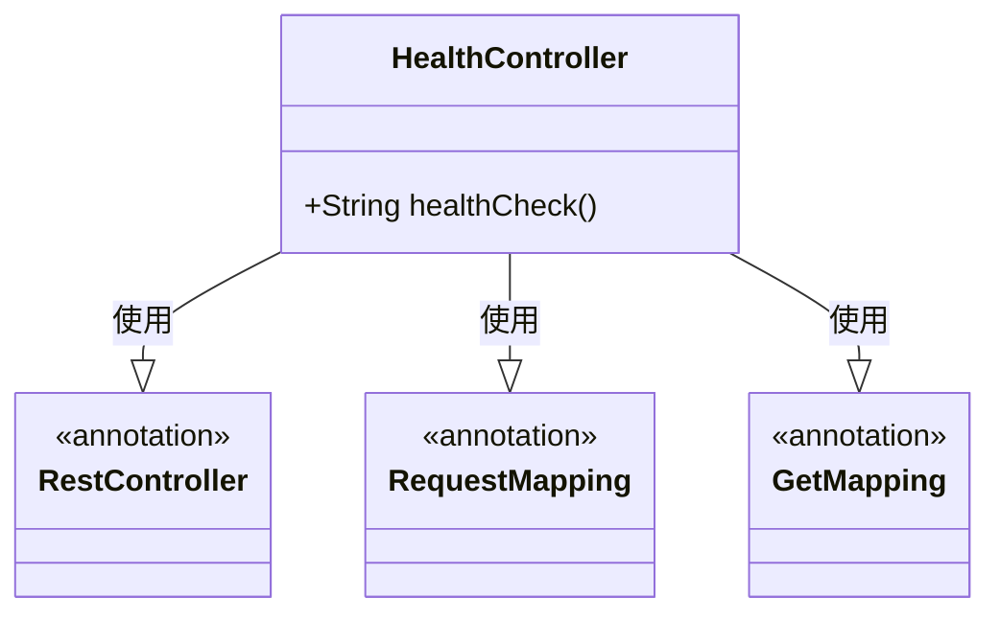
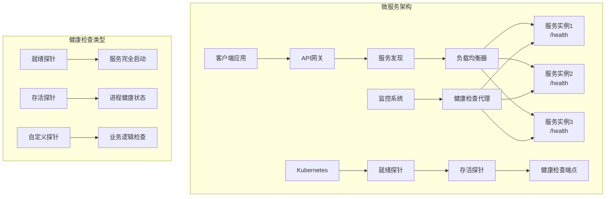
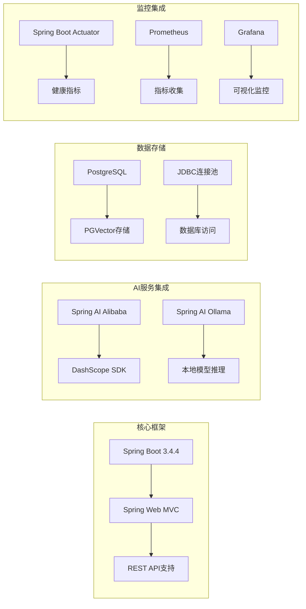
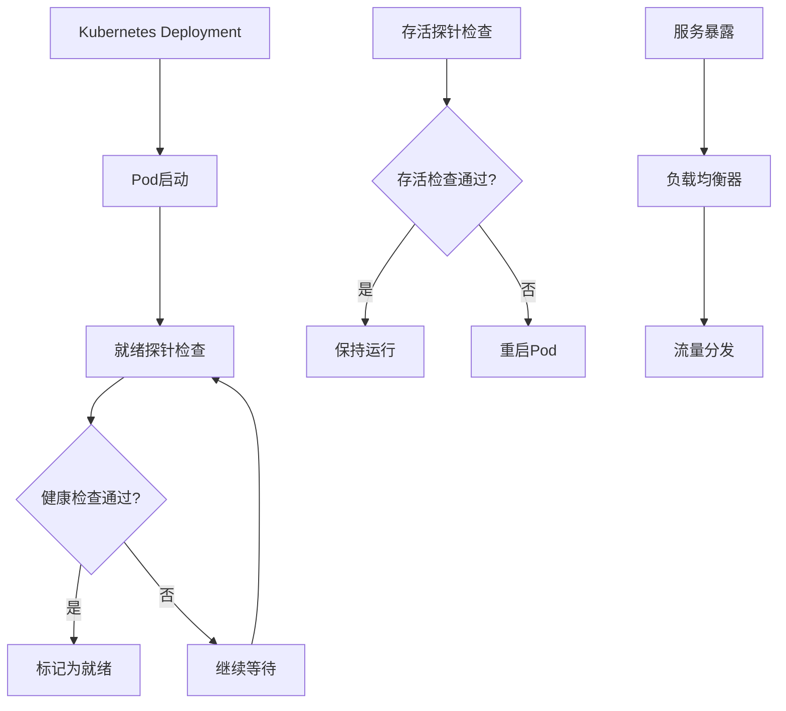

# 健康检查接口

<cite>
**本文档引用的文件**
- [HealthController.java](file://src/main/java/com/yupi/yuaiagent/controller/HealthController.java)
- [YuAiAgentApplication.java](file://src/main/java/com/yupi/yuaiagent/YuAiAgentApplication.java)
- [application.yml](file://src/main/resources/application.yml)
- [application-prod.yml](file://src/main/resources/application-prod.yml)
- [pom.xml](file://pom.xml)
</cite>

## 目录
1. [简介](#简介)
2. [项目结构](#项目结构)
3. [核心组件](#核心组件)
4. [架构概览](#架构概览)
5. [详细组件分析](#详细组件分析)
6. [依赖关系分析](#依赖关系分析)
7. [性能考虑](#性能考虑)
8. [故障排除指南](#故障排除指南)
9. [最佳实践](#最佳实践)
10. [监控集成建议](#监控集成建议)
11. [结论](#结论)

## 简介

健康检查接口是现代微服务架构中至关重要的基础设施组件，用于监控系统运行状态、验证服务可用性和支持自动化运维操作。本项目实现了基础的健康检查接口，为系统的稳定运行提供了必要的监控支撑。

健康检查接口的主要作用包括：
- **服务可用性监控**：实时验证服务是否正常运行
- **负载均衡集成**：为负载均衡器提供健康状态判断依据
- **故障转移支持**：在服务异常时触发自动故障转移机制
- **容器编排支持**：为Kubernetes等容器编排平台提供健康检查端点
- **自动化运维**：支持CI/CD流程中的部署验证

## 项目结构

该项目采用Spring Boot标准项目结构，健康检查接口位于控制器层，与应用主入口和配置文件共同构成完整的健康检查体系。

```mermaid
graph TB
subgraph "项目结构"
A[YuAiAgentApplication<br/>应用主入口] --> B[HealthController<br/>健康检查控制器]
C[application.yml<br/>应用配置] --> D[端口配置<br/>server.port: 8123]
E[application-prod.yml<br/>生产环境配置] --> F[环境特定配置]
G[pom.xml<br/>依赖管理] --> H[Spring Boot Starter Web]
end
subgraph "健康检查架构"
B --> I[/health<br/>REST API端点]
I --> J[GET请求处理]
J --> K[字符串响应<br/>"ok"]
end
```

**图表来源**
- [HealthController.java:1-16](file://src/main/java/com/yupi/yuaiagent/controller/HealthController.java#L1-L16)
- [YuAiAgentApplication.java:1-18](file://src/main/java/com/yupi/yuaiagent/YuAiAgentApplication.java#L1-L18)
- [application.yml:38-41](file://src/main/resources/application.yml#L38-L41)

**章节来源**
- [HealthController.java:1-16](file://src/main/java/com/yupi/yuaiagent/controller/HealthController.java#L1-L16)
- [YuAiAgentApplication.java:1-18](file://src/main/java/com/yupi/yuaiagent/YuAiAgentApplication.java#L1-L18)
- [application.yml:1-66](file://src/main/resources/application.yml#L1-L66)

## 核心组件

### 健康检查控制器

健康检查控制器是系统的核心组件，提供了简洁高效的健康检查接口实现。

**主要特性**：
- **RESTful设计**：遵循REST API设计原则
- **简单响应**：返回标准化的健康状态标识
- **轻量级实现**：最小化资源消耗
- **易于集成**：兼容各种监控工具和平台

**接口规范**：
- **HTTP方法**：GET
- **端点路径**：/health
- **响应内容**：纯文本字符串"ok"
- **响应状态**：HTTP 200 OK

**章节来源**
- [HealthController.java:7-15](file://src/main/java/com/yupi/yuaiagent/controller/HealthController.java#L7-L15)

### 应用配置

应用配置文件定义了健康检查接口的运行环境和相关设置。

**关键配置项**：
- **服务器端口**：8123
- **上下文路径**：/api
- **应用名称**：yu-ai-agent
- **Swagger文档**：启用OpenAPI文档服务

**章节来源**
- [application.yml:38-41](file://src/main/resources/application.yml#L38-L41)
- [application.yml:1-66](file://src/main/resources/application.yml#L1-L66)

## 架构概览

健康检查接口在整个系统架构中扮演着基础设施的角色，为上层应用提供健康状态感知能力。



**图表来源**
- [HealthController.java:11-14](file://src/main/java/com/yupi/yuaiagent/controller/HealthController.java#L11-L14)
- [application.yml:38-41](file://src/main/resources/application.yml#L38-L41)

## 详细组件分析

### 健康检查控制器类图



**图表来源**
- [HealthController.java:3-15](file://src/main/java/com/yupi/yuaiagent/controller/HealthController.java#L3-L15)

### 健康检查流程图

```mermaid
flowchart TD
Start([开始健康检查]) --> Receive[接收HTTP GET请求]
Receive --> Validate[验证请求参数]
Validate --> CheckSystem[检查系统状态]
CheckSystem --> SystemOK{系统状态正常?}
SystemOK --> |是| ReturnOK[返回"ok"]
SystemOK --> |否| ReturnError[返回错误状态]
ReturnOK --> End([结束])
ReturnError --> End
style Start fill:#e1f5fe
style End fill:#e8f5e8
style SystemOK fill:#fff3e0
```

**图表来源**
- [HealthController.java:11-14](file://src/main/java/com/yupi/yuaiagent/controller/HealthController.java#L11-L14)

**章节来源**
- [HealthController.java:1-16](file://src/main/java/com/yupi/yuaiagent/controller/HealthController.java#L1-L16)

### 微服务架构中的健康检查

在微服务架构中，健康检查接口发挥着关键作用：



**图表来源**
- [HealthController.java:8](file://src/main/java/com/yupi/yuaiagent/controller/HealthController.java#L8)
- [application.yml:38-41](file://src/main/resources/application.yml#L38-L41)

## 依赖关系分析

### 技术栈依赖



**图表来源**
- [pom.xml:50-164](file://pom.xml#L50-L164)

### 外部依赖关系

项目依赖于多个外部服务和库：

**AI服务依赖**：
- DashScope API（阿里云百炼）
- Ollama本地模型服务
- Spring AI生态系统

**数据存储依赖**：
- PostgreSQL数据库
- PGVector向量存储
- JDBC驱动程序

**监控依赖**：
- Spring Boot Actuator（可选）
- Prometheus监控系统
- Grafana可视化面板

**章节来源**
- [pom.xml:1-227](file://pom.xml#L1-L227)

## 性能考虑

### 健康检查性能特征

健康检查接口具有以下性能特点：

**响应时间**：
- 内存级响应，毫秒级延迟
- 无需数据库查询或外部服务调用
- 最小化CPU和内存占用

**并发处理**：
- 支持高并发请求
- 无状态设计，线程安全
- 适合大规模监控场景

**资源消耗**：
- 基础内存占用极低
- CPU开销可忽略不计
- 网络带宽需求很小

### 性能优化建议

1. **缓存策略**：当前实现已是最优的无状态设计
2. **连接池配置**：合理配置Tomcat连接池参数
3. **监控频率**：根据业务需求调整检查间隔
4. **负载均衡**：在多实例部署时合理分配请求

## 故障排除指南

### 常见问题诊断

**健康检查失败**：
1. 检查应用是否正常启动
2. 验证端口配置是否正确
3. 确认防火墙规则允许访问
4. 查看应用日志获取详细错误信息

**响应异常**：
1. 检查网络连接状态
2. 验证URL路径拼写
3. 确认HTTP方法使用正确
4. 检查代理服务器配置

**性能问题**：
1. 分析服务器资源使用情况
2. 检查并发连接数限制
3. 监控应用性能指标
4. 优化监控频率设置

### 调试步骤

1. **本地测试**：使用curl或浏览器直接访问`/health`
2. **日志分析**：查看应用启动日志和错误日志
3. **网络诊断**：使用telnet或nc测试端口连通性
4. **监控验证**：确认监控系统能够正确收集指标

**章节来源**
- [HealthController.java:11-14](file://src/main/java/com/yupi/yuaiagent/controller/HealthController.java#L11-L14)

## 最佳实践

### 健康检查设计原则

**简单性原则**：
- 保持实现尽可能简单
- 避免复杂的业务逻辑
- 减少外部依赖

**可靠性原则**：
- 确保接口始终可用
- 提供一致的响应格式
- 实现快速失败机制

**可维护性原则**：
- 文档化接口规范
- 版本化健康检查端点
- 支持配置化行为

### 实施建议

**接口设计**：
- 使用标准HTTP状态码
- 提供详细的错误信息
- 支持多种响应格式（JSON/XML）

**监控集成**：
- 配置适当的检查间隔
- 设置合理的超时时间
- 实现重试和降级策略

**安全考虑**：
- 在生产环境中保护健康检查端点
- 实施访问控制和认证机制
- 监控异常访问模式

## 监控集成建议

### Kubernetes集成



**图表来源**
- [HealthController.java:8](file://src/main/java/com/yupi/yuaiagent/controller/HealthController.java#L8)

### Prometheus集成


### 告警配置指南

**告警阈值设置**：
- 响应时间超过500ms
- 连续3次检查失败
- CPU使用率超过80%
- 内存使用率超过85%

**告警渠道配置**：
- 邮件通知
- Slack消息
- 电话告警
- 微信通知

**告警升级策略**：
- 1分钟内未恢复：升级到高级别告警
- 5分钟内未恢复：通知值班工程师
- 15分钟内未恢复：触发应急预案

## 结论

健康检查接口作为微服务架构的基础设施组件，为系统的稳定运行提供了重要保障。本项目实现的健康检查接口虽然简单，但符合最佳实践要求，具备良好的可扩展性和维护性。

**主要优势**：
- **实现简洁**：代码量少，易于理解和维护
- **性能优异**：零依赖，响应速度快
- **部署简单**：无需额外配置即可使用
- **兼容性强**：支持各种监控和运维工具

**扩展方向**：
- 添加更详细的健康状态信息
- 集成Spring Boot Actuator
- 实现分级健康检查
- 添加自定义健康检查逻辑

对于生产环境，建议结合具体的业务需求和技术栈，选择合适的健康检查实现方案，并建立完善的监控和告警体系，确保系统的高可用性和稳定性。