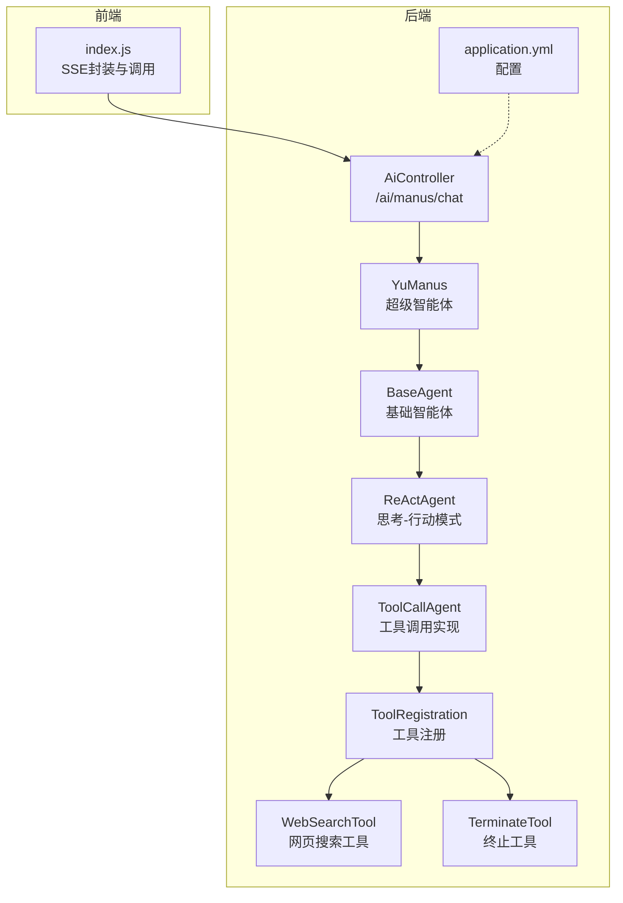
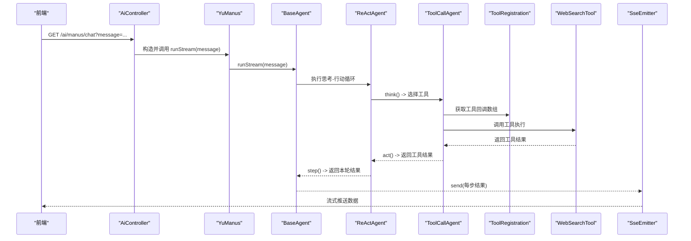
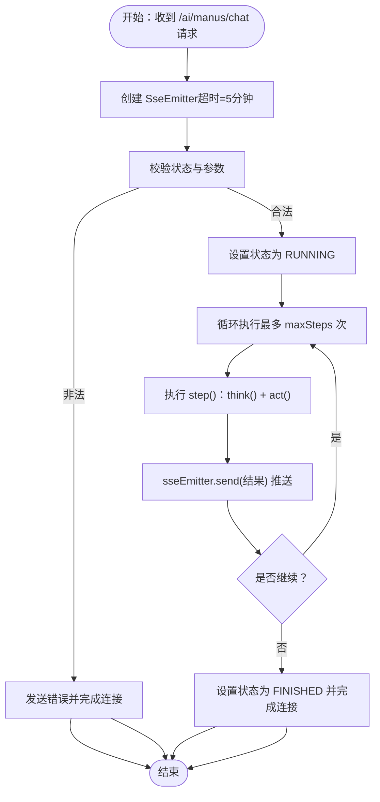
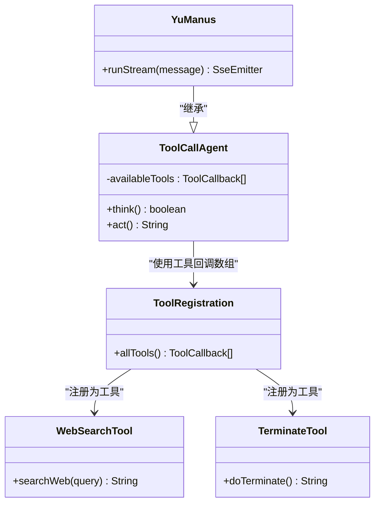
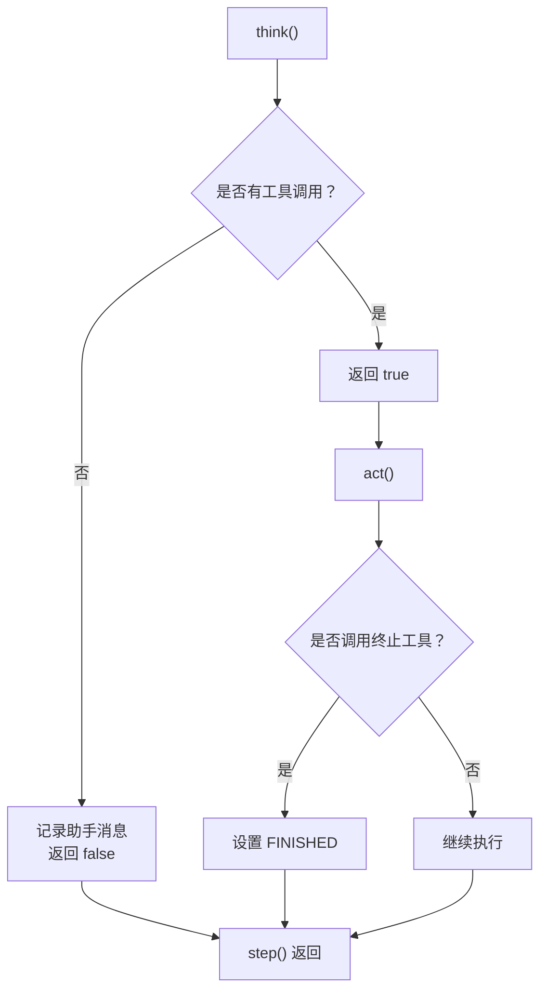
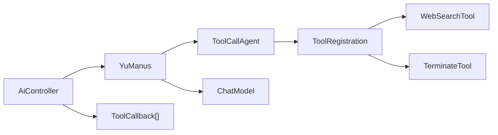

# 智能体接口

<cite>
**本文引用的文件**
- [AiController.java](file://src/main/java/com/yupi/yuaiagent/controller/AiController.java)
- [YuManus.java](file://src/main/java/com/yupi/yuaiagent/agent/YuManus.java)
- [BaseAgent.java](file://src/main/java/com/yupi/yuaiagent/agent/BaseAgent.java)
- [ReActAgent.java](file://src/main/java/com/yupi/yuaiagent/agent/ReActAgent.java)
- [ToolCallAgent.java](file://src/main/java/com/yupi/yuaiagent/agent/ToolCallAgent.java)
- [AgentState.java](file://src/main/java/com/yupi/yuaiagent/agent/model/AgentState.java)
- [ToolRegistration.java](file://src/main/java/com/yupi/yuaiagent/tools/ToolRegistration.java)
- [WebSearchTool.java](file://src/main/java/com/yupi/yuaiagent/tools/WebSearchTool.java)
- [TerminateTool.java](file://src/main/java/com/yupi/yuaiagent/tools/TerminateTool.java)
- [application.yml](file://src/main/resources/application.yml)
- [index.js](file://yu-ai-agent-frontend/src/api/index.js)
- [YuManusTest.java](file://src/test/java/com/yupi/yuaiagent/agent/YuManusTest.java)
</cite>

## 目录
1. [简介](#简介)
2. [项目结构](#项目结构)
3. [核心组件](#核心组件)
4. [架构总览](#架构总览)
5. [详细组件分析](#详细组件分析)
6. [依赖分析](#依赖分析)
7. [性能考虑](#性能考虑)
8. [故障排除指南](#故障排除指南)
9. [结论](#结论)
10. [附录](#附录)

## 简介
本文件面向开发者，提供“超级智能体 YuManus”的完整接口文档，涵盖以下要点：
- /ai/manus/chat GET 接口的调用方式与参数说明
- 智能体运行时的流式输出机制与 SSE 实现细节
- 智能体与工具系统的集成方式（工具回调的注入与使用）
- 实际调用示例与响应格式说明
- 智能体状态管理、错误处理与性能优化建议

## 项目结构
后端采用 Spring Boot + Spring AI 架构，智能体相关代码位于 agent 包，控制器位于 controller 包，工具注册与工具实现位于 tools 包，前端示例位于 yu-ai-agent-frontend。

图表来源
- [AiController.java:100-104](file://src/main/java/com/yupi/yuaiagent/controller/AiController.java#L100-L104)
- [YuManus.java:13-36](file://src/main/java/com/yupi/yuaiagent/agent/YuManus.java#L13-L36)
- [BaseAgent.java:100-177](file://src/main/java/com/yupi/yuaiagent/agent/BaseAgent.java#L100-L177)
- [ReActAgent.java:35-50](file://src/main/java/com/yupi/yuaiagent/agent/ReActAgent.java#L35-L50)
- [ToolCallAgent.java:59-134](file://src/main/java/com/yupi/yuaiagent/agent/ToolCallAgent.java#L59-L134)
- [ToolRegistration.java:18-36](file://src/main/java/com/yupi/yuaiagent/tools/ToolRegistration.java#L18-L36)
- [WebSearchTool.java:29-52](file://src/main/java/com/yupi/yuaiagent/tools/WebSearchTool.java#L29-L52)
- [TerminateTool.java:10-16](file://src/main/java/com/yupi/yuaiagent/tools/TerminateTool.java#L10-L16)
- [application.yml:11-21](file://src/main/resources/application.yml#L11-L21)

章节来源
- [AiController.java:100-104](file://src/main/java/com/yupi/yuaiagent/controller/AiController.java#L100-L104)
- [application.yml:11-21](file://src/main/resources/application.yml#L11-L21)

## 核心组件
- 控制器层：AiController 提供 /ai/manus/chat 接口，负责接收请求并触发智能体流式输出。
- 智能体层：YuManus 继承 ToolCallAgent，内置系统提示词与最大步数，使用 ChatClient 与工具集协作。
- 工具层：ToolRegistration 注册所有可用工具，WebSearchTool、TerminateTool 等作为具体工具实现。
- 配置层：application.yml 提供 DashScope API Key、模型选择与日志级别等关键配置。

章节来源
- [AiController.java:100-104](file://src/main/java/com/yupi/yuaiagent/controller/AiController.java#L100-L104)
- [YuManus.java:13-36](file://src/main/java/com/yupi/yuaiagent/agent/YuManus.java#L13-L36)
- [ToolRegistration.java:18-36](file://src/main/java/com/yupi/yuaiagent/tools/ToolRegistration.java#L18-L36)
- [application.yml:11-21](file://src/main/resources/application.yml#L11-L21)

## 架构总览
下图展示从 HTTP 请求到智能体执行、工具调用与流式返回的完整链路。

图表来源
- [AiController.java:100-104](file://src/main/java/com/yupi/yuaiagent/controller/AiController.java#L100-L104)
- [YuManus.java:13-36](file://src/main/java/com/yupi/yuaiagent/agent/YuManus.java#L13-L36)
- [BaseAgent.java:100-177](file://src/main/java/com/yupi/yuaiagent/agent/BaseAgent.java#L100-L177)
- [ReActAgent.java:35-50](file://src/main/java/com/yupi/yuaiagent/agent/ReActAgent.java#L35-L50)
- [ToolCallAgent.java:59-134](file://src/main/java/com/yupi/yuaiagent/agent/ToolCallAgent.java#L59-L134)
- [ToolRegistration.java:18-36](file://src/main/java/com/yupi/yuaiagent/tools/ToolRegistration.java#L18-L36)
- [WebSearchTool.java:29-52](file://src/main/java/com/yupi/yuaiagent/tools/WebSearchTool.java#L29-L52)

## 详细组件分析

### 接口：/ai/manus/chat（GET）
- 路径：/ai/manus/chat
- 方法：GET
- 参数：
  - message：用户输入的自然语言提示词
- 返回：SSE 流式响应，逐段推送智能体每步执行结果
- 控制器实现：AiController.doChatWithManus(message) 直接构造 YuManus 并调用其 runStream(message)，返回 SseEmitter
- 注意事项：
  - 若智能体处于非空闲状态或 message 为空，将立即发送错误消息并结束连接
  - 默认超时时间为 5 分钟，连接完成后自动清理资源

章节来源
- [AiController.java:100-104](file://src/main/java/com/yupi/yuaiagent/controller/AiController.java#L100-L104)

### 智能体状态管理
- 状态枚举：AgentState（IDLE、RUNNING、FINISHED、ERROR）
- 生命周期：
  - run()：同步执行，最多执行 maxSteps 步，最终返回拼接结果
  - runStream()：异步流式执行，每步通过 SseEmitter.send() 推送
  - onTimeout/onCompletion：分别在超时与完成时更新状态并清理资源
- 关键点：
  - runStream() 在独立线程中执行，避免阻塞主线程
  - 当达到最大步数或显式终止工具被调用时，智能体进入 FINISHED

章节来源
- [AgentState.java:6-27](file://src/main/java/com/yupi/yuaiagent/agent/model/AgentState.java#L6-L27)
- [BaseAgent.java:53-92](file://src/main/java/com/yupi/yuaiagent/agent/BaseAgent.java#L53-L92)
- [BaseAgent.java:100-177](file://src/main/java/com/yupi/yuaiagent/agent/BaseAgent.java#L100-L177)

### 流式输出机制与 SseEmitter 实现
- 实现细节：
  - BaseAgent.runStream() 创建 SseEmitter（默认超时 5 分钟），在子线程中执行循环
  - 每次 step() 完成后，将结果通过 sseEmitter.send() 推送
  - 异常时发送错误消息并完成连接；正常结束后 complete()
  - onTimeout/onCompletion 中统一清理资源并更新状态
- 前端对接：
  - 前端通过 EventSource 接收流式数据，遇到特殊标记可视为结束
  - 前端封装了 connectSSE 方法，便于复用

图表来源
- [BaseAgent.java:100-177](file://src/main/java/com/yupi/yuaiagent/agent/BaseAgent.java#L100-L177)
- [index.js:14-45](file://yu-ai-agent-frontend/src/api/index.js#L14-L45)

章节来源
- [BaseAgent.java:100-177](file://src/main/java/com/yupi/yuaiagent/agent/BaseAgent.java#L100-L177)
- [index.js:14-45](file://yu-ai-agent-frontend/src/api/index.js#L14-L45)

### 工具系统集成与工具回调注入
- 工具注册：
  - ToolRegistration.allTools() 返回 ToolCallback 数组，包含文件操作、网页搜索、网页抓取、资源下载、终端操作、PDF 生成、终止工具
  - WebSearchTool 通过外部搜索 API 获取结果，TerminateTool 用于结束交互
- 智能体工具调用：
  - ToolCallAgent.think()：构造 Prompt，调用 ChatClient，启用 tools(availableTools)，解析工具调用列表
  - ToolCallAgent.act()：使用 ToolCallingManager 执行工具调用，更新消息上下文；若检测到终止工具则设置 FINISHED
- 注入方式：
  - AiController 通过 @Resource 注入 ToolCallback[] allTools，并传递给 YuManus 构造函数
  - YuManus 继承 ToolCallAgent，复用工具调用逻辑

图表来源
- [ToolRegistration.java:18-36](file://src/main/java/com/yupi/yuaiagent/tools/ToolRegistration.java#L18-L36)
- [WebSearchTool.java:29-52](file://src/main/java/com/yupi/yuaiagent/tools/WebSearchTool.java#L29-L52)
- [TerminateTool.java:10-16](file://src/main/java/com/yupi/yuaiagent/tools/TerminateTool.java#L10-L16)
- [ToolCallAgent.java:59-134](file://src/main/java/com/yupi/yuaiagent/agent/ToolCallAgent.java#L59-L134)
- [YuManus.java:13-36](file://src/main/java/com/yupi/yuaiagent/agent/YuManus.java#L13-L36)

章节来源
- [ToolRegistration.java:18-36](file://src/main/java/com/yupi/yuaiagent/tools/ToolRegistration.java#L18-L36)
- [ToolCallAgent.java:59-134](file://src/main/java/com/yupi/yuaiagent/agent/ToolCallAgent.java#L59-L134)
- [AiController.java:100-104](file://src/main/java/com/yupi/yuaiagent/controller/AiController.java#L100-L104)

### 智能体运行流程（ReAct 思考-行动）
- think()：将用户提示词与历史消息组合为 Prompt，调用 ChatClient 获取工具调用列表；若无工具调用，则记录助手消息并返回 false
- act()：执行工具调用，更新消息上下文；若检测到终止工具，设置 FINISHED 并返回工具结果
- step()：先 think()，再 act()，捕获异常并返回错误信息

图表来源
- [ReActAgent.java:35-50](file://src/main/java/com/yupi/yuaiagent/agent/ReActAgent.java#L35-L50)
- [ToolCallAgent.java:59-134](file://src/main/java/com/yupi/yuaiagent/agent/ToolCallAgent.java#L59-L134)

章节来源
- [ReActAgent.java:35-50](file://src/main/java/com/yupi/yuaiagent/agent/ReActAgent.java#L35-L50)
- [ToolCallAgent.java:59-134](file://src/main/java/com/yupi/yuaiagent/agent/ToolCallAgent.java#L59-L134)

### 响应格式与调用示例
- 响应格式：SSE 流式文本，每段代表智能体某一步的执行结果；当达到最大步数或显式终止时，最后会推送结束提示
- 前端调用示例：前端封装了 connectSSE 方法，可直接调用 /ai/manus/chat 并传入 message 参数
- 后端测试示例：单元测试中使用了典型场景（如寻找约会地点并生成 PDF），验证智能体可正常运行

章节来源
- [index.js:52-55](file://yu-ai-agent-frontend/src/api/index.js#L52-L55)
- [YuManusTest.java:14-22](file://src/test/java/com/yupi/yuaiagent/agent/YuManusTest.java#L14-L22)

## 依赖分析
- 控制器依赖：AiController 依赖 LoveApp、ToolCallback[]、ChatModel
- 智能体依赖：YuManus 依赖 ToolCallback[]、ChatModel；内部通过 ChatClient.builder(...) 构建客户端
- 工具依赖：ToolRegistration 注册 WebSearchTool、TerminateTool 等工具；ToolCallAgent 使用 ToolCallingManager 执行工具

图表来源
- [AiController.java:22-29](file://src/main/java/com/yupi/yuaiagent/controller/AiController.java#L22-L29)
- [YuManus.java:15-35](file://src/main/java/com/yupi/yuaiagent/agent/YuManus.java#L15-L35)
- [ToolRegistration.java:18-36](file://src/main/java/com/yupi/yuaiagent/tools/ToolRegistration.java#L18-L36)
- [ToolCallAgent.java:44-51](file://src/main/java/com/yupi/yuaiagent/agent/ToolCallAgent.java#L44-L51)

章节来源
- [AiController.java:22-29](file://src/main/java/com/yupi/yuaiagent/controller/AiController.java#L22-L29)
- [YuManus.java:15-35](file://src/main/java/com/yupi/yuaiagent/agent/YuManus.java#L15-L35)
- [ToolRegistration.java:18-36](file://src/main/java/com/yupi/yuaiagent/tools/ToolRegistration.java#L18-L36)
- [ToolCallAgent.java:44-51](file://src/main/java/com/yupi/yuaiagent/agent/ToolCallAgent.java#L44-L51)

## 性能考虑
- 流式输出：使用 SseEmitter 逐段推送，降低首屏延迟，提升用户体验
- 超时控制：SseEmitter 默认超时 5 分钟，可根据业务调整；连接完成后及时清理资源
- 步数限制：YuManus 设置最大步数，防止长时间循环；必要时可在构造函数中调整
- 日志级别：application.yml 中可将日志级别设为 DEBUG，便于排查 Spring AI 调用细节
- 工具调用：工具执行可能涉及网络请求，建议在工具内部做好超时与重试策略

章节来源
- [BaseAgent.java:100-177](file://src/main/java/com/yupi/yuaiagent/agent/BaseAgent.java#L100-L177)
- [application.yml:64-66](file://src/main/resources/application.yml#L64-L66)

## 故障排除指南
- 常见错误类型与处理：
  - 状态错误：若智能体非空闲状态或 message 为空，将立即发送错误并结束连接
  - 工具调用异常：think()/act() 捕获异常并记录日志，返回错误信息
  - SSE 连接异常：onTimeout/onCompletion 中统一清理资源并更新状态
- 建议排查步骤：
  - 检查 application.yml 中 DashScope API Key 与模型配置是否正确
  - 确认工具回调数组是否成功注入（AiController 中 @Resource 注入）
  - 查看后端日志（DEBUG 级别）定位 Spring AI 调用问题
  - 前端检查 EventSource 连接是否正常断开或报错

章节来源
- [BaseAgent.java:100-177](file://src/main/java/com/yupi/yuaiagent/agent/BaseAgent.java#L100-L177)
- [application.yml:11-21](file://src/main/resources/application.yml#L11-L21)

## 结论
本文档系统性地介绍了超级智能体 YuManus 的接口与实现细节，覆盖了：
- /ai/manus/chat 的调用方式与参数
- 流式输出机制与 SseEmitter 的实现
- 工具系统的集成与工具回调注入
- 实际调用示例与响应格式
- 状态管理、错误处理与性能优化建议

开发者可据此快速集成并稳定使用智能体功能。

## 附录
- 配置项参考（application.yml）：
  - ai.dashscope.api-key：DashScope API Key
  - ai.dashscope.chat.options.model：模型名称（如 qwen-plus）
  - logging.level.org.springframework.ai：日志级别（建议调试阶段设为 DEBUG）

章节来源
- [application.yml:11-21](file://src/main/resources/application.yml#L11-L21)