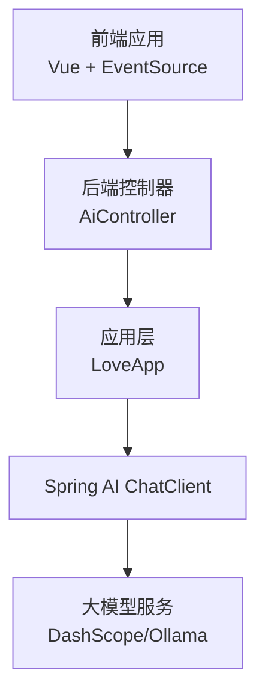
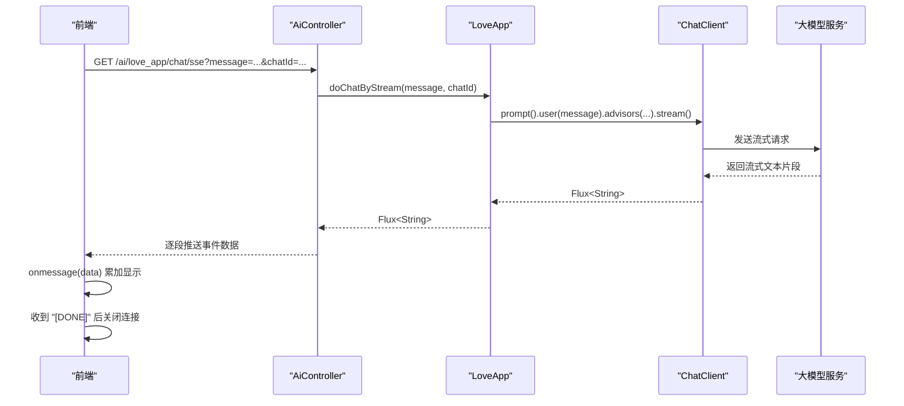
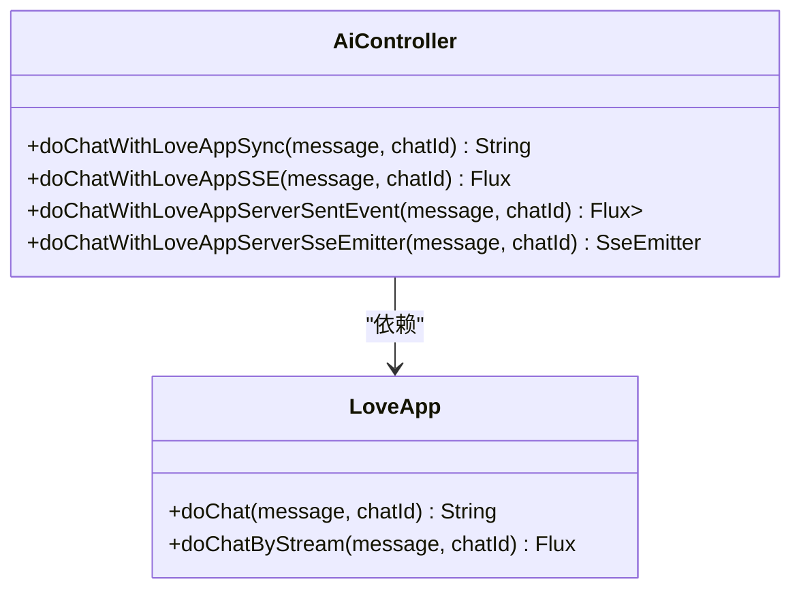

# 聊天接口

<cite>
**本文引用的文件**
- [AiController.java](file://src/main/java/com/yupi/yuaiagent/controller/AiController.java)
- [LoveApp.java](file://src/main/java/com/yupi/yuaiagent/app/LoveApp.java)
- [application.yml](file://src/main/resources/application.yml)
- [index.js](file://yu-ai-agent-frontend/src/api/index.js)
- [LoveMaster.vue](file://yu-ai-agent-frontend/src/views/LoveMaster.vue)
- [README.md](file://README.md)
</cite>

## 目录
1. [简介](#简介)
2. [项目结构](#项目结构)
3. [核心组件](#核心组件)
4. [架构概览](#架构概览)
5. [详细组件分析](#详细组件分析)
6. [依赖分析](#依赖分析)
7. [性能考虑](#性能考虑)
8. [故障排除指南](#故障排除指南)
9. [结论](#结论)
10. [附录](#附录)

## 简介
本文件面向开发者，系统性说明 AI 恋爱大师应用的聊天接口，重点对比同步聊天接口与流式聊天接口的差异、适用场景与参数规范，并深入解析 SSE（Server-Sent Events）流式传输的工作原理与三种实现方式：Flux<String>、ServerSentEvent<String> 与 SseEmitter。同时提供完整的请求示例、响应格式与错误处理方案，明确聊天 ID 参数的作用与最佳实践，帮助开发者正确选择和使用合适的聊天接口。

## 项目结构
后端采用 Spring Boot + Spring AI 框架，控制器层提供统一的聊天入口，应用层封装 AI 调用与对话记忆，前端通过 EventSource 连接后端 SSE 接口，实现流式交互。

图表来源
- [AiController.java:18-105](file://src/main/java/com/yupi/yuaiagent/controller/AiController.java#L18-L105)
- [LoveApp.java:27-62](file://src/main/java/com/yupi/yuaiagent/app/LoveApp.java#L27-L62)

章节来源
- [AiController.java:18-105](file://src/main/java/com/yupi/yuaiagent/controller/AiController.java#L18-L105)
- [LoveApp.java:27-62](file://src/main/java/com/yupi/yuaiagent/app/LoveApp.java#L27-L62)
- [application.yml:38-41](file://src/main/resources/application.yml#L38-L41)

## 核心组件
- 控制器层（AiController）：提供三个聊天接口：
  - 同步聊天：/ai/love_app/chat/sync
  - SSE 流式聊天（Flux<String>）：/ai/love_app/chat/sse
  - SSE 流式聊天（ServerSentEvent<String>）：/ai/love_app/chat/server_sent_event
  - SSE 流式聊天（SseEmitter）：/ai/love_app/chat/sse_emitter
- 应用层（LoveApp）：封装 Spring AI ChatClient，支持多轮对话记忆与流式输出。
- 前端（Vue + EventSource）：通过 EventSource 订阅 SSE，实时接收流式文本片段。

章节来源
- [AiController.java:38-92](file://src/main/java/com/yupi/yuaiagent/controller/AiController.java#L38-L92)
- [LoveApp.java:71-97](file://src/main/java/com/yupi/yuaiagent/app/LoveApp.java#L71-L97)
- [index.js:14-55](file://yu-ai-agent-frontend/src/api/index.js#L14-L55)

## 架构概览
后端通过 AiController 将请求转发至 LoveApp，LoveApp 使用 ChatClient 执行对话并返回流式内容。前端通过 EventSource 订阅 SSE，逐段接收文本片段，直至收到结束标记。

图表来源
- [AiController.java:50-53](file://src/main/java/com/yupi/yuaiagent/controller/AiController.java#L50-L53)
- [LoveApp.java:90-97](file://src/main/java/com/yupi/yuaiagent/app/LoveApp.java#L90-L97)
- [index.js:24-44](file://yu-ai-agent-frontend/src/api/index.js#L24-L44)

## 详细组件分析

### 同步聊天接口（/ai/love_app/chat/sync）
- 方法与路径：GET /ai/love_app/chat/sync
- 请求参数：
  - message：用户输入的文本
  - chatId：会话标识，用于多轮对话记忆
- 响应：字符串（完整回复）
- 特点：一次性返回全部内容，适合简单场景或对实时性要求不高的场景
- 错误处理：由底层异常传播，前端需捕获网络错误与超时

章节来源
- [AiController.java:38-41](file://src/main/java/com/yupi/yuaiagent/controller/AiController.java#L38-L41)
- [LoveApp.java:71-81](file://src/main/java/com/yupi/yuaiagent/app/LoveApp.java#L71-L81)

### SSE 流式聊天接口（Flux<String>）
- 方法与路径：GET /ai/love_app/chat/sse
- 响应类型：text/event-stream（MediaType.TEXT_EVENT_STREAM_VALUE）
- 请求参数：
  - message：用户输入的文本
  - chatId：会话标识，用于多轮对话记忆
- 响应格式：逐段推送文本片段，最后以 "[DONE]" 结束
- 特点：前端可实时展示逐步生成的内容，提升交互体验
- 典型使用：前端通过 EventSource 订阅，逐段拼接显示

章节来源
- [AiController.java:50-53](file://src/main/java/com/yupi/yuaiagent/controller/AiController.java#L50-L53)
- [LoveApp.java:90-97](file://src/main/java/com/yupi/yuaiagent/app/LoveApp.java#L90-L97)
- [index.js:24-44](file://yu-ai-agent-frontend/src/api/index.js#L24-L44)

### SSE 流式聊天接口（ServerSentEvent<String>）
- 方法与路径：GET /ai/love_app/chat/server_sent_event
- 响应类型：Flux<ServerSentEvent<String>>
- 请求参数：同上
- 响应格式：逐段推送 ServerSentEvent，data 字段承载文本片段，最后以 "[DONE]" 结束
- 特点：显式使用 ServerSentEvent 包装，便于扩展事件字段（如事件名、ID、重试时间等）

章节来源
- [AiController.java:62-68](file://src/main/java/com/yupi/yuaiagent/controller/AiController.java#L62-L68)

### SSE 流式聊天接口（SseEmitter）
- 方法与路径：GET /ai/love_app/chat/sse_emitter
- 响应类型：SseEmitter
- 请求参数：同上
- 特点：手动订阅 Flux 并通过 SseEmitter.send() 推送，支持较长超时（默认 3 分钟），适合复杂业务逻辑或需要细粒度控制的场景
- 错误处理：订阅回调中捕获 IO 异常并完成或错误完成

章节来源
- [AiController.java:77-92](file://src/main/java/com/yupi/yuaiagent/controller/AiController.java#L77-L92)

### SSE 工作原理与三种实现方式
- Flux<String>：最简洁的实现，直接返回流式字符串，适合大多数标准场景
- ServerSentEvent<String>：在 Flux<String> 基础上包装为标准 SSE 格式，便于客户端解析与扩展
- SseEmitter：手动订阅 Flux 并推送，适合需要自定义超时、错误处理或与传统 Servlet 模式集成的场景

章节来源
- [AiController.java:50-92](file://src/main/java/com/yupi/yuaiagent/controller/AiController.java#L50-L92)

### 聊天 ID 参数的作用与最佳实践
- 作用：通过 ChatMemory.CONVERSATION_ID 参数将当前请求绑定到特定会话，实现多轮对话记忆
- 最佳实践：
  - 前端每次发起新会话时生成新的 chatId
  - 在同一浏览器会话中复用 chatId 以延续对话历史
  - 建议使用随机字符串或 UUID，避免冲突
  - 前端示例：在页面加载时生成 chatId 并在每次发送消息时携带

章节来源
- [LoveApp.java:75](file://src/main/java/com/yupi/yuaiagent/app/LoveApp.java#L75)
- [LoveMaster.vue:55-58](file://yu-ai-agent-frontend/src/views/LoveMaster.vue#L55-L58)
- [LoveMaster.vue:83](file://yu-ai-agent-frontend/src/views/LoveMaster.vue#L83)

### 前端集成与请求示例
- 前端通过 EventSource 订阅后端 SSE 接口，示例：
  - 同步接口：GET /ai/love_app/chat/sync?message=你好&chatId=love_xxx
  - SSE 接口：GET /ai/love_app/chat/sse?message=你好&chatId=love_xxx
- 前端封装：connectSSE(url, params, onMessage, onError) 会自动拼接查询参数并监听 onmessage 与 onerror

章节来源
- [index.js:14-55](file://yu-ai-agent-frontend/src/api/index.js#L14-L55)
- [LoveMaster.vue:83](file://yu-ai-agent-frontend/src/views/LoveMaster.vue#L83)

## 依赖分析
- 控制器依赖应用层：AiController 注入 LoveApp，将请求转发至应用层
- 应用层依赖 Spring AI：LoveApp 使用 ChatClient 执行对话与流式输出
- 前端依赖后端接口：通过 EventSource 订阅 SSE，实现流式展示

图表来源
- [AiController.java:22-29](file://src/main/java/com/yupi/yuaiagent/controller/AiController.java#L22-L29)
- [LoveApp.java:31-61](file://src/main/java/com/yupi/yuaiagent/app/LoveApp.java#L31-L61)

章节来源
- [AiController.java:22-29](file://src/main/java/com/yupi/yuaiagent/controller/AiController.java#L22-L29)
- [LoveApp.java:31-61](file://src/main/java/com/yupi/yuaiagent/app/LoveApp.java#L31-L61)

## 性能考虑
- 流式传输优势：降低首屏延迟，改善用户体验；适合长文本生成场景
- 超时控制：SseEmitter 默认 3 分钟超时，可根据业务需要调整
- 前端节流：前端可对连续片段进行合并与节流显示，减少 DOM 更新频率
- 日志与可观测性：可启用 Spring AI 日志级别以观察调用细节

章节来源
- [AiController.java:79-80](file://src/main/java/com/yupi/yuaiagent/controller/AiController.java#L79-L80)
- [application.yml:64-66](file://src/main/resources/application.yml#L64-L66)

## 故障排除指南
- 常见错误
  - 网络连接失败：EventSource.onerror 会触发，前端应提示用户重试
  - SSE 结束标记未到达：检查后端是否正确推送 "[DONE]"
  - 会话记忆异常：确认 chatId 是否一致且未被意外清理
- 建议处理流程
  - 前端：捕获 onerror，显示错误状态，允许用户重新发起请求
  - 后端：在 SseEmitter 实现中捕获 IO 异常并完成或错误完成，避免连接泄漏
  - 会话管理：前端在页面卸载时主动关闭 EventSource，避免后台连接占用

章节来源
- [index.js:38-44](file://yu-ai-agent-frontend/src/api/index.js#L38-L44)
- [AiController.java:83-89](file://src/main/java/com/yupi/yuaiagent/controller/AiController.java#L83-L89)
- [LoveMaster.vue:102-107](file://yu-ai-agent-frontend/src/views/LoveMaster.vue#L102-L107)

## 结论
- 同步接口适合简单场景，流式接口适合需要实时反馈的聊天体验
- SSE 的三种实现各有侧重：Flux<String> 最简洁，ServerSentEvent<String> 更标准，SseEmitter 更灵活
- chatId 是实现多轮对话记忆的关键，建议前端每次会话生成唯一 ID 并贯穿整个对话生命周期
- 前端应妥善处理 SSE 的连接、错误与结束标记，确保良好的用户体验

## 附录

### 接口对比表
- /ai/love_app/chat/sync
  - 方法：GET
  - 参数：message, chatId
  - 响应：字符串（完整回复）
  - 适用场景：简单问答、非实时场景
- /ai/love_app/chat/sse
  - 方法：GET
  - 参数：message, chatId
  - 响应：text/event-stream（逐段文本，以 "[DONE]" 结束）
  - 适用场景：实时聊天、逐步展示
- /ai/love_app/chat/server_sent_event
  - 方法：GET
  - 参数：message, chatId
  - 响应：Flux<ServerSentEvent<String>>
  - 适用场景：需要标准 SSE 格式或扩展事件字段
- /ai/love_app/chat/sse_emitter
  - 方法：GET
  - 参数：message, chatId
  - 响应：SseEmitter（手动推送，支持较长超时）
  - 适用场景：复杂业务、需要细粒度控制

章节来源
- [AiController.java:38-92](file://src/main/java/com/yupi/yuaiagent/controller/AiController.java#L38-L92)

### 响应格式说明
- 文本片段：每段文本作为事件数据推送
- 结束标记："[DONE]" 表示流结束，前端应关闭连接
- 错误标记：网络错误或异常时，前端 onerror 会被触发

章节来源
- [index.js:26-44](file://yu-ai-agent-frontend/src/api/index.js#L26-L44)

### 参数规范
- message：必填，用户输入的文本
- chatId：必填，会话标识，用于多轮对话记忆
- 前端建议：每次新建会话生成新的 chatId；在同一会话中保持不变

章节来源
- [LoveApp.java:75](file://src/main/java/com/yupi/yuaiagent/app/LoveApp.java#L75)
- [LoveMaster.vue:55-58](file://yu-ai-agent-frontend/src/views/LoveMaster.vue#L55-L58)