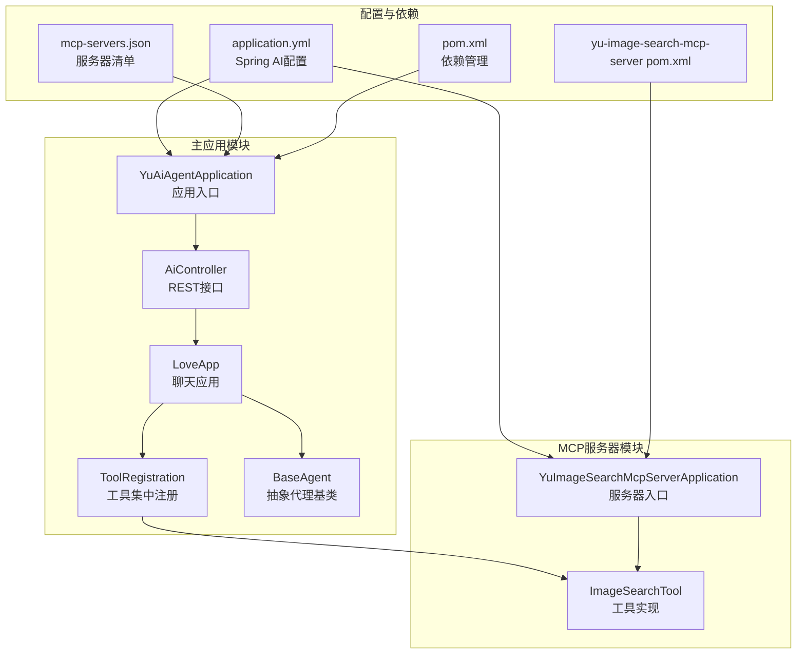
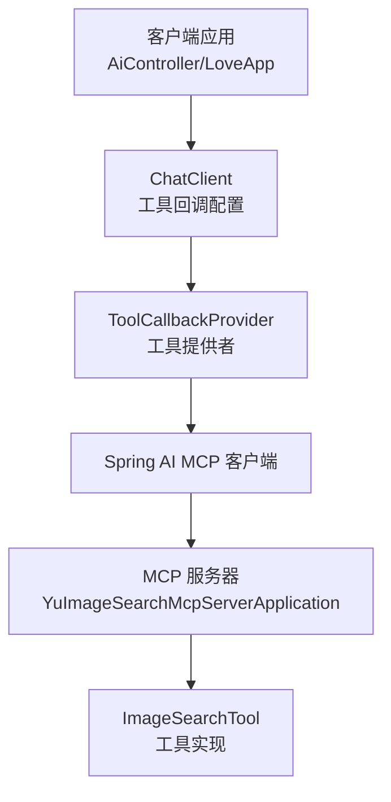
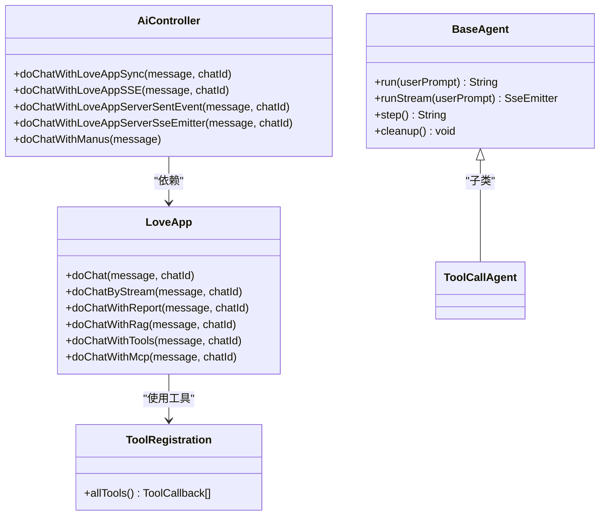
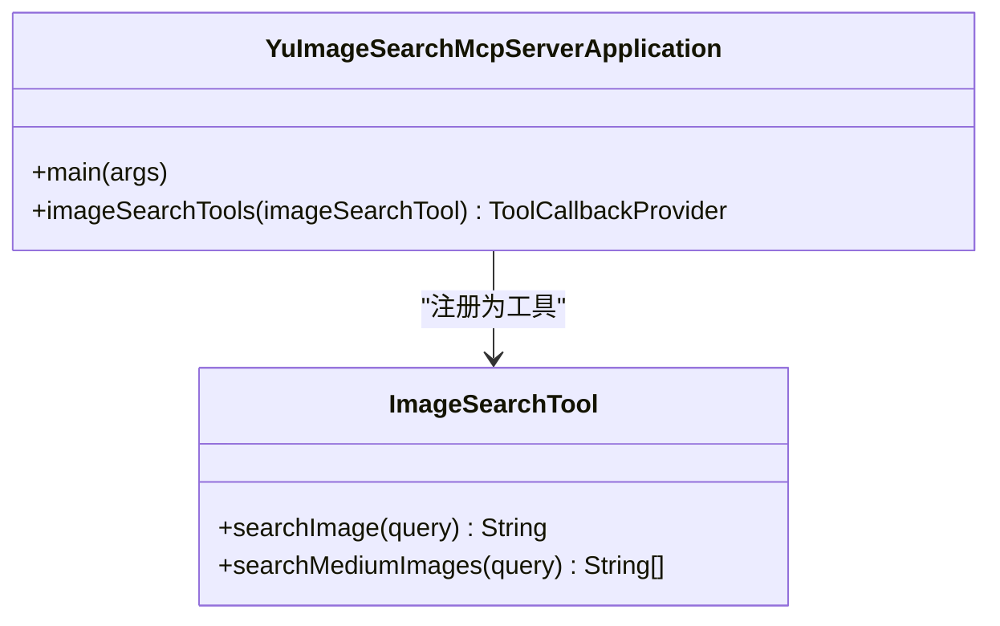
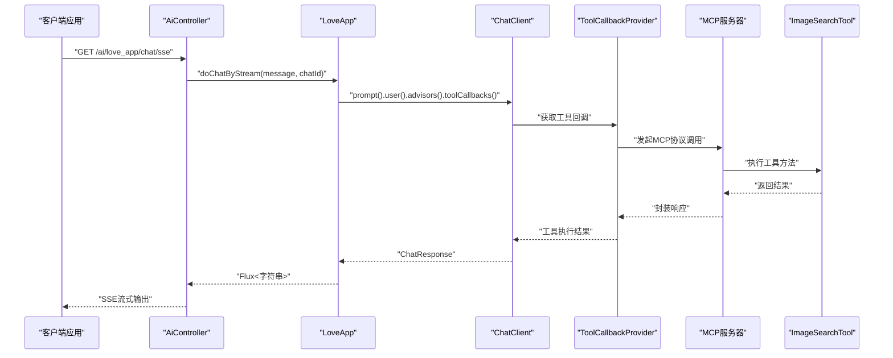
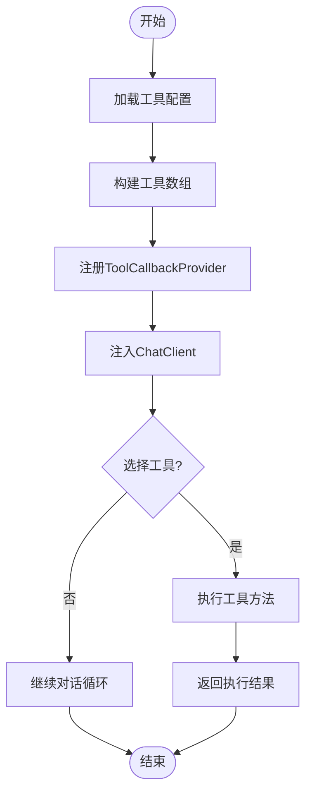
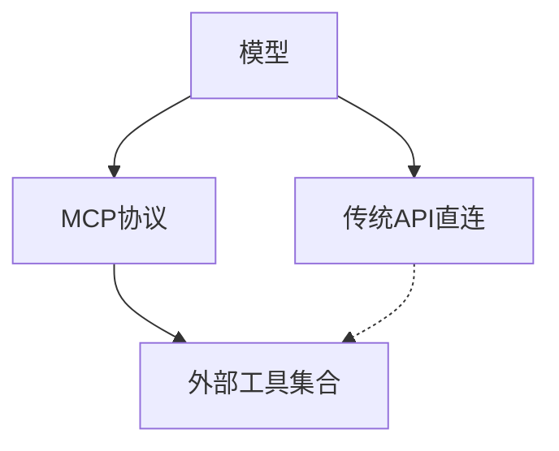
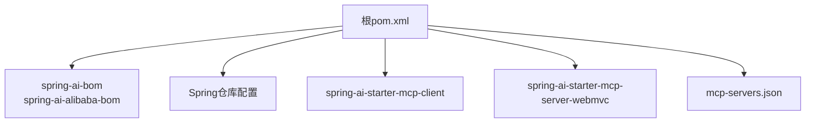

# MCP协议基础

<cite>
**本文档引用的文件**
- [pom.xml](file://pom.xml)
- [application.yml](file://src/main/resources/application.yml)
- [mcp-servers.json](file://src/main/resources/mcp-servers.json)
- [YuAiAgentApplication.java](file://src/main/java/com/yupi/yuaiagent/YuAiAgentApplication.java)
- [AiController.java](file://src/main/java/com/yupi/yuaiagent/controller/AiController.java)
- [LoveApp.java](file://src/main/java/com/yupi/yuaiagent/app/LoveApp.java)
- [BaseAgent.java](file://src/main/java/com/yupi/yuaiagent/agent/BaseAgent.java)
- [ToolRegistration.java](file://src/main/java/com/yupi/yuaiagent/tools/ToolRegistration.java)
- [WebSearchTool.java](file://src/main/java/com/yupi/yuaiagent/tools/WebSearchTool.java)
- [WebScrapingTool.java](file://src/main/java/com/yupi/yuaiagent/tools/WebScrapingTool.java)
- [FileOperationTool.java](file://src/main/java/com/yupi/yuaiagent/tools/FileOperationTool.java)
- [YuImageSearchMcpServerApplication.java](file://yu-image-search-mcp-server/src/main/java/com/yupi/yuimagesearchmcpserver/YuImageSearchMcpServerApplication.java)
- [ImageSearchTool.java](file://yu-image-search-mcp-server/src/main/java/com/yupi/yuimagesearchmcpserver/tools/ImageSearchTool.java)
- [yu-image-search-mcp-server pom.xml](file://yu-image-search-mcp-server/pom.xml)
- [yu-image-search-mcp-server application.yml](file://yu-image-search-mcp-server/src/main/resources/application.yml)
- [yu-image-search-mcp-server application-stdio.yml](file://yu-image-search-mcp-server/src/main/resources/application-stdio.yml)
- [yu-image-search-mcp-server application-sse.yml](file://yu-image-search-mcp-server/src/main/resources/application-sse.yml)
</cite>

## 目录
1. [简介](#简介)
2. [项目结构](#项目结构)
3. [核心组件](#核心组件)
4. [架构总览](#架构总览)
5. [详细组件分析](#详细组件分析)
6. [依赖分析](#依赖分析)
7. [性能考虑](#性能考虑)
8. [故障排除指南](#故障排除指南)
9. [结论](#结论)
10. [附录](#附录)

## 简介
本文件系统性阐述MCP（模型上下文协议）在本项目中的实现与应用，重点覆盖以下方面：
- 协议核心概念与设计理念：以Spring AI MCP客户端与服务器生态为核心，通过标准化的工具回调机制实现模型与外部工具的解耦协作。
- 工作原理与通信机制：客户端通过ChatClient配置工具回调或ToolCallbackProvider，服务器端通过MethodToolCallbackProvider暴露工具方法，二者通过标准协议进行交互。
- 在AI智能体中的作用与价值：MCP使智能体具备“工具即插即用”的能力，提升任务执行灵活性与可扩展性。
- 优势与适用场景：对比传统API直连方式，MCP提供统一的工具描述、参数校验、错误处理与流式输出支持，降低集成复杂度。
- 入门示例与基本使用：结合项目中的图像搜索MCP服务器与工具注册，给出可操作的启动与调用流程。
- 版本兼容性与扩展性：基于Spring AI 1.0.0版本BOM与Maven依赖管理，确保版本一致性与后续升级路径。

## 项目结构
本项目采用多模块结构，核心模块包括：
- 主应用模块：提供AI聊天、工具注册、控制器与应用入口。
- MCP服务器模块：独立的图像搜索MCP服务器，暴露工具方法供主应用调用。
- 资源配置：包含MCP服务器配置文件与Spring AI配置。

**图表来源**
- [YuAiAgentApplication.java:1-18](file://src/main/java/com/yupi/yuaiagent/YuAiAgentApplication.java#L1-L18)
- [AiController.java:1-106](file://src/main/java/com/yupi/yuaiagent/controller/AiController.java#L1-L106)
- [LoveApp.java:1-227](file://src/main/java/com/yupi/yuaiagent/app/LoveApp.java#L1-L227)
- [ToolRegistration.java:1-38](file://src/main/java/com/yupi/yuaiagent/tools/ToolRegistration.java#L1-L38)
- [BaseAgent.java:1-193](file://src/main/java/com/yupi/yuaiagent/agent/BaseAgent.java#L1-L193)
- [YuImageSearchMcpServerApplication.java:1-25](file://yu-image-search-mcp-server/src/main/java/com/yupi/yuimagesearchmcpserver/YuImageSearchMcpServerApplication.java#L1-L25)
- [ImageSearchTool.java:1-67](file://yu-image-search-mcp-server/src/main/java/com/yupi/yuimagesearchmcpserver/tools/ImageSearchTool.java#L1-L67)
- [application.yml:1-66](file://src/main/resources/application.yml#L1-L66)
- [mcp-servers.json:1-25](file://src/main/resources/mcp-servers.json#L1-L25)
- [pom.xml:1-227](file://pom.xml#L1-L227)
- [yu-image-search-mcp-server pom.xml:1-121](file://yu-image-search-mcp-server/pom.xml#L1-L121)

**章节来源**
- [pom.xml:1-227](file://pom.xml#L1-L227)
- [application.yml:1-66](file://src/main/resources/application.yml#L1-L66)
- [mcp-servers.json:1-25](file://src/main/resources/mcp-servers.json#L1-L25)
- [YuAiAgentApplication.java:1-18](file://src/main/java/com/yupi/yuaiagent/YuAiAgentApplication.java#L1-L18)
- [AiController.java:1-106](file://src/main/java/com/yupi/yuaiagent/controller/AiController.java#L1-L106)
- [LoveApp.java:1-227](file://src/main/java/com/yupi/yuaiagent/app/LoveApp.java#L1-L227)
- [BaseAgent.java:1-193](file://src/main/java/com/yupi/yuaiagent/agent/BaseAgent.java#L1-L193)
- [ToolRegistration.java:1-38](file://src/main/java/com/yupi/yuaiagent/tools/ToolRegistration.java#L1-L38)
- [YuImageSearchMcpServerApplication.java:1-25](file://yu-image-search-mcp-server/src/main/java/com/yupi/yuimagesearchmcpserver/YuImageSearchMcpServerApplication.java#L1-L25)
- [ImageSearchTool.java:1-67](file://yu-image-search-mcp-server/src/main/java/com/yupi/yuimagesearchmcpserver/tools/ImageSearchTool.java#L1-L67)
- [yu-image-search-mcp-server pom.xml:1-121](file://yu-image-search-mcp-server/pom.xml#L1-L121)
- [yu-image-search-mcp-server application.yml:1-7](file://yu-image-search-mcp-server/src/main/resources/application.yml#L1-L7)
- [yu-image-search-mcp-server application-stdio.yml:1-13](file://yu-image-search-mcp-server/src/main/resources/application-stdio.yml#L1-L13)
- [yu-image-search-mcp-server application-sse.yml:1-9](file://yu-image-search-mcp-server/src/main/resources/application-sse.yml#L1-L9)

## 核心组件
- Spring AI MCP客户端与服务器生态：通过Maven依赖引入，实现客户端与服务器的标准协议对接。
- 工具回调与工具提供者：客户端侧通过ToolCallback[]或ToolCallbackProvider聚合工具；服务器侧通过MethodToolCallbackProvider暴露工具方法。
- 控制器与应用层：AiController提供REST接口，LoveApp封装聊天客户端与顾问策略，BaseAgent提供代理执行框架。
- 配置与资源：application.yml配置Spring AI与MCP客户端参数；mcp-servers.json定义本地MCP服务器清单。

**章节来源**
- [pom.xml:95-99](file://pom.xml#L95-L99)
- [application.yml:22-30](file://src/main/resources/application.yml#L22-L30)
- [mcp-servers.json:1-25](file://src/main/resources/mcp-servers.json#L1-L25)
- [AiController.java:1-106](file://src/main/java/com/yupi/yuaiagent/controller/AiController.java#L1-L106)
- [LoveApp.java:174-226](file://src/main/java/com/yupi/yuaiagent/app/LoveApp.java#L174-L226)
- [ToolRegistration.java:1-38](file://src/main/java/com/yupi/yuaiagent/tools/ToolRegistration.java#L1-L38)
- [YuImageSearchMcpServerApplication.java:17-22](file://yu-image-search-mcp-server/src/main/java/com/yupi/yuimagesearchmcpserver/YuImageSearchMcpServerApplication.java#L17-L22)

## 架构总览
MCP在本项目中的整体架构由“客户端应用 + MCP服务器 + 工具提供者”构成，客户端通过ChatClient配置工具回调或ToolCallbackProvider，服务器通过MethodToolCallbackProvider暴露工具方法，二者通过标准协议进行交互。

**图表来源**
- [AiController.java:1-106](file://src/main/java/com/yupi/yuaiagent/controller/AiController.java#L1-L106)
- [LoveApp.java:174-226](file://src/main/java/com/yupi/yuaiagent/app/LoveApp.java#L174-L226)
- [YuImageSearchMcpServerApplication.java:17-22](file://yu-image-search-mcp-server/src/main/java/com/yupi/yuimagesearchmcpserver/YuImageSearchMcpServerApplication.java#L17-L22)
- [ImageSearchTool.java:1-67](file://yu-image-search-mcp-server/src/main/java/com/yupi/yuimagesearchmcpserver/tools/ImageSearchTool.java#L1-L67)

## 详细组件分析

### 组件A：MCP客户端与工具集成
- 客户端配置：AiController与LoveApp通过注入ToolCallback[]或ToolCallbackProvider，将工具能力注入ChatClient，实现模型与工具的解耦协作。
- 工具注册：ToolRegistration集中管理多种工具，包括文件操作、网页搜索、网页抓取、资源下载、终端操作、PDF生成与终止工具。
- 代理执行：BaseAgent提供抽象代理基类，支持同步与流式执行，便于在不同场景下复用。

**图表来源**
- [AiController.java:1-106](file://src/main/java/com/yupi/yuaiagent/controller/AiController.java#L1-L106)
- [LoveApp.java:1-227](file://src/main/java/com/yupi/yuaiagent/app/LoveApp.java#L1-L227)
- [ToolRegistration.java:1-38](file://src/main/java/com/yupi/yuaiagent/tools/ToolRegistration.java#L1-L38)
- [BaseAgent.java:1-193](file://src/main/java/com/yupi/yuaiagent/agent/BaseAgent.java#L1-L193)

**章节来源**
- [AiController.java:1-106](file://src/main/java/com/yupi/yuaiagent/controller/AiController.java#L1-L106)
- [LoveApp.java:174-226](file://src/main/java/com/yupi/yuaiagent/app/LoveApp.java#L174-L226)
- [ToolRegistration.java:1-38](file://src/main/java/com/yupi/yuaiagent/tools/ToolRegistration.java#L1-L38)
- [BaseAgent.java:1-193](file://src/main/java/com/yupi/yuaiagent/agent/BaseAgent.java#L1-L193)

### 组件B：MCP服务器与工具提供
- 服务器入口：YuImageSearchMcpServerApplication通过Spring Boot启动MCP服务器，并通过MethodToolCallbackProvider注册ImageSearchTool。
- 工具实现：ImageSearchTool提供图像搜索能力，通过HTTP请求调用第三方API并返回结果。
- 配置文件：yu-image-search-mcp-server提供application.yml与application-stdio.yml、application-sse.yml，分别对应不同启动模式。

**图表来源**
- [YuImageSearchMcpServerApplication.java:1-25](file://yu-image-search-mcp-server/src/main/java/com/yupi/yuimagesearchmcpserver/YuImageSearchMcpServerApplication.java#L1-L25)
- [ImageSearchTool.java:1-67](file://yu-image-search-mcp-server/src/main/java/com/yupi/yuimagesearchmcpserver/tools/ImageSearchTool.java#L1-L67)

**章节来源**
- [YuImageSearchMcpServerApplication.java:1-25](file://yu-image-search-mcp-server/src/main/java/com/yupi/yuimagesearchmcpserver/YuImageSearchMcpServerApplication.java#L1-L25)
- [ImageSearchTool.java:1-67](file://yu-image-search-mcp-server/src/main/java/com/yupi/yuimagesearchmcpserver/tools/ImageSearchTool.java#L1-L67)
- [yu-image-search-mcp-server application.yml:1-7](file://yu-image-search-mcp-server/src/main/resources/application.yml#L1-L7)
- [yu-image-search-mcp-server application-stdio.yml:1-13](file://yu-image-search-mcp-server/src/main/resources/application-stdio.yml#L1-L13)
- [yu-image-search-mcp-server application-sse.yml:1-9](file://yu-image-search-mcp-server/src/main/resources/application-sse.yml#L1-L9)

### 组件C：API/服务组件调用流程
以下序列图展示了客户端通过ChatClient调用MCP服务器工具的典型流程。

**图表来源**
- [AiController.java:50-53](file://src/main/java/com/yupi/yuaiagent/controller/AiController.java#L50-L53)
- [LoveApp.java:174-226](file://src/main/java/com/yupi/yuaiagent/app/LoveApp.java#L174-L226)
- [YuImageSearchMcpServerApplication.java:17-22](file://yu-image-search-mcp-server/src/main/java/com/yupi/yuimagesearchmcpserver/YuImageSearchMcpServerApplication.java#L17-L22)
- [ImageSearchTool.java:25-32](file://yu-image-search-mcp-server/src/main/java/com/yupi/yuimagesearchmcpserver/tools/ImageSearchTool.java#L25-L32)

**章节来源**
- [AiController.java:50-53](file://src/main/java/com/yupi/yuaiagent/controller/AiController.java#L50-L53)
- [LoveApp.java:174-226](file://src/main/java/com/yupi/yuaiagent/app/LoveApp.java#L174-L226)

### 组件D：复杂逻辑组件（工具注册与选择）
工具注册与选择涉及多个工具的集中管理与按需调用，流程如下：

**图表来源**
- [ToolRegistration.java:18-36](file://src/main/java/com/yupi/yuaiagent/tools/ToolRegistration.java#L18-L36)
- [LoveApp.java:174-198](file://src/main/java/com/yupi/yuaiagent/app/LoveApp.java#L174-L198)

**章节来源**
- [ToolRegistration.java:1-38](file://src/main/java/com/yupi/yuaiagent/tools/ToolRegistration.java#L1-L38)
- [LoveApp.java:174-198](file://src/main/java/com/yupi/yuaiagent/app/LoveApp.java#L174-L198)

### 概念性概述
- MCP协议核心：通过标准化的工具描述与参数传递，实现模型对工具的动态发现与调用。
- 与传统API对比：传统方式通常硬编码API调用逻辑，MCP通过协议抽象实现“声明式工具调用”，提升可维护性与扩展性。
- 适用场景：需要频繁集成外部工具、支持多模态工具、强调可插拔性的智能体系统。

[此图为概念性示意，不直接映射具体源码文件]

## 依赖分析
- Spring AI MCP客户端与服务器：通过spring-ai-bom与spring-ai-alibaba-bom统一版本管理，确保MCP客户端与服务器依赖一致。
- Maven仓库：启用Spring里程碑与快照仓库，保证能够拉取到最新版本的Spring AI相关依赖。
- 本地MCP服务器：通过mcp-servers.json配置本地MCP服务器命令与参数，支持stdio与sse两种模式。

**图表来源**
- [pom.xml:32-48](file://pom.xml#L32-L48)
- [pom.xml:95-99](file://pom.xml#L95-L99)
- [yu-image-search-mcp-server pom.xml:32-41](file://yu-image-search-mcp-server/pom.xml#L32-L41)
- [yu-image-search-mcp-server pom.xml:48-51](file://yu-image-search-mcp-server/pom.xml#L48-L51)
- [mcp-servers.json:1-25](file://src/main/resources/mcp-servers.json#L1-L25)

**章节来源**
- [pom.xml:32-48](file://pom.xml#L32-L48)
- [pom.xml:95-99](file://pom.xml#L95-L99)
- [yu-image-search-mcp-server pom.xml:32-41](file://yu-image-search-mcp-server/pom.xml#L32-L41)
- [yu-image-search-mcp-server pom.xml:48-51](file://yu-image-search-mcp-server/pom.xml#L48-L51)
- [mcp-servers.json:1-25](file://src/main/resources/mcp-servers.json#L1-L25)

## 性能考虑
- 流式输出：通过SSE与Reactor Flux实现流式响应，降低用户等待时间，提升交互体验。
- 工具调用开销：MCP工具调用涉及网络I/O与第三方API调用，建议在工具层增加缓存与重试策略。
- 并发与资源：BaseAgent的异步执行与SseEmitter超时设置，有助于避免阻塞与资源泄漏。
- 配置优化：合理设置最大步数与超时时间，平衡执行效率与稳定性。

[本节为通用性能指导，不直接分析具体源码文件]

## 故障排除指南
- 工具调用异常：工具方法内部捕获异常并返回错误信息，便于定位问题。
- SSE连接问题：检查SseEmitter超时与完成回调，确保连接正常关闭与清理。
- MCP服务器未启动：确认mcp-servers.json配置正确，服务器端口与启动参数无误。
- 依赖版本冲突：通过BOM统一管理版本，避免不同模块间版本不一致导致的问题。

**章节来源**
- [ImageSearchTool.java:25-32](file://yu-image-search-mcp-server/src/main/java/com/yupi/yuimagesearchmcpserver/tools/ImageSearchTool.java#L25-L32)
- [BaseAgent.java:100-177](file://src/main/java/com/yupi/yuaiagent/agent/BaseAgent.java#L100-L177)
- [mcp-servers.json:1-25](file://src/main/resources/mcp-servers.json#L1-L25)
- [pom.xml:32-48](file://pom.xml#L32-L48)

## 结论
本项目基于Spring AI MCP生态，实现了客户端与MCP服务器的标准化对接，通过工具回调与工具提供者机制，将模型与外部工具解耦，显著提升了智能体系统的可扩展性与可维护性。配合流式输出与工具注册机制，开发者可以快速构建具备丰富工具能力的AI应用。

[本节为总结性内容，不直接分析具体源码文件]

## 附录

### 入门示例与基本使用
- 启动MCP服务器：根据mcp-servers.json配置，启动本地MCP服务器（例如图像搜索服务器）。
- 配置客户端：在application.yml中启用MCP客户端配置，确保能够连接到本地MCP服务器。
- 注册工具：通过ToolRegistration集中注册所需工具，或在服务器端通过MethodToolCallbackProvider注册工具。
- 调用流程：通过AiController或LoveApp触发ChatClient调用，工具将通过MCP协议被模型发现并执行。

**章节来源**
- [mcp-servers.json:1-25](file://src/main/resources/mcp-servers.json#L1-L25)
- [application.yml:22-30](file://src/main/resources/application.yml#L22-L30)
- [ToolRegistration.java:18-36](file://src/main/java/com/yupi/yuaiagent/tools/ToolRegistration.java#L18-L36)
- [YuImageSearchMcpServerApplication.java:17-22](file://yu-image-search-mcp-server/src/main/java/com/yupi/yuimagesearchmcpserver/YuImageSearchMcpServerApplication.java#L17-L22)
- [AiController.java:50-53](file://src/main/java/com/yupi/yuaiagent/controller/AiController.java#L50-L53)
- [LoveApp.java:174-226](file://src/main/java/com/yupi/yuaiagent/app/LoveApp.java#L174-L226)

### 协议版本兼容性与扩展性
- 版本管理：通过spring-ai-bom与spring-ai-alibaba-bom统一管理Spring AI相关依赖版本。
- 扩展性：新增工具时，只需在服务器端注册新的工具方法，并在客户端侧更新工具回调或服务器配置即可。

**章节来源**
- [pom.xml:32-48](file://pom.xml#L32-L48)
- [yu-image-search-mcp-server pom.xml:32-41](file://yu-image-search-mcp-server/pom.xml#L32-L41)