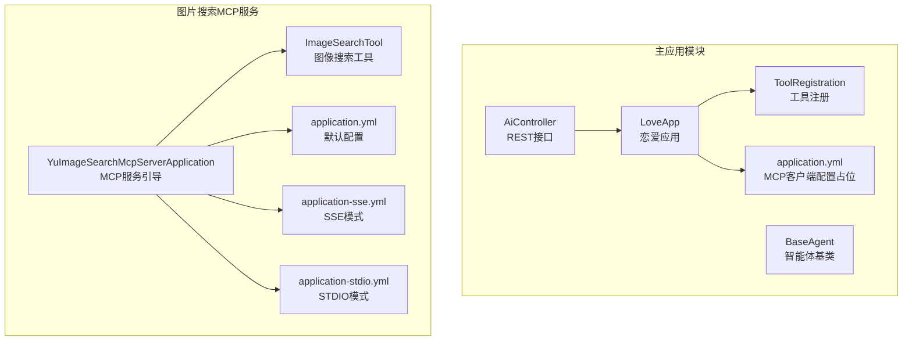
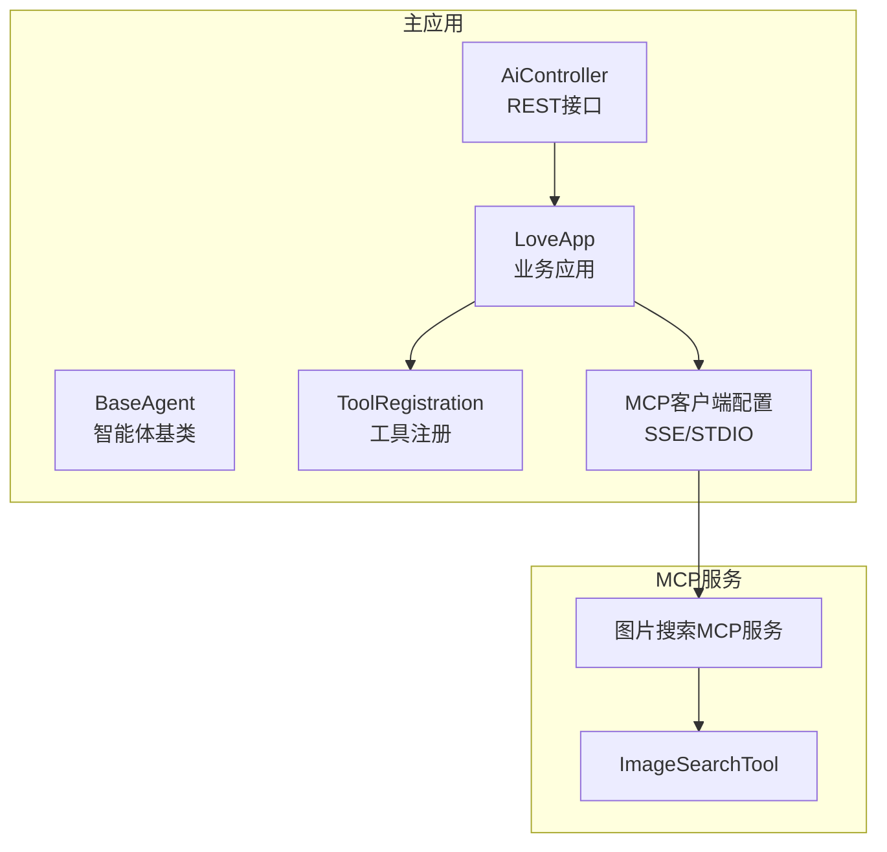
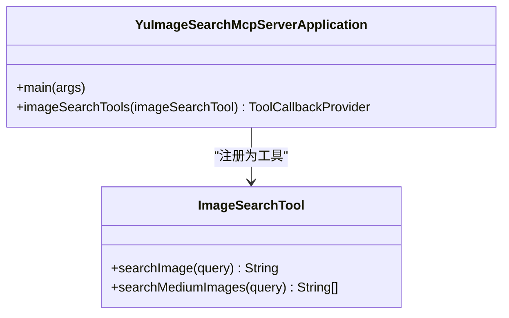
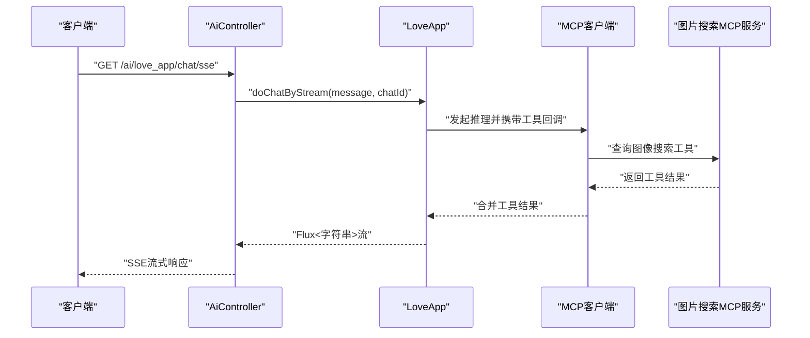
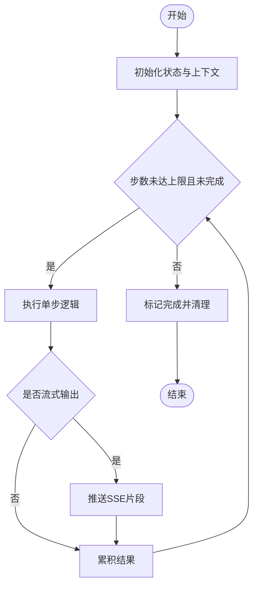
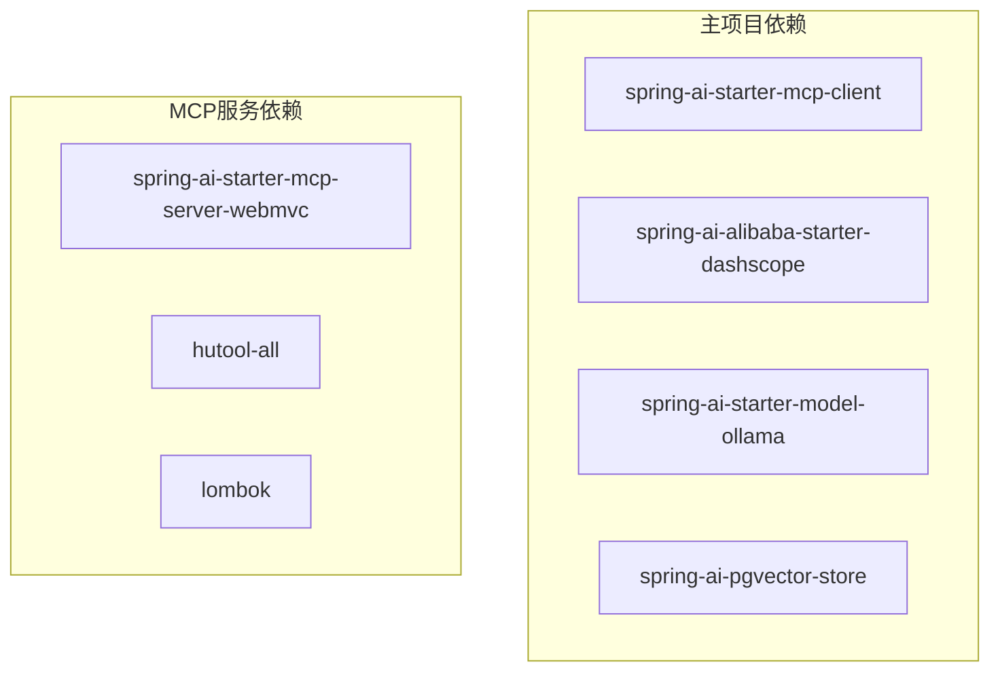

# MCP服务集成

<cite>
**本文引用的文件**
- [mcp-servers.json](file://src/main/resources/mcp-servers.json)
- [pom.xml（主项目）](file://pom.xml)
- [application.yml（主项目）](file://src/main/resources/application.yml)
- [AiController.java](file://src/main/java/com/yupi/yuaiagent/controller/AiController.java)
- [BaseAgent.java](file://src/main/java/com/yupi/yuaiagent/agent/BaseAgent.java)
- [ToolRegistration.java](file://src/main/java/com/yupi/yuaiagent/tools/ToolRegistration.java)
- [LoveApp.java](file://src/main/java/com/yupi/yuaiagent/app/LoveApp.java)
- [HttpAiInvoke.java](file://src/main/java/com/yupi/yuaiagent/demo/invoke/HttpAiInvoke.java)
- [pom.xml（图片搜索MCP服务）](file://yu-image-search-mcp-server/pom.xml)
- [application.yml（图片搜索MCP服务）](file://yu-image-search-mcp-server/src/main/resources/application.yml)
- [application-sse.yml（图片搜索MCP服务）](file://yu-image-search-mcp-server/src/main/resources/application-sse.yml)
- [application-stdio.yml（图片搜索MCP服务）](file://yu-image-search-mcp-server/src/main/resources/application-stdio.yml)
- [YuImageSearchMcpServerApplication.java](file://yu-image-search-mcp-server/src/main/java/com/yupi/yuimagesearchmcpserver/YuImageSearchMcpServerApplication.java)
- [ImageSearchTool.java](file://yu-image-search-mcp-server/src/main/java/com/yupi/yuimagesearchmcpserver/tools/ImageSearchTool.java)
- [ImageSearchToolTest.java](file://yu-image-search-mcp-server/src/test/java/com/yupi/yuimagesearchmcpserver/tools/ImageSearchToolTest.java)
</cite>

## 目录
1. [简介](#简介)
2. [项目结构](#项目结构)
3. [核心组件](#核心组件)
4. [架构总览](#架构总览)
5. [详细组件分析](#详细组件分析)
6. [依赖分析](#依赖分析)
7. [性能考虑](#性能考虑)
8. [故障排查指南](#故障排查指南)
9. [结论](#结论)
10. [附录](#附录)

## 简介
本文件面向MCP（模型上下文协议）服务集成场景，系统性阐述在该代码库中的MCP协议实现与应用。内容涵盖MCP协议基本概念、服务发现与消息传递、异步通信机制、配置与连接管理、协议适配（STDIO/SSE）、图片搜索MCP服务的开发与集成、与AI智能体的调用机制、最佳实践以及部署运维要点。读者无需深入的后端背景即可理解并按图索骥完成集成与扩展。

## 项目结构
该项目采用多模块结构：
- 主应用模块：提供AI控制器、智能体抽象、工具注册与调用入口，以及MCP客户端配置占位。
- 图片搜索MCP服务子模块：独立的MCP服务器，暴露图像搜索工具能力，支持STDIO与SSE两种协议模式。

图表来源
- [AiController.java:1-106](file://src/main/java/com/yupi/yuaiagent/controller/AiController.java#L1-L106)
- [BaseAgent.java:1-193](file://src/main/java/com/yupi/yuaiagent/agent/BaseAgent.java#L1-L193)
- [ToolRegistration.java:1-38](file://src/main/java/com/yupi/yuaiagent/tools/ToolRegistration.java#L1-L38)
- [LoveApp.java:196-226](file://src/main/java/com/yupi/yuaiagent/app/LoveApp.java#L196-L226)
- [application.yml（主项目）:23-30](file://src/main/resources/application.yml#L23-L30)
- [YuImageSearchMcpServerApplication.java:1-25](file://yu-image-search-mcp-server/src/main/java/com/yupi/yuimagesearchmcpserver/YuImageSearchMcpServerApplication.java#L1-L25)
- [ImageSearchTool.java:1-67](file://yu-image-search-mcp-server/src/main/java/com/yupi/yuimagesearchmcpserver/tools/ImageSearchTool.java#L1-L67)
- [application.yml（图片搜索MCP服务）:1-7](file://yu-image-search-mcp-server/src/main/resources/application.yml#L1-L7)
- [application-sse.yml（图片搜索MCP服务）:1-10](file://yu-image-search-mcp-server/src/main/resources/application-sse.yml#L1-L10)
- [application-stdio.yml（图片搜索MCP服务）:1-13](file://yu-image-search-mcp-server/src/main/resources/application-stdio.yml#L1-L13)

章节来源
- [AiController.java:1-106](file://src/main/java/com/yupi/yuaiagent/controller/AiController.java#L1-L106)
- [application.yml（主项目）:1-66](file://src/main/resources/application.yml#L1-L66)

## 核心组件
- MCP客户端配置（主项目）
  - 在主项目的配置文件中预留了MCP客户端的占位配置，包括SSE与STDIO两类连接方式，以及服务注册清单路径（classpath:mcp-servers.json）。
  - 当启用MCP客户端时，主应用可将外部MCP服务作为工具源，配合智能体进行推理与工具调用。
- MCP服务端（图片搜索MCP服务）
  - 通过Spring AI MCP Server Starter构建，支持STDIO与SSE两种运行模式。
  - 暴露图像搜索工具，使用注解驱动的工具回调提供器，向调用方提供统一的工具接口。
- 工具注册与调用
  - 主应用集中注册各类工具（文件操作、网页搜索、网页抓取、资源下载、终端操作、PDF生成、终止工具），并通过智能体或控制器将工具回调注入到推理链路中。
- 异步通信与流式输出
  - 主应用控制器提供多种异步输出方式（Flux、SSE流、ServerSentEvent），用于实时反馈推理过程与结果。
- 智能体与应用层
  - BaseAgent提供统一的状态机与执行循环；LoveApp封装业务场景（如恋爱报告），并在推理过程中启用工具回调与日志顾问。

章节来源
- [application.yml（主项目）:23-30](file://src/main/resources/application.yml#L23-L30)
- [YuImageSearchMcpServerApplication.java:1-25](file://yu-image-search-mcp-server/src/main/java/com/yupi/yuimagesearchmcpserver/YuImageSearchMcpServerApplication.java#L1-L25)
- [ImageSearchTool.java:1-67](file://yu-image-search-mcp-server/src/main/java/com/yupi/yuimagesearchmcpserver/tools/ImageSearchTool.java#L1-L67)
- [ToolRegistration.java:1-38](file://src/main/java/com/yupi/yuaiagent/tools/ToolRegistration.java#L1-L38)
- [AiController.java:1-106](file://src/main/java/com/yupi/yuaiagent/controller/AiController.java#L1-L106)
- [BaseAgent.java:1-193](file://src/main/java/com/yupi/yuaiagent/agent/BaseAgent.java#L1-L193)
- [LoveApp.java:196-226](file://src/main/java/com/yupi/yuaiagent/app/LoveApp.java#L196-L226)

## 架构总览
下图展示了MCP服务在整体架构中的位置与交互关系：主应用通过MCP客户端连接外部MCP服务，将服务端工具作为本地工具集的一部分参与推理；同时，主应用也提供多种异步输出通道，便于前端或上层系统消费流式结果。

图表来源
- [AiController.java:1-106](file://src/main/java/com/yupi/yuaiagent/controller/AiController.java#L1-L106)
- [BaseAgent.java:1-193](file://src/main/java/com/yupi/yuaiagent/agent/BaseAgent.java#L1-L193)
- [ToolRegistration.java:1-38](file://src/main/java/com/yupi/yuaiagent/tools/ToolRegistration.java#L1-L38)
- [LoveApp.java:196-226](file://src/main/java/com/yupi/yuaiagent/app/LoveApp.java#L196-L226)
- [application.yml（主项目）:23-30](file://src/main/resources/application.yml#L23-L30)
- [YuImageSearchMcpServerApplication.java:1-25](file://yu-image-search-mcp-server/src/main/java/com/yupi/yuimagesearchmcpserver/YuImageSearchMcpServerApplication.java#L1-L25)
- [ImageSearchTool.java:1-67](file://yu-image-search-mcp-server/src/main/java/com/yupi/yuimagesearchmcpserver/tools/ImageSearchTool.java#L1-L67)

## 详细组件分析

### 图片搜索MCP服务（MCP Server）
- 服务引导与工具提供
  - 应用入口负责启动Spring Boot应用，并通过工具回调提供器将图像搜索工具对象暴露给MCP客户端。
- 工具实现
  - 使用注解声明工具描述与参数，内部封装HTTP请求与JSON解析逻辑，返回中等尺寸图片链接列表。
- 配置与运行模式
  - 默认配置定义服务名称、版本与同步类型；SSE与STDIO分别通过不同profile启用，STDIO模式关闭Web应用类型以便标准输入输出通信。
- 测试
  - 提供单元测试验证工具返回非空，确保服务可用性。

图表来源
- [YuImageSearchMcpServerApplication.java:1-25](file://yu-image-search-mcp-server/src/main/java/com/yupi/yuimagesearchmcpserver/YuImageSearchMcpServerApplication.java#L1-L25)
- [ImageSearchTool.java:1-67](file://yu-image-search-mcp-server/src/main/java/com/yupi/yuimagesearchmcpserver/tools/ImageSearchTool.java#L1-L67)

章节来源
- [YuImageSearchMcpServerApplication.java:1-25](file://yu-image-search-mcp-server/src/main/java/com/yupi/yuimagesearchmcpserver/YuImageSearchMcpServerApplication.java#L1-L25)
- [ImageSearchTool.java:1-67](file://yu-image-search-mcp-server/src/main/java/com/yupi/yuimagesearchmcpserver/tools/ImageSearchTool.java#L1-L67)
- [application.yml（图片搜索MCP服务）:1-7](file://yu-image-search-mcp-server/src/main/resources/application.yml#L1-L7)
- [application-sse.yml（图片搜索MCP服务）:1-10](file://yu-image-search-mcp-server/src/main/resources/application-sse.yml#L1-L10)
- [application-stdio.yml（图片搜索MCP服务）:1-13](file://yu-image-search-mcp-server/src/main/resources/application-stdio.yml#L1-L13)
- [ImageSearchToolTest.java:1-20](file://yu-image-search-mcp-server/src/test/java/com/yupi/yuimagesearchmcpserver/tools/ImageSearchToolTest.java#L1-L20)

### 主应用MCP客户端集成
- 服务发现与连接
  - 通过mcp-servers.json定义外部MCP服务的命令、参数与环境变量；主应用在启动时读取该清单，建立与MCP服务的连接。
- 工具回调注入
  - 在业务应用中，通过工具回调提供器将MCP服务工具与本地工具统一注入到推理链路，实现“本地工具 + 外部MCP工具”的混合调用。
- 异步输出
  - 控制器提供SSE与Flux等多种异步输出方式，便于实时展示推理与工具调用过程。

图表来源
- [AiController.java:50-53](file://src/main/java/com/yupi/yuaiagent/controller/AiController.java#L50-L53)
- [LoveApp.java:200-225](file://src/main/java/com/yupi/yuaiagent/app/LoveApp.java#L200-L225)
- [mcp-servers.json:1-25](file://src/main/resources/mcp-servers.json#L1-L25)

章节来源
- [mcp-servers.json:1-25](file://src/main/resources/mcp-servers.json#L1-L25)
- [AiController.java:1-106](file://src/main/java/com/yupi/yuaiagent/controller/AiController.java#L1-L106)
- [LoveApp.java:196-226](file://src/main/java/com/yupi/yuaiagent/app/LoveApp.java#L196-L226)

### 智能体与异步通信
- 智能体基类
  - 提供状态机（空闲/运行/完成/错误）、最大步数限制、消息上下文管理与清理逻辑；支持同步与流式两种执行模式。
- 异步输出
  - 控制器提供SSE与Reactor Flux两种异步输出，便于前端实时渲染；智能体内部使用CompletableFuture与SseEmitter实现非阻塞执行与超时处理。

图表来源
- [BaseAgent.java:53-92](file://src/main/java/com/yupi/yuaiagent/agent/BaseAgent.java#L53-L92)
- [AiController.java:77-92](file://src/main/java/com/yupi/yuaiagent/controller/AiController.java#L77-L92)

章节来源
- [BaseAgent.java:1-193](file://src/main/java/com/yupi/yuaiagent/agent/BaseAgent.java#L1-L193)
- [AiController.java:1-106](file://src/main/java/com/yupi/yuaiagent/controller/AiController.java#L1-L106)

## 依赖分析
- 主项目依赖
  - Spring AI MCP Client：用于连接外部MCP服务。
  - Spring AI Alibaba、Ollama、PGVector等：提供模型接入与向量存储能力。
- 图片搜索MCP服务依赖
  - Spring AI MCP Server WebMVC：提供MCP服务端能力。
  - Hutool：简化HTTP请求与JSON处理。
  - Lombok：减少样板代码。

图表来源
- [pom.xml（主项目）:95-99](file://pom.xml#L95-L99)
- [pom.xml（主项目）:62-69](file://pom.xml#L62-L69)
- [pom.xml（主项目）:86-88](file://pom.xml#L86-L88)
- [pom.xml（图片搜索MCP服务）:48-51](file://yu-image-search-mcp-server/pom.xml#L48-L51)
- [pom.xml（图片搜索MCP服务）:53-56](file://yu-image-search-mcp-server/pom.xml#L53-L56)

章节来源
- [pom.xml（主项目）:1-227](file://pom.xml#L1-L227)
- [pom.xml（图片搜索MCP服务）:1-121](file://yu-image-search-mcp-server/pom.xml#L1-L121)

## 性能考虑
- 异步与流式
  - 使用SSE与Reactor Flux进行流式输出，降低前端等待时间，提升用户体验。
- 超时与资源清理
  - SSE连接设置合理超时时间，异常与完成回调确保资源及时释放。
- 工具调用
  - 将外部MCP工具与本地工具统一注入，避免重复网络请求；对第三方API调用增加缓存与降级策略（建议）。
- 并发与限流
  - 对工具调用与推理链路实施并发控制与限流，防止资源耗尽。

## 故障排查指南
- MCP服务未启动或无法连接
  - 检查mcp-servers.json中的命令、参数与环境变量是否正确；确认服务端口与协议（SSE/STDIO）配置一致。
- 工具不可用或返回空
  - 核对工具注解描述与参数；检查第三方API密钥与网络连通性；查看服务端日志定位异常。
- 异步输出中断
  - 检查SSE超时设置与前端连接状态；确认控制器与智能体的异常回调是否触发清理逻辑。
- 配置未生效
  - 确认profile激活与配置文件加载顺序；检查主项目中MCP客户端配置占位是否已启用。

章节来源
- [mcp-servers.json:1-25](file://src/main/resources/mcp-servers.json#L1-L25)
- [application.yml（主项目）:23-30](file://src/main/resources/application.yml#L23-L30)
- [AiController.java:77-92](file://src/main/java/com/yupi/yuaiagent/controller/AiController.java#L77-L92)
- [BaseAgent.java:163-176](file://src/main/java/com/yupi/yuaiagent/agent/BaseAgent.java#L163-L176)

## 结论
本项目以Spring AI MCP生态为核心，实现了主应用与外部MCP服务的松耦合集成。通过标准化的工具回调与异步输出机制，既满足了业务场景的灵活性，也为后续扩展更多MCP服务提供了清晰的范式。建议在生产环境中进一步完善监控、限流与缓存策略，并规范服务治理与版本管理。

## 附录

### MCP协议基础与工作原理（概念性说明）
- 服务发现
  - 客户端通过配置清单或动态注册发现可用的MCP服务，确定其名称、版本与通信方式（STDIO/SSE）。
- 消息传递
  - 基于MCP协议的消息格式进行请求/响应交换；工具调用由客户端发起，服务端执行并返回结果。
- 异步通信
  - SSE与Reactor Flux提供流式输出，适合长时任务与实时反馈。

### MCP服务配置与连接管理
- 服务注册
  - 在mcp-servers.json中定义外部MCP服务的启动命令、参数与环境变量。
- 连接管理
  - 根据需求选择STDIO或SSE模式；STDIO适用于本地进程通信，SSE适用于HTTP服务。
- 协议适配
  - 通过profile切换SSE/STDIO配置，确保与MCP客户端期望一致。

章节来源
- [mcp-servers.json:1-25](file://src/main/resources/mcp-servers.json#L1-L25)
- [application.yml（图片搜索MCP服务）:1-7](file://yu-image-search-mcp-server/src/main/resources/application.yml#L1-L7)
- [application-sse.yml（图片搜索MCP服务）:1-10](file://yu-image-search-mcp-server/src/main/resources/application-sse.yml#L1-L10)
- [application-stdio.yml（图片搜索MCP服务）:1-13](file://yu-image-search-mcp-server/src/main/resources/application-stdio.yml#L1-L13)

### 图片搜索MCP服务实现细节
- 工具定义
  - 使用注解声明工具描述与参数，确保客户端能够正确识别与调用。
- 第三方API集成
  - 通过HTTP请求访问第三方图像搜索接口，解析JSON并提取所需字段。
- 错误处理
  - 包裹异常并返回可读错误信息，便于客户端与日志系统定位问题。

章节来源
- [ImageSearchTool.java:25-32](file://yu-image-search-mcp-server/src/main/java/com/yupi/yuimagesearchmcpserver/tools/ImageSearchTool.java#L25-L32)
- [ImageSearchTool.java:40-65](file://yu-image-search-mcp-server/src/main/java/com/yupi/yuimagesearchmcpserver/tools/ImageSearchTool.java#L40-L65)

### 与AI智能体的集成与调用机制
- 工具回调注入
  - 在业务应用中将MCP服务工具与本地工具统一注入到推理链路，实现混合工具调用。
- 日志与可观测性
  - 通过顾问组件记录调用过程，便于调试与审计。
- 控制器与前端
  - 提供多种异步输出接口，满足前端实时渲染需求。

章节来源
- [ToolRegistration.java:18-36](file://src/main/java/com/yupi/yuaiagent/tools/ToolRegistration.java#L18-L36)
- [LoveApp.java:200-225](file://src/main/java/com/yupi/yuaiagent/app/LoveApp.java#L200-L225)
- [AiController.java:50-53](file://src/main/java/com/yupi/yuaiagent/controller/AiController.java#L50-L53)

### 最佳实践
- 服务设计
  - 工具职责单一、参数明确、返回结构化；对外暴露稳定的工具签名。
- 错误处理
  - 明确异常分类与降级策略；提供可诊断的日志与追踪信息。
- 性能优化
  - 缓存热点数据、批量处理请求、异步化I/O密集型操作。
- 安全与鉴权
  - 第三方API密钥安全存储与轮换；限制工具调用范围与频率。

### 部署与运维指南
- 本地开发
  - 启用相应profile（SSE/STDIO），确保端口与依赖服务可达。
- 生产部署
  - 使用容器镜像打包MCP服务；通过配置中心管理密钥与参数；结合负载均衡与健康检查。
- 监控与告警
  - 关注MCP服务可用性、工具调用成功率与延迟；对异常进行分级告警。