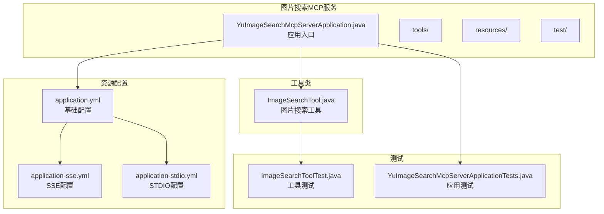
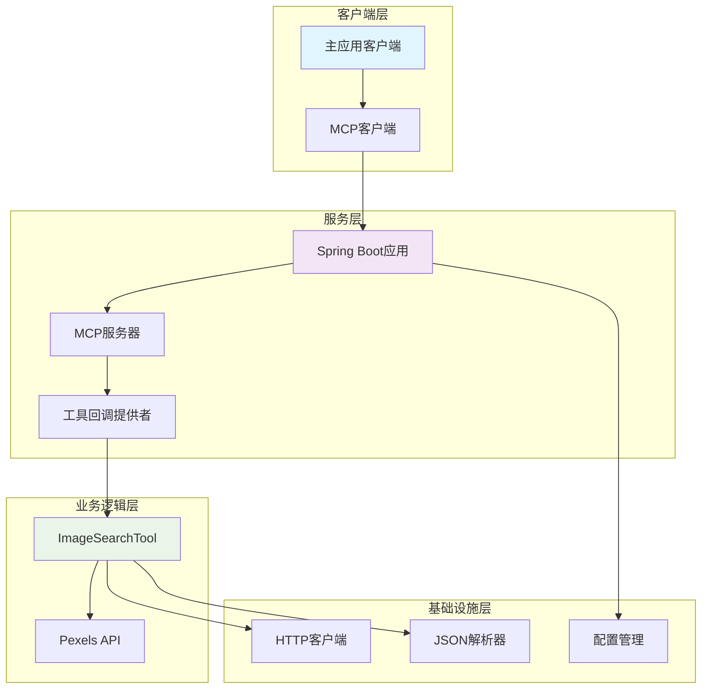
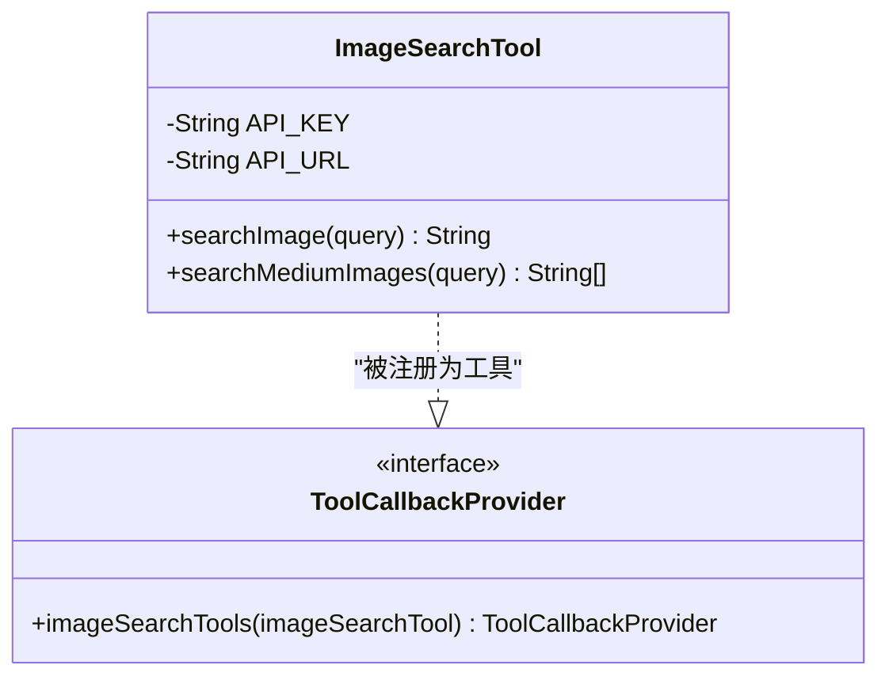
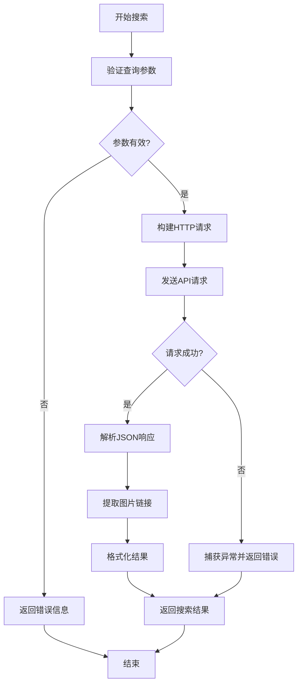
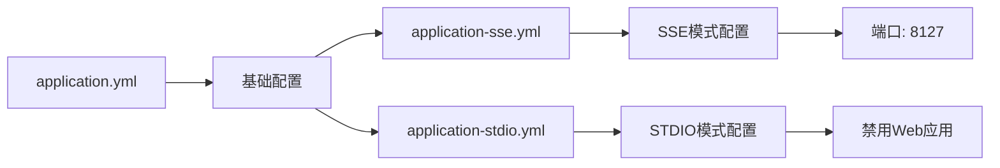
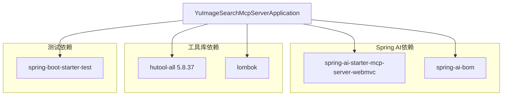
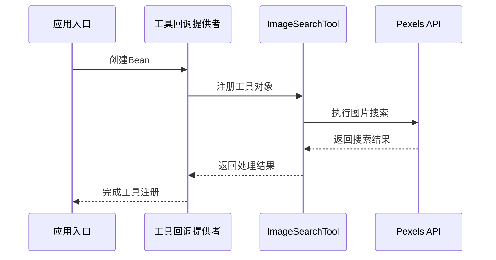

# 图片搜索MCP服务

<cite>
**本文档引用的文件**
- [YuImageSearchMcpServerApplication.java](file://yu-image-search-mcp-server/src/main/java/com/yupi/yuimagesearchmcpserver/YuImageSearchMcpServerApplication.java)
- [ImageSearchTool.java](file://yu-image-search-mcp-server/src/main/java/com/yupi/yuimagesearchmcpserver/tools/ImageSearchTool.java)
- [pom.xml](file://yu-image-search-mcp-server/pom.xml)
- [application.yml](file://yu-image-search-mcp-server/src/main/resources/application.yml)
- [application-sse.yml](file://yu-image-search-mcp-server/src/main/resources/application-sse.yml)
- [application-stdio.yml](file://yu-image-search-mcp-server/src/main/resources/application-stdio.yml)
- [ImageSearchToolTest.java](file://yu-image-search-mcp-server/src/test/java/com/yupi/yuimagesearchmcpserver/tools/ImageSearchToolTest.java)
- [YuImageSearchMcpServerApplicationTests.java](file://yu-image-search-mcp-server/src/test/java/com/yupi/yuimagesearchmcpserver/YuImageSearchMcpServerApplicationTests.java)
- [mcp-servers.json](file://src/main/resources/mcp-servers.json)
- [pom.xml](file://pom.xml)
- [YuAiAgentApplication.java](file://src/main/java/com/yupi/yuaiagent/YuAiAgentApplication.java)
- [application.yml](file://src/main/resources/application.yml)
- [ToolRegistration.java](file://src/main/java/com/yupi/yuaiagent/tools/ToolRegistration.java)
- [WebSearchTool.java](file://src/main/java/com/yupi/yuaiagent/tools/WebSearchTool.java)
</cite>

## 目录
1. [简介](#简介)
2. [项目结构](#项目结构)
3. [核心组件](#核心组件)
4. [架构概览](#架构概览)
5. [详细组件分析](#详细组件分析)
6. [依赖分析](#依赖分析)
7. [性能考虑](#性能考虑)
8. [故障排除指南](#故障排除指南)
9. [结论](#结论)
10. [附录](#附录)

## 简介

图片搜索MCP服务是一个基于Spring AI MCP框架构建的独立微服务，专门用于提供图片搜索功能。该服务通过封装Pexels图片搜索API，为上层应用提供统一的图片检索能力。服务采用MCP（Model Context Protocol）标准协议，支持同步和异步两种通信模式，既可以通过HTTP SSE方式运行，也可以通过STDIO管道进行进程间通信。

本服务的核心设计理念是模块化和可扩展性，通过工具类的形式将具体的搜索逻辑封装起来，便于维护和测试。同时，服务遵循Spring Boot的标准配置约定，支持多环境配置切换，便于在不同环境中部署和运行。

## 项目结构

图片搜索MCP服务采用标准的Spring Boot项目结构，主要包含以下目录：

**图表来源**
- [YuImageSearchMcpServerApplication.java:1-25](file://yu-image-search-mcp-server/src/main/java/com/yupi/yuimagesearchmcpserver/YuImageSearchMcpServerApplication.java#L1-L25)
- [ImageSearchTool.java:1-67](file://yu-image-search-mcp-server/src/main/java/com/yupi/yuimagesearchmcpserver/tools/ImageSearchTool.java#L1-L67)

**章节来源**
- [pom.xml:1-121](file://yu-image-search-mcp-server/pom.xml#L1-L121)
- [application.yml:1-7](file://yu-image-search-mcp-server/src/main/resources/application.yml#L1-L7)

## 核心组件

### 应用入口组件

应用入口组件负责服务的启动和初始化，采用Spring Boot的标准注解配置。该组件通过`@SpringBootApplication`注解启用自动配置，并定义了工具回调提供者的Bean。

### 工具组件

工具组件是服务的核心功能模块，实现了具体的图片搜索逻辑。该组件封装了对Pexels API的调用，提供了统一的搜索接口。

### 配置组件

配置组件负责管理服务的各种配置选项，包括端口设置、MCP服务器配置、通信模式选择等。服务支持两种运行模式：SSE（Server-Sent Events）和STDIO（Standard Input/Output）。

**章节来源**
- [YuImageSearchMcpServerApplication.java:10-25](file://yu-image-search-mcp-server/src/main/java/com/yupi/yuimagesearchmcpserver/YuImageSearchMcpServerApplication.java#L10-L25)
- [ImageSearchTool.java:16-32](file://yu-image-search-mcp-server/src/main/java/com/yupi/yuimagesearchmcpserver/tools/ImageSearchTool.java#L16-L32)

## 架构概览

图片搜索MCP服务采用分层架构设计，整体架构如下：

**图表来源**
- [YuImageSearchMcpServerApplication.java:17-22](file://yu-image-search-mcp-server/src/main/java/com/yupi/yuimagesearchmcpserver/YuImageSearchMcpServerApplication.java#L17-L22)
- [ImageSearchTool.java:25-32](file://yu-image-search-mcp-server/src/main/java/com/yupi/yuimagesearchmcpserver/tools/ImageSearchTool.java#L25-L32)

### 通信架构

服务支持两种主要的通信模式：

1. **SSE模式**：通过HTTP服务器接收客户端连接，适用于Web浏览器或HTTP客户端
2. **STDIO模式**：通过标准输入输出管道与客户端通信，适用于进程间通信场景

**章节来源**
- [application-sse.yml:1-10](file://yu-image-search-mcp-server/src/main/resources/application-sse.yml#L1-L10)
- [application-stdio.yml:1-13](file://yu-image-search-mcp-server/src/main/resources/application-stdio.yml#L1-L13)

## 详细组件分析

### ImageSearchTool工具类分析

ImageSearchTool是服务的核心业务组件，实现了完整的图片搜索功能。该组件具有以下特点：

#### 类结构设计

**图表来源**
- [ImageSearchTool.java:16-67](file://yu-image-search-mcp-server/src/main/java/com/yupi/yuimagesearchmcpserver/tools/ImageSearchTool.java#L16-L67)
- [YuImageSearchMcpServerApplication.java:17-22](file://yu-image-search-mcp-server/src/main/java/com/yupi/yuimagesearchmcpserver/YuImageSearchMcpServerApplication.java#L17-L22)

#### 搜索算法实现

搜索算法采用分步骤的处理流程：

1. **请求参数验证**：检查查询关键字的有效性
2. **HTTP请求构建**：设置认证头部和查询参数
3. **API调用执行**：发送GET请求到Pexels服务
4. **响应数据解析**：提取JSON响应中的图片链接
5. **结果格式化**：将图片链接转换为逗号分隔的字符串

#### 错误处理机制

服务实现了完善的错误处理策略：

**图表来源**
- [ImageSearchTool.java:26-32](file://yu-image-search-mcp-server/src/main/java/com/yupi/yuimagesearchmcpserver/tools/ImageSearchTool.java#L26-L32)
- [ImageSearchTool.java:40-65](file://yu-image-search-mcp-server/src/main/java/com/yupi/yuimagesearchmcpserver/tools/ImageSearchTool.java#L40-L65)

**章节来源**
- [ImageSearchTool.java:19-32](file://yu-image-search-mcp-server/src/main/java/com/yupi/yuimagesearchmcpserver/tools/ImageSearchTool.java#L19-L32)
- [ImageSearchTool.java:40-65](file://yu-image-search-mcp-server/src/main/java/com/yupi/yuimagesearchmcpserver/tools/ImageSearchTool.java#L40-L65)

### YuImageSearchMcpServerApplication应用分析

应用入口类负责服务的整体配置和初始化：

#### Bean配置策略

应用通过`@Bean`注解定义了工具回调提供者的Bean，确保ImageSearchTool能够被MCP框架正确识别和调用。

#### 生命周期管理

应用采用Spring Boot的标准生命周期管理，包括：
- 应用启动监听
- 资源清理
- 异常处理

**章节来源**
- [YuImageSearchMcpServerApplication.java:17-22](file://yu-image-search-mcp-server/src/main/java/com/yupi/yuimagesearchmcpserver/YuImageSearchMcpServerApplication.java#L17-L22)

### 配置管理分析

服务提供了灵活的配置管理机制：

#### 多环境配置

**图表来源**
- [application.yml:1-7](file://yu-image-search-mcp-server/src/main/resources/application.yml#L1-L7)
- [application-sse.yml:1-10](file://yu-image-search-mcp-server/src/main/resources/application-sse.yml#L1-L10)
- [application-stdio.yml:1-13](file://yu-image-search-mcp-server/src/main/resources/application-stdio.yml#L1-L13)

**章节来源**
- [application.yml:4-6](file://yu-image-search-mcp-server/src/main/resources/application.yml#L4-L6)
- [application-sse.yml:5-9](file://yu-image-search-mcp-server/src/main/resources/application-sse.yml#L5-L9)

## 依赖分析

### 外部依赖关系

服务的外部依赖主要集中在Spring AI生态系统和工具库：

**图表来源**
- [pom.xml:43-67](file://yu-image-search-mcp-server/pom.xml#L43-L67)

### 内部依赖关系

服务内部各组件之间的依赖关系清晰明确：

**图表来源**
- [YuImageSearchMcpServerApplication.java:17-22](file://yu-image-search-mcp-server/src/main/java/com/yupi/yuimagesearchmcpserver/YuImageSearchMcpServerApplication.java#L17-L22)
- [ImageSearchTool.java:25-32](file://yu-image-search-mcp-server/src/main/java/com/yupi/yuimagesearchmcpserver/tools/ImageSearchTool.java#L25-L32)

**章节来源**
- [pom.xml:32-41](file://yu-image-search-mcp-server/pom.xml#L32-L41)
- [pom.xml:48-51](file://yu-image-search-mcp-server/pom.xml#L48-L51)

## 性能考虑

### 并发处理

服务采用异步非阻塞的网络I/O模型，能够有效处理多个并发请求。HTTP客户端使用连接池管理，减少连接建立的开销。

### 缓存策略

当前实现未包含缓存机制。建议在生产环境中考虑：
- 添加本地缓存层
- 实现结果去重机制
- 优化API调用频率控制

### 资源管理

服务合理管理内存和CPU资源：
- 使用流式处理避免大对象内存占用
- 及时释放HTTP连接资源
- 控制JSON解析的内存使用

## 故障排除指南

### 常见问题诊断

#### API密钥配置问题

**症状**：搜索请求返回认证失败
**解决方案**：
1. 检查API密钥是否正确配置
2. 验证Pexels账户状态
3. 确认API配额限制

#### 网络连接问题

**症状**：请求超时或连接失败
**解决方案**：
1. 检查网络连通性
2. 验证Pexels API服务状态
3. 检查防火墙设置

#### JSON解析错误

**症状**：响应数据格式异常
**解决方案**：
1. 检查API响应格式变化
2. 更新JSON解析逻辑
3. 添加版本兼容性处理

**章节来源**
- [ImageSearchTool.java:29-31](file://yu-image-search-mcp-server/src/main/java/com/yupi/yuimagesearchmcpserver/tools/ImageSearchTool.java#L29-L31)

### 日志监控

服务支持详细的日志记录，便于问题诊断：
- 启用DEBUG级别日志查看详细调用过程
- 监控API调用成功率
- 记录异常堆栈信息

## 结论

图片搜索MCP服务是一个设计良好、实现简洁的微服务应用。通过采用Spring AI MCP框架，服务实现了标准化的工具接口，便于与其他AI应用集成。工具类的设计体现了单一职责原则，易于维护和扩展。

服务的主要优势包括：
- 标准化的MCP协议支持
- 灵活的配置管理
- 完善的错误处理机制
- 清晰的代码结构

未来可以考虑的功能增强：
- 添加图片质量过滤机制
- 实现智能搜索建议
- 集成更多图片源
- 添加缓存和CDN支持

## 附录

### 集成指南

#### 主应用集成

服务通过MCP协议与主应用集成，主要配置包括：

1. **MCP服务器配置**：在主应用的配置文件中添加MCP服务器定义
2. **依赖声明**：在主应用的pom.xml中添加MCP客户端依赖
3. **工具注册**：在主应用中注册图片搜索工具

#### 部署配置

服务支持多种部署方式：
- **容器化部署**：使用Docker镜像部署
- **传统部署**：直接运行JAR包
- **云平台部署**：支持主流云平台部署

**章节来源**
- [mcp-servers.json:13-23](file://src/main/resources/mcp-servers.json#L13-L23)
- [pom.xml:96-99](file://pom.xml#L96-L99)

### 开发最佳实践

#### 代码规范

- 遵循Spring Boot编码规范
- 使用有意义的变量命名
- 添加必要的注释和文档
- 实现完整的单元测试

#### 测试策略

- 单元测试覆盖核心业务逻辑
- 集成测试验证API调用
- 性能测试评估响应时间
- 安全测试检查输入验证