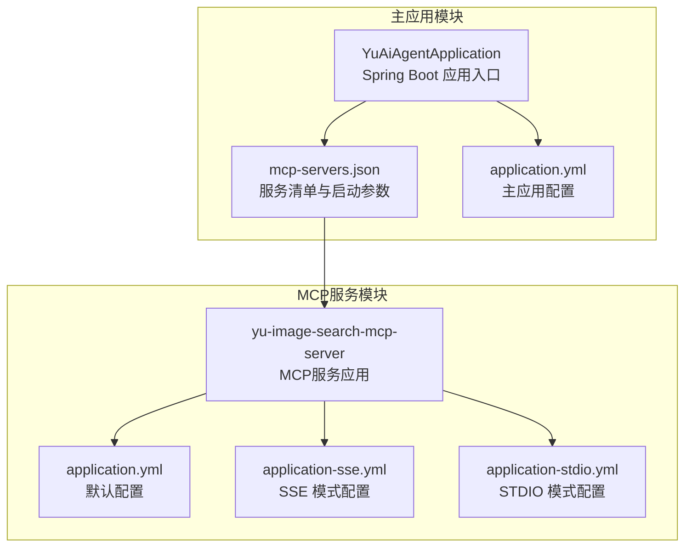
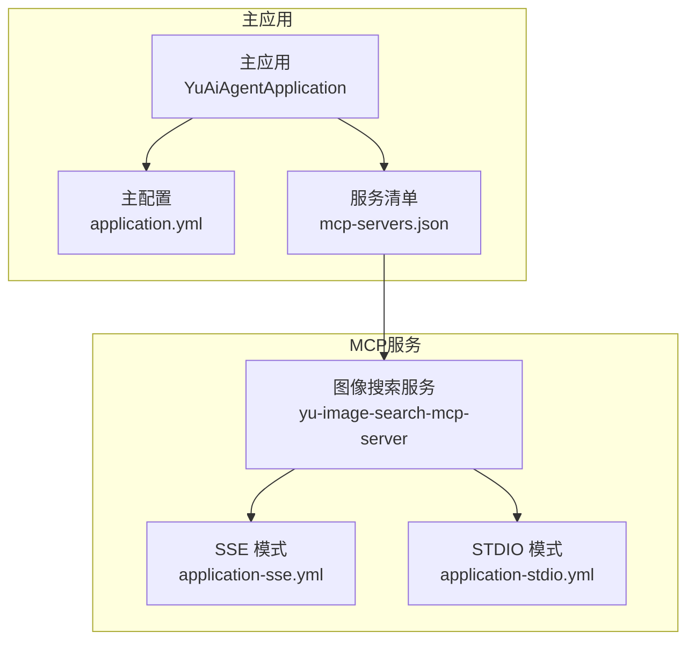
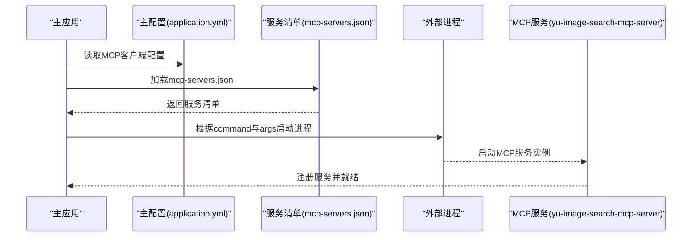
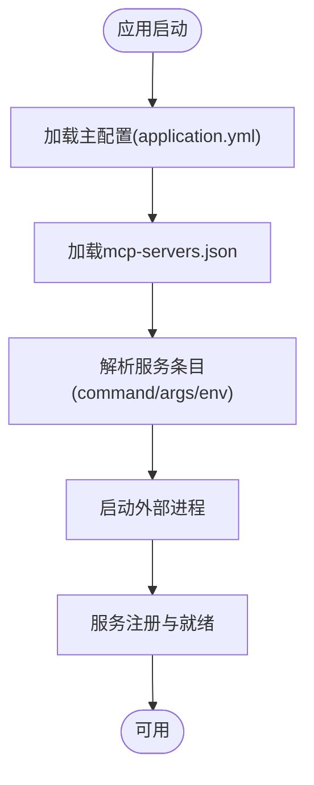
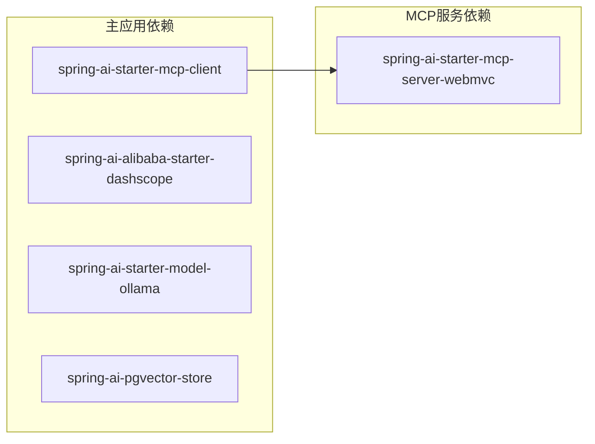

# 服务发现与配置

<cite>
**本文引用的文件**
- [mcp-servers.json](file://src/main/resources/mcp-servers.json)
- [application.yml](file://src/main/resources/application.yml)
- [YuAiAgentApplication.java](file://src/main/java/com/yupi/yuaiagent/YuAiAgentApplication.java)
- [application.yml](file://yu-image-search-mcp-server/src/main/resources/application.yml)
- [application-sse.yml](file://yu-image-search-mcp-server/src/main/resources/application-sse.yml)
- [application-stdio.yml](file://yu-image-search-mcp-server/src/main/resources/application-stdio.yml)
- [pom.xml](file://pom.xml)
- [pom.xml](file://yu-image-search-mcp-server/pom.xml)
- [WebSearchTool.java](file://src/main/java/com/yupi/yuaiagent/tools/WebSearchTool.java)
- [WebScrapingTool.java](file://src/main/java/com/yupi/yuaiagent/tools/WebScrapingTool.java)
- [CorsConfig.java](file://src/main/java/com/yupi/yuaiagent/config/CorsConfig.java)
</cite>

## 目录
1. [简介](#简介)
2. [项目结构](#项目结构)
3. [核心组件](#核心组件)
4. [架构总览](#架构总览)
5. [详细组件分析](#详细组件分析)
6. [依赖分析](#依赖分析)
7. [性能考虑](#性能考虑)
8. [故障排查指南](#故障排查指南)
9. [结论](#结论)
10. [附录](#附录)

## 简介
本文件面向MCP（Model Context Protocol）服务发现与配置管理，围绕以下目标展开：
- 解释mcp-servers.json配置文件的结构与参数含义，涵盖服务注册、命令行参数、环境变量设置等。
- 阐述服务发现机制的工作流程，展示如何动态发现和管理MCP服务实例。
- 说明不同服务类型的配置方式，如本地JAR包服务、npm包服务等。
- 提供服务配置的最佳实践，包括安全配置、性能优化、故障处理等。
- 包含配置验证与调试技巧，帮助开发者快速排查配置问题。

## 项目结构
该项目采用多模块结构，包含一个主应用与一个MCP服务子模块：
- 主应用模块：负责业务逻辑、工具集成、MCP客户端配置与运行。
- MCP服务模块：提供图像搜索能力，支持通过STDIO或SSE两种模式对外提供服务。

图表来源
- [YuAiAgentApplication.java:1-18](file://src/main/java/com/yupi/yuaiagent/YuAiAgentApplication.java#L1-L18)
- [mcp-servers.json:1-25](file://src/main/resources/mcp-servers.json#L1-L25)
- [application.yml:1-66](file://src/main/resources/application.yml#L1-L66)
- [application.yml:1-7](file://yu-image-search-mcp-server/src/main/resources/application.yml#L1-L7)
- [application-sse.yml:1-10](file://yu-image-search-mcp-server/src/main/resources/application-sse.yml#L1-L10)
- [application-stdio.yml:1-13](file://yu-image-search-mcp-server/src/main/resources/application-stdio.yml#L1-L13)

章节来源
- [YuAiAgentApplication.java:1-18](file://src/main/java/com/yupi/yuaiagent/YuAiAgentApplication.java#L1-L18)
- [application.yml:1-66](file://src/main/resources/application.yml#L1-L66)

## 核心组件
- mcp-servers.json：定义MCP服务清单，包含服务名称、启动命令、参数列表与环境变量。
- 主应用配置：启用MCP客户端、指定STDIO服务器配置来源（classpath路径）。
- MCP服务应用：提供图像搜索能力，支持STDIO/SSE两种模式，通过profile切换。
- 工具类：示例工具用于演示外部服务集成，便于理解MCP生态下的工具协作。

章节来源
- [mcp-servers.json:1-25](file://src/main/resources/mcp-servers.json#L1-L25)
- [application.yml:22-30](file://src/main/resources/application.yml#L22-L30)
- [application.yml:1-7](file://yu-image-search-mcp-server/src/main/resources/application.yml#L1-L7)
- [application-sse.yml:1-10](file://yu-image-search-mcp-server/src/main/resources/application-sse.yml#L1-L10)
- [application-stdio.yml:1-13](file://yu-image-search-mcp-server/src/main/resources/application-stdio.yml#L1-L13)
- [WebSearchTool.java:1-54](file://src/main/java/com/yupi/yuaiagent/tools/WebSearchTool.java#L1-L54)
- [WebScrapingTool.java:1-23](file://src/main/java/com/yupi/yuaiagent/tools/WebScrapingTool.java#L1-L23)

## 架构总览
下图展示了主应用如何通过mcp-servers.json动态发现并管理MCP服务实例，以及MCP服务模块的两种运行模式。

图表来源
- [YuAiAgentApplication.java:1-18](file://src/main/java/com/yupi/yuaiagent/YuAiAgentApplication.java#L1-L18)
- [application.yml:22-30](file://src/main/resources/application.yml#L22-L30)
- [mcp-servers.json:1-25](file://src/main/resources/mcp-servers.json#L1-L25)
- [application.yml:1-7](file://yu-image-search-mcp-server/src/main/resources/application.yml#L1-L7)
- [application-sse.yml:1-10](file://yu-image-search-mcp-server/src/main/resources/application-sse.yml#L1-L10)
- [application-stdio.yml:1-13](file://yu-image-search-mcp-server/src/main/resources/application-stdio.yml#L1-L13)

## 详细组件分析

### mcp-servers.json 结构与参数详解
- 顶层键“mcpServers”：包含多个服务条目，每个条目以服务名作为键。
- 服务条目字段：
  - command：启动该服务的可执行命令（例如系统命令或npm包命令）。
  - args：传递给command的参数数组，支持JVM参数、JAR路径等。
  - env：环境变量映射，用于注入API密钥等敏感配置。
- 示例服务：
  - amap-maps：通过npm包启动地图服务，需设置AMAP_MAPS_API_KEY。
  - yu-image-search-mcp-server：通过Java进程启动本地JAR包，启用STDIO模式并禁用Web应用类型。

章节来源
- [mcp-servers.json:1-25](file://src/main/resources/mcp-servers.json#L1-L25)

### 主应用配置与MCP客户端启用
- 主应用通过application.yml启用MCP客户端功能，并指定STDIO服务器配置来源为classpath中的mcp-servers.json。
- 日志级别调整为DEBUG，便于观察Spring AI与MCP交互细节。
- 临时注释掉向量存储与数据库配置，便于开发调试。

章节来源
- [application.yml:22-30](file://src/main/resources/application.yml#L22-L30)
- [application.yml:64-66](file://src/main/resources/application.yml#L64-L66)

### MCP服务模块配置与模式切换
- 默认配置：设置应用名、激活profile为sse，监听端口8127。
- SSE模式配置：声明MCP服务名称、版本、类型为SYNC，关闭stdio。
- STDIO模式配置：声明MCP服务名称、版本、类型为SYNC，开启stdio；同时禁用Web应用类型与Banner输出。

章节来源
- [application.yml:1-7](file://yu-image-search-mcp-server/src/main/resources/application.yml#L1-L7)
- [application-sse.yml:1-10](file://yu-image-search-mcp-server/src/main/resources/application-sse.yml#L1-L10)
- [application-stdio.yml:1-13](file://yu-image-search-mcp-server/src/main/resources/application-stdio.yml#L1-L13)

### 依赖与启动流程（序列图）
下图描述了主应用如何加载mcp-servers.json并启动MCP服务实例的典型流程。

图表来源
- [application.yml:22-30](file://src/main/resources/application.yml#L22-L30)
- [mcp-servers.json:1-25](file://src/main/resources/mcp-servers.json#L1-L25)
- [application.yml:1-7](file://yu-image-search-mcp-server/src/main/resources/application.yml#L1-L7)

### 不同服务类型的配置方式
- npm包服务（amap-maps）：
  - 使用npx.cmd作为command，args中包含npm包名称。
  - 通过env注入AMAP_MAPS_API_KEY。
- 本地JAR包服务（yu-image-search-mcp-server）：
  - 使用java作为command，args中包含JVM参数、JAR路径与启动参数。
  - 通过env为空或在JVM参数中设置系统属性控制STDIO模式。

章节来源
- [mcp-servers.json:3-12](file://src/main/resources/mcp-servers.json#L3-L12)
- [mcp-servers.json:13-24](file://src/main/resources/mcp-servers.json#L13-L24)

### 服务发现机制工作流程
- 主应用启动时，根据application.yml中的MCP客户端配置，从classpath加载mcp-servers.json。
- 对于每个服务条目，主应用解析command、args与env，构造进程启动参数。
- 启动后，MCP服务完成初始化并注册到主应用的服务发现体系中，等待调用。

图表来源
- [application.yml:22-30](file://src/main/resources/application.yml#L22-L30)
- [mcp-servers.json:1-25](file://src/main/resources/mcp-servers.json#L1-L25)

## 依赖分析
- 主应用依赖：
  - Spring AI MCP客户端：用于连接与管理MCP服务。
  - 其他AI与工具依赖：DashScope、Ollama、向量存储等。
- MCP服务模块依赖：
  - Spring AI MCP服务启动器：提供MCP服务端能力。
  - 基础Starter与测试依赖。

图表来源
- [pom.xml:95-99](file://pom.xml#L95-L99)
- [pom.xml:48-51](file://yu-image-search-mcp-server/pom.xml#L48-L51)

章节来源
- [pom.xml:95-99](file://pom.xml#L95-L99)
- [pom.xml:48-51](file://yu-image-search-mcp-server/pom.xml#L48-L51)

## 性能考虑
- 进程启动开销：通过args传入JVM参数可优化内存与日志输出，减少不必要的控制台输出有助于降低开销。
- 服务并发：合理规划服务数量与资源分配，避免在同一主机上过度并发启动多个MCP服务。
- 网络与I/O：对于SSE模式，注意网络延迟与带宽；STDIO模式适合本地高吞吐场景。
- 日志级别：在生产环境中建议调整日志级别，避免过多DEBUG日志影响性能。

## 故障排查指南
- 配置路径与权限：
  - 确认mcp-servers.json位于classpath中且可读。
  - 确认JAR包路径正确，具备执行权限。
- 环境变量缺失：
  - 检查env中是否正确设置了API密钥等必要变量。
- 进程启动失败：
  - 查看命令与参数拼接是否正确，尤其是JVM参数与JAR路径。
- 模式不匹配：
  - 确认主应用与MCP服务的模式一致（STDIO/SSE），避免协议不兼容。
- 日志定位：
  - 将日志级别调整为DEBUG，观察Spring AI与MCP交互过程。
- CORS与网络：
  - 若前端访问受限，检查CORS配置与网络连通性。

章节来源
- [application.yml:64-66](file://src/main/resources/application.yml#L64-L66)
- [CorsConfig.java:1-25](file://src/main/java/com/yupi/yuaiagent/config/CorsConfig.java#L1-L25)

## 结论
本项目通过mcp-servers.json实现了MCP服务的集中式配置与动态发现，结合主应用的MCP客户端与MCP服务模块的STDIO/SSE模式，构建了灵活的服务编排与运行机制。遵循本文提供的最佳实践与故障排查方法，可有效提升配置可靠性与运维效率。

## 附录
- 工具类参考：WebSearchTool与WebScrapingTool展示了如何在主应用中集成外部服务，便于理解MCP生态下的工具协作模式。

章节来源
- [WebSearchTool.java:1-54](file://src/main/java/com/yupi/yuaiagent/tools/WebSearchTool.java#L1-L54)
- [WebScrapingTool.java:1-23](file://src/main/java/com/yupi/yuaiagent/tools/WebScrapingTool.java#L1-L23)