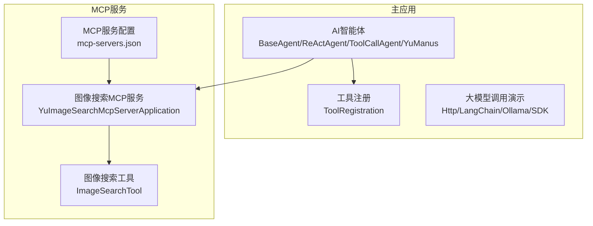
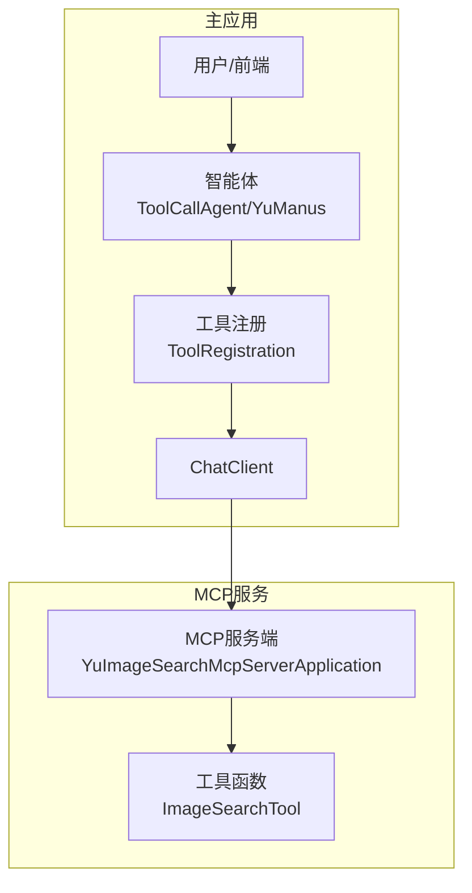
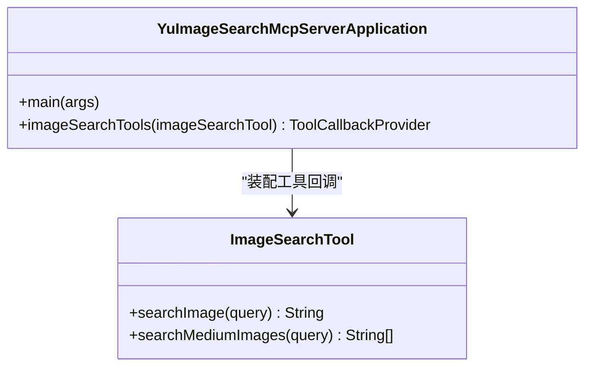
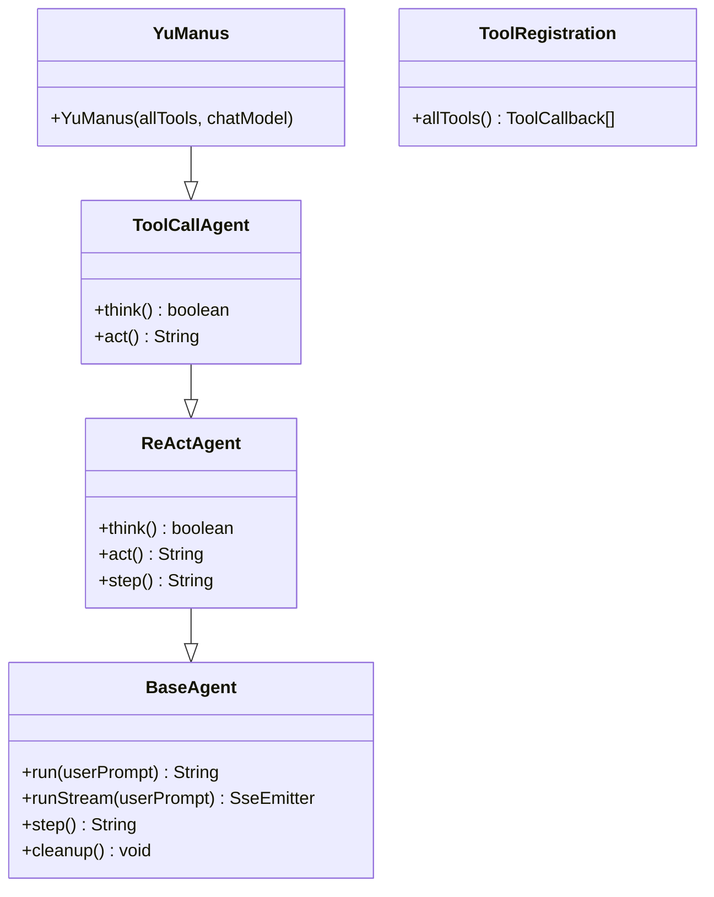
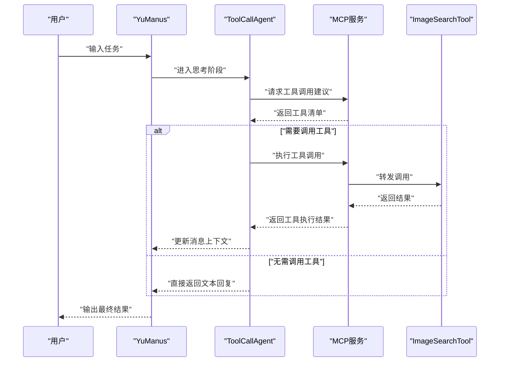
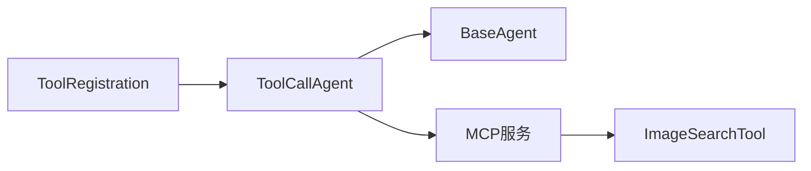

# 集成模式与最佳实践

<cite>
**本文引用的文件**
- [mcp-servers.json](file://src/main/resources/mcp-servers.json)
- [application.yml](file://yu-image-search-mcp-server/src/main/resources/application.yml)
- [application-sse.yml](file://yu-image-search-mcp-server/src/main/resources/application-sse.yml)
- [application-stdio.yml](file://yu-image-search-mcp-server/src/main/resources/application-stdio.yml)
- [ImageSearchTool.java](file://yu-image-search-mcp-server/src/main/java/com/yupi/yuimagesearchmcpserver/tools/ImageSearchTool.java)
- [YuImageSearchMcpServerApplication.java](file://yu-image-search-mcp-server/src/main/java/com/yupi/yuimagesearchmcpserver/YuImageSearchMcpServerApplication.java)
- [HttpAiInvoke.java](file://src/main/java/com/yupi/yuaiagent/demo/invoke/HttpAiInvoke.java)
- [LangChainAiInvoke.java](file://src/main/java/com/yupi/yuaiagent/demo/invoke/LangChainAiInvoke.java)
- [OllamaAiInvoke.java](file://src/main/java/com/yupi/yuaiagent/demo/invoke/OllamaAiInvoke.java)
- [SdkAiInvoke.java](file://src/main/java/com/yupi/yuaiagent/demo/invoke/SdkAiInvoke.java)
- [BaseAgent.java](file://src/main/java/com/yupi/yuaiagent/agent/BaseAgent.java)
- [ReActAgent.java](file://src/main/java/com/yupi/yuaiagent/agent/ReActAgent.java)
- [ToolCallAgent.java](file://src/main/java/com/yupi/yuaiagent/agent/ToolCallAgent.java)
- [YuManus.java](file://src/main/java/com/yupi/yuaiagent/agent/YuManus.java)
- [ToolRegistration.java](file://src/main/java/com/yupi/yuaiagent/tools/ToolRegistration.java)
</cite>

## 目录
1. [引言](#引言)
2. [项目结构](#项目结构)
3. [核心组件](#核心组件)
4. [架构总览](#架构总览)
5. [详细组件分析](#详细组件分析)
6. [依赖分析](#依赖分析)
7. [性能考量](#性能考量)
8. [故障排查指南](#故障排查指南)
9. [结论](#结论)
10. [附录](#附录)

## 引言
本指南围绕MCP（Model Context Protocol）服务在AI智能体中的集成模式与最佳实践展开，结合仓库中现有MCP服务与AI智能体的实现，系统阐述以下主题：
- MCP服务与AI智能体的集成架构与调用模式（同步调用、异步处理、错误重试）
- 不同类型MCP服务的集成策略（本地服务、远程服务、第三方服务）
- MCP服务开发的最佳实践（服务设计原则、性能优化、安全性、监控告警）
- MCP服务生命周期管理与资源控制（动态加载与卸载思路）
- 常见集成问题的解决方案与调试技巧

## 项目结构
该项目采用多模块结构，包含主应用与独立的MCP服务模块：
- 主应用模块：提供AI智能体、工具注册、多种大模型调用方式演示
- MCP服务模块：提供图像搜索MCP服务，支持STDIO与SSE两种运行模式

图表来源
- [mcp-servers.json:1-25](file://src/main/resources/mcp-servers.json#L1-L25)
- [YuImageSearchMcpServerApplication.java:1-25](file://yu-image-search-mcp-server/src/main/java/com/yupi/yuimagesearchmcpserver/YuImageSearchMcpServerApplication.java#L1-L25)
- [ImageSearchTool.java:1-67](file://yu-image-search-mcp-server/src/main/java/com/yupi/yuimagesearchmcpserver/tools/ImageSearchTool.java#L1-L67)
- [ToolRegistration.java:1-38](file://src/main/java/com/yupi/yuaiagent/tools/ToolRegistration.java#L1-L38)
- [BaseAgent.java:1-193](file://src/main/java/com/yupi/yuaiagent/agent/BaseAgent.java#L1-L193)
- [ReActAgent.java:1-53](file://src/main/java/com/yupi/yuaiagent/agent/ReActAgent.java#L1-L53)
- [ToolCallAgent.java:1-136](file://src/main/java/com/yupi/yuaiagent/agent/ToolCallAgent.java#L1-L136)
- [YuManus.java:1-38](file://src/main/java/com/yupi/yuaiagent/agent/YuManus.java#L1-L38)

章节来源
- [mcp-servers.json:1-25](file://src/main/resources/mcp-servers.json#L1-L25)
- [application.yml:1-7](file://yu-image-search-mcp-server/src/main/resources/application.yml#L1-L7)
- [application-sse.yml:1-10](file://yu-image-search-mcp-server/src/main/resources/application-sse.yml#L1-L10)
- [application-stdio.yml:1-13](file://yu-image-search-mcp-server/src/main/resources/application-stdio.yml#L1-L13)

## 核心组件
- AI智能体基类与扩展
  - BaseAgent：统一的状态机、执行循环、SSE流式输出、资源清理
  - ReActAgent：思考-行动循环抽象
  - ToolCallAgent：基于工具回调的工具选择与执行，禁用内置工具调用机制，自管消息上下文
  - YuManus：面向业务的智能体实例，配置系统提示词与最大步数，注入ChatClient与Advisor
- 工具注册中心：集中装配各类工具回调，便于在智能体中统一使用
- MCP服务端：基于Spring AI MCP Server，暴露工具函数，支持STDIO与SSE两种接入方式
- 大模型调用演示：HTTP直连、LangChain封装、Ollama本地推理、SDK封装

章节来源
- [BaseAgent.java:1-193](file://src/main/java/com/yupi/yuaiagent/agent/BaseAgent.java#L1-L193)
- [ReActAgent.java:1-53](file://src/main/java/com/yupi/yuaiagent/agent/ReActAgent.java#L1-L53)
- [ToolCallAgent.java:1-136](file://src/main/java/com/yupi/yuaiagent/agent/ToolCallAgent.java#L1-L136)
- [YuManus.java:1-38](file://src/main/java/com/yupi/yuaiagent/agent/YuManus.java#L1-L38)
- [ToolRegistration.java:1-38](file://src/main/java/com/yupi/yuaiagent/tools/ToolRegistration.java#L1-L38)
- [YuImageSearchMcpServerApplication.java:1-25](file://yu-image-search-mcp-server/src/main/java/com/yupi/yuimagesearchmcpserver/YuImageSearchMcpServerApplication.java#L1-L25)
- [ImageSearchTool.java:1-67](file://yu-image-search-mcp-server/src/main/java/com/yupi/yuimagesearchmcpserver/tools/ImageSearchTool.java#L1-L67)

## 架构总览
下图展示了MCP服务与AI智能体的集成架构：主应用通过工具回调与MCP服务交互；MCP服务以STDIO或SSE方式对外提供工具函数。

图表来源
- [ToolCallAgent.java:1-136](file://src/main/java/com/yupi/yuaiagent/agent/ToolCallAgent.java#L1-L136)
- [YuManus.java:1-38](file://src/main/java/com/yupi/yuaiagent/agent/YuManus.java#L1-L38)
- [ToolRegistration.java:1-38](file://src/main/java/com/yupi/yuaiagent/tools/ToolRegistration.java#L1-L38)
- [YuImageSearchMcpServerApplication.java:1-25](file://yu-image-search-mcp-server/src/main/java/com/yupi/yuimagesearchmcpserver/YuImageSearchMcpServerApplication.java#L1-L25)
- [ImageSearchTool.java:1-67](file://yu-image-search-mcp-server/src/main/java/com/yupi/yuimagesearchmcpserver/tools/ImageSearchTool.java#L1-L67)

## 详细组件分析

### MCP服务端：图像搜索工具
- 服务入口与工具回调
  - 应用入口负责装配工具回调提供器，将工具对象暴露给MCP服务器
  - 工具函数以注解声明，描述其用途与参数，便于智能体识别与调用
- 运行模式
  - 通过不同profile启用STDIO或SSE模式，控制MCP协议接入方式
- 外部调用
  - 工具内部通过HTTP客户端访问第三方API，注意鉴权与错误处理

图表来源
- [YuImageSearchMcpServerApplication.java:1-25](file://yu-image-search-mcp-server/src/main/java/com/yupi/yuimagesearchmcpserver/YuImageSearchMcpServerApplication.java#L1-L25)
- [ImageSearchTool.java:1-67](file://yu-image-search-mcp-server/src/main/java/com/yupi/yuimagesearchmcpserver/tools/ImageSearchTool.java#L1-L67)

章节来源
- [YuImageSearchMcpServerApplication.java:1-25](file://yu-image-search-mcp-server/src/main/java/com/yupi/yuimagesearchmcpserver/YuImageSearchMcpServerApplication.java#L1-L25)
- [ImageSearchTool.java:1-67](file://yu-image-search-mcp-server/src/main/java/com/yupi/yuimagesearchmcpserver/tools/ImageSearchTool.java#L1-L67)
- [application.yml:1-7](file://yu-image-search-mcp-server/src/main/resources/application.yml#L1-L7)
- [application-sse.yml:1-10](file://yu-image-search-mcp-server/src/main/resources/application-sse.yml#L1-L10)
- [application-stdio.yml:1-13](file://yu-image-search-mcp-server/src/main/resources/application-stdio.yml#L1-L13)

### AI智能体：工具调用与流式输出
- 执行模型
  - BaseAgent：统一状态机、最大步数、消息上下文、SSE流式输出
  - ReActAgent：思考-行动循环抽象
  - ToolCallAgent：禁用内置工具调用，自管消息与工具调用管理器
- 工具注册
  - ToolRegistration集中装配工具回调，便于在智能体中统一使用
- 实例化
  - YuManus：配置系统提示词、下一步提示词、最大步数、ChatClient与Advisor

图表来源
- [BaseAgent.java:1-193](file://src/main/java/com/yupi/yuaiagent/agent/BaseAgent.java#L1-L193)
- [ReActAgent.java:1-53](file://src/main/java/com/yupi/yuaiagent/agent/ReActAgent.java#L1-L53)
- [ToolCallAgent.java:1-136](file://src/main/java/com/yupi/yuaiagent/agent/ToolCallAgent.java#L1-L136)
- [YuManus.java:1-38](file://src/main/java/com/yupi/yuaiagent/agent/YuManus.java#L1-L38)
- [ToolRegistration.java:1-38](file://src/main/java/com/yupi/yuaiagent/tools/ToolRegistration.java#L1-L38)

章节来源
- [BaseAgent.java:1-193](file://src/main/java/com/yupi/yuaiagent/agent/BaseAgent.java#L1-L193)
- [ReActAgent.java:1-53](file://src/main/java/com/yupi/yuaiagent/agent/ReActAgent.java#L1-L53)
- [ToolCallAgent.java:1-136](file://src/main/java/com/yupi/yuaiagent/agent/ToolCallAgent.java#L1-L136)
- [YuManus.java:1-38](file://src/main/java/com/yupi/yuaiagent/agent/YuManus.java#L1-L38)
- [ToolRegistration.java:1-38](file://src/main/java/com/yupi/yuaiagent/tools/ToolRegistration.java#L1-L38)

### 调用序列：智能体工具调用流程

图表来源
- [ToolCallAgent.java:1-136](file://src/main/java/com/yupi/yuaiagent/agent/ToolCallAgent.java#L1-L136)
- [YuImageSearchMcpServerApplication.java:1-25](file://yu-image-search-mcp-server/src/main/java/com/yupi/yuimagesearchmcpserver/YuImageSearchMcpServerApplication.java#L1-L25)
- [ImageSearchTool.java:1-67](file://yu-image-search-mcp-server/src/main/java/com/yupi/yuimagesearchmcpserver/tools/ImageSearchTool.java#L1-L67)

### 同步调用与异步处理
- 同步调用
  - 智能体在思考阶段等待MCP服务返回工具清单；在行动阶段等待工具执行结果
  - 适用于低延迟、确定性工具调用场景
- 异步处理
  - BaseAgent提供SSE流式输出，适合长耗时工具调用的进度反馈
  - MCP服务可通过SSE模式向智能体推送增量结果

章节来源
- [BaseAgent.java:94-177](file://src/main/java/com/yupi/yuaiagent/agent/BaseAgent.java#L94-L177)
- [application-sse.yml:1-10](file://yu-image-search-mcp-server/src/main/resources/application-sse.yml#L1-L10)
- [application-stdio.yml:1-13](file://yu-image-search-mcp-server/src/main/resources/application-stdio.yml#L1-L13)

### 错误重试与健壮性
- 工具层错误处理
  - 工具函数捕获异常并返回错误信息，避免中断整个流程
- 智能体层错误处理
  - BaseAgent在执行异常时设置错误状态并清理资源
  - ToolCallAgent在思考阶段遇到异常时记录错误并回退为文本回复
- 建议的重试策略
  - 对外部HTTP调用增加指数退避重试
  - 对MCP服务连接失败进行快速失败与熔断保护

章节来源
- [ImageSearchTool.java:25-32](file://yu-image-search-mcp-server/src/main/java/com/yupi/yuimagesearchmcpserver/tools/ImageSearchTool.java#L25-L32)
- [BaseAgent.java:84-91](file://src/main/java/com/yupi/yuaiagent/agent/BaseAgent.java#L84-L91)
- [ToolCallAgent.java:99-104](file://src/main/java/com/yupi/yuaiagent/agent/ToolCallAgent.java#L99-L104)

### 不同类型MCP服务的集成策略
- 本地服务
  - 通过STDIO模式启动本地JAR包，适合低延迟、高安全性的私有工具
  - 配置示例参考：[application-stdio.yml:1-13](file://yu-image-search-mcp-server/src/main/resources/application-stdio.yml#L1-L13)
- 远程服务
  - 通过SSE模式连接远程MCP服务，适合跨网络、可扩展的工具服务
  - 配置示例参考：[application-sse.yml:1-10](file://yu-image-search-mcp-server/src/main/resources/application-sse.yml#L1-L10)
- 第三方服务
  - 在工具函数中封装第三方API调用，统一错误处理与限流策略
  - 示例参考：[ImageSearchTool.java:40-65](file://yu-image-search-mcp-server/src/main/java/com/yupi/yuimagesearchmcpserver/tools/ImageSearchTool.java#L40-L65)

章节来源
- [mcp-servers.json:1-25](file://src/main/resources/mcp-servers.json#L1-L25)
- [application.yml:1-7](file://yu-image-search-mcp-server/src/main/resources/application.yml#L1-L7)
- [application-sse.yml:1-10](file://yu-image-search-mcp-server/src/main/resources/application-sse.yml#L1-L10)
- [application-stdio.yml:1-13](file://yu-image-search-mcp-server/src/main/resources/application-stdio.yml#L1-L13)
- [ImageSearchTool.java:1-67](file://yu-image-search-mcp-server/src/main/java/com/yupi/yuimagesearchmcpserver/tools/ImageSearchTool.java#L1-L67)

### MCP服务开发最佳实践
- 服务设计原则
  - 明确工具职责边界，单一工具专注单一能力
  - 使用注解清晰描述工具用途与参数，便于智能体理解
- 性能优化
  - 缓存热点数据，减少重复外部调用
  - 并发控制与连接池管理，避免阻塞
- 安全性
  - 敏感参数通过环境变量或配置中心注入，避免硬编码
  - 对外部调用进行超时与熔断保护
- 监控告警
  - 记录关键指标（QPS、P95、错误率、外部调用耗时）
  - 集成SSE事件流，向调用方推送进度与异常

章节来源
- [ImageSearchTool.java:1-67](file://yu-image-search-mcp-server/src/main/java/com/yupi/yuimagesearchmcpserver/tools/ImageSearchTool.java#L1-L67)
- [application.yml:1-7](file://yu-image-search-mcp-server/src/main/resources/application.yml#L1-L7)

### 生命周期管理与资源控制
- 动态加载与卸载
  - 基于Spring容器的Bean装配，可在运行时替换工具回调集合
  - MCP服务可通过命令行参数或配置切换运行模式（STDIO/SSE）
- 资源控制
  - BaseAgent在finally中清理消息上下文与临时资源
  - ToolCallAgent通过自管消息上下文与工具调用管理器，避免重复调用

章节来源
- [ToolRegistration.java:1-38](file://src/main/java/com/yupi/yuaiagent/tools/ToolRegistration.java#L1-L38)
- [BaseAgent.java:189-191](file://src/main/java/com/yupi/yuaiagent/agent/BaseAgent.java#L189-L191)
- [ToolCallAgent.java:117-121](file://src/main/java/com/yupi/yuaiagent/agent/ToolCallAgent.java#L117-L121)

## 依赖分析
- 组件耦合
  - 智能体与工具通过ToolCallback解耦，便于替换与扩展
  - MCP服务通过工具回调提供器暴露工具函数，与主应用松耦合
- 外部依赖
  - 大模型调用通过不同SDK/封装方式接入，便于切换供应商
  - MCP服务依赖HTTP客户端访问第三方API，需关注超时与限流

图表来源
- [ToolRegistration.java:1-38](file://src/main/java/com/yupi/yuaiagent/tools/ToolRegistration.java#L1-L38)
- [ToolCallAgent.java:1-136](file://src/main/java/com/yupi/yuaiagent/agent/ToolCallAgent.java#L1-L136)
- [BaseAgent.java:1-193](file://src/main/java/com/yupi/yuaiagent/agent/BaseAgent.java#L1-L193)
- [ImageSearchTool.java:1-67](file://yu-image-search-mcp-server/src/main/java/com/yupi/yuimagesearchmcpserver/tools/ImageSearchTool.java#L1-L67)

## 性能考量
- I/O密集型工具优先采用异步与并发策略，结合SSE推送提升用户体验
- 对外部API调用实施超时控制与重试策略，避免阻塞主流程
- 工具函数内部缓存热点数据，减少重复请求
- 监控关键指标，及时发现性能瓶颈

## 故障排查指南
- 常见问题
  - MCP服务未启动或无法连接：检查STDIO/SSE配置与进程状态
  - 工具调用失败：查看工具函数异常日志与外部API返回码
  - 流式输出中断：检查SSE超时设置与网络稳定性
- 调试技巧
  - 在智能体中启用日志Advisor，记录消息上下文与工具调用详情
  - 使用最小化测试用例验证工具函数正确性
  - 对外部调用增加可观测性埋点，定位慢调用与失败点

章节来源
- [BaseAgent.java:163-176](file://src/main/java/com/yupi/yuaiagent/agent/BaseAgent.java#L163-L176)
- [ToolCallAgent.java:99-104](file://src/main/java/com/yupi/yuaiagent/agent/ToolCallAgent.java#L99-L104)
- [ImageSearchTool.java:25-32](file://yu-image-search-mcp-server/src/main/java/com/yupi/yuimagesearchmcpserver/tools/ImageSearchTool.java#L25-L32)

## 结论
本指南基于现有代码实践，总结了MCP服务与AI智能体的集成模式与最佳实践。通过明确的工具回调契约、灵活的运行模式（STDIO/SSE）、完善的错误处理与流式输出机制，以及可扩展的生命周期管理，能够构建稳定可靠的MCP服务生态。建议在实际工程中进一步完善监控告警、限流熔断与安全加固，持续提升系统的可靠性与可维护性。

## 附录
- 大模型调用演示（供对照参考）
  - HTTP直连：[HttpAiInvoke.java:1-57](file://src/main/java/com/yupi/yuaiagent/demo/invoke/HttpAiInvoke.java#L1-L57)
  - LangChain封装：[LangChainAiInvoke.java:1-17](file://src/main/java/com/yupi/yuaiagent/demo/invoke/LangChainAiInvoke.java#L1-L17)
  - Ollama本地推理：[OllamaAiInvoke.java:1-28](file://src/main/java/com/yupi/yuaiagent/demo/invoke/OllamaAiInvoke.java#L1-L28)
  - SDK封装：[SdkAiInvoke.java:1-50](file://src/main/java/com/yupi/yuaiagent/demo/invoke/SdkAiInvoke.java#L1-L50)