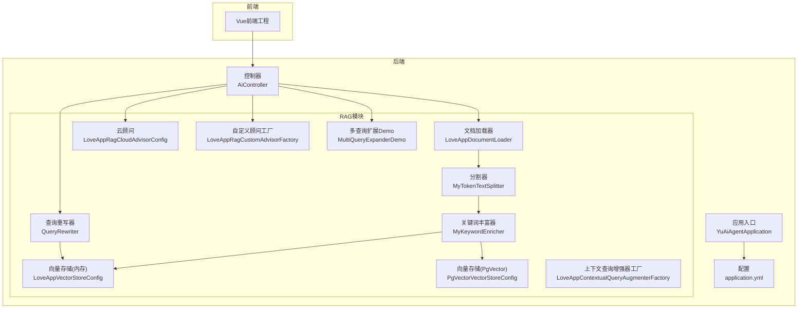
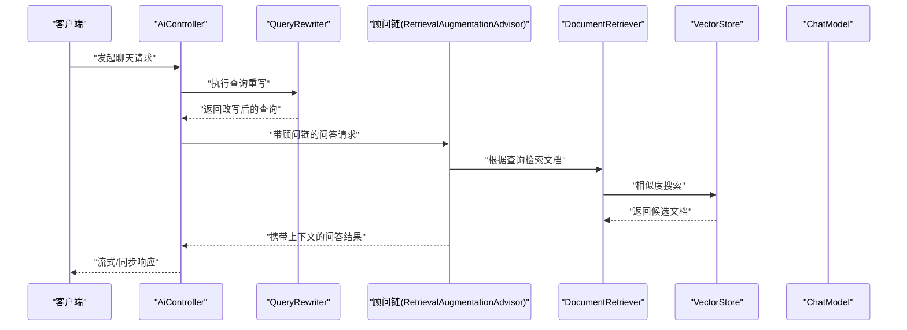
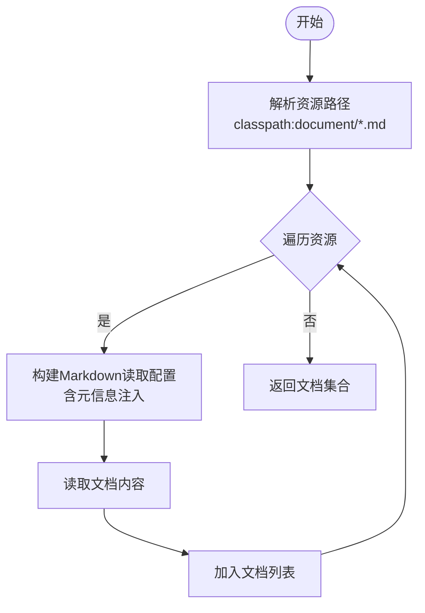
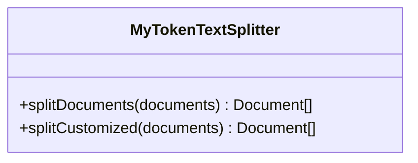
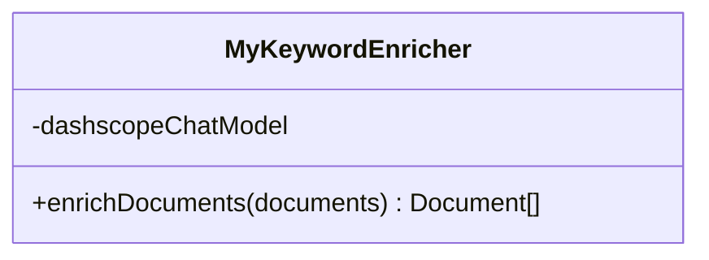
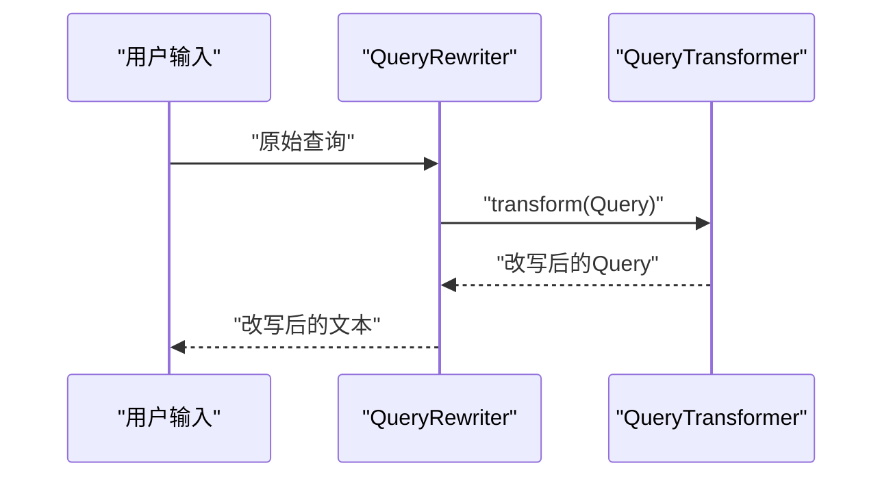
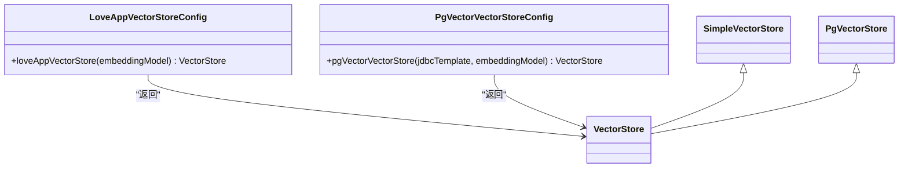
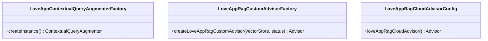
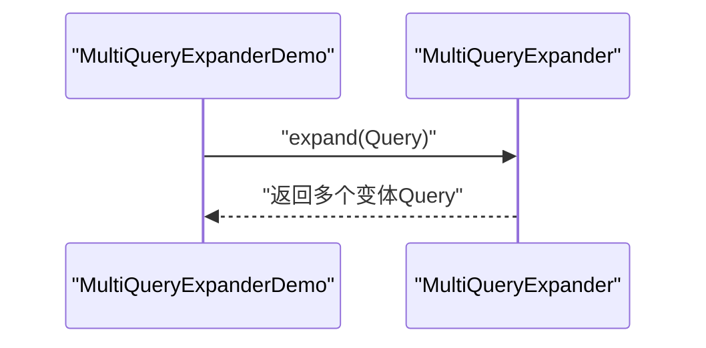
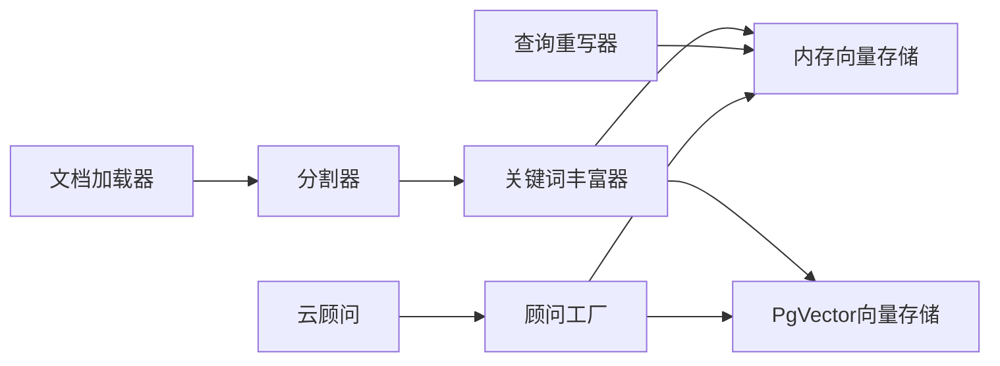

# RAG知识库系统

<cite>
**本文引用的文件**
- [LoveAppVectorStoreConfig.java](file://src/main/java/com/yupi/yuaiagent/rag/LoveAppVectorStoreConfig.java)
- [PgVectorVectorStoreConfig.java](file://src/main/java/com/yupi/yuaiagent/rag/PgVectorVectorStoreConfig.java)
- [MyTokenTextSplitter.java](file://src/main/java/com/yupi/yuaiagent/rag/MyTokenTextSplitter.java)
- [MyKeywordEnricher.java](file://src/main/java/com/yupi/yuaiagent/rag/MyKeywordEnricher.java)
- [QueryRewriter.java](file://src/main/java/com/yupi/yuaiagent/rag/QueryRewriter.java)
- [LoveAppDocumentLoader.java](file://src/main/java/com/yupi/yuaiagent/rag/LoveAppDocumentLoader.java)
- [LoveAppContextualQueryAugmenterFactory.java](file://src/main/java/com/yupi/yuaiagent/rag/LoveAppContextualQueryAugmenterFactory.java)
- [LoveAppRagCloudAdvisorConfig.java](file://src/main/java/com/yupi/yuaiagent/rag/LoveAppRagCloudAdvisorConfig.java)
- [LoveAppRagCustomAdvisorFactory.java](file://src/main/java/com/yupi/yuaiagent/rag/LoveAppRagCustomAdvisorFactory.java)
- [MultiQueryExpanderDemo.java](file://src/main/java/com/yupi/yuaiagent/demo/rag/MultiQueryExpanderDemo.java)
- [application.yml](file://src/main/resources/application.yml)
- [YuAiAgentApplication.java](file://src/main/java/com/yupi/yuaiagent/YuAiAgentApplication.java)
- [AiController.java](file://src/main/java/com/yupi/yuaiagent/controller/AiController.java)
- [LoveAppDocumentLoaderTest.java](file://src/test/java/com/yupi/yuaiagent/rag/LoveAppDocumentLoaderTest.java)
- [PgVectorVectorStoreConfigTest.java](file://src/test/java/com/yupi/yuaiagent/rag/PgVectorVectorStoreConfigTest.java)
- [MultiQueryExpanderDemoTest.java](file://src/test/java/com/yupi/yuaiagent/demo/rag/MultiQueryExpanderDemoTest.java)
</cite>

## 目录
1. [简介](#简介)
2. [项目结构](#项目结构)
3. [核心组件](#核心组件)
4. [架构总览](#架构总览)
5. [详细组件分析](#详细组件分析)
6. [依赖分析](#依赖分析)
7. [性能考虑](#性能考虑)
8. [故障排查指南](#故障排查指南)
9. [结论](#结论)
10. [附录](#附录)

## 简介
本文件面向RAG知识库系统的开发者与运维人员，系统性解析检索增强生成（RAG）在本项目中的实现原理与优化策略。内容覆盖向量存储配置（内存与PgVector）、文档加载器设计与扩展、文档分割器原理与自定义策略、关键词丰富器机制、查询重写器优化、以及性能优化与调试监控实践。文档以“从代码到架构”的方式组织，既适合深入研究源码的工程师，也便于快速上手的使用者。

## 项目结构
后端采用Spring Boot工程，RAG相关逻辑集中在com.yupi.yuaiagent.rag包中；AI能力由Spring AI生态提供，结合DashScope与Ollama等模型服务；前端位于yu-ai-agent-frontend目录。系统通过控制器对外提供聊天接口，内部通过顾问（Advisor）链路集成RAG检索增强。

图表来源
- [YuAiAgentApplication.java:1-18](file://src/main/java/com/yupi/yuaiagent/YuAiAgentApplication.java#L1-L18)
- [application.yml:1-66](file://src/main/resources/application.yml#L1-L66)
- [AiController.java:1-106](file://src/main/java/com/yupi/yuaiagent/controller/AiController.java#L1-L106)
- [LoveAppDocumentLoader.java:1-56](file://src/main/java/com/yupi/yuaiagent/rag/LoveAppDocumentLoader.java#L1-L56)
- [MyTokenTextSplitter.java:1-24](file://src/main/java/com/yupi/yuaiagent/rag/MyTokenTextSplitter.java#L1-L24)
- [MyKeywordEnricher.java:1-25](file://src/main/java/com/yupi/yuaiagent/rag/MyKeywordEnricher.java#L1-L25)
- [LoveAppVectorStoreConfig.java:1-42](file://src/main/java/com/yupi/yuaiagent/rag/LoveAppVectorStoreConfig.java#L1-L42)
- [PgVectorVectorStoreConfig.java:1-41](file://src/main/java/com/yupi/yuaiagent/rag/PgVectorVectorStoreConfig.java#L1-L41)
- [QueryRewriter.java:1-40](file://src/main/java/com/yupi/yuaiagent/rag/QueryRewriter.java#L1-L40)
- [LoveAppContextualQueryAugmenterFactory.java:1-23](file://src/main/java/com/yupi/yuaiagent/rag/LoveAppContextualQueryAugmenterFactory.java#L1-L23)
- [LoveAppRagCloudAdvisorConfig.java:1-39](file://src/main/java/com/yupi/yuaiagent/rag/LoveAppRagCloudAdvisorConfig.java#L1-L39)
- [LoveAppRagCustomAdvisorFactory.java:1-40](file://src/main/java/com/yupi/yuaiagent/rag/LoveAppRagCustomAdvisorFactory.java#L1-L40)
- [MultiQueryExpanderDemo.java:1-32](file://src/main/java/com/yupi/yuaiagent/demo/rag/MultiQueryExpanderDemo.java#L1-L32)

章节来源
- [YuAiAgentApplication.java:1-18](file://src/main/java/com/yupi/yuaiagent/YuAiAgentApplication.java#L1-L18)
- [application.yml:1-66](file://src/main/resources/application.yml#L1-L66)
- [AiController.java:1-106](file://src/main/java/com/yupi/yuaiagent/controller/AiController.java#L1-L106)

## 核心组件
- 文档加载器：负责从资源目录加载Markdown文档，设置基础元信息（如文件名、状态），并返回标准文档对象列表。
- 文档分割器：基于Token的分割策略，默认与可定制化参数，用于控制分段长度与重叠，平衡召回与上下文连贯性。
- 关键词丰富器：利用大模型抽取关键词并注入文档元信息，提升检索质量与后续上下文增强效果。
- 向量存储配置：提供内存向量存储与PgVector两种实现，前者便于开发调试，后者支持生产级持久化与高性能检索。
- 查询重写器：在检索前对用户问题进行改写，提升语义匹配与召回质量。
- 上下文查询增强器：当无相关文档时，返回预设友好提示，保证用户体验一致性。
- 顾问工厂与云顾问：封装RAG检索增强流程，支持基于云知识库服务或本地向量存储的检索器组合。

章节来源
- [LoveAppDocumentLoader.java:1-56](file://src/main/java/com/yupi/yuaiagent/rag/LoveAppDocumentLoader.java#L1-L56)
- [MyTokenTextSplitter.java:1-24](file://src/main/java/com/yupi/yuaiagent/rag/MyTokenTextSplitter.java#L1-L24)
- [MyKeywordEnricher.java:1-25](file://src/main/java/com/yupi/yuaiagent/rag/MyKeywordEnricher.java#L1-L25)
- [LoveAppVectorStoreConfig.java:1-42](file://src/main/java/com/yupi/yuaiagent/rag/LoveAppVectorStoreConfig.java#L1-L42)
- [PgVectorVectorStoreConfig.java:1-41](file://src/main/java/com/yupi/yuaiagent/rag/PgVectorVectorStoreConfig.java#L1-L41)
- [QueryRewriter.java:1-40](file://src/main/java/com/yupi/yuaiagent/rag/QueryRewriter.java#L1-L40)
- [LoveAppContextualQueryAugmenterFactory.java:1-23](file://src/main/java/com/yupi/yuaiagent/rag/LoveAppContextualQueryAugmenterFactory.java#L1-L23)
- [LoveAppRagCloudAdvisorConfig.java:1-39](file://src/main/java/com/yupi/yuaiagent/rag/LoveAppRagCloudAdvisorConfig.java#L1-L39)
- [LoveAppRagCustomAdvisorFactory.java:1-40](file://src/main/java/com/yupi/yuaiagent/rag/LoveAppRagCustomAdvisorFactory.java#L1-L40)

## 架构总览
RAG工作流从控制器入口开始，经过查询重写、文档检索与上下文增强，最终交给大模型生成回复。系统同时支持云知识库与本地向量存储两种检索路径，并提供多查询扩展与关键词元信息增强等优化手段。

图表来源
- [AiController.java:1-106](file://src/main/java/com/yupi/yuaiagent/controller/AiController.java#L1-L106)
- [QueryRewriter.java:1-40](file://src/main/java/com/yupi/yuaiagent/rag/QueryRewriter.java#L1-L40)
- [LoveAppRagCustomAdvisorFactory.java:1-40](file://src/main/java/com/yupi/yuaiagent/rag/LoveAppRagCustomAdvisorFactory.java#L1-L40)
- [LoveAppVectorStoreConfig.java:1-42](file://src/main/java/com/yupi/yuaiagent/rag/LoveAppVectorStoreConfig.java#L1-L42)
- [PgVectorVectorStoreConfig.java:1-41](file://src/main/java/com/yupi/yuaiagent/rag/PgVectorVectorStoreConfig.java#L1-L41)

## 详细组件分析

### 文档加载器设计与扩展机制
- 设计思路：通过资源模式定位Markdown文件，逐个读取并构建文档对象，同时注入额外元信息（如文件名、状态），便于后续过滤与增强。
- 扩展机制：可通过修改资源路径、Reader配置与元信息字段，适配不同目录结构与文档类型；支持禁用/启用标题、代码块、引用块等元素，控制输入规模与噪声。
- 关键点：异常捕获与日志记录，确保加载失败不影响整体流程。

图表来源
- [LoveAppDocumentLoader.java:28-54](file://src/main/java/com/yupi/yuaiagent/rag/LoveAppDocumentLoader.java#L28-L54)

章节来源
- [LoveAppDocumentLoader.java:1-56](file://src/main/java/com/yupi/yuaiagent/rag/LoveAppDocumentLoader.java#L1-L56)
- [LoveAppDocumentLoaderTest.java:1-19](file://src/test/java/com/yupi/yuaiagent/rag/LoveAppDocumentLoaderTest.java#L1-L19)

### 文档分割器实现原理与自定义策略
- 实现原理：基于Token的文本分割器，按最大token数与重叠长度切分，兼顾召回与上下文完整性。
- 自定义策略：提供默认分割与定制化参数版本，允许调整窗口大小、重叠比例与最大长度，满足不同场景需求。
- 复杂度与性能：分割复杂度近似O(n)，受文档长度与token映射效率影响；合理设置窗口与重叠可降低重复与截断带来的信息损失。

图表来源
- [MyTokenTextSplitter.java:14-22](file://src/main/java/com/yupi/yuaiagent/rag/MyTokenTextSplitter.java#L14-L22)

章节来源
- [MyTokenTextSplitter.java:1-24](file://src/main/java/com/yupi/yuaiagent/rag/MyTokenTextSplitter.java#L1-L24)

### 关键词丰富器的作用机制与实现方式
- 作用机制：利用大模型抽取文档关键词并写入元信息，提升检索阶段的关键词命中率与相关性排序。
- 实现方式：封装为元信息增强器，批量处理文档列表，返回增强后的文档集合。
- 性能与成本：关键词抽取会增加一次模型调用开销，建议在入库阶段执行并缓存结果，避免重复计算。

图表来源
- [MyKeywordEnricher.java:17-23](file://src/main/java/com/yupi/yuaiagent/rag/MyKeywordEnricher.java#L17-L23)

章节来源
- [MyKeywordEnricher.java:1-25](file://src/main/java/com/yupi/yuaiagent/rag/MyKeywordEnricher.java#L1-L25)

### 查询重写器的优化策略与效果提升
- 优化策略：在检索前对原始查询进行改写，提升语义表达与关键词密度，减少歧义与同义词差异导致的召回不足。
- 效果提升：通过改写后的查询进行向量检索，通常能显著提高相关文档命中率与下游生成质量。
- 实现要点：基于聊天客户端构建查询变换器，对Query对象进行transform，输出改写后的文本。

图表来源
- [QueryRewriter.java:18-38](file://src/main/java/com/yupi/yuaiagent/rag/QueryRewriter.java#L18-L38)

章节来源
- [QueryRewriter.java:1-40](file://src/main/java/com/yupi/yuaiagent/rag/QueryRewriter.java#L1-L40)

### 向量存储配置：内存与PgVector对比
- 内存向量存储（SimpleVectorStore）
  - 特点：无需外部依赖，适合开发调试；重启后数据丢失。
  - 配置要点：通过嵌入模型构建，加载文档后直接add到内存向量库。
- PgVector向量存储
  - 特点：支持生产级持久化、高性能索引与大规模数据检索。
  - 配置要点：指定维度、距离类型、索引类型、表名、批处理大小等；可初始化模式与设置schema；通过JDBC模板连接数据库。
- 切换策略：通过注解开关与配置文件项控制启用/禁用，便于在开发与生产环境间切换。

图表来源
- [LoveAppVectorStoreConfig.java:29-40](file://src/main/java/com/yupi/yuaiagent/rag/LoveAppVectorStoreConfig.java#L29-L40)
- [PgVectorVectorStoreConfig.java:24-39](file://src/main/java/com/yupi/yuaiagent/rag/PgVectorVectorStoreConfig.java#L24-L39)

章节来源
- [LoveAppVectorStoreConfig.java:1-42](file://src/main/java/com/yupi/yuaiagent/rag/LoveAppVectorStoreConfig.java#L1-L42)
- [PgVectorVectorStoreConfig.java:1-41](file://src/main/java/com/yupi/yuaiagent/rag/PgVectorVectorStoreConfig.java#L1-L41)
- [application.yml:32-37](file://src/main/resources/application.yml#L32-L37)
- [YuAiAgentApplication.java:7-10](file://src/main/java/com/yupi/yuaiagent/YuAiAgentApplication.java#L7-L10)

### 上下文查询增强器与顾问工厂
- 上下文查询增强器：当检索不到相关文档时，返回预设提示，保持一致的用户体验。
- 自定义顾问工厂：基于向量存储与过滤条件构建文档检索器，设置相似度阈值与返回数量，组合上下文增强器形成完整的RAG顾问。
- 云顾问：封装云端知识库检索器，便于在不改动本地逻辑的情况下切换检索后端。

图表来源
- [LoveAppContextualQueryAugmenterFactory.java:11-21](file://src/main/java/com/yupi/yuaiagent/rag/LoveAppContextualQueryAugmenterFactory.java#L11-L21)
- [LoveAppRagCustomAdvisorFactory.java:23-39](file://src/main/java/com/yupi/yuaiagent/rag/LoveAppRagCustomAdvisorFactory.java#L23-L39)
- [LoveAppRagCloudAdvisorConfig.java:24-37](file://src/main/java/com/yupi/yuaiagent/rag/LoveAppRagCloudAdvisorConfig.java#L24-L37)

章节来源
- [LoveAppContextualQueryAugmenterFactory.java:1-23](file://src/main/java/com/yupi/yuaiagent/rag/LoveAppContextualQueryAugmenterFactory.java#L1-L23)
- [LoveAppRagCustomAdvisorFactory.java:1-40](file://src/main/java/com/yupi/yuaiagent/rag/LoveAppRagCustomAdvisorFactory.java#L1-L40)
- [LoveAppRagCloudAdvisorConfig.java:1-39](file://src/main/java/com/yupi/yuaiagent/rag/LoveAppRagCloudAdvisorConfig.java#L1-L39)

### 多查询扩展与测试验证
- 多查询扩展：在检索前将单一查询扩展为多个变体，提升召回多样性与鲁棒性。
- 测试验证：提供单元测试覆盖扩展器行为与向量存储的相似度检索，确保功能正确性。

图表来源
- [MultiQueryExpanderDemo.java:23-30](file://src/main/java/com/yupi/yuaiagent/demo/rag/MultiQueryExpanderDemo.java#L23-L30)
- [MultiQueryExpanderDemoTest.java:20-23](file://src/test/java/com/yupi/yuaiagent/demo/rag/MultiQueryExpanderDemoTest.java#L20-L23)

章节来源
- [MultiQueryExpanderDemo.java:1-32](file://src/main/java/com/yupi/yuaiagent/demo/rag/MultiQueryExpanderDemo.java#L1-L32)
- [MultiQueryExpanderDemoTest.java:1-25](file://src/test/java/com/yupi/yuaiagent/demo/rag/MultiQueryExpanderDemoTest.java#L1-L25)

## 依赖分析
- 组件耦合：向量存储配置与文档加载器松耦合，通过文档列表传递；顾问工厂依赖向量存储与过滤表达式；查询重写器独立于存储层。
- 外部依赖：Spring AI生态（向量存储、检索器、顾问、查询变换器等）；DashScope与Ollama模型服务；PostgreSQL+PgVector数据库。
- 配置开关：通过注解与配置文件控制是否启用PgVector与数据库自动配置，便于开发与生产的灵活切换。

图表来源
- [LoveAppDocumentLoader.java:1-56](file://src/main/java/com/yupi/yuaiagent/rag/LoveAppDocumentLoader.java#L1-L56)
- [MyTokenTextSplitter.java:1-24](file://src/main/java/com/yupi/yuaiagent/rag/MyTokenTextSplitter.java#L1-L24)
- [MyKeywordEnricher.java:1-25](file://src/main/java/com/yupi/yuaiagent/rag/MyKeywordEnricher.java#L1-L25)
- [LoveAppVectorStoreConfig.java:1-42](file://src/main/java/com/yupi/yuaiagent/rag/LoveAppVectorStoreConfig.java#L1-L42)
- [PgVectorVectorStoreConfig.java:1-41](file://src/main/java/com/yupi/yuaiagent/rag/PgVectorVectorStoreConfig.java#L1-L41)
- [QueryRewriter.java:1-40](file://src/main/java/com/yupi/yuaiagent/rag/QueryRewriter.java#L1-L40)
- [LoveAppRagCustomAdvisorFactory.java:1-40](file://src/main/java/com/yupi/yuaiagent/rag/LoveAppRagCustomAdvisorFactory.java#L1-L40)
- [LoveAppRagCloudAdvisorConfig.java:1-39](file://src/main/java/com/yupi/yuaiagent/rag/LoveAppRagCloudAdvisorConfig.java#L1-L39)

章节来源
- [application.yml:1-66](file://src/main/resources/application.yml#L1-L66)
- [YuAiAgentApplication.java:1-18](file://src/main/java/com/yupi/yuaiagent/YuAiAgentApplication.java#L1-L18)

## 性能考虑
- 向量维度选择
  - 默认维度由嵌入模型决定；若显式指定，需与模型输出一致。PgVector示例中固定为1536，适用于多数场景。
- 索引策略
  - 推荐使用HNSW索引与余弦距离，兼顾精度与性能；可根据数据规模与查询延迟目标调整索引参数。
- 缓存机制
  - 关键词丰富与查询重写属于模型调用，建议在入库与检索前缓存中间结果，减少重复调用。
- 批处理与分页
  - 向量存储支持批量添加与查询，合理设置批大小可提升吞吐；相似度查询设置合适的topK与阈值平衡召回与性能。
- 日志与可观测性
  - 在配置中开启DEBUG级别日志，有助于观察Spring AI的调用细节与性能瓶颈。

章节来源
- [PgVectorVectorStoreConfig.java:27-33](file://src/main/java/com/yupi/yuaiagent/rag/PgVectorVectorStoreConfig.java#L27-L33)
- [application.yml:64-66](file://src/main/resources/application.yml#L64-L66)

## 故障排查指南
- 文档加载失败
  - 现象：加载Markdown时抛出IO异常。
  - 排查：确认资源路径是否存在、文件权限与编码；检查日志错误堆栈；确保资源模式匹配预期文件。
- 向量存储不可用
  - 现象：相似度查询为空或报错。
  - 排查：确认向量存储已初始化并成功添加文档；检查数据库连接与表结构；验证查询参数（topK、阈值）是否合理。
- 查询重写无效
  - 现象：改写前后无变化或结果不佳。
  - 排查：确认模型服务可用且API Key正确；检查查询变换器构建与调用链路。
- 顾问链未生效
  - 现象：问答未带上下文或未触发检索。
  - 排查：确认顾问顺序与参数设置；检查过滤表达式与相似度阈值；验证上下文增强器配置。

章节来源
- [LoveAppDocumentLoader.java:50-52](file://src/main/java/com/yupi/yuaiagent/rag/LoveAppDocumentLoader.java#L50-L52)
- [PgVectorVectorStoreConfigTest.java:20-31](file://src/test/java/com/yupi/yuaiagent/rag/PgVectorVectorStoreConfigTest.java#L20-L31)
- [QueryRewriter.java:32-38](file://src/main/java/com/yupi/yuaiagent/rag/QueryRewriter.java#L32-L38)

## 结论
本RAG知识库系统以Spring AI为核心，提供了从文档加载、分割、增强到向量存储与检索增强的完整链路。通过内存与PgVector双轨配置、关键词元信息增强、查询重写与多查询扩展等策略，系统在开发调试与生产部署之间实现了灵活切换与性能优化。建议在实际落地时结合业务场景进一步细化分割策略、索引参数与缓存策略，并建立完善的日志与监控体系以保障稳定性与可观测性。

## 附录
- 快速启动与切换
  - 开发调试：启用内存向量存储与简化配置；关闭数据库自动配置。
  - 生产部署：启用PgVector配置与数据库连接；设置索引与批处理参数。
- 常用测试
  - 文档加载：验证资源路径与元信息注入。
  - 向量检索：验证相似度查询与结果非空。
  - 多查询扩展：验证扩展后的查询数量与多样性。

章节来源
- [application.yml:6-10](file://src/main/resources/application.yml#L6-L10)
- [application.yml:31-37](file://src/main/resources/application.yml#L31-L37)
- [YuAiAgentApplication.java:7-10](file://src/main/java/com/yupi/yuaiagent/YuAiAgentApplication.java#L7-L10)
- [LoveAppDocumentLoaderTest.java:15-18](file://src/test/java/com/yupi/yuaiagent/rag/LoveAppDocumentLoaderTest.java#L15-L18)
- [PgVectorVectorStoreConfigTest.java:20-31](file://src/test/java/com/yupi/yuaiagent/rag/PgVectorVectorStoreConfigTest.java#L20-L31)
- [MultiQueryExpanderDemoTest.java:19-23](file://src/test/java/com/yupi/yuaiagent/demo/rag/MultiQueryExpanderDemoTest.java#L19-L23)