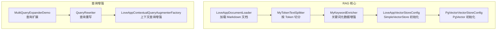
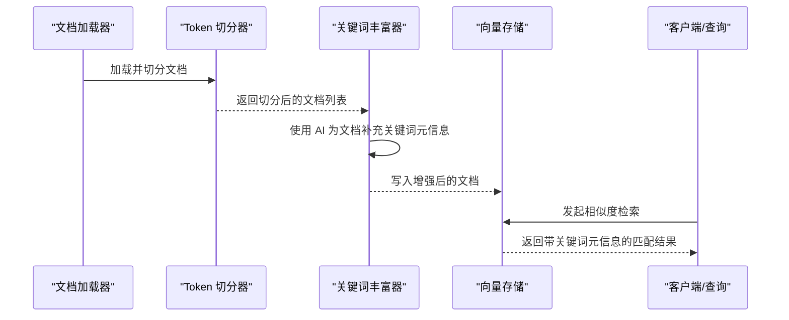
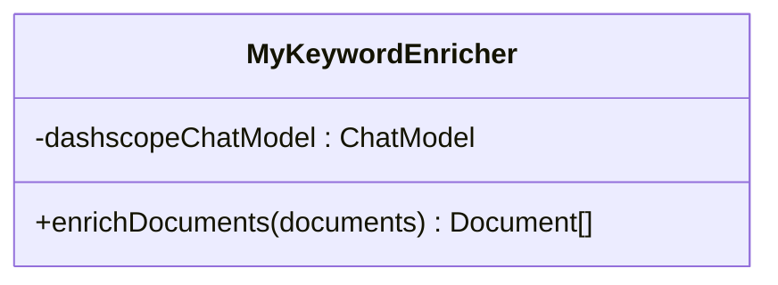
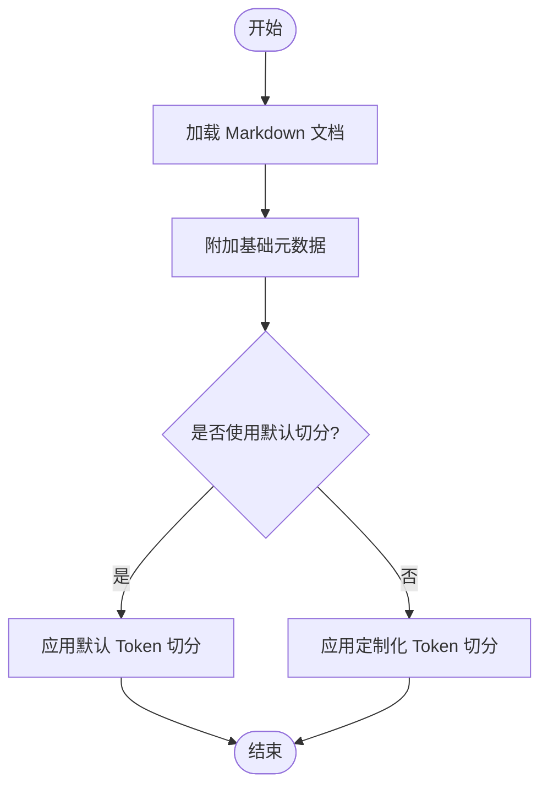
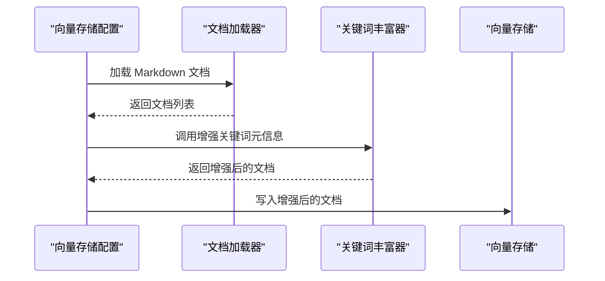
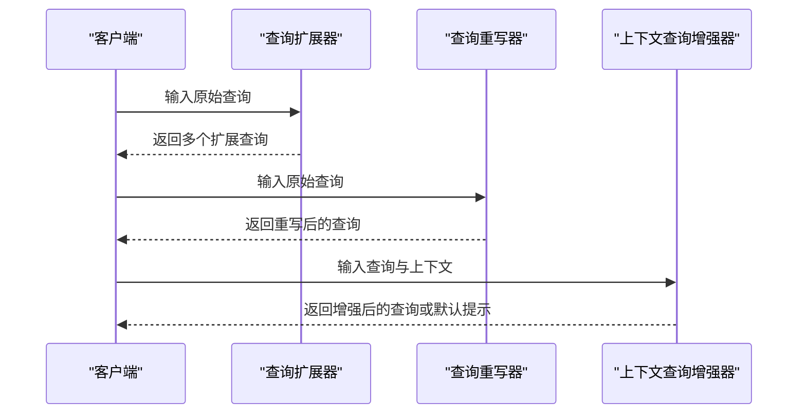
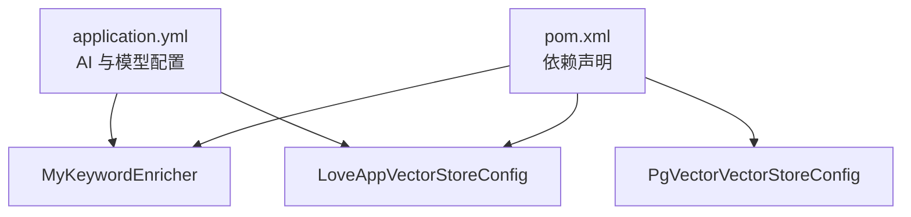

# 关键词丰富器

<cite>
**本文引用的文件**
- [MyKeywordEnricher.java](file://src/main/java/com/yupi/yuaiagent/rag/MyKeywordEnricher.java)
- [LoveAppVectorStoreConfig.java](file://src/main/java/com/yupi/yuaiagent/rag/LoveAppVectorStoreConfig.java)
- [MyTokenTextSplitter.java](file://src/main/java/com/yupi/yuaiagent/rag/MyTokenTextSplitter.java)
- [LoveAppDocumentLoader.java](file://src/main/java/com/yupi/yuaiagent/rag/LoveAppDocumentLoader.java)
- [MultiQueryExpanderDemo.java](file://src/main/java/com/yupi/yuaiagent/demo/rag/MultiQueryExpanderDemo.java)
- [QueryRewriter.java](file://src/main/java/com/yupi/yuaiagent/rag/QueryRewriter.java)
- [LoveAppContextualQueryAugmenterFactory.java](file://src/main/java/com/yupi/yuaiagent/rag/LoveAppContextualQueryAugmenterFactory.java)
- [PgVectorVectorStoreConfig.java](file://src/main/java/com/yupi/yuaiagent/rag/PgVectorVectorStoreConfig.java)
- [application.yml](file://src/main/resources/application.yml)
- [pom.xml](file://pom.xml)
- [MultiQueryExpanderDemoTest.java](file://src/test/java/com/yupi/yuaiagent/demo/rag/MultiQueryExpanderDemoTest.java)
- [PgVectorVectorStoreConfigTest.java](file://src/test/java/com/yupi/yuaiagent/rag/PgVectorVectorStoreConfigTest.java)
</cite>

## 目录
1. [简介](#简介)
2. [项目结构](#项目结构)
3. [核心组件](#核心组件)
4. [架构总览](#架构总览)
5. [详细组件分析](#详细组件分析)
6. [依赖分析](#依赖分析)
7. [性能考虑](#性能考虑)
8. [故障排查指南](#故障排查指南)
9. [结论](#结论)
10. [附录](#附录)

## 简介
本文件围绕关键词丰富器 MyKeywordEnricher 展开，系统化梳理其在 RAG 知识增强与检索中的作用机制，涵盖以下要点：
- 关键词提取与元数据增强流程：如何通过 AI 能力为文档补充关键词元信息，并将其注入到向量检索体系中。
- 与检索增强链路的衔接：查询扩展、查询重写、上下文查询增强等前置处理如何与关键词元信息协同提升召回与排序质量。
- 参数调优建议：词汇过滤、词性选择、领域适应等策略，以及在不同向量存储上的实践差异。
- 效果验证与评估：结合现有测试用例与配置，给出可操作的评估路径与实验设计。

## 项目结构
本项目采用 Spring Boot 结构，RAG 相关能力集中在 rag 包中；前端与后端分离，后端提供 RAG 与工具链能力。与关键词丰富器直接相关的模块包括：
- 文档加载与预处理：LoveAppDocumentLoader、MyTokenTextSplitter
- 关键词元数据增强：MyKeywordEnricher
- 向量存储配置：LoveAppVectorStoreConfig、PgVectorVectorStoreConfig
- 查询增强与重写：MultiQueryExpanderDemo、QueryRewriter、LoveAppContextualQueryAugmenterFactory
- 应用配置与依赖：application.yml、pom.xml

图表来源
- [LoveAppDocumentLoader.java:28-54](file://src/main/java/com/yupi/yuaiagent/rag/LoveAppDocumentLoader.java#L28-L54)
- [MyTokenTextSplitter.java:14-22](file://src/main/java/com/yupi/yuaiagent/rag/MyTokenTextSplitter.java#L14-L22)
- [MyKeywordEnricher.java:20-23](file://src/main/java/com/yupi/yuaiagent/rag/MyKeywordEnricher.java#L20-L23)
- [LoveAppVectorStoreConfig.java:29-40](file://src/main/java/com/yupi/yuaiagent/rag/LoveAppVectorStoreConfig.java#L29-L40)
- [PgVectorVectorStoreConfig.java:24-39](file://src/main/java/com/yupi/yuaiagent/rag/PgVectorVectorStoreConfig.java#L24-L39)
- [MultiQueryExpanderDemo.java:23-30](file://src/main/java/com/yupi/yuaiagent/demo/rag/MultiQueryExpanderDemo.java#L23-L30)
- [QueryRewriter.java:32-38](file://src/main/java/com/yupi/yuaiagent/rag/QueryRewriter.java#L32-L38)
- [LoveAppContextualQueryAugmenterFactory.java:11-21](file://src/main/java/com/yupi/yuaiagent/rag/LoveAppContextualQueryAugmenterFactory.java#L11-L21)

章节来源
- [application.yml:11-21](file://src/main/resources/application.yml#L11-L21)
- [pom.xml:70-101](file://pom.xml#L70-L101)

## 核心组件
- MyKeywordEnricher：基于 AI 的文档元信息增强器，负责为文档补充关键词元信息，供后续检索使用。
- LoveAppVectorStoreConfig：初始化内存向量存储，加载并增强后的文档写入向量库。
- MyTokenTextSplitter：基于 Token 的文本切分器，支持默认与定制化切分策略。
- LoveAppDocumentLoader：从资源目录加载 Markdown 文档，附加基础元数据（如文件名、状态）。
- MultiQueryExpanderDemo：演示查询扩展能力，生成多个变体查询以提升召回。
- QueryRewriter：对用户查询进行改写，提升语义一致性与检索效果。
- LoveAppContextualQueryAugmenterFactory：构建上下文查询增强器，处理空上下文场景。
- PgVectorVectorStoreConfig：演示基于 PgVector 的向量存储配置（当前被注释，便于本地开发）。

章节来源
- [MyKeywordEnricher.java:14-24](file://src/main/java/com/yupi/yuaiagent/rag/MyKeywordEnricher.java#L14-L24)
- [LoveAppVectorStoreConfig.java:17-41](file://src/main/java/com/yupi/yuaiagent/rag/LoveAppVectorStoreConfig.java#L17-L41)
- [MyTokenTextSplitter.java:9-23](file://src/main/java/com/yupi/yuaiagent/rag/MyTokenTextSplitter.java#L9-L23)
- [LoveAppDocumentLoader.java:15-54](file://src/main/java/com/yupi/yuaiagent/rag/LoveAppDocumentLoader.java#L15-L54)
- [MultiQueryExpanderDemo.java:11-31](file://src/main/java/com/yupi/yuaiagent/demo/rag/MultiQueryExpanderDemo.java#L11-L31)
- [QueryRewriter.java:10-39](file://src/main/java/com/yupi/yuaiagent/rag/QueryRewriter.java#L10-L39)
- [LoveAppContextualQueryAugmenterFactory.java:6-22](file://src/main/java/com/yupi/yuaiagent/rag/LoveAppContextualQueryAugmenterFactory.java#L6-L22)
- [PgVectorVectorStoreConfig.java:17-40](file://src/main/java/com/yupi/yuaiagent/rag/PgVectorVectorStoreConfig.java#L17-L40)

## 架构总览
下图展示从文档加载到向量检索的关键路径，以及关键词元数据在其中的作用位置。

图表来源
- [LoveAppDocumentLoader.java:32-54](file://src/main/java/com/yupi/yuaiagent/rag/LoveAppDocumentLoader.java#L32-L54)
- [MyTokenTextSplitter.java:14-22](file://src/main/java/com/yupi/yuaiagent/rag/MyTokenTextSplitter.java#L14-L22)
- [MyKeywordEnricher.java:20-23](file://src/main/java/com/yupi/yuaiagent/rag/MyKeywordEnricher.java#L20-L23)
- [LoveAppVectorStoreConfig.java:33-39](file://src/main/java/com/yupi/yuaiagent/rag/LoveAppVectorStoreConfig.java#L33-L39)

## 详细组件分析

### MyKeywordEnricher 组件分析
- 角色定位：在文档入库阶段，利用 AI 将关键词注入到文档元数据中，提升检索阶段的关键词匹配与语义相关性。
- 实现要点：
  - 依赖 ChatModel（DashScope），通过 KeywordMetadataEnricher 对文档执行增强。
  - 默认抽取固定数量的关键词，具体数量由构造参数控制。
- 入口方法：enrichDocuments，接收文档列表，返回增强后的文档列表。

图表来源
- [MyKeywordEnricher.java:14-24](file://src/main/java/com/yupi/yuaiagent/rag/MyKeywordEnricher.java#L14-L24)

章节来源
- [MyKeywordEnricher.java:17-23](file://src/main/java/com/yupi/yuaiagent/rag/MyKeywordEnricher.java#L17-L23)

### 文档加载与切分
- LoveAppDocumentLoader：从资源目录批量读取 Markdown 文档，设置基础元数据（如文件名、状态），并可配置是否包含代码块、分隔线等。
- MyTokenTextSplitter：提供两种切分策略：
  - 默认策略：基于 Token 的通用切分。
  - 定制化策略：可调整窗口大小、重叠长度、最大文档数等参数，适配不同长度与粒度需求。

图表来源
- [LoveAppDocumentLoader.java:32-54](file://src/main/java/com/yupi/yuaiagent/rag/LoveAppDocumentLoader.java#L32-L54)
- [MyTokenTextSplitter.java:14-22](file://src/main/java/com/yupi/yuaiagent/rag/MyTokenTextSplitter.java#L14-L22)

章节来源
- [LoveAppDocumentLoader.java:28-54](file://src/main/java/com/yupi/yuaiagent/rag/LoveAppDocumentLoader.java#L28-L54)
- [MyTokenTextSplitter.java:14-22](file://src/main/java/com/yupi/yuaiagent/rag/MyTokenTextSplitter.java#L14-L22)

### 向量存储配置与关键词注入
- LoveAppVectorStoreConfig：初始化 SimpleVectorStore，先加载文档，再调用 MyKeywordEnricher 进行关键词增强，最后写入向量库。
- PgVectorVectorStoreConfig：演示基于 PgVector 的向量存储配置（当前被注释，便于本地开发与调试）。若启用，将使用 JDBC 连接数据库并创建向量表，随后加载文档。

图表来源
- [LoveAppVectorStoreConfig.java:30-39](file://src/main/java/com/yupi/yuaiagent/rag/LoveAppVectorStoreConfig.java#L30-L39)
- [PgVectorVectorStoreConfig.java:24-39](file://src/main/java/com/yupi/yuaiagent/rag/PgVectorVectorStoreConfig.java#L24-L39)

章节来源
- [LoveAppVectorStoreConfig.java:29-40](file://src/main/java/com/yupi/yuaiagent/rag/LoveAppVectorStoreConfig.java#L29-L40)
- [PgVectorVectorStoreConfig.java:17-40](file://src/main/java/com/yupi/yuaiagent/rag/PgVectorVectorStoreConfig.java#L17-L40)

### 查询增强与重写
- MultiQueryExpanderDemo：通过 ChatClient 构建查询扩展器，将单条查询扩展为多个变体查询，提升召回覆盖面。
- QueryRewriter：使用 RewriteQueryTransformer 对原始查询进行改写，提高语义一致性与检索效果。
- LoveAppContextualQueryAugmenterFactory：构建上下文查询增强器，当上下文为空时返回预设提示模板，避免无效检索。

图表来源
- [MultiQueryExpanderDemo.java:23-30](file://src/main/java/com/yupi/yuaiagent/demo/rag/MultiQueryExpanderDemo.java#L23-L30)
- [QueryRewriter.java:32-38](file://src/main/java/com/yupi/yuaiagent/rag/QueryRewriter.java#L32-L38)
- [LoveAppContextualQueryAugmenterFactory.java:11-21](file://src/main/java/com/yupi/yuaiagent/rag/LoveAppContextualQueryAugmenterFactory.java#L11-L21)

章节来源
- [MultiQueryExpanderDemo.java:19-30](file://src/main/java/com/yupi/yuaiagent/demo/rag/MultiQueryExpanderDemo.java#L19-L30)
- [QueryRewriter.java:18-38](file://src/main/java/com/yupi/yuaiagent/rag/QueryRewriter.java#L18-L38)
- [LoveAppContextualQueryAugmenterFactory.java:11-21](file://src/main/java/com/yupi/yuaiagent/rag/LoveAppContextualQueryAugmenterFactory.java#L11-L21)

## 依赖分析
- 外部依赖与模型配置：
  - DashScope Chat Model：用于关键词元数据增强与查询重写。
  - EmbeddingModel：用于向量嵌入与相似度检索。
  - JDBC 与 PgVector：用于持久化向量存储（当前示例中被注释）。
- 组件耦合：
  - MyKeywordEnricher 依赖 ChatModel，耦合度较低，便于替换模型。
  - LoveAppVectorStoreConfig 串联加载、切分、增强与写入，耦合度中等。
  - 查询增强链路相对独立，可通过组合方式接入检索流程。

图表来源
- [application.yml:11-21](file://src/main/resources/application.yml#L11-L21)
- [pom.xml:70-101](file://pom.xml#L70-L101)
- [MyKeywordEnricher.java:17-18](file://src/main/java/com/yupi/yuaiagent/rag/MyKeywordEnricher.java#L17-L18)
- [LoveAppVectorStoreConfig.java:30-31](file://src/main/java/com/yupi/yuaiagent/rag/LoveAppVectorStoreConfig.java#L30-L31)
- [PgVectorVectorStoreConfig.java:25-26](file://src/main/java/com/yupi/yuaiagent/rag/PgVectorVectorStoreConfig.java#L25-L26)

章节来源
- [application.yml:11-21](file://src/main/resources/application.yml#L11-L21)
- [pom.xml:70-101](file://pom.xml#L70-L101)

## 性能考虑
- 关键词抽取成本：MyKeywordEnricher 通过 ChatModel 进行关键词抽取，属于 LLM 推理成本，建议：
  - 控制批量大小与并发度，避免高负载导致响应延迟。
  - 在入库阶段异步化增强流程，减少主线程阻塞。
- 文本切分策略：MyTokenTextSplitter 的定制化参数直接影响切分粒度与向量维度，建议：
  - 根据目标模型的最大上下文长度与嵌入维度，合理设置窗口与重叠。
  - 对长文档优先采用滑动窗口切分，确保语义完整性。
- 向量存储选择：
  - SimpleVectorStore 适合开发与小规模数据；大规模场景建议使用 PgVector 或其他高性能向量库。
  - 若启用 PgVector，注意索引类型与距离度量的选择，以平衡检索精度与速度。

## 故障排查指南
- 关键词增强未生效：
  - 检查 ChatModel 配置与 API Key 是否正确。
  - 确认 MyKeywordEnricher 的调用顺序位于文档写入向量库之前。
- 向量检索结果不佳：
  - 检查文档是否成功写入向量库（参考测试用例）。
  - 调整查询扩展与重写策略，观察召回变化。
- 开发环境调试：
  - application.yml 中已开启 Spring AI 日志级别，便于跟踪 LLM 调用细节。
  - 测试用例可作为最小可运行验证路径：加载文档、写入向量库、执行相似度检索。

章节来源
- [application.yml:64-66](file://src/main/resources/application.yml#L64-L66)
- [PgVectorVectorStoreConfigTest.java:20-31](file://src/test/java/com/yupi/yuaiagent/rag/PgVectorVectorStoreConfigTest.java#L20-L31)

## 结论
MyKeywordEnricher 通过在文档入库阶段注入关键词元信息，显著增强了检索阶段的关键词匹配与语义相关性。配合查询扩展、查询重写与上下文增强，可进一步提升召回质量与排序稳定性。在工程实践中，应结合 Token 切分策略、向量存储选型与日志监控，持续优化关键词增强的效果与性能。

## 附录

### 关键词提取与增强策略（概念性说明）
- TF-IDF：传统统计方法，适用于短文本与规则明确的场景；可与 LLM 抽取的关键词互补，提升覆盖率。
- TextRank：基于图的排序算法，适合抽取摘要性关键词；可作为关键词后处理，去除冗余并保留核心主题。
- LLM 抽取：具备更强的语义理解能力，适合复杂文档与跨领域场景；需关注成本与稳定性。

### 关键词在 RAG 检索中的作用机制
- 查询扩展：MultiQueryExpanderDemo 将单一查询扩展为多个变体，扩大召回范围。
- 查询重写：QueryRewriter 提升语义一致性，减少歧义与口语化表达的影响。
- 上下文增强：LoveAppContextualQueryAugmenterFactory 在无上下文时提供兜底提示，保证检索可用性。
- 结果排序：关键词元信息与向量相似度共同参与排序，提升相关性与可读性。

### 参数调优指南（面向工程实践）
- 词汇过滤：剔除停用词、标点与低频词，保留高频且有区分度的实体词。
- 词性选择：优先抽取名词、动词与专有名词，避免过度抽取虚词。
- 领域适应：针对特定领域构建术语词典，结合 LLM 抽取与规则过滤，提升专业性。
- Token 切分：根据模型上下文长度与嵌入维度，调整窗口大小与重叠比例，平衡语义完整性与召回率。
- 向量存储：选择合适的索引类型与距离度量，结合批量写入与异步增强，提升吞吐与稳定性。

### 效果验证与实验设计
- 单元测试验证：MultiQueryExpanderDemoTest 与 PgVectorVectorStoreConfigTest 提供最小可运行验证路径。
- A/B 实验：对比启用/禁用关键词增强、不同查询增强策略下的命中率、相关性评分与用户满意度。
- 回归测试：定期对关键文档集合进行相似度检索回归，确保系统稳定性。

章节来源
- [MultiQueryExpanderDemoTest.java:19-23](file://src/test/java/com/yupi/yuaiagent/demo/rag/MultiQueryExpanderDemoTest.java#L19-L23)
- [PgVectorVectorStoreConfigTest.java:20-31](file://src/test/java/com/yupi/yuaiagent/rag/PgVectorVectorStoreConfigTest.java#L20-L31)