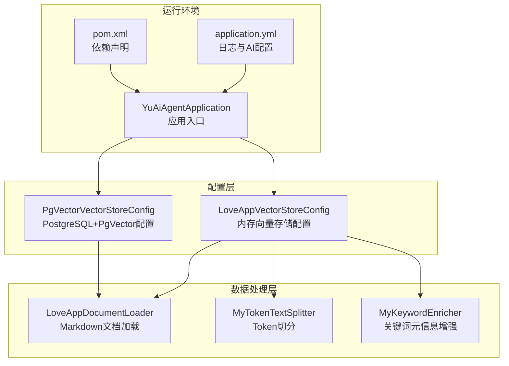
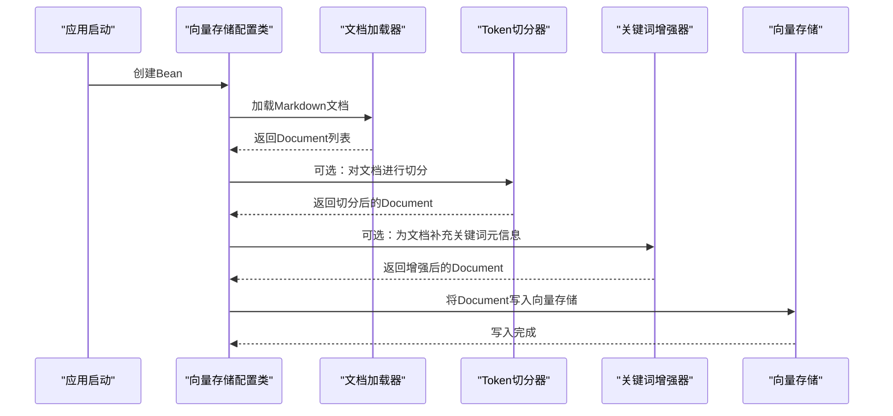
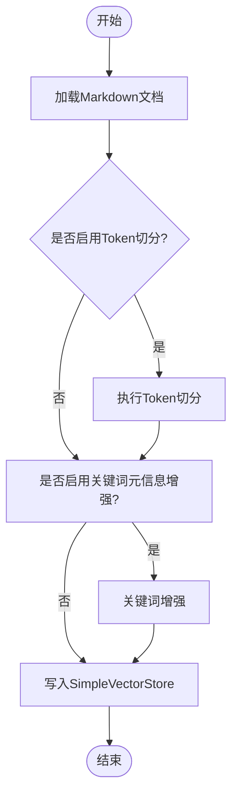
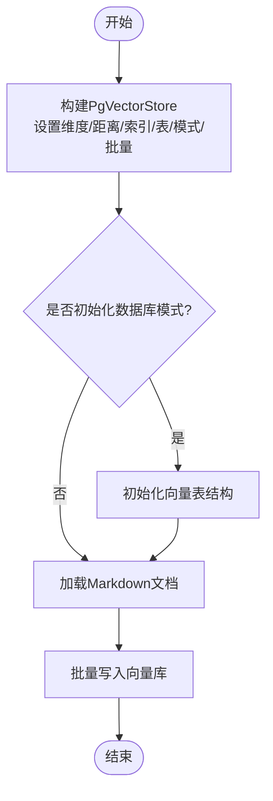
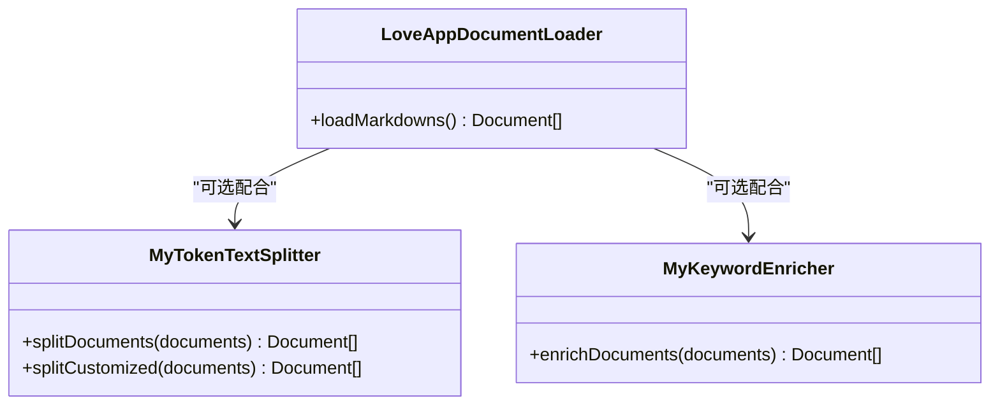
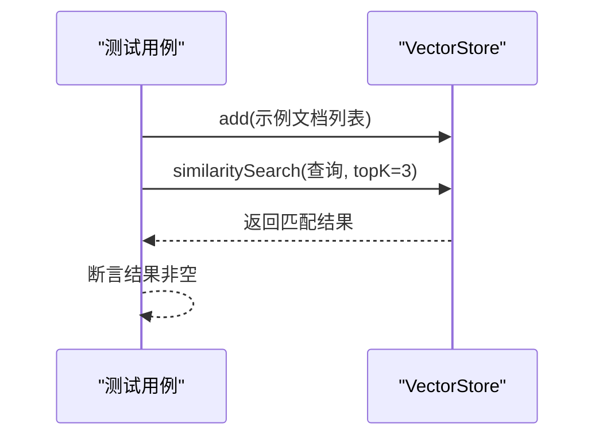
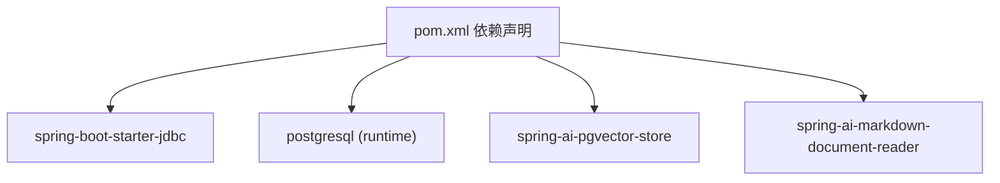

# 向量存储配置

<cite>
**本文引用的文件**
- [LoveAppVectorStoreConfig.java](file://src/main/java/com/yupi/yuaiagent/rag/LoveAppVectorStoreConfig.java)
- [PgVectorVectorStoreConfig.java](file://src/main/java/com/yupi/yuaiagent/rag/PgVectorVectorStoreConfig.java)
- [LoveAppDocumentLoader.java](file://src/main/java/com/yupi/yuaiagent/rag/LoveAppDocumentLoader.java)
- [MyTokenTextSplitter.java](file://src/main/java/com/yupi/yuaiagent/rag/MyTokenTextSplitter.java)
- [MyKeywordEnricher.java](file://src/main/java/com/yupi/yuaiagent/rag/MyKeywordEnricher.java)
- [application.yml](file://src/main/resources/application.yml)
- [pom.xml](file://pom.xml)
- [PgVectorVectorStoreConfigTest.java](file://src/test/java/com/yupi/yuaiagent/rag/PgVectorVectorStoreConfigTest.java)
- [YuAiAgentApplication.java](file://src/main/java/com/yupi/yuaiagent/YuAiAgentApplication.java)
</cite>

## 目录
1. [简介](#简介)
2. [项目结构](#项目结构)
3. [核心组件](#核心组件)
4. [架构总览](#架构总览)
5. [详细组件分析](#详细组件分析)
6. [依赖分析](#依赖分析)
7. [性能考虑](#性能考虑)
8. [故障排除指南](#故障排除指南)
9. [结论](#结论)
10. [附录](#附录)

## 简介
本文件聚焦于Spring AI在本项目中的两种向量存储实现：基于内存的SimpleVectorStore与PostgreSQL+PgVector的持久化向量存储。文档从配置方式、数据处理流程、索引与距离策略、性能与适用场景、迁移策略、调试与监控等方面进行系统性说明，并给出面向开发与运维的实践建议。

## 项目结构
与向量存储相关的关键文件分布如下：
- 配置类：LoveAppVectorStoreConfig（内存向量存储）、PgVectorVectorStoreConfig（PostgreSQL+PgVector）
- 文档加载与预处理：LoveAppDocumentLoader、MyTokenTextSplitter、MyKeywordEnricher
- 应用入口与配置：YuAiAgentApplication、application.yml
- 构建依赖：pom.xml（包含Spring AI与PGVector相关依赖）

图表来源
- [LoveAppVectorStoreConfig.java:1-41](file://src/main/java/com/yupi/yuaiagent/rag/LoveAppVectorStoreConfig.java#L1-L41)
- [PgVectorVectorStoreConfig.java:1-40](file://src/main/java/com/yupi/yuaiagent/rag/PgVectorVectorStoreConfig.java#L1-L40)
- [LoveAppDocumentLoader.java:1-56](file://src/main/java/com/yupi/yuaiagent/rag/LoveAppDocumentLoader.java#L1-L56)
- [MyTokenTextSplitter.java:1-24](file://src/main/java/com/yupi/yuaiagent/rag/MyTokenTextSplitter.java#L1-L24)
- [MyKeywordEnricher.java:1-25](file://src/main/java/com/yupi/yuaiagent/rag/MyKeywordEnricher.java#L1-L25)
- [YuAiAgentApplication.java:1-18](file://src/main/java/com/yupi/yuaiagent/YuAiAgentApplication.java#L1-L18)
- [application.yml:1-66](file://src/main/resources/application.yml#L1-L66)
- [pom.xml:70-101](file://pom.xml#L70-L101)

章节来源
- [LoveAppVectorStoreConfig.java:1-41](file://src/main/java/com/yupi/yuaiagent/rag/LoveAppVectorStoreConfig.java#L1-L41)
- [PgVectorVectorStoreConfig.java:1-40](file://src/main/java/com/yupi/yuaiagent/rag/PgVectorVectorStoreConfig.java#L1-L40)
- [LoveAppDocumentLoader.java:1-56](file://src/main/java/com/yupi/yuaiagent/rag/LoveAppDocumentLoader.java#L1-L56)
- [MyTokenTextSplitter.java:1-24](file://src/main/java/com/yupi/yuaiagent/rag/MyTokenTextSplitter.java#L1-L24)
- [MyKeywordEnricher.java:1-25](file://src/main/java/com/yupi/yuaiagent/rag/MyKeywordEnricher.java#L1-L25)
- [YuAiAgentApplication.java:1-18](file://src/main/java/com/yupi/yuaiagent/YuAiAgentApplication.java#L1-L18)
- [application.yml:1-66](file://src/main/resources/application.yml#L1-L66)
- [pom.xml:70-101](file://pom.xml#L70-L101)

## 核心组件
- 内存向量存储（SimpleVectorStore）：通过配置类以Bean形式注入，使用EmbeddingModel生成向量，将增强后的文档一次性加入内存向量库。
- PostgreSQL+PgVector：通过JDBC模板与EmbeddingModel构建PgVectorStore，支持自定义向量维度、距离类型、索引类型、表名、模式名与批量大小；同时提供初始化数据库模式的能力。
- 文档加载与预处理：统一从classpath:document/*.md加载Markdown文档，提取元信息；可选地进行Token切分与关键词元信息增强，提升检索质量。
- 应用入口与配置：应用默认排除DataSource自动配置以便本地开发；日志级别已调整为DEBUG，便于观察Spring AI内部调用细节。

章节来源
- [LoveAppVectorStoreConfig.java:29-40](file://src/main/java/com/yupi/yuaiagent/rag/LoveAppVectorStoreConfig.java#L29-L40)
- [PgVectorVectorStoreConfig.java:24-39](file://src/main/java/com/yupi/yuaiagent/rag/PgVectorVectorStoreConfig.java#L24-L39)
- [LoveAppDocumentLoader.java:32-54](file://src/main/java/com/yupi/yuaiagent/rag/LoveAppDocumentLoader.java#L32-L54)
- [MyTokenTextSplitter.java:14-22](file://src/main/java/com/yupi/yuaiagent/rag/MyTokenTextSplitter.java#L14-L22)
- [MyKeywordEnricher.java:20-23](file://src/main/java/com/yupi/yuaiagent/rag/MyKeywordEnricher.java#L20-L23)
- [YuAiAgentApplication.java:7-10](file://src/main/java/com/yupi/yuaiagent/YuAiAgentApplication.java#L7-L10)
- [application.yml:64-66](file://src/main/resources/application.yml#L64-L66)

## 架构总览
下图展示了从文档加载到向量存储写入的整体流程，以及两种向量存储实现的差异点。

图表来源
- [LoveAppVectorStoreConfig.java:30-40](file://src/main/java/com/yupi/yuaiagent/rag/LoveAppVectorStoreConfig.java#L30-L40)
- [LoveAppDocumentLoader.java:32-54](file://src/main/java/com/yupi/yuaiagent/rag/LoveAppDocumentLoader.java#L32-L54)
- [MyTokenTextSplitter.java:14-22](file://src/main/java/com/yupi/yuaiagent/rag/MyTokenTextSplitter.java#L14-L22)
- [MyKeywordEnricher.java:20-23](file://src/main/java/com/yupi/yuaiagent/rag/MyKeywordEnricher.java#L20-L23)

## 详细组件分析

### 组件A：LoveAppVectorStoreConfig（内存向量存储）
- 角色与职责
  - 注入EmbeddingModel，构建SimpleVectorStore实例。
  - 通过LoveAppDocumentLoader加载Markdown文档。
  - 可选地使用MyTokenTextSplitter进行切分，使用MyKeywordEnricher补充关键词元信息。
  - 将处理后的文档一次性add到SimpleVectorStore。
- 关键流程
  - 文档加载：从classpath:document/*.md读取并构造Document集合。
  - 文档增强：可选的Token切分与关键词元信息增强。
  - 写入向量库：调用VectorStore.add写入内存向量库。
- 复杂度与性能
  - 写入复杂度近似O(n)，n为文档数量；查询复杂度取决于具体实现与数据规模。
  - 适合小规模、快速迭代或单机演示场景。
- 配置要点
  - EmbeddingModel由容器注入，SimpleVectorStore.builder(dashscopeEmbeddingModel)完成构建。
  - 文档切分与关键词增强均为可选项，便于按需启用。

图表来源
- [LoveAppVectorStoreConfig.java:30-40](file://src/main/java/com/yupi/yuaiagent/rag/LoveAppVectorStoreConfig.java#L30-L40)
- [MyTokenTextSplitter.java:14-22](file://src/main/java/com/yupi/yuaiagent/rag/MyTokenTextSplitter.java#L14-L22)
- [MyKeywordEnricher.java:20-23](file://src/main/java/com/yupi/yuaiagent/rag/MyKeywordEnricher.java#L20-L23)

章节来源
- [LoveAppVectorStoreConfig.java:14-40](file://src/main/java/com/yupi/yuaiagent/rag/LoveAppVectorStoreConfig.java#L14-L40)
- [LoveAppDocumentLoader.java:28-54](file://src/main/java/com/yupi/yuaiagent/rag/LoveAppDocumentLoader.java#L28-L54)
- [MyTokenTextSplitter.java:14-22](file://src/main/java/com/yupi/yuaiagent/rag/MyTokenTextSplitter.java#L14-L22)
- [MyKeywordEnricher.java:20-23](file://src/main/java/com/yupi/yuaiagent/rag/MyKeywordEnricher.java#L20-L23)

### 组件B：PgVectorVectorStoreConfig（PostgreSQL+PgVector）
- 角色与职责
  - 注入JdbcTemplate与EmbeddingModel，构建PgVectorStore。
  - 支持自定义向量维度、距离类型、索引类型、表名、模式名与批量大小。
  - 可选择初始化数据库模式，确保向量表存在。
  - 加载文档并写入向量库。
- 关键参数与策略
  - 向量维度：默认跟随EmbeddingModel，也可显式指定。
  - 距离类型：Cosine距离。
  - 索引类型：HNSW（支持近似最近邻）。
  - 表与模式：默认表名为vector_store，模式名为public。
  - 批量大小：默认10000，可根据数据量与内存调优。
- 复杂度与性能
  - 写入复杂度近似O(n)；查询复杂度受索引与距离类型影响，HNSW在高维与大规模数据下通常具备较好性能。
  - 适合生产环境、需要持久化与可扩展性的场景。
- 使用注意
  - 当前配置类被注释，如需启用，请取消注释并确保数据库连接可用。
  - 应用入口已排除DataSource自动配置，启用PgVector时需移除该排除项。

图表来源
- [PgVectorVectorStoreConfig.java:24-39](file://src/main/java/com/yupi/yuaiagent/rag/PgVectorVectorStoreConfig.java#L24-L39)

章节来源
- [PgVectorVectorStoreConfig.java:14-39](file://src/main/java/com/yupi/yuaiagent/rag/PgVectorVectorStoreConfig.java#L14-L39)
- [YuAiAgentApplication.java:7-10](file://src/main/java/com/yupi/yuaiagent/YuAiAgentApplication.java#L7-L10)

### 组件C：文档加载与预处理
- LoveAppDocumentLoader
  - 从classpath:document/*.md批量加载文档，提取文件名与状态等元信息。
- MyTokenTextSplitter
  - 提供默认TokenTextSplitter与定制化参数的切分能力。
- MyKeywordEnricher
  - 基于ChatModel对文档进行关键词元信息增强，提升检索相关性。

图表来源
- [LoveAppDocumentLoader.java:28-54](file://src/main/java/com/yupi/yuaiagent/rag/LoveAppDocumentLoader.java#L28-L54)
- [MyTokenTextSplitter.java:14-22](file://src/main/java/com/yupi/yuaiagent/rag/MyTokenTextSplitter.java#L14-L22)
- [MyKeywordEnricher.java:20-23](file://src/main/java/com/yupi/yuaiagent/rag/MyKeywordEnricher.java#L20-L23)

章节来源
- [LoveAppDocumentLoader.java:28-54](file://src/main/java/com/yupi/yuaiagent/rag/LoveAppDocumentLoader.java#L28-L54)
- [MyTokenTextSplitter.java:14-22](file://src/main/java/com/yupi/yuaiagent/rag/MyTokenTextSplitter.java#L14-L22)
- [MyKeywordEnricher.java:20-23](file://src/main/java/com/yupi/yuaiagent/rag/MyKeywordEnricher.java#L20-L23)

### 组件D：测试与验证
- PgVectorVectorStoreConfigTest
  - 通过向向量存储添加示例文档并执行相似度检索，验证功能可用性。

图表来源
- [PgVectorVectorStoreConfigTest.java:20-31](file://src/test/java/com/yupi/yuaiagent/rag/PgVectorVectorStoreConfigTest.java#L20-L31)

章节来源
- [PgVectorVectorStoreConfigTest.java:14-32](file://src/test/java/com/yupi/yuaiagent/rag/PgVectorVectorStoreConfigTest.java#L14-L32)

## 依赖分析
- 构建依赖
  - Spring Boot JDBC Starter：为PgVector提供JDBC支持。
  - PostgreSQL驱动：运行时依赖。
  - spring-ai-pgvector-store：PgVector向量存储实现。
  - spring-ai-markdown-document-reader：Markdown文档读取。
  - 其他Spring AI相关starter与适配器。
- 运行时排除
  - 应用入口排除了DataSource自动配置，便于本地开发不依赖数据库；启用PgVector时需移除此排除。

图表来源
- [pom.xml:75-88](file://pom.xml#L75-L88)
- [YuAiAgentApplication.java:7-10](file://src/main/java/com/yupi/yuaiagent/YuAiAgentApplication.java#L7-L10)

章节来源
- [pom.xml:75-88](file://pom.xml#L75-L88)
- [YuAiAgentApplication.java:7-10](file://src/main/java/com/yupi/yuaiagent/YuAiAgentApplication.java#L7-L10)

## 性能考虑
- 内存向量存储（SimpleVectorStore）
  - 优点：启动快、易用、适合小规模数据与快速验证。
  - 缺点：不具备持久化能力，重启后数据丢失；大规模数据时内存占用与查询效率受限。
- PostgreSQL+PgVector
  - 优点：持久化、可扩展、支持HNSW索引与多种距离类型；适合生产环境。
  - 缺点：需要维护数据库、网络延迟与I/O开销；初始Schema初始化与批量写入需关注性能。
- 索引与距离策略
  - HNSW适合高维向量的近似检索；Cosine距离在文本向量上通常表现良好。
  - 可根据数据规模与查询延迟目标调整批量大小与索引参数。

[本节为通用性能讨论，无需列出具体文件来源]

## 故障排除指南
- 日志级别
  - 已将Spring AI日志级别设为DEBUG，便于观察底层调用细节与异常路径。
- 常见问题定位
  - 文档加载失败：检查classpath:document目录是否存在且可读，确认文件编码与格式。
  - 向量维度不匹配：确认EmbeddingModel输出维度与PgVectorStore.dimensions一致。
  - 数据库连接问题：启用PgVector时需移除应用对DataSource自动配置的排除，并正确配置数据源。
  - Schema初始化失败：确认数据库权限与PostgreSQL版本支持pgvector扩展。
- 单元测试辅助
  - 使用PgVectorVectorStoreConfigTest提供的相似度检索断言，验证写入与查询链路。

章节来源
- [application.yml:64-66](file://src/main/resources/application.yml#L64-L66)
- [PgVectorVectorStoreConfigTest.java:20-31](file://src/test/java/com/yupi/yuaiagent/rag/PgVectorVectorStoreConfigTest.java#L20-L31)
- [YuAiAgentApplication.java:7-10](file://src/main/java/com/yupi/yuaiagent/YuAiAgentApplication.java#L7-L10)

## 结论
- SimpleVectorStore适合快速原型与小规模场景；PgVector适合需要持久化与可扩展性的生产环境。
- 通过可插拔的文档加载与预处理组件，可以灵活控制向量质量与检索效果。
- 建议在开发阶段优先使用内存向量存储验证流程，在准备上线时切换至PgVector并结合监控与日志进行性能调优。

[本节为总结性内容，无需列出具体文件来源]

## 附录
- 迁移策略
  - 开发期：使用SimpleVectorStore，保持最小依赖与快速迭代。
  - 预发布期：启用PgVector，先进行Schema初始化与小批量数据迁移，验证查询性能。
  - 生产期：结合监控指标与容量规划，持续优化批量大小与索引参数。
- 监控指标建议
  - 写入吞吐（条/秒）、批量大小、索引命中率、查询延迟（P50/P95）、数据库连接池使用情况。
- 调试技巧
  - 提升日志级别至DEBUG，观察Embedding生成与向量入库过程。
  - 使用单元测试覆盖关键路径，逐步增加数据规模验证稳定性。

[本节为通用实践建议，无需列出具体文件来源]