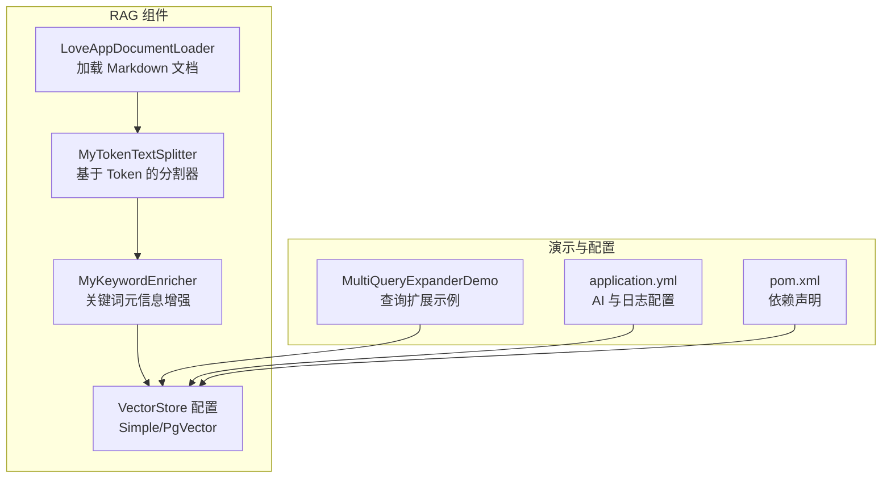
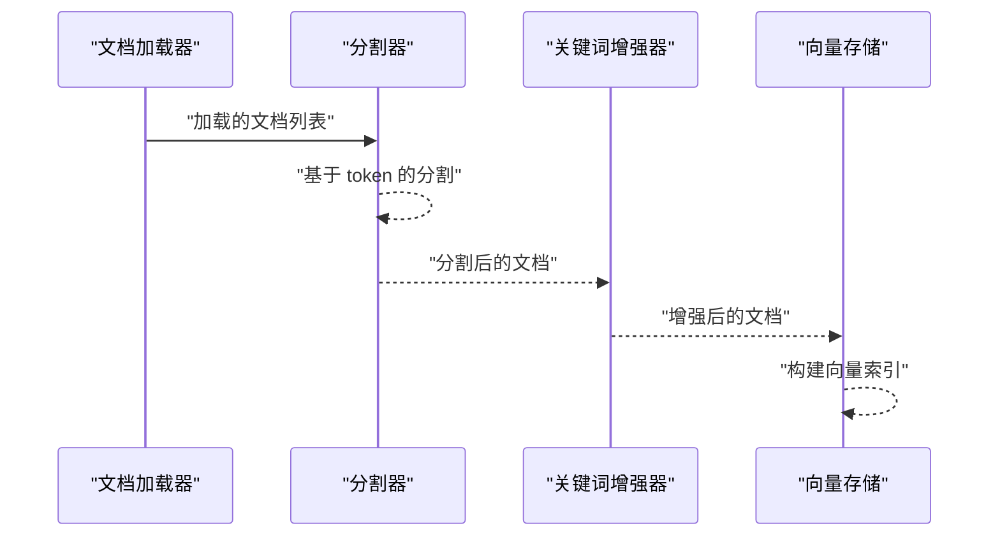
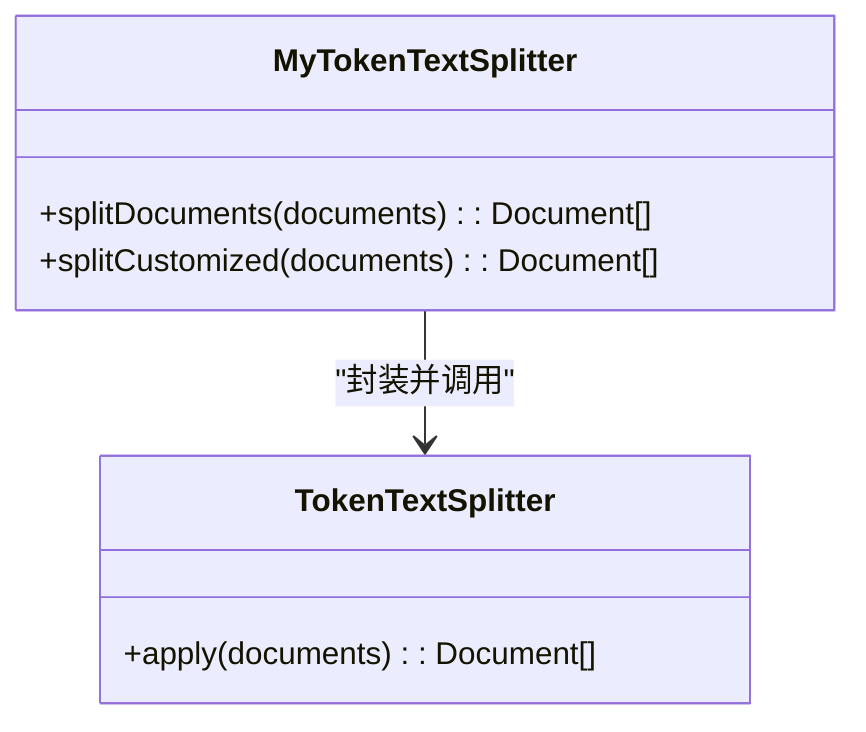
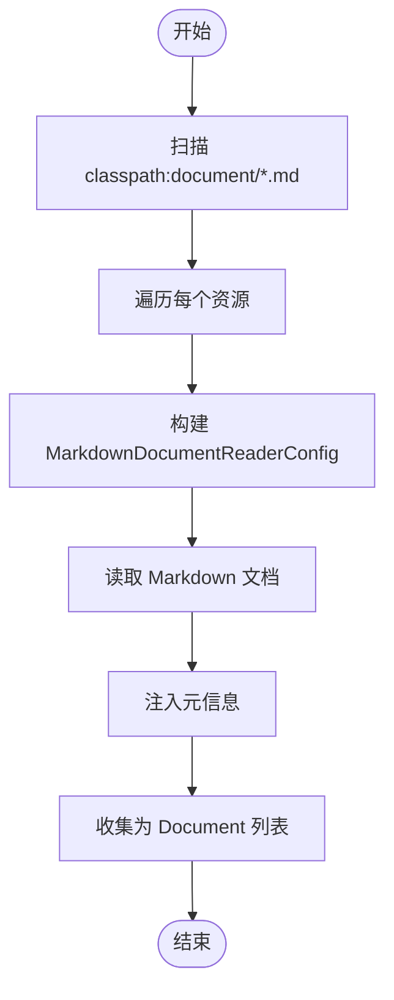
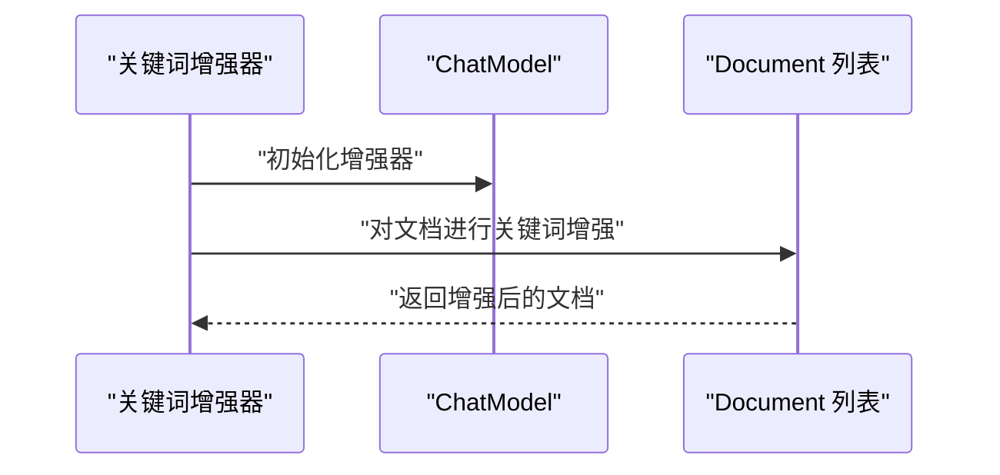
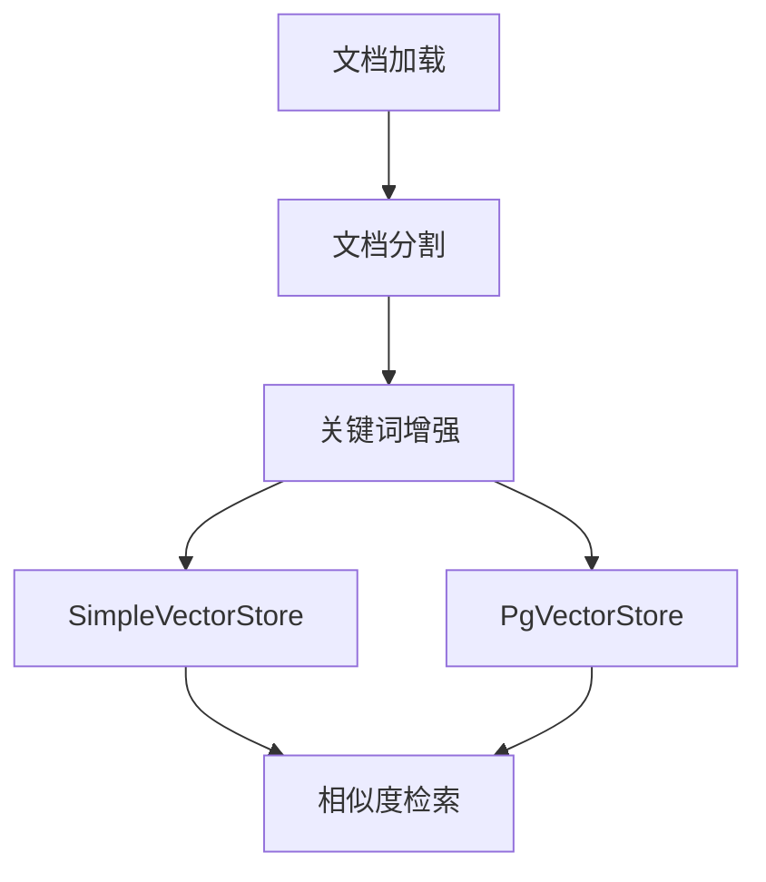
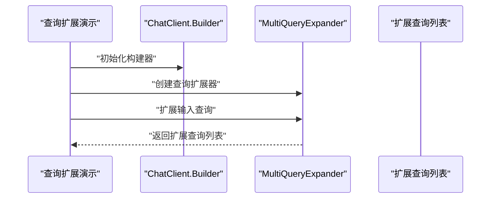
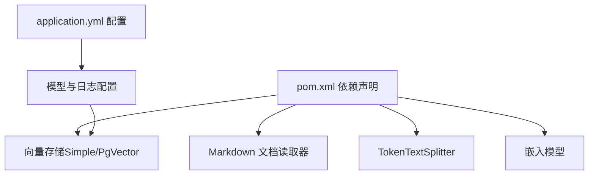

# 文档分割器

<cite>
**本文引用的文件**
- [MyTokenTextSplitter.java](file://src/main/java/com/yupi/yuaiagent/rag/MyTokenTextSplitter.java)
- [LoveAppDocumentLoader.java](file://src/main/java/com/yupi/yuaiagent/rag/LoveAppDocumentLoader.java)
- [MyKeywordEnricher.java](file://src/main/java/com/yupi/yuaiagent/rag/MyKeywordEnricher.java)
- [LoveAppVectorStoreConfig.java](file://src/main/java/com/yupi/yuaiagent/rag/LoveAppVectorStoreConfig.java)
- [PgVectorVectorStoreConfig.java](file://src/main/java/com/yupi/yuaiagent/rag/PgVectorVectorStoreConfig.java)
- [MultiQueryExpanderDemo.java](file://src/main/java/com/yupi/yuaiagent/demo/rag/MultiQueryExpanderDemo.java)
- [application.yml](file://src/main/resources/application.yml)
- [pom.xml](file://pom.xml)
- [LoveAppDocumentLoaderTest.java](file://src/test/java/com/yupi/yuaiagent/rag/LoveAppDocumentLoaderTest.java)
- [MultiQueryExpanderDemoTest.java](file://src/test/java/com/yupi/yuaiagent/demo/rag/MultiQueryExpanderDemoTest.java)
- [PgVectorVectorStoreConfigTest.java](file://src/test/java/com/yupi/yuaiagent/rag/PgVectorVectorStoreConfigTest.java)
</cite>

## 目录
1. [简介](#简介)
2. [项目结构](#项目结构)
3. [核心组件](#核心组件)
4. [架构总览](#架构总览)
5. [详细组件分析](#详细组件分析)
6. [依赖分析](#依赖分析)
7. [性能考虑](#性能考虑)
8. [故障排查指南](#故障排查指南)
9. [结论](#结论)
10. [附录](#附录)

## 简介
本文件围绕项目中的文档分割器展开，重点解析基于 token 的分割策略与实现，梳理 MyTokenTextSplitter 的设计与使用方式，并结合 RAG 系统的上下文说明其在信息完整性、嵌入效率与检索精度方面的价值。同时提供参数调优建议、效果评估方法与性能基准测试思路，帮助读者在实际工程中高效落地。

## 项目结构
本项目采用 Spring Boot 结构，RAG 相关能力集中在 rag 包内，包含文档加载、分割、关键词增强、向量存储配置等模块；demo 包含查询扩展示例；资源文件提供模型与日志配置。

**图表来源**
- [LoveAppDocumentLoader.java:1-56](file://src/main/java/com/yupi/yuaiagent/rag/LoveAppDocumentLoader.java#L1-L56)
- [MyTokenTextSplitter.java:1-23](file://src/main/java/com/yupi/yuaiagent/rag/MyTokenTextSplitter.java#L1-L23)
- [MyKeywordEnricher.java:1-25](file://src/main/java/com/yupi/yuaiagent/rag/MyKeywordEnricher.java#L1-L25)
- [LoveAppVectorStoreConfig.java:1-41](file://src/main/java/com/yupi/yuaiagent/rag/LoveAppVectorStoreConfig.java#L1-L41)
- [PgVectorVectorStoreConfig.java:1-28](file://src/main/java/com/yupi/yuaiagent/rag/PgVectorVectorStoreConfig.java#L1-L28)
- [MultiQueryExpanderDemo.java:1-32](file://src/main/java/com/yupi/yuaiagent/demo/rag/MultiQueryExpanderDemo.java#L1-L32)
- [application.yml:1-66](file://src/main/resources/application.yml#L1-L66)
- [pom.xml:70-101](file://pom.xml#L70-L101)

**章节来源**
- [LoveAppDocumentLoader.java:1-56](file://src/main/java/com/yupi/yuaiagent/rag/LoveAppDocumentLoader.java#L1-L56)
- [MyTokenTextSplitter.java:1-23](file://src/main/java/com/yupi/yuaiagent/rag/MyTokenTextSplitter.java#L1-L23)
- [MyKeywordEnricher.java:1-25](file://src/main/java/com/yupi/yuaiagent/rag/MyKeywordEnricher.java#L1-L25)
- [LoveAppVectorStoreConfig.java:1-41](file://src/main/java/com/yupi/yuaiagent/rag/LoveAppVectorStoreConfig.java#L1-L41)
- [PgVectorVectorStoreConfig.java:1-28](file://src/main/java/com/yupi/yuaiagent/rag/PgVectorVectorStoreConfig.java#L1-L28)
- [MultiQueryExpanderDemo.java:1-32](file://src/main/java/com/yupi/yuaiagent/demo/rag/MultiQueryExpanderDemo.java#L1-L32)
- [application.yml:1-66](file://src/main/resources/application.yml#L1-L66)
- [pom.xml:70-101](file://pom.xml#L70-L101)

## 核心组件
- 文档加载器：从 classpath:document/*.md 加载 Markdown 文档，设置元数据（如文件名、状态），并返回 Document 列表。
- 分割器：封装 Spring AI 的 TokenTextSplitter，默认构造与定制化构造，分别用于通用分割与按参数精细控制的分割。
- 关键词增强器：基于 ChatModel 对文档进行关键词元信息增强，提升检索质量。
- 向量存储配置：提供基于内存的 SimpleVectorStore 与可选的 PgVector 实现，完成文档入库与相似度检索。

**章节来源**
- [LoveAppDocumentLoader.java:28-54](file://src/main/java/com/yupi/yuaiagent/rag/LoveAppDocumentLoader.java#L28-L54)
- [MyTokenTextSplitter.java:14-22](file://src/main/java/com/yupi/yuaiagent/rag/MyTokenTextSplitter.java#L14-L22)
- [MyKeywordEnricher.java:20-23](file://src/main/java/com/yupi/yuaiagent/rag/MyKeywordEnricher.java#L20-L23)
- [LoveAppVectorStoreConfig.java:30-40](file://src/main/java/com/yupi/yuaiagent/rag/LoveAppVectorStoreConfig.java#L30-L40)
- [PgVectorVectorStoreConfig.java:25-28](file://src/main/java/com/yupi/yuaiagent/rag/PgVectorVectorStoreConfig.java#L25-L28)

## 架构总览
下图展示从文档加载到向量检索的整体流程，以及分割器在其中的位置与职责。

**图表来源**
- [LoveAppDocumentLoader.java:32-54](file://src/main/java/com/yupi/yuaiagent/rag/LoveAppDocumentLoader.java#L32-L54)
- [MyTokenTextSplitter.java:14-22](file://src/main/java/com/yupi/yuaiagent/rag/MyTokenTextSplitter.java#L14-L22)
- [MyKeywordEnricher.java:20-23](file://src/main/java/com/yupi/yuaiagent/rag/MyKeywordEnricher.java#L20-L23)
- [LoveAppVectorStoreConfig.java:30-40](file://src/main/java/com/yupi/yuaiagent/rag/LoveAppVectorStoreConfig.java#L30-L40)

## 详细组件分析

### MyTokenTextSplitter 组件分析
- 设计目标：提供两种分割策略，兼顾默认易用与定制化精细控制。
- 默认分割：通过无参构造创建 TokenTextSplitter，直接对文档列表进行分割。
- 定制化分割：通过带参构造传入 chunk 大小、重叠大小、最小片段长度、最大上下文长度与是否保留分隔符等参数，以满足不同场景需求。
- 返回结果：均以 apply 方法输出分割后的 Document 列表，供后续增强与入库。

**图表来源**
- [MyTokenTextSplitter.java:14-22](file://src/main/java/com/yupi/yuaiagent/rag/MyTokenTextSplitter.java#L14-L22)

**章节来源**
- [MyTokenTextSplitter.java:1-23](file://src/main/java/com/yupi/yuaiagent/rag/MyTokenTextSplitter.java#L1-L23)

### 文档加载器组件分析
- 资源定位：使用 ResourcePatternResolver 从 classpath:document/*.md 扫描并加载资源。
- 元数据注入：为每份文档附加额外元信息（如文件名、状态），便于后续过滤与检索。
- 输出格式：返回标准 Document 列表，供分割器与增强器处理。

**图表来源**
- [LoveAppDocumentLoader.java:32-54](file://src/main/java/com/yupi/yuaiagent/rag/LoveAppDocumentLoader.java#L32-L54)

**章节来源**
- [LoveAppDocumentLoader.java:1-56](file://src/main/java/com/yupi/yuaiagent/rag/LoveAppDocumentLoader.java#L1-L56)

### 关键词增强器组件分析
- 功能：基于 ChatModel 对文档进行关键词提取或增强，丰富检索信号。
- 参数：指定使用的 ChatModel 与增强强度（如关键词数量）。
- 流程：对输入文档列表执行增强后返回新列表，供向量存储添加。

**图表来源**
- [MyKeywordEnricher.java:20-23](file://src/main/java/com/yupi/yuaiagent/rag/MyKeywordEnricher.java#L20-L23)

**章节来源**
- [MyKeywordEnricher.java:1-25](file://src/main/java/com/yupi/yuaiagent/rag/MyKeywordEnricher.java#L1-L25)

### 向量存储配置分析
- 内存向量存储：通过 SimpleVectorStore 构建，适合开发与测试。
- 可选 PgVector：提供基于 JDBC 的 PgVector 实现，支持索引类型、距离度量与维度等配置。
- 工作流：加载文档 → 分割 → 增强 → 添加到向量存储 → 相似度检索。

**图表来源**
- [LoveAppVectorStoreConfig.java:30-40](file://src/main/java/com/yupi/yuaiagent/rag/LoveAppVectorStoreConfig.java#L30-L40)
- [PgVectorVectorStoreConfig.java:25-28](file://src/main/java/com/yupi/yuaiagent/rag/PgVectorVectorStoreConfig.java#L25-L28)

**章节来源**
- [LoveAppVectorStoreConfig.java:1-41](file://src/main/java/com/yupi/yuaiagent/rag/LoveAppVectorStoreConfig.java#L1-L41)
- [PgVectorVectorStoreConfig.java:1-28](file://src/main/java/com/yupi/yuaiagent/rag/PgVectorVectorStoreConfig.java#L1-L28)

### 查询扩展演示（概念性说明）
- 作用：通过多条查询扩展提升召回多样性，辅助 RAG 检索。
- 流程：构建 ChatClient → 创建 MultiQueryExpander → 扩展原始查询 → 返回扩展后的查询集合。

**图表来源**
- [MultiQueryExpanderDemo.java:23-30](file://src/main/java/com/yupi/yuaiagent/demo/rag/MultiQueryExpanderDemo.java#L23-L30)

**章节来源**
- [MultiQueryExpanderDemo.java:1-32](file://src/main/java/com/yupi/yuaiagent/demo/rag/MultiQueryExpanderDemo.java#L1-L32)

## 依赖分析
- Spring AI 生态：使用 Markdown 文档读取器、TokenTextSplitter、向量存储与嵌入模型等组件。
- 数据库与向量存储：可选 PgVector，需 JDBC 与 PostgreSQL 驱动支持。
- 日志与模型配置：通过 application.yml 指定 DashScope API Key、模型名称与日志级别。

**图表来源**
- [pom.xml:70-101](file://pom.xml#L70-L101)
- [application.yml:11-21](file://src/main/resources/application.yml#L11-L21)

**章节来源**
- [pom.xml:70-101](file://pom.xml#L70-L101)
- [application.yml:1-66](file://src/main/resources/application.yml#L1-L66)

## 性能考虑
- 分割粒度与上下文：较小的 chunk 有助于提升检索精度，但会增加向量数量与嵌入成本；较大的 chunk 降低开销但可能稀释语义焦点。应结合下游嵌入维度与检索阈值权衡。
- 重叠策略：适度重叠可缓解跨片段语义断裂，但会增加重复信息与存储/计算成本。建议从 10%~20% 的 chunk 长度起步。
- 元信息增强：关键词增强可显著提升检索召回，但会引入额外推理开销。可根据业务成本与召回要求调整增强强度。
- 向量存储规模：内存向量存储适合小规模测试；生产环境建议 PgVector 并合理设置索引类型、距离度量与批量入库大小。
- 日志与可观测性：开启 DEBUG 级别日志可辅助定位分割与检索问题，但需注意对性能的影响。

## 故障排查指南
- 文档加载失败：检查 classpath:document/*.md 是否存在、权限是否正确，以及资源路径匹配逻辑。
- 分割异常：确认输入文档编码与内容格式，必要时先进行预清洗；若定制化参数导致异常，回退至默认参数验证。
- 增强失败：检查 ChatModel 配置与可用性，确保 API Key 有效且网络可达。
- 向量存储问题：验证嵌入模型维度与向量存储维度一致；确认数据库连接与索引配置正确。
- 单元测试参考：利用现有测试用例验证加载、扩展与向量检索的基本链路。

**章节来源**
- [LoveAppDocumentLoaderTest.java:15-18](file://src/test/java/com/yupi/yuaiagent/rag/LoveAppDocumentLoaderTest.java#L15-L18)
- [MultiQueryExpanderDemoTest.java:19-23](file://src/test/java/com/yupi/yuaiagent/demo/rag/MultiQueryExpanderDemoTest.java#L19-L23)
- [PgVectorVectorStoreConfigTest.java:21-31](file://src/test/java/com/yupi/yuaiagent/rag/PgVectorVectorStoreConfigTest.java#L21-L31)

## 结论
MyTokenTextSplitter 在本项目中承担“基于 token 的文档切分”职责，既提供默认易用的分割方案，也支持定制化参数以适配不同业务场景。配合文档加载、关键词增强与向量存储，形成从数据准备到检索增强的完整链路。通过合理的参数调优与评估方法，可在信息完整性、嵌入效率与检索精度之间取得平衡。

## 附录

### 分割参数调优指南
- chunk 大小：从 200~500 tokens 起步，依据嵌入模型上下文长度与检索效果迭代调整。
- 重叠比例：建议 10%~20%，优先保证语义连贯性；对长段落可适当提高。
- 最小片段长度：避免过短片段导致噪声，通常设置为几十 tokens。
- 上下文上限：根据模型最大上下文长度设定，防止溢出。
- 保留分隔符：在需要保持结构信息时启用，便于后续后处理。

### 分割效果评估方法
- 人工抽样评估：对关键问答场景，对比不同参数下的检索命中率与相关段落质量。
- 语义一致性指标：统计相邻 chunk 的主题一致性与跨 chunk 语义衔接情况。
- 检索指标：计算 Recall@K、NDCG 等，结合业务指标（如点击率、满意度）综合评估。
- 成本与速度：记录嵌入耗时、向量数量与存储占用，评估性价比。

### 性能基准测试建议
- 数据集：使用真实业务文档构建基准集，覆盖多主题与多长度分布。
- 场景覆盖：包含短句、长段落、技术文档、FAQ 等典型场景。
- 指标体系：吞吐量（QPS）、延迟（P95/P99）、向量存储大小、检索准确率。
- 对比实验：固定其他环节，仅改变分割参数，观察指标变化趋势。