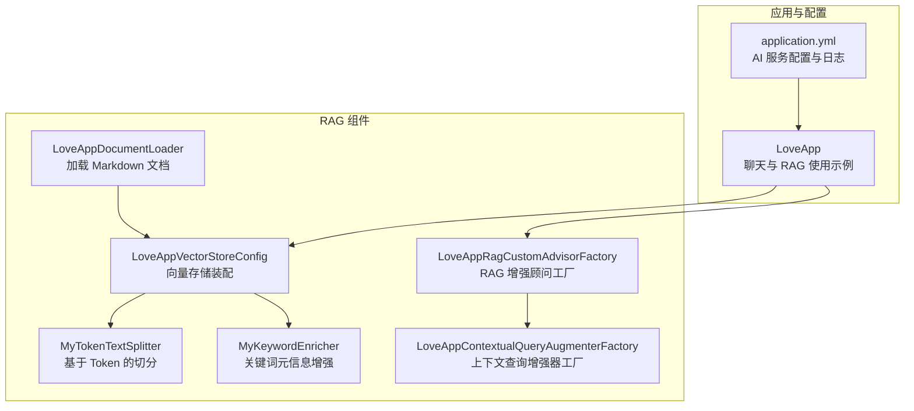
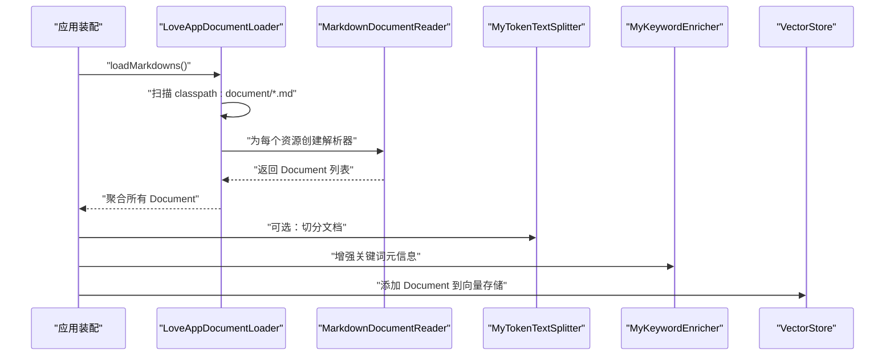
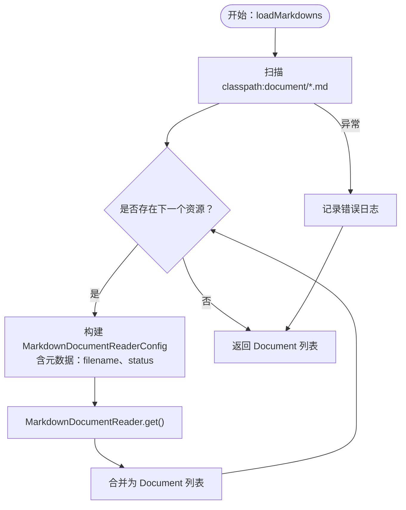
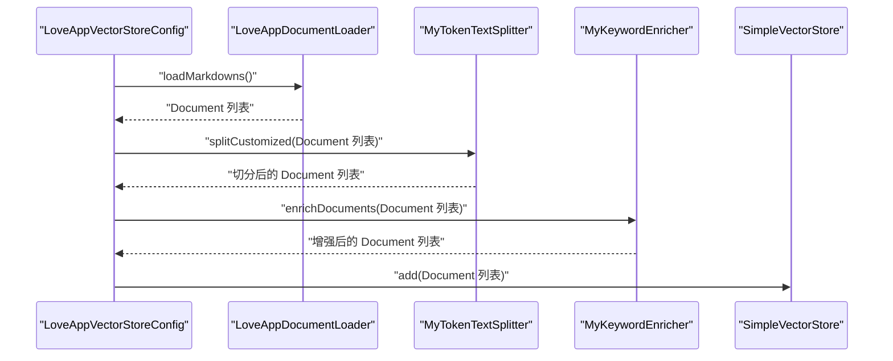
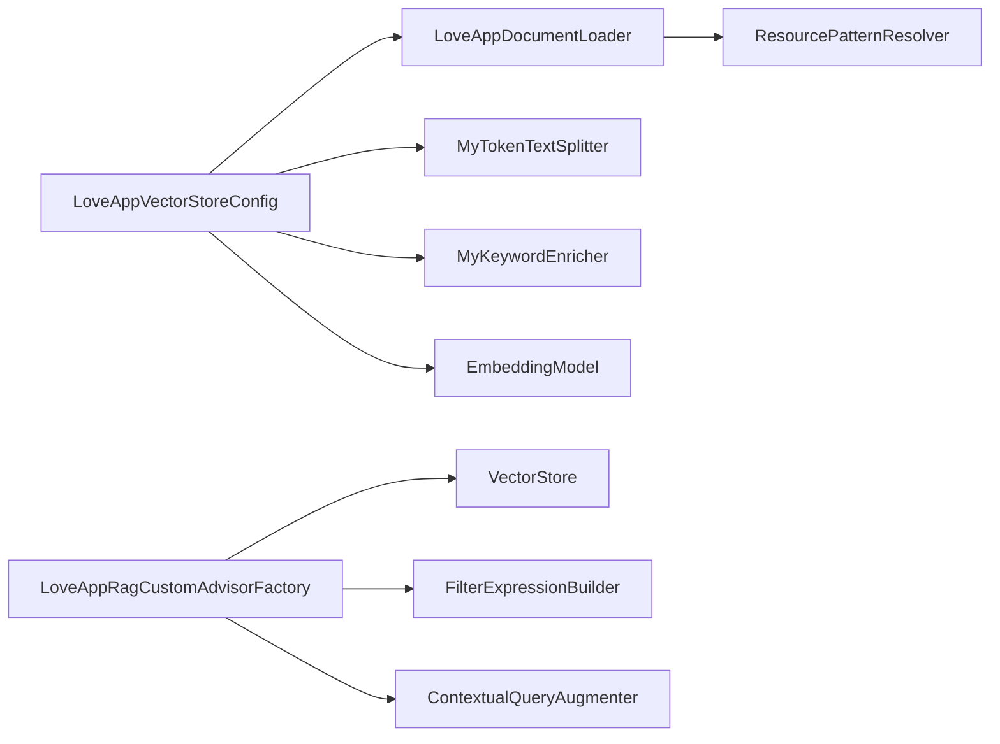

# 文档加载器

<cite>
**本文引用的文件**
- [LoveAppDocumentLoader.java](file://src/main/java/com/yupi/yuaiagent/rag/LoveAppDocumentLoader.java)
- [LoveAppVectorStoreConfig.java](file://src/main/java/com/yupi/yuaiagent/rag/LoveAppVectorStoreConfig.java)
- [MyTokenTextSplitter.java](file://src/main/java/com/yupi/yuaiagent/rag/MyTokenTextSplitter.java)
- [MyKeywordEnricher.java](file://src/main/java/com/yupi/yuaiagent/rag/MyKeywordEnricher.java)
- [LoveAppRagCustomAdvisorFactory.java](file://src/main/java/com/yupi/yuaiagent/rag/LoveAppRagCustomAdvisorFactory.java)
- [LoveAppContextualQueryAugmenterFactory.java](file://src/main/java/com/yupi/yuaiagent/rag/LoveAppContextualQueryAugmenterFactory.java)
- [application.yml](file://src/main/resources/application.yml)
- [LoveAppDocumentLoaderTest.java](file://src/test/java/com/yupi/yuaiagent/rag/LoveAppDocumentLoaderTest.java)
- [LoveApp.java](file://src/main/java/com/yupi/yuaiagent/app/LoveApp.java)
</cite>

## 目录
1. [简介](#简介)
2. [项目结构](#项目结构)
3. [核心组件](#核心组件)
4. [架构总览](#架构总览)
5. [详细组件分析](#详细组件分析)
6. [依赖分析](#依赖分析)
7. [性能考虑](#性能考虑)
8. [故障排查指南](#故障排查指南)
9. [结论](#结论)
10. [附录](#附录)

## 简介
本文件面向“文档加载器”的深度技术文档，聚焦 LoveAppDocumentLoader 的设计架构与实现细节，系统阐述以下主题：
- Markdown 文档的加载机制：文件路径配置、文档解析流程、元数据提取策略
- 扩展接口与自定义实现：如何接入多种文档格式
- 文档预处理流程：文本清洗、格式标准化、内容过滤
- 性能优化策略：批量加载、缓存机制、并发处理
- 错误处理、日志记录与调试技巧

该加载器位于 RAG（检索增强生成）流水线中，负责从资源目录读取 Markdown 文档，构建 Spring AI Document 对象，并为后续的切分、嵌入、向量存储与检索增强提供基础。

## 项目结构
与文档加载器直接相关的模块与文件如下：
- RAG 组件：LoveAppDocumentLoader、LoveAppVectorStoreConfig、MyTokenTextSplitter、MyKeywordEnricher、LoveAppRagCustomAdvisorFactory、LoveAppContextualQueryAugmenterFactory
- 应用配置：application.yml（AI 服务密钥、日志级别等）
- 应用入口：LoveApp（演示如何在聊天流程中使用向量存储与 RAG 增强）

图表来源
- [LoveAppDocumentLoader.java:1-56](file://src/main/java/com/yupi/yuaiagent/rag/LoveAppDocumentLoader.java#L1-L56)
- [LoveAppVectorStoreConfig.java:1-42](file://src/main/java/com/yupi/yuaiagent/rag/LoveAppVectorStoreConfig.java#L1-L42)
- [MyTokenTextSplitter.java:1-24](file://src/main/java/com/yupi/yuaiagent/rag/MyTokenTextSplitter.java#L1-L24)
- [MyKeywordEnricher.java:1-25](file://src/main/java/com/yupi/yuaiagent/rag/MyKeywordEnricher.java#L1-L25)
- [LoveAppRagCustomAdvisorFactory.java:1-41](file://src/main/java/com/yupi/yuaiagent/rag/LoveAppRagCustomAdvisorFactory.java#L1-L41)
- [LoveAppContextualQueryAugmenterFactory.java:1-23](file://src/main/java/com/yupi/yuaiagent/rag/LoveAppContextualQueryAugmenterFactory.java#L1-L23)
- [application.yml:1-66](file://src/main/resources/application.yml#L1-L66)
- [LoveApp.java:1-227](file://src/main/java/com/yupi/yuaiagent/app/LoveApp.java#L1-L227)

章节来源
- [LoveAppDocumentLoader.java:1-56](file://src/main/java/com/yupi/yuaiagent/rag/LoveAppDocumentLoader.java#L1-L56)
- [LoveAppVectorStoreConfig.java:1-42](file://src/main/java/com/yupi/yuaiagent/rag/LoveAppVectorStoreConfig.java#L1-L42)
- [application.yml:1-66](file://src/main/resources/application.yml#L1-L66)

## 核心组件
- LoveAppDocumentLoader：负责扫描 classpath:document 下的 Markdown 文件，逐个解析为 Document 列表，并注入额外元数据（如文件名、状态）。
- LoveAppVectorStoreConfig：装配向量存储 Bean，串联加载、切分、增强与入库流程。
- MyTokenTextSplitter：封装 TokenTextSplitter，提供默认与定制化的切分策略。
- MyKeywordEnricher：基于 ChatModel 为文档自动补充关键词元信息，提升检索质量。
- LoveAppRagCustomAdvisorFactory：基于向量存储与过滤表达式构建 RAG 检索增强顾问。
- LoveAppContextualQueryAugmenterFactory：提供上下文为空时的兜底提示模板，确保问答一致性。

章节来源
- [LoveAppDocumentLoader.java:1-56](file://src/main/java/com/yupi/yuaiagent/rag/LoveAppDocumentLoader.java#L1-L56)
- [LoveAppVectorStoreConfig.java:1-42](file://src/main/java/com/yupi/yuaiagent/rag/LoveAppVectorStoreConfig.java#L1-L42)
- [MyTokenTextSplitter.java:1-24](file://src/main/java/com/yupi/yuaiagent/rag/MyTokenTextSplitter.java#L1-L24)
- [MyKeywordEnricher.java:1-25](file://src/main/java/com/yupi/yuaiagent/rag/MyKeywordEnricher.java#L1-L25)
- [LoveAppRagCustomAdvisorFactory.java:1-41](file://src/main/java/com/yupi/yuaiagent/rag/LoveAppRagCustomAdvisorFactory.java#L1-L41)
- [LoveAppContextualQueryAugmenterFactory.java:1-23](file://src/main/java/com/yupi/yuaiagent/rag/LoveAppContextualQueryAugmenterFactory.java#L1-L23)

## 架构总览
文档加载器是 RAG 管道的输入端，其职责是将本地 Markdown 文档转换为结构化 Document，供后续切分、嵌入与检索使用。整体流程如下：

图表来源
- [LoveAppDocumentLoader.java:32-54](file://src/main/java/com/yupi/yuaiagent/rag/LoveAppDocumentLoader.java#L32-L54)
- [LoveAppVectorStoreConfig.java:29-40](file://src/main/java/com/yupi/yuaiagent/rag/LoveAppVectorStoreConfig.java#L29-L40)
- [MyTokenTextSplitter.java:14-22](file://src/main/java/com/yupi/yuaiagent/rag/MyTokenTextSplitter.java#L14-L22)
- [MyKeywordEnricher.java:20-23](file://src/main/java/com/yupi/yuaiagent/rag/MyKeywordEnricher.java#L20-L23)

## 详细组件分析

### LoveAppDocumentLoader 设计与实现
- 文件路径配置
  - 使用 ResourcePatternResolver 以通配符扫描 classpath:document/*.md，确保加载目录下的所有 Markdown 文件。
- 解析流程
  - 对每个 Resource，构造 MarkdownDocumentReaderConfig，启用水平分割规则创建新文档、禁用代码块与引用块，避免噪声干扰。
  - 通过 MarkdownDocumentReader.get() 获取 Document 列表并累加。
- 元数据提取
  - 从文件名中提取状态字段（基于文件名长度截取），并附加到 Document 的元数据中，便于后续检索过滤。
- 错误处理
  - 捕获 IO 异常并记录错误日志，保证加载过程的健壮性。

图表来源
- [LoveAppDocumentLoader.java:32-54](file://src/main/java/com/yupi/yuaiagent/rag/LoveAppDocumentLoader.java#L32-L54)

章节来源
- [LoveAppDocumentLoader.java:28-54](file://src/main/java/com/yupi/yuaiagent/rag/LoveAppDocumentLoader.java#L28-L54)

### LoveAppVectorStoreConfig：向量存储装配与预处理链路
- 负责装配 SimpleVectorStore Bean，并在初始化阶段执行完整的预处理链路：
  - 加载文档：调用 LoveAppDocumentLoader.loadMarkdowns()
  - 可选切分：调用 MyTokenTextSplitter.splitCustomized()
  - 关键词增强：调用 MyKeywordEnricher.enrichDocuments()
  - 写入向量存储：simpleVectorStore.add()

图表来源
- [LoveAppVectorStoreConfig.java:29-40](file://src/main/java/com/yupi/yuaiagent/rag/LoveAppVectorStoreConfig.java#L29-L40)
- [MyTokenTextSplitter.java:19-22](file://src/main/java/com/yupi/yuaiagent/rag/MyTokenTextSplitter.java#L19-L22)
- [MyKeywordEnricher.java:20-23](file://src/main/java/com/yupi/yuaiagent/rag/MyKeywordEnricher.java#L20-L23)

章节来源
- [LoveAppVectorStoreConfig.java:1-42](file://src/main/java/com/yupi/yuaiagent/rag/LoveAppVectorStoreConfig.java#L1-L42)

### MyTokenTextSplitter：基于 Token 的文档切分
- 默认切分：使用 TokenTextSplitter 的默认参数，适用于通用场景。
- 定制化切分：提供带参数的构造方式，允许调整切分窗口大小、重叠长度、最大片段数等，满足不同模型与业务需求。

章节来源
- [MyTokenTextSplitter.java:1-24](file://src/main/java/com/yupi/yuaiagent/rag/MyTokenTextSplitter.java#L1-L24)

### MyKeywordEnricher：关键词元信息增强
- 基于 ChatModel 为每篇文档自动抽取关键词，并将其作为元信息附加到 Document 中，提升检索阶段的相关性与准确性。

章节来源
- [MyKeywordEnricher.java:1-25](file://src/main/java/com/yupi/yuaiagent/rag/MyKeywordEnricher.java#L1-L25)

### LoveAppRagCustomAdvisorFactory：RAG 检索增强顾问
- 通过 FilterExpressionBuilder 构建过滤表达式（例如按 status 过滤），结合 VectorStoreDocumentRetriever 设置相似度阈值与 topK，最终构建 RetrievalAugmentationAdvisor。
- 可与上下文查询增强器配合，确保在无上下文时输出一致的兜底提示。

章节来源
- [LoveAppRagCustomAdvisorFactory.java:1-41](file://src/main/java/com/yupi/yuaiagent/rag/LoveAppRagCustomAdvisorFactory.java#L1-L41)
- [LoveAppContextualQueryAugmenterFactory.java:1-23](file://src/main/java/com/yupi/yuaiagent/rag/LoveAppContextualQueryAugmenterFactory.java#L1-L23)

### LoveApp：在聊天流程中使用向量存储与 RAG 增强
- 展示了如何在 ChatClient 中集成 QuestionAnswerAdvisor、自定义 RAG 增强顾问以及上下文查询增强器，实现基于知识库的问答增强。

章节来源
- [LoveApp.java:124-172](file://src/main/java/com/yupi/yuaiagent/app/LoveApp.java#L124-L172)

## 依赖分析
- 外部依赖
  - Spring AI：Markdown 解析器、Document 类型、向量存储与检索器、文本切分器、关键词元信息增强器等。
  - 日志框架：SLF4J（通过 @Slf4j 注解）。
- 内部依赖
  - LoveAppDocumentLoader 依赖 ResourcePatternResolver 实现资源扫描。
  - LoveAppVectorStoreConfig 依赖 LoveAppDocumentLoader、MyTokenTextSplitter、MyKeywordEnricher 与 EmbeddingModel。
  - LoveAppRagCustomAdvisorFactory 依赖 VectorStore、Filter 表达式与上下文查询增强器。

图表来源
- [LoveAppDocumentLoader.java:22-26](file://src/main/java/com/yupi/yuaiagent/rag/LoveAppDocumentLoader.java#L22-L26)
- [LoveAppVectorStoreConfig.java:20-28](file://src/main/java/com/yupi/yuaiagent/rag/LoveAppVectorStoreConfig.java#L20-L28)
- [LoveAppRagCustomAdvisorFactory.java:23-39](file://src/main/java/com/yupi/yuaiagent/rag/LoveAppRagCustomAdvisorFactory.java#L23-L39)

章节来源
- [LoveAppDocumentLoader.java:1-56](file://src/main/java/com/yupi/yuaiagent/rag/LoveAppDocumentLoader.java#L1-L56)
- [LoveAppVectorStoreConfig.java:1-42](file://src/main/java/com/yupi/yuaiagent/rag/LoveAppVectorStoreConfig.java#L1-L42)
- [LoveAppRagCustomAdvisorFactory.java:1-41](file://src/main/java/com/yupi/yuaiagent/rag/LoveAppRagCustomAdvisorFactory.java#L1-L41)

## 性能考虑
- 批量加载
  - 当前实现逐个资源解析并合并，适合小规模文档。对于大规模文档，可在加载阶段引入批处理策略，减少重复初始化开销。
- 缓存机制
  - 可对解析后的 Document 或嵌入结果进行缓存，避免重复计算。结合文件修改时间戳或版本号实现失效策略。
- 并发处理
  - 在资源解析与嵌入阶段可采用并行流或线程池，但需注意向量存储写入的并发安全与事务控制。
- 切分与过滤
  - 合理设置 TokenTextSplitter 参数，平衡上下文长度与碎片数量；在加载阶段剔除不必要内容（如代码块、引用块）可降低后续处理成本。
- 向量存储写入
  - 分批写入向量存储，控制批次大小与超时时间，避免单次写入过大导致阻塞。

## 故障排查指南
- 文档未被加载
  - 检查 classpath:document 目录是否存在且包含 .md 文件；确认 application.yml 中的日志级别是否足够详细（例如开启 Spring AI 的 DEBUG 级别）。
- 元数据缺失
  - 确认文件名格式符合预期（用于截取状态字段），并在 MarkdownDocumentReaderConfig 中正确注入元数据。
- 解析异常
  - 捕获的 IO 异常会记录错误日志，检查日志输出定位具体资源与错误原因。
- RAG 查询无结果
  - 检查过滤表达式（如 status）是否与文档元数据一致；调整相似度阈值与 topK 参数；确认向量存储中已成功写入文档。

章节来源
- [application.yml:64-66](file://src/main/resources/application.yml#L64-L66)
- [LoveAppDocumentLoader.java:50-52](file://src/main/java/com/yupi/yuaiagent/rag/LoveAppDocumentLoader.java#L50-L52)

## 结论
LoveAppDocumentLoader 以简洁而稳健的方式实现了 Markdown 文档的加载与元数据注入，配合切分、增强与向量存储，构成了完整的 RAG 输入管线。通过合理配置与扩展（如多格式支持、缓存与并发），可进一步提升性能与可维护性。

## 附录

### 扩展接口与自定义实现（多格式支持）
- 接口思路
  - 定义统一的 DocumentLoader 接口，抽象出 load() 方法，分别实现 Markdown、PDF、HTML 等不同格式的加载器。
  - 在装配阶段根据配置选择对应加载器，或按文件类型动态路由。
- 元数据策略
  - 为每种格式定义标准的元数据键（如 source_type、author、publish_date），并与检索过滤表达式保持一致。
- 预处理流水线
  - 将切分、清洗、标准化与关键词增强作为可插拔的 Transformer，支持按需组合。

### 单元测试参考
- LoveAppDocumentLoaderTest 展示了如何在测试环境中注入并调用加载器，验证加载流程的基本可用性。

章节来源
- [LoveAppDocumentLoaderTest.java:1-19](file://src/test/java/com/yupi/yuaiagent/rag/LoveAppDocumentLoaderTest.java#L1-L19)