# 查询重写器

<cite>
**本文档引用的文件**
- [QueryRewriter.java](file://src/main/java/com/yupi/yuaiagent/rag/QueryRewriter.java)
- [MultiQueryExpanderDemo.java](file://src/main/java/com/yupi/yuaiagent/demo/rag/MultiQueryExpanderDemo.java)
- [LoveAppContextualQueryAugmenterFactory.java](file://src/main/java/com/yupi/yuaiagent/rag/LoveAppContextualQueryAugmenterFactory.java)
- [MyKeywordEnricher.java](file://src/main/java/com/yupi/yuaiagent/rag/MyKeywordEnricher.java)
- [LoveAppRagCloudAdvisorConfig.java](file://src/main/java/com/yupi/yuaiagent/rag/LoveAppRagCloudAdvisorConfig.java)
- [LoveAppRagCustomAdvisorFactory.java](file://src/main/java/com/yupi/yuaiagent/rag/LoveAppRagCustomAdvisorFactory.java)
- [LoveApp.java](file://src/main/java/com/yupi/yuaiagent/app/LoveApp.java)
- [application.yml](file://src/main/resources/application.yml)
- [YuAiAgentApplication.java](file://src/main/java/com/yupi/yuaiagent/YuAiAgentApplication.java)
- [MultiQueryExpanderDemoTest.java](file://src/test/java/com/yupi/yuaiagent/demo/rag/MultiQueryExpanderDemoTest.java)
</cite>

## 目录
1. [简介](#简介)
2. [项目结构](#项目结构)
3. [核心组件](#核心组件)
4. [架构概览](#架构概览)
5. [详细组件分析](#详细组件分析)
6. [依赖分析](#依赖分析)
7. [性能考虑](#性能考虑)
8. [故障排除指南](#故障排除指南)
9. [结论](#结论)
10. [附录](#附录)

## 简介

查询重写器是RAG（检索增强生成）系统中的关键组件，负责在检索前对用户查询进行智能重写和优化。该组件通过自然语言理解和上下文感知技术，将原始查询转换为更精确、更有针对性的检索表达式，从而显著提升检索精度和整体系统性能。

在本项目中，查询重写器基于Spring AI框架的`RewriteQueryTransformer`实现，集成了阿里云DashScope大模型服务，为恋爱咨询场景提供了专业的查询优化能力。

## 项目结构

该项目采用标准的Spring Boot项目结构，RAG相关功能集中在`src/main/java/com/yupi/yuaiagent/rag`包中：

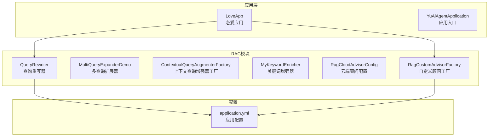

**图表来源**
- [QueryRewriter.java:1-40](file://src/main/java/com/yupi/yuaiagent/rag/QueryRewriter.java#L1-L40)
- [LoveApp.java:1-227](file://src/main/java/com/yupi/yuaiagent/app/LoveApp.java#L1-L227)
- [application.yml:1-66](file://src/main/resources/application.yml#L1-L66)

**章节来源**
- [YuAiAgentApplication.java:1-18](file://src/main/java/com/yupi/yuaiagent/YuAiAgentApplication.java#L1-L18)
- [application.yml:1-66](file://src/main/resources/application.yml#L1-L66)

## 核心组件

### 查询重写器架构

查询重写器采用简洁而高效的架构设计，主要包含以下核心组件：

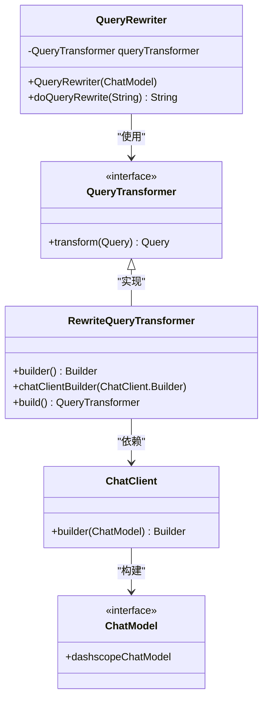

**图表来源**
- [QueryRewriter.java:14-38](file://src/main/java/com/yupi/yuaiagent/rag/QueryRewriter.java#L14-L38)

### 多查询扩展器

多查询扩展器用于生成多个相关查询变体，增强检索覆盖范围：

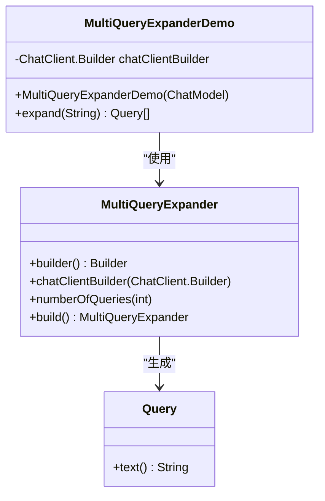

**图表来源**
- [MultiQueryExpanderDemo.java:15-31](file://src/main/java/com/yupi/yuaiagent/demo/rag/MultiQueryExpanderDemo.java#L15-L31)

**章节来源**
- [QueryRewriter.java:10-38](file://src/main/java/com/yupi/yuaiagent/rag/QueryRewriter.java#L10-L38)
- [MultiQueryExpanderDemo.java:11-31](file://src/main/java/com/yupi/yuaiagent/demo/rag/MultiQueryExpanderDemo.java#L11-L31)

## 架构概览

查询重写器在整个RAG系统中的位置和交互关系如下：

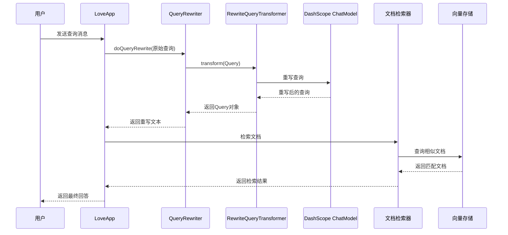

**图表来源**
- [LoveApp.java:145-172](file://src/main/java/com/yupi/yuaiagent/app/LoveApp.java#L145-L172)
- [QueryRewriter.java:32-38](file://src/main/java/com/yupi/yuaiagent/rag/QueryRewriter.java#L32-L38)

## 详细组件分析

### 查询重写器实现

查询重写器的核心实现基于Spring AI的`RewriteQueryTransformer`，通过以下步骤实现查询优化：

#### 初始化流程

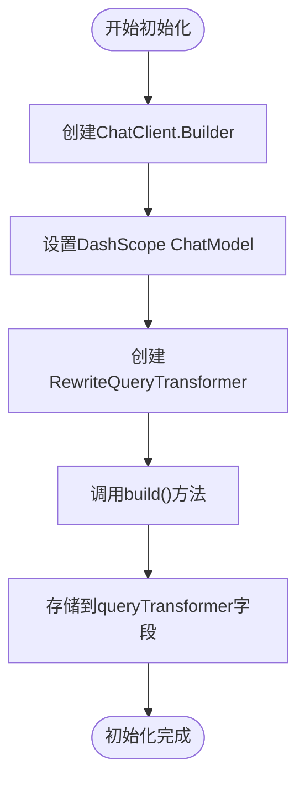

**图表来源**
- [QueryRewriter.java:18-24](file://src/main/java/com/yupi/yuaiagent/rag/QueryRewriter.java#L18-L24)

#### 查询重写流程

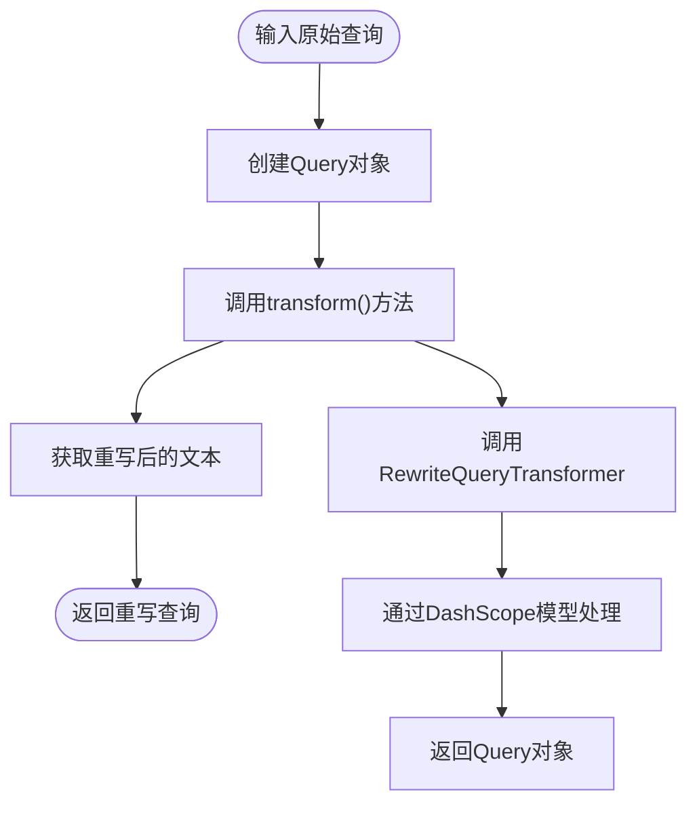

**图表来源**
- [QueryRewriter.java:32-38](file://src/main/java/com/yupi/yuaiagent/rag/QueryRewriter.java#L32-L38)

**章节来源**
- [QueryRewriter.java:18-38](file://src/main/java/com/yupi/yuaiagent/rag/QueryRewriter.java#L18-L38)

### 上下文查询增强器

上下文查询增强器用于根据对话历史和上下文信息优化查询：

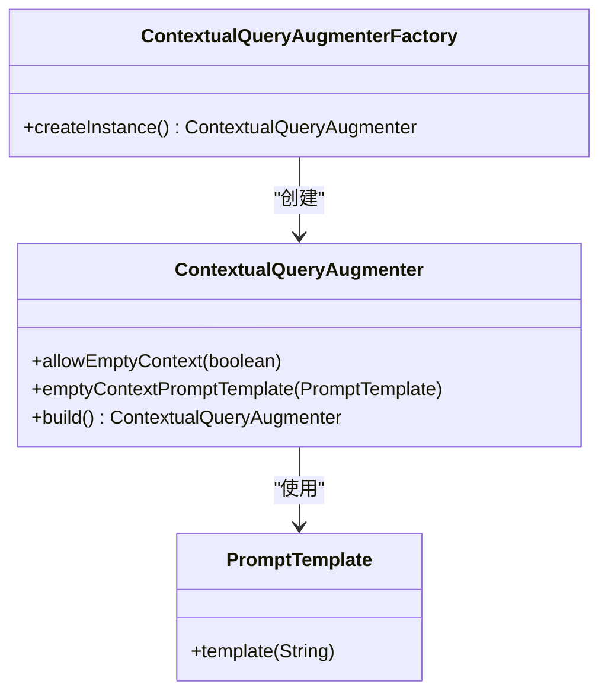

**图表来源**
- [LoveAppContextualQueryAugmenterFactory.java:11-21](file://src/main/java/com/yupi/yuaiagent/rag/LoveAppContextualQueryAugmenterFactory.java#L11-L21)

**章节来源**
- [LoveAppContextualQueryAugmenterFactory.java:6-22](file://src/main/java/com/yupi/yuaiagent/rag/LoveAppContextualQueryAugmenterFactory.java#L6-L22)

### 关键词增强器

关键词增强器为文档补充元信息，提升检索质量：

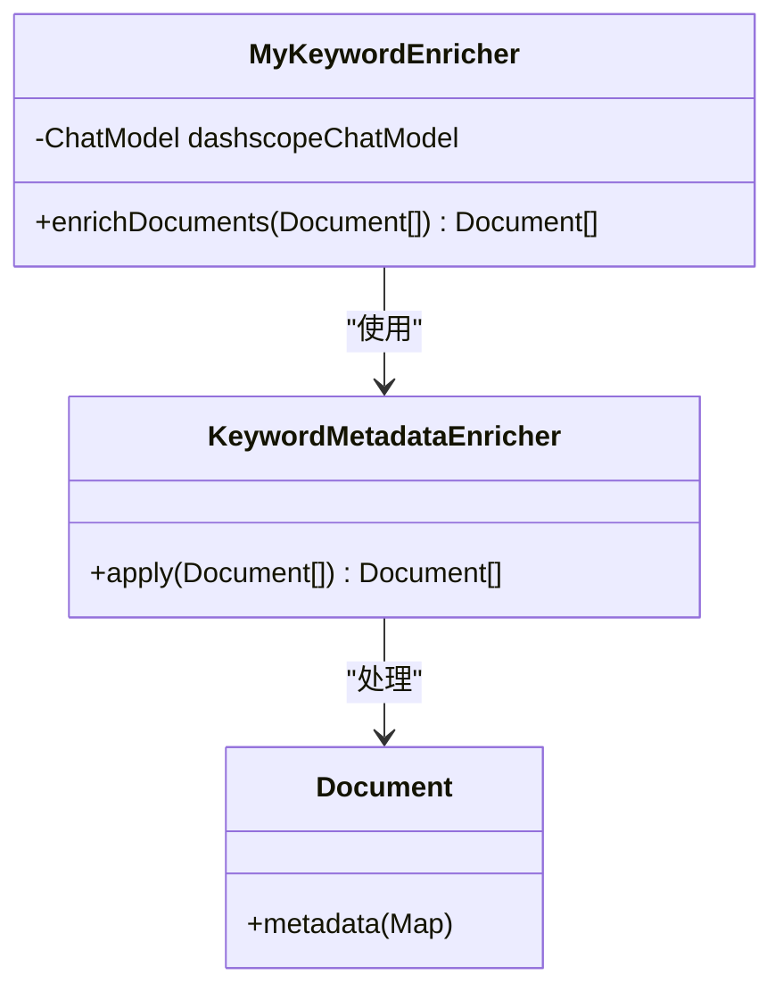

**图表来源**
- [MyKeywordEnricher.java:20-23](file://src/main/java/com/yupi/yuaiagent/rag/MyKeywordEnricher.java#L20-L23)

**章节来源**
- [MyKeywordEnricher.java:11-24](file://src/main/java/com/yupi/yuaiagent/rag/MyKeywordEnricher.java#L11-L24)

### RAG顾问配置

RAG顾问配置管理整个检索增强流程：

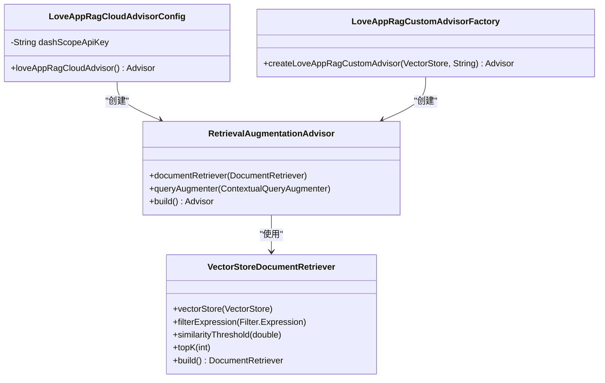

**图表来源**
- [LoveAppRagCustomAdvisorFactory.java:23-39](file://src/main/java/com/yupi/yuaiagent/rag/LoveAppRagCustomAdvisorFactory.java#L23-L39)

**章节来源**
- [LoveAppRagCloudAdvisorConfig.java:14-38](file://src/main/java/com/yupi/yuaiagent/rag/LoveAppRagCloudAdvisorConfig.java#L14-L38)
- [LoveAppRagCustomAdvisorFactory.java:11-40](file://src/main/java/com/yupi/yuaiagent/rag/LoveAppRagCustomAdvisorFactory.java#L11-L40)

## 依赖分析

### 外部依赖关系

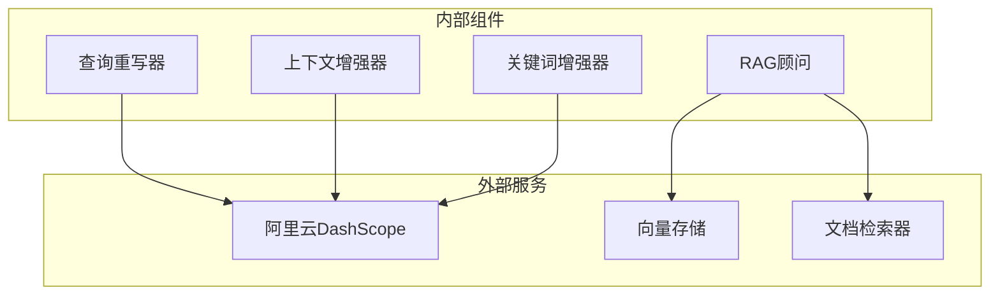

**图表来源**
- [QueryRewriter.java:3,18:3-18](file://src/main/java/com/yupi/yuaiagent/rag/QueryRewriter.java#L3-L18)
- [application.yml:11-21](file://src/main/resources/application.yml#L11-L21)

### 内部组件耦合

查询重写器与其他组件的集成关系：

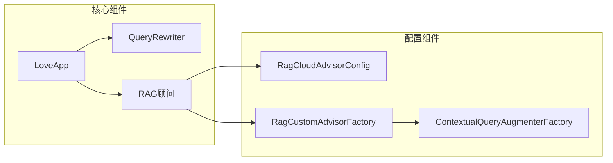

**图表来源**
- [LoveApp.java:135-136](file://src/main/java/com/yupi/yuaiagent/app/LoveApp.java#L135-L136)
- [LoveAppRagCustomAdvisorFactory.java:37](file://src/main/java/com/yupi/yuaiagent/rag/LoveAppRagCustomAdvisorFactory.java#L37)

**章节来源**
- [application.yml:11-21](file://src/main/resources/application.yml#L11-L21)
- [LoveApp.java:135-172](file://src/main/java/com/yupi/yuaiagent/app/LoveApp.java#L135-L172)

## 性能考虑

### 查询重写性能优化

查询重写器在性能方面的关键考虑点：

1. **延迟优化**：通过缓存机制减少重复查询的重写开销
2. **并发处理**：支持多线程并发处理多个查询重写请求
3. **资源管理**：合理管理DashScope API调用频率和配额

### 检索性能指标

```mermaid
flowchart TD
Start([查询开始]) --> Rewrite["查询重写"]
Rewrite --> CacheCheck{"缓存命中?"}
CacheCheck --> |是| ReturnCache["返回缓存结果"]
CacheCheck --> |否| CallAPI["调用DashScope API"]
CallAPI --> ProcessQuery["处理查询"]
ProcessQuery --> StoreCache["存储到缓存"]
StoreCache --> ReturnResult["返回结果"]
ReturnCache --> End([查询结束])
ReturnResult --> End
```

**图表来源**
- [QueryRewriter.java:32-38](file://src/main/java/com/yupi/yuaiagent/rag/QueryRewriter.java#L32-L38)

### 内存使用优化

- **对象池管理**：复用Query和QueryTransformer实例
- **流式处理**：支持大数据量查询的流式处理
- **垃圾回收优化**：避免不必要的对象创建和销毁

## 故障排除指南

### 常见问题诊断

#### API密钥配置问题

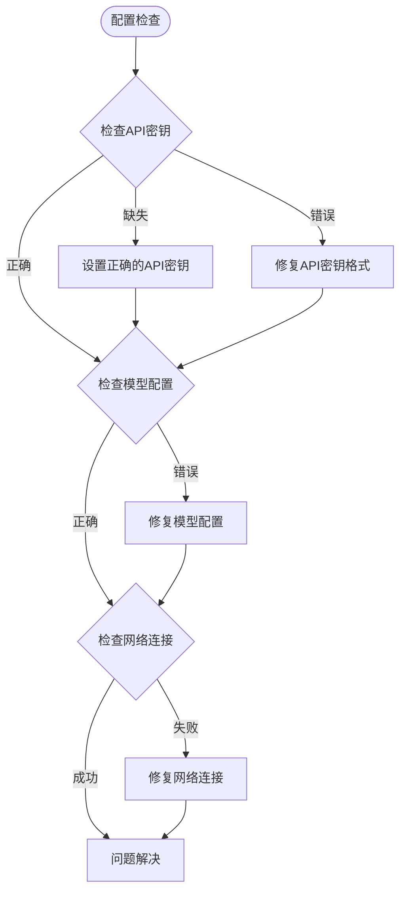

**图表来源**
- [application.yml:13-17](file://src/main/resources/application.yml#L13-L17)

#### 查询重写失败排查

1. **检查DashScope服务状态**
   - 验证API密钥有效性
   - 确认模型可用性
   - 检查配额限制

2. **验证查询格式**
   - 确保输入文本非空
   - 检查特殊字符处理
   - 验证编码格式

3. **监控系统性能**
   - 查看日志输出
   - 监控响应时间
   - 分析错误率

**章节来源**
- [application.yml:64-66](file://src/main/resources/application.yml#L64-L66)
- [MultiQueryExpanderDemoTest.java:19-24](file://src/test/java/com/yupi/yuaiagent/demo/rag/MultiQueryExpanderDemoTest.java#L19-L24)

## 结论

查询重写器作为RAG系统的核心组件，在提升检索质量和系统性能方面发挥着关键作用。通过智能的查询重写和优化，该组件能够：

1. **提升检索精度**：通过语义理解和上下文感知，生成更精确的查询表达式
2. **优化召回率**：利用多查询扩展技术，扩大检索覆盖范围
3. **缩短响应时间**：通过缓存和优化算法，减少查询处理延迟
4. **增强用户体验**：提供更准确、更相关的回答

该实现充分体现了现代AI应用中查询优化的重要性和技术价值，为后续的功能扩展和性能优化奠定了坚实基础。

## 附录

### 配置参数说明

| 参数名称 | 类型 | 默认值 | 描述 |
|---------|------|--------|------|
| spring.ai.dashscope.api-key | String | required | 阿里云DashScope API密钥 |
| spring.ai.dashscope.chat.options.model | String | qwen-plus | 使用的大模型名称 |
| logging.level.org.springframework.ai | Level | DEBUG | 日志级别设置 |

### 最佳实践建议

1. **查询重写策略**
   - 定期评估重写效果，调整重写规则
   - 监控用户反馈，持续优化重写质量
   - 建立A/B测试机制，对比不同重写策略的效果

2. **性能监控**
   - 实施查询延迟监控
   - 跟踪重写成功率指标
   - 分析用户满意度数据

3. **扩展性考虑**
   - 支持多语言查询重写
   - 集成领域特定的重写规则
   - 实现动态重写策略调整