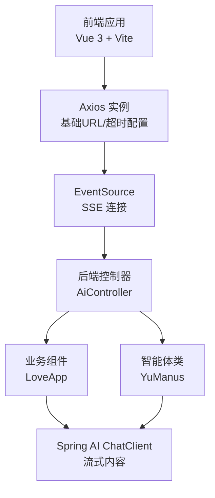
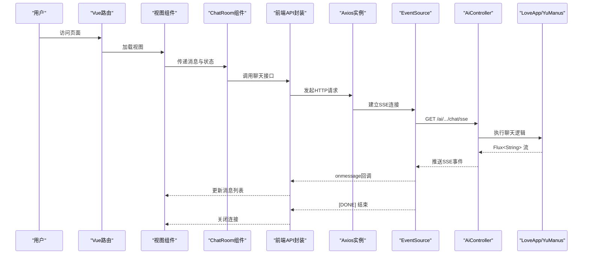
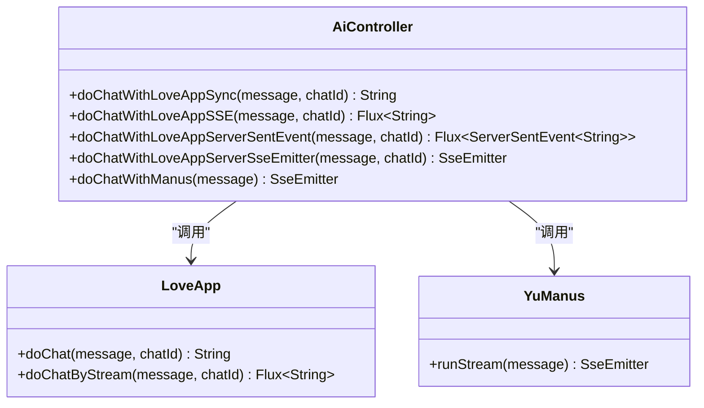
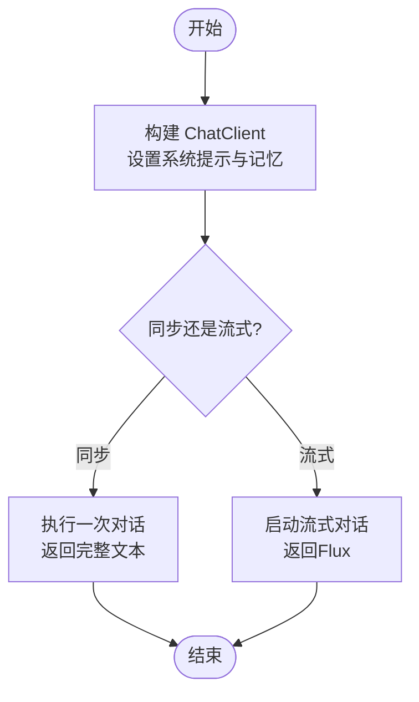
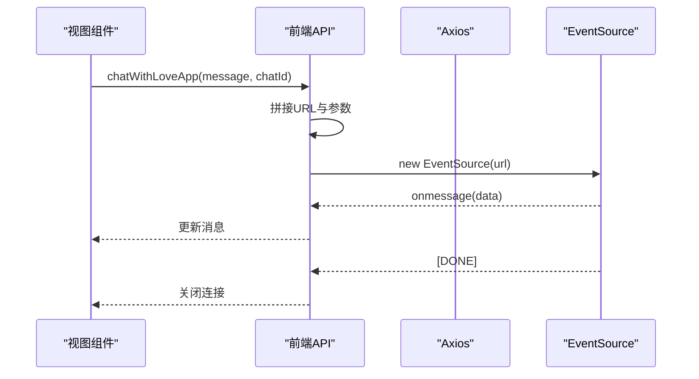
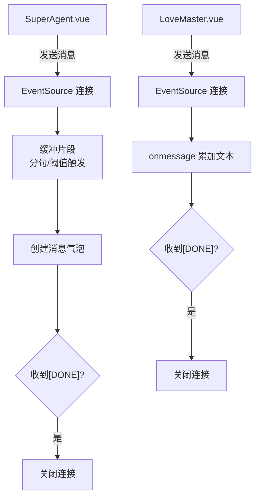
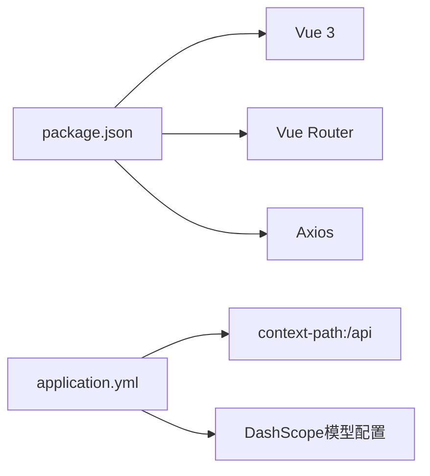

# API接口集成

<cite>
**本文引用的文件**
- [AiController.java](file://src/main/java/com/yupi/yuaiagent/controller/AiController.java)
- [LoveApp.java](file://src/main/java/com/yupi/yuaiagent/app/LoveApp.java)
- [YuManus.java](file://src/main/java/com/yupi/yuaiagent/agent/YuManus.java)
- [index.js](file://yu-ai-agent-frontend/src/api/index.js)
- [ChatRoom.vue](file://yu-ai-agent-frontend/src/components/ChatRoom.vue)
- [LoveMaster.vue](file://yu-ai-agent-frontend/src/views/LoveMaster.vue)
- [SuperAgent.vue](file://yu-ai-agent-frontend/src/views/SuperAgent.vue)
- [application.yml](file://src/main/resources/application.yml)
- [package.json](file://yu-ai-agent-frontend/package.json)
- [vite.config.js](file://yu-ai-agent-frontend/vite.config.js)
- [index.js](file://yu-ai-agent-frontend/src/router/index.js)
- [main.js](file://yu-ai-agent-frontend/src/main.js)
</cite>

## 目录
1. [简介](#简介)
2. [项目结构](#项目结构)
3. [核心组件](#核心组件)
4. [架构总览](#架构总览)
5. [详细组件分析](#详细组件分析)
6. [依赖分析](#依赖分析)
7. [性能考虑](#性能考虑)
8. [故障排查指南](#故障排查指南)
9. [结论](#结论)
10. [附录](#附录)

## 简介
本指南聚焦于前后端数据交互与API集成，涵盖HTTP请求封装、Axios配置、请求拦截器、聊天接口（同步与SSE流式）的实现差异、数据格式与错误处理、实时通信（EventSource）的使用与连接管理、以及测试与调试方法。目标是帮助开发者快速理解并高效集成后端Spring Boot提供的AI聊天能力至前端Vue应用。

## 项目结构
后端采用Spring Boot，提供REST接口与SSE流式输出；前端采用Vue 3 + Vite，通过Axios与EventSource完成与后端的双向交互。整体采用前后端分离架构，后端统一通过/context-path暴露API，前端根据环境变量动态切换API基础地址。

图表来源
- [AiController.java:18-105](file://src/main/java/com/yupi/yuaiagent/controller/AiController.java#L18-L105)
- [LoveApp.java:27-97](file://src/main/java/com/yupi/yuaiagent/app/LoveApp.java#L27-L97)
- [YuManus.java:12-37](file://src/main/java/com/yupi/yuaiagent/agent/YuManus.java#L12-L37)
- [index.js:1-60](file://yu-ai-agent-frontend/src/api/index.js#L1-L60)

章节来源
- [AiController.java:18-105](file://src/main/java/com/yupi/yuaiagent/controller/AiController.java#L18-L105)
- [application.yml:38-41](file://src/main/resources/application.yml#L38-L41)
- [index.js:1-60](file://yu-ai-agent-frontend/src/api/index.js#L1-L60)

## 核心组件
- 后端控制器：提供同步聊天与多种SSE接口，统一在/context-path/api下暴露。
- 业务组件：LoveApp封装Spring AI ChatClient，支持多轮对话记忆、RAG、工具调用与MCP服务。
- 智能体类：YuManus继承工具调用智能体，内置系统提示与最大步数控制。
- 前端API封装：Axios实例与SSE连接封装，统一处理参数拼接、消息分发与错误处理。
- 视图与组件：LoveMaster与SuperAgent分别接入不同聊天接口；ChatRoom负责消息渲染与输入交互。

章节来源
- [AiController.java:38-104](file://src/main/java/com/yupi/yuaiagent/controller/AiController.java#L38-L104)
- [LoveApp.java:71-97](file://src/main/java/com/yupi/yuaiagent/app/LoveApp.java#L71-L97)
- [YuManus.java:13-36](file://src/main/java/com/yupi/yuaiagent/agent/YuManus.java#L13-L36)
- [index.js:47-60](file://yu-ai-agent-frontend/src/api/index.js#L47-L60)
- [LoveMaster.vue:69-107](file://yu-ai-agent-frontend/src/views/LoveMaster.vue#L69-L107)
- [SuperAgent.vue:64-157](file://yu-ai-agent-frontend/src/views/SuperAgent.vue#L64-L157)
- [ChatRoom.vue:86-92](file://yu-ai-agent-frontend/src/components/ChatRoom.vue#L86-L92)

## 架构总览
后端通过AiController暴露REST接口，内部委托LoveApp或YuManus执行具体逻辑，并以Flux形式输出SSE流。前端通过Axios创建请求，结合EventSource监听SSE事件，按消息类型进行UI更新与连接管理。

图表来源
- [AiController.java:50-92](file://src/main/java/com/yupi/yuaiagent/controller/AiController.java#L50-L92)
- [LoveApp.java:90-97](file://src/main/java/com/yupi/yuaiagent/app/LoveApp.java#L90-L97)
- [index.js:14-45](file://yu-ai-agent-frontend/src/api/index.js#L14-L45)
- [LoveMaster.vue:69-107](file://yu-ai-agent-frontend/src/views/LoveMaster.vue#L69-L107)
- [SuperAgent.vue:64-157](file://yu-ai-agent-frontend/src/views/SuperAgent.vue#L64-L157)

## 详细组件分析

### 后端控制器：AiController
- 提供同步聊天接口与多种SSE接口，统一前缀为/context-path/api/ai。
- 支持多轮对话记忆（通过chatId参数），并可映射为ServerSentEvent或SseEmitter。
- 智能体接口直接返回SseEmitter，便于长连接与手动推送。

图表来源
- [AiController.java:38-104](file://src/main/java/com/yupi/yuaiagent/controller/AiController.java#L38-L104)
- [LoveApp.java:71-97](file://src/main/java/com/yupi/yuaiagent/app/LoveApp.java#L71-L97)
- [YuManus.java:13-36](file://src/main/java/com/yupi/yuaiagent/agent/YuManus.java#L13-L36)

章节来源
- [AiController.java:38-104](file://src/main/java/com/yupi/yuaiagent/controller/AiController.java#L38-L104)

### 业务组件：LoveApp
- 基于Spring AI ChatClient构建，内置系统提示与对话记忆。
- 提供同步与流式两种聊天接口，流式接口返回Flux<String>，适配SSE。
- 支持RAG、工具调用与MCP服务扩展点（注释示例）。

图表来源
- [LoveApp.java:43-62](file://src/main/java/com/yupi/yuaiagent/app/LoveApp.java#L43-L62)
- [LoveApp.java:71-97](file://src/main/java/com/yupi/yuaiagent/app/LoveApp.java#L71-L97)

章节来源
- [LoveApp.java:43-62](file://src/main/java/com/yupi/yuaiagent/app/LoveApp.java#L43-L62)
- [LoveApp.java:71-97](file://src/main/java/com/yupi/yuaiagent/app/LoveApp.java#L71-L97)

### 智能体类：YuManus
- 继承工具调用智能体，内置系统提示与下一步提示，控制最大步数。
- 通过ChatClient构建，便于与后端SSE接口对接。

章节来源
- [YuManus.java:13-36](file://src/main/java/com/yupi/yuaiagent/agent/YuManus.java#L13-L36)

### 前端API封装：Axios与SSE
- Axios实例：设置baseURL与timeout，区分生产/开发环境。
- SSE封装：构造URL参数，创建EventSource，处理消息与错误，支持关闭连接。
- 导出聊天接口：LoveApp与YuManus对应的SSE调用。

图表来源
- [index.js:14-45](file://yu-ai-agent-frontend/src/api/index.js#L14-L45)
- [index.js:47-60](file://yu-ai-agent-frontend/src/api/index.js#L47-L60)

章节来源
- [index.js:4-12](file://yu-ai-agent-frontend/src/api/index.js#L4-L12)
- [index.js:14-45](file://yu-ai-agent-frontend/src/api/index.js#L14-L45)
- [index.js:47-60](file://yu-ai-agent-frontend/src/api/index.js#L47-L60)

### 视图与组件：LoveMaster与SuperAgent
- LoveMaster：生成chatId，建立SSE连接，逐字追加AI回复，识别[DONE]结束。
- SuperAgent：对SSE片段进行缓冲与分句聚合，按最小间隔时间创建消息气泡，区分最终与错误气泡。
- ChatRoom：通用消息渲染与输入交互，禁用输入期间显示“正在输入”指示。

图表来源
- [LoveMaster.vue:69-107](file://yu-ai-agent-frontend/src/views/LoveMaster.vue#L69-L107)
- [SuperAgent.vue:64-157](file://yu-ai-agent-frontend/src/views/SuperAgent.vue#L64-L157)

章节来源
- [LoveMaster.vue:69-107](file://yu-ai-agent-frontend/src/views/LoveMaster.vue#L69-L107)
- [SuperAgent.vue:64-157](file://yu-ai-agent-frontend/src/views/SuperAgent.vue#L64-L157)
- [ChatRoom.vue:86-92](file://yu-ai-agent-frontend/src/components/ChatRoom.vue#L86-L92)

### 路由与入口
- 路由：Home、LoveMaster、SuperAgent三页面，全局导航守卫设置标题。
- 入口：main.js挂载应用与路由，vite.config.js配置开发服务器与别名。

章节来源
- [index.js:3-31](file://yu-ai-agent-frontend/src/router/index.js#L3-L31)
- [main.js:1-13](file://yu-ai-agent-frontend/src/main.js#L1-L13)
- [vite.config.js:13-17](file://yu-ai-agent-frontend/vite.config.js#L13-L17)

## 依赖分析
- 前端依赖：Vue 3、Vue Router、Axios、@vueuse/head。
- 后端配置：context-path为/api，Spring AI DashScope模型配置与日志级别。

图表来源
- [package.json:11-16](file://yu-ai-agent-frontend/package.json#L11-L16)
- [application.yml:38-41](file://src/main/resources/application.yml#L38-L41)
- [application.yml:11-21](file://src/main/resources/application.yml#L11-L21)

章节来源
- [package.json:11-16](file://yu-ai-agent-frontend/package.json#L11-L16)
- [application.yml:38-41](file://src/main/resources/application.yml#L38-L41)

## 性能考虑
- SSE连接超时：后端SseEmitter默认较长超时，前端Axios超时可适当延长以适应长连接。
- 流式传输：后端返回Flux<String>，前端按片段增量渲染，避免一次性接收大量数据。
- 消息聚合：SuperAgent对SSE片段进行缓冲与分句聚合，减少DOM操作频率，提升渲染性能。
- 连接复用：同一会话内复用EventSource，避免频繁重建连接带来的开销。

## 故障排查指南
- 网络与跨域：确认前端开发服务器端口与后端context-path一致，必要时启用Vite CORS。
- 基础URL：生产环境使用相对路径，开发环境指向后端地址，避免404或跨域问题。
- SSE异常：前端onerror中打印错误并关闭连接，检查后端SSE接口是否正确返回数据与[DONE]标记。
- 参数校验：后端接口要求message与chatId（部分接口），前端需在发送前校验非空。
- 日志定位：后端Spring AI日志级别可调至DEBUG，便于观察模型调用细节。

章节来源
- [vite.config.js:13-17](file://yu-ai-agent-frontend/vite.config.js#L13-L17)
- [index.js:4-6](file://yu-ai-agent-frontend/src/api/index.js#L4-L6)
- [AiController.java:38-41](file://src/main/java/com/yupi/yuaiagent/controller/AiController.java#L38-L41)
- [application.yml:64-66](file://src/main/resources/application.yml#L64-L66)

## 结论
本项目通过Axios与EventSource实现了前后端的稳定交互，后端以Spring AI为核心提供多轮对话与流式输出能力，前端以组件化方式实现消息渲染与连接管理。遵循本文最佳实践，可在保证用户体验的同时提升系统的稳定性与可维护性。

## 附录
- API端点清单（基于context-path/api）
  - 同步聊天：GET /ai/love_app/chat/sync?message=&chatId=
  - SSE聊天：GET /ai/love_app/chat/sse?message=&chatId=
  - ServerSentEvent：GET /ai/love_app/chat/server_sent_event?message=&chatId=
  - SseEmitter：GET /ai/love_app/chat/sse_emitter?message=&chatId=
  - 智能体聊天：GET /ai/manus/chat?message=

章节来源
- [AiController.java:38-92](file://src/main/java/com/yupi/yuaiagent/controller/AiController.java#L38-L92)