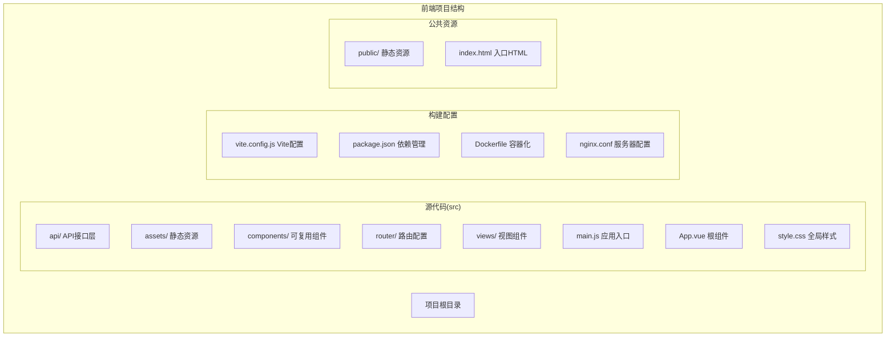
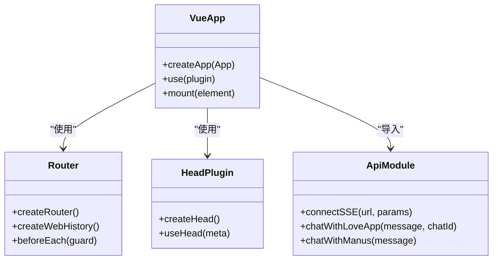
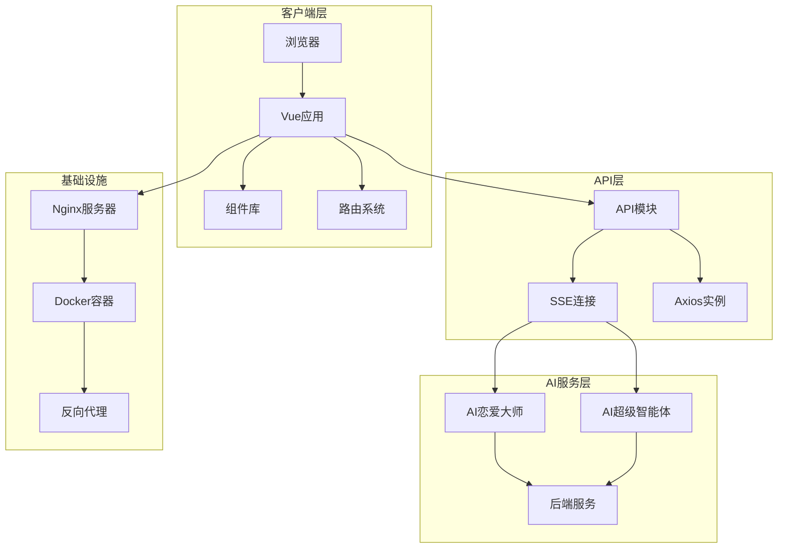
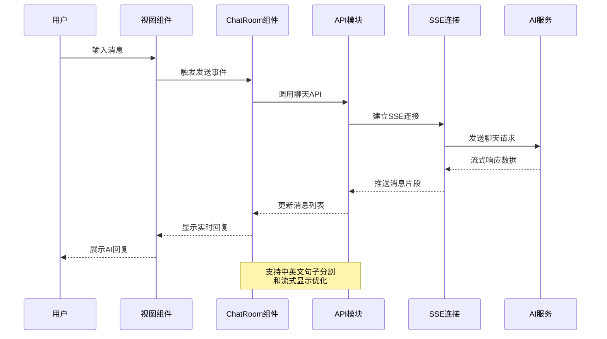
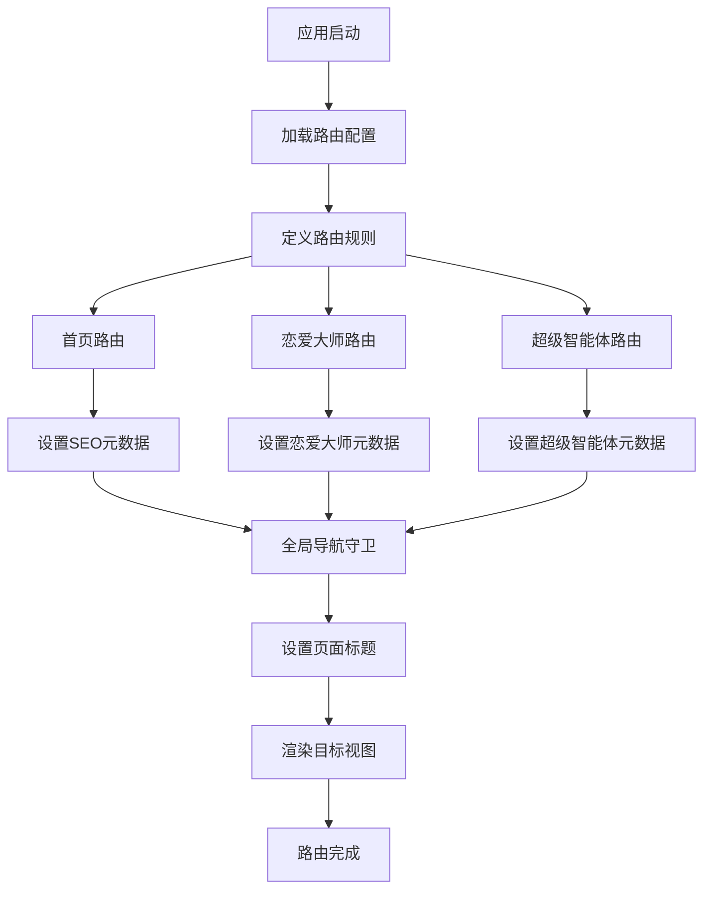
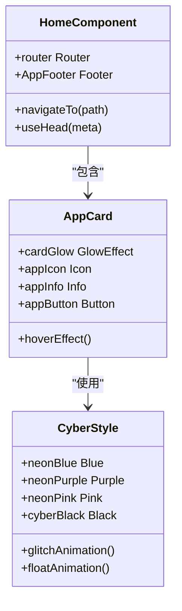
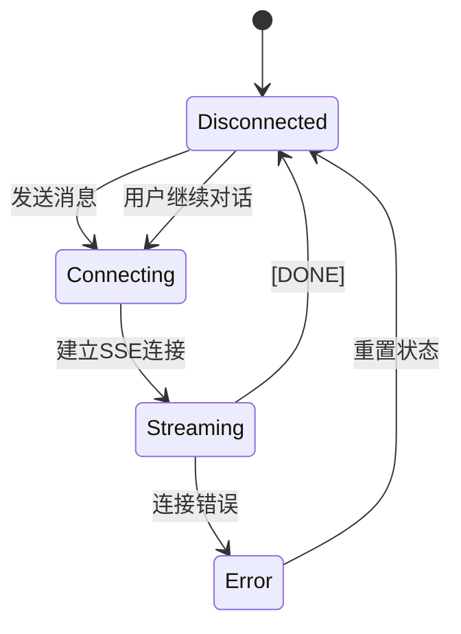
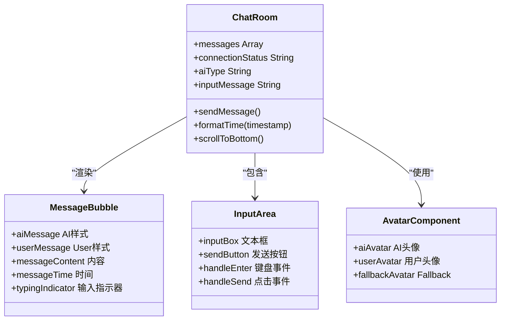
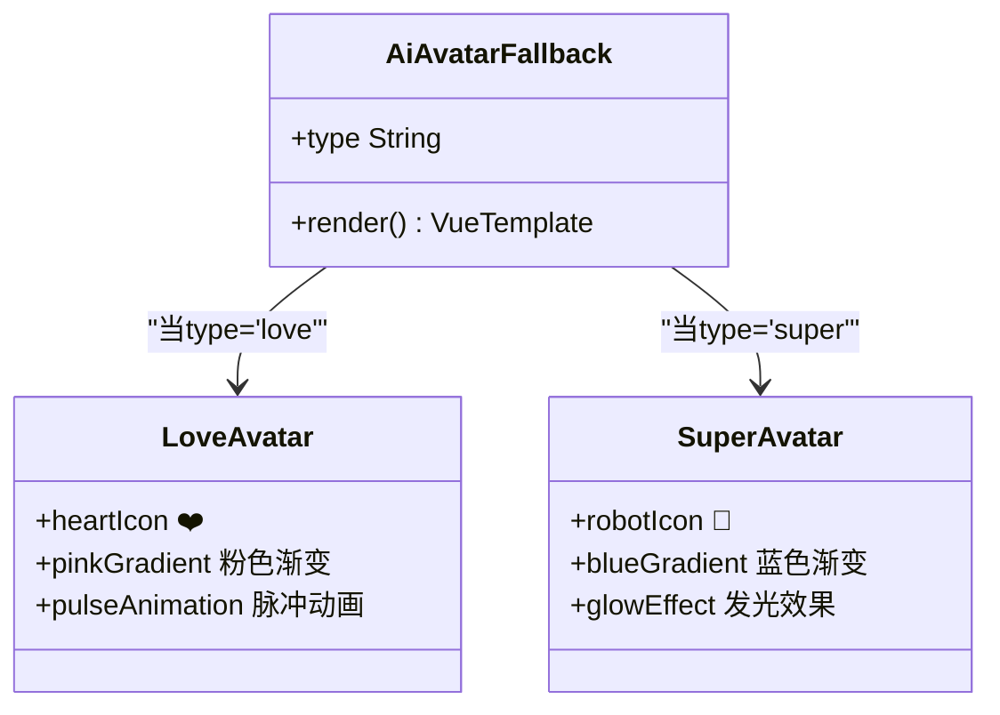
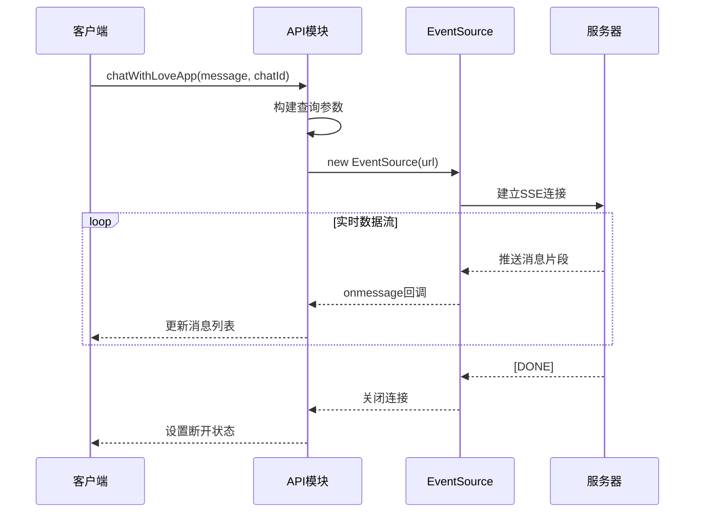

# Vue.js项目结构

<cite>
**本文档引用的文件**
- [package.json](file://yu-ai-agent-frontend/package.json)
- [vite.config.js](file://yu-ai-agent-frontend/vite.config.js)
- [main.js](file://yu-ai-agent-frontend/src/main.js)
- [App.vue](file://yu-ai-agent-frontend/src/App.vue)
- [router/index.js](file://yu-ai-agent-frontend/src/router/index.js)
- [views/Home.vue](file://yu-ai-agent-frontend/src/views/Home.vue)
- [views/LoveMaster.vue](file://yu-ai-agent-frontend/src/views/LoveMaster.vue)
- [views/SuperAgent.vue](file://yu-ai-agent-frontend/src/views/SuperAgent.vue)
- [components/ChatRoom.vue](file://yu-ai-agent-frontend/src/components/ChatRoom.vue)
- [components/AiAvatarFallback.vue](file://yu-ai-agent-frontend/src/components/AiAvatarFallback.vue)
- [components/AppFooter.vue](file://yu-ai-agent-frontend/src/components/AppFooter.vue)
- [api/index.js](file://yu-ai-agent-frontend/src/api/index.js)
- [style.css](file://yu-ai-agent-frontend/src/style.css)
- [Dockerfile](file://yu-ai-agent-frontend/Dockerfile)
- [nginx.conf](file://yu-ai-agent-frontend/nginx.conf)
</cite>

## 目录
1. [简介](#简介)
2. [项目结构](#项目结构)
3. [核心组件](#核心组件)
4. [架构概览](#架构概览)
5. [详细组件分析](#详细组件分析)
6. [依赖关系分析](#依赖关系分析)
7. [性能考虑](#性能考虑)
8. [故障排除指南](#故障排除指南)
9. [结论](#结论)
10. [附录](#附录)

## 简介

这是一个基于Vue.js 3.x和Vite的现代化前端项目，专注于AI智能体应用平台。项目采用模块化设计，包含AI恋爱大师和AI超级智能体两个核心功能模块，支持实时对话交互和流式响应。

## 项目结构

项目采用清晰的目录组织原则，遵循Vue.js最佳实践：



**图表来源**
- [main.js:1-13](file://yu-ai-agent-frontend/src/main.js#L1-L13)
- [router/index.js:1-47](file://yu-ai-agent-frontend/src/router/index.js#L1-L47)
- [package.json:1-22](file://yu-ai-agent-frontend/package.json#L1-L22)

### 目录组织原则

1. **功能导向的模块化设计**
   - 按功能特性划分目录结构
   - API层、组件层、视图层职责分离
   - 支持代码复用和维护性

2. **文件命名规范**
   - 组件文件使用PascalCase命名（如ChatRoom.vue）
   - 视图文件使用PascalCase命名（如Home.vue）
   - API文件使用小驼峰命名（如index.js）
   - 样式文件统一使用style.css

3. **模块化设计思路**
   - 单文件组件(SFC)模式
   - 组合式API(Composition API)使用
   - 响应式数据管理
   - 事件驱动的组件通信

**章节来源**
- [main.js:1-13](file://yu-ai-agent-frontend/src/main.js#L1-L13)
- [router/index.js:1-47](file://yu-ai-agent-frontend/src/router/index.js#L1-L47)
- [package.json:1-22](file://yu-ai-agent-frontend/package.json#L1-L22)

## 核心组件

### 应用入口与配置

项目采用现代化的Vue 3应用架构，核心配置如下：



**图表来源**
- [main.js:1-13](file://yu-ai-agent-frontend/src/main.js#L1-L13)
- [router/index.js:1-47](file://yu-ai-agent-frontend/src/router/index.js#L1-L47)
- [api/index.js:1-60](file://yu-ai-agent-frontend/src/api/index.js#L1-L60)

### 核心配置文件

1. **Vite配置** (`vite.config.js`)
   - Vue插件集成
   - 路径别名配置（@ → src）
   - 本地开发服务器配置（端口3000）

2. **包管理配置** (`package.json`)
   - 依赖版本管理
   - 开发脚本定义
   - 生产环境优化

3. **构建配置** (`Dockerfile`)
   - 多阶段构建
   - Nginx静态托管
   - 容器化部署

**章节来源**
- [vite.config.js:1-18](file://yu-ai-agent-frontend/vite.config.js#L1-L18)
- [package.json:1-22](file://yu-ai-agent-frontend/package.json#L1-L22)
- [Dockerfile:1-17](file://yu-ai-agent-frontend/Dockerfile#L1-L17)

## 架构概览

项目采用前后端分离架构，结合实时通信技术实现AI对话功能：



**图表来源**
- [main.js:1-13](file://yu-ai-agent-frontend/src/main.js#L1-L13)
- [api/index.js:1-60](file://yu-ai-agent-frontend/src/api/index.js#L1-L60)
- [nginx.conf:1-49](file://yu-ai-agent-frontend/nginx.conf#L1-L49)

### 数据流架构



**图表来源**
- [views/LoveMaster.vue:69-107](file://yu-ai-agent-frontend/src/views/LoveMaster.vue#L69-L107)
- [views/SuperAgent.vue:64-157](file://yu-ai-agent-frontend/src/views/SuperAgent.vue#L64-L157)
- [components/ChatRoom.vue:86-119](file://yu-ai-agent-frontend/src/components/ChatRoom.vue#L86-L119)

## 详细组件分析

### 路由系统

项目采用Vue Router 4.x实现单页应用路由：



**图表来源**
- [router/index.js:1-47](file://yu-ai-agent-frontend/src/router/index.js#L1-L47)

#### 路由特性

1. **动态导入**：所有视图组件采用懒加载
2. **SEO优化**：每个路由都有独立的meta信息
3. **导航守卫**：全局设置页面标题和元数据

**章节来源**
- [router/index.js:1-47](file://yu-ai-agent-frontend/src/router/index.js#L1-L47)

### 视图组件

#### 首页组件 (Home.vue)

首页采用赛博朋克风格设计，包含两个主要功能入口：



**图表来源**
- [views/Home.vue:1-524](file://yu-ai-agent-frontend/src/views/Home.vue#L1-L524)

##### 设计特色

1. **赛博朋克主题**：使用霓虹色彩和几何元素
2. **响应式布局**：适配移动端和桌面端
3. **动画效果**：包含故障动画和浮动背景元素

#### AI恋爱大师 (LoveMaster.vue)



**图表来源**
- [views/LoveMaster.vue:69-128](file://yu-ai-agent-frontend/src/views/LoveMaster.vue#L69-L128)

##### 核心功能

1. **SSE实时通信**：支持流式AI回复
2. **会话管理**：自动生成聊天ID
3. **状态管理**：连接状态实时反馈

#### AI超级智能体 (SuperAgent.vue)

```mermaid
flowchart TD
SendMessage[发送消息] --> CreateEventSource[创建SSE连接]
CreateEventSource --> BufferMessage[消息缓冲]
BufferMessage --> CheckSentence[检查句子完整性]
CheckSentence --> HasCompleteSentence{句子完整?}
HasCompleteSentence --> |是| CreateBubble[创建消息气泡]
HasCompleteSentence --> |否| WaitMore[等待更多内容]
CreateBubble --> UpdateState[更新连接状态]
WaitMore --> BufferMessage
UpdateState --> CheckDone{收到[DONE]?}
CheckDone --> |是| CloseConnection[关闭连接]
CheckDone --> |否| CheckSentence
CloseConnection --> [*]
```

**图表来源**
- [views/SuperAgent.vue:64-157](file://yu-ai-agent-frontend/src/views/SuperAgent.vue#L64-L157)

##### 智能显示逻辑

1. **句子分割算法**：支持中英文标点识别
2. **流式显示优化**：最小间隔控制和延迟处理
3. **错误处理机制**：网络异常时的数据完整性保证

**章节来源**
- [views/Home.vue:1-524](file://yu-ai-agent-frontend/src/views/Home.vue#L1-L524)
- [views/LoveMaster.vue:1-244](file://yu-ai-agent-frontend/src/views/LoveMaster.vue#L1-L244)
- [views/SuperAgent.vue:1-286](file://yu-ai-agent-frontend/src/views/SuperAgent.vue#L1-L286)

### 组件系统

#### 聊天室组件 (ChatRoom.vue)



**图表来源**
- [components/ChatRoom.vue:1-392](file://yu-ai-agent-frontend/src/components/ChatRoom.vue#L1-L392)

##### 组件特性

1. **双向绑定**：使用v-model实现输入同步
2. **事件通信**：通过emit向上级组件传递消息
3. **自动滚动**：新消息自动滚动到底部
4. **响应式设计**：适配不同屏幕尺寸

#### 头像组件 (AiAvatarFallback.vue)



**图表来源**
- [components/AiAvatarFallback.vue:1-35](file://yu-ai-agent-frontend/src/components/AiAvatarFallback.vue#L1-L35)

**章节来源**
- [components/ChatRoom.vue:1-392](file://yu-ai-agent-frontend/src/components/ChatRoom.vue#L1-L392)
- [components/AiAvatarFallback.vue:1-35](file://yu-ai-agent-frontend/src/components/AiAvatarFallback.vue#L1-L35)

### API层设计

#### SSE连接管理



**图表来源**
- [api/index.js:14-45](file://yu-ai-agent-frontend/src/api/index.js#L14-L45)

##### API设计原则

1. **环境感知**：根据NODE_ENV自动切换API基础URL
2. **错误处理**：完整的SSE错误监控和处理
3. **资源管理**：及时关闭不再使用的连接
4. **可扩展性**：支持多种AI服务的统一接口

**章节来源**
- [api/index.js:1-60](file://yu-ai-agent-frontend/src/api/index.js#L1-L60)

## 依赖关系分析

### 技术栈依赖

```mermaid
graph TB
subgraph "运行时依赖"
Vue[Vue 3.2.47]
Router[Vue Router 4.1.6]
Axios[Axios 1.3.6]
Head[@vueuse/head 2.0.0]
end
subgraph "开发依赖"
Vite[Vite 4.3.9]
VuePlugin[@vitejs/plugin-vue 4.1.0]
end
subgraph "构建工具"
Node[Node.js 20]
NPM[NPM]
Docker[Docker]
Nginx[Nginx]
end
Vue --> Router
Vue --> Head
Vue --> Axios
Vite --> VuePlugin
```

**图表来源**
- [package.json:11-20](file://yu-ai-agent-frontend/package.json#L11-L20)

### 模块间耦合度

1. **低耦合设计**：各模块职责明确，相互独立
2. **接口抽象**：通过API层统一对外服务
3. **事件驱动**：组件间通过事件进行松散耦合

**章节来源**
- [package.json:1-22](file://yu-ai-agent-frontend/package.json#L1-L22)

## 性能考虑

### 构建优化策略

1. **代码分割**：路由级别的懒加载
2. **资源压缩**：Vite内置的代码压缩和混淆
3. **缓存策略**：Nginx静态资源缓存配置
4. **按需加载**：组件和API的动态导入

### 运行时性能优化

1. **虚拟滚动**：大量消息时的性能优化
2. **防抖处理**：输入框的防抖机制
3. **内存管理**：及时清理SSE连接和定时器
4. **渲染优化**：使用key属性优化列表渲染

## 故障排除指南

### 常见问题及解决方案

1. **SSE连接失败**
   - 检查CORS配置
   - 验证后端服务可用性
   - 查看浏览器控制台错误信息

2. **路由404问题**
   - 确认Nginx配置正确
   - 检查SPA路由配置
   - 验证静态文件部署

3. **构建失败**
   - 检查Node.js版本兼容性
   - 清理node_modules重新安装
   - 验证Vite配置文件语法

4. **Docker部署问题**
   - 确认镜像构建成功
   - 检查端口映射配置
   - 验证环境变量设置

**章节来源**
- [nginx.conf:14-35](file://yu-ai-agent-frontend/nginx.conf#L14-L35)
- [Dockerfile:1-17](file://yu-ai-agent-frontend/Dockerfile#L1-L17)

## 结论

该项目展现了现代Vue.js应用的最佳实践，具有以下特点：

1. **架构清晰**：模块化设计，职责分离
2. **用户体验优秀**：流畅的实时交互和响应式设计
3. **技术先进**：采用Vue 3 Composition API和现代构建工具
4. **可扩展性强**：良好的代码结构支持功能扩展
5. **部署友好**：完整的容器化和CI/CD支持

项目为AI应用开发提供了优秀的模板，特别适合需要实时对话和流式响应的场景。

## 附录

### 开发环境初始化

1. **环境要求**
   - Node.js 16+
   - Git版本控制系统

2. **安装步骤**
   ```bash
   # 克隆项目
   git clone <repository-url>
   
   # 进入前端目录
   cd yu-ai-agent-frontend
   
   # 安装依赖
   npm install
   
   # 启动开发服务器
   npm run dev
   ```

3. **生产构建**
   ```bash
   # 构建生产版本
   npm run build
   
   # 预览生产构建
   npm run preview
   ```

4. **Docker部署**
   ```bash
   # 构建Docker镜像
   docker build -t yu-ai-agent-frontend .
   
   # 运行容器
   docker run -p 80:80 yu-ai-agent-frontend
   ```

### 配置文件说明

1. **Vite配置**：支持热重载、路径别名和开发服务器配置
2. **Nginx配置**：SPA路由支持和API反向代理
3. **Docker配置**：多阶段构建和容器化部署