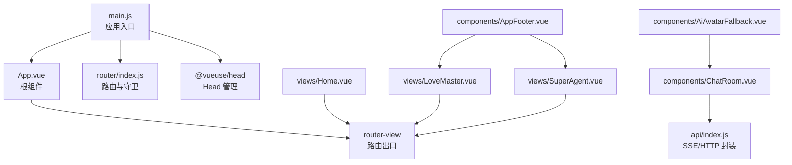
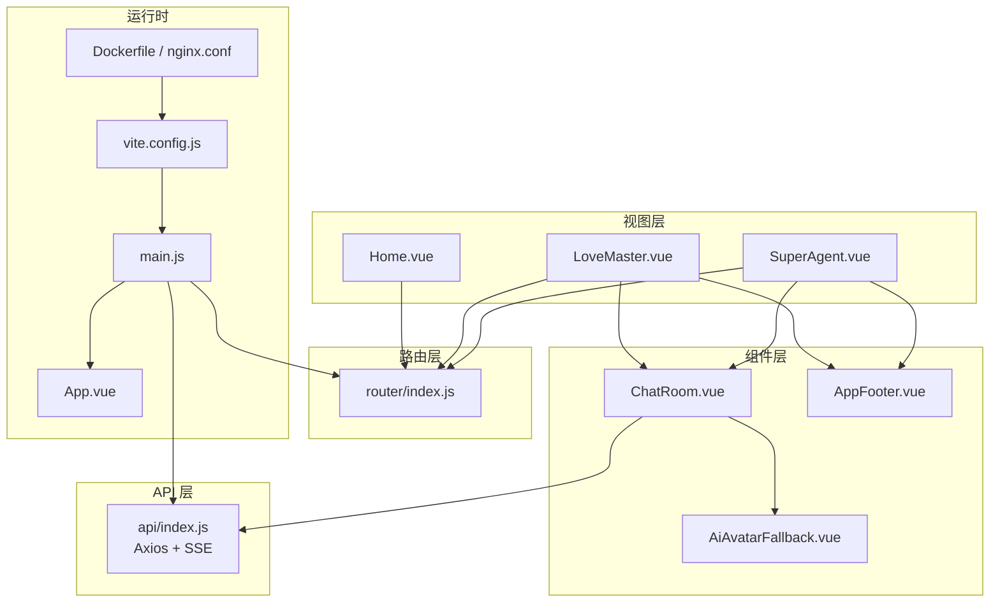
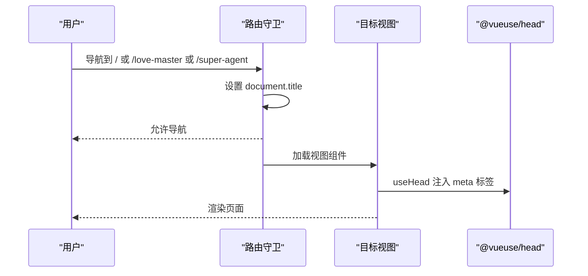
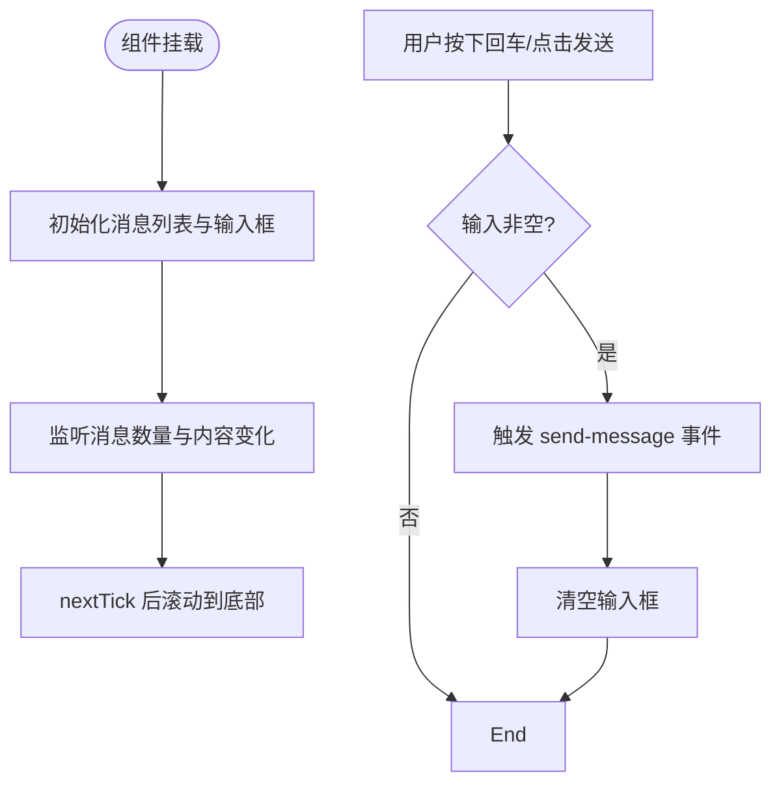
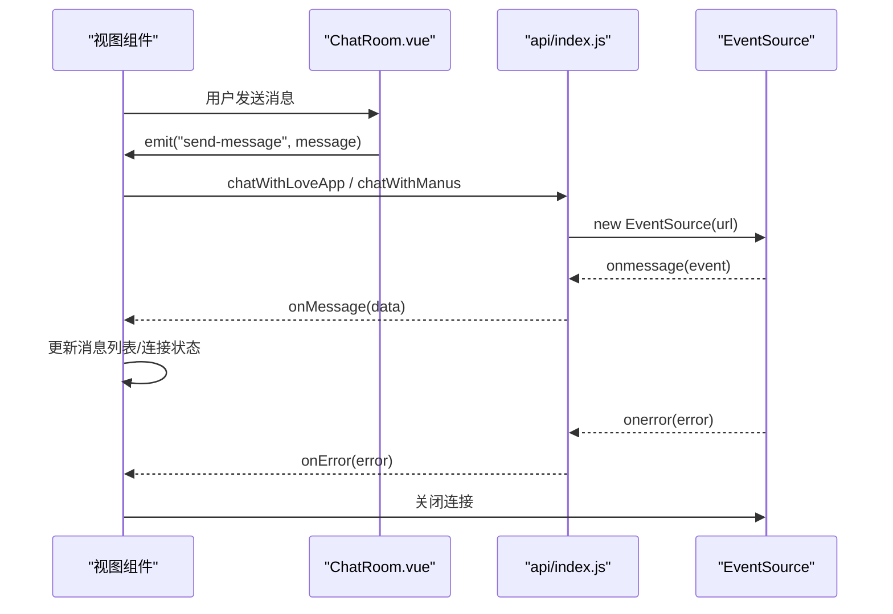
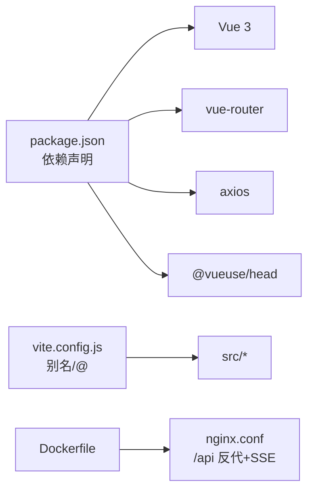

# 前端应用开发

<cite>
**本文引用的文件**
- [package.json](file://yu-ai-agent-frontend/package.json)
- [main.js](file://yu-ai-agent-frontend/src/main.js)
- [App.vue](file://yu-ai-agent-frontend/src/App.vue)
- [router/index.js](file://yu-ai-agent-frontend/src/router/index.js)
- [api/index.js](file://yu-ai-agent-frontend/src/api/index.js)
- [components/ChatRoom.vue](file://yu-ai-agent-frontend/src/components/ChatRoom.vue)
- [components/AiAvatarFallback.vue](file://yu-ai-agent-frontend/src/components/AiAvatarFallback.vue)
- [components/AppFooter.vue](file://yu-ai-agent-frontend/src/components/AppFooter.vue)
- [views/Home.vue](file://yu-ai-agent-frontend/src/views/Home.vue)
- [views/LoveMaster.vue](file://yu-ai-agent-frontend/src/views/LoveMaster.vue)
- [views/SuperAgent.vue](file://yu-ai-agent-frontend/src/views/SuperAgent.vue)
- [style.css](file://yu-ai-agent-frontend/src/style.css)
- [vite.config.js](file://yu-ai-agent-frontend/vite.config.js)
- [Dockerfile](file://yu-ai-agent-frontend/Dockerfile)
- [nginx.conf](file://yu-ai-agent-frontend/nginx.conf)
</cite>

## 目录
1. [简介](#简介)
2. [项目结构](#项目结构)
3. [核心组件](#核心组件)
4. [架构总览](#架构总览)
5. [详细组件分析](#详细组件分析)
6. [依赖关系分析](#依赖关系分析)
7. [性能考量](#性能考量)
8. [故障排查指南](#故障排查指南)
9. [结论](#结论)
10. [附录](#附录)

## 简介
本指南面向前端开发者，系统讲解基于 Vue 3 的聊天类前端应用的架构设计与开发实践。内容涵盖项目结构、组件组织、路由配置、状态管理、API 集成（含 SSE 流式通信）、样式与响应式布局、组件开发最佳实践，以及前端与后端的交互模式与调试技巧。读者可据此快速理解并扩展该应用的聊天室、视图层与交互逻辑。

## 项目结构
前端采用 Vite + Vue 3 单页应用结构，核心目录与职责如下：
- src/main.js：应用入口，挂载根组件、注册路由与 Head 管理
- src/App.vue：根组件，承载全局样式与路由出口
- src/router/index.js：路由定义与全局导航守卫（设置页面标题）
- src/api/index.js：Axios 实例封装与 SSE 连接工具
- src/views：页面视图（首页、恋爱大师、超级智能体）
- src/components：可复用组件（聊天室、头像占位、页脚）
- src/style.css：全局基础样式
- vite.config.js：Vite 构建与开发服务器配置（别名、端口、CORS）
- Dockerfile 与 nginx.conf：生产容器化与反向代理配置（含 SSE 支持）

图表来源
- [main.js:1-13](file://yu-ai-agent-frontend/src/main.js#L1-L13)
- [App.vue:1-73](file://yu-ai-agent-frontend/src/App.vue#L1-L73)
- [router/index.js:1-47](file://yu-ai-agent-frontend/src/router/index.js#L1-L47)
- [api/index.js:1-60](file://yu-ai-agent-frontend/src/api/index.js#L1-L60)
- [components/ChatRoom.vue:1-392](file://yu-ai-agent-frontend/src/components/ChatRoom.vue#L1-L392)
- [components/AiAvatarFallback.vue:1-35](file://yu-ai-agent-frontend/src/components/AiAvatarFallback.vue#L1-L35)
- [components/AppFooter.vue:1-166](file://yu-ai-agent-frontend/src/components/AppFooter.vue#L1-L166)
- [views/Home.vue:1-524](file://yu-ai-agent-frontend/src/views/Home.vue#L1-L524)
- [views/LoveMaster.vue:1-244](file://yu-ai-agent-frontend/src/views/LoveMaster.vue#L1-L244)
- [views/SuperAgent.vue:1-286](file://yu-ai-agent-frontend/src/views/SuperAgent.vue#L1-L286)

章节来源
- [main.js:1-13](file://yu-ai-agent-frontend/src/main.js#L1-L13)
- [router/index.js:1-47](file://yu-ai-agent-frontend/src/router/index.js#L1-L47)
- [vite.config.js:1-18](file://yu-ai-agent-frontend/vite.config.js#L1-L18)

## 核心组件
- 应用入口与挂载：创建应用实例、注册路由与 Head 插件、挂载根组件
- 根组件：统一全局样式与路由出口
- 路由系统：定义三类页面（首页、恋爱大师、超级智能体），并设置页面标题与描述
- API 层：Axios 实例封装、SSE 连接工具（支持消息事件与错误回调）
- 视图组件：首页卡片式导航、恋爱大师与超级智能体聊天页
- 可复用组件：聊天室组件、头像占位组件、页脚组件

章节来源
- [main.js:1-13](file://yu-ai-agent-frontend/src/main.js#L1-L13)
- [App.vue:1-73](file://yu-ai-agent-frontend/src/App.vue#L1-L73)
- [router/index.js:1-47](file://yu-ai-agent-frontend/src/router/index.js#L1-L47)
- [api/index.js:1-60](file://yu-ai-agent-frontend/src/api/index.js#L1-L60)
- [views/Home.vue:1-524](file://yu-ai-agent-frontend/src/views/Home.vue#L1-L524)
- [views/LoveMaster.vue:1-244](file://yu-ai-agent-frontend/src/views/LoveMaster.vue#L1-L244)
- [views/SuperAgent.vue:1-286](file://yu-ai-agent-frontend/src/views/SuperAgent.vue#L1-L286)
- [components/ChatRoom.vue:1-392](file://yu-ai-agent-frontend/src/components/ChatRoom.vue#L1-L392)
- [components/AiAvatarFallback.vue:1-35](file://yu-ai-agent-frontend/src/components/AiAvatarFallback.vue#L1-L35)
- [components/AppFooter.vue:1-166](file://yu-ai-agent-frontend/src/components/AppFooter.vue#L1-L166)

## 架构总览
应用采用“视图驱动 + 组件复用 + API 抽象”的分层架构：
- 视图层：负责页面业务流程与状态管理（如聊天消息、连接状态）
- 组件层：封装通用 UI 与交互（聊天室、头像、页脚）
- API 层：统一网络访问与 SSE 流式通信
- 路由层：页面切换与 SEO 元数据注入
- 构建与运行：Vite 开发、Nginx 生产托管、Docker 容器化

图表来源
- [main.js:1-13](file://yu-ai-agent-frontend/src/main.js#L1-L13)
- [App.vue:1-73](file://yu-ai-agent-frontend/src/App.vue#L1-L73)
- [router/index.js:1-47](file://yu-ai-agent-frontend/src/router/index.js#L1-L47)
- [api/index.js:1-60](file://yu-ai-agent-frontend/src/api/index.js#L1-L60)
- [components/ChatRoom.vue:1-392](file://yu-ai-agent-frontend/src/components/ChatRoom.vue#L1-L392)
- [components/AiAvatarFallback.vue:1-35](file://yu-ai-agent-frontend/src/components/AiAvatarFallback.vue#L1-L35)
- [components/AppFooter.vue:1-166](file://yu-ai-agent-frontend/src/components/AppFooter.vue#L1-L166)
- [views/Home.vue:1-524](file://yu-ai-agent-frontend/src/views/Home.vue#L1-L524)
- [views/LoveMaster.vue:1-244](file://yu-ai-agent-frontend/src/views/LoveMaster.vue#L1-L244)
- [views/SuperAgent.vue:1-286](file://yu-ai-agent-frontend/src/views/SuperAgent.vue#L1-L286)
- [vite.config.js:1-18](file://yu-ai-agent-frontend/vite.config.js#L1-L18)
- [Dockerfile:1-17](file://yu-ai-agent-frontend/Dockerfile#L1-L17)
- [nginx.conf:1-49](file://yu-ai-agent-frontend/nginx.conf#L1-L49)

## 详细组件分析

### 路由与页面设计模式
- 路由定义：三类页面，均通过动态导入实现懒加载；全局守卫设置页面标题与描述
- 页面设计模式：Home 作为入口页，LoveMaster 与 SuperAgent 作为聊天页，均复用 ChatRoom 组件
- SEO 优化：通过路由 meta 注入标题与描述，结合 @vueuse/head 在视图内再次注入

图表来源
- [router/index.js:38-47](file://yu-ai-agent-frontend/src/router/index.js#L38-L47)
- [views/Home.vue:54-67](file://yu-ai-agent-frontend/src/views/Home.vue#L54-L67)
- [views/LoveMaster.vue:34-47](file://yu-ai-agent-frontend/src/views/LoveMaster.vue#L34-L47)
- [views/SuperAgent.vue:34-47](file://yu-ai-agent-frontend/src/views/SuperAgent.vue#L34-L47)

章节来源
- [router/index.js:1-47](file://yu-ai-agent-frontend/src/router/index.js#L1-L47)
- [views/Home.vue:1-524](file://yu-ai-agent-frontend/src/views/Home.vue#L1-L524)
- [views/LoveMaster.vue:1-244](file://yu-ai-agent-frontend/src/views/LoveMaster.vue#L1-L244)
- [views/SuperAgent.vue:1-286](file://yu-ai-agent-frontend/src/views/SuperAgent.vue#L1-L286)

### 聊天室组件设计与实现
- 数据结构：消息数组，每条消息包含内容、是否用户、类型、时间戳
- 交互逻辑：支持回车发送、禁用态控制、自动滚动至底部
- 样式与响应式：气泡对齐、头像位置、输入框固定定位、移动端适配
- 类型化样式：支持 ai-answer、ai-final、ai-error、user-question 等类型

图表来源
- [components/ChatRoom.vue:55-120](file://yu-ai-agent-frontend/src/components/ChatRoom.vue#L55-L120)

章节来源
- [components/ChatRoom.vue:1-392](file://yu-ai-agent-frontend/src/components/ChatRoom.vue#L1-L392)

### API 集成与 SSE 流式通信
- Axios 实例：根据环境变量设置 baseURL，统一超时时间
- SSE 工具：封装 EventSource，支持消息事件与错误回调，返回实例便于关闭
- 业务封装：恋爱大师与超级智能体分别封装对应的 SSE 接口

图表来源
- [views/LoveMaster.vue:69-107](file://yu-ai-agent-frontend/src/views/LoveMaster.vue#L69-L107)
- [views/SuperAgent.vue:64-157](file://yu-ai-agent-frontend/src/views/SuperAgent.vue#L64-L157)
- [api/index.js:14-60](file://yu-ai-agent-frontend/src/api/index.js#L14-L60)

章节来源
- [api/index.js:1-60](file://yu-ai-agent-frontend/src/api/index.js#L1-L60)
- [views/LoveMaster.vue:1-244](file://yu-ai-agent-frontend/src/views/LoveMaster.vue#L1-L244)
- [views/SuperAgent.vue:1-286](file://yu-ai-agent-frontend/src/views/SuperAgent.vue#L1-L286)

### 视图组件设计模式
- 首页（Home）：卡片式导航，点击跳转对应聊天页；使用 useHead 注入 SEO 元数据
- 恋爱大师（LoveMaster）：生成随机会话 ID，首次欢迎消息，SSE 连接与消息拼接，错误处理与连接关闭
- 超级智能体（SuperAgent）：消息分段与节流显示（按中文句号、换行与长度阈值），最终气泡标记，错误兜底

章节来源
- [views/Home.vue:1-524](file://yu-ai-agent-frontend/src/views/Home.vue#L1-L524)
- [views/LoveMaster.vue:1-244](file://yu-ai-agent-frontend/src/views/LoveMaster.vue#L1-L244)
- [views/SuperAgent.vue:1-286](file://yu-ai-agent-frontend/src/views/SuperAgent.vue#L1-L286)

### 可复用组件
- 头像占位（AiAvatarFallback）：根据类型渲染不同图标与渐变背景
- 页脚（AppFooter）：多列布局、响应式适配、链接与二维码占位

章节来源
- [components/AiAvatarFallback.vue:1-35](file://yu-ai-agent-frontend/src/components/AiAvatarFallback.vue#L1-L35)
- [components/AppFooter.vue:1-166](file://yu-ai-agent-frontend/src/components/AppFooter.vue#L1-L166)

## 依赖关系分析
- 运行时依赖：Vue 3、vue-router、axios、@vueuse/head
- 开发依赖：@vitejs/plugin-vue、vite
- 构建与运行：Vite 别名 @ 指向 src；Docker 多阶段构建，Nginx 反代 /api 并开启 SSE 支持

图表来源
- [package.json:1-22](file://yu-ai-agent-frontend/package.json#L1-L22)
- [vite.config.js:8-12](file://yu-ai-agent-frontend/vite.config.js#L8-L12)
- [Dockerfile:1-17](file://yu-ai-agent-frontend/Dockerfile#L1-L17)
- [nginx.conf:14-35](file://yu-ai-agent-frontend/nginx.conf#L14-L35)

章节来源
- [package.json:1-22](file://yu-ai-agent-frontend/package.json#L1-L22)
- [vite.config.js:1-18](file://yu-ai-agent-frontend/vite.config.js#L1-L18)
- [Dockerfile:1-17](file://yu-ai-agent-frontend/Dockerfile#L1-L17)
- [nginx.conf:1-49](file://yu-ai-agent-frontend/nginx.conf#L1-L49)

## 性能考量
- 懒加载路由：通过动态导入减少首屏体积
- 组件复用：聊天室与头像组件复用，降低重复渲染
- SSE 连接管理：每次发送前关闭旧连接，避免并发与内存泄漏
- 消息更新策略：恋爱大师直接拼接最新 AI 消息；超级智能体按句/长度节流分段显示，减少频繁重排
- 响应式布局：媒体查询适配移动端，降低大屏开销
- 构建优化：Vite 快速冷启动与热更新；Docker 多阶段构建与 Nginx 静态缓存

## 故障排查指南
- 路由 404：确认 Nginx try_files 指向 index.html，以支持 HTML5 History 模式
- SSE 不生效：检查 /api 反代配置中 proxy_set_header Connection ""、proxy_buffering off、proxy_read_timeout 600s
- CORS 问题：开发环境启用 CORS，生产环境由 Nginx 代理处理跨域
- 连接未关闭：确保 onBeforeUnmount 中关闭 EventSource，避免后台持续占用
- 样式冲突：使用 scoped 样式与组件作用域隔离；必要时引入深度选择器

章节来源
- [nginx.conf:8-35](file://yu-ai-agent-frontend/nginx.conf#L8-L35)
- [views/LoveMaster.vue:123-128](file://yu-ai-agent-frontend/src/views/LoveMaster.vue#L123-L128)
- [views/SuperAgent.vue:170-175](file://yu-ai-agent-frontend/src/views/SuperAgent.vue#L170-L175)
- [vite.config.js:13-16](file://yu-ai-agent-frontend/vite.config.js#L13-L16)

## 结论
该前端应用以清晰的分层架构与组件化设计实现了聊天类页面的快速迭代与扩展。通过路由懒加载、组件复用、Axios 与 SSE 的统一抽象，以及完善的响应式与 SEO 策略，既保证了开发效率，也为后续接入更多 AI 场景提供了良好基础。

## 附录
- 开发命令：dev/build/preview
- 构建别名：@ -> src
- 生产部署：Docker 多阶段构建 + Nginx 反代 + SSE 支持

章节来源
- [package.json:6-10](file://yu-ai-agent-frontend/package.json#L6-L10)
- [vite.config.js:8-12](file://yu-ai-agent-frontend/vite.config.js#L8-L12)
- [Dockerfile:1-17](file://yu-ai-agent-frontend/Dockerfile#L1-L17)
- [nginx.conf:14-35](file://yu-ai-agent-frontend/nginx.conf#L14-L35)