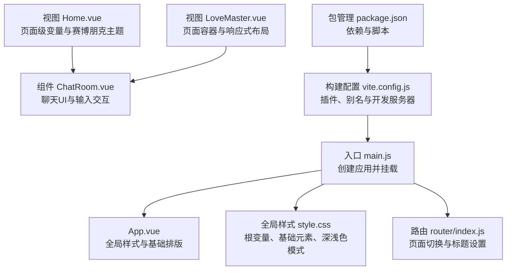
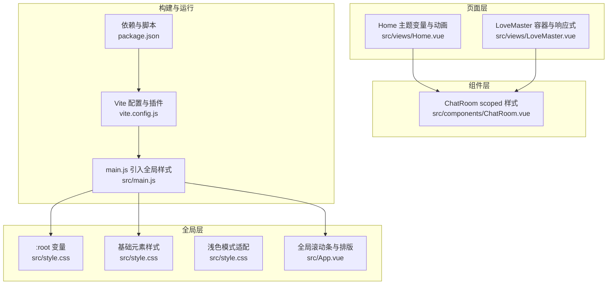
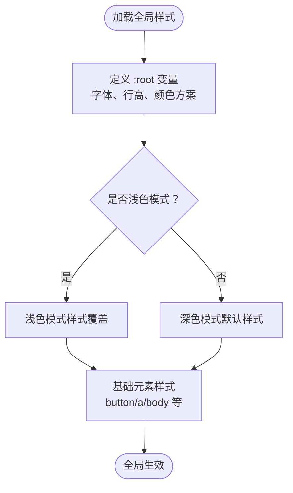
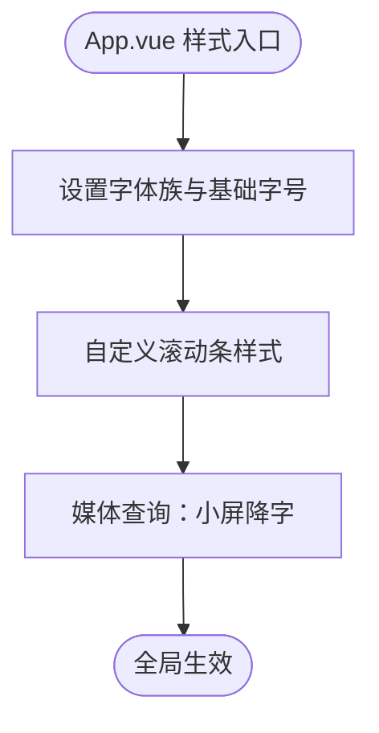
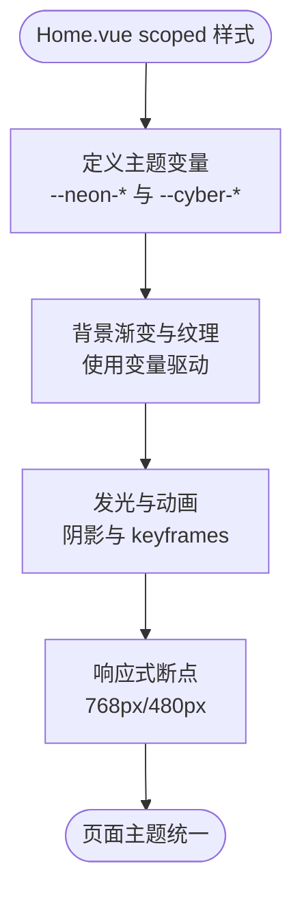
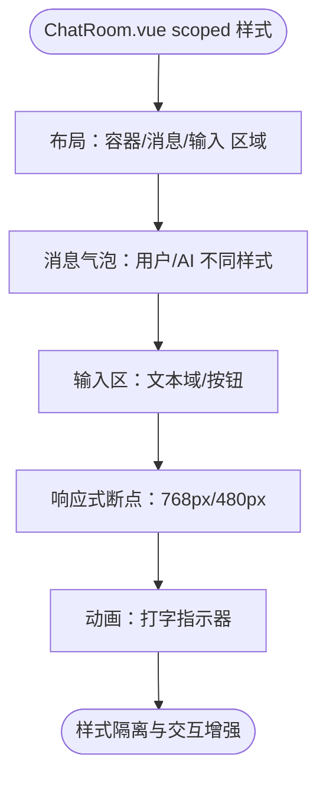
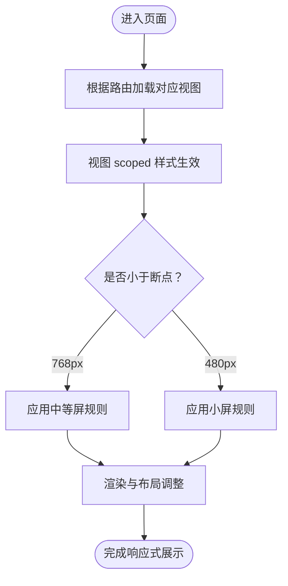
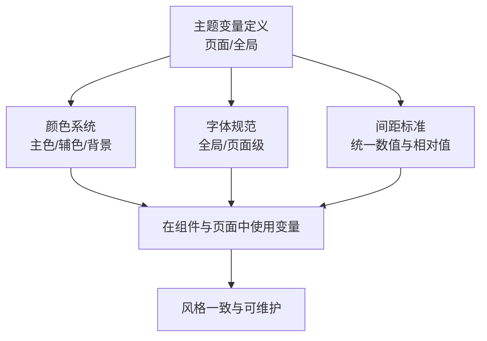
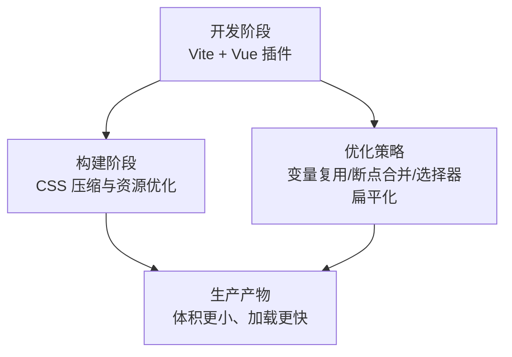
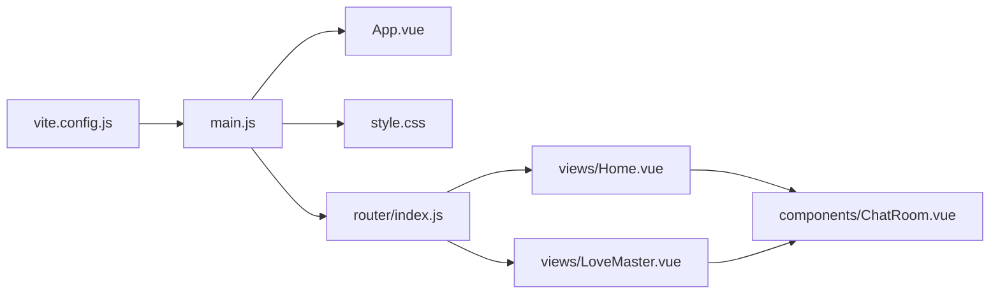

# 样式设计

<cite>
**本文引用的文件**
- [src/style.css](file://yu-ai-agent-frontend/src/style.css)
- [src/main.js](file://yu-ai-agent-frontend/src/main.js)
- [src/App.vue](file://yu-ai-agent-frontend/src/App.vue)
- [vite.config.js](file://yu-ai-agent-frontend/vite.config.js)
- [package.json](file://yu-ai-agent-frontend/package.json)
- [src/views/Home.vue](file://yu-ai-agent-frontend/src/views/Home.vue)
- [src/views/LoveMaster.vue](file://yu-ai-agent-frontend/src/views/LoveMaster.vue)
- [src/components/ChatRoom.vue](file://yu-ai-agent-frontend/src/components/ChatRoom.vue)
- [src/router/index.js](file://yu-ai-agent-frontend/src/router/index.js)
</cite>

## 目录
1. [引言](#引言)
2. [项目结构](#项目结构)
3. [核心组件](#核心组件)
4. [架构总览](#架构总览)
5. [详细组件分析](#详细组件分析)
6. [依赖分析](#依赖分析)
7. [性能考虑](#性能考虑)
8. [故障排查指南](#故障排查指南)
9. [结论](#结论)
10. [附录](#附录)

## 引言
本文件系统性梳理前端项目的样式设计与CSS组织方式，覆盖全局样式、组件样式、样式模块化、响应式设计、主题定制与变量使用、组件样式最佳实践（含BEM思想、样式隔离、性能优化）以及CSS预处理与构建优化策略。文档以实际源码为依据，配合图示帮助读者快速理解并落地实施。

## 项目结构
前端采用Vue 3 + Vite的单页应用架构，样式组织遵循“全局样式 + 视图/组件作用域样式”的分层模式：
- 全局基础样式：通过入口引入的全局样式文件统一字体、颜色、滚动条、基础排版与暗色/亮色模式适配。
- 视图级样式：每个页面视图包含自身scoped样式，定义页面级主题变量、布局与动画。
- 组件级样式：通用组件（如聊天室）使用scoped样式，保证样式隔离与复用。
- 构建工具：Vite负责开发服务器、热更新与打包，支持Vue单文件组件与路径别名。

**图表来源**
- [src/main.js:1-13](file://yu-ai-agent-frontend/src/main.js#L1-L13)
- [src/App.vue:1-73](file://yu-ai-agent-frontend/src/App.vue#L1-L73)
- [src/style.css:1-79](file://yu-ai-agent-frontend/src/style.css#L1-L79)
- [src/views/Home.vue:1-524](file://yu-ai-agent-frontend/src/views/Home.vue#L1-L524)
- [src/views/LoveMaster.vue:1-244](file://yu-ai-agent-frontend/src/views/LoveMaster.vue#L1-L244)
- [src/components/ChatRoom.vue:1-392](file://yu-ai-agent-frontend/src/components/ChatRoom.vue#L1-L392)
- [src/router/index.js:1-47](file://yu-ai-agent-frontend/src/router/index.js#L1-L47)
- [vite.config.js:1-18](file://yu-ai-agent-frontend/vite.config.js#L1-L18)
- [package.json:1-22](file://yu-ai-agent-frontend/package.json#L1-L22)

**章节来源**
- [src/main.js:1-13](file://yu-ai-agent-frontend/src/main.js#L1-L13)
- [src/App.vue:1-73](file://yu-ai-agent-frontend/src/App.vue#L1-L73)
- [src/style.css:1-79](file://yu-ai-agent-frontend/src/style.css#L1-L79)
- [vite.config.js:1-18](file://yu-ai-agent-frontend/vite.config.js#L1-L18)
- [package.json:1-22](file://yu-ai-agent-frontend/package.json#L1-L22)

## 核心组件
- 全局样式与根变量
  - 在全局样式中定义系统字体、行高、深浅色方案与基础元素样式，并通过媒体查询适配浅色模式。
  - 参考：[src/style.css:1-79](file://yu-ai-agent-frontend/src/style.css#L1-L79)
- 应用根样式与滚动条
  - 在应用根组件中定义全局字体族、字号、背景色、滚动条样式与响应式字体缩放。
  - 参考：[src/App.vue:9-72](file://yu-ai-agent-frontend/src/App.vue#L9-L72)
- 页面级主题与变量
  - 在视图组件内定义页面级CSS变量（如赛博朋克主题色），并通过变量驱动颜色、阴影与渐变。
  - 参考：[src/views/Home.vue:76-87](file://yu-ai-agent-frontend/src/views/Home.vue#L76-L87)
- 组件级样式隔离
  - 使用scoped样式限定组件样式边界，避免污染全局或影响其他组件。
  - 参考：[src/components/ChatRoom.vue:122](file://yu-ai-agent-frontend/src/components/ChatRoom.vue#L122)

**章节来源**
- [src/style.css:1-79](file://yu-ai-agent-frontend/src/style.css#L1-L79)
- [src/App.vue:9-72](file://yu-ai-agent-frontend/src/App.vue#L9-L72)
- [src/views/Home.vue:76-87](file://yu-ai-agent-frontend/src/views/Home.vue#L76-L87)
- [src/components/ChatRoom.vue:122](file://yu-ai-agent-frontend/src/components/ChatRoom.vue#L122)

## 架构总览
样式架构围绕“全局基线 + 页面主题 + 组件隔离”三层展开，结合媒体查询实现响应式布局；通过CSS变量实现主题定制与动态切换；借助Vite构建链路完成样式打包与优化。

**图表来源**
- [src/style.css:1-79](file://yu-ai-agent-frontend/src/style.css#L1-L79)
- [src/App.vue:9-72](file://yu-ai-agent-frontend/src/App.vue#L9-L72)
- [src/views/Home.vue:76-87](file://yu-ai-agent-frontend/src/views/Home.vue#L76-L87)
- [src/views/LoveMaster.vue:131-244](file://yu-ai-agent-frontend/src/views/LoveMaster.vue#L131-L244)
- [src/components/ChatRoom.vue:122-392](file://yu-ai-agent-frontend/src/components/ChatRoom.vue#L122-L392)
- [src/main.js:1-13](file://yu-ai-agent-frontend/src/main.js#L1-L13)
- [vite.config.js:1-18](file://yu-ai-agent-frontend/vite.config.js#L1-L18)
- [package.json:1-22](file://yu-ai-agent-frontend/package.json#L1-L22)

## 详细组件分析

### 全局样式与根变量（style.css）
- 字体与行高：定义系统字体栈与行高，提升可读性与一致性。
- 深浅色模式：通过根伪类与媒体查询切换颜色与背景，实现系统跟随。
- 基础元素：重置margin/padding，统一按钮、链接、卡片等基础组件外观。
- 性能与可访问性：启用字体平滑与渲染优化，减少闪烁。

**图表来源**
- [src/style.css:1-79](file://yu-ai-agent-frontend/src/style.css#L1-L79)

**章节来源**
- [src/style.css:1-79](file://yu-ai-agent-frontend/src/style.css#L1-L79)

### 应用根样式与滚动条（App.vue）
- 字体族与字号：指定中文友好字体栈，移动端按断点缩小字号。
- 滚动条自定义：统一滚动条宽度、轨道与滑块颜色，增强视觉一致性。
- 响应式排版：在小屏设备上降低字号，保证阅读舒适度。

**图表来源**
- [src/App.vue:16-72](file://yu-ai-agent-frontend/src/App.vue#L16-L72)

**章节来源**
- [src/App.vue:16-72](file://yu-ai-agent-frontend/src/App.vue#L16-L72)

### 页面级主题与变量（Home.vue）
- 主题变量：在页面根节点定义一组CSS变量，承载赛博朋克风格的主色调与辅助色。
- 渐变与背景：使用变量驱动背景渐变与纹理，形成统一的视觉基调。
- 动画与阴影：通过变量控制发光、阴影与动画强度，保持风格一致。
- 响应式断点：针对768px与480px进行布局与字号微调，兼顾桌面与移动体验。

**图表来源**
- [src/views/Home.vue:76-87](file://yu-ai-agent-frontend/src/views/Home.vue#L76-L87)
- [src/views/Home.vue:94-100](file://yu-ai-agent-frontend/src/views/Home.vue#L94-L100)
- [src/views/Home.vue:399-452](file://yu-ai-agent-frontend/src/views/Home.vue#L399-L452)
- [src/views/Home.vue:454-524](file://yu-ai-agent-frontend/src/views/Home.vue#L454-L524)

**章节来源**
- [src/views/Home.vue:76-87](file://yu-ai-agent-frontend/src/views/Home.vue#L76-L87)
- [src/views/Home.vue:94-100](file://yu-ai-agent-frontend/src/views/Home.vue#L94-L100)
- [src/views/Home.vue:399-452](file://yu-ai-agent-frontend/src/views/Home.vue#L399-L452)
- [src/views/Home.vue:454-524](file://yu-ai-agent-frontend/src/views/Home.vue#L454-L524)

### 组件级样式与样式隔离（ChatRoom.vue）
- 样式隔离：使用scoped限定组件样式，避免跨组件污染。
- 布局与交互：聊天容器、消息气泡、输入区均采用flex布局与定位，保证在不同尺寸下稳定呈现。
- 响应式细节：在小屏设备上调整消息最大宽度、字号与输入区高度，提升可用性。
- 动画与状态：打字指示器、连续消息的气泡衔接与头像可见性控制，增强交互反馈。

**图表来源**
- [src/components/ChatRoom.vue:122-392](file://yu-ai-agent-frontend/src/components/ChatRoom.vue#L122-L392)

**章节来源**
- [src/components/ChatRoom.vue:122-392](file://yu-ai-agent-frontend/src/components/ChatRoom.vue#L122-L392)

### 响应式设计流程（从代码到实现）

**图表来源**
- [src/views/Home.vue:454-524](file://yu-ai-agent-frontend/src/views/Home.vue#L454-L524)
- [src/views/LoveMaster.vue:200-244](file://yu-ai-agent-frontend/src/views/LoveMaster.vue#L200-L244)
- [src/components/ChatRoom.vue:316-362](file://yu-ai-agent-frontend/src/components/ChatRoom.vue#L316-L362)

**章节来源**
- [src/views/Home.vue:454-524](file://yu-ai-agent-frontend/src/views/Home.vue#L454-L524)
- [src/views/LoveMaster.vue:200-244](file://yu-ai-agent-frontend/src/views/LoveMaster.vue#L200-L244)
- [src/components/ChatRoom.vue:316-362](file://yu-ai-agent-frontend/src/components/ChatRoom.vue#L316-L362)

### 主题定制与样式变量使用
- 颜色系统
  - 页面级变量：在视图中集中定义主题色（如霓虹蓝、紫、粉）与深浅背景色，便于统一风格。
  - 全局变量：在全局样式中定义基础色与深浅模式切换，保证组件与页面协同。
- 字体规范
  - 全局字体栈：确保中英文与多语言环境下的可读性。
  - 页面级字体：在视图中引入特定字体家族，强化品牌风格。
- 间距标准
  - 采用相对单位与固定数值组合，保证在不同断点下的一致性与可预测性。

**图表来源**
- [src/views/Home.vue:76-87](file://yu-ai-agent-frontend/src/views/Home.vue#L76-L87)
- [src/style.css:1-14](file://yu-ai-agent-frontend/src/style.css#L1-L14)
- [src/App.vue:16-24](file://yu-ai-agent-frontend/src/App.vue#L16-L24)

**章节来源**
- [src/views/Home.vue:76-87](file://yu-ai-agent-frontend/src/views/Home.vue#L76-L87)
- [src/style.css:1-14](file://yu-ai-agent-frontend/src/style.css#L1-L14)
- [src/App.vue:16-24](file://yu-ai-agent-frontend/src/App.vue#L16-L24)

### 组件样式最佳实践
- BEM思想
  - 类名采用“块-元素-修饰符”风格，如消息块、消息气泡、用户消息、AI消息等，清晰表达层级与状态。
  - 参考：[src/components/ChatRoom.vue:148-170](file://yu-ai-agent-frontend/src/components/ChatRoom.vue#L148-L170)
- 样式隔离
  - 使用scoped限定组件样式，避免全局污染；必要时通过深度选择器与CSS变量进行有限穿透。
  - 参考：[src/components/ChatRoom.vue:122](file://yu-ai-agent-frontend/src/components/ChatRoom.vue#L122)
- 性能优化
  - 减少重绘与回流：优先使用transform与opacity动画；合理使用will-change。
  - 选择器扁平化：避免深层后代选择器，降低匹配成本。
  - 响应式断点合并：在多个组件中复用同一断点，减少重复规则。
  - 参考：[src/views/Home.vue:399-452](file://yu-ai-agent-frontend/src/views/Home.vue#L399-L452)、[src/components/ChatRoom.vue:316-362](file://yu-ai-agent-frontend/src/components/ChatRoom.vue#L316-L362)

**章节来源**
- [src/components/ChatRoom.vue:122-170](file://yu-ai-agent-frontend/src/components/ChatRoom.vue#L122-L170)
- [src/views/Home.vue:399-452](file://yu-ai-agent-frontend/src/views/Home.vue#L399-L452)
- [src/components/ChatRoom.vue:316-362](file://yu-ai-agent-frontend/src/components/ChatRoom.vue#L316-L362)

### CSS预处理器与构建优化
- 预处理器使用现状
  - 当前项目未直接使用CSS预处理器（如Sass/Less），而是通过原生CSS变量与媒体查询实现主题与响应式。
- 构建与优化策略
  - Vite内置CSS处理与压缩，生产构建自动去除注释与空白，合并重复规则。
  - 通过别名与插件提升开发体验（如Vue单文件组件支持）。
  - 可选扩展：若未来需要嵌套语法、混合器与模块化，可在Vite中集成Sass/Less插件，但需评估学习与迁移成本。

**图表来源**
- [vite.config.js:1-18](file://yu-ai-agent-frontend/vite.config.js#L1-L18)
- [package.json:17-20](file://yu-ai-agent-frontend/package.json#L17-L20)

**章节来源**
- [vite.config.js:1-18](file://yu-ai-agent-frontend/vite.config.js#L1-L18)
- [package.json:17-20](file://yu-ai-agent-frontend/package.json#L17-L20)

## 依赖分析
- 入口依赖关系
  - 入口文件引入全局样式与路由，随后挂载应用。
  - 参考：[src/main.js:1-13](file://yu-ai-agent-frontend/src/main.js#L1-L13)
- 路由与页面
  - 路由配置决定页面组件加载时机，页面组件再引入各自scoped样式。
  - 参考：[src/router/index.js:1-47](file://yu-ai-agent-frontend/src/router/index.js#L1-L47)
- 构建链路
  - Vite配置启用Vue插件与路径别名，简化导入路径。
  - 参考：[vite.config.js:1-18](file://yu-ai-agent-frontend/vite.config.js#L1-L18)

**图表来源**
- [src/main.js:1-13](file://yu-ai-agent-frontend/src/main.js#L1-L13)
- [src/router/index.js:1-47](file://yu-ai-agent-frontend/src/router/index.js#L1-L47)
- [src/views/Home.vue:1-524](file://yu-ai-agent-frontend/src/views/Home.vue#L1-L524)
- [src/views/LoveMaster.vue:1-244](file://yu-ai-agent-frontend/src/views/LoveMaster.vue#L1-L244)
- [src/components/ChatRoom.vue:1-392](file://yu-ai-agent-frontend/src/components/ChatRoom.vue#L1-L392)
- [vite.config.js:1-18](file://yu-ai-agent-frontend/vite.config.js#L1-L18)

**章节来源**
- [src/main.js:1-13](file://yu-ai-agent-frontend/src/main.js#L1-L13)
- [src/router/index.js:1-47](file://yu-ai-agent-frontend/src/router/index.js#L1-L47)
- [vite.config.js:1-18](file://yu-ai-agent-frontend/vite.config.js#L1-L18)

## 性能考虑
- 选择器复杂度控制：避免深层后代选择器与通配符，减少样式匹配开销。
- 动画与合成层：优先使用transform与opacity触发合成层，降低重绘频率。
- 响应式断点收敛：在多组件中统一断点，减少重复规则与匹配次数。
- 资源体积：利用构建工具压缩CSS，移除未使用规则，控制首屏样式体积。

## 故障排查指南
- 浅色/深色模式不生效
  - 检查根变量与媒体查询是否正确覆盖颜色与背景。
  - 参考：[src/style.css:67-78](file://yu-ai-agent-frontend/src/style.css#L67-L78)
- 移动端排版异常
  - 确认媒体查询断点与字体缩放逻辑是否生效。
  - 参考：[src/App.vue:40-51](file://yu-ai-agent-frontend/src/App.vue#L40-L51)、[src/views/Home.vue:454-524](file://yu-ai-agent-frontend/src/views/Home.vue#L454-L524)
- 组件样式被覆盖
  - 确保使用scoped或提升选择器特异性；必要时通过CSS变量解耦。
  - 参考：[src/components/ChatRoom.vue:122](file://yu-ai-agent-frontend/src/components/ChatRoom.vue#L122)
- 打字指示器动画卡顿
  - 检查动画帧率与合成层使用，避免频繁触发重排。
  - 参考：[src/components/ChatRoom.vue:299-309](file://yu-ai-agent-frontend/src/components/ChatRoom.vue#L299-L309)

**章节来源**
- [src/style.css:67-78](file://yu-ai-agent-frontend/src/style.css#L67-L78)
- [src/App.vue:40-51](file://yu-ai-agent-frontend/src/App.vue#L40-L51)
- [src/views/Home.vue:454-524](file://yu-ai-agent-frontend/src/views/Home.vue#L454-L524)
- [src/components/ChatRoom.vue:122](file://yu-ai-agent-frontend/src/components/ChatRoom.vue#L122)
- [src/components/ChatRoom.vue:299-309](file://yu-ai-agent-frontend/src/components/ChatRoom.vue#L299-L309)

## 结论
本项目采用“全局基线 + 页面主题 + 组件隔离”的样式架构，结合CSS变量与媒体查询实现主题定制与响应式适配。通过scoped样式与扁平化选择器策略，既保证了组件复用与隔离，也兼顾了性能与可维护性。未来如需更复杂的样式工程化，可在现有Vite生态中引入预处理器，但需权衡成本与收益。

## 附录
- 关键实现位置速览
  - 全局样式与根变量：[src/style.css:1-79](file://yu-ai-agent-frontend/src/style.css#L1-L79)
  - 应用根样式与滚动条：[src/App.vue:9-72](file://yu-ai-agent-frontend/src/App.vue#L9-L72)
  - 页面主题变量与动画：[src/views/Home.vue:76-87](file://yu-ai-agent-frontend/src/views/Home.vue#L76-L87)、[src/views/Home.vue:399-452](file://yu-ai-agent-frontend/src/views/Home.vue#L399-L452)
  - 组件样式隔离与响应式：[src/components/ChatRoom.vue:122-392](file://yu-ai-agent-frontend/src/components/ChatRoom.vue#L122-L392)
  - 构建与入口：[src/main.js:1-13](file://yu-ai-agent-frontend/src/main.js#L1-L13)、[vite.config.js:1-18](file://yu-ai-agent-frontend/vite.config.js#L1-L18)、[package.json:1-22](file://yu-ai-agent-frontend/package.json#L1-L22)