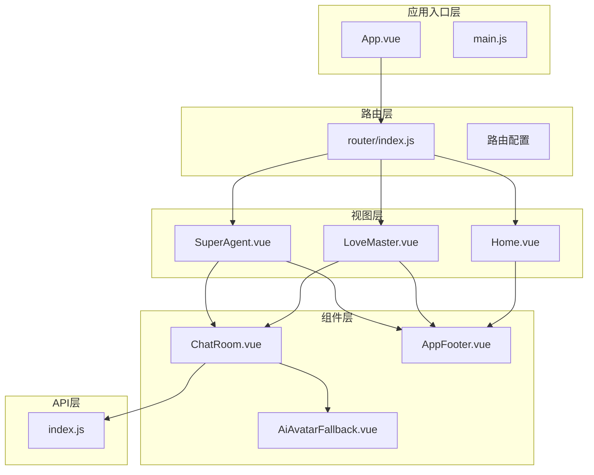
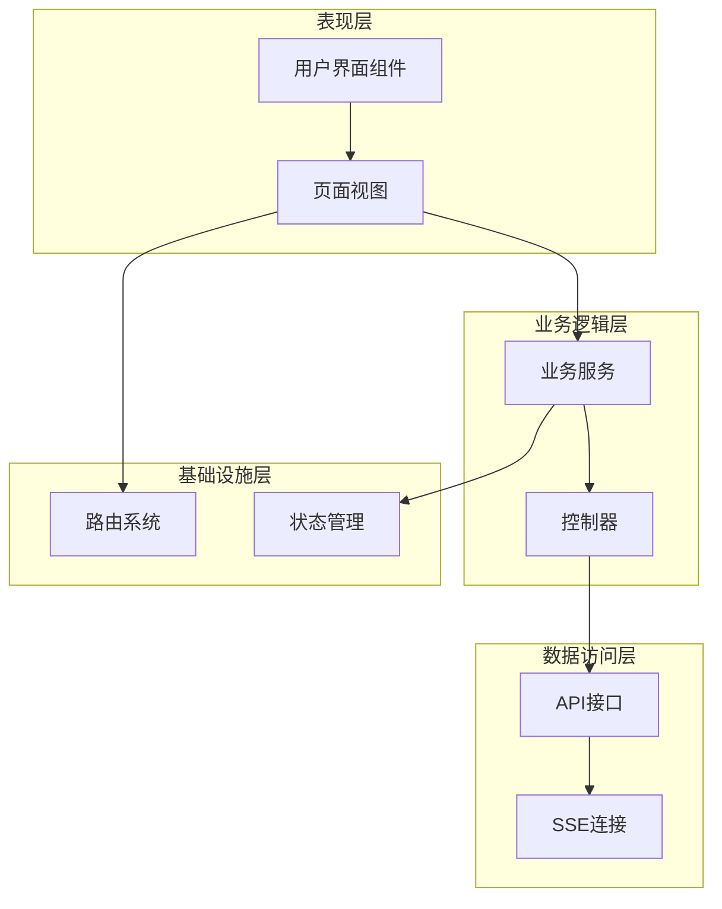
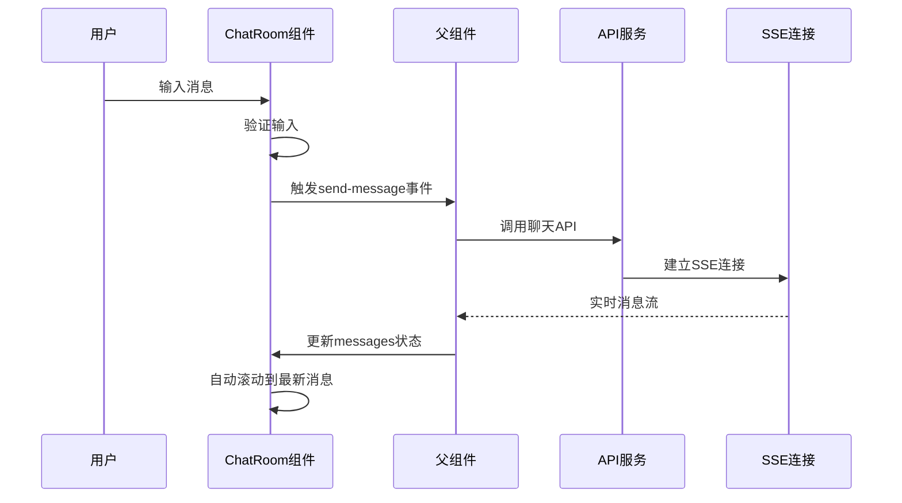
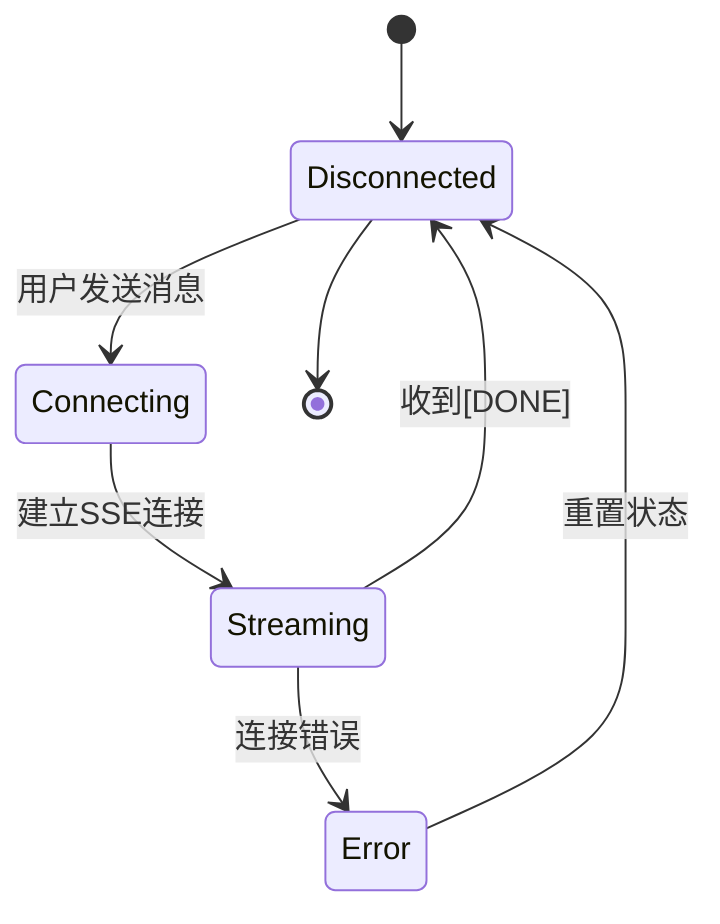
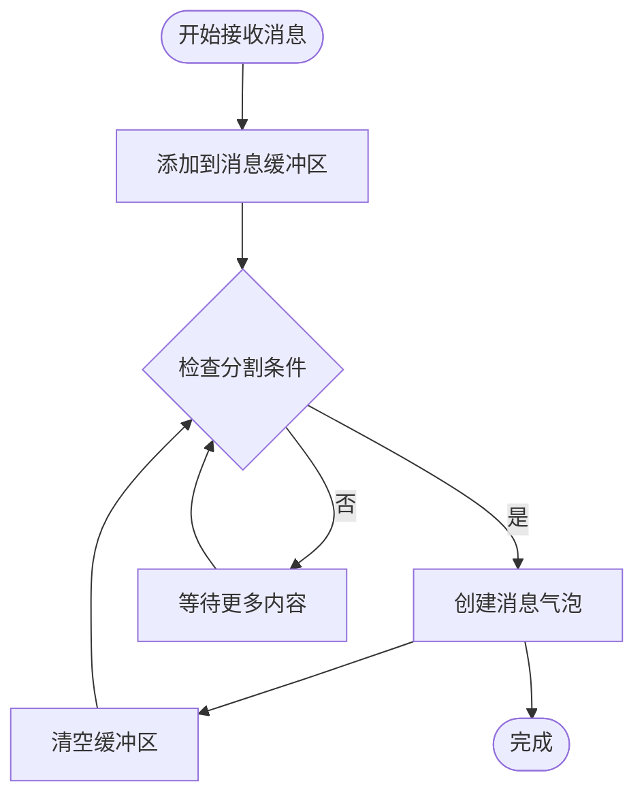
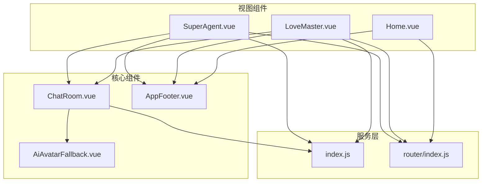

# 组件架构设计

<cite>
**本文档引用的文件**
- [ChatRoom.vue](file://yu-ai-agent-frontend/src/components/ChatRoom.vue)
- [AiAvatarFallback.vue](file://yu-ai-agent-frontend/src/components/AiAvatarFallback.vue)
- [AppFooter.vue](file://yu-ai-agent-frontend/src/components/AppFooter.vue)
- [LoveMaster.vue](file://yu-ai-agent-frontend/src/views/LoveMaster.vue)
- [SuperAgent.vue](file://yu-ai-agent-frontend/src/views/SuperAgent.vue)
- [Home.vue](file://yu-ai-agent-frontend/src/views/Home.vue)
- [index.js](file://yu-ai-agent-frontend/src/api/index.js)
- [main.js](file://yu-ai-agent-frontend/src/main.js)
- [router/index.js](file://yu-ai-agent-frontend/src/router/index.js)
- [App.vue](file://yu-ai-agent-frontend/src/App.vue)
- [package.json](file://yu-ai-agent-frontend/package.json)
- [style.css](file://yu-ai-agent-frontend/src/style.css)
</cite>

## 目录
1. [引言](#引言)
2. [项目结构](#项目结构)
3. [核心组件](#核心组件)
4. [架构概览](#架构概览)
5. [详细组件分析](#详细组件分析)
6. [依赖关系分析](#依赖关系分析)
7. [性能考虑](#性能考虑)
8. [故障排除指南](#故障排除指南)
9. [结论](#结论)

## 引言

本指南深入解析鱼皮AI超级智能体应用平台的前端组件架构设计。该项目采用Vue 3 + Vite技术栈构建，实现了两个主要AI聊天应用：AI恋爱大师和AI超级智能体。系统通过组件化的架构设计，提供了可复用、可扩展的聊天界面组件，支持实时消息传输和丰富的用户体验。

## 项目结构

项目采用典型的Vue 3单页应用结构，主要分为以下几个层次：



**图表来源**
- [main.js:1-13](file://yu-ai-agent-frontend/src/main.js#L1-L13)
- [router/index.js:1-47](file://yu-ai-agent-frontend/src/router/index.js#L1-L47)
- [App.vue:1-73](file://yu-ai-agent-frontend/src/App.vue#L1-L73)

**章节来源**
- [main.js:1-13](file://yu-ai-agent-frontend/src/main.js#L1-L13)
- [router/index.js:1-47](file://yu-ai-agent-frontend/src/router/index.js#L1-L47)
- [App.vue:1-73](file://yu-ai-agent-frontend/src/App.vue#L1-L73)

## 核心组件

### ChatRoom聊天室组件

ChatRoom是整个应用的核心组件，负责处理所有聊天相关的UI逻辑和交互。该组件采用了现代化的Vue 3 Composition API模式，实现了完整的聊天功能。

#### 组件特性

1. **响应式消息显示**：支持用户消息和AI消息的不同样式展示
2. **实时状态管理**：通过props接收连接状态，动态更新UI
3. **自动滚动功能**：新消息到达时自动滚动到最新位置
4. **输入验证**：防止发送空消息
5. **样式隔离**：使用scoped样式确保组件样式不冲突

#### 关键实现模式

组件使用了多种Vue 3高级特性：
- `defineProps`定义属性接口
- `defineEmits`声明事件发射
- `ref`和`reactive`进行状态管理
- `computed`计算属性优化渲染
- `watch`监听状态变化
- `onMounted`生命周期钩子

**章节来源**
- [ChatRoom.vue:55-120](file://yu-ai-agent-frontend/src/components/ChatRoom.vue#L55-L120)

### AI头像组件

AiAvatarFallback组件提供了AI角色的头像显示功能，支持不同AI类型的差异化展示。

#### 设计特点

- **类型化头像**：根据AI类型显示不同的视觉元素
- **渐变背景**：使用CSS渐变创建现代感的视觉效果
- **响应式设计**：适配不同屏幕尺寸

**章节来源**
- [AiAvatarFallback.vue:1-35](file://yu-ai-agent-frontend/src/components/AiAvatarFallback.vue#L1-L35)

### 应用页脚组件

AppFooter组件提供统一的应用页脚布局，包含版权信息和导航链接。

#### 组件结构

- **多列布局**：合理分布不同类型的链接信息
- **响应式设计**：在移动设备上自动调整布局
- **品牌一致性**：保持整体设计风格统一

**章节来源**
- [AppFooter.vue:1-166](file://yu-ai-agent-frontend/src/components/AppFooter.vue#L1-L166)

## 架构概览

系统采用分层架构设计，各层职责明确，耦合度低，便于维护和扩展。



**图表来源**
- [LoveMaster.vue:26-129](file://yu-ai-agent-frontend/src/views/LoveMaster.vue#L26-L129)
- [SuperAgent.vue:26-176](file://yu-ai-agent-frontend/src/views/SuperAgent.vue#L26-L176)
- [index.js:14-60](file://yu-ai-agent-frontend/src/api/index.js#L14-L60)

### 组件通信机制

系统中的组件通信主要通过以下几种方式实现：

#### Props传递
- 父组件向子组件传递数据
- ChatRoom组件接收messages数组和connectionStatus状态
- aiType属性决定AI角色类型

#### 事件触发
- 子组件通过自定义事件向上层传递用户操作
- ChatRoom组件发出send-message事件
- 父组件监听并处理消息发送逻辑

#### 插槽使用
- 组件支持内容投影，增强可定制性
- Footer组件支持自定义内容插入

**章节来源**
- [ChatRoom.vue:59-74](file://yu-ai-agent-frontend/src/components/ChatRoom.vue#L59-L74)
- [LoveMaster.vue:11-16](file://yu-ai-agent-frontend/src/views/LoveMaster.vue#L11-L16)
- [SuperAgent.vue:11-16](file://yu-ai-agent-frontend/src/views/SuperAgent.vue#L11-L16)

## 详细组件分析

### ChatRoom组件深度分析

#### 数据流设计



**图表来源**
- [ChatRoom.vue:87-92](file://yu-ai-agent-frontend/src/components/ChatRoom.vue#L87-L92)
- [LoveMaster.vue:70-107](file://yu-ai-agent-frontend/src/views/LoveMaster.vue#L70-L107)
- [SuperAgent.vue:65-157](file://yu-ai-agent-frontend/src/views/SuperAgent.vue#L65-L157)

#### 状态管理模式

ChatRoom组件采用集中式状态管理：

1. **消息状态**：通过props接收外部传入的消息数组
2. **输入状态**：使用ref管理用户输入内容
3. **连接状态**：接收父组件传递的连接状态
4. **AI类型状态**：根据aiType属性切换不同样式

#### 性能优化策略

- **虚拟滚动**：对于大量消息的场景，可考虑实现虚拟滚动
- **防抖处理**：输入验证和发送按钮的状态更新
- **懒加载**：图片资源的懒加载优化
- **内存管理**：及时清理SSE连接和事件监听器

**章节来源**
- [ChatRoom.vue:101-119](file://yu-ai-agent-frontend/src/components/ChatRoom.vue#L101-L119)
- [ChatRoom.vue:122-392](file://yu-ai-agent-frontend/src/components/ChatRoom.vue#L122-L392)

### 视图组件分析

#### LoveMaster视图组件

LoveMaster专门负责AI恋爱大师功能，实现了情感咨询场景的完整流程。

##### 核心功能实现

1. **会话管理**：生成唯一聊天ID，管理用户会话状态
2. **SSE集成**：建立与后端的实时消息连接
3. **消息聚合**：将流式消息聚合为完整回答
4. **错误处理**：优雅处理网络异常和连接错误

##### 状态管理流程



**图表来源**
- [LoveMaster.vue:50-107](file://yu-ai-agent-frontend/src/views/LoveMaster.vue#L50-L107)

**章节来源**
- [LoveMaster.vue:26-129](file://yu-ai-agent-frontend/src/views/LoveMaster.vue#L26-L129)

#### SuperAgent视图组件

SuperAgent提供AI超级智能体服务，具有更复杂的消息处理逻辑。

##### 智能消息分割

组件实现了基于中文标点符号和长度的智能消息分割：

- **句子边界检测**：识别中文句号、问号、感叹号等
- **长度阈值控制**：超过40字符强制分割
- **时间间隔控制**：最小800毫秒的消息间隔
- **气泡样式区分**：首次消息、中间消息、最终消息使用不同样式

##### 消息分割算法



**图表来源**
- [SuperAgent.vue:84-108](file://yu-ai-agent-frontend/src/views/SuperAgent.vue#L84-L108)

**章节来源**
- [SuperAgent.vue:26-176](file://yu-ai-agent-frontend/src/views/SuperAgent.vue#L26-L176)

### API服务层

#### SSE连接管理

API模块提供了统一的SSE连接管理服务：

1. **连接封装**：统一的EventSource创建和管理
2. **参数处理**：自动处理查询参数编码
3. **错误处理**：标准化的错误回调机制
4. **生命周期管理**：确保连接正确关闭

#### 环境适配

- **开发环境**：连接本地后端服务（localhost:8123）
- **生产环境**：使用相对路径，适应同源部署
- **超时控制**：60秒的请求超时设置

**章节来源**
- [index.js:14-60](file://yu-ai-agent-frontend/src/api/index.js#L14-L60)

## 依赖关系分析

### 技术栈依赖

```mermaid
graph LR
subgraph "核心框架"
Vue[Vue 3.2.47]
Router[Vue Router 4.1.6]
Head[@vueuse/head 2.0.0]
end
subgraph "构建工具"
Vite[Vite 4.3.9]
Plugin[@vitejs/plugin-vue]
end
subgraph "HTTP客户端"
Axios[Axios 1.3.6]
end
subgraph "应用层"
App[主应用]
Components[组件库]
Views[页面视图]
API[API服务]
end
Vue --> Router
Vue --> Head
Vite --> Plugin
App --> Vue
Components --> Vue
Views --> Vue
API --> Axios
App --> API
```

**图表来源**
- [package.json:11-21](file://yu-ai-agent-frontend/package.json#L11-L21)

### 组件依赖关系



**图表来源**
- [LoveMaster.vue:30-31](file://yu-ai-agent-frontend/src/views/LoveMaster.vue#L30-L31)
- [SuperAgent.vue:30-31](file://yu-ai-agent-frontend/src/views/SuperAgent.vue#L30-L31)
- [router/index.js:1-47](file://yu-ai-agent-frontend/src/router/index.js#L1-L47)

**章节来源**
- [package.json:11-21](file://yu-ai-agent-frontend/package.json#L11-L21)

## 性能考虑

### 渲染优化

1. **虚拟DOM优化**：合理使用key属性，避免不必要的重渲染
2. **组件懒加载**：路由级别的代码分割
3. **样式作用域**：使用scoped样式减少样式冲突
4. **图片优化**：头像资源的懒加载和缓存策略

### 网络性能

1. **SSE连接池**：避免重复创建连接
2. **消息批处理**：合并多个小消息为大消息
3. **连接复用**：同一会话内复用SSE连接
4. **错误重试**：实现指数退避的重连机制

### 内存管理

1. **事件监听器清理**：组件卸载时移除所有事件监听
2. **定时器清理**：及时清除setTimeout和setInterval
3. **SSE连接管理**：确保连接正确关闭
4. **缓存策略**：合理设置消息缓存和过期时间

## 故障排除指南

### 常见问题及解决方案

#### SSE连接失败

**症状**：消息无法实时显示，连接状态显示为error

**排查步骤**：
1. 检查后端服务是否正常运行
2. 验证CORS配置是否正确
3. 查看浏览器开发者工具的Network面板
4. 确认服务器端SSE配置

**解决方案**：
- 实现自动重连机制
- 添加连接状态提示
- 提供手动重连按钮

#### 消息显示异常

**症状**：消息内容显示不完整或格式错误

**排查步骤**：
1. 检查消息数据结构是否符合预期
2. 验证消息内容的HTML转义
3. 确认CSS样式是否正确应用

**解决方案**：
- 实现消息内容的安全处理
- 添加消息格式验证
- 提供消息预览功能

#### 性能问题

**症状**：页面卡顿，消息延迟严重

**排查步骤**：
1. 使用浏览器性能分析工具
2. 检查是否有内存泄漏
3. 分析组件渲染性能

**解决方案**：
- 实现虚拟滚动
- 优化消息列表渲染
- 添加消息数量限制

**章节来源**
- [LoveMaster.vue:102-106](file://yu-ai-agent-frontend/src/views/LoveMaster.vue#L102-L106)
- [SuperAgent.vue:146-156](file://yu-ai-agent-frontend/src/views/SuperAgent.vue#L146-L156)

## 结论

鱼皮AI超级智能体应用平台展现了现代前端组件架构的最佳实践。通过精心设计的组件层次结构、清晰的职责分离和高效的通信机制，系统实现了良好的可维护性和可扩展性。

### 设计亮点

1. **模块化架构**：每个组件都有明确的职责和边界
2. **响应式设计**：全面支持移动端和桌面端
3. **实时通信**：基于SSE的高效消息传输
4. **状态管理**：合理的状态提升和事件传播
5. **性能优化**：多维度的性能考虑和优化策略

### 改进建议

1. **状态管理**：考虑引入Pinia进行全局状态管理
2. **测试覆盖**：增加单元测试和集成测试
3. **文档完善**：补充组件API文档和使用示例
4. **国际化**：支持多语言切换功能
5. **无障碍**：增强无障碍访问支持

该架构为类似AI聊天应用的开发提供了优秀的参考模板，体现了现代前端开发的技术趋势和最佳实践。