# 路由配置

<cite>
**本文档引用的文件**
- [src/router/index.js](file://yu-ai-agent-frontend/src/router/index.js)
- [src/views/Home.vue](file://yu-ai-agent-frontend/src/views/Home.vue)
- [src/views/LoveMaster.vue](file://yu-ai-agent-frontend/src/views/LoveMaster.vue)
- [src/views/SuperAgent.vue](file://yu-ai-agent-frontend/src/views/SuperAgent.vue)
- [src/main.js](file://yu-ai-agent-frontend/src/main.js)
- [src/App.vue](file://yu-ai-agent-frontend/src/App.vue)
- [package.json](file://yu-ai-agent-frontend/package.json)
</cite>

## 目录
1. [简介](#简介)
2. [项目结构](#项目结构)
3. [核心组件](#核心组件)
4. [架构概览](#架构概览)
5. [详细组件分析](#详细组件分析)
6. [依赖关系分析](#依赖关系分析)
7. [性能考虑](#性能考虑)
8. [故障排除指南](#故障排除指南)
9. [结论](#结论)

## 简介

本项目是一个基于Vue 3和Vue Router 4构建的单页面应用程序，专注于AI智能体服务展示。路由系统采用现代Vue Router 4的组合式API设计，实现了简洁而高效的页面导航机制。项目包含三个主要页面：首页、AI恋爱大师和AI超级智能体，每个页面都经过精心设计以提供优秀的用户体验。

## 项目结构

该项目采用标准的Vue 3项目结构，路由配置集中在专门的router目录中：

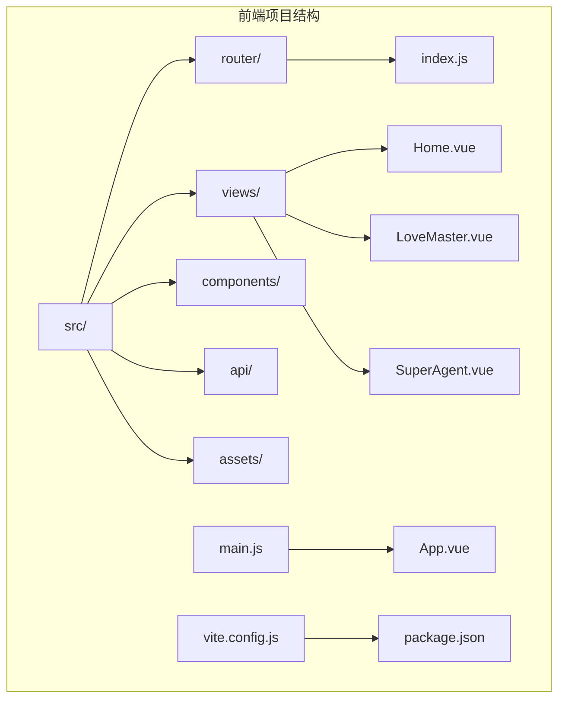

**图表来源**
- [src/router/index.js:1-47](file://yu-ai-agent-frontend/src/router/index.js#L1-L47)
- [src/views/Home.vue:1-524](file://yu-ai-agent-frontend/src/views/Home.vue#L1-L524)
- [src/views/LoveMaster.vue:1-244](file://yu-ai-agent-frontend/src/views/LoveMaster.vue#L1-L244)
- [src/views/SuperAgent.vue:1-286](file://yu-ai-agent-frontend/src/views/SuperAgent.vue#L1-L286)

**章节来源**
- [src/router/index.js:1-47](file://yu-ai-agent-frontend/src/router/index.js#L1-L47)
- [src/main.js:1-13](file://yu-ai-agent-frontend/src/main.js#L1-L13)

## 核心组件

### 路由配置核心

路由系统的核心配置位于router/index.js文件中，采用动态导入的方式实现懒加载：

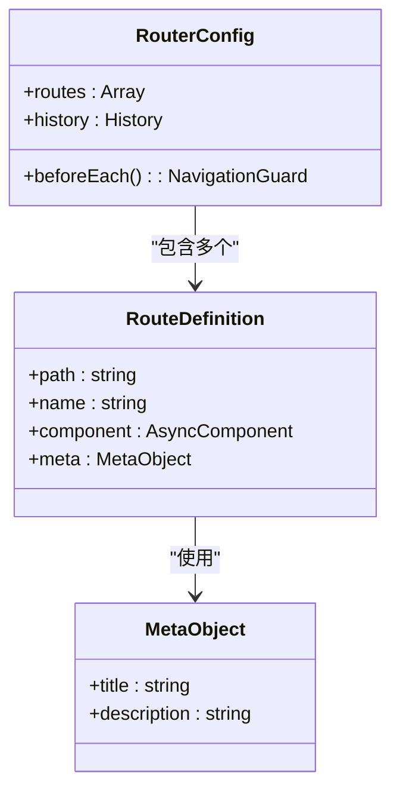

**图表来源**
- [src/router/index.js:3-31](file://yu-ai-agent-frontend/src/router/index.js#L3-L31)

### 应用启动流程

应用通过main.js进行初始化，注册路由和全局head管理：

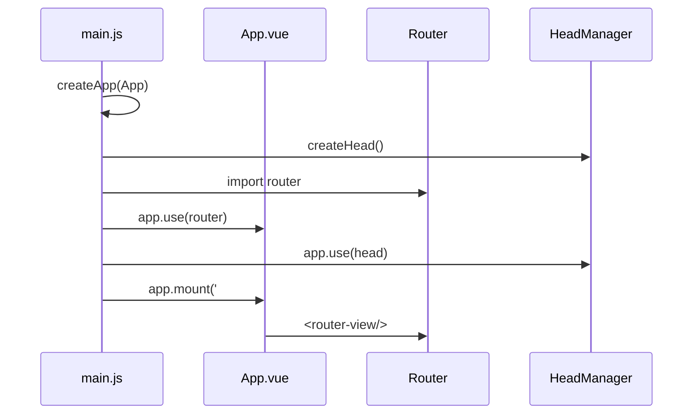

**图表来源**
- [src/main.js:1-13](file://yu-ai-agent-frontend/src/main.js#L1-L13)
- [src/App.vue:5-7](file://yu-ai-agent-frontend/src/App.vue#L5-L7)

**章节来源**
- [src/router/index.js:1-47](file://yu-ai-agent-frontend/src/router/index.js#L1-L47)
- [src/main.js:1-13](file://yu-ai-agent-frontend/src/main.js#L1-L13)

## 架构概览

### 路由系统架构

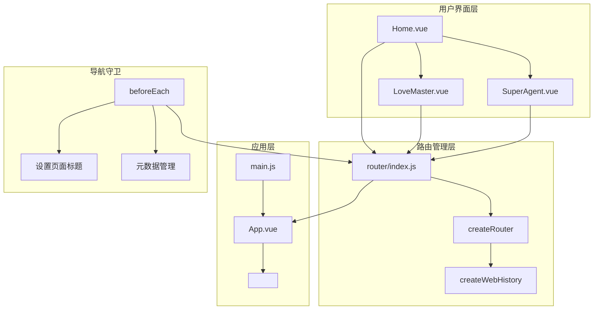

**图表来源**
- [src/router/index.js:33-47](file://yu-ai-agent-frontend/src/router/index.js#L33-L47)
- [src/App.vue:5-7](file://yu-ai-agent-frontend/src/App.vue#L5-L7)

### 页面导航流程

```mermaid
flowchart LR
Start([用户访问应用]) --> CheckRoute{检查路由}
CheckRoute --> |根路径| Home[Home.vue]
CheckRoute --> |/love-master| LoveMaster[LoveMaster.vue]
CheckRoute --> |/super-agent| SuperAgent[SuperAgent.vue]
Home --> ClickLove[点击恋爱大师卡片]
Home --> ClickSuper[点击超级智能体卡片]
ClickLove --> NavigateLove[router.push('/love-master')]
ClickSuper --> NavigateSuper[router.push('/super-agent')]
NavigateLove --> LoveMaster
NavigateSuper --> SuperAgent
LoveMaster --> BackHome[返回首页]
SuperAgent --> BackHome
BackHome --> Home
```

**图表来源**
- [src/router/index.js:3-31](file://yu-ai-agent-frontend/src/router/index.js#L3-L31)
- [src/views/Home.vue:71-73](file://yu-ai-agent-frontend/src/views/Home.vue#L71-L73)

## 详细组件分析

### 路由定义分析

#### 首页路由配置

首页路由配置体现了完整的SEO优化策略：

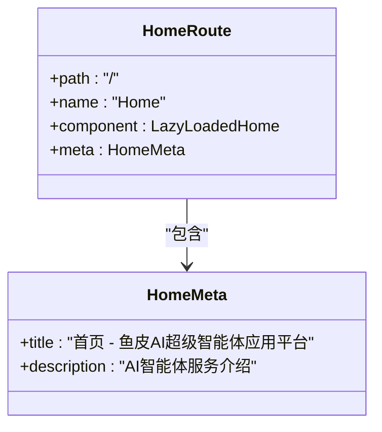

**图表来源**
- [src/router/index.js:4-12](file://yu-ai-agent-frontend/src/router/index.js#L4-L12)

#### 恋爱大师路由配置

恋爱大师路由针对特定应用场景进行了优化：

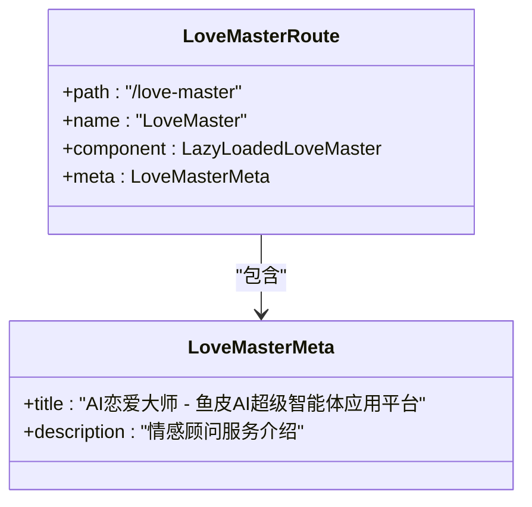

**图表来源**
- [src/router/index.js:13-21](file://yu-ai-agent-frontend/src/router/index.js#L13-L21)

#### 超级智能体路由配置

超级智能体路由展现了更专业的技术特性：

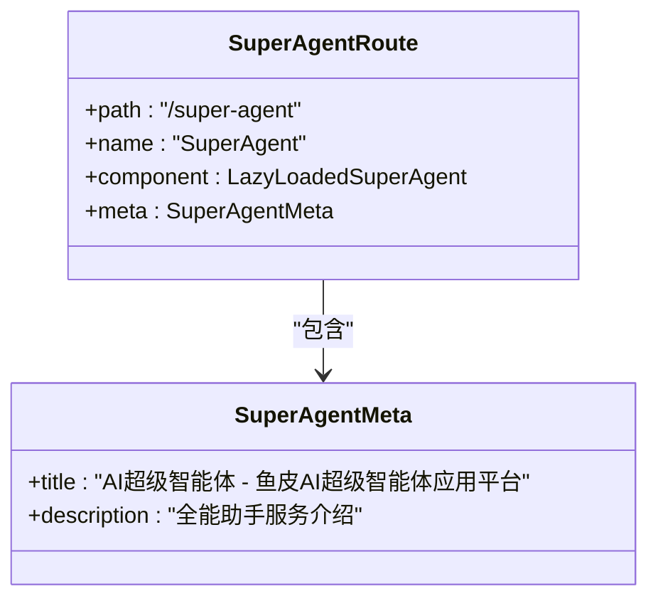

**图表来源**
- [src/router/index.js:22-30](file://yu-ai-agent-frontend/src/router/index.js#L22-L30)

**章节来源**
- [src/router/index.js:3-31](file://yu-ai-agent-frontend/src/router/index.js#L3-L31)

### 视图组件路由映射

#### Home首页组件

Home组件作为入口页面，提供了直观的应用导航：

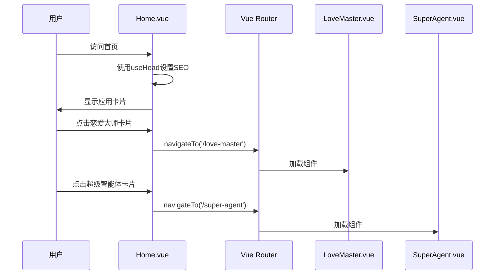

**图表来源**
- [src/views/Home.vue:49-74](file://yu-ai-agent-frontend/src/views/Home.vue#L49-L74)

#### LoveMaster恋爱大师组件

恋爱大师组件实现了完整的聊天功能：

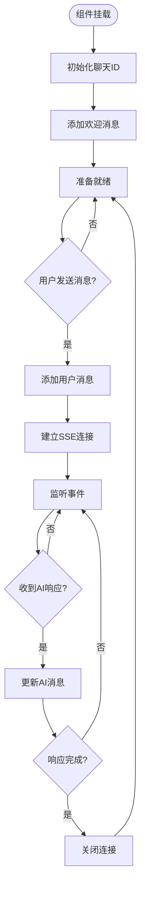

**图表来源**
- [src/views/LoveMaster.vue:69-107](file://yu-ai-agent-frontend/src/views/LoveMaster.vue#L69-L107)

#### SuperAgent超级智能体组件

超级智能体组件展现了更复杂的聊天逻辑：

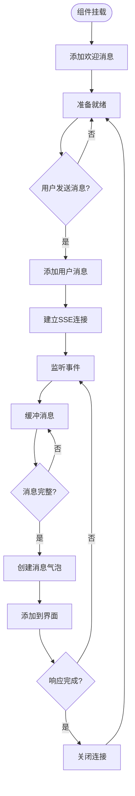

**图表来源**
- [src/views/SuperAgent.vue:64-157](file://yu-ai-agent-frontend/src/views/SuperAgent.vue#L64-L157)

**章节来源**
- [src/views/Home.vue:1-524](file://yu-ai-agent-frontend/src/views/Home.vue#L1-L524)
- [src/views/LoveMaster.vue:1-244](file://yu-ai-agent-frontend/src/views/LoveMaster.vue#L1-L244)
- [src/views/SuperAgent.vue:1-286](file://yu-ai-agent-frontend/src/views/SuperAgent.vue#L1-L286)

### 导航守卫实现

#### 全局前置守卫

项目实现了全局导航守卫来统一管理页面标题：

```mermaid
flowchart TD
Request[路由导航请求] --> Guard[beforeEach守卫]
Guard --> CheckMeta{检查to.meta.title}
CheckMeta --> |存在| SetTitle[设置document.title]
CheckMeta --> |不存在| SkipTitle[跳过设置]
SetTitle --> Next[调用next()]
SkipTitle --> Next
Next --> Component[加载目标组件]
Component --> Complete[导航完成]
```

**图表来源**
- [src/router/index.js:38-45](file://yu-ai-agent-frontend/src/router/index.js#L38-L45)

#### 页面元数据管理

每个路由都配置了相应的SEO元数据：

| 路由 | 页面标题 | 描述 | 关键词 |
|------|----------|------|--------|
| `/` | 首页 - 鱼皮AI超级智能体应用平台 | 鱼皮AI超级智能体应用平台提供AI恋爱大师和AI超级智能体服务，满足您的各种AI对话需求 | AI智能体,AI应用,AI恋爱大师,AI助手,智能对话,鱼皮,AI超级智能体,首页 |
| `/love-master` | AI恋爱大师 - 鱼皮AI超级智能体应用平台 | AI恋爱大师是鱼皮AI超级智能体应用平台的专业情感顾问，帮你解答各种恋爱问题，提供情感建议 | AI恋爱大师,情感顾问,恋爱咨询,AI聊天,情感问题,鱼皮,AI智能体 |
| `/super-agent` | AI超级智能体 - 鱼皮AI超级智能体应用平台 | AI超级智能体是鱼皮AI超级智能体应用平台的全能助手，能解答各类专业问题，提供精准建议和解决方案 | AI超级智能体,智能助手,专业问答,AI问答,专业建议,鱼皮,AI智能体 |

**章节来源**
- [src/router/index.js:8-30](file://yu-ai-agent-frontend/src/router/index.js#L8-L30)

## 依赖关系分析

### 外部依赖

项目的主要依赖关系如下：

```mermaid
graph TD
subgraph "运行时依赖"
A[vue@^3.2.47] --> B[Vue 3核心框架]
C[vue-router@^4.1.6] --> D[Vue Router 4]
E[@vueuse/head@^2.0.0] --> F[Head管理工具]
G[axios@^1.3.6] --> H[HTTP客户端]
end
subgraph "开发依赖"
I[@vitejs/plugin-vue@^4.1.0] --> J[Vite Vue插件]
K[vite@^4.3.9] --> L[Vite构建工具]
end
subgraph "应用集成"
M[main.js] --> A
M --> C
M --> E
N[router/index.js] --> C
end
```

**图表来源**
- [package.json:11-20](file://yu-ai-agent-frontend/package.json#L11-L20)

### 内部模块依赖

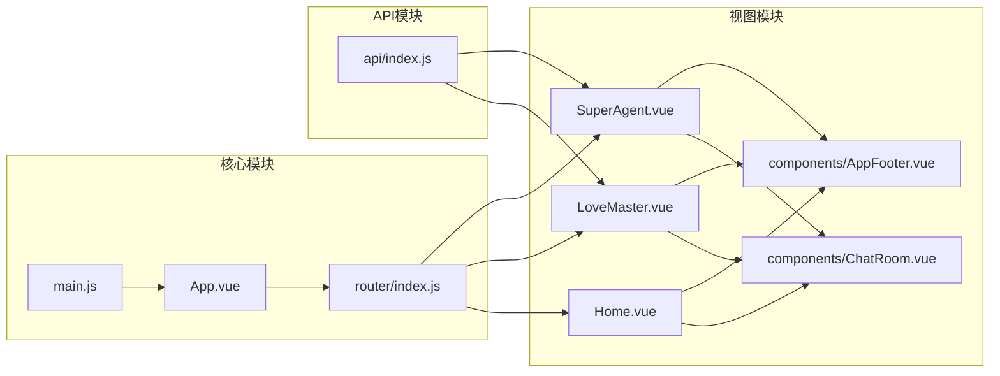

**图表来源**
- [src/main.js:1-13](file://yu-ai-agent-frontend/src/main.js#L1-L13)
- [src/router/index.js:1-47](file://yu-ai-agent-frontend/src/router/index.js#L1-L47)

**章节来源**
- [package.json:1-22](file://yu-ai-agent-frontend/package.json#L1-L22)

## 性能考虑

### 懒加载实现

项目采用了Vue Router 4的动态导入实现懒加载：

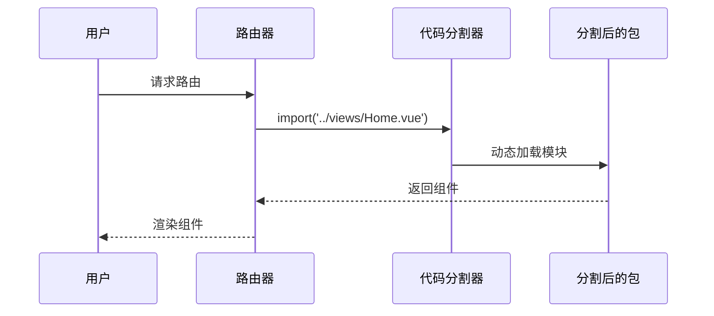

这种实现方式的优势：
- **首屏加载优化**：只有首页需要的资源被立即加载
- **按需加载**：其他页面在用户实际访问时才加载
- **缓存友好**：浏览器可以缓存独立的代码块

### 预加载策略

虽然当前实现使用了懒加载，但可以进一步优化：

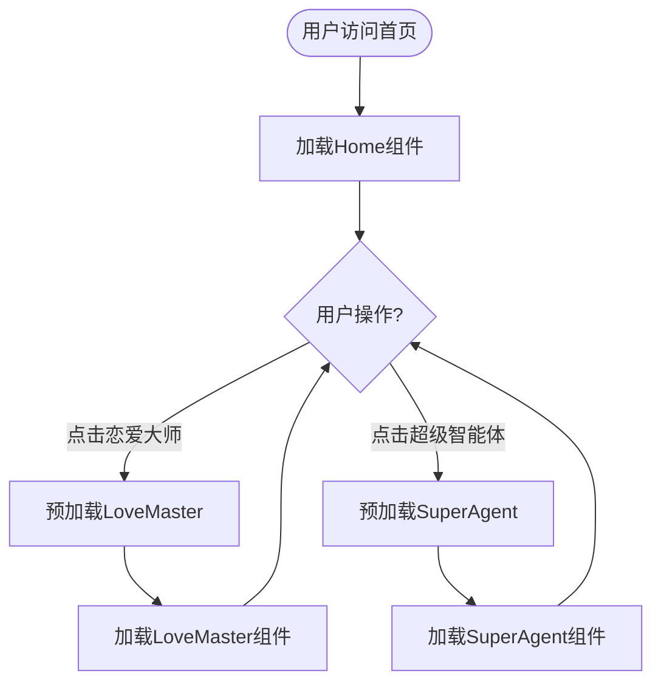

### 内存管理

聊天组件实现了完善的内存清理机制：

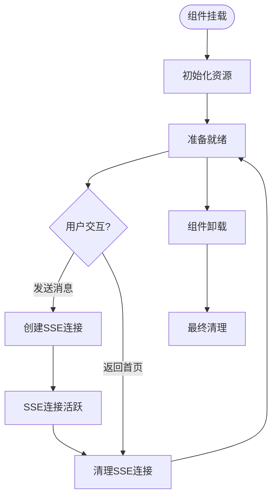

**章节来源**
- [src/router/index.js:7-25](file://yu-ai-agent-frontend/src/router/index.js#L7-L25)
- [src/views/LoveMaster.vue:124-128](file://yu-ai-agent-frontend/src/views/LoveMaster.vue#L124-L128)
- [src/views/SuperAgent.vue:171-175](file://yu-ai-agent-frontend/src/views/SuperAgent.vue#L171-L175)

## 故障排除指南

### 常见问题诊断

#### 路由无法加载

**症状**：点击导航链接后页面空白或报错

**排查步骤**：
1. 检查路由路径是否正确
2. 确认组件文件是否存在
3. 验证动态导入语法

#### SEO元数据不生效

**症状**：页面标题未更新

**排查步骤**：
1. 检查路由meta对象配置
2. 确认beforeEach守卫执行
3. 验证document.title设置

#### 聊天功能异常

**症状**：SSE连接失败或消息不显示

**排查步骤**：
1. 检查API端点可用性
2. 验证SSE连接状态
3. 查看浏览器控制台错误

### 性能监控

建议监控的关键指标：
- **首屏渲染时间**：从用户访问到首页完全渲染的时间
- **路由切换延迟**：页面间切换的响应时间
- **内存使用情况**：聊天组件的内存占用
- **网络请求统计**：SSE连接的建立和断开次数

**章节来源**
- [src/router/index.js:38-45](file://yu-ai-agent-frontend/src/router/index.js#L38-L45)
- [src/views/LoveMaster.vue:102-106](file://yu-ai-agent-frontend/src/views/LoveMaster.vue#L102-L106)
- [src/views/SuperAgent.vue:146-156](file://yu-ai-agent-frontend/src/views/SuperAgent.vue#L146-L156)

## 结论

本项目的路由配置展现了现代Vue 3应用的最佳实践：

### 设计优势

1. **简洁高效**：路由配置简单明了，易于维护
2. **性能优化**：采用懒加载实现，提升首屏加载速度
3. **SEO友好**：完善的元数据管理和页面标题设置
4. **用户体验**：流畅的页面切换和响应式设计

### 技术特点

- **组合式API**：使用Vue 3的组合式API重构传统选项式API
- **动态导入**：实现代码分割和按需加载
- **全局守卫**：统一的导航管理和页面标题设置
- **响应式设计**：适配不同设备尺寸的界面布局

### 改进建议

1. **路由权限控制**：可添加基于角色的访问控制
2. **路由缓存**：实现页面状态保持和缓存策略
3. **错误边界**：添加路由级别的错误处理机制
4. **性能监控**：集成路由性能监控和分析工具

该路由系统为AI智能体应用提供了稳定可靠的基础架构，为后续的功能扩展和性能优化奠定了良好基础。