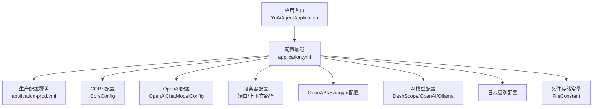
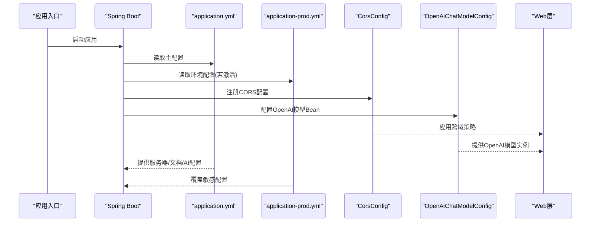
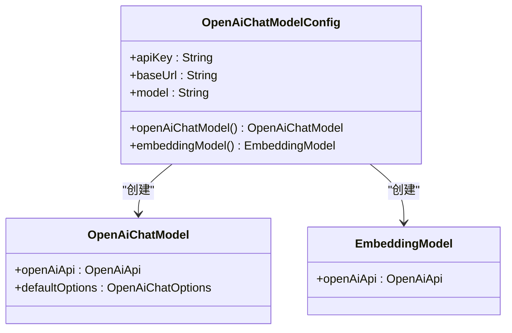
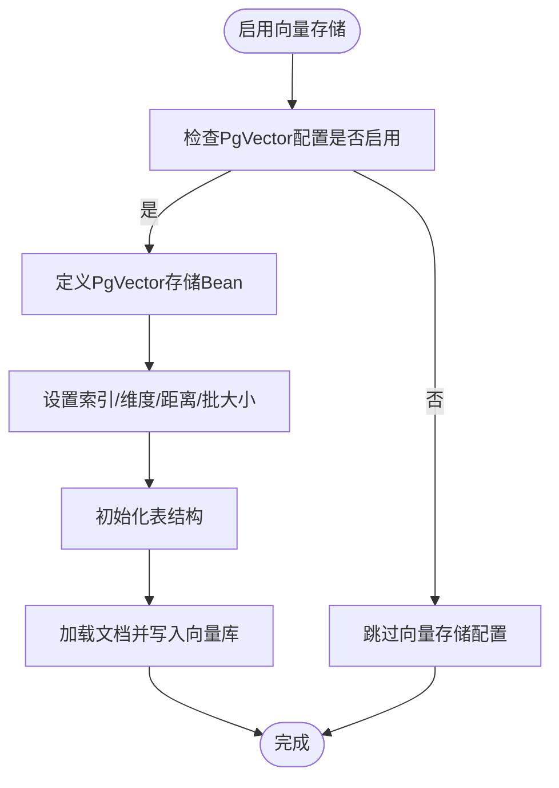
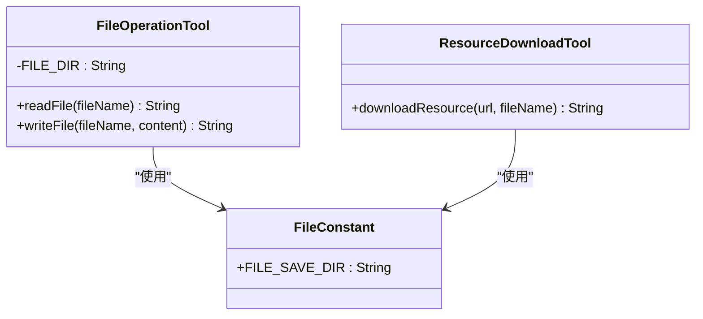
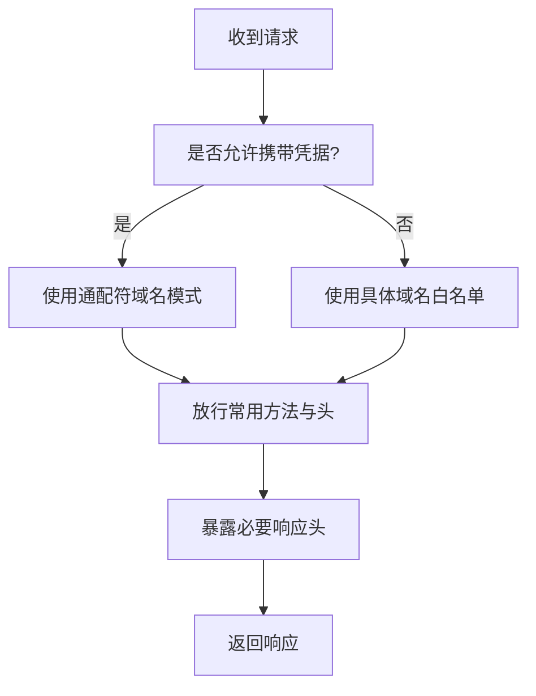
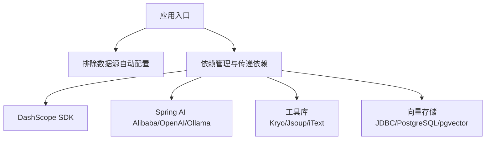

# Spring Boot配置管理

<cite>
**本文引用的文件**
- [application.yml](file://src/main/resources/application.yml)
- [application-prod.yml](file://src/main/resources/application-prod.yml)
- [CorsConfig.java](file://src/main/java/com/yupi/yuaiagent/config/CorsConfig.java)
- [OpenAiChatModelConfig.java](file://src/main/java/com/yupi/yuaiagent/config/OpenAiChatModelConfig.java)
- [OpenAiModelConnectionTest.java](file://src/test/java/com/yupi/yuaiagent/OpenAiModelConnectionTest.java)
- [YuAiAgentApplication.java](file://src/main/java/com/yupi/yuaiagent/YuAiAgentApplication.java)
- [FileConstant.java](file://src/main/java/com/yupi/yuaiagent/constant/FileConstant.java)
- [FileOperationTool.java](file://src/main/java/com/yupi/yuaiagent/tools/FileOperationTool.java)
- [ResourceDownloadTool.java](file://src/main/java/com/yupi/yuaiagent/tools/ResourceDownloadTool.java)
- [HealthController.java](file://src/main/java/com/yupi/yuaiagent/controller/HealthController.java)
- [PgVectorVectorStoreConfig.java](file://src/main/java/com/yupi/yuaiagent/rag/PgVectorVectorStoreConfig.java)
- [pom.xml](file://pom.xml)
</cite>

## 目录
1. [引言](#引言)
2. [项目结构](#项目结构)
3. [核心组件](#核心组件)
4. [架构总览](#架构总览)
5. [详细组件分析](#详细组件分析)
6. [依赖分析](#依赖分析)
7. [性能考量](#性能考量)
8. [故障排除指南](#故障排除指南)
9. [结论](#结论)
10. [附录](#附录)

## 引言
本文件系统性梳理本项目的Spring Boot配置管理，重点覆盖以下方面：
- application.yml与application-prod.yml的配置结构与用途，包括服务器端口、上下文路径、OpenAPI文档、AI模型配置、日志级别等。
- 数据库连接与向量存储配置现状与启用方式。
- 文件存储配置与工具类的使用。
- CORS跨域配置的实现原理与安全注意事项。
- 配置文件优先级规则与环境切换机制。
- 配置验证与故障排除方法。
- 生产环境配置最佳实践与安全加固建议。
- 如何添加自定义配置属性与创建配置类。

## 项目结构
本项目采用标准的Spring Boot目录组织方式，配置文件位于resources目录下，核心配置集中在application.yml中，生产环境专用配置在application-prod.yml中。全局CORS配置通过一个Java配置类实现，应用入口排除了默认的数据源自动装配以便按需启用数据库与向量存储。

图表来源
- [YuAiAgentApplication.java:1-18](file://src/main/java/com/yupi/yuaiagent/YuAiAgentApplication.java#L1-L18)
- [application.yml:1-73](file://src/main/resources/application.yml#L1-L73)
- [application-prod.yml:1-2](file://src/main/resources/application-prod.yml#L1-L2)
- [CorsConfig.java:1-26](file://src/main/java/com/yupi/yuaiagent/config/CorsConfig.java#L1-L26)
- [OpenAiChatModelConfig.java:1-64](file://src/main/java/com/yupi/yuaiagent/config/OpenAiChatModelConfig.java#L1-L64)
- [FileConstant.java:1-13](file://src/main/java/com/yupi/yuaiagent/constant/FileConstant.java#L1-L13)

章节来源
- [application.yml:1-73](file://src/main/resources/application.yml#L1-L73)
- [application-prod.yml:1-2](file://src/main/resources/application-prod.yml#L1-L2)
- [YuAiAgentApplication.java:1-18](file://src/main/java/com/yupi/yuaiagent/YuAiAgentApplication.java#L1-L18)
- [CorsConfig.java:1-26](file://src/main/java/com/yupi/yuaiagent/config/CorsConfig.java#L1-L26)
- [OpenAiChatModelConfig.java:1-64](file://src/main/java/com/yupi/yuaiagent/config/OpenAiChatModelConfig.java#L1-L64)
- [FileConstant.java:1-13](file://src/main/java/com/yupi/yuaiagent/constant/FileConstant.java#L1-L13)

## 核心组件
- 应用入口与数据源排除：应用入口类显式排除了数据源自动配置，便于开发阶段不依赖数据库；如需启用数据库与向量存储，可按需移除排除项或启用相应配置。
- 配置文件优先级：Spring Boot遵循"开发环境配置 > 环境特定配置 > 外部配置"等优先级规则；application-prod.yml用于覆盖开发配置，适合存放生产敏感信息。
- CORS全局配置：通过实现WebMvcConfigurer接口，在addCorsMappings中统一放行所有路径，允许凭据、通配符域名模式与全部方法与头。
- OpenAPI/Swagger：通过springdoc与knife4j配置，暴露Swagger UI与API文档路径，限定扫描包范围。
- AI模型配置：包含DashScope、OpenAI和Ollama三大后端的模型名称与基础地址，便于切换不同推理后端。
- OpenAI专用配置：新增OpenAI配置段落，支持自定义API Key、基础URL和模型选项，通过OpenAiChatModelConfig进行Bean配置。
- 日志级别：将Spring AI相关日志级别调整为DEBUG，便于调试与追踪AI调用链路。
- 文件存储：通过FileConstant定义统一的文件保存根目录，配合工具类进行文件读写与资源下载。

章节来源
- [YuAiAgentApplication.java:7-10](file://src/main/java/com/yupi/yuaiagent/YuAiAgentApplication.java#L7-L10)
- [application.yml:4-5](file://src/main/resources/application.yml#L4-L5)
- [application.yml:11-21](file://src/main/resources/application.yml#L11-L21)
- [application.yml:23-28](file://src/main/resources/application.yml#L23-L28)
- [application.yml:42-58](file://src/main/resources/application.yml#L42-L58)
- [application.yml:71-73](file://src/main/resources/application.yml#L71-L73)
- [CorsConfig.java:14-24](file://src/main/java/com/yupi/yuaiagent/config/CorsConfig.java#L14-L24)
- [OpenAiChatModelConfig.java:17-64](file://src/main/java/com/yupi/yuaiagent/config/OpenAiChatModelConfig.java#L17-L64)
- [FileConstant.java:11](file://src/main/java/com/yupi/yuaiagent/constant/FileConstant.java#L11)

## 架构总览
下图展示配置加载与生效的关键流程：应用启动时加载主配置文件，随后根据profiles.active选择环境配置，最终由CORS配置类注入到Web层，同时OpenAPI与AI配置为后续业务提供文档与推理能力。

图表来源
- [YuAiAgentApplication.java:13-15](file://src/main/java/com/yupi/yuaiagent/YuAiAgentApplication.java#L13-L15)
- [application.yml:1-73](file://src/main/resources/application.yml#L1-L73)
- [application-prod.yml:1-2](file://src/main/resources/application-prod.yml#L1-L2)
- [CorsConfig.java:10-24](file://src/main/java/com/yupi/yuaiagent/config/CorsConfig.java#L10-L24)
- [OpenAiChatModelConfig.java:17-64](file://src/main/java/com/yupi/yuaiagent/config/OpenAiChatModelConfig.java#L17-L64)

## 详细组件分析

### 配置文件结构与用途
- 服务器与上下文路径：定义HTTP端口与Servlet上下文路径，便于前端代理或反向代理统一转发。
- OpenAPI/Swagger：配置Swagger UI与API文档的访问路径，并限定扫描控制器包，提升文档可维护性。
- Knife4j增强：开启Knife4j并设置语言，改善国内开发者体验。
- AI模型配置：
  - DashScope：包含API Key与聊天模型选项，便于快速切换模型。
  - OpenAI：新增配置段落，包含API Key、基础URL与聊天模型，支持自定义模型名称。
  - Ollama：包含基础URL与聊天模型，便于本地推理服务对接。
- 日志级别：将Spring AI相关日志级别设为DEBUG，便于追踪模型调用细节。
- 注释占位：数据库、MCP与向量存储等配置均以注释形式保留，便于按需启用。

章节来源
- [application.yml:38-41](file://src/main/resources/application.yml#L38-L41)
- [application.yml:16-28](file://src/main/resources/application.yml#L16-L28)
- [application.yml:23-28](file://src/main/resources/application.yml#L23-L28)
- [application.yml:55-58](file://src/main/resources/application.yml#L55-L58)
- [application.yml:71-73](file://src/main/resources/application.yml#L71-L73)

### DashScope自动配置排除
- 自动配置排除：通过spring.autoconfigure.exclude配置禁用DashScope的自动配置类，包括DashScopeAutoConfiguration和DashScopeChatAutoConfiguration。
- 目的：当使用OpenAI作为主要AI后端时，避免DashScope自动配置与OpenAI配置产生冲突。
- 影响：确保OpenAiChatModelConfig中的Bean优先级高于DashScope的自动配置。

章节来源
- [application.yml:6-10](file://src/main/resources/application.yml#L6-L10)

### OpenAI配置与模型Bean
- OpenAI配置段落：在application.yml中新增spring.ai.openai配置，包含api-key、base-url和chat.options.model等关键参数。
- OpenAiChatModelConfig配置类：通过@Bean定义OpenAiChatModel和EmbeddingModel Bean，设置默认温度(0.7)和最大token数(2000)。
- 参数绑定：使用@Value注解从配置文件读取API Key、基础URL和模型名称，支持默认值。
- 主要Bean：
  - openAiChatModel：配置OpenAI聊天模型，支持温度调节和token限制。
  - embeddingModel：配置嵌入模型，用于RAG向量存储功能。

图表来源
- [OpenAiChatModelConfig.java:17-64](file://src/main/java/com/yupi/yuaiagent/config/OpenAiChatModelConfig.java#L17-L64)

章节来源
- [application.yml:23-28](file://src/main/resources/application.yml#L23-L28)
- [OpenAiChatModelConfig.java:17-64](file://src/main/java/com/yupi/yuaiagent/config/OpenAiChatModelConfig.java#L17-L64)

### OpenAI模型连接测试
- 测试目的：验证公司部署的Qwen/Qwen3-32B模型是否可以正常调用。
- 测试方法：使用RestTemplate直接调用OpenAI兼容API，模拟/chat/completions接口。
- 测试内容：
  - testModelConnection：测试基本连接和回复功能。
  - testModelSimpleMath：测试简单推理能力，验证1+1=2。
- 关键参数：使用硬编码的API Key("dummy")和指定的模型名称。

章节来源
- [OpenAiModelConnectionTest.java:16-104](file://src/test/java/com/yupi/yuaiagent/OpenAiModelConnectionTest.java#L16-L104)

### 数据库连接与向量存储配置
- 数据库连接：当前主配置中数据库连接为注释状态，便于开发阶段不依赖数据库；如需启用，可取消注释并填入正确的连接信息。
- 向量存储(PgVector)：通过PgVectorVectorStoreConfig定义向量存储Bean，包含索引类型、维度、距离度量、批处理大小等参数；当前为注释状态，启用时需取消注释并确保数据库与驱动可用。
- JDBC与PostgreSQL依赖：pom.xml中引入了spring-boot-starter-jdbc与PostgreSQL驱动以及pgvector存储支持，为向量存储提供运行时依赖。

图表来源
- [PgVectorVectorStoreConfig.java:17-40](file://src/main/java/com/yupi/yuaiagent/rag/PgVectorVectorStoreConfig.java#L17-L40)
- [pom.xml:75-88](file://pom.xml#L75-L88)

章节来源
- [application.yml:7-10](file://src/main/resources/application.yml#L7-L10)
- [application.yml:32-37](file://src/main/resources/application.yml#L32-L37)
- [PgVectorVectorStoreConfig.java:17-40](file://src/main/java/com/yupi/yuaiagent/rag/PgVectorVectorStoreConfig.java#L17-L40)
- [pom.xml:75-88](file://pom.xml#L75-L88)

### 文件存储配置与工具类
- 文件保存根目录：通过FileConstant定义统一的文件保存目录，便于集中管理。
- 文件读写工具：FileOperationTool提供读写文件的能力，内部使用Hutool进行UTF-8读写与目录创建。
- 资源下载工具：ResourceDownloadTool提供从URL下载资源并保存到指定路径的功能，同样基于Hutool。

图表来源
- [FileConstant.java:6-12](file://src/main/java/com/yupi/yuaiagent/constant/FileConstant.java#L6-L12)
- [FileOperationTool.java:11-40](file://src/main/java/com/yupi/yuaiagent/tools/FileOperationTool.java#L11-L40)
- [ResourceDownloadTool.java:14-30](file://src/main/java/com/yupi/yuaiagent/tools/ResourceDownloadTool.java#L14-L30)

章节来源
- [FileConstant.java:11](file://src/main/java/com/yupi/yuaiagent/constant/FileConstant.java#L11)
- [FileOperationTool.java:13-39](file://src/main/java/com/yupi/yuaiagent/tools/FileOperationTool.java#L13-L39)
- [ResourceDownloadTool.java:16-29](file://src/main/java/com/yupi/yuaiagent/tools/ResourceDownloadTool.java#L16-L29)

### CORS跨域配置与安全考虑
- 实现原理：CorsConfig实现WebMvcConfigurer接口，重写addCorsMappings方法，对所有路径放行，允许携带Cookie，使用通配符域名模式，放行常见HTTP方法与全部请求头与响应头。
- 安全考虑：
  - 通配符域名与允许凭据同时使用时，必须使用allowedOriginPatterns而非allowedOrigins，避免浏览器同源策略冲突。
  - 在生产环境中应限制具体可信域名，避免使用通配符。
  - 结合Spring Security可进一步细化权限控制与CSRF防护。

图表来源
- [CorsConfig.java:14-24](file://src/main/java/com/yupi/yuaiagent/config/CorsConfig.java#L14-L24)

章节来源
- [CorsConfig.java:10-24](file://src/main/java/com/yupi/yuaiagent/config/CorsConfig.java#L10-L24)

### 配置文件优先级规则与环境切换机制
- 激活环境：通过profiles.active指定当前环境（示例为local），可切换为prod或其他环境名。
- 覆盖机制：application-prod.yml用于覆盖application.yml中的通用配置，适合存放生产敏感信息。
- 优先级原则：Spring Boot配置优先级遵循"外部配置 > 环境特定配置 > 主配置"的通用规则；生产配置文件通常放置于外部目录以避免纳入版本控制。

章节来源
- [application.yml:4-5](file://src/main/resources/application.yml#L4-L5)
- [application-prod.yml:1](file://src/main/resources/application-prod.yml#L1)

### 配置验证与故障排除
- 健康检查：提供/health端点用于快速验证服务可用性。
- OpenAPI/Swagger：通过/swagger-ui.html与/v3/api-docs验证接口文档是否正确加载。
- OpenAI模型测试：通过OpenAiModelConnectionTest验证模型连通性和推理能力。
- 日志级别：将日志级别调整为DEBUG有助于定位AI调用问题。
- 常见问题排查：
  - CORS异常：确认是否使用allowedOriginPatterns且允许凭据。
  - AI模型不可用：检查DashScope/Ollama的API Key与基础URL配置。
  - OpenAI配置问题：验证OpenAiChatModelConfig中的Bean是否正确加载。
  - 文件读写失败：检查FileConstant定义的根目录是否存在与权限是否足够。
  - 向量存储异常：确认数据库连接、表结构初始化与依赖是否齐全。

章节来源
- [HealthController.java:11-14](file://src/main/java/com/yupi/yuaiagent/controller/HealthController.java#L11-L14)
- [OpenAiModelConnectionTest.java:59-102](file://src/test/java/com/yupi/yuaiagent/OpenAiModelConnectionTest.java#L59-L102)
- [application.yml:42-58](file://src/main/resources/application.yml#L42-L58)
- [application.yml:71-73](file://src/main/resources/application.yml#L71-L73)
- [CorsConfig.java:17-20](file://src/main/java/com/yupi/yuaiagent/config/CorsConfig.java#L17-L20)
- [FileConstant.java:11](file://src/main/java/com/yupi/yuaiagent/constant/FileConstant.java#L11)
- [pom.xml:75-88](file://pom.xml#L75-L88)

### 生产环境配置最佳实践与安全加固
- 敏感信息外置：生产配置文件不应提交至版本库，API Key、数据库密码等应通过环境变量或外部配置中心注入。
- CORS最小授权：仅放行必要域名，关闭允许凭据或严格限定凭据场景。
- 端口与上下文路径：在容器或反向代理后统一暴露端口与路径，避免直接暴露开发端口。
- OpenAPI文档：生产环境可关闭或限制访问，防止泄露接口细节。
- 日志脱敏：生产环境避免输出敏感参数，同时保留必要的错误日志以便排查。
- 数据库与向量存储：启用时务必校验网络连通性、SSL/TLS与只读权限，避免误写。
- AI模型安全：确保API Key的安全存储，避免硬编码在配置文件中。

章节来源
- [application-prod.yml:1-2](file://src/main/resources/application-prod.yml#L1-L2)
- [CorsConfig.java:17-20](file://src/main/java/com/yupi/yuaiagent/config/CorsConfig.java#L17-L20)
- [application.yml:38-41](file://src/main/resources/application.yml#L38-L41)
- [application.yml:23-28](file://src/main/resources/application.yml#L23-L28)
- [application.yml:42-58](file://src/main/resources/application.yml#L42-L58)
- [application.yml:71-73](file://src/main/resources/application.yml#L71-L73)
- [pom.xml:75-88](file://pom.xml#L75-L88)

### 添加自定义配置属性与配置类
- 自定义配置属性：可在application.yml中新增键值对，例如自定义业务参数或第三方服务配置。
- 配置类创建：通过@ConfigurationProperties(prefix="...")绑定配置前缀，结合@EnableConfigurationProperties启用，或在@Component中使用@Value注入。
- 示例步骤：
  1) 在application.yml中新增配置项。
  2) 创建配置类，使用@ConfigurationProperties绑定前缀。
  3) 在需要的地方注入配置类或使用@Value读取单个属性。
  4) 编写单元测试验证配置加载与默认值行为。

[本节为通用指导，无需特定文件引用]

## 依赖分析
- 应用排除：应用入口排除了DataSourceAutoConfiguration，便于开发阶段不依赖数据库。
- AI与工具依赖：pom.xml中引入了DashScope SDK、Spring AI Alibaba Starter、Spring AI OpenAI Starter、Ollama Starter、LangChain4J DashScope、Kryo、Jsoup、iText等依赖，支撑AI推理与文档处理。
- 向量存储依赖：引入spring-boot-starter-jdbc、PostgreSQL驱动与pgvector存储支持，为向量检索提供运行时依赖。

图表来源
- [YuAiAgentApplication.java:7-10](file://src/main/java/com/yupi/yuaiagent/YuAiAgentApplication.java#L7-L10)
- [pom.xml:50-134](file://pom.xml#L50-L134)
- [pom.xml:75-88](file://pom.xml#L75-L88)

章节来源
- [YuAiAgentApplication.java:7-10](file://src/main/java/com/yupi/yuaiagent/YuAiAgentApplication.java#L7-L10)
- [pom.xml:50-134](file://pom.xml#L50-L134)
- [pom.xml:75-88](file://pom.xml#L75-L88)

## 性能考量
- OpenAPI文档：在生产环境可关闭或延迟加载，减少启动时间与内存占用。
- AI调用：合理设置模型参数与并发，避免高延迟请求阻塞线程池。
- 文件IO：批量写入与缓存策略可降低磁盘压力；对大文件建议异步处理。
- 向量存储：批处理大小与索引类型影响插入与查询性能，需结合数据规模调优。
- OpenAI模型：通过合理的温度和token限制平衡性能与质量。

[本节为通用指导，无需特定文件引用]

## 故障排除指南
- 无法访问Swagger UI：检查springdoc与knife4j配置路径与扫描包范围。
- CORS失败：确认allowedOriginPatterns与allowCredentials组合使用，避免通配符导致冲突。
- AI模型调用异常：核对DashScope/Ollama的API Key与模型名称，检查网络连通性与超时设置。
- OpenAI配置异常：验证OpenAiChatModelConfig中的Bean是否正确加载，检查API Key和基础URL。
- OpenAI模型测试失败：确认模型服务器可达，验证模型名称和API格式。
- 文件读写失败：确认FileConstant根目录存在、权限充足，以及工具类路径拼接正确。
- 向量存储异常：检查数据库连接、表初始化与依赖版本兼容性。

章节来源
- [application.yml:42-58](file://src/main/resources/application.yml#L42-L58)
- [OpenAiModelConnectionTest.java:59-102](file://src/test/java/com/yupi/yuaiagent/OpenAiModelConnectionTest.java#L59-L102)
- [CorsConfig.java:17-20](file://src/main/java/com/yupi/yuaiagent/config/CorsConfig.java#L17-L20)
- [FileConstant.java:11](file://src/main/java/com/yupi/yuaiagent/constant/FileConstant.java#L11)
- [FileOperationTool.java:16-39](file://src/main/java/com/yupi/yuaiagent/tools/FileOperationTool.java#L16-L39)
- [ResourceDownloadTool.java:16-29](file://src/main/java/com/yupi/yuaiagent/tools/ResourceDownloadTool.java#L16-L29)
- [pom.xml:75-88](file://pom.xml#L75-L88)

## 结论
本项目通过清晰的配置文件结构与模块化配置类，实现了灵活的环境切换与功能扩展。新增的OpenAI配置支持使得项目能够同时兼容多种AI后端，通过DashScope自动配置排除机制避免了配置冲突。建议在生产环境中严格区分敏感配置、最小化CORS授权范围、优化AI与向量存储性能，并完善健康检查与日志策略，以确保系统的稳定性与安全性。

## 附录
- 环境切换：通过profiles.active切换环境，application-prod.yml用于覆盖生产敏感配置。
- 健康检查：访问/health端点验证服务状态。
- OpenAPI文档：访问/swagger-ui.html与/v3/api-docs查看接口文档。
- OpenAI模型测试：运行OpenAiModelConnectionTest验证模型连通性。

章节来源
- [application.yml:4-5](file://src/main/resources/application.yml#L4-L5)
- [application-prod.yml:1](file://src/main/resources/application-prod.yml#L1)
- [HealthController.java:11-14](file://src/main/java/com/yupi/yuaiagent/controller/HealthController.java#L11-L14)
- [application.yml:42-58](file://src/main/resources/application.yml#L42-L58)
- [OpenAiModelConnectionTest.java:59-102](file://src/test/java/com/yupi/yuaiagent/OpenAiModelConnectionTest.java#L59-L102)