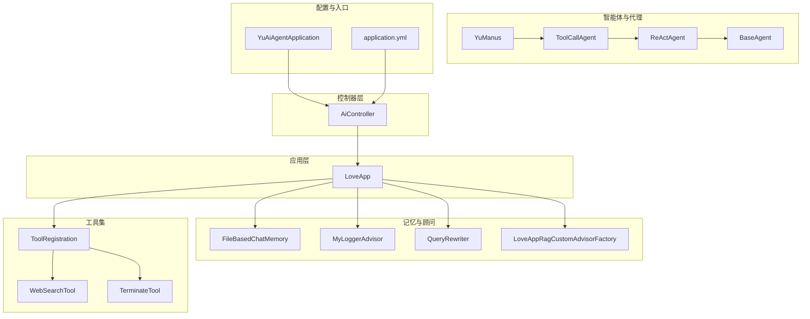
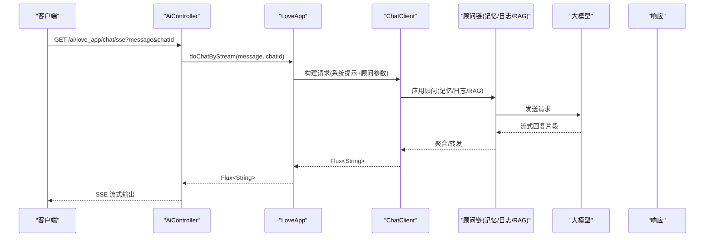
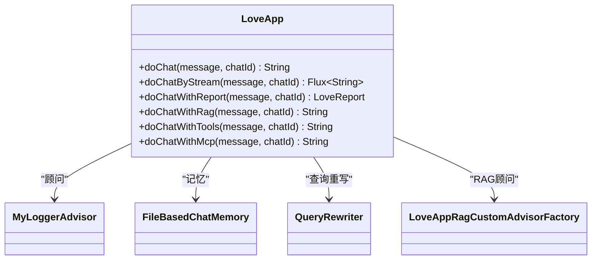
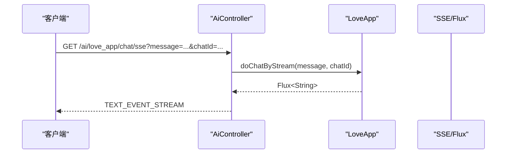
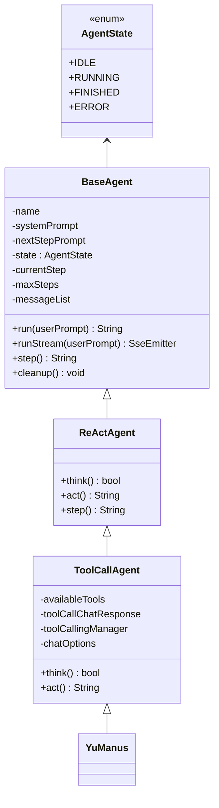
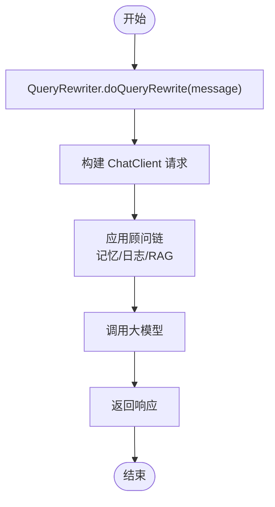
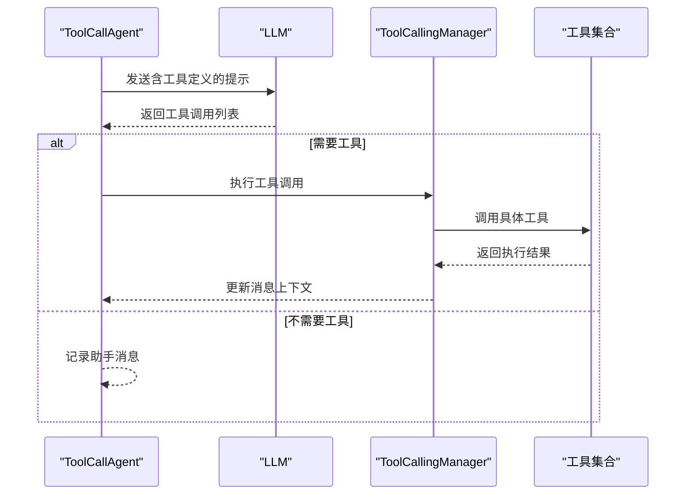
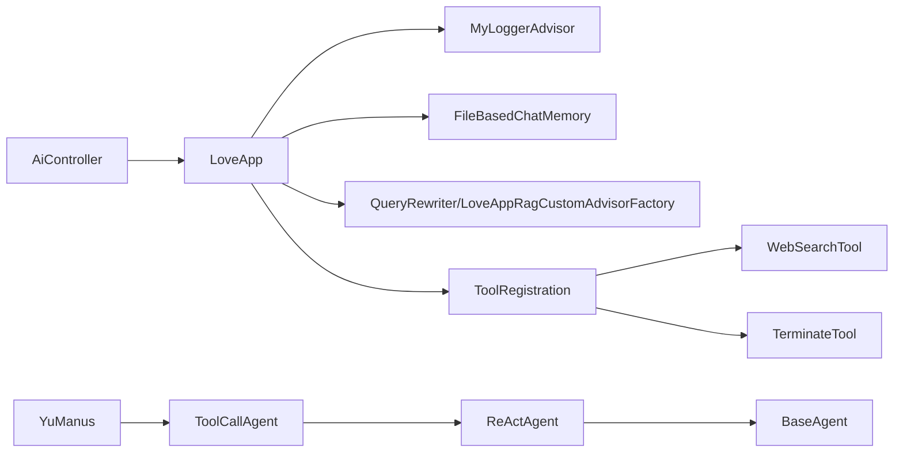

# 业务逻辑实现

<cite>
**本文引用的文件**
- [LoveApp.java](file://src/main/java/com/yupi/yuaiagent/app/LoveApp.java)
- [AiController.java](file://src/main/java/com/yupi/yuaiagent/controller/AiController.java)
- [BaseAgent.java](file://src/main/java/com/yupi/yuaiagent/agent/BaseAgent.java)
- [ReActAgent.java](file://src/main/java/com/yupi/yuaiagent/agent/ReActAgent.java)
- [ToolCallAgent.java](file://src/main/java/com/yupi/yuaiagent/agent/ToolCallAgent.java)
- [YuManus.java](file://src/main/java/com/yupi/yuaiagent/agent/YuManus.java)
- [AgentState.java](file://src/main/java/com/yupi/yuaiagent/agent/model/AgentState.java)
- [FileBasedChatMemory.java](file://src/main/java/com/yupi/yuaiagent/chatmemory/FileBasedChatMemory.java)
- [MyLoggerAdvisor.java](file://src/main/java/com/yupi/yuaiagent/advisor/MyLoggerAdvisor.java)
- [QueryRewriter.java](file://src/main/java/com/yupi/yuaiagent/rag/QueryRewriter.java)
- [LoveAppRagCustomAdvisorFactory.java](file://src/main/java/com/yupi/yuaiagent/rag/LoveAppRagCustomAdvisorFactory.java)
- [ToolRegistration.java](file://src/main/java/com/yupi/yuaiagent/tools/ToolRegistration.java)
- [WebSearchTool.java](file://src/main/java/com/yupi/yuaiagent/tools/WebSearchTool.java)
- [TerminateTool.java](file://src/main/java/com/yupi/yuaiagent/tools/TerminateTool.java)
- [application.yml](file://src/main/resources/application.yml)
- [YuAiAgentApplication.java](file://src/main/java/com/yupi/yuaiagent/YuAiAgentApplication.java)
- [LoveAppTest.java](file://src/test/java/com/yupi/yuaiagent/app/LoveAppTest.java)
</cite>

## 目录
1. [引言](#引言)
2. [项目结构](#项目结构)
3. [核心组件](#核心组件)
4. [架构总览](#架构总览)
5. [详细组件分析](#详细组件分析)
6. [依赖分析](#依赖分析)
7. [性能考虑](#性能考虑)
8. [故障排查指南](#故障排查指南)
9. [结论](#结论)
10. [附录](#附录)

## 引言
本文件聚焦 LoveApp 应用的业务逻辑实现，系统性梳理聊天处理流程、消息管理与状态维护，阐明业务层与控制器层的交互模式与数据传递机制，并对扩展点、插件化设计、事务与并发控制、性能优化、新增业务功能与流程重构方法进行说明。同时提供业务规则与异常处理策略、以及测试编写与 Mock 策略指导。

## 项目结构
后端采用 Spring Boot 应用，核心模块划分如下：
- 应用层：LoveApp 封装聊天、RAG、工具调用、MCP 能力
- 控制器层：AiController 提供 REST 接口，支持同步与 SSE 流式输出
- 代理与智能体：BaseAgent/ReActAgent/ToolCallAgent/YuManus 实现 ReAct 思考-行动循环与工具调用
- 记忆与顾问：FileBasedChatMemory、MyLoggerAdvisor、QueryRewriter、RAG 工厂
- 工具集：ToolRegistration 统一注册各类工具，如 WebSearchTool、PDFGenerationTool 等
- 配置与入口：application.yml、YuAiAgentApplication

图表来源
- [AiController.java:18-105](file://src/main/java/com/yupi/yuaiagent/controller/AiController.java#L18-L105)
- [LoveApp.java:27-226](file://src/main/java/com/yupi/yuaiagent/app/LoveApp.java#L27-L226)
- [BaseAgent.java:23-192](file://src/main/java/com/yupi/yuaiagent/agent/BaseAgent.java#L23-L192)
- [ReActAgent.java:11-52](file://src/main/java/com/yupi/yuaiagent/agent/ReActAgent.java#L11-L52)
- [ToolCallAgent.java:24-135](file://src/main/java/com/yupi/yuaiagent/agent/ToolCallAgent.java#L24-L135)
- [YuManus.java:9-37](file://src/main/java/com/yupi/yuaiagent/agent/YuManus.java#L9-L37)
- [FileBasedChatMemory.java:17-93](file://src/main/java/com/yupi/yuaiagent/chatmemory/FileBasedChatMemory.java#L17-L93)
- [MyLoggerAdvisor.java:13-53](file://src/main/java/com/yupi/yuaiagent/advisor/MyLoggerAdvisor.java#L13-L53)
- [QueryRewriter.java:10-39](file://src/main/java/com/yupi/yuaiagent/rag/QueryRewriter.java#L10-L39)
- [LoveAppRagCustomAdvisorFactory.java:11-39](file://src/main/java/com/yupi/yuaiagent/rag/LoveAppRagCustomAdvisorFactory.java#L11-L39)
- [ToolRegistration.java:9-37](file://src/main/java/com/yupi/yuaiagent/tools/ToolRegistration.java#L9-L37)
- [application.yml:1-66](file://src/main/resources/application.yml#L1-L66)
- [YuAiAgentApplication.java:7-17](file://src/main/java/com/yupi/yuaiagent/YuAiAgentApplication.java#L7-L17)

章节来源
- [AiController.java:18-105](file://src/main/java/com/yupi/yuaiagent/controller/AiController.java#L18-L105)
- [LoveApp.java:27-226](file://src/main/java/com/yupi/yuaiagent/app/LoveApp.java#L27-L226)
- [application.yml:1-66](file://src/main/resources/application.yml#L1-L66)
- [YuAiAgentApplication.java:7-17](file://src/main/java/com/yupi/yuaiagent/YuAiAgentApplication.java#L7-L17)

## 核心组件
- LoveApp：统一的聊天编排器，封装系统提示词、对话记忆、顾问链、RAG、工具与 MCP 调用，提供同步与流式输出能力，并支持结构化输出（恋爱报告）
- AiController：REST 控制器，暴露聊天接口，支持同步与多种 SSE 输出格式
- BaseAgent/ReActAgent/ToolCallAgent/YuManus：ReAct 智能体框架，实现“思考-行动”循环，支持工具调用与流式输出
- FileBasedChatMemory：基于文件的对话记忆持久化实现
- MyLoggerAdvisor：请求/响应日志顾问，便于调试与可观测性
- QueryRewriter/LoveAppRagCustomAdvisorFactory：查询重写与 RAG 增强顾问工厂
- ToolRegistration/WebSearchTool/TerminateTool：工具注册与常用工具实现
- application.yml：配置 API Key、模型、日志级别等

章节来源
- [LoveApp.java:27-226](file://src/main/java/com/yupi/yuaiagent/app/LoveApp.java#L27-L226)
- [AiController.java:18-105](file://src/main/java/com/yupi/yuaiagent/controller/AiController.java#L18-L105)
- [BaseAgent.java:23-192](file://src/main/java/com/yupi/yuaiagent/agent/BaseAgent.java#L23-L192)
- [ReActAgent.java:11-52](file://src/main/java/com/yupi/yuaiagent/agent/ReActAgent.java#L11-L52)
- [ToolCallAgent.java:24-135](file://src/main/java/com/yupi/yuaiagent/agent/ToolCallAgent.java#L24-L135)
- [YuManus.java:9-37](file://src/main/java/com/yupi/yuaiagent/agent/YuManus.java#L9-L37)
- [FileBasedChatMemory.java:17-93](file://src/main/java/com/yupi/yuaiagent/chatmemory/FileBasedChatMemory.java#L17-L93)
- [MyLoggerAdvisor.java:13-53](file://src/main/java/com/yupi/yuaiagent/advisor/MyLoggerAdvisor.java#L13-L53)
- [QueryRewriter.java:10-39](file://src/main/java/com/yupi/yuaiagent/rag/QueryRewriter.java#L10-L39)
- [LoveAppRagCustomAdvisorFactory.java:11-39](file://src/main/java/com/yupi/yuaiagent/rag/LoveAppRagCustomAdvisorFactory.java#L11-L39)
- [ToolRegistration.java:9-37](file://src/main/java/com/yupi/yuaiagent/tools/ToolRegistration.java#L9-L37)
- [WebSearchTool.java:15-53](file://src/main/java/com/yupi/yuaiagent/tools/WebSearchTool.java#L15-L53)
- [TerminateTool.java:5-17](file://src/main/java/com/yupi/yuaiagent/tools/TerminateTool.java#L5-L17)
- [application.yml:1-66](file://src/main/resources/application.yml#L1-L66)

## 架构总览
LoveApp 作为业务编排中心，通过 ChatClient 构建请求，注入顾问链（记忆、日志、RAG、工具/MCP），并根据场景选择同步或流式响应。控制器层负责路由与输出格式转换，智能体层提供 ReAct 执行框架，工具层提供可插拔能力。

图表来源
- [AiController.java:38-92](file://src/main/java/com/yupi/yuaiagent/controller/AiController.java#L38-L92)
- [LoveApp.java:83-97](file://src/main/java/com/yupi/yuaiagent/app/LoveApp.java#L83-L97)
- [MyLoggerAdvisor.java:39-52](file://src/main/java/com/yupi/yuaiagent/advisor/MyLoggerAdvisor.java#L39-L52)

## 详细组件分析

### LoveApp：聊天编排与多模态能力
- 系统提示词固定，面向恋爱心理领域，引导用户描述情境并给出方案
- 对话记忆：默认使用内存窗口记忆，支持通过参数传入会话标识以区分上下文
- 顾问链：内置记忆顾问与日志顾问；可按需启用推理增强顾问
- 多能力入口：
  - 同步聊天：返回完整回答
  - 流式聊天：SSE/Flux 输出
  - 结构化输出：实体映射为恋爱报告
  - RAG 对话：查询重写 + 向量检索 + 上下文增强
  - 工具调用：统一工具集接入
  - MCP 调用：通过 Provider 注入外部服务

图表来源
- [LoveApp.java:27-226](file://src/main/java/com/yupi/yuaiagent/app/LoveApp.java#L27-L226)
- [MyLoggerAdvisor.java:13-53](file://src/main/java/com/yupi/yuaiagent/advisor/MyLoggerAdvisor.java#L13-L53)
- [FileBasedChatMemory.java:17-93](file://src/main/java/com/yupi/yuaiagent/chatmemory/FileBasedChatMemory.java#L17-L93)
- [QueryRewriter.java:10-39](file://src/main/java/com/yupi/yuaiagent/rag/QueryRewriter.java#L10-L39)
- [LoveAppRagCustomAdvisorFactory.java:11-39](file://src/main/java/com/yupi/yuaiagent/rag/LoveAppRagCustomAdvisorFactory.java#L11-L39)

章节来源
- [LoveApp.java:27-226](file://src/main/java/com/yupi/yuaiagent/app/LoveApp.java#L27-L226)

### 控制器层：接口与数据传递
- AiController 提供多条接口：
  - 同步聊天：/ai/love_app/chat/sync
  - SSE 流式：/ai/love_app/chat/sse
  - ServerSentEvent 包装：/ai/love_app/chat/server_sent_event
  - SseEmitter：/ai/love_app/chat/sse_emitter
  - Manus 智能体流式：/ai/manus/chat
- 参数约定：message、chatId（会话标识），chatId 通过顾问参数传入 ChatMemory
- 输出格式：字符串或 Flux/ServerSentEvent/SseEmitter

图表来源
- [AiController.java:38-92](file://src/main/java/com/yupi/yuaiagent/controller/AiController.java#L38-L92)
- [LoveApp.java:83-97](file://src/main/java/com/yupi/yuaiagent/app/LoveApp.java#L83-L97)

章节来源
- [AiController.java:18-105](file://src/main/java/com/yupi/yuaiagent/controller/AiController.java#L18-L105)

### 智能体与代理：ReAct 执行框架
- BaseAgent：状态机（空闲/运行/完成/错误）、步骤计数、消息上下文、run/runStream、清理
- ReActAgent：定义 think/act 抽象，step 中先 think 再 act
- ToolCallAgent：集成工具调用，禁用内置工具执行，自管工具调用与消息上下文，支持终止工具
- YuManus：继承 ToolCallAgent，设置系统提示、下一步提示、最大步数、顾问链

图表来源
- [BaseAgent.java:17-192](file://src/main/java/com/yupi/yuaiagent/agent/BaseAgent.java#L17-L192)
- [ReActAgent.java:7-52](file://src/main/java/com/yupi/yuaiagent/agent/ReActAgent.java#L7-L52)
- [ToolCallAgent.java:24-135](file://src/main/java/com/yupi/yuaiagent/agent/ToolCallAgent.java#L24-L135)
- [YuManus.java:9-37](file://src/main/java/com/yupi/yuaiagent/agent/YuManus.java#L9-L37)
- [AgentState.java:3-27](file://src/main/java/com/yupi/yuaiagent/agent/model/AgentState.java#L3-L27)

章节来源
- [BaseAgent.java:17-192](file://src/main/java/com/yupi/yuaiagent/agent/BaseAgent.java#L17-L192)
- [ReActAgent.java:7-52](file://src/main/java/com/yupi/yuaiagent/agent/ReActAgent.java#L7-L52)
- [ToolCallAgent.java:24-135](file://src/main/java/com/yupi/yuaiagent/agent/ToolCallAgent.java#L24-L135)
- [YuManus.java:9-37](file://src/main/java/com/yupi/yuaiagent/agent/YuManus.java#L9-L37)
- [AgentState.java:3-27](file://src/main/java/com/yupi/yuaiagent/agent/model/AgentState.java#L3-L27)

### 记忆与顾问：消息管理与可观测性
- FileBasedChatMemory：基于 Kryo 文件序列化，按 conversationId 分割存储，支持 add/get/clear
- MyLoggerAdvisor：在调用前后打印请求/响应文本，便于调试与审计
- QueryRewriter：使用内置重写器对查询进行改写，提升检索质量
- LoveAppRagCustomAdvisorFactory：基于向量检索器与上下文增强器构建 RAG 增强顾问

图表来源
- [QueryRewriter.java:26-38](file://src/main/java/com/yupi/yuaiagent/rag/QueryRewriter.java#L26-L38)
- [LoveApp.java:145-172](file://src/main/java/com/yupi/yuaiagent/app/LoveApp.java#L145-L172)
- [MyLoggerAdvisor.java:30-52](file://src/main/java/com/yupi/yuaiagent/advisor/MyLoggerAdvisor.java#L30-L52)

章节来源
- [FileBasedChatMemory.java:17-93](file://src/main/java/com/yupi/yuaiagent/chatmemory/FileBasedChatMemory.java#L17-L93)
- [MyLoggerAdvisor.java:13-53](file://src/main/java/com/yupi/yuaiagent/advisor/MyLoggerAdvisor.java#L13-L53)
- [QueryRewriter.java:10-39](file://src/main/java/com/yupi/yuaiagent/rag/QueryRewriter.java#L10-L39)
- [LoveAppRagCustomAdvisorFactory.java:11-39](file://src/main/java/com/yupi/yuaiagent/rag/LoveAppRagCustomAdvisorFactory.java#L11-L39)

### 工具与插件化：可扩展能力
- ToolRegistration：集中注册工具数组，便于注入到 ChatClient
- WebSearchTool：基于外部搜索 API 的工具实现
- TerminateTool：用于智能体合理终止
- 工具调用流程：think 阶段由模型决定工具与参数，act 阶段执行工具并更新上下文

图表来源
- [ToolCallAgent.java:59-134](file://src/main/java/com/yupi/yuaiagent/agent/ToolCallAgent.java#L59-L134)
- [ToolRegistration.java:18-36](file://src/main/java/com/yupi/yuaiagent/tools/ToolRegistration.java#L18-L36)
- [WebSearchTool.java:15-53](file://src/main/java/com/yupi/yuaiagent/tools/WebSearchTool.java#L15-L53)
- [TerminateTool.java:5-17](file://src/main/java/com/yupi/yuaiagent/tools/TerminateTool.java#L5-L17)

章节来源
- [ToolRegistration.java:9-37](file://src/main/java/com/yupi/yuaiagent/tools/ToolRegistration.java#L9-L37)
- [WebSearchTool.java:15-53](file://src/main/java/com/yupi/yuaiagent/tools/WebSearchTool.java#L15-L53)
- [TerminateTool.java:5-17](file://src/main/java/com/yupi/yuaiagent/tools/TerminateTool.java#L5-L17)
- [ToolCallAgent.java:24-135](file://src/main/java/com/yupi/yuaiagent/agent/ToolCallAgent.java#L24-L135)

## 依赖分析
- 控制器依赖应用层：AiController 注入 LoveApp
- 应用层依赖顾问、记忆、RAG、工具与模型
- 智能体依赖工具回调数组与 ChatClient
- 工具通过 ToolRegistration 注册并注入

图表来源
- [AiController.java:22-29](file://src/main/java/com/yupi/yuaiagent/controller/AiController.java#L22-L29)
- [LoveApp.java:126-225](file://src/main/java/com/yupi/yuaiagent/app/LoveApp.java#L126-L225)
- [ToolRegistration.java:18-36](file://src/main/java/com/yupi/yuaiagent/tools/ToolRegistration.java#L18-L36)
- [YuManus.java:13-36](file://src/main/java/com/yupi/yuaiagent/agent/YuManus.java#L13-L36)
- [ToolCallAgent.java:44-52](file://src/main/java/com/yupi/yuaiagent/agent/ToolCallAgent.java#L44-L52)
- [ReActAgent.java:14-28](file://src/main/java/com/yupi/yuaiagent/agent/ReActAgent.java#L14-L28)
- [BaseAgent.java:25-45](file://src/main/java/com/yupi/yuaiagent/agent/BaseAgent.java#L25-L45)

章节来源
- [AiController.java:18-105](file://src/main/java/com/yupi/yuaiagent/controller/AiController.java#L18-L105)
- [LoveApp.java:27-226](file://src/main/java/com/yupi/yuaiagent/app/LoveApp.java#L27-L226)
- [ToolRegistration.java:9-37](file://src/main/java/com/yupi/yuaiagent/tools/ToolRegistration.java#L9-L37)

## 性能考虑
- 流式输出：SSE/Flux 减少等待时间，提升用户体验
- 记忆窗口：MessageWindowChatMemory 限制最大消息数，降低上下文开销
- 日志顾问：仅输出必要字段，避免冗余日志影响性能
- 工具调用：禁用内置工具执行，减少模型额外负担，自管上下文
- 并发控制：SseEmitter 默认超时与完成回调，避免长时间占用连接
- RAG：查询重写与相似度阈值、TopK 控制检索范围，提高命中质量与速度

章节来源
- [LoveApp.java:48-61](file://src/main/java/com/yupi/yuaiagent/app/LoveApp.java#L48-L61)
- [AiController.java:77-91](file://src/main/java/com/yupi/yuaiagent/controller/AiController.java#L77-L91)
- [ToolCallAgent.java:48-52](file://src/main/java/com/yupi/yuaiagent/agent/ToolCallAgent.java#L48-L52)
- [MyLoggerAdvisor.java:13-53](file://src/main/java/com/yupi/yuaiagent/advisor/MyLoggerAdvisor.java#L13-L53)
- [QueryRewriter.java:16-24](file://src/main/java/com/yupi/yuaiagent/rag/QueryRewriter.java#L16-L24)

## 故障排查指南
- 控制器层
  - 参数校验：chatId 通过顾问参数传入，确保前端正确传递
  - SSE 超时：SseEmitter 设置超时与完成回调，关注 onTimeout/onCompletion
- 应用层
  - 记忆异常：FileBasedChatMemory 文件读写异常需检查路径与权限
  - RAG 异常：查询重写失败或向量检索异常，检查 API Key 与向量存储可用性
  - 工具异常：工具调用失败时查看工具返回的错误信息
- 智能体层
  - 状态机：非空闲状态下禁止重复运行，避免竞态
  - 步骤限制：超过最大步数自动终止，防止死循环
- 日志与可观测性
  - 启用 DEBUG 级别日志，观察顾问链前后请求/响应
  - 使用 MyLoggerAdvisor 观察关键节点

章节来源
- [AiController.java:77-91](file://src/main/java/com/yupi/yuaiagent/controller/AiController.java#L77-L91)
- [BaseAgent.java:53-92](file://src/main/java/com/yupi/yuaiagent/agent/BaseAgent.java#L53-L92)
- [FileBasedChatMemory.java:44-87](file://src/main/java/com/yupi/yuaiagent/chatmemory/FileBasedChatMemory.java#L44-L87)
- [MyLoggerAdvisor.java:30-52](file://src/main/java/com/yupi/yuaiagent/advisor/MyLoggerAdvisor.java#L30-L52)
- [application.yml:64-66](file://src/main/resources/application.yml#L64-L66)

## 结论
LoveApp 通过清晰的分层与顾问链机制，将聊天、记忆、RAG、工具与 MCP 能力有机整合，既保证了业务规则的可落地实现，又提供了良好的扩展性与可观测性。控制器层以最小适配对接多种输出格式，智能体层提供稳定的 ReAct 执行框架，工具层实现插件化扩展。整体架构易于新增业务功能与重构流程。

## 附录

### 业务规则与异常处理策略
- 业务规则
  - 会话标识 chatId 必须传入，用于区分不同对话上下文
  - 工具调用由模型决策，act 阶段统一执行并更新上下文
  - 终止工具用于安全退出，避免无限循环
- 异常处理
  - 控制器层捕获 IO/超时异常并回传错误信息
  - 智能体层将异常转为错误状态并清理资源
  - 应用层记录关键日志，便于定位问题

章节来源
- [AiController.java:77-91](file://src/main/java/com/yupi/yuaiagent/controller/AiController.java#L77-L91)
- [BaseAgent.java:84-91](file://src/main/java/com/yupi/yuaiagent/agent/BaseAgent.java#L84-L91)
- [ToolCallAgent.java:117-134](file://src/main/java/com/yupi/yuaiagent/agent/ToolCallAgent.java#L117-L134)
- [TerminateTool.java:10-16](file://src/main/java/com/yupi/yuaiagent/tools/TerminateTool.java#L10-L16)

### 事务管理与并发控制
- 事务管理：应用未显式声明事务，建议在业务关键点（如持久化记忆、工具调用结果落库）使用 @Transactional
- 并发控制：SseEmitter 与 Flux 均为无状态输出通道；智能体 runStream 使用异步线程，注意状态切换与清理
- 资源释放：BaseAgent.cleanup 在 finally 中统一清理，避免资源泄漏

章节来源
- [BaseAgent.java:88-91](file://src/main/java/com/yupi/yuaiagent/agent/BaseAgent.java#L88-L91)
- [AiController.java:100-104](file://src/main/java/com/yupi/yuaiagent/controller/AiController.java#L100-L104)

### 扩展点与插件化设计
- 新增顾问：实现 CallAdvisor/StreamAdvisor 接口，按需加入顾问链
- 新增工具：实现 ToolCallback，注册到 ToolRegistration
- 新增 RAG 增强：通过 LoveAppRagCustomAdvisorFactory 创建定制顾问
- 新增智能体：继承 ToolCallAgent/ReActAgent，设置提示词与最大步数

章节来源
- [MyLoggerAdvisor.java:13-53](file://src/main/java/com/yupi/yuaiagent/advisor/MyLoggerAdvisor.java#L13-L53)
- [ToolRegistration.java:18-36](file://src/main/java/com/yupi/yuaiagent/tools/ToolRegistration.java#L18-L36)
- [LoveAppRagCustomAdvisorFactory.java:23-39](file://src/main/java/com/yupi/yuaiagent/rag/LoveAppRagCustomAdvisorFactory.java#L23-L39)
- [ToolCallAgent.java:44-52](file://src/main/java/com/yupi/yuaiagent/agent/ToolCallAgent.java#L44-L52)

### 添加新业务功能与流程重构方法
- 新增聊天能力：在 LoveApp 中新增方法，组合顾问链与调用参数
- 新增控制器接口：在 AiController 中新增映射，保持参数与输出一致
- 重构流程：将通用逻辑抽取为顾问或工具，降低耦合

章节来源
- [LoveApp.java:111-122](file://src/main/java/com/yupi/yuaiagent/app/LoveApp.java#L111-L122)
- [AiController.java:38-68](file://src/main/java/com/yupi/yuaiagent/controller/AiController.java#L38-L68)

### 业务逻辑测试编写指南与 Mock 策略
- 单元测试：LoveAppTest 展示了多轮对话、报告生成、RAG、工具与 MCP 的测试思路
- Mock 策略
  - 工具：使用桩对象或本地工具替代外部服务
  - 大模型：使用 ChatClient 的测试替身或响应模拟
  - 记忆：使用 InMemoryChatMemory 或内存版本替代文件存储
- 断言：验证返回非空、符合预期格式、状态机正确流转

章节来源
- [LoveAppTest.java:16-86](file://src/test/java/com/yupi/yuaiagent/app/LoveAppTest.java#L16-L86)
- [application.yml:11-21](file://src/main/resources/application.yml#L11-L21)