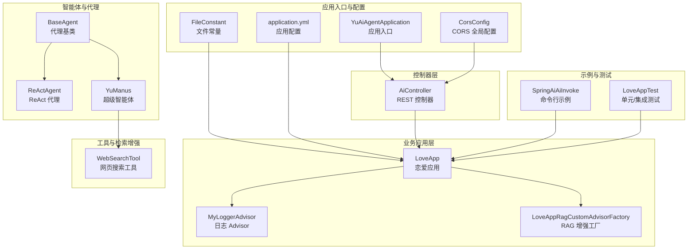
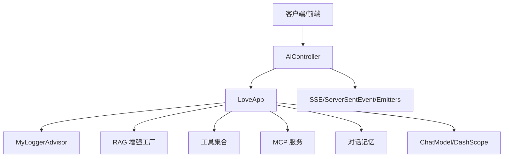
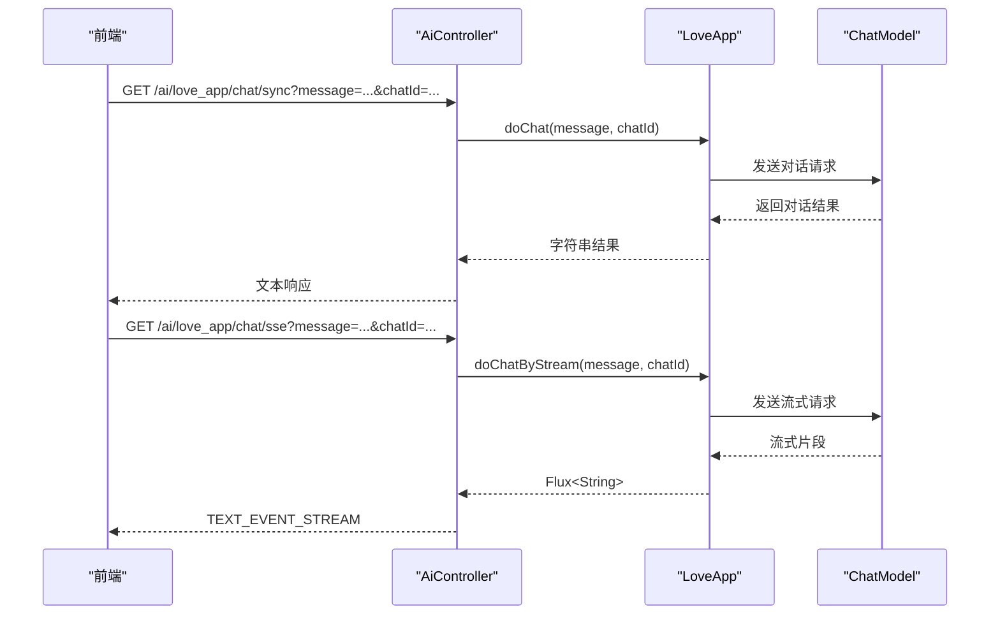
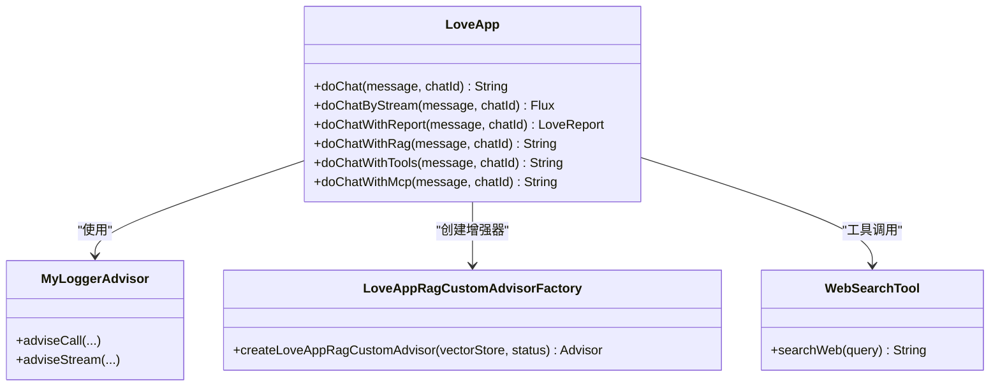
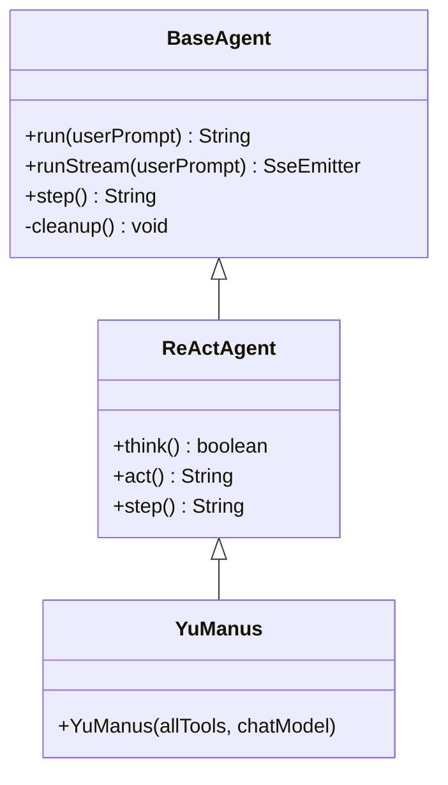
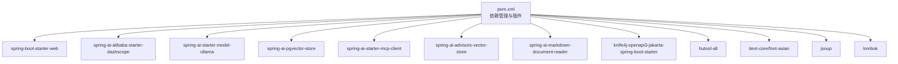

# 后端开发指南

<cite>
**本文引用的文件**
- [YuAiAgentApplication.java](file://src/main/java/com/yupi/yuaiagent/YuAiAgentApplication.java)
- [AiController.java](file://src/main/java/com/yupi/yuaiagent/controller/AiController.java)
- [LoveApp.java](file://src/main/java/com/yupi/yuaiagent/app/LoveApp.java)
- [CorsConfig.java](file://src/main/java/com/yupi/yuaiagent/config/CorsConfig.java)
- [FileConstant.java](file://src/main/java/com/yupi/yuaiagent/constant/FileConstant.java)
- [MyLoggerAdvisor.java](file://src/main/java/com/yupi/yuaiagent/advisor/MyLoggerAdvisor.java)
- [BaseAgent.java](file://src/main/java/com/yupi/yuaiagent/agent/BaseAgent.java)
- [ReActAgent.java](file://src/main/java/com/yupi/yuaiagent/agent/ReActAgent.java)
- [YuManus.java](file://src/main/java/com/yupi/yuaiagent/agent/YuManus.java)
- [WebSearchTool.java](file://src/main/java/com/yupi/yuaiagent/tools/WebSearchTool.java)
- [application.yml](file://src/main/resources/application.yml)
- [SpringAiAiInvoke.java](file://src/main/java/com/yupi/yuaiagent/demo/invoke/SpringAiAiInvoke.java)
- [LoveAppTest.java](file://src/test/java/com/yupi/yuaiagent/app/LoveAppTest.java)
- [LoveAppRagCustomAdvisorFactory.java](file://src/main/java/com/yupi/yuaiagent/rag/LoveAppRagCustomAdvisorFactory.java)
- [pom.xml](file://pom.xml)
</cite>

## 目录
1. [简介](#简介)
2. [项目结构](#项目结构)
3. [核心组件](#核心组件)
4. [架构总览](#架构总览)
5. [详细组件分析](#详细组件分析)
6. [依赖分析](#依赖分析)
7. [性能考虑](#性能考虑)
8. [故障排查指南](#故障排查指南)
9. [结论](#结论)
10. [附录](#附录)

## 简介
本指南面向后端开发者，系统讲解基于 Spring Boot 的后端开发实践与最佳实践，覆盖控制器层设计模式、RESTful API 设计原则与实现技巧、业务逻辑层实现与扩展、配置管理（含 CORS、文件常量）、横切关注点（异常处理、日志、安全）、代码组织与命名规范、单元与集成测试策略、Spring AI 框架集成与核心特性使用，以及性能优化与调试技巧。文中所有技术要点均来自仓库源码与配置文件，确保可落地、可验证。

## 项目结构
项目采用按领域分层与功能模块结合的组织方式：
- 应用入口与配置：入口类、全局 CORS、文件常量、OpenAPI 文档配置
- 控制器层：对外暴露 REST 接口，统一路径前缀与响应类型
- 业务应用层：封装具体业务能力（如恋爱咨询应用），集成 Spring AI、RAG、工具调用、MCP 等
- 智能体与代理：抽象代理基类、ReAct 模式代理、超级智能体实现
- 工具与检索增强：工具注册与调用、向量检索增强、查询重写、上下文增强
- 示例与测试：命令行调用示例、单元测试与集成测试

图表来源
- [YuAiAgentApplication.java:1-18](file://src/main/java/com/yupi/yuaiagent/YuAiAgentApplication.java#L1-L18)
- [CorsConfig.java:1-26](file://src/main/java/com/yupi/yuaiagent/config/CorsConfig.java#L1-L26)
- [FileConstant.java:1-13](file://src/main/java/com/yupi/yuaiagent/constant/FileConstant.java#L1-L13)
- [application.yml:1-66](file://src/main/resources/application.yml#L1-L66)
- [AiController.java:1-106](file://src/main/java/com/yupi/yuaiagent/controller/AiController.java#L1-L106)
- [LoveApp.java:1-227](file://src/main/java/com/yupi/yuaiagent/app/LoveApp.java#L1-L227)
- [MyLoggerAdvisor.java:1-54](file://src/main/java/com/yupi/yuaiagent/advisor/MyLoggerAdvisor.java#L1-L54)
- [BaseAgent.java:1-193](file://src/main/java/com/yupi/yuaiagent/agent/BaseAgent.java#L1-L193)
- [ReActAgent.java:1-53](file://src/main/java/com/yupi/yuaiagent/agent/ReActAgent.java#L1-L53)
- [YuManus.java:1-38](file://src/main/java/com/yupi/yuaiagent/agent/YuManus.java#L1-L38)
- [WebSearchTool.java:1-54](file://src/main/java/com/yupi/yuaiagent/tools/WebSearchTool.java#L1-L54)
- [SpringAiAiInvoke.java:1-28](file://src/main/java/com/yupi/yuaiagent/demo/invoke/SpringAiAiInvoke.java#L1-L28)
- [LoveAppTest.java:1-88](file://src/test/java/com/yupi/yuaiagent/app/LoveAppTest.java#L1-L88)

章节来源
- [pom.xml:1-227](file://pom.xml#L1-L227)

## 核心组件
- 应用入口与排除自动配置：应用入口类排除数据源自动配置，便于本地开发与部署；同时提供统一的主函数启动入口。
- 控制器层：统一在控制器中注入业务应用与工具，提供同步与流式（SSE/ServerSentEvent/Emitters）多种交互方式，满足不同前端场景。
- 业务应用层：LoveApp 封装系统提示词、对话记忆、结构化输出、RAG 知识库问答、工具调用、MCP 服务调用等能力，具备良好的扩展性。
- 智能体与代理：BaseAgent 提供状态机与步骤循环，ReActAgent 实现“思考-行动”模式，YuManus 作为超级智能体，具备自主规划与工具调用能力。
- 工具与检索增强：WebSearchTool 展示外部工具接入方式；RAG 增强工厂支持过滤、相似度阈值、上下文增强等参数化配置。
- 配置管理：CORS 全局放行、文件常量集中管理、OpenAPI 文档扫描路径与语言设置、日志级别调整等。

章节来源
- [YuAiAgentApplication.java:1-18](file://src/main/java/com/yupi/yuaiagent/YuAiAgentApplication.java#L1-L18)
- [AiController.java:1-106](file://src/main/java/com/yupi/yuaiagent/controller/AiController.java#L1-L106)
- [LoveApp.java:1-227](file://src/main/java/com/yupi/yuaiagent/app/LoveApp.java#L1-L227)
- [BaseAgent.java:1-193](file://src/main/java/com/yupi/yuaiagent/agent/BaseAgent.java#L1-L193)
- [ReActAgent.java:1-53](file://src/main/java/com/yupi/yuaiagent/agent/ReActAgent.java#L1-L53)
- [YuManus.java:1-38](file://src/main/java/com/yupi/yuaiagent/agent/YuManus.java#L1-L38)
- [WebSearchTool.java:1-54](file://src/main/java/com/yupi/yuaiagent/tools/WebSearchTool.java#L1-L54)
- [CorsConfig.java:1-26](file://src/main/java/com/yupi/yuaiagent/config/CorsConfig.java#L1-L26)
- [FileConstant.java:1-13](file://src/main/java/com/yupi/yuaiagent/constant/FileConstant.java#L1-L13)
- [application.yml:1-66](file://src/main/resources/application.yml#L1-L66)

## 架构总览
整体架构以 Spring Boot 为基础，结合 Spring AI 生态实现“对话+工具+检索增强”的智能体系统。控制器层负责请求接入与响应输出，业务应用层负责编排 AI 能力，代理层负责任务分解与执行，工具层负责外部能力扩展，配置层负责跨域、文档与日志等横切关注点。

图表来源
- [AiController.java:1-106](file://src/main/java/com/yupi/yuaiagent/controller/AiController.java#L1-L106)
- [LoveApp.java:1-227](file://src/main/java/com/yupi/yuaiagent/app/LoveApp.java#L1-L227)
- [MyLoggerAdvisor.java:1-54](file://src/main/java/com/yupi/yuaiagent/advisor/MyLoggerAdvisor.java#L1-L54)
- [LoveAppRagCustomAdvisorFactory.java:1-41](file://src/main/java/com/yupi/yuaiagent/rag/LoveAppRagCustomAdvisorFactory.java#L1-L41)
- [WebSearchTool.java:1-54](file://src/main/java/com/yupi/yuaiagent/tools/WebSearchTool.java#L1-L54)

## 详细组件分析

### 控制器层设计模式与 RESTful API
- 统一前缀与响应类型：控制器使用统一的路径前缀，针对同步与流式输出分别提供接口，满足不同前端交互需求。
- 注入策略：控制器注入业务应用、工具数组、ChatModel 等，便于在控制器中快速组合能力。
- 流式输出：支持响应式 Flux、ServerSentEvent、SseEmitter 三种方式，分别适用于不同场景与浏览器兼容性。

图表来源
- [AiController.java:1-106](file://src/main/java/com/yupi/yuaiagent/controller/AiController.java#L1-L106)
- [LoveApp.java:1-227](file://src/main/java/com/yupi/yuaiagent/app/LoveApp.java#L1-L227)

章节来源
- [AiController.java:1-106](file://src/main/java/com/yupi/yuaiagent/controller/AiController.java#L1-L106)

### 业务逻辑层：LoveApp 的实现与扩展
- 对话记忆：内置内存对话记忆，支持多轮对话与会话 ID 参数传递。
- 系统提示词：集中管理角色设定，保证对话一致性。
- 结构化输出：利用实体映射生成结构化报告，便于前端渲染。
- RAG 增强：提供多种 RAG 增强方式（向量存储、云服务、自定义增强器），支持查询重写与相似度阈值控制。
- 工具调用：支持工具数组与 ToolCallbackProvider，便于扩展外部能力。
- MCP 服务：通过 Provider 方式对接 MCP 服务，实现外部工具链集成。

图表来源
- [LoveApp.java:1-227](file://src/main/java/com/yupi/yuaiagent/app/LoveApp.java#L1-L227)
- [MyLoggerAdvisor.java:1-54](file://src/main/java/com/yupi/yuaiagent/advisor/MyLoggerAdvisor.java#L1-L54)
- [LoveAppRagCustomAdvisorFactory.java:1-41](file://src/main/java/com/yupi/yuaiagent/rag/LoveAppRagCustomAdvisorFactory.java#L1-L41)
- [WebSearchTool.java:1-54](file://src/main/java/com/yupi/yuaiagent/tools/WebSearchTool.java#L1-L54)

章节来源
- [LoveApp.java:1-227](file://src/main/java/com/yupi/yuaiagent/app/LoveApp.java#L1-L227)

### 智能体与代理：状态机与执行流程
- 基类 BaseAgent：提供状态机（空闲/运行/完成/错误）、步骤上限、消息上下文、同步与流式执行两种模式。
- ReActAgent：实现“思考-行动”循环，子类需实现 think 与 act。
- YuManus：作为超级智能体，设置系统提示词与下一步提示词，限定最大步数，集成日志 Advisor。

图表来源
- [BaseAgent.java:1-193](file://src/main/java/com/yupi/yuaiagent/agent/BaseAgent.java#L1-L193)
- [ReActAgent.java:1-53](file://src/main/java/com/yupi/yuaiagent/agent/ReActAgent.java#L1-L53)
- [YuManus.java:1-38](file://src/main/java/com/yupi/yuaiagent/agent/YuManus.java#L1-L38)

章节来源
- [BaseAgent.java:1-193](file://src/main/java/com/yupi/yuaiagent/agent/BaseAgent.java#L1-L193)
- [ReActAgent.java:1-53](file://src/main/java/com/yupi/yuaiagent/agent/ReActAgent.java#L1-L53)
- [YuManus.java:1-38](file://src/main/java/com/yupi/yuaiagent/agent/YuManus.java#L1-L38)

### 工具与检索增强：扩展与参数化
- 工具注册：通过 ToolCallback/ToolCallbackProvider 注册工具，LoveApp 中统一注入并调用。
- 检索增强：RAG 增强工厂支持过滤表达式、相似度阈值、TopK、上下文增强器等参数化配置。
- 查询重写：对用户输入进行改写，提升检索质量。

章节来源
- [WebSearchTool.java:1-54](file://src/main/java/com/yupi/yuaiagent/tools/WebSearchTool.java#L1-L54)
- [LoveAppRagCustomAdvisorFactory.java:1-41](file://src/main/java/com/yupi/yuaiagent/rag/LoveAppRagCustomAdvisorFactory.java#L1-L41)
- [LoveApp.java:1-227](file://src/main/java/com/yupi/yuaiagent/app/LoveApp.java#L1-L227)

### 配置管理：CORS、文件常量与 OpenAPI
- CORS：全局放行，允许凭据、通配域名模式、常用方法与头。
- 文件常量：集中管理文件保存目录，便于后续持久化扩展。
- OpenAPI：Knife4j 与 springdoc 集成，扫描指定包路径，提供中文界面与排序。
- 日志：调整 Spring AI 日志级别，便于调试与观测调用细节。

章节来源
- [CorsConfig.java:1-26](file://src/main/java/com/yupi/yuaiagent/config/CorsConfig.java#L1-L26)
- [FileConstant.java:1-13](file://src/main/java/com/yupi/yuaiagent/constant/FileConstant.java#L1-L13)
- [application.yml:1-66](file://src/main/resources/application.yml#L1-L66)

### Spring AI 框架集成与核心特性
- 模型接入：DashScope 与 Ollama 两种 ChatModel，可通过配置切换。
- ChatClient 编排：系统提示词、对话记忆、Advisor 链、工具回调、MCP Provider 等。
- 结构化输出：通过实体映射生成结构化解析结果。
- 流式输出：支持响应式 Flux、ServerSentEvent、SseEmitter 三种流式输出方式。
- 命令行示例：通过 CommandLineRunner 快速验证模型调用。

章节来源
- [application.yml:1-66](file://src/main/resources/application.yml#L1-L66)
- [AiController.java:1-106](file://src/main/java/com/yupi/yuaiagent/controller/AiController.java#L1-L106)
- [LoveApp.java:1-227](file://src/main/java/com/yupi/yuaiagent/app/LoveApp.java#L1-L227)
- [SpringAiAiInvoke.java:1-28](file://src/main/java/com/yupi/yuaiagent/demo/invoke/SpringAiAiInvoke.java#L1-L28)

### 异常处理、日志记录与安全防护
- 日志：自定义 Advisor 打印请求与响应文本，便于观测与调试；应用配置中开启 Spring AI 调试日志。
- 安全：CORS 全局放行，生产环境建议根据域名白名单与最小权限原则收紧。
- 错误处理：控制器层对 SSE 场景进行 IO 异常捕获与完成回调；代理基类在流式执行中处理异常并通知客户端。

章节来源
- [MyLoggerAdvisor.java:1-54](file://src/main/java/com/yupi/yuaiagent/advisor/MyLoggerAdvisor.java#L1-L54)
- [application.yml:64-66](file://src/main/resources/application.yml#L64-L66)
- [AiController.java:78-92](file://src/main/java/com/yupi/yuaiagent/controller/AiController.java#L78-L92)
- [BaseAgent.java:100-177](file://src/main/java/com/yupi/yuaiagent/agent/BaseAgent.java#L100-L177)

### 代码组织结构与命名规范
- 包结构：按功能域划分（controller、app、agent、advisor、tools、rag、config、constant、demo），职责清晰。
- 类命名：语义明确，如 LoveApp、YuManus、MyLoggerAdvisor、BaseAgent 等。
- 接口与抽象：通过抽象类与接口约束实现，便于扩展与替换。
- 配置集中：YAML 配置集中管理，便于环境切换与参数化。

章节来源
- [pom.xml:1-227](file://pom.xml#L1-L227)

### 单元测试与集成测试
- 单元测试：LoveAppTest 覆盖多轮对话、结构化输出、RAG、工具调用、MCP 等场景，使用随机 chatId 保证隔离。
- 集成测试：通过@SpringBootTest 启动容器，验证完整链路。
- 建议：为工具与 RAG 增强器增加独立测试，模拟外部依赖与异常场景。

章节来源
- [LoveAppTest.java:1-88](file://src/test/java/com/yupi/yuaiagent/app/LoveAppTest.java#L1-L88)

## 依赖分析
项目依赖以 Spring Boot 3.4.4 为核心，引入 Spring AI 与 Alibaba DashScope、Ollama、PGVector、MCP Client、Knife4j、Hutool、iTextPDF、Jsoup 等生态组件，形成“对话+工具+检索+文档+解析”的能力矩阵。

图表来源
- [pom.xml:1-227](file://pom.xml#L1-L227)

章节来源
- [pom.xml:1-227](file://pom.xml#L1-L227)

## 性能考虑
- 流式输出：优先使用响应式 Flux 或 SSE，降低内存占用与延迟。
- 会话记忆：合理设置记忆窗口大小与清理策略，避免上下文膨胀。
- RAG 检索：设置合理的相似度阈值与 TopK，减少无关文档干扰。
- 工具调用：对外部服务增加超时与重试策略，避免阻塞主流程。
- 日志级别：生产环境建议调整为 INFO，避免过多 DEBUG 日志影响性能。
- 数据库：当前排除数据源自动配置，若启用 PGVector，建议连接池与索引优化。

## 故障排查指南
- CORS 问题：确认允许的域名模式与凭据设置，避免与通配符冲突。
- SSE 连接：检查超时与完成回调，定位网络中断或客户端断开。
- 工具调用失败：检查 API Key 与网络连通性，查看工具返回的错误信息。
- RAG 无结果：调整查询重写策略、相似度阈值与过滤条件。
- 日志观测：开启 Spring AI 调试日志，结合自定义 Advisor 观察请求与响应文本。

章节来源
- [CorsConfig.java:1-26](file://src/main/java/com/yupi/yuaiagent/config/CorsConfig.java#L1-L26)
- [AiController.java:78-92](file://src/main/java/com/yupi/yuaiagent/controller/AiController.java#L78-L92)
- [WebSearchTool.java:49-52](file://src/main/java/com/yupi/yuaiagent/tools/WebSearchTool.java#L49-L52)
- [application.yml:64-66](file://src/main/resources/application.yml#L64-L66)
- [MyLoggerAdvisor.java:1-54](file://src/main/java/com/yupi/yuaiagent/advisor/MyLoggerAdvisor.java#L1-L54)

## 结论
本项目以 Spring Boot 为基础，结合 Spring AI 生态构建了“对话+工具+检索增强”的智能体系统。通过清晰的分层设计、可扩展的业务应用层、完善的配置与测试体系，为后端开发提供了可参考的工程实践。建议在生产环境中进一步完善安全策略、性能监控与可观测性建设。

## 附录
- 快速启动：确保 DashScope API Key 与 Ollama 地址正确，必要时启用数据库与向量存储相关配置。
- 扩展建议：新增工具时遵循 Tool 注解规范；新增 RAG 增强器时通过工厂参数化配置；新增智能体时继承 BaseAgent 并实现 step/think/act。