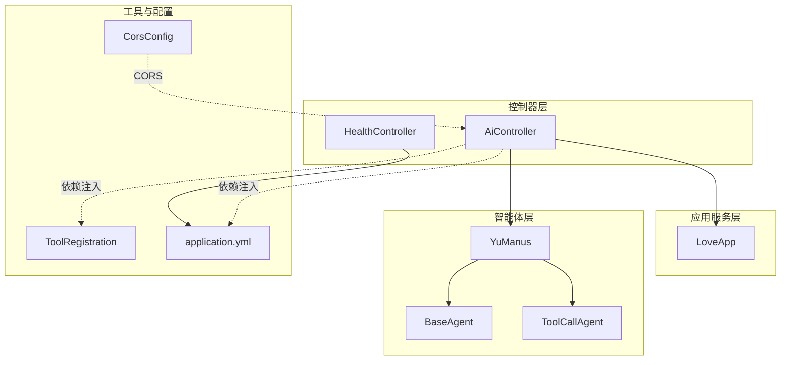
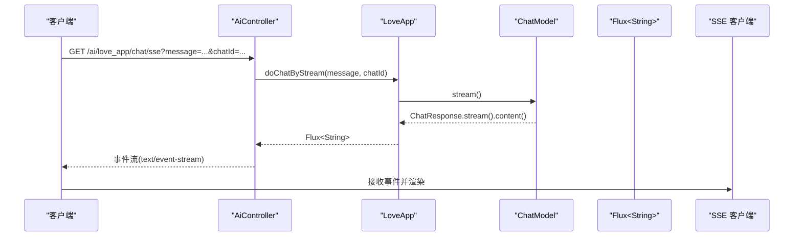
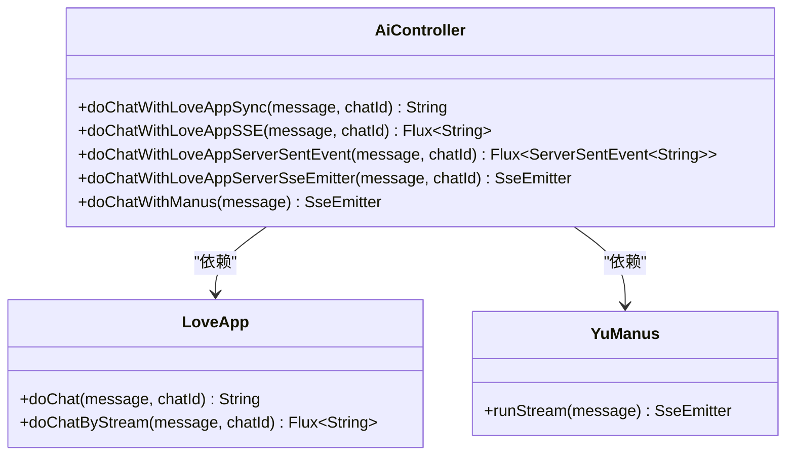
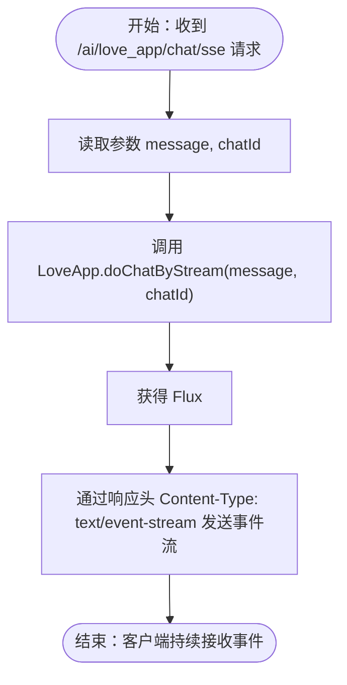
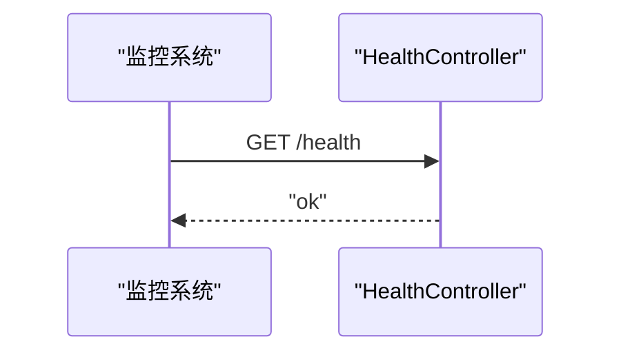
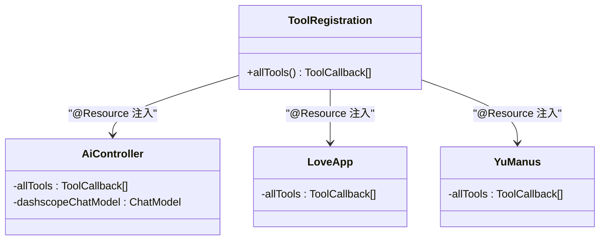
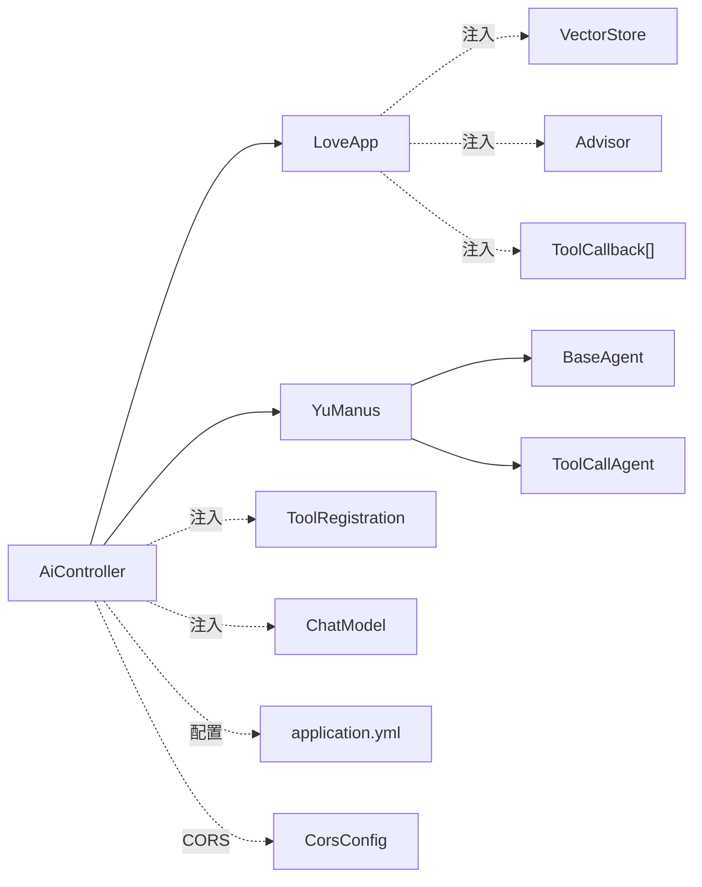

# 控制器层设计

<cite>
**本文档引用的文件**
- [AiController.java](file://src/main/java/com/yupi/yuaiagent/controller/AiController.java)
- [HealthController.java](file://src/main/java/com/yupi/yuaiagent/controller/HealthController.java)
- [LoveApp.java](file://src/main/java/com/yupi/yuaiagent/app/LoveApp.java)
- [YuManus.java](file://src/main/java/com/yupi/yuaiagent/agent/YuManus.java)
- [BaseAgent.java](file://src/main/java/com/yupi/yuaiagent/agent/BaseAgent.java)
- [ToolCallAgent.java](file://src/main/java/com/yupi/yuaiagent/agent/ToolCallAgent.java)
- [ToolRegistration.java](file://src/main/java/com/yupi/yuaiagent/tools/ToolRegistration.java)
- [CorsConfig.java](file://src/main/java/com/yupi/yuaiagent/config/CorsConfig.java)
- [application.yml](file://src/main/resources/application.yml)
- [MyLoggerAdvisor.java](file://src/main/java/com/yupi/yuaiagent/advisor/MyLoggerAdvisor.java)
- [ReReadingAdvisor.java](file://src/main/java/com/yupi/yuaiagent/advisor/ReReadingAdvisor.java)
- [AgentState.java](file://src/main/java/com/yupi/yuaiagent/agent/model/AgentState.java)
- [YuAiAgentApplication.java](file://src/main/java/com/yupi/yuaiagent/YuAiAgentApplication.java)
</cite>

## 目录
1. [简介](#简介)
2. [项目结构](#项目结构)
3. [核心组件](#核心组件)
4. [架构总览](#架构总览)
5. [详细组件分析](#详细组件分析)
6. [依赖分析](#依赖分析)
7. [性能考虑](#性能考虑)
8. [故障排除指南](#故障排除指南)
9. [结论](#结论)
10. [附录](#附录)

## 简介
本指南聚焦于控制器层的设计与实现，围绕 AiController 的 RESTful API 设计模式展开，涵盖同步聊天、SSE 流式聊天、Server-Sent Events 的实现原理与实时聊天应用、响应式编程 Flux 的使用场景与优势、健康检查接口与监控集成、错误处理与参数验证、依赖注入与工具数组获取机制，以及 API 版本控制与兼容性管理策略。通过对项目中控制器、应用服务、智能体与工具体系的深入分析，帮助读者建立对整体架构与实现细节的全面认知。

## 项目结构
后端采用 Spring Boot 架构，控制器位于 controller 包，应用服务位于 app 包，智能体与工具位于 agent 与 tools 包，配置位于 config 包，资源配置位于 resources。控制器层通过依赖注入获取应用服务与工具数组，对外暴露统一的 REST 接口，支持同步与流式两种交互模式，并提供健康检查端点。

图表来源
- [AiController.java:18-105](file://src/main/java/com/yupi/yuaiagent/controller/AiController.java#L18-L105)
- [HealthController.java:7-15](file://src/main/java/com/yupi/yuaiagent/controller/HealthController.java#L7-L15)
- [LoveApp.java:27-226](file://src/main/java/com/yupi/yuaiagent/app/LoveApp.java#L27-L226)
- [YuManus.java:9-37](file://src/main/java/com/yupi/yuaiagent/agent/YuManus.java#L9-L37)
- [BaseAgent.java:17-192](file://src/main/java/com/yupi/yuaiagent/agent/BaseAgent.java#L17-L192)
- [ToolCallAgent.java:24-135](file://src/main/java/com/yupi/yuaiagent/agent/ToolCallAgent.java#L24-L135)
- [ToolRegistration.java:9-37](file://src/main/java/com/yupi/yuaiagent/tools/ToolRegistration.java#L9-L37)
- [CorsConfig.java:7-25](file://src/main/java/com/yupi/yuaiagent/config/CorsConfig.java#L7-L25)
- [application.yml:1-66](file://src/main/resources/application.yml#L1-L66)

章节来源
- [AiController.java:18-105](file://src/main/java/com/yupi/yuaiagent/controller/AiController.java#L18-L105)
- [HealthController.java:7-15](file://src/main/java/com/yupi/yuaiagent/controller/HealthController.java#L7-L15)
- [application.yml:1-66](file://src/main/resources/application.yml#L1-L66)

## 核心组件
- 控制器层
  - AiController：提供同步聊天、多种 SSE 实现（Flux 字符串、ServerSentEvent、SseEmitter）、超级智能体流式聊天等接口。
  - HealthController：提供健康检查端点，便于监控系统探测服务可用性。
- 应用服务层
  - LoveApp：封装 ChatClient、Advisor、工具回调、向量存储等，提供同步与流式对话能力，支持多轮对话记忆、RAG、工具调用与 MCP 服务。
- 智能体层
  - BaseAgent：抽象基础代理类，提供状态机、步骤控制与流式输出的 SSE 实现。
  - ToolCallAgent：继承 ReActAgent，实现工具选择与执行，禁用 Spring AI 内置工具调用机制，自管消息上下文与工具调用。
  - YuManus：具体智能体实现，设置系统提示词与下一步提示词，绑定 ChatClient。
- 工具与配置
  - ToolRegistration：集中注册工具数组，作为 Bean 暴露给控制器层。
  - CorsConfig：全局跨域配置，放行 Cookie、允许任意源与头部。
  - application.yml：应用配置，包含 OpenAI/Spring AI 相关配置、Swagger/Knife4j 文档配置、服务端口与上下文路径等。

章节来源
- [AiController.java:18-105](file://src/main/java/com/yupi/yuaiagent/controller/AiController.java#L18-L105)
- [HealthController.java:7-15](file://src/main/java/com/yupi/yuaiagent/controller/HealthController.java#L7-L15)
- [LoveApp.java:27-226](file://src/main/java/com/yupi/yuaiagent/app/LoveApp.java#L27-L226)
- [YuManus.java:9-37](file://src/main/java/com/yupi/yuaiagent/agent/YuManus.java#L9-L37)
- [BaseAgent.java:17-192](file://src/main/java/com/yupi/yuaiagent/agent/BaseAgent.java#L17-L192)
- [ToolCallAgent.java:24-135](file://src/main/java/com/yupi/yuaiagent/agent/ToolCallAgent.java#L24-L135)
- [ToolRegistration.java:9-37](file://src/main/java/com/yupi/yuaiagent/tools/ToolRegistration.java#L9-L37)
- [CorsConfig.java:7-25](file://src/main/java/com/yupi/yuaiagent/config/CorsConfig.java#L7-L25)
- [application.yml:1-66](file://src/main/resources/application.yml#L1-L66)

## 架构总览
控制器层通过依赖注入获取应用服务与工具数组，将业务逻辑委托给 LoveApp 与 YuManus，后者基于 Spring AI 的 ChatClient 与响应式 Flux 实现流式输出。SSE 通过三种方式实现：直接返回 Flux<String>、包装为 ServerSentEvent、或使用 SseEmitter 手动推送事件。CORS 全局放行，便于前端跨域访问。健康检查端点用于监控集成。

图表来源
- [AiController.java:50-53](file://src/main/java/com/yupi/yuaiagent/controller/AiController.java#L50-L53)
- [LoveApp.java:90-97](file://src/main/java/com/yupi/yuaiagent/app/LoveApp.java#L90-L97)

## 详细组件分析

### AiController RESTful API 设计模式
- 同步聊天接口
  - 路径：/ai/love_app/chat/sync
  - 参数：message、chatId
  - 行为：调用 LoveApp 的同步对话方法，返回完整回答字符串。
- SSE 流式聊天接口（Flux<String>）
  - 路径：/ai/love_app/chat/sse
  - 参数：message、chatId
  - 行为：直接返回 Flux<String>，由 Spring WebFlux 自动序列化为 text/event-stream。
- SSE 流式聊天接口（ServerSentEvent<String>）
  - 路径：/ai/love_app/chat/server_sent_event
  - 参数：message、chatId
  - 行为：将 Flux<String> 映射为 Flux<ServerSentEvent<String>>，便于添加事件类型与元数据。
- SSE 流式聊天接口（SseEmitter）
  - 路径：/ai/love_app/chat/sse_emitter
  - 参数：message、chatId
  - 行为：创建长连接 SseEmitter，订阅 Flux 并逐片推送，适合复杂错误处理与手动控制。
- 超级智能体流式聊天
  - 路径：/ai/manus/chat
  - 参数：message
  - 行为：构造 YuManus，委托其 BaseAgent.runStream 实现分步流式输出。

图表来源
- [AiController.java:38-104](file://src/main/java/com/yupi/yuaiagent/controller/AiController.java#L38-L104)
- [LoveApp.java:71-97](file://src/main/java/com/yupi/yuaiagent/app/LoveApp.java#L71-L97)
- [YuManus.java:12-37](file://src/main/java/com/yupi/yuaiagent/agent/YuManus.java#L12-L37)

章节来源
- [AiController.java:38-104](file://src/main/java/com/yupi/yuaiagent/controller/AiController.java#L38-L104)

### SSE（Server-Sent Events）实现原理与实时聊天应用
- 原理概述
  - 服务器通过持久连接向客户端推送事件流，客户端以 EventSource 接收并渲染。
  - 在本项目中，SSE 通过三种方式实现：
    - 直接返回 Flux<String>：最简洁，自动序列化为 text/event-stream。
    - 包装为 ServerSentEvent<String>：可设置 data 字段，便于前端解析。
    - 使用 SseEmitter：手动订阅 Flux 并推送，支持更细粒度的错误处理与生命周期管理。
- 实时聊天应用
  - LoveApp 的 doChatByStream 返回 Flux<String>，AiController 将其直接暴露为 SSE 接口，前端可实时接收分片回复。
  - BaseAgent.runStream 提供分步执行的 SSE 输出，适合展示智能体的思考与行动过程。

图表来源
- [AiController.java:50-53](file://src/main/java/com/yupi/yuaiagent/controller/AiController.java#L50-L53)
- [LoveApp.java:90-97](file://src/main/java/com/yupi/yuaiagent/app/LoveApp.java#L90-L97)

章节来源
- [AiController.java:50-92](file://src/main/java/com/yupi/yuaiagent/controller/AiController.java#L50-L92)
- [LoveApp.java:90-97](file://src/main/java/com/yupi/yuaiagent/app/LoveApp.java#L90-L97)
- [BaseAgent.java:100-177](file://src/main/java/com/yupi/yuaiagent/agent/BaseAgent.java#L100-L177)

### 响应式编程 Flux 的使用场景与优势
- 使用场景
  - 流式对话：LoveApp 通过 ChatClient.stream() 返回 Flux<String>，AiController 直接暴露为 SSE。
  - 日志与可观测性：MyLoggerAdvisor 在流式调用中聚合响应并输出日志，便于调试与审计。
- 优势
  - 资源友好：背压与延迟求值，减少内存占用。
  - 可组合性强：可链式变换、过滤、聚合，便于扩展。
  - 与 WebFlux 协同：天然适配 Spring WebFlux 的非阻塞模型。

章节来源
- [LoveApp.java:90-97](file://src/main/java/com/yupi/yuaiagent/app/LoveApp.java#L90-L97)
- [MyLoggerAdvisor.java:13-53](file://src/main/java/com/yupi/yuaiagent/advisor/MyLoggerAdvisor.java#L13-L53)

### 健康检查接口与监控集成
- 健康检查
  - 路径：/health
  - 方法：GET
  - 响应：简单字符串“ok”，便于探活脚本与容器编排系统使用。
- 监控集成
  - Swagger/Knife4j：通过 application.yml 配置，自动扫描控制器包，生成在线文档。
  - 日志级别：可将 Spring AI 日志级别调整为 DEBUG，便于观察调用细节。

图表来源
- [HealthController.java:11-14](file://src/main/java/com/yupi/yuaiagent/controller/HealthController.java#L11-L14)
- [application.yml:42-59](file://src/main/resources/application.yml#L42-L59)

章节来源
- [HealthController.java:7-15](file://src/main/java/com/yupi/yuaiagent/controller/HealthController.java#L7-L15)
- [application.yml:42-59](file://src/main/resources/application.yml#L42-L59)

### 错误处理、参数验证与异常映射最佳实践
- 参数校验
  - AiController 中的接口未显式添加参数校验注解，建议在生产环境中引入 @Valid 与 DTO 校验，确保 message、chatId 等参数的合法性。
- 异常处理
  - BaseAgent.runStream 在异常分支中通过 SSE 发送错误消息并完成连接，保证客户端能够感知异常。
  - SseEmitter.onTimeout/onCompletion 提供生命周期回调，便于清理资源与状态变更。
- 建议
  - 统一异常映射：通过 @ControllerAdvice 定义全局异常处理器，将业务异常转为标准 JSON 响应码与消息。
  - 参数默认值与边界：为 chatId 提供默认值或生成策略，避免空值导致的上下文丢失。

章节来源
- [BaseAgent.java:100-177](file://src/main/java/com/yupi/yuaiagent/agent/BaseAgent.java#L100-L177)
- [AiController.java:77-92](file://src/main/java/com/yupi/yuaiagent/controller/AiController.java#L77-L92)

### 依赖注入与工具数组获取机制
- 依赖注入
  - AiController 通过 @Resource 注入 LoveApp、ToolCallback[] allTools、ChatModel。
  - ToolRegistration 通过 @Bean 暴露 ToolCallback[] allTools，供控制器与智能体使用。
- 工具数组
  - ToolRegistration 集中注册文件操作、网络搜索、网页抓取、资源下载、终端操作、PDF 生成、终止工具等，形成统一工具集。
  - LoveApp 与 YuManus 均可通过依赖注入获取 allTools，实现工具驱动的对话能力。

图表来源
- [ToolRegistration.java:18-36](file://src/main/java/com/yupi/yuaiagent/tools/ToolRegistration.java#L18-L36)
- [AiController.java:22-29](file://src/main/java/com/yupi/yuaiagent/controller/AiController.java#L22-L29)
- [LoveApp.java:175-176](file://src/main/java/com/yupi/yuaiagent/app/LoveApp.java#L175-L176)
- [YuManus.java:15-16](file://src/main/java/com/yupi/yuaiagent/agent/YuManus.java#L15-L16)

章节来源
- [ToolRegistration.java:9-37](file://src/main/java/com/yupi/yuaiagent/tools/ToolRegistration.java#L9-L37)
- [AiController.java:22-29](file://src/main/java/com/yupi/yuaiagent/controller/AiController.java#L22-L29)
- [LoveApp.java:175-176](file://src/main/java/com/yupi/yuaiagent/app/LoveApp.java#L175-L176)
- [YuManus.java:15-16](file://src/main/java/com/yupi/yuaiagent/agent/YuManus.java#L15-L16)

### API 版本控制与兼容性管理策略
- 当前现状
  - 控制器层未显式实现版本号前缀或路径后缀，接口路径如 /ai/love_app/chat/sync、/ai/love_app/chat/sse 等未带版本标识。
- 建议策略
  - 路径版本化：将 /ai 替换为 /api/v1/ai，后续 v2 保持兼容性的同时新增接口。
  - 头部版本化：通过 Accept-Version 或 X-API-Version 头部区分版本。
  - 向后兼容：新增字段或接口时保留旧字段，标记废弃字段，逐步迁移。
  - 文档同步：Swagger/Knife4j 配置 group-configs 仅扫描控制器包，版本切换时保持文档分组清晰。

章节来源
- [application.yml:50-53](file://src/main/resources/application.yml#L50-L53)
- [AiController.java:18-20](file://src/main/java/com/yupi/yuaiagent/controller/AiController.java#L18-L20)

## 依赖分析
- 控制器依赖
  - AiController 依赖 LoveApp 与 YuManus，二者均通过 @Component 注册，控制器通过 @Resource 注入。
  - 工具数组通过 ToolRegistration 的 @Bean 暴露，控制器与智能体均可注入使用。
- 应用服务依赖
  - LoveApp 依赖 ChatModel、Advisor、VectorStore、ToolCallback[]、ToolCallbackProvider 等，构建 ChatClient 并提供多轮对话、RAG、工具调用与 MCP 服务能力。
- 配置依赖
  - application.yml 提供 OpenAI/Spring AI 配置、Swagger/Knife4j 文档配置、服务端口与上下文路径。
  - CorsConfig 全局放行跨域，便于前端访问。

图表来源
- [AiController.java:22-29](file://src/main/java/com/yupi/yuaiagent/controller/AiController.java#L22-L29)
- [LoveApp.java:126-203](file://src/main/java/com/yupi/yuaiagent/app/LoveApp.java#L126-L203)
- [ToolRegistration.java:18-36](file://src/main/java/com/yupi/yuaiagent/tools/ToolRegistration.java#L18-L36)
- [application.yml:1-66](file://src/main/resources/application.yml#L1-L66)
- [CorsConfig.java:11-24](file://src/main/java/com/yupi/yuaiagent/config/CorsConfig.java#L11-L24)

章节来源
- [AiController.java:22-29](file://src/main/java/com/yupi/yuaiagent/controller/AiController.java#L22-L29)
- [LoveApp.java:126-203](file://src/main/java/com/yupi/yuaiagent/app/LoveApp.java#L126-L203)
- [ToolRegistration.java:18-36](file://src/main/java/com/yupi/yuaiagent/tools/ToolRegistration.java#L18-L36)
- [application.yml:1-66](file://src/main/resources/application.yml#L1-L66)
- [CorsConfig.java:11-24](file://src/main/java/com/yupi/yuaiagent/config/CorsConfig.java#L11-L24)

## 性能考虑
- 流式输出
  - 使用 Flux 与 SSE 减少一次性响应体积，提升用户体验与服务器内存占用表现。
- 超时与背压
  - SseEmitter 设置合理超时时间，避免长时间占用连接；Flux 侧遵循背压策略，避免上游压力过大。
- 日志与可观测性
  - MyLoggerAdvisor 在流式场景中聚合响应，便于定位问题；可将日志级别调整为 DEBUG 观察调用细节。
- 资源清理
  - BaseAgent 在 finally 中清理资源，SseEmitter 提供 onTimeout/onCompletion 回调，确保异常与正常完成路径均能释放资源。

## 故障排除指南
- 健康检查失败
  - 检查 /health 接口是否返回“ok”，确认服务已启动且端口正确。
- SSE 连接中断
  - 检查 SseEmitter 超时设置与网络稳定性；关注 onTimeout/onCompletion 回调日志。
- 工具调用异常
  - 确认 ToolRegistration 中工具注册完整；检查工具执行结果与终止工具调用。
- 跨域问题
  - 确认 CorsConfig 已生效，允许 Cookie、任意源与头部。

章节来源
- [HealthController.java:11-14](file://src/main/java/com/yupi/yuaiagent/controller/HealthController.java#L11-L14)
- [BaseAgent.java:162-176](file://src/main/java/com/yupi/yuaiagent/agent/BaseAgent.java#L162-L176)
- [CorsConfig.java:14-24](file://src/main/java/com/yupi/yuaiagent/config/CorsConfig.java#L14-L24)

## 结论
本控制器层设计以 AiController 为核心，结合 LoveApp 的应用服务能力与 YuManus 的智能体体系，提供了同步与流式两种交互模式，并通过三种 SSE 实现满足不同场景需求。配合响应式编程与全局配置，系统具备良好的扩展性与可观测性。建议在生产环境中补充参数校验、统一异常映射与 API 版本控制策略，以进一步提升健壮性与长期演进能力。

## 附录
- 关键配置项
  - 服务端口与上下文路径：server.port、server.servlet.context-path
  - OpenAI/Spring AI 配置：ai.dashscope、ai.ollama
  - 文档配置：springdoc、knife4j
- 状态枚举
  - AgentState：IDLE、RUNNING、FINISHED、ERROR，用于智能体状态机管理。

章节来源
- [application.yml:38-66](file://src/main/resources/application.yml#L38-L66)
- [AgentState.java:6-27](file://src/main/java/com/yupi/yuaiagent/agent/model/AgentState.java#L6-L27)