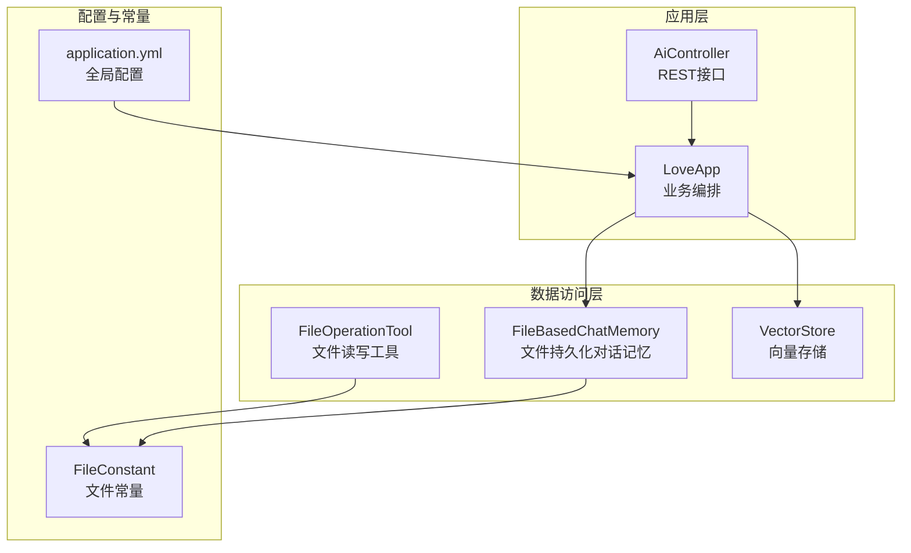
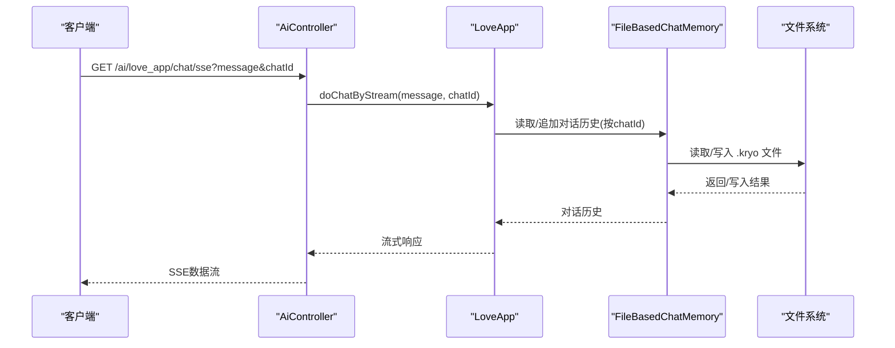
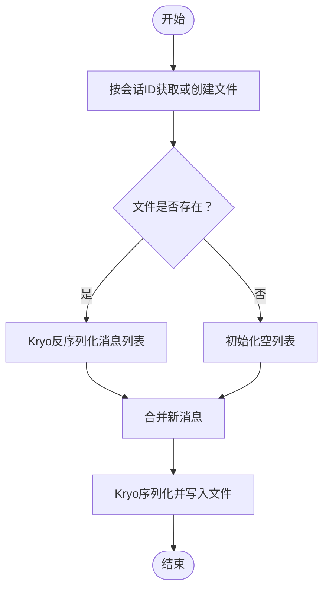
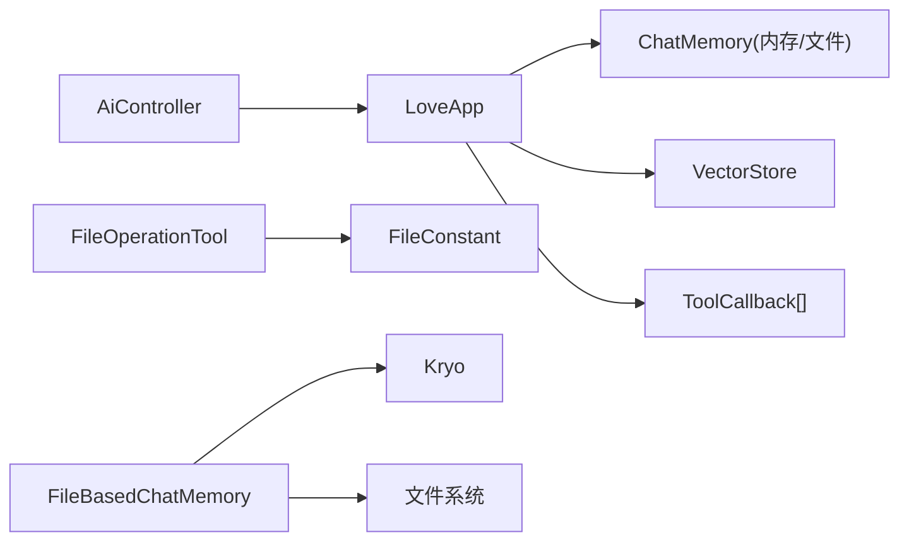
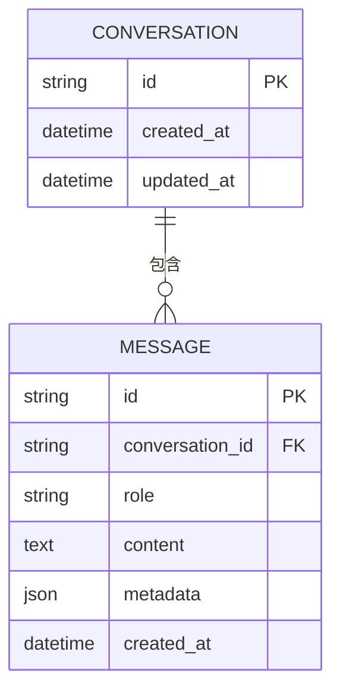
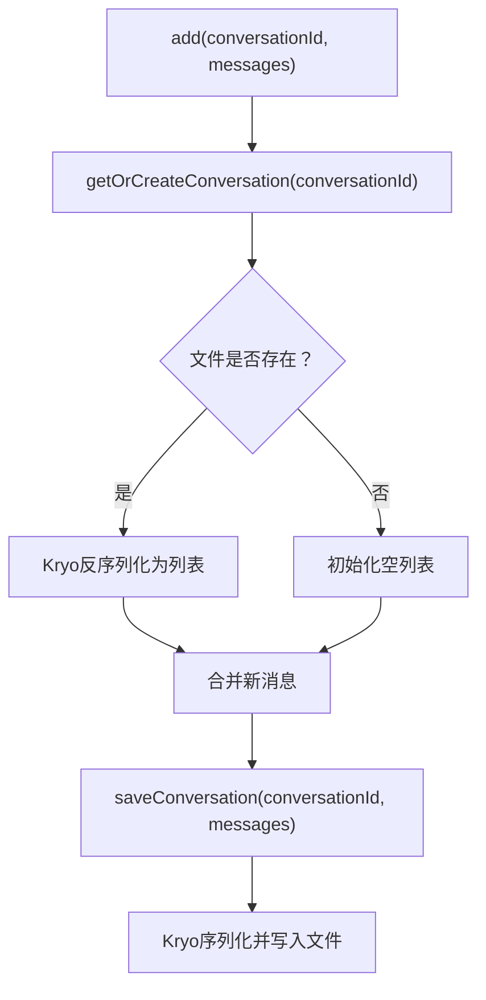

# 数据管理

<cite>
**本文引用的文件**
- [FileConstant.java](file://src/main/java/com/yupi/yuaiagent/constant/FileConstant.java)
- [FileBasedChatMemory.java](file://src/main/java/com/yupi/yuaiagent/chatmemory/FileBasedChatMemory.java)
- [FileOperationTool.java](file://src/main/java/com/yupi/yuaiagent/tools/FileOperationTool.java)
- [LoveApp.java](file://src/main/java/com/yupi/yuaiagent/app/LoveApp.java)
- [AiController.java](file://src/main/java/com/yupi/yuaiagent/controller/AiController.java)
- [application.yml](file://src/main/resources/application.yml)
- [PgVectorVectorStoreConfig.java](file://src/main/java/com/yupi/yuaiagent/rag/PgVectorVectorStoreConfig.java)
- [YuAiAgentApplication.java](file://src/main/java/com/yupi/yuaiagent/YuAiAgentApplication.java)
- [LoveAppDocumentLoader.java](file://src/main/java/com/yupi/yuaiagent/rag/LoveAppDocumentLoader.java)
- [MyTokenTextSplitter.java](file://src/main/java/com/yupi/yuaiagent/rag/MyTokenTextSplitter.java)
- [FileOperationToolTest.java](file://src/test/java/com/yupi/yuaiagent/tools/FileOperationToolTest.java)
</cite>

## 目录
1. [简介](#简介)
2. [项目结构](#项目结构)
3. [核心组件](#核心组件)
4. [架构总览](#架构总览)
5. [详细组件分析](#详细组件分析)
6. [依赖分析](#依赖分析)
7. [性能考虑](#性能考虑)
8. [故障排查指南](#故障排查指南)
9. [结论](#结论)
10. [附录](#附录)

## 简介
本文件聚焦于本项目的“数据管理”主题，围绕以下方面展开：
- 文件常量与文件系统管理策略
- 基于文件的对话记忆实现（文件存储格式、序列化与持久化）
- 数据访问层设计模式与DAO接口现状
- 数据模型设计原则与数据库schema规划方法
- 数据迁移、备份恢复与数据清理策略
- 缓存机制与数据一致性保障
- 数据安全与隐私保护方案

## 项目结构
本项目采用Spring Boot应用结构，数据相关的关键模块分布如下：
- 常量与文件系统：constant、tools
- 对话记忆：chatmemory
- 应用编排与控制器：app、controller
- 向量存储与RAG：rag
- 配置：resources/application.yml
- 启动类：YuAiAgentApplication.java

图表来源
- [AiController.java:18-106](file://src/main/java/com/yupi/yuaiagent/controller/AiController.java#L18-L106)
- [LoveApp.java:27-62](file://src/main/java/com/yupi/yuaiagent/app/LoveApp.java#L27-L62)
- [FileBasedChatMemory.java:20-93](file://src/main/java/com/yupi/yuaiagent/chatmemory/FileBasedChatMemory.java#L20-L93)
- [FileOperationTool.java:11-41](file://src/main/java/com/yupi/yuaiagent/tools/FileOperationTool.java#L11-L41)
- [FileConstant.java:6-12](file://src/main/java/com/yupi/yuaiagent/constant/FileConstant.java#L6-L12)
- [application.yml:1-66](file://src/main/resources/application.yml#L1-L66)

章节来源
- [AiController.java:18-106](file://src/main/java/com/yupi/yuaiagent/controller/AiController.java#L18-L106)
- [LoveApp.java:27-62](file://src/main/java/com/yupi/yuaiagent/app/LoveApp.java#L27-L62)
- [FileBasedChatMemory.java:20-93](file://src/main/java/com/yupi/yuaiagent/chatmemory/FileBasedChatMemory.java#L20-L93)
- [FileOperationTool.java:11-41](file://src/main/java/com/yupi/yuaiagent/tools/FileOperationTool.java#L11-L41)
- [FileConstant.java:6-12](file://src/main/java/com/yupi/yuaiagent/constant/FileConstant.java#L6-L12)
- [application.yml:1-66](file://src/main/resources/application.yml#L1-L66)

## 核心组件
- 文件常量：集中定义文件保存目录，统一路径来源，便于后续扩展或切换存储介质。
- 文件持久化对话记忆：基于Kryo序列化，将消息列表以二进制文件形式存储在磁盘，按会话ID命名。
- 文件读写工具：封装UTF-8读写与目录创建逻辑，统一文件操作入口。
- 应用编排：在业务层选择内存或文件对话记忆，并通过ChatClient注入记忆与工具链。
- 向量存储：提供RAG能力，支持多种向量存储实现（含PgVector）。

章节来源
- [FileConstant.java:6-12](file://src/main/java/com/yupi/yuaiagent/constant/FileConstant.java#L6-L12)
- [FileBasedChatMemory.java:20-93](file://src/main/java/com/yupi/yuaiagent/chatmemory/FileBasedChatMemory.java#L20-L93)
- [FileOperationTool.java:11-41](file://src/main/java/com/yupi/yuaiagent/tools/FileOperationTool.java#L11-L41)
- [LoveApp.java:27-62](file://src/main/java/com/yupi/yuaiagent/app/LoveApp.java#L27-L62)
- [PgVectorVectorStoreConfig.java:19-40](file://src/main/java/com/yupi/yuaiagent/rag/PgVectorVectorStoreConfig.java#L19-L40)

## 架构总览
数据管理在本项目中呈现“应用编排—数据访问—存储介质”的分层结构：
- 控制器层负责接收请求并委派给应用编排层
- 应用编排层根据场景选择对话记忆（内存或文件）、工具与向量存储
- 数据访问层通过工具与文件持久化组件完成文件系统读写
- 配置层提供AI模型、向量存储等外部依赖的参数

图表来源
- [AiController.java:50-53](file://src/main/java/com/yupi/yuaiagent/controller/AiController.java#L50-L53)
- [LoveApp.java:90-97](file://src/main/java/com/yupi/yuaiagent/app/LoveApp.java#L90-L97)
- [FileBasedChatMemory.java:43-92](file://src/main/java/com/yupi/yuaiagent/chatmemory/FileBasedChatMemory.java#L43-L92)

## 详细组件分析

### 文件常量与文件系统管理策略
- 文件常量定义：集中声明文件保存目录，便于统一管理与替换。
- 文件系统策略：
  - 目录不存在时自动创建
  - 文件命名规则：会话ID + 固定后缀，避免冲突
  - 统一编码：文件读写采用UTF-8（工具类）
  - 安全性：仅在应用工作目录下创建子目录，降低越权风险

章节来源
- [FileConstant.java:6-12](file://src/main/java/com/yupi/yuaiagent/constant/FileConstant.java#L6-L12)
- [FileOperationTool.java:13-39](file://src/main/java/com/yupi/yuaiagent/tools/FileOperationTool.java#L13-L39)
- [FileBasedChatMemory.java:35-41](file://src/main/java/com/yupi/yuaiagent/chatmemory/FileBasedChatMemory.java#L35-L41)

### 基于文件的对话记忆实现
- 存储介质：磁盘文件（.kryo）
- 存储格式：Kryo二进制序列化，对象类型为消息列表
- 持久化机制：
  - 读取：若文件存在则反序列化为消息列表，否则返回空列表
  - 写入：将合并后的消息列表序列化并写回文件
  - 清理：按会话ID删除对应文件
- 并发与一致性：
  - 当前实现未引入锁或事务，多进程或多线程并发写同一会话可能产生竞态
  - 建议在上层控制并发或引入文件锁/原子写入策略

图表来源
- [FileBasedChatMemory.java:68-92](file://src/main/java/com/yupi/yuaiagent/chatmemory/FileBasedChatMemory.java#L68-L92)

章节来源
- [FileBasedChatMemory.java:20-93](file://src/main/java/com/yupi/yuaiagent/chatmemory/FileBasedChatMemory.java#L20-L93)

### 数据访问层设计模式与DAO接口现状
- 设计模式：
  - 适配器模式：应用层通过Advisor链路集成记忆、RAG、日志等横切能力
  - 工厂模式：RAG自定义Advisor由工厂创建
  - 组合/聚合：ChatClient组合ChatMemory、VectorStore、ToolCallback等组件
- DAO接口现状：
  - 未发现显式的DAO接口与实现类
  - 访问文件与向量存储主要通过工具类与Spring AI组件
  - 若需引入关系型数据库，建议新增DAO接口与实现，遵循分层与职责分离

章节来源
- [LoveApp.java:54-61](file://src/main/java/com/yupi/yuaiagent/app/LoveApp.java#L54-L61)
- [LoveAppRagCustomAdvisorFactory.java:14-32](file://src/main/java/com/yupi/yuaiagent/rag/LoveAppRagCustomAdvisorFactory.java#L14-L32)
- [PgVectorVectorStoreConfig.java:19-40](file://src/main/java/com/yupi/yuaiagent/rag/PgVectorVectorStoreConfig.java#L19-L40)

### 数据模型设计原则与数据库Schema规划方法
- 设计原则：
  - 明确实体边界与关系，避免冗余字段
  - 为高频查询建立索引，合理选择主键与分区策略
  - 保持版本演进的兼容性，预留迁移通道
- Schema规划方法：
  - 从需求出发抽象实体与属性
  - 规划外键与约束，确保参照完整性
  - 评估读写比例，选择合适的数据类型与压缩策略
  - 为审计与追踪添加必要元数据字段

[本节为通用设计指导，不直接分析具体文件]

### 数据迁移、备份恢复与数据清理策略
- 迁移策略：
  - 版本化：为文件格式与Schema增加版本号字段
  - 双写：迁移期间同时写入新旧格式，逐步切换
  - 校验：迁移完成后进行抽样校验与一致性检查
- 备份恢复：
  - 文件备份：定期归档tmp目录与向量存储数据
  - 恢复流程：按版本顺序恢复，验证完整性后再上线
- 数据清理：
  - 生命周期：按会话过期策略清理历史文件
  - 定时任务：通过调度器定期扫描并删除过期数据

[本节为通用策略指导，不直接分析具体文件]

### 缓存机制与数据一致性保障
- 现状：
  - 内存对话记忆：MessageWindowChatMemory用于短期会话
  - 文件对话记忆：持久化至磁盘，适合重启后恢复
  - 向量存储：PgVector等外部存储，具备独立缓存与索引
- 一致性建议：
  - 引入幂等写入与版本控制，避免竞态
  - 在应用层对并发写入进行串行化或加锁
  - 对关键路径进行一致性校验（如读写一致性检查）

章节来源
- [LoveApp.java:48-51](file://src/main/java/com/yupi/yuaiagent/app/LoveApp.java#L48-L51)
- [FileBasedChatMemory.java:43-61](file://src/main/java/com/yupi/yuaiagent/chatmemory/FileBasedChatMemory.java#L43-L61)

### 数据安全与隐私保护
- 敏感信息管理：
  - 配置文件中避免硬编码密钥，使用环境变量或安全配置中心
  - 生产环境配置文件不应包含敏感信息
- 访问控制：
  - 限制文件系统权限，仅允许应用账户访问
  - 对外部API调用进行鉴权与限流
- 数据脱敏：
  - 日志与监控中避免输出敏感字段
  - 对用户输入进行最小化收集与匿名化处理

章节来源
- [application.yml:11-17](file://src/main/resources/application.yml#L11-L17)
- [application-prod.yml:1-2](file://src/main/resources/application-prod.yml#L1-L2)

## 依赖分析
- 组件耦合：
  - AiController依赖LoveApp
  - LoveApp依赖ChatMemory（内存或文件）、VectorStore、ToolCallback
  - FileOperationTool依赖FileConstant
  - FileBasedChatMemory依赖Kryo与文件系统
- 外部依赖：
  - Spring AI：ChatClient、ChatMemory、VectorStore
  - Kryo：对象序列化
  - Hutool：文件工具

图表来源
- [AiController.java:22-29](file://src/main/java/com/yupi/yuaiagent/controller/AiController.java#L22-L29)
- [LoveApp.java:31-61](file://src/main/java/com/yupi/yuaiagent/app/LoveApp.java#L31-L61)
- [FileOperationTool.java:13-13](file://src/main/java/com/yupi/yuaiagent/tools/FileOperationTool.java#L13-L13)
- [FileBasedChatMemory.java:23-23](file://src/main/java/com/yupi/yuaiagent/chatmemory/FileBasedChatMemory.java#L23-L23)

章节来源
- [AiController.java:22-29](file://src/main/java/com/yupi/yuaiagent/controller/AiController.java#L22-L29)
- [LoveApp.java:31-61](file://src/main/java/com/yupi/yuaiagent/app/LoveApp.java#L31-L61)
- [FileOperationTool.java:13-13](file://src/main/java/com/yupi/yuaiagent/tools/FileOperationTool.java#L13-L13)
- [FileBasedChatMemory.java:23-23](file://src/main/java/com/yupi/yuaiagent/chatmemory/FileBasedChatMemory.java#L23-L23)

## 性能考虑
- 序列化开销：Kryo序列化/反序列化成本较低，但大消息列表会增加IO与CPU消耗
- IO瓶颈：磁盘随机读写可能成为瓶颈，建议：
  - 合理拆分会话，避免单文件过大
  - 使用SSD或更高IOPS存储
  - 对频繁读写的会话引入内存缓存
- 并发控制：多线程/多进程写入需加锁或采用原子写入，避免竞态
- 向量检索：向量存储的索引与距离计算会影响查询延迟，需结合硬件与参数优化

[本节提供通用性能建议，不直接分析具体文件]

## 故障排查指南
- 文件读写异常：
  - 检查文件目录权限与磁盘空间
  - 确认UTF-8编码一致
- 序列化/反序列化失败：
  - 确保对象类型稳定且可被Kryo识别
  - 检查文件损坏或被外部程序修改
- 会话历史丢失：
  - 核对会话ID是否正确传递
  - 检查清理策略是否误删
- 向量检索异常：
  - 检查向量维度与距离类型配置
  - 确认文档加载与索引初始化成功

章节来源
- [FileOperationTool.java:18-22](file://src/main/java/com/yupi/yuaiagent/tools/FileOperationTool.java#L18-L22)
- [FileOperationTool.java:31-38](file://src/main/java/com/yupi/yuaiagent/tools/FileOperationTool.java#L31-L38)
- [FileBasedChatMemory.java:72-76](file://src/main/java/com/yupi/yuaiagent/chatmemory/FileBasedChatMemory.java#L72-L76)
- [FileOperationToolTest.java:10-25](file://src/test/java/com/yupi/yuaiagent/tools/FileOperationToolTest.java#L10-L25)

## 结论
本项目在数据管理方面采用了“文件系统+向量存储”的混合方案：
- 文件常量与工具类提供了统一的文件系统入口
- 基于Kryo的文件对话记忆实现了轻量级持久化
- 应用层通过ChatClient与Advisor链路灵活组合记忆、工具与RAG能力
- 配置层支持多种外部服务（如DashScope、Ollama、PgVector）
建议后续在DAO层引入标准化接口、完善并发控制与一致性保障，并制定版本化迁移与备份策略，以提升系统的可维护性与可靠性。

[本节为总结性内容，不直接分析具体文件]

## 附录

### 数据模型与Schema规划示例（概念）

[本图为概念示意，不映射到具体源码文件]

### 关键流程图：文件对话记忆写入

图表来源
- [FileBasedChatMemory.java:44-88](file://src/main/java/com/yupi/yuaiagent/chatmemory/FileBasedChatMemory.java#L44-L88)