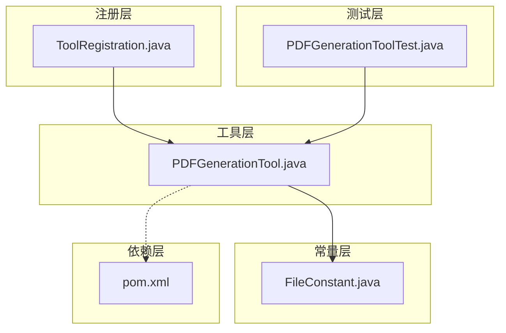
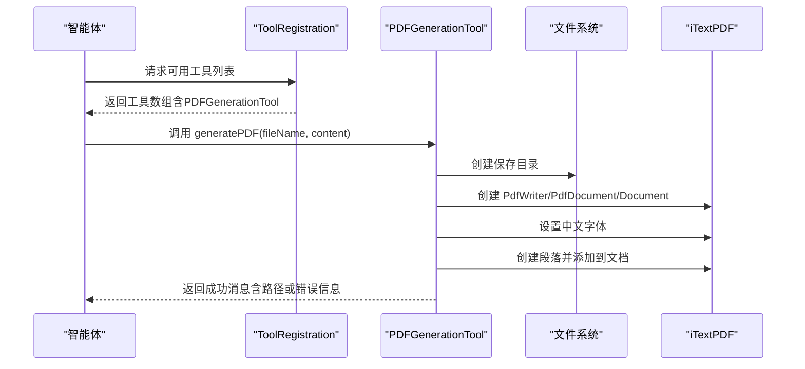
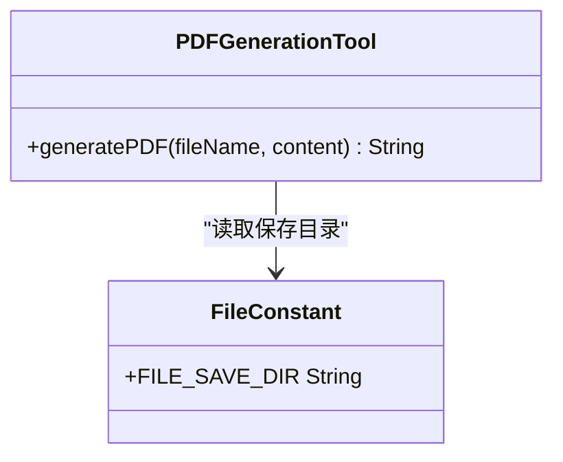
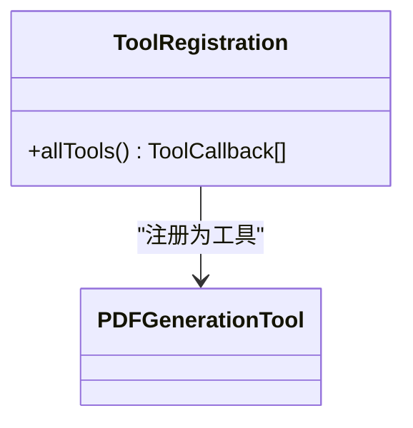
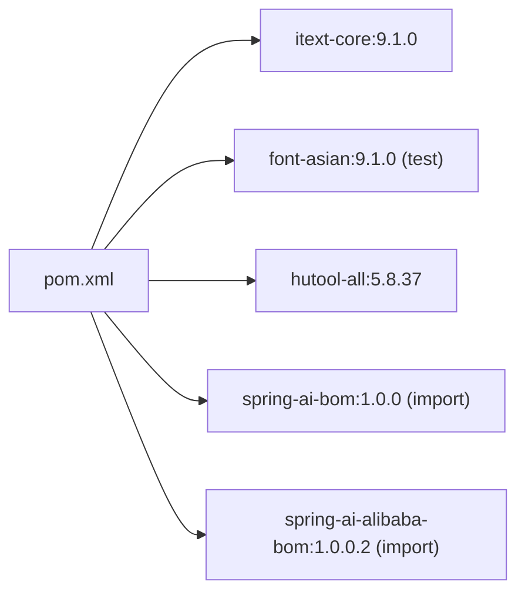

# PDF生成工具

<cite>
**本文引用的文件列表**
- [PDFGenerationTool.java](file://src/main/java/com/yupi/yuaiagent/tools/PDFGenerationTool.java)
- [PDFGenerationToolTest.java](file://src/test/java/com/yupi/yuaiagent/tools/PDFGenerationToolTest.java)
- [FileConstant.java](file://src/main/java/com/yupi/yuaiagent/constant/FileConstant.java)
- [ToolRegistration.java](file://src/main/java/com/yupi/yuaiagent/tools/ToolRegistration.java)
- [pom.xml](file://pom.xml)
</cite>

## 目录
1. [简介](#简介)
2. [项目结构](#项目结构)
3. [核心组件](#核心组件)
4. [架构总览](#架构总览)
5. [组件详细分析](#组件详细分析)
6. [依赖关系分析](#依赖关系分析)
7. [性能与内存管理](#性能与内存管理)
8. [故障排查指南](#故障排查指南)
9. [结论](#结论)
10. [附录：使用示例与最佳实践](#附录使用示例与最佳实践)

## 简介
本文件为“PDF生成工具”的技术文档，聚焦于PDFGenerationTool的实现架构与功能特性，涵盖PDF模板设计、内容填充、样式渲染、iTextPDF库集成与配置、流程控制与错误处理、实际应用场景与使用示例、性能优化策略与内存管理、以及测试方法与常见问题解决方案。该工具通过Spring AI工具注解暴露为可被智能体调用的能力，并基于iTextPDF 9.x与font-asian扩展实现中文字体支持与基础排版。

## 项目结构
围绕PDF生成能力的相关模块与文件组织如下：
- 工具层：PDFGenerationTool作为独立工具类，负责生成PDF并返回路径或错误信息
- 常量层：FileConstant定义统一的文件保存根目录
- 注册层：ToolRegistration集中注册所有可用工具，包括PDFGenerationTool
- 测试层：PDFGenerationToolTest提供单元测试样例
- 依赖层：pom.xml声明Spring AI与iTextPDF相关依赖

图表来源
- [PDFGenerationTool.java:1-53](file://src/main/java/com/yupi/yuaiagent/tools/PDFGenerationTool.java#L1-L53)
- [FileConstant.java:1-13](file://src/main/java/com/yupi/yuaiagent/constant/FileConstant.java#L1-L13)
- [ToolRegistration.java:1-38](file://src/main/java/com/yupi/yuaiagent/tools/ToolRegistration.java#L1-L38)
- [PDFGenerationToolTest.java:1-17](file://src/test/java/com/yupi/yuaiagent/tools/PDFGenerationToolTest.java#L1-L17)
- [pom.xml:128-142](file://pom.xml#L128-L142)

章节来源
- [PDFGenerationTool.java:1-53](file://src/main/java/com/yupi/yuaiagent/tools/PDFGenerationTool.java#L1-L53)
- [FileConstant.java:1-13](file://src/main/java/com/yupi/yuaiagent/constant/FileConstant.java#L1-L13)
- [ToolRegistration.java:1-38](file://src/main/java/com/yupi/yuaiagent/tools/ToolRegistration.java#L1-L38)
- [PDFGenerationToolTest.java:1-17](file://src/test/java/com/yupi/yuaiagent/tools/PDFGenerationToolTest.java#L1-L17)
- [pom.xml:128-142](file://pom.xml#L128-L142)

## 核心组件
- PDFGenerationTool：提供generatePDF方法，接收文件名与内容参数，使用iTextPDF写入PDF，设置内置中文字体，将内容以段落形式添加至文档，最终返回保存路径或错误信息。
- FileConstant：提供统一的文件保存根目录，用于生成PDF的落盘路径。
- ToolRegistration：集中注册所有工具，包括PDFGenerationTool，供智能体调度使用。
- PDFGenerationToolTest：提供基本的单元测试，验证生成结果非空。

章节来源
- [PDFGenerationTool.java:21-51](file://src/main/java/com/yupi/yuaiagent/tools/PDFGenerationTool.java#L21-L51)
- [FileConstant.java:6-12](file://src/main/java/com/yupi/yuaiagent/constant/FileConstant.java#L6-L12)
- [ToolRegistration.java:18-36](file://src/main/java/com/yupi/yuaiagent/tools/ToolRegistration.java#L18-L36)
- [PDFGenerationToolTest.java:9-16](file://src/test/java/com/yupi/yuaiagent/tools/PDFGenerationToolTest.java#L9-L16)

## 架构总览
PDF生成工具在系统中的位置与交互如下：
- 智能体通过Spring AI工具回调机制调用PDFGenerationTool
- 工具内部使用iTextPDF创建PDF文档，设置字体并写入内容
- 生成结果以字符串形式返回，包含保存路径或错误信息

图表来源
- [ToolRegistration.java:18-36](file://src/main/java/com/yupi/yuaiagent/tools/ToolRegistration.java#L18-L36)
- [PDFGenerationTool.java:21-51](file://src/main/java/com/yupi/yuaiagent/tools/PDFGenerationTool.java#L21-L51)

## 组件详细分析

### PDFGenerationTool 类分析
- 角色与职责
  - 作为Spring AI工具，通过@Tool注解对外暴露
  - 接收文件名与内容两个参数，负责生成PDF并返回结果
- 关键流程
  - 计算保存目录与完整路径
  - 使用try-with-resources确保资源释放
  - 创建PdfWriter、PdfDocument与Document
  - 设置内置中文字体
  - 将内容封装为Paragraph并添加到Document
  - 返回成功消息或捕获IO异常并返回错误信息
- 错误处理
  - 捕获IOException并返回错误信息字符串
  - 未覆盖更细粒度的异常类型（如字体加载失败），建议后续增强

图表来源
- [PDFGenerationTool.java:19-51](file://src/main/java/com/yupi/yuaiagent/tools/PDFGenerationTool.java#L19-L51)
- [FileConstant.java:6-12](file://src/main/java/com/yupi/yuaiagent/constant/FileConstant.java#L6-L12)

章节来源
- [PDFGenerationTool.java:21-51](file://src/main/java/com/yupi/yuaiagent/tools/PDFGenerationTool.java#L21-L51)
- [FileConstant.java:6-12](file://src/main/java/com/yupi/yuaiagent/constant/FileConstant.java#L6-L12)

### 工具注册与集成
- ToolRegistration集中注册所有工具，包括PDFGenerationTool
- Spring AI通过回调机制将工具暴露给智能体
- 该模式便于统一管理工具生命周期与依赖注入

图表来源
- [ToolRegistration.java:18-36](file://src/main/java/com/yupi/yuaiagent/tools/ToolRegistration.java#L18-L36)

章节来源
- [ToolRegistration.java:18-36](file://src/main/java/com/yupi/yuaiagent/tools/ToolRegistration.java#L18-L36)

### 测试方法
- 单元测试验证生成结果非空
- 建议补充：
  - 成功场景断言返回消息包含预期路径
  - 异常场景断言返回错误信息字符串
  - 路径存在性与文件可读性校验

章节来源
- [PDFGenerationToolTest.java:9-16](file://src/test/java/com/yupi/yuaiagent/tools/PDFGenerationToolTest.java#L9-L16)

## 依赖关系分析
- Spring AI与iTextPDF集成
  - Spring AI：通过工具注解与回调机制暴露工具
  - iTextPDF：核心PDF生成库，版本9.1.0；font-asian用于中文字体支持（测试范围）
- Maven依赖
  - itext-core：9.1.0（聚合依赖）
  - font-asian：9.1.0（测试范围）
  - hutool：文件操作辅助
  - spring-boot-starter-web：Web环境支撑

图表来源
- [pom.xml:128-147](file://pom.xml#L128-L147)

章节来源
- [pom.xml:128-147](file://pom.xml#L128-L147)

## 性能与内存管理
- 资源管理
  - 使用try-with-resources确保PdfWriter、PdfDocument与Document在使用后自动关闭，避免资源泄漏
- 字体选择
  - 当前使用内置中文字体，无需额外字体文件，减少I/O与部署复杂度
- I/O路径
  - 采用临时目录保存PDF，建议结合业务需求设置持久化策略与清理机制
- 进一步优化建议
  - 大文本分块写入，避免一次性构建超长段落
  - 批量生成时复用字体与Writer实例（需评估并发安全）
  - 异步生成与队列化，避免阻塞主线程
  - 配置合理的缓冲区大小与流式写入策略

[本节为通用性能指导，不直接分析具体文件，故无章节来源]

## 故障排查指南
- 常见问题
  - 中文字体显示异常：确认font-asian依赖已正确引入并在运行环境中可用
  - 目录权限不足：检查FILE_SAVE_DIR对应的目录是否具备写权限
  - IO异常：查看返回的错误信息字符串，定位具体异常原因
- 定位方法
  - 在generatePDF中增加日志记录（建议使用日志框架）
  - 单元测试中增加断言，覆盖成功与失败分支
  - 验证路径拼接逻辑与目录创建逻辑

章节来源
- [PDFGenerationTool.java:48-50](file://src/main/java/com/yupi/yuaiagent/tools/PDFGenerationTool.java#L48-L50)
- [FileConstant.java:11](file://src/main/java/com/yupi/yuaiagent/constant/FileConstant.java#L11)

## 结论
PDFGenerationTool以简洁的方式实现了基础PDF生成能力，依托iTextPDF与Spring AI工具机制，满足智能体自动化生成PDF的需求。当前实现聚焦于内容填充与中文字体支持，后续可在模板设计、样式渲染、错误细化与性能优化方面进一步增强，以适配更复杂的业务场景。

[本节为总结性内容，不直接分析具体文件，故无章节来源]

## 附录：使用示例与最佳实践
- 报告生成
  - 将报告内容按段落拆分，逐段添加到Document，必要时引入标题、列表等元素
- 文档导出
  - 从数据库或缓存读取结构化数据，拼装为文本后调用generatePDF
- 格式转换
  - 若输入为HTML或Markdown，先解析为纯文本或结构化对象，再写入PDF
- 最佳实践
  - 明确文件命名规则与目录结构，避免冲突
  - 对外暴露的工具方法应返回明确的成功/失败信息，便于上层处理
  - 在生产环境启用日志记录与监控，便于追踪生成状态与异常

[本节为概念性内容，不直接分析具体文件，故无章节来源]