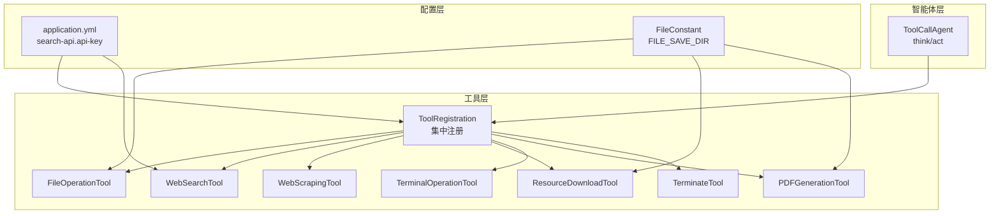
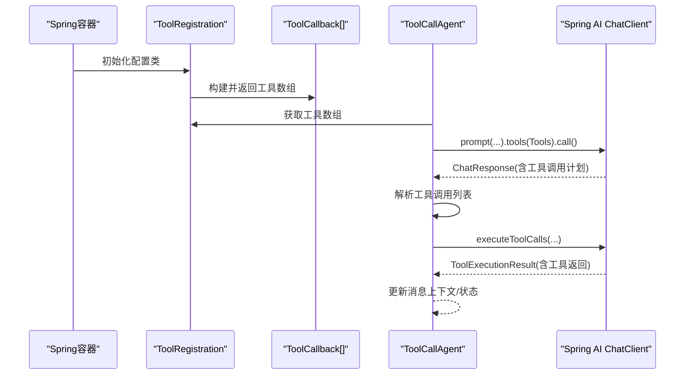
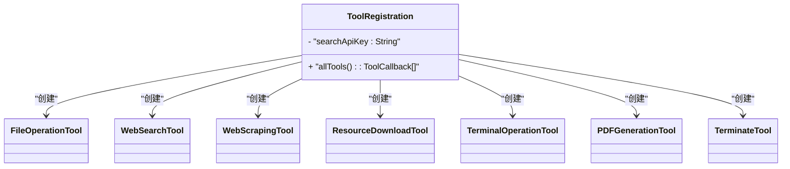
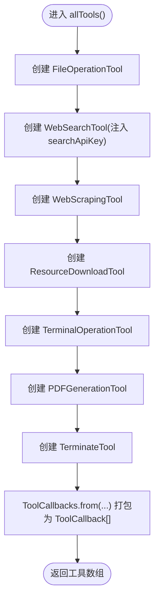
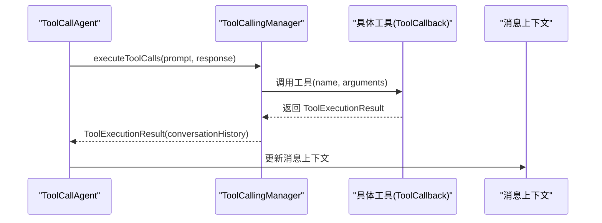
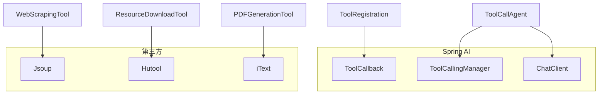

# 工具注册机制

<cite>
**本文引用的文件**
- [ToolRegistration.java](file://src/main/java/com/yupi/yuaiagent/tools/ToolRegistration.java)
- [FileOperationTool.java](file://src/main/java/com/yupi/yuaiagent/tools/FileOperationTool.java)
- [PDFGenerationTool.java](file://src/main/java/com/yupi/yuaiagent/tools/PDFGenerationTool.java)
- [WebScrapingTool.java](file://src/main/java/com/yupi/yuaiagent/tools/WebScrapingTool.java)
- [WebSearchTool.java](file://src/main/java/com/yupi/yuaiagent/tools/WebSearchTool.java)
- [ResourceDownloadTool.java](file://src/main/java/com/yupi/yuaiagent/tools/ResourceDownloadTool.java)
- [TerminalOperationTool.java](file://src/main/java/com/yupi/yuaiagent/tools/TerminalOperationTool.java)
- [TerminateTool.java](file://src/main/java/com/yupi/yuaiagent/tools/TerminateTool.java)
- [FileConstant.java](file://src/main/java/com/yupi/yuaiagent/constant/FileConstant.java)
- [application.yml](file://src/main/resources/application.yml)
- [ToolCallAgent.java](file://src/main/java/com/yupi/yuaiagent/agent/ToolCallAgent.java)
- [FileOperationToolTest.java](file://src/test/java/com/yupi/yuaiagent/tools/FileOperationToolTest.java)
- [WebSearchToolTest.java](file://src/test/java/com/yupi/yuaiagent/tools/WebSearchToolTest.java)
- [pom.xml](file://pom.xml)
</cite>

## 目录
1. [简介](#简介)
2. [项目结构](#项目结构)
3. [核心组件](#核心组件)
4. [架构总览](#架构总览)
5. [详细组件分析](#详细组件分析)
6. [依赖分析](#依赖分析)
7. [性能考虑](#性能考虑)
8. [故障排查指南](#故障排查指南)
9. [结论](#结论)
10. [附录](#附录)

## 简介
本文件围绕工具注册机制展开，重点解析 ToolRegistration 类的设计与实现，涵盖 Spring Bean 配置、工具回调管理、集中注册模式、依赖注入与生命周期、与 AI 智能体的集成调用流程，并提供最佳实践、测试与调试建议。读者可据此理解如何在 Spring AI 生态中以集中式方式注册与管理多种工具，并将其无缝接入智能体的“思考-执行”循环。

## 项目结构
工具注册相关代码位于 tools 包，核心入口为 ToolRegistration，其通过 Spring Bean 的 @Bean 方法 allTools() 将多个工具实例集中返回为 ToolCallback 数组；各工具类均采用 @Tool 注解声明能力；配置文件 application.yml 提供外部化配置（如搜索 API Key）；智能体层 ToolCallAgent 负责接收工具数组并驱动工具调用。

图表来源
- [ToolRegistration.java:18-36](file://src/main/java/com/yupi/yuaiagent/tools/ToolRegistration.java#L18-L36)
- [application.yml:60-62](file://src/main/resources/application.yml#L60-L62)
- [FileConstant.java:11](file://src/main/java/com/yupi/yuaiagent/constant/FileConstant.java#L11)
- [ToolCallAgent.java:44-52](file://src/main/java/com/yupi/yuaiagent/agent/ToolCallAgent.java#L44-L52)

章节来源
- [ToolRegistration.java:12-36](file://src/main/java/com/yupi/yuaiagent/tools/ToolRegistration.java#L12-L36)
- [application.yml:1-66](file://src/main/resources/application.yml#L1-L66)
- [FileConstant.java:6-12](file://src/main/java/com/yupi/yuaiagent/constant/FileConstant.java#L6-L12)
- [ToolCallAgent.java:30-52](file://src/main/java/com/yupi/yuaiagent/agent/ToolCallAgent.java#L30-L52)

## 核心组件
- ToolRegistration：集中式工具注册配置类，负责装配并暴露所有可用工具的 ToolCallback 数组。
- 工具类：FileOperationTool、WebSearchTool、WebScrapingTool、ResourceDownloadTool、TerminalOperationTool、PDFGenerationTool、TerminateTool，均通过 @Tool 注解声明能力。
- 配置与常量：application.yml 中的 search-api.api-key 用于 WebSearchTool 构造；FileConstant 定义统一文件保存目录。
- 智能体集成：ToolCallAgent 接收 ToolCallback[] 并通过 Spring AI 的工具调用管理器执行工具。

章节来源
- [ToolRegistration.java:12-36](file://src/main/java/com/yupi/yuaiagent/tools/ToolRegistration.java#L12-L36)
- [FileOperationTool.java:11-40](file://src/main/java/com/yupi/yuaiagent/tools/FileOperationTool.java#L11-L40)
- [WebSearchTool.java:18-53](file://src/main/java/com/yupi/yuaiagent/tools/WebSearchTool.java#L18-L53)
- [WebScrapingTool.java:11-22](file://src/main/java/com/yupi/yuaiagent/tools/WebScrapingTool.java#L11-L22)
- [ResourceDownloadTool.java:14-30](file://src/main/java/com/yupi/yuaiagent/tools/ResourceDownloadTool.java#L14-L30)
- [TerminalOperationTool.java:13-37](file://src/main/java/com/yupi/yuaiagent/tools/TerminalOperationTool.java#L13-L37)
- [PDFGenerationTool.java:19-52](file://src/main/java/com/yupi/yuaiagent/tools/PDFGenerationTool.java#L19-L52)
- [TerminateTool.java:8-17](file://src/main/java/com/yupi/yuaiagent/tools/TerminateTool.java#L8-L17)
- [application.yml:60-62](file://src/main/resources/application.yml#L60-L62)
- [FileConstant.java:11](file://src/main/java/com/yupi/yuaiagent/constant/FileConstant.java#L11)
- [ToolCallAgent.java:30-52](file://src/main/java/com/yupi/yuaiagent/agent/ToolCallAgent.java#L30-L52)

## 架构总览
下图展示从 Spring 容器到工具注册再到智能体调用的完整链路：

图表来源
- [ToolRegistration.java:18-36](file://src/main/java/com/yupi/yuaiagent/tools/ToolRegistration.java#L18-L36)
- [ToolCallAgent.java:69-118](file://src/main/java/com/yupi/yuaiagent/agent/ToolCallAgent.java#L69-L118)

## 详细组件分析

### ToolRegistration 类设计与实现
- 设计理念
  - 集中式注册：通过 @Configuration 声明为配置类，使用 @Bean 暴露工具数组，便于统一管理与扩展。
  - 依赖注入：通过 @Value 注入外部配置（如搜索 API Key），并在构造函数中传递给对应工具。
  - 回调封装：使用 ToolCallbacks.from(...) 将多个工具包装为 ToolCallback[]，供智能体直接消费。
- 关键点
  - allTools() 方法内逐一创建工具实例，确保每个工具对象在 Spring 容器中独立存在，便于后续按需扩展或替换。
  - 返回类型为 ToolCallback[]，符合 Spring AI 的工具注册契约。

图表来源
- [ToolRegistration.java:18-36](file://src/main/java/com/yupi/yuaiagent/tools/ToolRegistration.java#L18-L36)
- [FileOperationTool.java:11](file://src/main/java/com/yupi/yuaiagent/tools/FileOperationTool.java#L11)
- [WebSearchTool.java:25-27](file://src/main/java/com/yupi/yuaiagent/tools/WebSearchTool.java#L25-L27)
- [WebScrapingTool.java:11](file://src/main/java/com/yupi/yuaiagent/tools/WebScrapingTool.java#L11)
- [ResourceDownloadTool.java:14](file://src/main/java/com/yupi/yuaiagent/tools/ResourceDownloadTool.java#L14)
- [TerminalOperationTool.java:13](file://src/main/java/com/yupi/yuaiagent/tools/TerminalOperationTool.java#L13)
- [PDFGenerationTool.java:19](file://src/main/java/com/yupi/yuaiagent/tools/PDFGenerationTool.java#L19)
- [TerminateTool.java:8](file://src/main/java/com/yupi/yuaiagent/tools/TerminateTool.java#L8)

章节来源
- [ToolRegistration.java:12-36](file://src/main/java/com/yupi/yuaiagent/tools/ToolRegistration.java#L12-L36)

### allTools() 方法的初始化与依赖注入
- 初始化顺序（示意）
  1) 创建 FileOperationTool 实例。
  2) 创建 WebSearchTool 实例并注入 searchApiKey。
  3) 创建 WebScrapingTool 实例。
  4) 创建 ResourceDownloadTool 实例。
  5) 创建 TerminalOperationTool 实例。
  6) 创建 PDFGenerationTool 实例。
  7) 创建 TerminateTool 实例。
  8) 使用 ToolCallbacks.from(...) 将上述实例打包为 ToolCallback[]。
- 依赖注入要点
  - WebSearchTool 通过构造函数注入 API Key，来源于 application.yml 的 search-api.api-key。
  - FileOperationTool、ResourceDownloadTool、PDFGenerationTool 使用 FileConstant.FILE_SAVE_DIR 作为文件保存根路径。
- 生命周期
  - 由于 allTools() 返回的是 ToolCallback[]，Spring 容器会持有该数组及其元素，工具实例随容器启动而创建，随容器销毁而释放。

图表来源
- [ToolRegistration.java:19-35](file://src/main/java/com/yupi/yuaiagent/tools/ToolRegistration.java#L19-L35)
- [application.yml:60-62](file://src/main/resources/application.yml#L60-L62)
- [FileConstant.java:11](file://src/main/java/com/yupi/yuaiagent/constant/FileConstant.java#L11)

章节来源
- [ToolRegistration.java:19-35](file://src/main/java/com/yupi/yuaiagent/tools/ToolRegistration.java#L19-L35)
- [application.yml:60-62](file://src/main/resources/application.yml#L60-L62)
- [FileConstant.java:11](file://src/main/java/com/yupi/yuaiagent/constant/FileConstant.java#L11)

### ToolCallbacks 工具回调系统工作原理与扩展
- 工作原理
  - ToolCallbacks.from(...) 将多个工具对象转换为 ToolCallback[]，供 Spring AI 的 ChatClient 在推理阶段识别并调度。
  - 智能体在 think() 阶段将工具数组传入 ChatClient，由模型生成工具调用计划；在 act() 阶段通过 ToolCallingManager 执行工具并更新对话历史。
- 扩展方式
  - 新增工具：在 ToolRegistration.allTools() 中添加新工具实例，并在 ToolCallbacks.from(...) 中加入。
  - 工具参数与描述：通过 @Tool 与 @ToolParam 注解声明工具签名与参数说明，提升模型理解与调用准确性。
  - 配置注入：对于需要外部配置的工具（如 WebSearchTool），通过 @Value 或构造函数注入相应参数。

图表来源
- [ToolCallAgent.java:117-120](file://src/main/java/com/yupi/yuaiagent/agent/ToolCallAgent.java#L117-L120)

章节来源
- [ToolCallAgent.java:44-52](file://src/main/java/com/yupi/yuaiagent/agent/ToolCallAgent.java#L44-L52)
- [ToolCallAgent.java:117-120](file://src/main/java/com/yupi/yuaiagent/agent/ToolCallAgent.java#L117-L120)

### 工具类职责与实现要点
- 文件操作工具：提供文件读写能力，使用 FileConstant 定义的目录进行持久化。
- PDF 生成工具：基于 iText 生成 PDF，使用内置中文字体，目录同样来自 FileConstant。
- 网页抓取工具：基于 Jsoup 抓取页面 HTML。
- 网页搜索工具：调用第三方搜索接口，参数包含查询词、API Key、引擎等。
- 资源下载工具：下载指定 URL 资源到本地目录。
- 终端操作工具：在 Windows 上通过 ProcessBuilder 执行命令并收集输出。
- 终止工具：用于标记任务结束，触发智能体状态变更。

章节来源
- [FileOperationTool.java:11-40](file://src/main/java/com/yupi/yuaiagent/tools/FileOperationTool.java#L11-L40)
- [PDFGenerationTool.java:19-52](file://src/main/java/com/yupi/yuaiagent/tools/PDFGenerationTool.java#L19-L52)
- [WebScrapingTool.java:11-22](file://src/main/java/com/yupi/yuaiagent/tools/WebScrapingTool.java#L11-L22)
- [WebSearchTool.java:18-53](file://src/main/java/com/yupi/yuaiagent/tools/WebSearchTool.java#L18-L53)
- [ResourceDownloadTool.java:14-30](file://src/main/java/com/yupi/yuaiagent/tools/ResourceDownloadTool.java#L14-L30)
- [TerminalOperationTool.java:13-37](file://src/main/java/com/yupi/yuaiagent/tools/TerminalOperationTool.java#L13-L37)
- [TerminateTool.java:8-17](file://src/main/java/com/yupi/yuaiagent/tools/TerminateTool.java#L8-L17)

## 依赖分析
- Spring AI 生态
  - 工具回调与调用管理依赖 org.springframework.ai.tool.ToolCallback 与 ToolCallingManager。
  - 智能体集成依赖 ChatClient、Prompt、ChatOptions 等。
- 第三方库
  - jsoup：网页抓取。
  - Hutool：HTTP 下载与文件操作。
  - iText：PDF 生成。
- Maven 依赖
  - 引入 spring-ai-alibaba-starter-dashscope、spring-ai-starter-mcp-client、spring-ai-pgvector-store 等，支撑模型与向量存储集成。

图表来源
- [ToolRegistration.java:3-4](file://src/main/java/com/yupi/yuaiagent/tools/ToolRegistration.java#L3-L4)
- [ToolCallAgent.java:17-19](file://src/main/java/com/yupi/yuaiagent/agent/ToolCallAgent.java#L17-L19)
- [WebScrapingTool.java:3-4](file://src/main/java/com/yupi/yuaiagent/tools/WebScrapingTool.java#L3-L4)
- [ResourceDownloadTool.java:3-4](file://src/main/java/com/yupi/yuaiagent/tools/ResourceDownloadTool.java#L3-L4)
- [PDFGenerationTool.java:3-10](file://src/main/java/com/yupi/yuaiagent/tools/PDFGenerationTool.java#L3-L10)

章节来源
- [pom.xml:50-164](file://pom.xml#L50-L164)

## 性能考虑
- 工具实例化成本：集中注册避免重复创建，但工具数量增加会带来内存占用与初始化时间增长，建议按需启用与懒加载策略。
- I/O 密集型工具：文件读写、PDF 生成、资源下载、终端命令执行等可能阻塞线程，建议在工具内部做好超时控制与异常隔离。
- 网络请求：网页搜索与抓取依赖网络，建议设置合理的超时与重试策略，并对返回数据做截断与清洗。
- 日志与可观测性：开启 DEBUG 级别日志可观察 Spring AI 的工具调用细节，便于定位性能瓶颈。

## 故障排查指南
- 配置问题
  - 搜索 API Key 未正确注入：检查 application.yml 中 search-api.api-key 是否与实际密钥一致。
  - 文件保存目录不可写：确认 FILE_SAVE_DIR 对应路径存在且具备写权限。
- 工具调用失败
  - 网页搜索/抓取异常：检查网络连通性与目标站点可用性；查看工具内部异常返回信息。
  - PDF 生成失败：确认字体资源可用或使用内置字体；检查输出路径权限。
  - 终端命令执行失败：确认命令在当前系统上可用，关注退出码与标准输出/错误输出。
- 集成问题
  - 工具未被识别：确认 ToolRegistration.allTools() 返回的 ToolCallback[] 已正确注入到智能体；检查 @Tool 注解是否完整。
  - 工具调用未生效：检查 ToolCallAgent 的 think()/act() 流程是否正常执行，以及 ToolCallingManager 的调用链路。

章节来源
- [application.yml:60-66](file://src/main/resources/application.yml#L60-L66)
- [FileConstant.java:11](file://src/main/java/com/yupi/yuaiagent/constant/FileConstant.java#L11)
- [ToolRegistration.java:19-35](file://src/main/java/com/yupi/yuaiagent/tools/ToolRegistration.java#L19-L35)
- [ToolCallAgent.java:69-134](file://src/main/java/com/yupi/yuaiagent/agent/ToolCallAgent.java#L69-L134)

## 结论
ToolRegistration 通过集中式注册与 Spring Bean 管理，将多种工具以 ToolCallback 形式统一暴露给智能体；配合 @Tool 注解与 ToolCallingManager，实现了从“思考-执行”的闭环。通过合理的配置管理、环境变量处理与生命周期管理，可构建稳定、可扩展的工具体系，并与 AI 智能体高效集成。

## 附录

### 工具注册最佳实践
- 配置管理
  - 将敏感配置（如 API Key）置于外部配置文件或环境变量，避免硬编码。
  - 为不同环境准备独立配置文件，确保开发、测试、生产环境隔离。
- 工具生命周期
  - 优先使用 Spring 容器管理工具实例，避免手动 new；如需自定义生命周期，结合 @PostConstruct/@PreDestroy。
  - 对有状态工具（如缓存、连接池）进行显式清理与复位。
- 工具扩展
  - 新增工具时，同步完善 @Tool 与 @ToolParam 描述，保证模型理解准确。
  - 对外部依赖（网络、文件系统）进行超时与重试控制，增强鲁棒性。
- 与智能体集成
  - 在智能体构造阶段注入 ToolCallback[]，并在 think()/act() 中保持消息上下文一致性。
  - 对终止工具进行特殊处理，及时更新智能体状态。

### 测试与调试建议
- 单元测试
  - 使用 SpringBootTest 启动容器，验证工具方法行为与返回值。
  - 示例参考：FileOperationToolTest、WebSearchToolTest。
- 调试技巧
  - 开启 Spring AI 日志（application.yml 中 logging.level.org.springframework.ai: DEBUG）观察工具调用细节。
  - 在 ToolCallAgent 的 think()/act() 中打印工具调用计划与执行结果，辅助定位问题。

章节来源
- [FileOperationToolTest.java:7-26](file://src/test/java/com/yupi/yuaiagent/tools/FileOperationToolTest.java#L7-L26)
- [WebSearchToolTest.java:10-23](file://src/test/java/com/yupi/yuaiagent/tools/WebSearchToolTest.java#L10-L23)
- [application.yml:64-66](file://src/main/resources/application.yml#L64-L66)