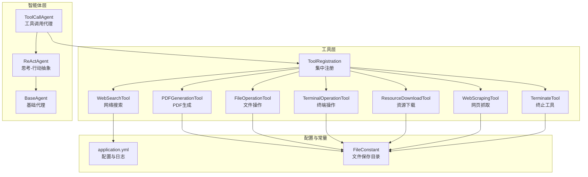
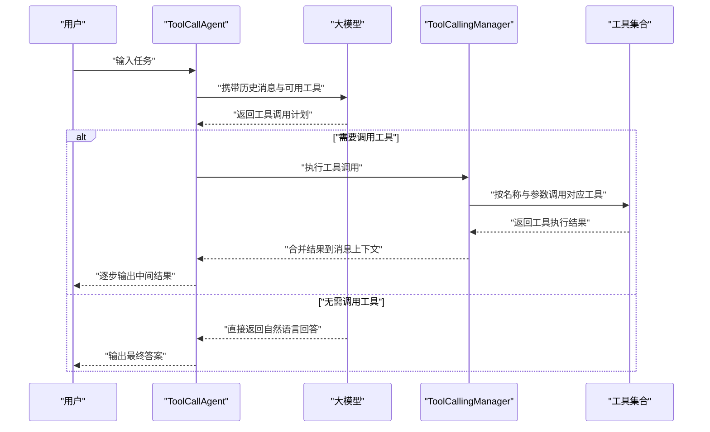
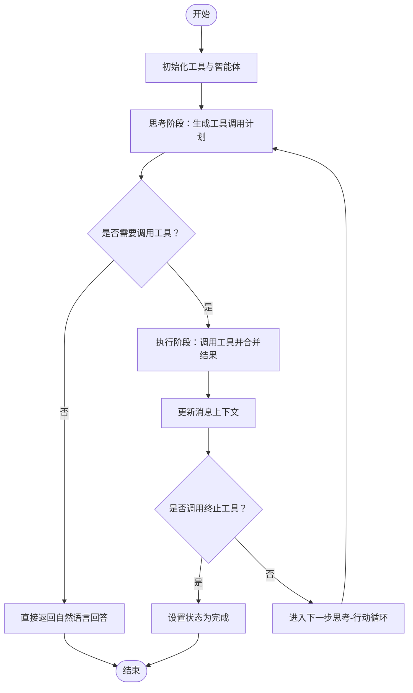
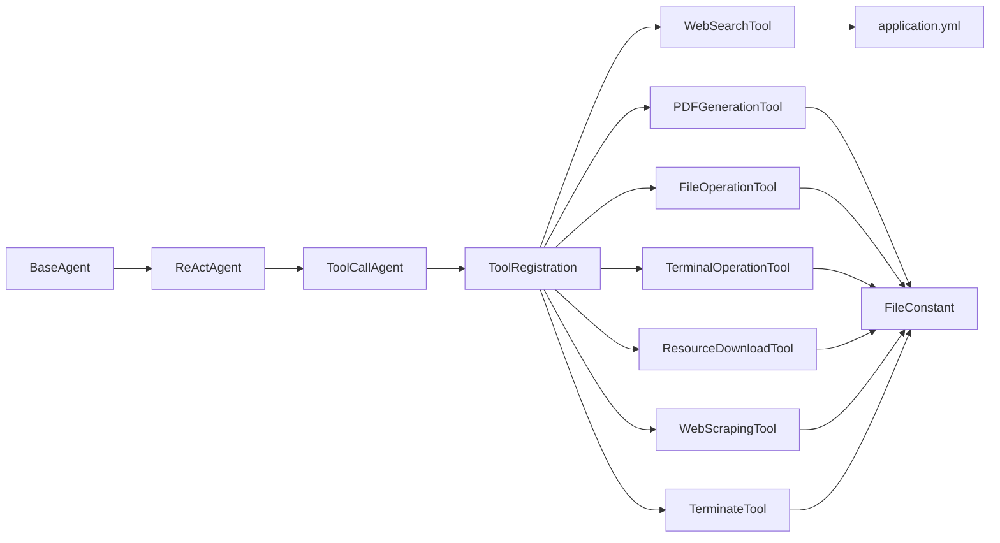

# 工具调用系统

<cite>
**本文引用的文件**
- [ToolRegistration.java](file://src/main/java/com/yupi/yuaiagent/tools/ToolRegistration.java)
- [WebSearchTool.java](file://src/main/java/com/yupi/yuaiagent/tools/WebSearchTool.java)
- [PDFGenerationTool.java](file://src/main/java/com/yupi/yuaiagent/tools/PDFGenerationTool.java)
- [FileOperationTool.java](file://src/main/java/com/yupi/yuaiagent/tools/FileOperationTool.java)
- [TerminalOperationTool.java](file://src/main/java/com/yupi/yuaiagent/tools/TerminalOperationTool.java)
- [ResourceDownloadTool.java](file://src/main/java/com/yupi/yuaiagent/tools/ResourceDownloadTool.java)
- [WebScrapingTool.java](file://src/main/java/com/yupi/yuaiagent/tools/WebScrapingTool.java)
- [TerminateTool.java](file://src/main/java/com/yupi/yuaiagent/tools/TerminateTool.java)
- [FileConstant.java](file://src/main/java/com/yupi/yuaiagent/constant/FileConstant.java)
- [application.yml](file://src/main/resources/application.yml)
- [ToolCallAgent.java](file://src/main/java/com/yupi/yuaiagent/agent/ToolCallAgent.java)
- [BaseAgent.java](file://src/main/java/com/yupi/yuaiagent/agent/BaseAgent.java)
- [ReActAgent.java](file://src/main/java/com/yupi/yuaiagent/agent/ReActAgent.java)
- [YuAiAgentApplication.java](file://src/main/java/com/yupi/yuaiagent/YuAiAgentApplication.java)
- [WebSearchToolTest.java](file://src/test/java/com/yupi/yuaiagent/tools/WebSearchToolTest.java)
- [FileOperationToolTest.java](file://src/test/java/com/yupi/yuaiagent/tools/FileOperationToolTest.java)
</cite>

## 目录
1. [简介](#简介)
2. [项目结构](#项目结构)
3. [核心组件](#核心组件)
4. [架构总览](#架构总览)
5. [详细组件分析](#详细组件分析)
6. [依赖分析](#依赖分析)
7. [性能考虑](#性能考虑)
8. [故障排查指南](#故障排查指南)
9. [结论](#结论)
10. [附录](#附录)

## 简介
本文件面向“工具调用系统”的技术文档，围绕7种工具（网络搜索、PDF生成、文件操作、终端操作、资源下载、网页抓取、终止工具）进行深入解析，阐述其设计思路、实现原理与使用场景；同时详解ToolRegistration集中注册机制、工具调用生命周期管理（初始化、执行、结果处理）、与AI智能体的集成方式与调用机制，并提供开发最佳实践与测试调试技巧。

## 项目结构
该系统采用模块化组织，核心位于tools包下的各类工具类，通过ToolRegistration统一注册；智能体层由BaseAgent、ReActAgent、ToolCallAgent构成，负责思考-行动循环与工具调用管理；配置文件application.yml提供外部依赖（如搜索引擎API密钥）与日志级别设置；常量FileConstant定义文件保存路径。

图表来源
- [ToolRegistration.java:18-36](file://src/main/java/com/yupi/yuaiagent/tools/ToolRegistration.java#L18-L36)
- [ToolCallAgent.java:32-52](file://src/main/java/com/yupi/yuaiagent/agent/ToolCallAgent.java#L32-L52)
- [application.yml:60-62](file://src/main/resources/application.yml#L60-L62)
- [FileConstant.java:11](file://src/main/java/com/yupi/yuaiagent/constant/FileConstant.java#L11)

章节来源
- [ToolRegistration.java:18-36](file://src/main/java/com/yupi/yuaiagent/tools/ToolRegistration.java#L18-L36)
- [application.yml:60-62](file://src/main/resources/application.yml#L60-L62)
- [FileConstant.java:11](file://src/main/java/com/yupi/yuaiagent/constant/FileConstant.java#L11)

## 核心组件
- ToolRegistration：集中注册所有工具，返回ToolCallback数组，供智能体在推理阶段选择并执行工具。
- ToolCallAgent：实现ReAct模式的工具调用代理，负责与大模型交互以获取工具调用计划，并通过ToolCallingManager执行工具，更新消息上下文，支持终止工具触发的状态变更。
- BaseAgent/ReActAgent：提供通用的执行框架、SSE流式输出、步骤控制与资源清理。
- 各工具类：封装具体能力（搜索、PDF生成、文件读写、终端命令、下载、网页抓取、终止），均通过注解声明为可被模型调用的工具。

章节来源
- [ToolRegistration.java:18-36](file://src/main/java/com/yupi/yuaiagent/tools/ToolRegistration.java#L18-L36)
- [ToolCallAgent.java:32-52](file://src/main/java/com/yupi/yuaiagent/agent/ToolCallAgent.java#L32-L52)
- [BaseAgent.java:53-92](file://src/main/java/com/yupi/yuaiagent/agent/BaseAgent.java#L53-L92)
- [ReActAgent.java:35-50](file://src/main/java/com/yupi/yuaiagent/agent/ReActAgent.java#L35-L50)

## 架构总览
工具调用系统遵循“智能体-工具-外部服务”三层架构：
- 智能体层：ToolCallAgent通过ChatClient向大模型提交历史消息与可用工具，获取工具调用计划；随后由ToolCallingManager执行工具并将结果回填至消息上下文。
- 工具层：各工具类通过注解暴露给模型，内部封装对第三方服务或本地资源的操作。
- 外部服务：搜索引擎API、HTTP下载、PDF渲染、系统命令执行等。

图表来源
- [ToolCallAgent.java:66-104](file://src/main/java/com/yupi/yuaiagent/agent/ToolCallAgent.java#L66-L104)
- [ToolCallAgent.java:111-134](file://src/main/java/com/yupi/yuaiagent/agent/ToolCallAgent.java#L111-L134)

## 详细组件分析

### 工具注册机制（ToolRegistration）
- 设计思路：集中管理所有工具实例，统一注入到智能体的工具回调数组中，便于模型在推理阶段动态选择工具。
- 扩展方式：新增工具时，在Bean方法中创建实例并加入ToolCallbacks.from(...)即可生效；若工具依赖外部配置（如API Key），可通过字段注入或构造函数传入。
- 关键点：allTools返回ToolCallback[]，供ToolCallAgent在推理时通过tools(availableTools)传入模型。

章节来源
- [ToolRegistration.java:18-36](file://src/main/java/com/yupi/yuaiagent/tools/ToolRegistration.java#L18-L36)

### 网络搜索工具（WebSearchTool）
- 功能特性：对接搜索引擎API，根据关键词查询并返回前N条结果摘要。
- 实现原理：构造查询参数（包含API Key与引擎标识），发起HTTP请求，解析JSON并截取前若干条结果，拼接为字符串返回。
- 使用场景：当任务需要快速检索公开信息时，适合与知识增强结合。
- 错误处理：捕获异常并返回错误信息，保证不会中断流程。
- 性能与安全：建议限制并发与请求频率，避免触发限流；确保API Key安全存储于配置文件。

章节来源
- [WebSearchTool.java:29-52](file://src/main/java/com/yupi/yuaiagent/tools/WebSearchTool.java#L29-L52)
- [application.yml:60-62](file://src/main/resources/application.yml#L60-L62)

### PDF生成工具（PDFGenerationTool）
- 功能特性：将指定内容写入PDF文件，支持中文字体渲染。
- 实现原理：使用PDF库创建文档、设置字体、添加段落，写入目标路径；目录不存在时自动创建。
- 使用场景：批量生成报告、导出内容、归档资料。
- 错误处理：IO异常时返回错误信息；注意磁盘空间与权限。
- 性能与安全：大文本建议分段写入；避免生成超大PDF导致内存压力。

章节来源
- [PDFGenerationTool.java:21-51](file://src/main/java/com/yupi/yuaiagent/tools/PDFGenerationTool.java#L21-L51)
- [FileConstant.java:11](file://src/main/java/com/yupi/yuaiagent/constant/FileConstant.java#L11)

### 文件操作工具（FileOperationTool）
- 功能特性：提供文件读取与写入能力，自动创建目标目录。
- 实现原理：基于文件工具类读写UTF-8内容；路径拼接在统一的文件保存目录下。
- 使用场景：临时数据存取、日志记录、配置读取。
- 错误处理：捕获异常并返回错误信息；建议对文件名做白名单校验。
- 性能与安全：避免频繁小文件I/O；注意路径穿越风险。

章节来源
- [FileOperationTool.java:15-39](file://src/main/java/com/yupi/yuaiagent/tools/FileOperationTool.java#L15-L39)
- [FileConstant.java:11](file://src/main/java/com/yupi/yuaiagent/constant/FileConstant.java#L11)

### 终端操作工具（TerminalOperationTool）
- 功能特性：在受控环境下执行系统命令，收集标准输出。
- 实现原理：使用进程构建器启动命令，读取标准输出流，等待退出码；非零退出码视为失败。
- 使用场景：环境探测、脚本执行、系统运维辅助。
- 错误处理：捕获IO与中断异常；严格限制可执行命令集，避免高危命令。
- 性能与安全：仅允许可信命令；设置超时与资源上限；避免长时间阻塞。

章节来源
- [TerminalOperationTool.java:15-35](file://src/main/java/com/yupi/yuaiagent/tools/TerminalOperationTool.java#L15-L35)

### 资源下载工具（ResourceDownloadTool）
- 功能特性：从指定URL下载资源到本地文件。
- 实现原理：自动创建下载目录，使用HTTP工具下载文件到目标路径。
- 使用场景：批量下载图片、文档、依赖包。
- 错误处理：捕获异常并返回错误信息；建议校验URL合法性与文件大小。
- 性能与安全：限制并发下载数；校验文件类型与来源可信度。

章节来源
- [ResourceDownloadTool.java:16-29](file://src/main/java/com/yupi/yuaiagent/tools/ResourceDownloadTool.java#L16-L29)
- [FileConstant.java:11](file://src/main/java/com/yupi/yuaiagent/constant/FileConstant.java#L11)

### 网页抓取工具（WebScrapingTool）
- 功能特性：抓取指定网页HTML内容。
- 实现原理：使用网页解析库连接URL并获取完整HTML。
- 使用场景：内容采集、页面结构分析、二次加工。
- 错误处理：异常时返回错误信息；注意反爬策略与robots协议。
- 性能与安全：限制请求频率；避免对敏感站点造成压力。

章节来源
- [WebScrapingTool.java:13-21](file://src/main/java/com/yupi/yuaiagent/tools/WebScrapingTool.java#L13-L21)

### 终止工具（TerminateTool）
- 功能特性：标记任务结束，使智能体进入完成态。
- 实现原理：返回固定提示语，工具调用代理检测后更新状态。
- 使用场景：任务完成后优雅退出，避免无限循环。
- 最佳实践：在任务达成条件或无法继续推进时调用。

章节来源
- [TerminateTool.java:10-16](file://src/main/java/com/yupi/yuaiagent/tools/TerminateTool.java#L10-L16)
- [ToolCallAgent.java:122-128](file://src/main/java/com/yupi/yuaiagent/agent/ToolCallAgent.java#L122-L128)

### 工具调用生命周期管理
- 初始化：ToolRegistration创建工具实例并注入到ToolCallAgent；智能体构建时禁用内置工具执行，自管消息上下文与工具调用。
- 执行：think阶段向模型提交消息与工具清单，获取工具调用计划；act阶段通过ToolCallingManager执行工具，合并结果到消息上下文。
- 结果处理：记录工具返回值，判断是否调用终止工具；必要时更新代理状态为完成。
- 资源管理：BaseAgent提供清理钩子，SSE流式输出具备超时与完成回调。

图表来源
- [ToolCallAgent.java:60-104](file://src/main/java/com/yupi/yuaiagent/agent/ToolCallAgent.java#L60-L104)
- [ToolCallAgent.java:111-134](file://src/main/java/com/yupi/yuaiagent/agent/ToolCallAgent.java#L111-L134)
- [BaseAgent.java:189-191](file://src/main/java/com/yupi/yuaiagent/agent/BaseAgent.java#L189-L191)

## 依赖分析
- 工具与配置：WebSearchTool依赖配置中的API Key；FileConstant提供统一文件保存目录。
- 智能体与工具：ToolCallAgent持有ToolCallback数组并通过模型推理获取工具调用计划；ToolCallingManager负责执行与上下文合并。
- 第三方库：HTTP请求、JSON解析、PDF渲染、网页解析、系统命令执行等。

图表来源
- [ToolRegistration.java:18-36](file://src/main/java/com/yupi/yuaiagent/tools/ToolRegistration.java#L18-L36)
- [ToolCallAgent.java:32-52](file://src/main/java/com/yupi/yuaiagent/agent/ToolCallAgent.java#L32-L52)
- [application.yml:60-62](file://src/main/resources/application.yml#L60-L62)
- [FileConstant.java:11](file://src/main/java/com/yupi/yuaiagent/constant/FileConstant.java#L11)

章节来源
- [ToolRegistration.java:18-36](file://src/main/java/com/yupi/yuaiagent/tools/ToolRegistration.java#L18-L36)
- [ToolCallAgent.java:32-52](file://src/main/java/com/yupi/yuaiagent/agent/ToolCallAgent.java#L32-L52)
- [application.yml:60-62](file://src/main/resources/application.yml#L60-L62)
- [FileConstant.java:11](file://src/main/java/com/yupi/yuaiagent/constant/FileConstant.java#L11)

## 性能考虑
- IO与网络：对文件读写、HTTP下载、PDF生成等操作，建议：
  - 批量化处理，避免频繁小文件I/O；
  - 控制并发数量，防止资源争用；
  - 对大文件采用流式处理，降低内存占用。
- 工具调用：减少不必要的工具调用次数，优先在一次调用中聚合信息；对可缓存的结果进行本地缓存。
- 终端与系统命令：限制命令执行时间与资源消耗，避免长时间阻塞；仅允许白名单命令。
- 日志与监控：开启DEBUG级别日志以便观察工具调用细节，但生产环境应适度降级以避免性能损耗。

## 故障排查指南
- 工具调用未生效
  - 检查ToolRegistration是否正确注册并返回工具数组。
  - 确认智能体在推理时传入了可用工具清单。
- 网络搜索失败
  - 校验配置中的API Key是否有效且未过期。
  - 检查网络连通性与第三方服务可用性。
- PDF生成异常
  - 检查目标目录权限与磁盘空间。
  - 确认字体资源可用，避免渲染失败。
- 文件读写失败
  - 校验文件名与路径，避免路径穿越。
  - 检查编码格式（UTF-8）与文件是否存在。
- 终端命令执行失败
  - 检查命令是否在当前系统可用。
  - 查看退出码与标准输出，定位错误原因。
- 流式输出中断
  - 检查SSE超时设置与客户端连接稳定性。
  - 关注异常回调与完成回调，确保资源清理。

章节来源
- [ToolRegistration.java:18-36](file://src/main/java/com/yupi/yuaiagent/tools/ToolRegistration.java#L18-L36)
- [ToolCallAgent.java:66-104](file://src/main/java/com/yupi/yuaiagent/agent/ToolCallAgent.java#L66-L104)
- [application.yml:64-66](file://src/main/resources/application.yml#L64-L66)

## 结论
该工具调用系统通过集中注册与自管工具调用流程，实现了与大模型的深度集成。七类工具覆盖信息检索、内容生成、文件与系统操作、资源下载与网页抓取等典型场景；配合智能体的思考-行动循环与终止工具，形成闭环的任务执行链路。建议在生产环境中强化安全与性能控制，并完善测试与监控体系。

## 附录

### 开发最佳实践
- 错误处理：所有工具方法均需捕获并返回可读错误信息，避免抛出未处理异常。
- 超时控制：对外部调用（HTTP、PDF渲染、命令执行）设置合理超时，防止阻塞。
- 资源管理：及时释放IO流与进程句柄；在智能体生命周期末尾执行清理逻辑。
- 安全加固：限制可执行命令范围；校验输入参数与文件路径；敏感信息（如API Key）置于配置文件中。
- 可观测性：开启DEBUG日志，记录工具调用详情与执行耗时；在SSE流中输出阶段性结果。

### 与AI智能体的集成方式
- 工具注册：通过ToolRegistration集中注册，供ToolCallAgent在推理阶段使用。
- 推理与执行：ToolCallAgent在think阶段获取工具调用计划，在act阶段执行工具并合并结果。
- 状态管理：检测终止工具调用，将代理状态切换为完成，结束执行循环。

章节来源
- [ToolRegistration.java:18-36](file://src/main/java/com/yupi/yuaiagent/tools/ToolRegistration.java#L18-L36)
- [ToolCallAgent.java:60-134](file://src/main/java/com/yupi/yuaiagent/agent/ToolCallAgent.java#L60-L134)
- [BaseAgent.java:53-92](file://src/main/java/com/yupi/yuaiagent/agent/BaseAgent.java#L53-L92)

### 测试与调试技巧
- 单元测试：针对每个工具编写最小可运行测试，验证读写、下载、命令执行等关键路径。
- 集成测试：在ToolCallAgent上模拟完整的思考-行动流程，验证工具调用与结果合并。
- 调试要点：开启DEBUG日志，观察模型返回的工具调用计划与执行结果；通过SSE流式输出实时查看中间结果。

章节来源
- [WebSearchToolTest.java:16-22](file://src/test/java/com/yupi/yuaiagent/tools/WebSearchToolTest.java#L16-L22)
- [FileOperationToolTest.java:10-25](file://src/test/java/com/yupi/yuaiagent/tools/FileOperationToolTest.java#L10-L25)
- [application.yml:64-66](file://src/main/resources/application.yml#L64-L66)