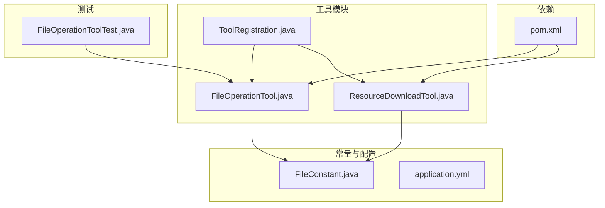
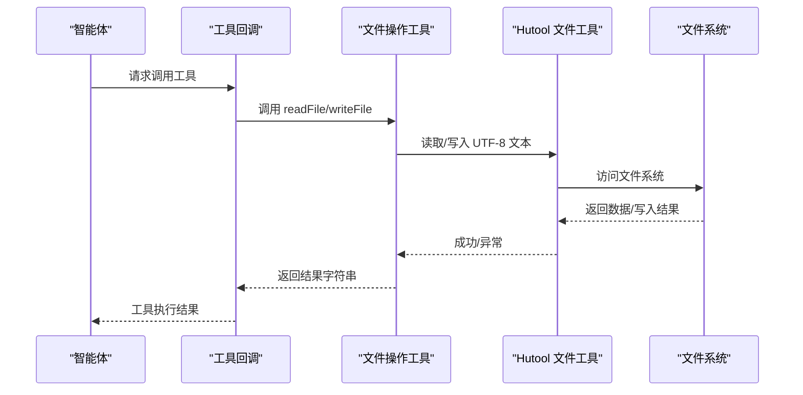
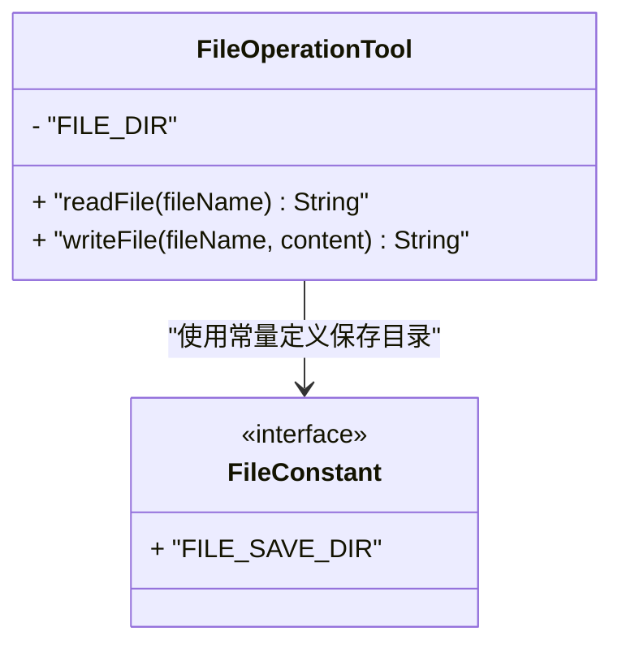
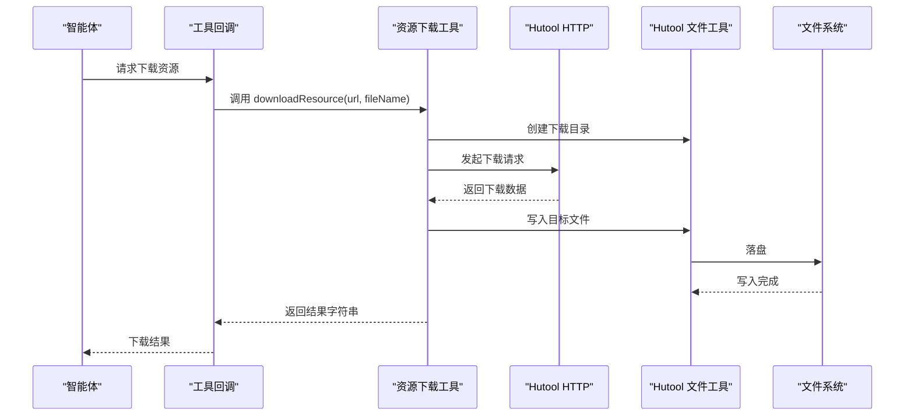
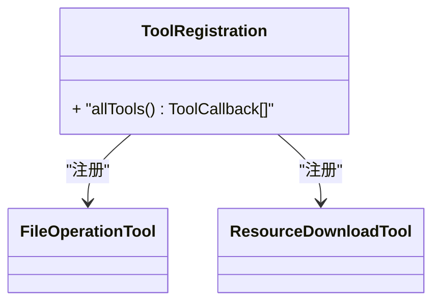
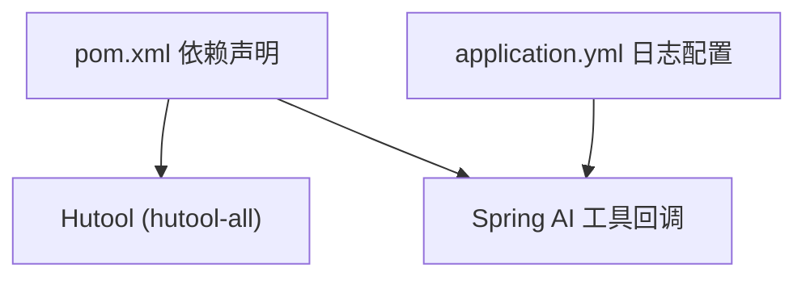

# 文件操作工具

<cite>
**本文引用的文件**
- [FileOperationTool.java](file://src/main/java/com/yupi/yuaiagent/tools/FileOperationTool.java)
- [FileConstant.java](file://src/main/java/com/yupi/yuaiagent/constant/FileConstant.java)
- [FileOperationToolTest.java](file://src/test/java/com/yupi/yuaiagent/tools/FileOperationToolTest.java)
- [ToolRegistration.java](file://src/main/java/com/yupi/yuaiagent/tools/ToolRegistration.java)
- [ResourceDownloadTool.java](file://src/main/java/com/yupi/yuaiagent/tools/ResourceDownloadTool.java)
- [application.yml](file://src/main/resources/application.yml)
- [pom.xml](file://pom.xml)
</cite>

## 目录
1. [简介](#简介)
2. [项目结构](#项目结构)
3. [核心组件](#核心组件)
4. [架构总览](#架构总览)
5. [详细组件分析](#详细组件分析)
6. [依赖分析](#依赖分析)
7. [性能考虑](#性能考虑)
8. [故障排查指南](#故障排查指南)
9. [结论](#结论)
10. [附录](#附录)

## 简介
本文件操作工具旨在为智能体提供基础的文件系统操作能力，包括文件读取与写入，并通过统一的工具注册机制集成到 Spring AI 的工具回调体系中。该工具基于 Hutool 工具库实现，具备简洁、健壮的文件 I/O 能力；同时结合项目中的常量配置，确保文件保存路径可控且可维护。

## 项目结构
文件操作工具位于工具模块中，配合常量定义、测试用例以及工具注册配置共同构成完整的文件操作能力闭环。

图表来源
- [FileOperationTool.java:1-41](file://src/main/java/com/yupi/yuaiagent/tools/FileOperationTool.java#L1-L41)
- [FileConstant.java:1-13](file://src/main/java/com/yupi/yuaiagent/constant/FileConstant.java#L1-L13)
- [ToolRegistration.java:1-38](file://src/main/java/com/yupi/yuaiagent/tools/ToolRegistration.java#L1-L38)
- [ResourceDownloadTool.java:1-31](file://src/main/java/com/yupi/yuaiagent/tools/ResourceDownloadTool.java#L1-L31)
- [FileOperationToolTest.java:1-27](file://src/test/java/com/yupi/yuaiagent/tools/FileOperationToolTest.java#L1-L27)
- [pom.xml:144-147](file://pom.xml#L144-L147)

章节来源
- [FileOperationTool.java:1-41](file://src/main/java/com/yupi/yuaiagent/tools/FileOperationTool.java#L1-L41)
- [FileConstant.java:1-13](file://src/main/java/com/yupi/yuaiagent/constant/FileConstant.java#L1-L13)
- [ToolRegistration.java:1-38](file://src/main/java/com/yupi/yuaiagent/tools/ToolRegistration.java#L1-L38)
- [ResourceDownloadTool.java:1-31](file://src/main/java/com/yupi/yuaiagent/tools/ResourceDownloadTool.java#L1-L31)
- [FileOperationToolTest.java:1-27](file://src/test/java/com/yupi/yuaiagent/tools/FileOperationToolTest.java#L1-L27)
- [pom.xml:144-147](file://pom.xml#L144-L147)

## 核心组件
- 文件操作工具：提供文件读取与写入能力，内部使用 Hutool 的文件工具类进行 UTF-8 文本读写与目录创建。
- 常量定义：集中管理文件保存根目录，避免硬编码，便于环境切换与部署。
- 工具注册：将文件操作工具与其他工具统一注册到 Spring AI 的工具回调数组中，供智能体按需调用。
- 资源下载工具：基于 Hutool 的 HTTP 工具实现远程资源下载，同样使用统一的文件保存目录结构。

章节来源
- [FileOperationTool.java:11-40](file://src/main/java/com/yupi/yuaiagent/tools/FileOperationTool.java#L11-L40)
- [FileConstant.java:6-12](file://src/main/java/com/yupi/yuaiagent/constant/FileConstant.java#L6-L12)
- [ToolRegistration.java:18-36](file://src/main/java/com/yupi/yuaiagent/tools/ToolRegistration.java#L18-L36)
- [ResourceDownloadTool.java:14-30](file://src/main/java/com/yupi/yuaiagent/tools/ResourceDownloadTool.java#L14-L30)

## 架构总览
文件操作工具在系统中的位置如下：智能体通过工具回调调用工具；工具内部根据常量确定保存目录，使用 Hutool 进行文件读写或下载；测试用例验证基本行为。

图表来源
- [ToolRegistration.java:18-36](file://src/main/java/com/yupi/yuaiagent/tools/ToolRegistration.java#L18-L36)
- [FileOperationTool.java:15-39](file://src/main/java/com/yupi/yuaiagent/tools/FileOperationTool.java#L15-L39)
- [pom.xml:144-147](file://pom.xml#L144-L147)

## 详细组件分析

### 文件操作工具（FileOperationTool）
- 功能职责
  - 读取文件：根据文件名拼接保存目录，使用 Hutool 读取 UTF-8 文本内容。
  - 写入文件：自动创建保存目录，使用 Hutool 写入 UTF-8 文本。
  - 异常处理：捕获异常并返回错误信息字符串，保证工具调用的稳定性。
- 关键实现点
  - 目录结构：保存根目录由常量定义，子目录为“file”。
  - 编码规范：统一使用 UTF-8 文本读写，避免跨平台编码问题。
  - 安全性：未做路径穿越校验，建议在生产环境中增加输入校验与白名单限制。
- 典型调用链路
  - 工具注册后，智能体通过工具回调触发 readFile 或 writeFile。
  - 工具内部构造绝对路径，调用 Hutool 的读写方法。
  - 返回成功或失败信息字符串给调用方。

图表来源
- [FileOperationTool.java:11-40](file://src/main/java/com/yupi/yuaiagent/tools/FileOperationTool.java#L11-L40)
- [FileConstant.java:6-12](file://src/main/java/com/yupi/yuaiagent/constant/FileConstant.java#L6-L12)

章节来源
- [FileOperationTool.java:11-40](file://src/main/java/com/yupi/yuaiagent/tools/FileOperationTool.java#L11-L40)
- [FileConstant.java:6-12](file://src/main/java/com/yupi/yuaiagent/constant/FileConstant.java#L6-L12)

### 资源下载工具（ResourceDownloadTool）
- 功能职责
  - 从指定 URL 下载资源并保存到本地文件系统。
  - 使用 Hutool 的 HTTP 工具与文件工具完成下载与落盘。
- 关键实现点
  - 目录结构：保存根目录由常量定义，子目录为“download”。
  - 异常处理：捕获异常并返回错误信息字符串。
- 与文件操作工具的关系
  - 共享同一文件保存根目录与常量定义，保持一致的文件组织方式。

图表来源
- [ResourceDownloadTool.java:16-29](file://src/main/java/com/yupi/yuaiagent/tools/ResourceDownloadTool.java#L16-L29)
- [FileConstant.java:11](file://src/main/java/com/yupi/yuaiagent/constant/FileConstant.java#L11)

章节来源
- [ResourceDownloadTool.java:14-30](file://src/main/java/com/yupi/yuaiagent/tools/ResourceDownloadTool.java#L14-L30)
- [FileConstant.java:11](file://src/main/java/com/yupi/yuaiagent/constant/FileConstant.java#L11)

### 工具注册（ToolRegistration）
- 功能职责
  - 将文件操作工具与其他工具统一注册到 Spring AI 的工具回调数组中。
  - 作为工具的装配入口，供智能体按需调用。
- 关键实现点
  - 通过 Bean 方式暴露工具数组，便于智能体注入与使用。
  - 当前注册了文件操作工具、网页搜索、网页抓取、资源下载、终端操作、PDF 生成、终止工具等。

图表来源
- [ToolRegistration.java:18-36](file://src/main/java/com/yupi/yuaiagent/tools/ToolRegistration.java#L18-L36)

章节来源
- [ToolRegistration.java:12-36](file://src/main/java/com/yupi/yuaiagent/tools/ToolRegistration.java#L12-L36)

### 测试用例（FileOperationToolTest）
- 功能职责
  - 验证文件读取与写入的基本行为，确保工具在测试环境下可用。
- 关键实现点
  - 使用 JUnit 断言结果非空，覆盖读取与写入两个典型场景。

章节来源
- [FileOperationToolTest.java:10-25](file://src/test/java/com/yupi/yuaiagent/tools/FileOperationToolTest.java#L10-L25)

## 依赖分析
- Hutool 工具库
  - 用于文件读写与 HTTP 下载，简化 I/O 操作与网络请求处理。
- Spring AI 工具回调
  - 通过注解与回调机制，将工具暴露给智能体调用。
- 项目配置
  - application.yml 中的日志级别有助于调试工具调用细节。

图表来源
- [pom.xml:144-147](file://pom.xml#L144-L147)
- [application.yml:64-66](file://src/main/resources/application.yml#L64-L66)

章节来源
- [pom.xml:144-147](file://pom.xml#L144-L147)
- [application.yml:64-66](file://src/main/resources/application.yml#L64-L66)

## 性能考虑
- I/O 模式
  - 使用 UTF-8 文本读写，适合小到中等规模文本文件；对于超大文件建议采用流式处理或分块读写。
- 目录创建
  - 写入前自动创建目录，避免重复判断；建议在高频写入场景下预热目录结构。
- 并发与线程
  - 工具类未显式同步，若存在并发写入同一文件的情况，建议在上层协调或加锁。
- 网络下载
  - 资源下载工具依赖 HTTP 工具，建议在高并发场景下设置合理的超时与重试策略。

## 故障排查指南
- 常见问题
  - 文件读取失败：检查文件是否存在、路径是否正确、权限是否允许读取。
  - 文件写入失败：检查保存目录是否存在且具备写权限；确认磁盘空间充足。
  - 下载失败：检查网络连通性、URL 是否有效、目标文件是否被占用。
- 排查步骤
  - 查看工具返回的错误信息字符串，定位异常类型。
  - 在 application.yml 中提高日志级别，观察 Spring AI 的工具调用细节。
  - 确认常量定义的保存目录是否符合预期，必要时调整为绝对路径或容器内挂载目录。
- 建议
  - 对输入参数进行白名单校验，防止路径穿越与非法字符。
  - 对频繁调用的工具增加缓存或批处理策略，降低 I/O 压力。

章节来源
- [FileOperationTool.java:18-22](file://src/main/java/com/yupi/yuaiagent/tools/FileOperationTool.java#L18-L22)
- [FileOperationTool.java:31-38](file://src/main/java/com/yupi/yuaiagent/tools/FileOperationTool.java#L31-L38)
- [ResourceDownloadTool.java:20-28](file://src/main/java/com/yupi/yuaiagent/tools/ResourceDownloadTool.java#L20-L28)
- [application.yml:64-66](file://src/main/resources/application.yml#L64-L66)

## 结论
文件操作工具通过 Hutool 简化了文件读写与资源下载的实现，结合统一的工具注册机制，为智能体提供了稳定的基础能力。在生产环境中，建议进一步增强输入校验、权限控制与异常恢复能力，并针对大文件与高并发场景进行性能优化与容量规划。

## 附录
- 使用场景示例（概念性说明）
  - 文件上传：通过写入工具将文本内容保存到指定文件，返回保存路径。
  - 文件下载：通过下载工具将远程资源保存到本地，便于后续处理。
  - 批量处理：在上层逻辑中循环调用工具，对多个文件进行统一读写或转换。
- 安全最佳实践
  - 输入校验：严格校验文件名与路径，避免路径穿越攻击。
  - 权限控制：确保运行用户对保存目录具有读写权限，必要时限制目录范围。
  - 审计日志：记录关键文件操作事件，便于追踪与审计。
- 性能优化建议
  - 大文件：采用流式读写与分块处理，避免一次性加载到内存。
  - 并发：在上层协调并发访问，减少竞争与冲突。
  - 缓存：对热点文件进行缓存，降低重复 I/O 开销。