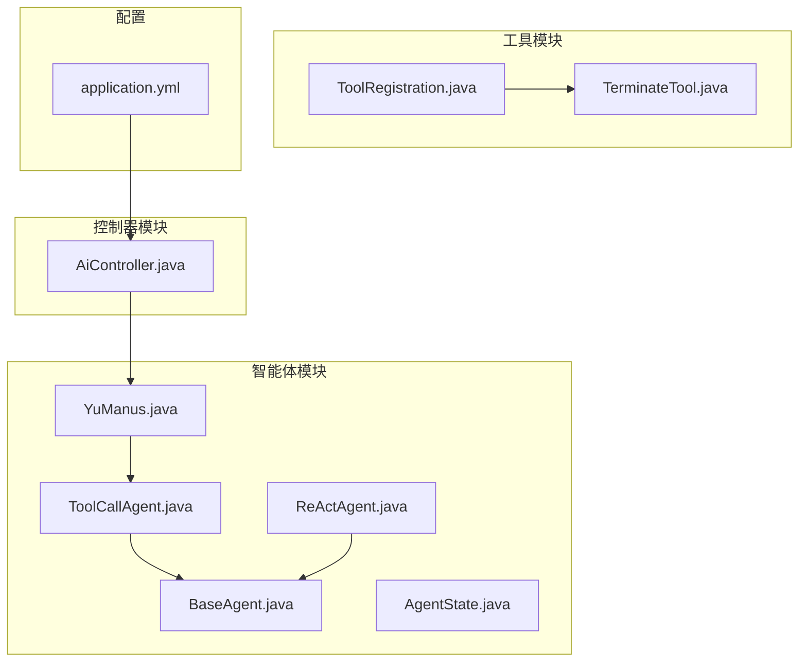
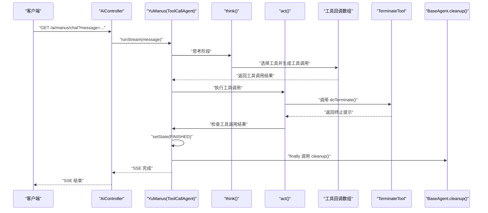
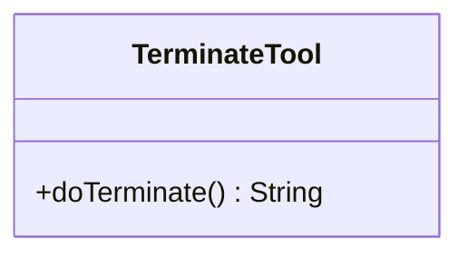
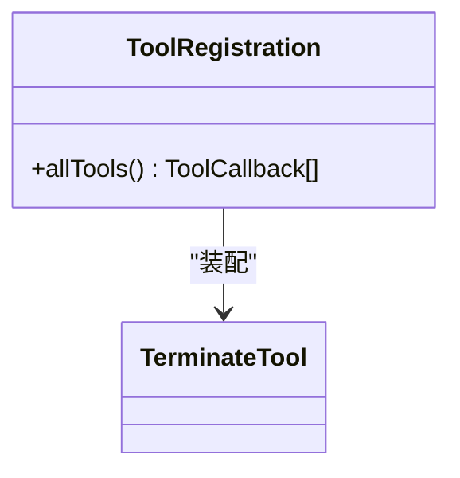
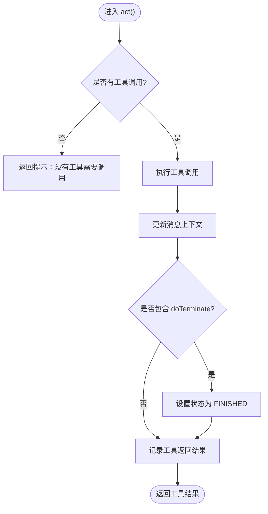
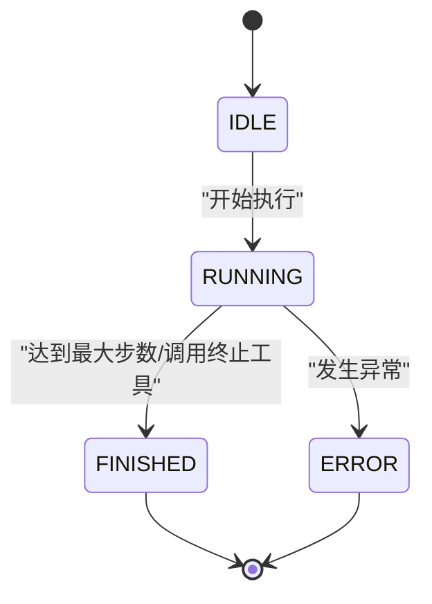
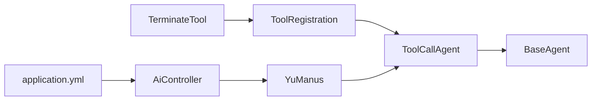

# 终止工具

<cite>
**本文引用的文件**
- [TerminateTool.java](file://src/main/java/com/yupi/yuaiagent/tools/TerminateTool.java)
- [ToolRegistration.java](file://src/main/java/com/yupi/yuaiagent/tools/ToolRegistration.java)
- [BaseAgent.java](file://src/main/java/com/yupi/yuaiagent/agent/BaseAgent.java)
- [ReActAgent.java](file://src/main/java/com/yupi/yuaiagent/agent/ReActAgent.java)
- [ToolCallAgent.java](file://src/main/java/com/yupi/yuaiagent/agent/ToolCallAgent.java)
- [AgentState.java](file://src/main/java/com/yupi/yuaiagent/agent/model/AgentState.java)
- [YuManus.java](file://src/main/java/com/yupi/yuaiagent/agent/YuManus.java)
- [AiController.java](file://src/main/java/com/yupi/yuaiagent/controller/AiController.java)
- [application.yml](file://src/main/resources/application.yml)
</cite>

## 目录
1. [简介](#简介)
2. [项目结构](#项目结构)
3. [核心组件](#核心组件)
4. [架构总览](#架构总览)
5. [详细组件分析](#详细组件分析)
6. [依赖关系分析](#依赖关系分析)
7. [性能考虑](#性能考虑)
8. [故障排查指南](#故障排查指南)
9. [结论](#结论)
10. [附录](#附录)

## 简介
本文件系统性阐述终止工具（TerminateTool）在智能体中的作用与实现机制，重点覆盖以下方面：
- 终止工具如何驱动智能体的会话结束与状态流转
- 终止工具在AI对话中的触发条件与调用时机
- 终止工具与工具注册、工具调用代理、控制器之间的协作关系
- 自然对话结束、错误状态处理、用户主动结束等典型使用场景
- 优雅关闭机制与异常处理策略
- 测试方法与调试技巧

## 项目结构
该工程采用分层+按功能模块组织的结构，与终止工具相关的模块分布如下：
- tools：工具定义与集中注册
- agent：智能体基类、ReAct模式、工具调用代理、具体智能体实现
- controller：对外接口，提供SSE流式对话能力
- resources：配置文件，包含Spring AI与DashScope等配置

图表来源
- [TerminateTool.java:1-18](file://src/main/java/com/yupi/yuaiagent/tools/TerminateTool.java#L1-L18)
- [ToolRegistration.java:1-38](file://src/main/java/com/yupi/yuaiagent/tools/ToolRegistration.java#L1-L38)
- [BaseAgent.java:1-193](file://src/main/java/com/yupi/yuaiagent/agent/BaseAgent.java#L1-L193)
- [ReActAgent.java:1-53](file://src/main/java/com/yupi/yuaiagent/agent/ReActAgent.java#L1-L53)
- [ToolCallAgent.java:1-136](file://src/main/java/com/yupi/yuaiagent/agent/ToolCallAgent.java#L1-L136)
- [YuManus.java:1-38](file://src/main/java/com/yupi/yuaiagent/agent/YuManus.java#L1-L38)
- [AiController.java:1-106](file://src/main/java/com/yupi/yuaiagent/controller/AiController.java#L1-L106)
- [application.yml:1-66](file://src/main/resources/application.yml#L1-L66)

章节来源
- [TerminateTool.java:1-18](file://src/main/java/com/yupi/yuaiagent/tools/TerminateTool.java#L1-L18)
- [ToolRegistration.java:1-38](file://src/main/java/com/yupi/yuaiagent/tools/ToolRegistration.java#L1-L38)
- [BaseAgent.java:1-193](file://src/main/java/com/yupi/yuaiagent/agent/BaseAgent.java#L1-L193)
- [ReActAgent.java:1-53](file://src/main/java/com/yupi/yuaiagent/agent/ReActAgent.java#L1-L53)
- [ToolCallAgent.java:1-136](file://src/main/java/com/yupi/yuaiagent/agent/ToolCallAgent.java#L1-L136)
- [YuManus.java:1-38](file://src/main/java/com/yupi/yuaiagent/agent/YuManus.java#L1-L38)
- [AiController.java:1-106](file://src/main/java/com/yupi/yuaiagent/controller/AiController.java#L1-L106)
- [application.yml:1-66](file://src/main/resources/application.yml#L1-L66)

## 核心组件
- 终止工具（TerminateTool）：提供一个无参工具方法，用于在对话中明确请求结束，返回固定提示语句，作为工具调用链路的“终止信号”。
- 工具注册（ToolRegistration）：集中装配所有可用工具，包括终止工具，形成工具回调数组，供智能体在推理阶段选择与调用。
- 工具调用代理（ToolCallAgent）：在ReAct模式下负责思考（选择工具）与行动（执行工具），并在工具执行后检查是否调用了终止工具，如是则将智能体状态置为已完成。
- 基础智能体（BaseAgent）：统一管理智能体状态、消息上下文、执行循环与资源清理；在run/runStream流程结束后统一调用cleanup进行资源回收。
- 具体智能体（YuManus）：继承工具调用代理，注入工具回调数组与聊天模型，提供系统提示词与下一步提示词，支持SSE流式输出。
- 控制器（AiController）：对外提供REST接口，接收用户消息并以SSE方式流式返回对话结果，内部构建具体智能体实例并调用其流式执行方法。
- 配置（application.yml）：包含DashScope API Key、模型选择、日志级别等，影响工具调用与智能体行为。

章节来源
- [TerminateTool.java:1-18](file://src/main/java/com/yupi/yuaiagent/tools/TerminateTool.java#L1-L18)
- [ToolRegistration.java:1-38](file://src/main/java/com/yupi/yuaiagent/tools/ToolRegistration.java#L1-L38)
- [ToolCallAgent.java:1-136](file://src/main/java/com/yupi/yuaiagent/agent/ToolCallAgent.java#L1-L136)
- [BaseAgent.java:1-193](file://src/main/java/com/yupi/yuaiagent/agent/BaseAgent.java#L1-L193)
- [YuManus.java:1-38](file://src/main/java/com/yupi/yuaiagent/agent/YuManus.java#L1-L38)
- [AiController.java:1-106](file://src/main/java/com/yupi/yuaiagent/controller/AiController.java#L1-L106)
- [application.yml:1-66](file://src/main/resources/application.yml#L1-L66)

## 架构总览
终止工具在整体架构中的位置与交互如下：
- 终止工具通过工具注册被注入到智能体可用工具集合中
- 在ReAct推理过程中，智能体根据系统提示词与上下文选择工具
- 当智能体选择终止工具时，工具调用代理检测到工具名为“doTerminate”，将智能体状态置为FINISHED
- 基础智能体在执行完成后统一清理资源，确保会话结束时的资源释放
- 控制器通过SSE将中间结果逐步推送至客户端，当智能体状态变为FINISHED或达到最大步数时，SSE连接完成

图表来源
- [AiController.java:100-104](file://src/main/java/com/yupi/yuaiagent/controller/AiController.java#L100-L104)
- [YuManus.java:1-38](file://src/main/java/com/yupi/yuaiagent/agent/YuManus.java#L1-L38)
- [ToolCallAgent.java:59-134](file://src/main/java/com/yupi/yuaiagent/agent/ToolCallAgent.java#L59-L134)
- [BaseAgent.java:88-91](file://src/main/java/com/yupi/yuaiagent/agent/BaseAgent.java#L88-L91)
- [TerminateTool.java:10-16](file://src/main/java/com/yupi/yuaiagent/tools/TerminateTool.java#L10-L16)

## 详细组件分析

### 终止工具（TerminateTool）
- 角色定位：提供一个显式“终止”工具方法，用于在对话中明确请求结束
- 工具描述：通过注解声明工具描述，说明在满足请求或无法继续任务时终止交互
- 方法签名：无参方法，返回固定提示语句，作为工具调用的响应内容
- 作用机制：被工具调用代理识别为“doTerminate”，从而触发智能体状态变更与会话结束

图表来源
- [TerminateTool.java:10-16](file://src/main/java/com/yupi/yuaiagent/tools/TerminateTool.java#L10-L16)

章节来源
- [TerminateTool.java:1-18](file://src/main/java/com/yupi/yuaiagent/tools/TerminateTool.java#L1-L18)

### 工具注册（ToolRegistration）
- 角色定位：集中装配所有可用工具，形成工具回调数组
- 注册流程：创建各工具实例，并通过工具回调工厂方法组装为ToolCallback[]
- 与终止工具的关系：将TerminateTool纳入工具集合，使其可被智能体在推理阶段选择与调用

图表来源
- [ToolRegistration.java:18-36](file://src/main/java/com/yupi/yuaiagent/tools/ToolRegistration.java#L18-L36)

章节来源
- [ToolRegistration.java:1-38](file://src/main/java/com/yupi/yuaiagent/tools/ToolRegistration.java#L1-L38)

### 工具调用代理（ToolCallAgent）
- 思考阶段（think）：拼接用户提示词与上下文，调用大模型生成工具调用结果，记录助手消息与工具选择信息
- 行动阶段（act）：执行工具调用，更新消息上下文；检测工具调用结果中是否存在“doTerminate”工具调用，若存在则将智能体状态置为FINISHED
- 关键逻辑：通过工具调用管理器执行工具调用，并从工具响应消息中判断是否调用了终止工具

图表来源
- [ToolCallAgent.java:111-134](file://src/main/java/com/yupi/yuaiagent/agent/ToolCallAgent.java#L111-L134)

章节来源
- [ToolCallAgent.java:1-136](file://src/main/java/com/yupi/yuaiagent/agent/ToolCallAgent.java#L1-L136)

### 基础智能体（BaseAgent）
- 状态管理：提供IDLE/RUNNING/FINISHED/ERROR四种状态，贯穿整个执行生命周期
- 执行循环：在run/runStream中维护步数计数与状态检查，达到最大步数或外部终止时结束
- 资源清理：在finally块中统一调用cleanup，确保会话结束时释放资源
- SSE支持：runStream提供长连接SSE输出，设置超时与完成回调，保证连接稳定与资源回收

图表来源
- [BaseAgent.java:53-92](file://src/main/java/com/yupi/yuaiagent/agent/BaseAgent.java#L53-L92)
- [AgentState.java:6-27](file://src/main/java/com/yupi/yuaiagent/agent/model/AgentState.java#L6-L27)

章节来源
- [BaseAgent.java:1-193](file://src/main/java/com/yupi/yuaiagent/agent/BaseAgent.java#L1-L193)
- [AgentState.java:1-27](file://src/main/java/com/yupi/yuaiagent/agent/model/AgentState.java#L1-L27)

### 具体智能体（YuManus）
- 继承关系：继承工具调用代理，具备ReAct推理能力
- 提示词配置：提供系统提示词与下一步提示词，明确在复杂任务中可使用工具，并允许在任意时刻使用终止工具
- 最大步数：设置合理的最大步数，避免无限循环
- 聊天客户端：通过构建器注入聊天模型与日志顾问，支持SSE流式输出

章节来源
- [YuManus.java:1-38](file://src/main/java/com/yupi/yuaiagent/agent/YuManus.java#L1-L38)

### 控制器（AiController）
- 接口设计：提供同步与SSE两种对话接口，SSE接口用于流式输出
- 依赖注入：注入工具回调数组与聊天模型，构建具体智能体实例
- 流式输出：通过SSE将中间结果逐步推送到客户端，最终完成连接

章节来源
- [AiController.java:1-106](file://src/main/java/com/yupi/yuaiagent/controller/AiController.java#L1-L106)

## 依赖关系分析
- 终止工具依赖于Spring AI的工具注解机制，通过@Tool注解暴露给大模型
- 工具注册依赖于Spring容器，将工具装配为回调数组
- 工具调用代理依赖于工具调用管理器与聊天客户端，负责工具选择与执行
- 具体智能体依赖于工具回调数组与聊天模型，提供系统提示词与下一步提示词
- 控制器依赖于具体智能体与SSE基础设施，负责对外提供接口

图表来源
- [TerminateTool.java:1-18](file://src/main/java/com/yupi/yuaiagent/tools/TerminateTool.java#L1-L18)
- [ToolRegistration.java:1-38](file://src/main/java/com/yupi/yuaiagent/tools/ToolRegistration.java#L1-L38)
- [ToolCallAgent.java:1-136](file://src/main/java/com/yupi/yuaiagent/agent/ToolCallAgent.java#L1-L136)
- [BaseAgent.java:1-193](file://src/main/java/com/yupi/yuaiagent/agent/BaseAgent.java#L1-L193)
- [YuManus.java:1-38](file://src/main/java/com/yupi/yuaiagent/agent/YuManus.java#L1-L38)
- [AiController.java:1-106](file://src/main/java/com/yupi/yuaiagent/controller/AiController.java#L1-L106)
- [application.yml:1-66](file://src/main/resources/application.yml#L1-L66)

章节来源
- [TerminateTool.java:1-18](file://src/main/java/com/yupi/yuaiagent/tools/TerminateTool.java#L1-L18)
- [ToolRegistration.java:1-38](file://src/main/java/com/yupi/yuaiagent/tools/ToolRegistration.java#L1-L38)
- [ToolCallAgent.java:1-136](file://src/main/java/com/yupi/yuaiagent/agent/ToolCallAgent.java#L1-L136)
- [BaseAgent.java:1-193](file://src/main/java/com/yupi/yuaiagent/agent/BaseAgent.java#L1-L193)
- [YuManus.java:1-38](file://src/main/java/com/yupi/yuaiagent/agent/YuManus.java#L1-L38)
- [AiController.java:1-106](file://src/main/java/com/yupi/yuaiagent/controller/AiController.java#L1-L106)
- [application.yml:1-66](file://src/main/resources/application.yml#L1-L66)

## 性能考虑
- 工具调用开销：工具调用代理在每次行动阶段都会执行工具调用管理器，建议合理设置最大步数，避免过长的工具链导致延迟
- SSE连接：SSE超时时间与完成回调需结合业务场景调整，确保在长时间对话中保持稳定
- 日志级别：配置文件中已开启DEBUG级别日志，便于观察工具调用细节，但生产环境建议适度降低日志级别以减少I/O开销
- 资源清理：基础智能体在finally中统一清理资源，确保会话结束时及时释放内存与连接

## 故障排查指南
- 终止工具未生效
  - 检查工具注册是否包含终止工具回调
  - 确认智能体的下一步提示词中是否明确允许使用终止工具
  - 查看工具调用代理的工具调用结果中是否包含“doTerminate”
- SSE连接异常
  - 检查控制器中SSE超时与完成回调设置
  - 确认智能体状态在FINISHED或ERROR时是否正确触发清理
- 工具调用失败
  - 查看工具调用代理的异常捕获与日志输出
  - 确认聊天模型配置与API Key是否正确

章节来源
- [ToolRegistration.java:18-36](file://src/main/java/com/yupi/yuaiagent/tools/ToolRegistration.java#L18-L36)
- [YuManus.java:23-28](file://src/main/java/com/yupi/yuaiagent/agent/YuManus.java#L23-L28)
- [ToolCallAgent.java:111-134](file://src/main/java/com/yupi/yuaiagent/agent/ToolCallAgent.java#L111-L134)
- [BaseAgent.java:163-176](file://src/main/java/com/yupi/yuaiagent/agent/BaseAgent.java#L163-L176)
- [AiController.java:77-92](file://src/main/java/com/yupi/yuaiagent/controller/AiController.java#L77-L92)
- [application.yml:64-66](file://src/main/resources/application.yml#L64-L66)

## 结论
终止工具通过简洁的工具方法与工具注册机制，为智能体提供了可控的会话结束能力。在ReAct推理流程中，工具调用代理能够准确识别终止工具调用并驱动智能体状态切换，配合基础智能体的资源清理机制与控制器的SSE流式输出，实现了优雅的对话结束与资源回收。该机制适用于自然对话结束、错误状态处理以及用户主动结束等多种场景。

## 附录
- 使用场景示例
  - 自然对话结束：当智能体完成用户请求或认为无需进一步操作时，调用终止工具结束会话
  - 错误状态处理：当智能体遇到不可恢复的异常时，通过终止工具标记结束并清理资源
  - 用户主动结束：在复杂任务中，用户可通过明确指令触发终止工具，立即结束当前会话
- 测试方法与调试技巧
  - 单元测试：验证工具注册是否包含终止工具回调
  - 集成测试：通过控制器接口发起SSE对话，观察工具调用与终止工具触发后的状态变化
  - 调试技巧：开启DEBUG日志级别，关注工具调用代理的日志输出，确认工具调用结果与状态切换