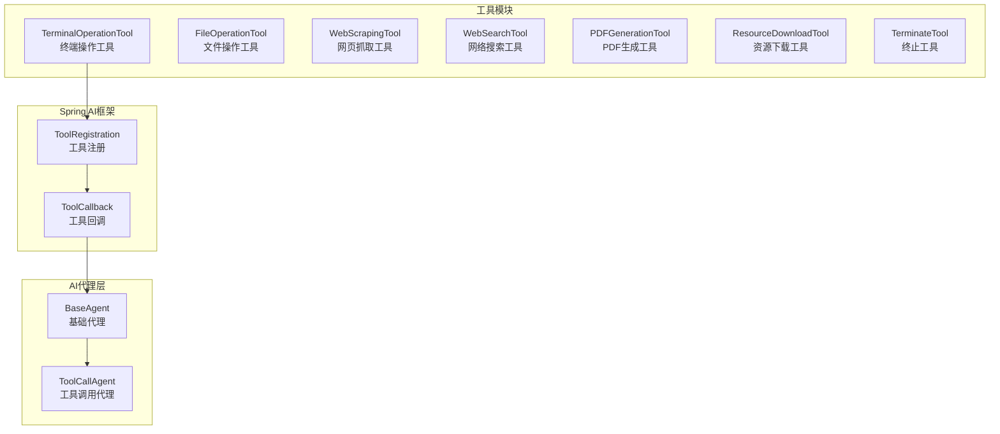
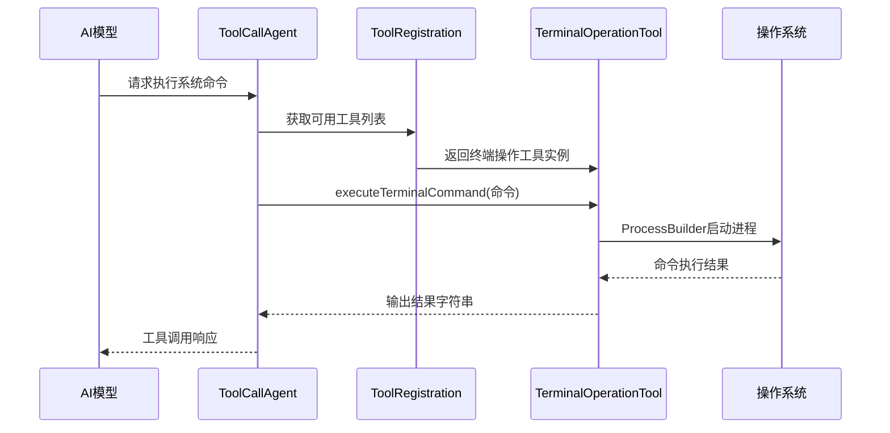
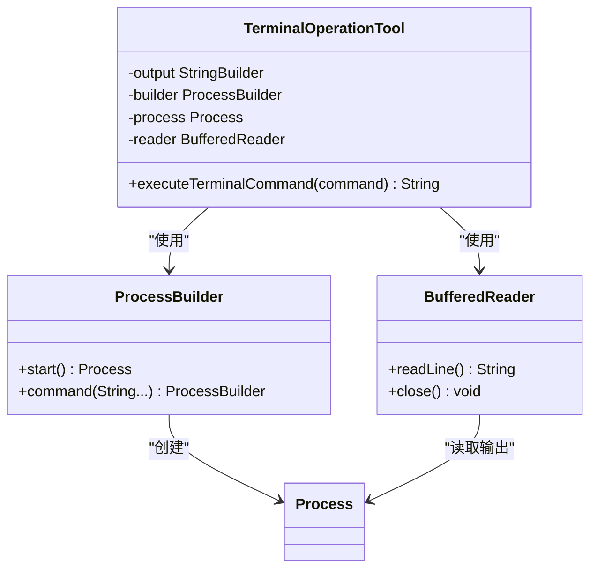
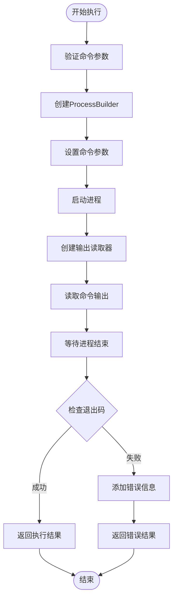
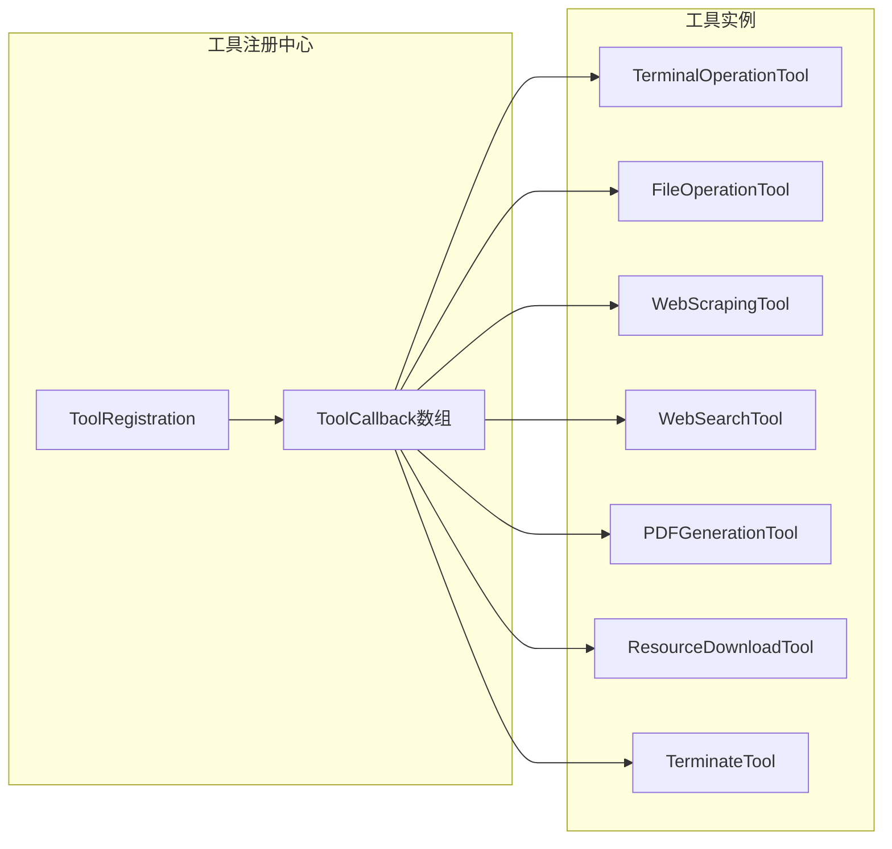
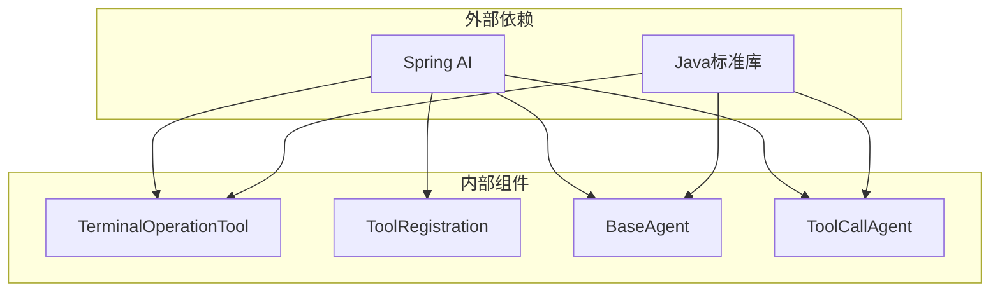

# 终端操作工具

<cite>
**本文档引用的文件**
- [TerminalOperationTool.java](file://src/main/java/com/yupi/yuaiagent/tools/TerminalOperationTool.java)
- [TerminalOperationToolTest.java](file://src/test/java/com/yupi/yuaiagent/tools/TerminalOperationToolTest.java)
- [ToolRegistration.java](file://src/main/java/com/yupi/yuaiagent/tools/ToolRegistration.java)
- [application.yml](file://src/main/resources/application.yml)
- [BaseAgent.java](file://src/main/java/com/yupi/yuaiagent/agent/BaseAgent.java)
- [ToolCallAgent.java](file://src/main/java/com/yupi/yuaiagent/agent/ToolCallAgent.java)
- [FileOperationTool.java](file://src/main/java/com/yupi/yuaiagent/tools/FileOperationTool.java)
</cite>

## 目录
1. [简介](#简介)
2. [项目结构](#项目结构)
3. [核心组件](#核心组件)
4. [架构概览](#架构概览)
5. [详细组件分析](#详细组件分析)
6. [依赖关系分析](#依赖关系分析)
7. [性能考量](#性能考量)
8. [故障排除指南](#故障排除指南)
9. [结论](#结论)
10. [附录](#附录)

## 简介
终端操作工具是本项目中用于执行系统命令的核心组件，基于Spring AI框架实现。该工具提供了安全的命令执行能力，支持Windows系统的cmd.exe命令处理器，能够执行各种系统命令并捕获输出结果。工具设计遵循最小权限原则，通过ProcessBuilder确保命令执行的安全性和可控性。

## 项目结构
终端操作工具位于工具模块中，与文件操作、网络搜索等其他工具共同构成完整的AI代理工具集。工具通过Spring AI的工具回调机制进行注册和管理。

**图表来源**
- [ToolRegistration.java:18-36](file://src/main/java/com/yupi/yuaiagent/tools/ToolRegistration.java#L18-L36)
- [TerminalOperationTool.java:15-16](file://src/main/java/com/yupi/yuaiagent/tools/TerminalOperationTool.java#L15-L16)

**章节来源**
- [ToolRegistration.java:1-38](file://src/main/java/com/yupi/yuaiagent/tools/ToolRegistration.java#L1-L38)
- [TerminalOperationTool.java:1-38](file://src/main/java/com/yupi/yuaiagent/tools/TerminalOperationTool.java#L1-L38)

## 核心组件
终端操作工具的核心功能围绕命令执行展开，主要包含以下关键特性：

### 命令执行机制
- **ProcessBuilder集成**：使用ProcessBuilder替代Runtime.exec()，提供更安全的进程管理
- **Windows兼容性**：针对Windows系统使用cmd.exe作为命令解释器
- **参数传递**：支持任意字符串命令作为输入参数

### 输出捕获系统
- **实时输出收集**：通过BufferedReader逐行读取命令输出
- **缓冲区管理**：使用StringBuilder构建完整输出结果
- **异常状态标识**：非零退出码时在输出中添加失败标识

### 错误处理策略
- **IO异常处理**：捕获文件系统相关的执行异常
- **中断异常处理**：处理线程中断导致的执行失败
- **统一错误格式**：所有异常都转换为可读的错误信息字符串

**章节来源**
- [TerminalOperationTool.java:15-36](file://src/main/java/com/yupi/yuaiagent/tools/TerminalOperationTool.java#L15-L36)

## 架构概览
终端操作工具在整个AI代理系统中扮演着系统级操作执行器的角色，通过Spring AI的工具回调机制与AI模型进行交互。

**图表来源**
- [ToolCallAgent.java:119-134](file://src/main/java/com/yupi/yuaiagent/agent/ToolCallAgent.java#L119-L134)
- [ToolRegistration.java:18-36](file://src/main/java/com/yupi/yuaiagent/tools/ToolRegistration.java#L18-L36)
- [TerminalOperationTool.java:15-36](file://src/main/java/com/yupi/yuaiagent/tools/TerminalOperationTool.java#L15-L36)

## 详细组件分析

### 终端操作工具类结构
终端操作工具采用简洁的设计模式，专注于单一职责的命令执行功能。

**图表来源**
- [TerminalOperationTool.java:15-36](file://src/main/java/com/yupi/yuaiagent/tools/TerminalOperationTool.java#L15-L36)

### 命令执行流程
命令执行过程遵循严格的生命周期管理，确保资源的正确分配和释放。

**图表来源**
- [TerminalOperationTool.java:18-35](file://src/main/java/com/yupi/yuaiagent/tools/TerminalOperationTool.java#L18-L35)

### 工具注册与集成
终端操作工具通过Spring AI的工具回调机制进行注册，与其他工具形成统一的工具生态系统。

**图表来源**
- [ToolRegistration.java:18-36](file://src/main/java/com/yupi/yuaiagent/tools/ToolRegistration.java#L18-L36)

**章节来源**
- [TerminalOperationTool.java:1-38](file://src/main/java/com/yupi/yuaiagent/tools/TerminalOperationTool.java#L1-L38)
- [ToolRegistration.java:18-36](file://src/main/java/com/yupi/yuaiagent/tools/ToolRegistration.java#L18-L36)

## 依赖关系分析
终端操作工具的依赖关系相对简单，主要依赖于Spring AI框架和Java标准库。

**图表来源**
- [TerminalOperationTool.java:3-8](file://src/main/java/com/yupi/yuaiagent/tools/TerminalOperationTool.java#L3-L8)
- [ToolRegistration.java:3-7](file://src/main/java/com/yupi/yuaiagent/tools/ToolRegistration.java#L3-L7)

**章节来源**
- [TerminalOperationTool.java:3-8](file://src/main/java/com/yupi/yuaiagent/tools/TerminalOperationTool.java#L3-L8)
- [ToolRegistration.java:3-7](file://src/main/java/com/yupi/yuaiagent/tools/ToolRegistration.java#L3-L7)

## 性能考量
终端操作工具在设计时充分考虑了性能和资源管理：

### 异步处理机制
虽然终端操作本身是同步执行的，但整个AI代理系统采用了异步处理策略：
- **SSE流式输出**：使用SseEmitter实现流式响应
- **线程池管理**：通过CompletableFuture实现异步执行
- **超时控制**：设置合理的超时时间防止资源泄露

### 资源管理策略
- **自动资源释放**：使用try-with-resources确保流的正确关闭
- **内存优化**：逐行读取输出避免大内存占用
- **进程生命周期**：严格控制进程的启动和销毁

### 安全性能平衡
- **最小权限原则**：仅授予必要的系统访问权限
- **命令白名单**：建议实现命令过滤机制
- **资源限制**：考虑添加执行时间限制和输出大小限制

## 故障排除指南

### 常见问题诊断
1. **命令执行失败**
   - 检查命令语法和参数
   - 验证系统环境变量
   - 确认权限设置

2. **输出截断问题**
   - 检查输出缓冲区大小
   - 验证命令输出格式
   - 考虑分页或分块处理

3. **超时异常**
   - 调整超时设置
   - 优化命令执行逻辑
   - 实施重试机制

### 错误处理策略
终端操作工具采用统一的错误处理模式：
- **异常捕获**：捕获所有可能的执行异常
- **错误信息格式化**：提供清晰的错误描述
- **状态反馈**：通过输出字符串反映执行状态

**章节来源**
- [TerminalOperationTool.java:32-34](file://src/main/java/com/yupi/yuaiagent/tools/TerminalOperationTool.java#L32-L34)
- [BaseAgent.java:147-155](file://src/main/java/com/yupi/yuaiagent/agent/BaseAgent.java#L147-L155)

## 结论
终端操作工具为AI代理系统提供了强大的系统级操作能力。通过精心设计的安全机制、完善的错误处理和优雅的资源管理，该工具能够在保证安全性的同时提供高效的命令执行服务。建议在未来版本中进一步增强安全防护措施，如实现命令白名单、添加执行时间限制和输出大小限制等。

## 附录

### 实际应用场景
1. **系统信息获取**
   - 系统状态监控
   - 硬件信息查询
   - 网络连接状态检查

2. **文件管理操作**
   - 文件系统浏览
   - 权限检查
   - 磁盘空间监控

3. **网络诊断工具**
   - 连接测试
   - 路由追踪
   - 端口扫描

### 最佳实践建议
1. **安全执行策略**
   - 实现命令白名单机制
   - 添加执行时间限制
   - 设置输出大小限制
   - 实施权限验证

2. **性能优化建议**
   - 实现命令缓存机制
   - 添加并发执行限制
   - 优化资源使用效率
   - 实施监控和日志记录

3. **错误处理改进**
   - 实现分级错误处理
   - 添加重试机制
   - 提供详细的错误诊断信息
   - 实施优雅降级策略