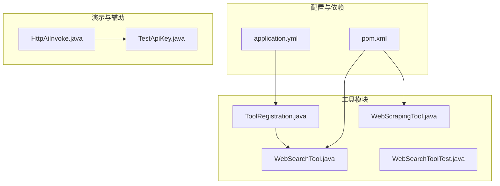
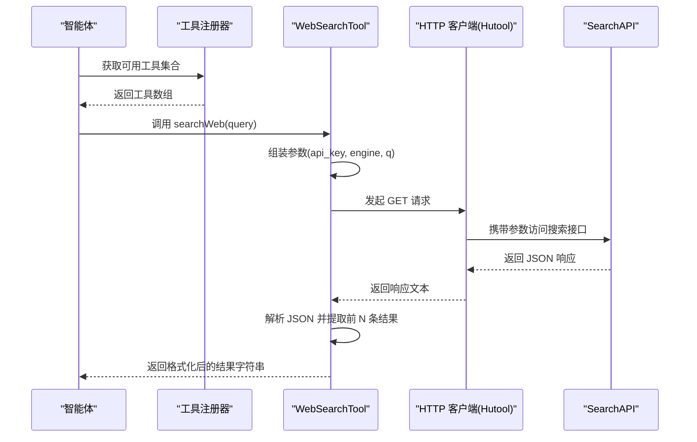
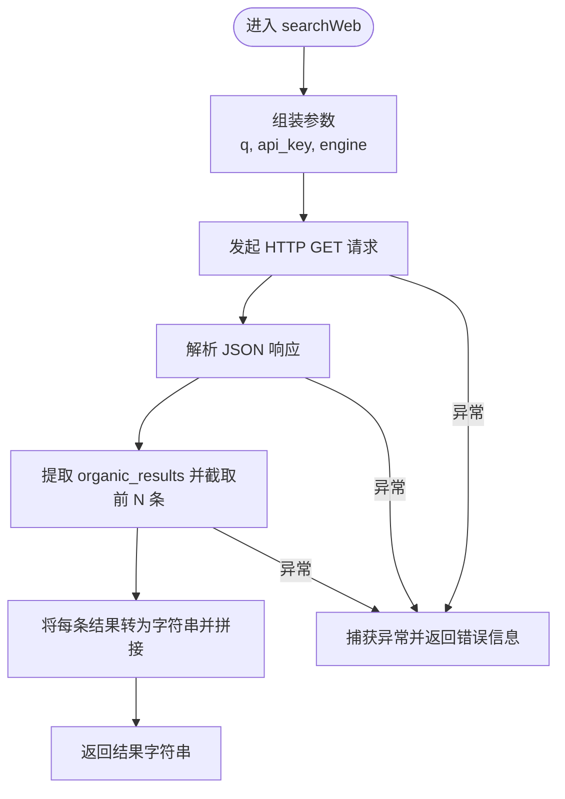
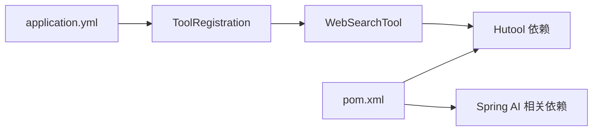

# 网络搜索工具

<cite>
**本文引用的文件**
- [WebSearchTool.java](file://src/main/java/com/yupi/yuaiagent/tools/WebSearchTool.java)
- [WebSearchToolTest.java](file://src/test/java/com/yupi/yuaiagent/tools/WebSearchToolTest.java)
- [ToolRegistration.java](file://src/main/java/com/yupi/yuaiagent/tools/ToolRegistration.java)
- [application.yml](file://src/main/resources/application.yml)
- [pom.xml](file://pom.xml)
- [WebScrapingTool.java](file://src/main/java/com/yupi/yuaiagent/tools/WebScrapingTool.java)
- [HttpAiInvoke.java](file://src/main/java/com/yupi/yuaiagent/demo/invoke/HttpAiInvoke.java)
- [TestApiKey.java](file://src/main/java/com/yupi/yuaiagent/demo/invoke/TestApiKey.java)
</cite>

## 目录
1. [简介](#简介)
2. [项目结构](#项目结构)
3. [核心组件](#核心组件)
4. [架构总览](#架构总览)
5. [详细组件分析](#详细组件分析)
6. [依赖分析](#依赖分析)
7. [性能考虑](#性能考虑)
8. [故障排查指南](#故障排查指南)
9. [结论](#结论)
10. [附录](#附录)

## 简介
本文件面向“网络搜索工具”的使用者与维护者，系统性说明 WebSearchTool 的实现原理、功能特性与使用方法。内容涵盖：
- 搜索引擎 API 集成方式与参数配置
- 结果解析与格式化策略
- API 密钥管理与安全处理
- 搜索结果的数据结构与处理流程
- 使用示例、最佳实践、性能与限制、测试与调试方法

## 项目结构
网络搜索工具位于工具模块中，配合工具注册器统一注入到智能体工作流中；其运行依赖 Spring AI 注解框架与 Hutool 工具库进行 HTTP 请求与 JSON 解析。

图表来源
- [WebSearchTool.java:1-54](file://src/main/java/com/yupi/yuaiagent/tools/WebSearchTool.java#L1-L54)
- [ToolRegistration.java:1-37](file://src/main/java/com/yupi/yuaiagent/tools/ToolRegistration.java#L1-L37)
- [application.yml:59-62](file://src/main/resources/application.yml#L59-L62)
- [pom.xml:144-147](file://pom.xml#L144-L147)

章节来源
- [WebSearchTool.java:1-54](file://src/main/java/com/yupi/yuaiagent/tools/WebSearchTool.java#L1-L54)
- [ToolRegistration.java:1-37](file://src/main/java/com/yupi/yuaiagent/tools/ToolRegistration.java#L1-L37)
- [application.yml:59-62](file://src/main/resources/application.yml#L59-L62)
- [pom.xml:144-147](file://pom.xml#L144-L147)

## 核心组件
- WebSearchTool：封装对 SearchAPI 的调用，负责构造查询参数、发起 HTTP GET 请求、解析 JSON 响应并提取前 N 条结果。
- ToolRegistration：集中注册工具，从配置文件注入 API Key 并实例化 WebSearchTool。
- WebScrapingTool：网页抓取工具，作为与 WebSearchTool 协同的另一类网络能力补充。
- 配置与依赖：application.yml 中定义 search-api.api-key；pom.xml 引入 Hutool 与 Spring AI 相关依赖。

章节来源
- [WebSearchTool.java:18-52](file://src/main/java/com/yupi/yuaiagent/tools/WebSearchTool.java#L18-L52)
- [ToolRegistration.java:15-35](file://src/main/java/com/yupi/yuaiagent/tools/ToolRegistration.java#L15-L35)
- [WebScrapingTool.java:1-23](file://src/main/java/com/yupi/yuaiagent/tools/WebScrapingTool.java#L1-L23)
- [application.yml:59-62](file://src/main/resources/application.yml#L59-L62)
- [pom.xml:144-147](file://pom.xml#L144-L147)

## 架构总览
WebSearchTool 通过注解暴露为可被智能体调用的工具函数，工具注册器在应用启动时读取配置注入 API Key，并将工具集合传递给智能体执行器。工具内部使用 Hutool 发起 HTTP 请求并解析 JSON。

图表来源
- [ToolRegistration.java:18-35](file://src/main/java/com/yupi/yuaiagent/tools/ToolRegistration.java#L18-L35)
- [WebSearchTool.java:29-52](file://src/main/java/com/yupi/yuaiagent/tools/WebSearchTool.java#L29-L52)

## 详细组件分析

### WebSearchTool 实现与流程
- 功能定位：对外暴露一个可被智能体调用的搜索工具，基于 SearchAPI 的百度引擎接口。
- 关键点：
  - 固定搜索接口地址与参数键名
  - 通过构造函数注入 API Key
  - 使用 Hutool 发起 GET 请求
  - 解析 JSON，提取 organic_results 并截取前 N 条
  - 将每条结果对象转为字符串后合并为单个字符串返回
  - 异常捕获并返回错误信息

图表来源
- [WebSearchTool.java:29-52](file://src/main/java/com/yupi/yuaiagent/tools/WebSearchTool.java#L29-L52)

章节来源
- [WebSearchTool.java:18-52](file://src/main/java/com/yupi/yuaiagent/tools/WebSearchTool.java#L18-L52)

### API 密钥管理与安全
- 注入方式：工具注册器从 application.yml 读取 search-api.api-key，并将其注入 WebSearchTool 构造函数。
- 运行时可见性：WebSearchTool 持有私有 final 字段保存 API Key，避免在方法内硬编码。
- 安全建议：
  - 生产环境务必通过外部配置或环境变量注入，不要写死在代码中
  - 在 CI/CD 中使用机密变量或平台提供的密钥管理服务
  - 限制 API Key 的权限范围与配额，启用访问日志审计
  - 对于演示用途的 TestApiKey 接口仅用于本地测试，不应在生产使用

章节来源
- [ToolRegistration.java:15-16](file://src/main/java/com/yupi/yuaiagent/tools/ToolRegistration.java#L15-L16)
- [application.yml:59-62](file://src/main/resources/application.yml#L59-L62)
- [TestApiKey.java:6-10](file://src/main/java/com/yupi/yuaiagent/demo/invoke/TestApiKey.java#L6-L10)

### 搜索参数与结果处理
- 参数配置：
  - q：搜索关键词
  - api_key：来自配置的密钥
  - engine：固定为 baidu
- 结果解析：
  - 解析 JSON 文本为对象
  - 从响应中提取 organic_results 数组
  - 截取前 N 条（默认 5 条），逐条转为字符串并合并
- 输出格式：单个字符串，包含多条结果对象的字符串表示，便于后续进一步解析或直接用于提示词

章节来源
- [WebSearchTool.java:32-47](file://src/main/java/com/yupi/yuaiagent/tools/WebSearchTool.java#L32-L47)

### 与其他工具的协作
- WebScrapingTool：当搜索结果仅提供摘要或链接时，可结合网页抓取工具对目标页面进行二次抓取，获取更完整的正文内容。
- 工具注册：ToolRegistration 将 WebSearchTool 与其他工具统一注册为 ToolCallback 数组，供智能体执行器使用。

章节来源
- [WebScrapingTool.java:13-21](file://src/main/java/com/yupi/yuaiagent/tools/WebScrapingTool.java#L13-L21)
- [ToolRegistration.java:18-35](file://src/main/java/com/yupi/yuaiagent/tools/ToolRegistration.java#L18-L35)

## 依赖分析
- Hutool：提供 HTTP 请求与 JSON 解析能力，简化网络与数据处理逻辑
- Spring AI 注解：通过 @Tool 与 @ToolParam 标注工具方法与参数，便于智能体识别与调用
- Spring Boot 配置：application.yml 提供 search-api.api-key 的外部化配置入口

图表来源
- [pom.xml:144-147](file://pom.xml#L144-L147)
- [application.yml:59-62](file://src/main/resources/application.yml#L59-L62)
- [ToolRegistration.java:15-16](file://src/main/java/com/yupi/yuaiagent/tools/ToolRegistration.java#L15-L16)
- [WebSearchTool.java:3-8](file://src/main/java/com/yupi/yuaiagent/tools/WebSearchTool.java#L3-L8)

章节来源
- [pom.xml:144-147](file://pom.xml#L144-L147)
- [application.yml:59-62](file://src/main/resources/application.yml#L59-L62)
- [ToolRegistration.java:15-16](file://src/main/java/com/yupi/yuaiagent/tools/ToolRegistration.java#L15-L16)
- [WebSearchTool.java:3-8](file://src/main/java/com/yupi/yuaiagent/tools/WebSearchTool.java#L3-L8)

## 性能考虑
- 网络延迟与超时：HTTP 请求可能受网络波动影响，建议在调用侧增加重试与超时控制（可在上层封装或代理层实现）。
- 结果数量控制：当前默认取前 5 条，可根据场景调整 N 值，平衡召回质量与上下文长度。
- JSON 解析成本：Hutool 的 JSON 解析在小规模结果集下开销较低，若结果体量增大，可考虑分页或增量处理。
- API 限流与配额：SearchAPI 可能存在速率限制与配额，建议在业务层做缓存与去重，避免重复请求相同关键词。

## 故障排查指南
- 无法获取 API Key：
  - 确认 application.yml 中 search-api.api-key 已正确设置
  - 检查工具注册器是否成功注入
- 请求失败或返回空结果：
  - 检查网络连通性与代理设置
  - 核对 engine 参数是否仍为 baidu（接口可能变更）
  - 查看返回的 JSON 结构是否发生变化（如字段名变更）
- 结果为空或异常：
  - 捕获异常路径返回错误信息，检查日志级别是否足够（application.yml 已开启 Spring AI 日志 DEBUG）

章节来源
- [application.yml:59-66](file://src/main/resources/application.yml#L59-L66)
- [WebSearchTool.java:49-51](file://src/main/java/com/yupi/yuaiagent/tools/WebSearchTool.java#L49-L51)
- [WebSearchToolTest.java:13-22](file://src/test/java/com/yupi/yuaiagent/tools/WebSearchToolTest.java#L13-L22)

## 结论
WebSearchTool 以简洁的方式封装了基于 SearchAPI 的网页搜索能力，通过注解与配置实现了与智能体的无缝集成。其设计遵循“最小可用”原则：固定参数、简单解析、可控输出。在生产环境中，建议完善密钥管理、错误处理与性能优化，并结合 WebScrapingTool 实现“搜索+抓取”的闭环能力。

## 附录

### 使用示例与最佳实践
- 基本使用
  - 在 application.yml 中配置 search-api.api-key
  - 通过 ToolRegistration 注册 WebSearchTool
  - 在智能体工作流中调用 searchWeb(query)
- 关键词优化
  - 明确领域与目标，减少歧义词
  - 使用短语检索（加引号）提高精确度
  - 分步检索：先广域再聚焦
- 结果过滤
  - 对返回字符串进行二次解析，按标题/摘要/链接筛选
  - 与 WebScrapingTool 协作，抓取高相关页面正文
- 错误处理
  - 捕获网络异常与解析异常，记录日志并回退策略
  - 对空结果进行兜底提示或改写查询

章节来源
- [application.yml:59-62](file://src/main/resources/application.yml#L59-L62)
- [ToolRegistration.java:18-35](file://src/main/java/com/yupi/yuaiagent/tools/ToolRegistration.java#L18-L35)
- [WebSearchTool.java:29-52](file://src/main/java/com/yupi/yuaiagent/tools/WebSearchTool.java#L29-L52)
- [WebScrapingTool.java:13-21](file://src/main/java/com/yupi/yuaiagent/tools/WebScrapingTool.java#L13-L21)

### 测试方法与调试技巧
- 单元测试
  - WebSearchToolTest 通过 SpringBootTest 注入配置并调用 searchWeb，断言返回非空
- 调试技巧
  - 提升日志级别至 DEBUG，观察 Spring AI 的工具调用细节
  - 使用演示代码中的 HTTP 调用方式验证 API Key 与接口连通性
  - 本地使用 TestApiKey 接口进行最小化验证

章节来源
- [WebSearchToolTest.java:10-22](file://src/test/java/com/yupi/yuaiagent/tools/WebSearchToolTest.java#L10-L22)
- [application.yml:64-66](file://src/main/resources/application.yml#L64-L66)
- [HttpAiInvoke.java:12-42](file://src/main/java/com/yupi/yuaiagent/demo/invoke/HttpAiInvoke.java#L12-L42)
- [TestApiKey.java:6-10](file://src/main/java/com/yupi/yuaiagent/demo/invoke/TestApiKey.java#L6-L10)