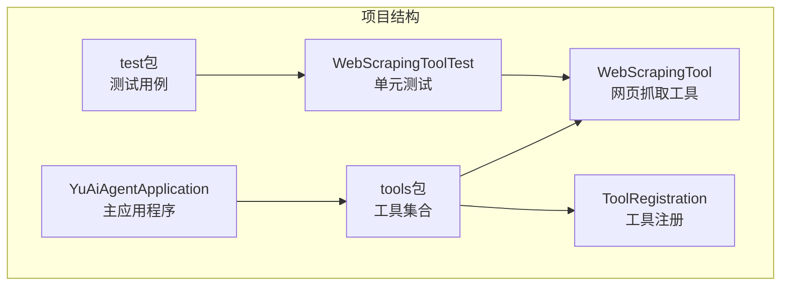
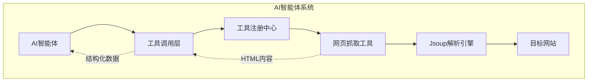
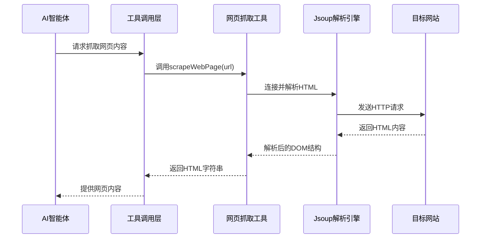
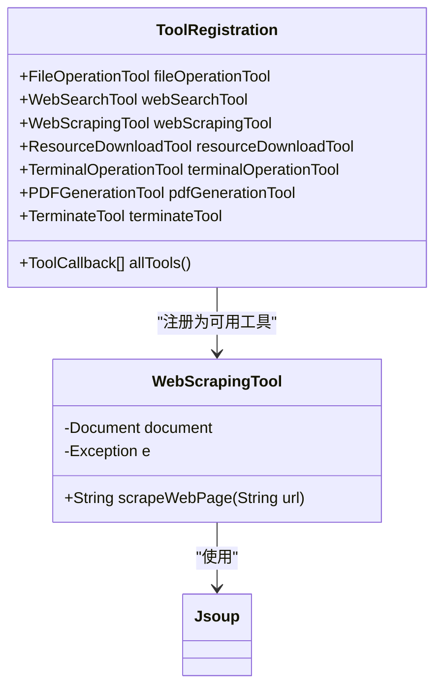
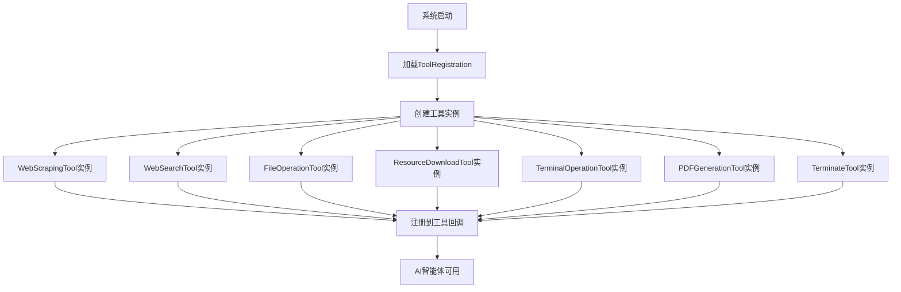
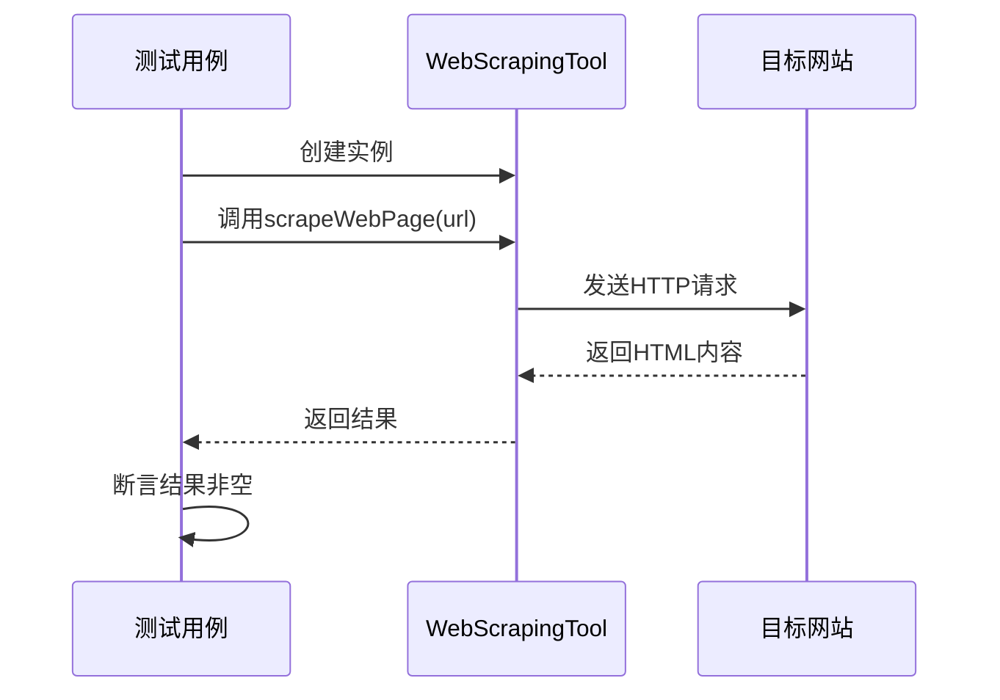
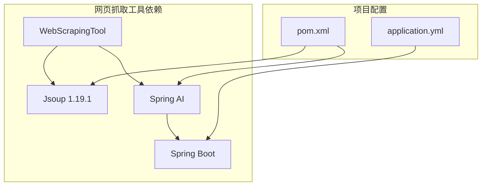

# 网页抓取工具

<cite>
**本文引用的文件列表**
- [WebScrapingTool.java](file://src/main/java/com/yupi/yuaiagent/tools/WebScrapingTool.java)
- [WebScrapingToolTest.java](file://src/test/java/com/yupi/yuaiagent/tools/WebScrapingToolTest.java)
- [ToolRegistration.java](file://src/main/java/com/yupi/yuaiagent/tools/ToolRegistration.java)
- [pom.xml](file://pom.xml)
- [application.yml](file://src/main/resources/application.yml)
- [YuAiAgentApplication.java](file://src/main/java/com/yupi/yuaiagent/YuAiAgentApplication.java)
- [README.md](file://README.md)
</cite>

## 目录
1. [简介](#简介)
2. [项目结构](#项目结构)
3. [核心组件](#核心组件)
4. [架构概览](#架构概览)
5. [详细组件分析](#详细组件分析)
6. [依赖分析](#依赖分析)
7. [性能考虑](#性能考虑)
8. [故障排除指南](#故障排除指南)
9. [结论](#结论)
10. [附录](#附录)

## 简介
网页抓取工具是AI智能体系统中的重要组成部分，负责从互联网上提取和解析网页内容。本工具基于Jsoup库实现了高效的HTML解析和内容提取功能，为AI智能体提供了丰富的外部信息来源。

该工具集成了Spring AI框架的工具调用机制，能够作为AI智能体的可调用工具，支持自动化的内容抓取和处理流程。工具设计简洁高效，专注于提供可靠的网页内容提取能力。

## 项目结构
该项目采用Spring Boot标准项目结构，网页抓取工具位于tools包中，与其它AI工具共同管理。

**图表来源**
- [YuAiAgentApplication.java:1-18](file://src/main/java/com/yupi/yuaiagent/YuAiAgentApplication.java#L1-L18)
- [ToolRegistration.java:1-38](file://src/main/java/com/yupi/yuaiagent/tools/ToolRegistration.java#L1-L38)

**章节来源**
- [pom.xml:1-227](file://pom.xml#L1-L227)
- [application.yml:1-66](file://src/main/resources/application.yml#L1-L66)

## 核心组件
网页抓取工具的核心功能由WebScrapingTool类实现，该类提供了简洁而强大的网页内容提取能力。

### 主要功能特性
- **HTML内容提取**：使用Jsoup库解析网页HTML结构
- **异常处理**：完善的错误捕获和处理机制
- **工具集成**：符合Spring AI工具调用规范
- **简单易用**：仅需提供URL即可获取完整HTML内容

### 技术实现要点
- 基于Jsoup的DOM解析能力
- Spring AI @Tool注解支持
- 标准化的工具参数定义
- 统一的错误响应格式

**章节来源**
- [WebScrapingTool.java:1-23](file://src/main/java/com/yupi/yuaiagent/tools/WebScrapingTool.java#L1-L23)

## 架构概览
网页抓取工具在整个AI智能体系统中扮演着数据获取的关键角色，通过工具注册机制与其他组件协同工作。

**图表来源**
- [ToolRegistration.java:18-36](file://src/main/java/com/yupi/yuaiagent/tools/ToolRegistration.java#L18-L36)
- [WebScrapingTool.java:13-21](file://src/main/java/com/yupi/yuaiagent/tools/WebScrapingTool.java#L13-L21)

### 工具调用流程
网页抓取工具通过Spring AI框架的工具调用机制被智能体调用，实现了自动化的内容获取流程。

**图表来源**
- [WebScrapingTool.java:14-20](file://src/main/java/com/yupi/yuaiagent/tools/WebScrapingTool.java#L14-L20)

## 详细组件分析

### WebScrapingTool类分析
WebScrapingTool是网页抓取功能的核心实现，采用了简洁而有效的设计模式。

**图表来源**
- [WebScrapingTool.java:11-22](file://src/main/java/com/yupi/yuaiagent/tools/WebScrapingTool.java#L11-L22)
- [ToolRegistration.java:18-36](file://src/main/java/com/yupi/yuaiagent/tools/ToolRegistration.java#L18-L36)

#### 方法实现分析
scrapeWebPage方法实现了网页内容抓取的核心逻辑，具有以下特点：
- 使用@Tool注解标识为AI工具
- 通过Jsoup.connect(url).get()建立连接
- 返回完整的HTML内容字符串
- 包含完善的异常处理机制

#### 错误处理机制
工具实现了健壮的错误处理策略：
- 捕获所有网络和解析异常
- 返回标准化的错误信息
- 避免程序崩溃影响整体系统

**章节来源**
- [WebScrapingTool.java:13-21](file://src/main/java/com/yupi/yuaiagent/tools/WebScrapingTool.java#L13-L21)

### 工具注册机制
ToolRegistration类负责统一管理和注册所有可用的AI工具，确保网页抓取工具能够被智能体正确识别和调用。

**图表来源**
- [ToolRegistration.java:18-36](file://src/main/java/com/yupi/yuaiagent/tools/ToolRegistration.java#L18-L36)

**章节来源**
- [ToolRegistration.java:12-36](file://src/main/java/com/yupi/yuaiagent/tools/ToolRegistration.java#L12-L36)

### 测试验证
WebScrapingToolTest提供了基本的功能验证，确保工具能够正常工作。

**图表来源**
- [WebScrapingToolTest.java:8-14](file://src/test/java/com/yupi/yuaiagent/tools/WebScrapingToolTest.java#L8-L14)

**章节来源**
- [WebScrapingToolTest.java:6-15](file://src/test/java/com/yupi/yuaiagent/tools/WebScrapingToolTest.java#L6-L15)

## 依赖分析
网页抓取工具的依赖关系清晰明确，主要依赖于Jsoup HTML解析库和Spring AI框架。

**图表来源**
- [pom.xml:122-127](file://pom.xml#L122-L127)
- [pom.xml:48-49](file://pom.xml#L48-L49)

### 核心依赖说明
- **Jsoup库**：提供HTML解析和DOM操作功能
- **Spring AI框架**：支持工具调用机制和AI集成
- **Spring Boot**：提供基础的Web服务和配置管理

**章节来源**
- [pom.xml:122-127](file://pom.xml#L122-L127)
- [pom.xml:50-164](file://pom.xml#L50-L164)

## 性能考虑
虽然当前版本的网页抓取工具功能相对简单，但在性能优化方面仍有改进空间。

### 当前实现特点
- **同步阻塞**：每次抓取都会等待网络响应
- **内存占用**：完整HTML内容直接返回，可能占用较多内存
- **无缓存机制**：相同URL重复访问会产生额外开销

### 性能优化建议
1. **异步处理**：实现非阻塞的抓取机制
2. **内容过滤**：只提取必要的HTML内容
3. **缓存策略**：添加URL级别的内容缓存
4. **并发控制**：限制同时进行的抓取数量
5. **超时配置**：设置合理的连接和读取超时时间

### 稳定性保障
- **异常隔离**：单个抓取失败不影响整体系统
- **重试机制**：可扩展的失败重试策略
- **资源管理**：及时释放网络连接和内存资源

## 故障排除指南
网页抓取工具在实际使用中可能遇到各种问题，以下是常见问题的诊断和解决方案。

### 常见问题类型
1. **网络连接问题**
   - DNS解析失败
   - 网络超时
   - 防火墙阻断

2. **网页解析问题**
   - HTML结构异常
   - 编码格式不兼容
   - 动态内容加载

3. **权限相关问题**
   - robots.txt限制
   - 用户代理检测
   - IP封禁

### 诊断步骤
1. **检查网络连通性**
   - 验证目标URL可达性
   - 检查代理设置
   - 确认防火墙规则

2. **验证工具配置**
   - 确认工具已正确注册
   - 检查Spring AI配置
   - 验证依赖库版本

3. **分析错误信息**
   - 查看具体的异常类型
   - 检查HTTP状态码
   - 分析响应内容

### 解决方案
- **网络问题**：配置代理服务器，调整超时设置
- **解析问题**：添加编码处理，实现内容清理
- **权限问题**：模拟浏览器用户代理，遵守robots.txt
- **性能问题**：实现缓存机制，优化并发处理

**章节来源**
- [WebScrapingTool.java:18-20](file://src/main/java/com/yupi/yuaiagent/tools/WebScrapingTool.java#L18-L20)

## 结论
网页抓取工具作为AI智能体系统的重要组成部分，为智能体提供了获取外部信息的能力。当前版本实现了简洁而有效的网页内容提取功能，基于Jsoup库提供了可靠的HTML解析能力。

### 主要优势
- **实现简洁**：核心功能集中在单一方法中
- **易于集成**：完全符合Spring AI工具调用规范
- **错误处理**：具备完善的异常处理机制
- **扩展性强**：为后续功能增强预留了空间

### 发展方向
未来可以在以下方面进行改进：
- 增加内容过滤和结构化处理能力
- 实现异步和缓存机制
- 添加反爬虫应对策略
- 提供更丰富的数据提取选项

该工具为AI智能体提供了坚实的数据获取基础，是构建复杂AI应用的重要基础设施。

## 附录

### 使用示例场景
根据项目文档，网页抓取工具可以应用于以下场景：
- **新闻聚合**：从多个新闻网站抓取最新资讯
- **价格比较**：抓取电商网站的商品价格信息
- **数据挖掘**：提取学术论文或研究报告内容
- **内容分析**：获取网页结构化数据用于AI分析

### 合法性考虑
在使用网页抓取工具时，应遵守以下原则：
- 遵守目标网站的robots.txt协议
- 尊重版权和知识产权
- 合理控制抓取频率
- 不抓取敏感或私密信息
- 在商业使用前获得必要授权

### 最佳实践
- 设置合理的请求间隔
- 使用合适的User-Agent
- 处理各种异常情况
- 实现内容缓存机制
- 监控抓取效果和性能

**章节来源**
- [README.md:85-96](file://README.md#L85-L96)
- [README.md:251-265](file://README.md#L251-L265)