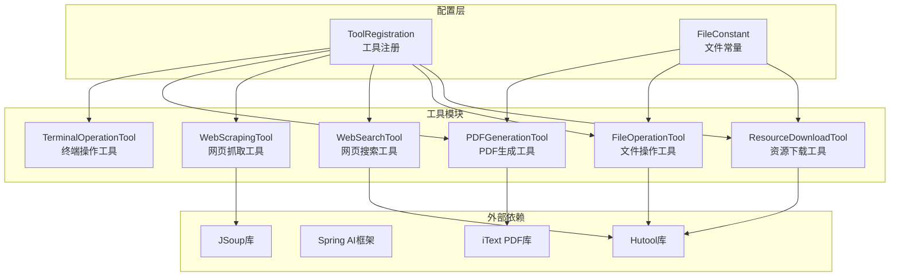
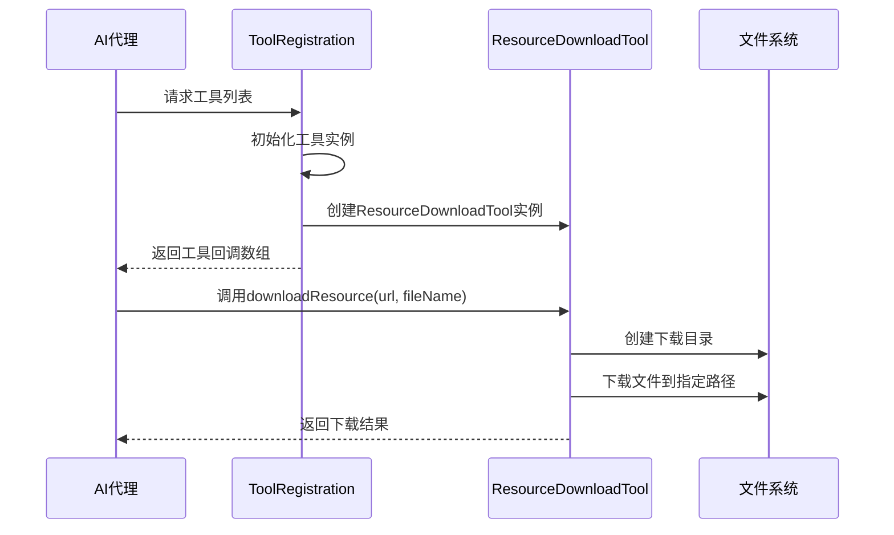
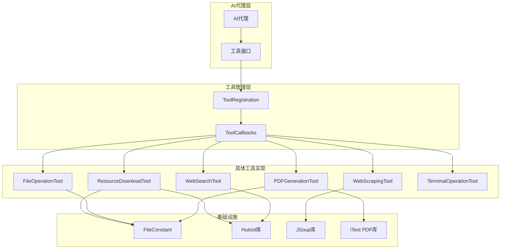
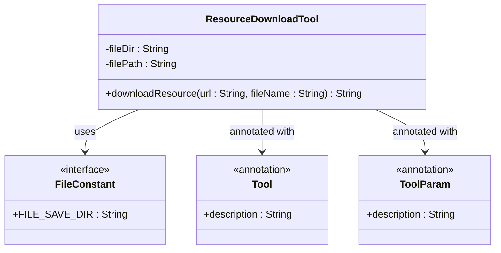
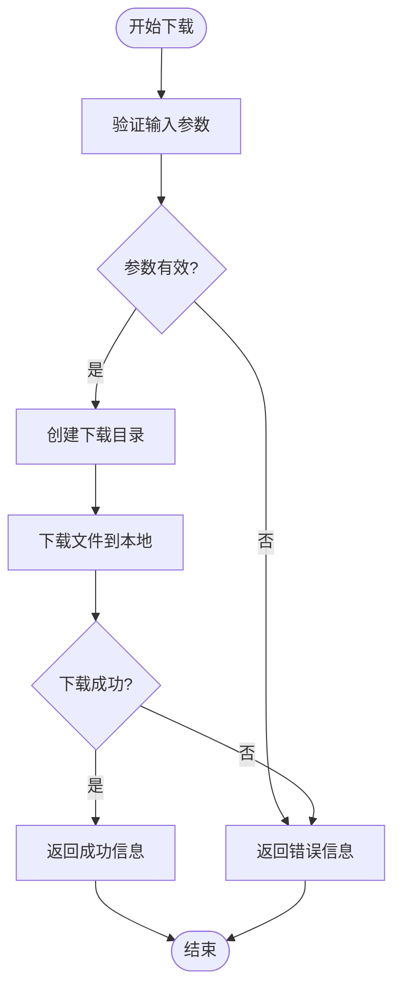
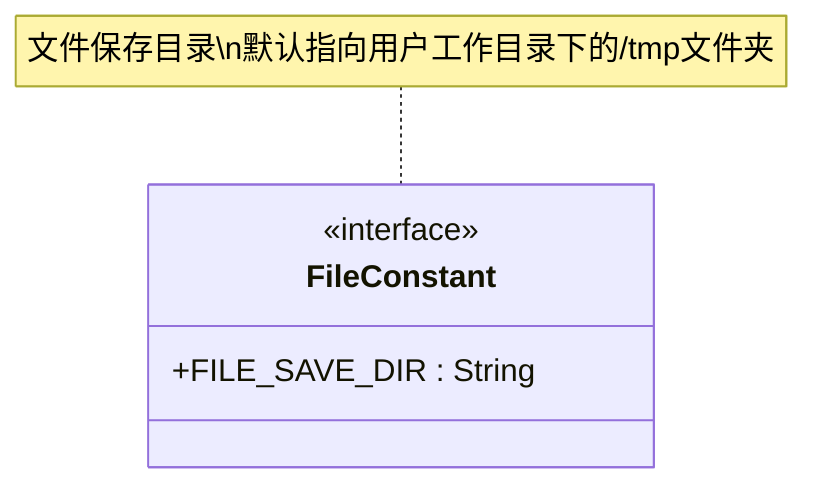
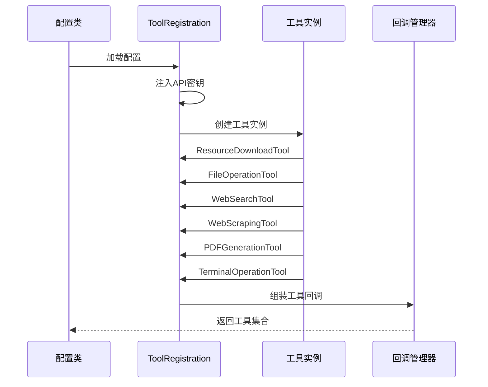
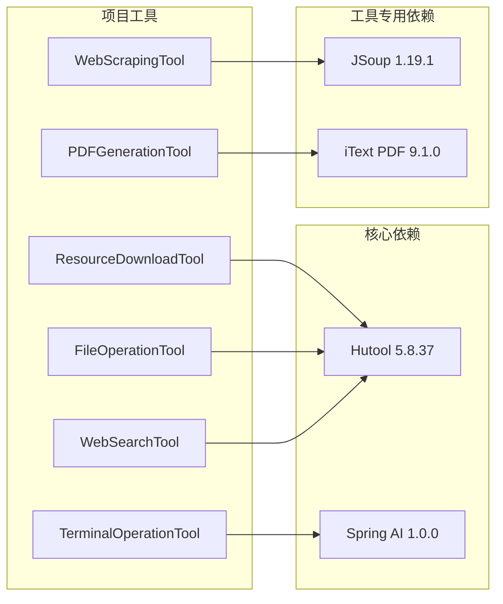
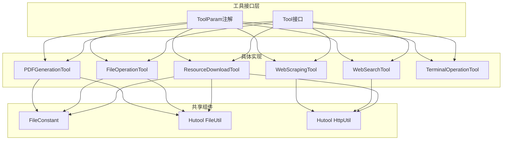
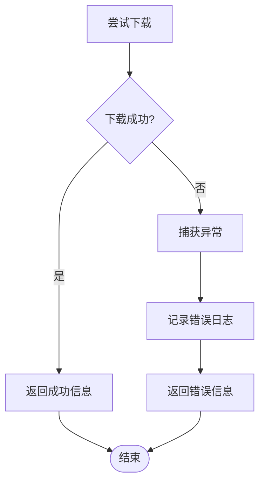

# 资源下载工具

<cite>
**本文档引用的文件**
- [ResourceDownloadTool.java](file://src/main/java/com/yupi/yuaiagent/tools/ResourceDownloadTool.java)
- [ResourceDownloadToolTest.java](file://src/test/java/com/yupi/yuaiagent/tools/ResourceDownloadToolTest.java)
- [FileConstant.java](file://src/main/java/com/yupi/yuaiagent/constant/FileConstant.java)
- [ToolRegistration.java](file://src/main/java/com/yupi/yuaiagent/tools/ToolRegistration.java)
- [FileOperationTool.java](file://src/main/java/com/yupi/yuaiagent/tools/FileOperationTool.java)
- [WebSearchTool.java](file://src/main/java/com/yupi/yuaiagent/tools/WebSearchTool.java)
- [WebScrapingTool.java](file://src/main/java/com/yupi/yuaiagent/tools/WebScrapingTool.java)
- [PDFGenerationTool.java](file://src/main/java/com/yupi/yuaiagent/tools/PDFGenerationTool.java)
- [TerminalOperationTool.java](file://src/main/java/com/yupi/yuaiagent/tools/TerminalOperationTool.java)
- [pom.xml](file://pom.xml)
</cite>

## 目录
1. [简介](#简介)
2. [项目结构](#项目结构)
3. [核心组件](#核心组件)
4. [架构概览](#架构概览)
5. [详细组件分析](#详细组件分析)
6. [依赖分析](#依赖分析)
7. [性能考虑](#性能考虑)
8. [故障排除指南](#故障排除指南)
9. [结论](#结论)

## 简介

资源下载工具是基于Spring AI框架构建的智能代理工具集中的一个核心组件，专门用于从网络资源下载文件。该工具通过集成Hutool库的强大HTTP功能，提供了简单易用的文件下载能力，支持基本的HTTP请求处理、文件传输和基础的错误处理机制。

该工具在AI代理系统中扮演着重要的角色，能够帮助代理程序自动获取外部资源，如图片、文档、数据文件等，为后续的处理和分析提供基础数据支持。

## 项目结构

资源下载工具位于项目的工具模块中，与其它AI工具共同构成了完整的工具生态系统：

**图表来源**
- [ResourceDownloadTool.java:1-31](file://src/main/java/com/yupi/yuaiagent/tools/ResourceDownloadTool.java#L1-L31)
- [ToolRegistration.java:1-38](file://src/main/java/com/yupi/yuaiagent/tools/ToolRegistration.java#L1-L38)
- [FileConstant.java:1-13](file://src/main/java/com/yupi/yuaiagent/constant/FileConstant.java#L1-L13)

**章节来源**
- [ResourceDownloadTool.java:1-31](file://src/main/java/com/yupi/yuaiagent/tools/ResourceDownloadTool.java#L1-L31)
- [ToolRegistration.java:1-38](file://src/main/java/com/yupi/yuaiagent/tools/ToolRegistration.java#L1-L38)
- [FileConstant.java:1-13](file://src/main/java/com/yupi/yuaiagent/constant/FileConstant.java#L1-L13)

## 核心组件

### ResourceDownloadTool 主要特性

ResourceDownloadTool是一个简洁而实用的文件下载工具，具有以下核心特性：

- **简单易用的API设计**：提供两个参数的方法签名，便于AI代理调用
- **自动目录管理**：自动创建必要的下载目录结构
- **基础错误处理**：提供基本的异常捕获和错误信息反馈
- **统一文件路径管理**：通过FileConstant集中管理文件存储位置

### 工具注册机制

所有工具通过ToolRegistration类进行统一管理，确保AI代理能够正确识别和使用各种工具：

**图表来源**
- [ToolRegistration.java:18-36](file://src/main/java/com/yupi/yuaiagent/tools/ToolRegistration.java#L18-L36)
- [ResourceDownloadTool.java:16-29](file://src/main/java/com/yupi/yuaiagent/tools/ResourceDownloadTool.java#L16-L29)

**章节来源**
- [ResourceDownloadTool.java:14-30](file://src/main/java/com/yupi/yuaiagent/tools/ResourceDownloadTool.java#L14-L30)
- [ToolRegistration.java:18-36](file://src/main/java/com/yupi/yuaiagent/tools/ToolRegistration.java#L18-L36)

## 架构概览

资源下载工具在整个AI代理系统中的架构位置如下：

**图表来源**
- [ToolRegistration.java:18-36](file://src/main/java/com/yupi/yuaiagent/tools/ToolRegistration.java#L18-L36)
- [ResourceDownloadTool.java:3-5](file://src/main/java/com/yupi/yuaiagent/tools/ResourceDownloadTool.java#L3-L5)
- [FileConstant.java:6-12](file://src/main/java/com/yupi/yuaiagent/constant/FileConstant.java#L6-L12)

## 详细组件分析

### ResourceDownloadTool 类结构

**图表来源**
- [ResourceDownloadTool.java:14-30](file://src/main/java/com/yupi/yuaiagent/tools/ResourceDownloadTool.java#L14-L30)
- [FileConstant.java:6-12](file://src/main/java/com/yupi/yuaiagent/constant/FileConstant.java#L6-L12)

#### 下载流程分析

ResourceDownloadTool的下载流程相对简单直接：

**图表来源**
- [ResourceDownloadTool.java:17-29](file://src/main/java/com/yupi/yuaiagent/tools/ResourceDownloadTool.java#L17-L29)

#### 核心方法实现

ResourceDownloadTool的核心方法`downloadResource`实现了以下功能：

1. **路径构建**：根据FileConstant中的配置构建下载目录和文件路径
2. **目录创建**：使用FileUtil确保下载目录存在
3. **文件下载**：调用Hutool的HttpUtil.downloadFile方法执行下载
4. **结果返回**：返回下载状态和文件路径信息

**章节来源**
- [ResourceDownloadTool.java:16-29](file://src/main/java/com/yupi/yuaiagent/tools/ResourceDownloadTool.java#L16-L29)

### 文件常量管理

FileConstant接口提供了统一的文件存储路径管理：

**图表来源**
- [FileConstant.java:6-12](file://src/main/java/com/yupi/yuaiagent/constant/FileConstant.java#L6-L12)

**章节来源**
- [FileConstant.java:6-12](file://src/main/java/com/yupi/yuaiagent/constant/FileConstant.java#L6-L12)

### 工具注册机制

ToolRegistration类负责管理所有可用的工具：

**图表来源**
- [ToolRegistration.java:18-36](file://src/main/java/com/yupi/yuaiagent/tools/ToolRegistration.java#L18-L36)

**章节来源**
- [ToolRegistration.java:18-36](file://src/main/java/com/yupi/yuaiagent/tools/ToolRegistration.java#L18-L36)

## 依赖分析

### 外部依赖关系

资源下载工具主要依赖于以下外部库：

**图表来源**
- [pom.xml:144-147](file://pom.xml#L144-L147)
- [pom.xml:122-127](file://pom.xml#L122-L127)
- [pom.xml:128-142](file://pom.xml#L128-L142)

### 内部组件依赖

各工具之间的依赖关系相对独立，主要通过统一的接口进行交互：

**图表来源**
- [ResourceDownloadTool.java:3-7](file://src/main/java/com/yupi/yuaiagent/tools/ResourceDownloadTool.java#L3-L7)
- [FileOperationTool.java:3-6](file://src/main/java/com/yupi/yuaiagent/tools/FileOperationTool.java#L3-L6)
- [WebSearchTool.java:3-7](file://src/main/java/com/yupi/yuaiagent/tools/WebSearchTool.java#L3-L7)
- [WebScrapingTool.java:3-6](file://src/main/java/com/yupi/yuaiagent/tools/WebScrapingTool.java#L3-L6)
- [PDFGenerationTool.java:3-12](file://src/main/java/com/yupi/yuaiagent/tools/PDFGenerationTool.java#L3-L12)

**章节来源**
- [pom.xml:144-147](file://pom.xml#L144-L147)
- [pom.xml:122-142](file://pom.xml#L122-L142)

## 性能考虑

### 当前实现的性能特点

基于现有代码分析，资源下载工具的性能特点如下：

1. **同步阻塞式下载**：使用Hutool的同步下载方法，简单可靠但不支持并发下载
2. **内存使用**：对于大文件下载，可能占用较多内存空间
3. **网络效率**：未实现连接池复用和超时控制等高级网络优化
4. **进度监控缺失**：没有提供下载进度的实时反馈机制

### 潜在优化方向

虽然当前实现相对简单，但可以考虑以下优化方案：

1. **异步下载支持**：实现非阻塞的异步下载机制
2. **断点续传功能**：添加HTTP Range请求支持，实现断点续传
3. **进度回调机制**：提供下载进度的实时通知
4. **重试策略**：实现指数退避的重试机制
5. **并发控制**：限制同时进行的下载任务数量
6. **带宽管理**：实现下载速度限制和带宽控制

## 故障排除指南

### 常见问题及解决方案

#### 1. 下载失败问题

**问题表现**：下载过程中抛出异常，返回错误信息

**可能原因**：
- 网络连接不稳定
- 目标URL不可访问
- 文件权限不足
- 磁盘空间不足

**解决方案**：
- 检查网络连接状态
- 验证URL的有效性
- 确认目标目录的写入权限
- 清理磁盘空间

#### 2. 目录创建失败

**问题表现**：无法创建下载目录

**可能原因**：
- 路径权限不足
- 磁盘空间不足
- 路径包含非法字符

**解决方案**：
- 检查用户权限
- 清理磁盘空间
- 使用合法的文件名

#### 3. 文件下载不完整

**问题表现**：下载的文件大小与预期不符

**可能原因**：
- 网络中断
- 服务器响应异常
- 存储空间不足

**解决方案**：
- 实现断点续传功能
- 添加重试机制
- 监控磁盘空间

### 错误处理机制

ResourceDownloadTool采用简单的异常捕获机制：

**图表来源**
- [ResourceDownloadTool.java:20-28](file://src/main/java/com/yupi/yuaiagent/tools/ResourceDownloadTool.java#L20-L28)

**章节来源**
- [ResourceDownloadTool.java:20-28](file://src/main/java/com/yupi/yuaiagent/tools/ResourceDownloadTool.java#L20-L28)

## 结论

资源下载工具作为AI代理系统的重要组成部分，虽然当前实现相对简单，但已经具备了基本的文件下载能力。其设计体现了以下优点：

1. **简洁性**：API设计简单直观，易于使用
2. **可靠性**：基于成熟的Hutool库，功能稳定
3. **可扩展性**：通过注解驱动的设计，便于添加新功能
4. **统一管理**：通过ToolRegistration实现工具的集中管理

### 发展建议

为了满足更复杂的应用需求，建议在未来版本中：

1. **增强网络功能**：实现断点续传、重试策略和进度监控
2. **提升性能**：支持异步下载和并发控制
3. **完善错误处理**：提供更详细的错误信息和恢复机制
4. **扩展功能**：支持镜像站点选择和负载均衡

该工具为AI代理系统提供了基础的文件下载能力，为进一步的功能扩展奠定了良好的基础。