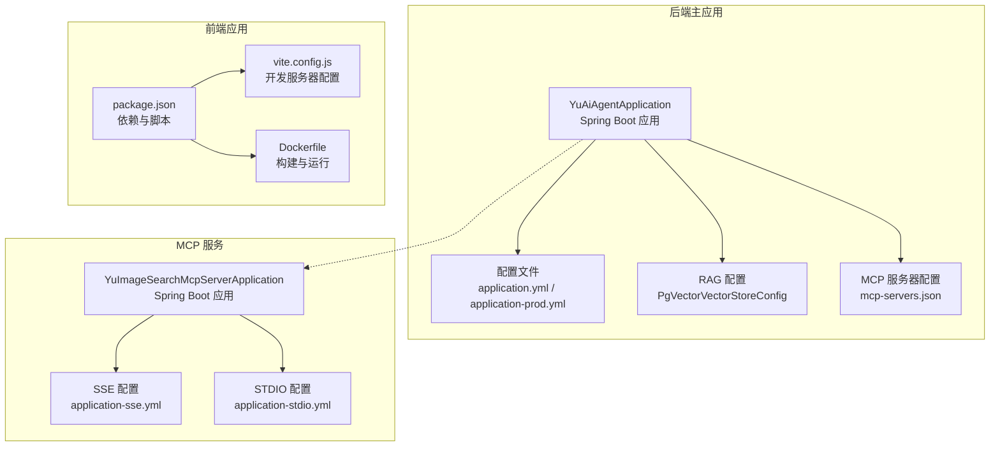
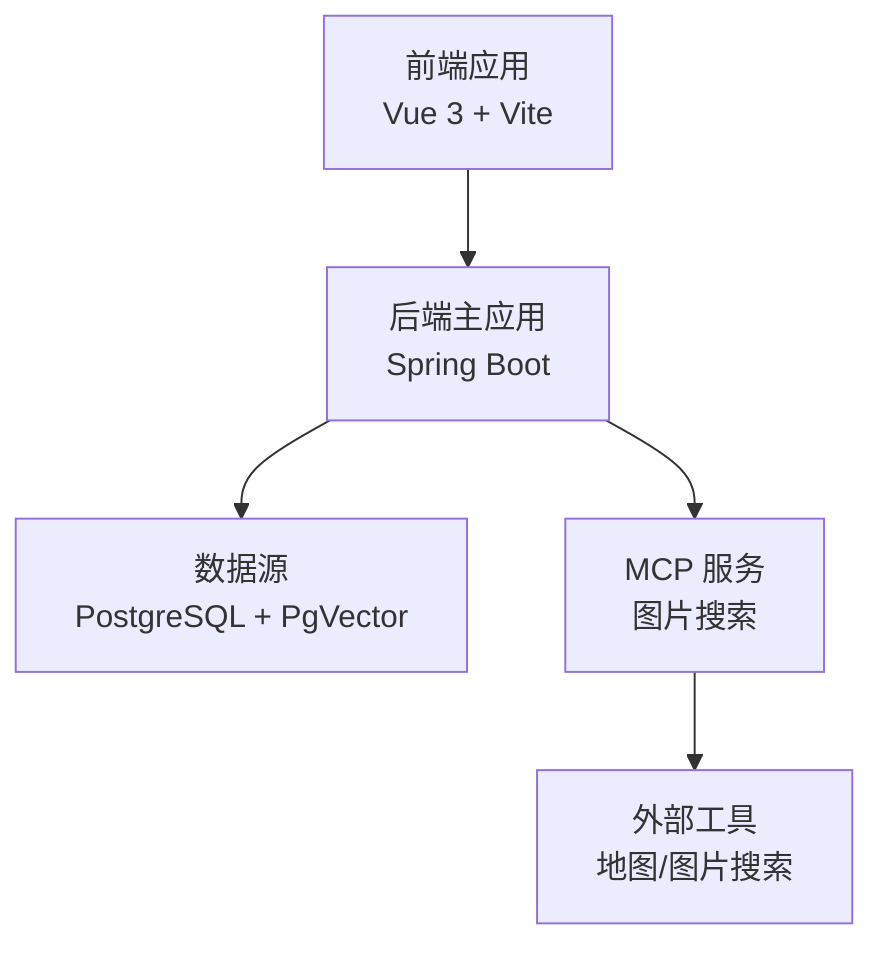
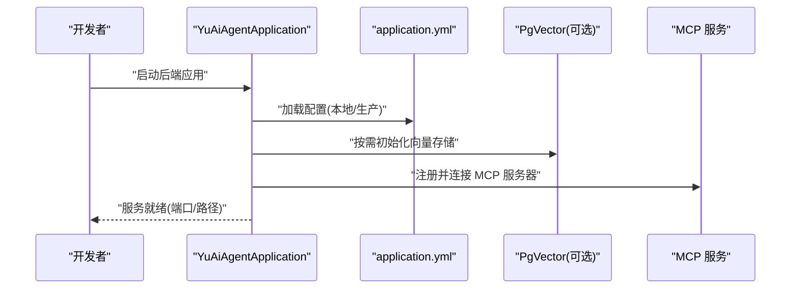
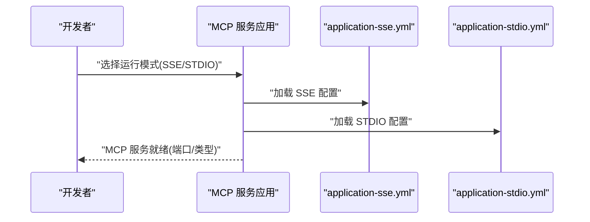
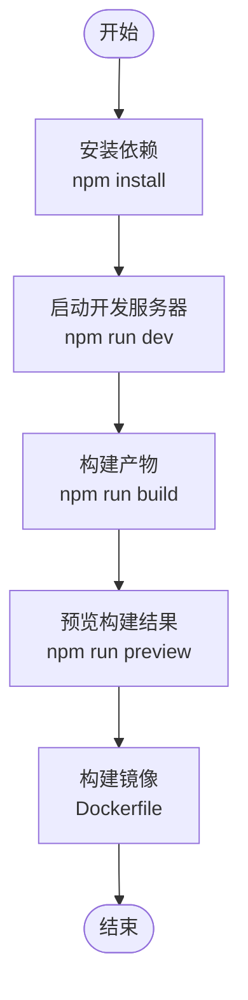
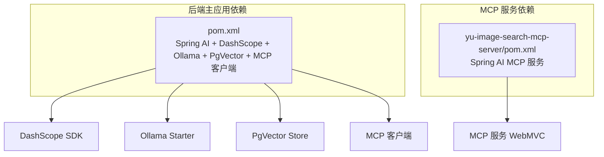

# 快速开始

<cite>
**本文引用的文件**
- [README.md](file://README.md)
- [pom.xml](file://pom.xml)
- [application.yml](file://src/main/resources/application.yml)
- [application-prod.yml](file://src/main/resources/application-prod.yml)
- [YuAiAgentApplication.java](file://src/main/java/com/yupi/yuaiagent/YuAiAgentApplication.java)
- [PgVectorVectorStoreConfig.java](file://src/main/java/com/yupi/yuaiagent/rag/PgVectorVectorStoreConfig.java)
- [mcp-servers.json](file://src/main/resources/mcp-servers.json)
- [yu-image-search-mcp-server/pom.xml](file://yu-image-search-mcp-server/pom.xml)
- [yu-image-search-mcp-server/src/main/resources/application.yml](file://yu-image-search-mcp-server/src/main/resources/application.yml)
- [yu-image-search-mcp-server/src/main/resources/application-sse.yml](file://yu-image-search-mcp-server/src/main/resources/application-sse.yml)
- [yu-image-search-mcp-server/src/main/resources/application-stdio.yml](file://yu-image-search-mcp-server/src/main/resources/application-stdio.yml)
- [yu-image-search-mcp-server/src/main/java/com/yupi/yuimagesearchmcpserver/YuImageSearchMcpServerApplication.java](file://yu-image-search-mcp-server/src/main/java/com/yupi/yuimagesearchmcpserver/YuImageSearchMcpServerApplication.java)
- [package.json](file://yu-ai-agent-frontend/package.json)
- [vite.config.js](file://yu-ai-agent-frontend/vite.config.js)
- [Dockerfile](file://yu-ai-agent-frontend/Dockerfile)
</cite>

## 目录
1. [简介](#简介)
2. [项目结构](#项目结构)
3. [核心组件](#核心组件)
4. [架构概览](#架构概览)
5. [详细组件分析](#详细组件分析)
6. [依赖分析](#依赖分析)
7. [性能考虑](#性能考虑)
8. [故障排除指南](#故障排除指南)
9. [结论](#结论)
10. [附录](#附录)

## 简介
本指南面向首次接触 AI 超级智能体项目的开发者，帮助你在最短时间内完成环境准备、项目搭建与本地运行。项目采用 Java 21 + Spring Boot 3 技术栈，结合 Spring AI、LangChain4j、PgVector 向量数据库、MCP 协议与 Vue 前端，提供从后端服务、MCP 服务到前端应用的完整启动流程与验证方法。

## 项目结构
项目由三个主要部分组成：
- 后端主应用：提供 AI 对话、RAG、工具调用与 MCP 客户端集成
- MCP 服务：独立的图片搜索 MCP 服务器，支持 SSE 与 STDIO 两种接入方式
- 前端应用：Vue 3 + Vite，提供聊天界面与交互入口

图表来源
- [YuAiAgentApplication.java:1-18](file://src/main/java/com/yupi/yuaiagent/YuAiAgentApplication.java#L1-L18)
- [application.yml:1-66](file://src/main/resources/application.yml#L1-L66)
- [PgVectorVectorStoreConfig.java:1-40](file://src/main/java/com/yupi/yuaiagent/rag/PgVectorVectorStoreConfig.java#L1-L40)
- [mcp-servers.json:1-25](file://src/main/resources/mcp-servers.json#L1-L25)
- [YuImageSearchMcpServerApplication.java:1-25](file://yu-image-search-mcp-server/src/main/java/com/yupi/yuimagesearchmcpserver/YuImageSearchMcpServerApplication.java#L1-L25)
- [yu-image-search-mcp-server/src/main/resources/application-sse.yml:1-10](file://yu-image-search-mcp-server/src/main/resources/application-sse.yml#L1-L10)
- [yu-image-search-mcp-server/src/main/resources/application-stdio.yml:1-13](file://yu-image-search-mcp-server/src/main/resources/application-stdio.yml#L1-L13)
- [package.json:1-22](file://yu-ai-agent-frontend/package.json#L1-L22)
- [vite.config.js:1-18](file://yu-ai-agent-frontend/vite.config.js#L1-L18)
- [Dockerfile:1-17](file://yu-ai-agent-frontend/Dockerfile#L1-L17)

章节来源
- [README.md:1-299](file://README.md#L1-L299)
- [pom.xml:1-227](file://pom.xml#L1-L227)
- [yu-image-search-mcp-server/pom.xml:1-121](file://yu-image-search-mcp-server/pom.xml#L1-L121)

## 核心组件
- 后端主应用：Spring Boot 应用，支持多模型接入（阿里百炼 DashScope、Ollama）、RAG 向量检索、工具调用与 MCP 客户端集成
- MCP 服务：图片搜索 MCP 服务器，支持 SSE 与 STDIO 两种运行模式
- 前端应用：Vue 3 + Vite，提供聊天界面与交互入口，支持 Docker 部署

章节来源
- [YuAiAgentApplication.java:1-18](file://src/main/java/com/yupi/yuaiagent/YuAiAgentApplication.java#L1-L18)
- [pom.xml:50-164](file://pom.xml#L50-L164)
- [yu-image-search-mcp-server/pom.xml:43-66](file://yu-image-search-mcp-server/pom.xml#L43-L66)
- [package.json:1-22](file://yu-ai-agent-frontend/package.json#L1-L22)

## 架构概览
系统采用“后端主应用 + MCP 服务 + 前端应用”的分层架构。后端负责 AI 对话、RAG 检索与工具调用；MCP 服务提供外部工具能力；前端提供用户交互界面。

图表来源
- [application.yml:1-66](file://src/main/resources/application.yml#L1-L66)
- [mcp-servers.json:1-25](file://src/main/resources/mcp-servers.json#L1-L25)
- [yu-image-search-mcp-server/src/main/resources/application.yml:1-7](file://yu-image-search-mcp-server/src/main/resources/application.yml#L1-L7)

## 详细组件分析

### 后端主应用启动流程
后端应用通过 Spring Boot 启动，支持本地与生产环境配置分离。默认关闭数据源自动配置，便于开发阶段按需启用 PgVector。

图表来源
- [YuAiAgentApplication.java:7-10](file://src/main/java/com/yupi/yuaiagent/YuAiAgentApplication.java#L7-L10)
- [application.yml:1-66](file://src/main/resources/application.yml#L1-L66)
- [PgVectorVectorStoreConfig.java:17-40](file://src/main/java/com/yupi/yuaiagent/rag/PgVectorVectorStoreConfig.java#L17-L40)
- [mcp-servers.json:1-25](file://src/main/resources/mcp-servers.json#L1-L25)

章节来源
- [YuAiAgentApplication.java:1-18](file://src/main/java/com/yupi/yuaiagent/YuAiAgentApplication.java#L1-L18)
- [application.yml:1-66](file://src/main/resources/application.yml#L1-L66)

### MCP 服务启动流程
MCP 服务支持 SSE 与 STDIO 两种运行模式，可通过配置文件切换。STDIO 模式下以非 Web 应用方式运行，便于被后端通过命令行启动。

图表来源
- [YuImageSearchMcpServerApplication.java:1-25](file://yu-image-search-mcp-server/src/main/java/com/yupi/yuimagesearchmcpserver/YuImageSearchMcpServerApplication.java#L1-L25)
- [yu-image-search-mcp-server/src/main/resources/application-sse.yml:1-10](file://yu-image-search-mcp-server/src/main/resources/application-sse.yml#L1-L10)
- [yu-image-search-mcp-server/src/main/resources/application-stdio.yml:1-13](file://yu-image-search-mcp-server/src/main/resources/application-stdio.yml#L1-L13)

章节来源
- [yu-image-search-mcp-server/src/main/resources/application.yml:1-7](file://yu-image-search-mcp-server/src/main/resources/application.yml#L1-L7)
- [yu-image-search-mcp-server/src/main/resources/application-sse.yml:1-10](file://yu-image-search-mcp-server/src/main/resources/application-sse.yml#L1-L10)
- [yu-image-search-mcp-server/src/main/resources/application-stdio.yml:1-13](file://yu-image-search-mcp-server/src/main/resources/application-stdio.yml#L1-L13)

### 前端应用启动流程
前端应用基于 Vite 开发，提供本地开发服务器与构建打包能力。支持 Docker 构建与 Nginx 部署。

图表来源
- [package.json:6-10](file://yu-ai-agent-frontend/package.json#L6-L10)
- [vite.config.js:13-16](file://yu-ai-agent-frontend/vite.config.js#L13-L16)
- [Dockerfile:1-17](file://yu-ai-agent-frontend/Dockerfile#L1-L17)

章节来源
- [package.json:1-22](file://yu-ai-agent-frontend/package.json#L1-L22)
- [vite.config.js:1-18](file://yu-ai-agent-frontend/vite.config.js#L1-L18)
- [Dockerfile:1-17](file://yu-ai-agent-frontend/Dockerfile#L1-L17)

## 依赖分析
后端主应用与 MCP 服务均基于 Spring Boot 3 与 Java 21，关键依赖包括：
- Spring AI 生态：DashScope、Ollama、MCP 客户端、向量存储
- 数据库与向量库：PostgreSQL + PgVector
- 工具与库：Kryo、Jsoup、iText PDF、Knife4j

图表来源
- [pom.xml:50-164](file://pom.xml#L50-L164)
- [yu-image-search-mcp-server/pom.xml:43-66](file://yu-image-search-mcp-server/pom.xml#L43-L66)

章节来源
- [pom.xml:1-227](file://pom.xml#L1-L227)
- [yu-image-search-mcp-server/pom.xml:1-121](file://yu-image-search-mcp-server/pom.xml#L1-L121)

## 性能考虑
- 向量检索性能：合理设置 PgVector 索引类型与距离度量，批量导入文档时控制批次大小
- 模型调用延迟：优先使用本地 Ollama 或云端 DashScope，注意并发与超时配置
- 前端构建优化：生产构建开启压缩与缓存策略，Docker 镜像层优化

## 故障排除指南
- 数据库未启用导致向量存储不可用
  - 现象：向量检索失败或无数据
  - 处理：启用数据源自动配置或手动初始化 PgVector
  - 参考：[application.yml:6-37](file://src/main/resources/application.yml#L6-L37)、[PgVectorVectorStoreConfig.java:17-40](file://src/main/java/com/yupi/yuaiagent/rag/PgVectorVectorStoreConfig.java#L17-L40)
- API 密钥未配置
  - 现象：DashScope 或外部服务调用失败
  - 处理：在配置文件中填入有效 API Key
  - 参考：[application.yml:12-14](file://src/main/resources/application.yml#L12-L14)、[application.yml:60-62](file://src/main/resources/application.yml#L60-L62)
- MCP 服务未启动或连接失败
  - 现象：工具调用异常或 MCP 无法发现
  - 处理：确认 MCP 服务端口与运行模式，检查 mcp-servers.json 中的命令与参数
  - 参考：[mcp-servers.json:1-25](file://src/main/resources/mcp-servers.json#L1-L25)、[yu-image-search-mcp-server/src/main/resources/application.yml:1-7](file://yu-image-search-mcp-server/src/main/resources/application.yml#L1-L7)
- 前端跨域或端口冲突
  - 现象：浏览器无法访问或开发服务器启动失败
  - 处理：调整 Vite 服务器端口与 CORS 配置
  - 参考：[vite.config.js:13-16](file://yu-ai-agent-frontend/vite.config.js#L13-L16)

章节来源
- [application.yml:1-66](file://src/main/resources/application.yml#L1-L66)
- [PgVectorVectorStoreConfig.java:17-40](file://src/main/java/com/yupi/yuaiagent/rag/PgVectorVectorStoreConfig.java#L17-L40)
- [mcp-servers.json:1-25](file://src/main/resources/mcp-servers.json#L1-L25)
- [yu-image-search-mcp-server/src/main/resources/application.yml:1-7](file://yu-image-search-mcp-server/src/main/resources/application.yml#L1-L7)
- [vite.config.js:13-16](file://yu-ai-agent-frontend/vite.config.js#L13-L16)

## 结论
通过本快速开始指南，你可以完成环境准备、项目搭建与本地运行。建议先完成数据库与模型配置，再逐步启用向量存储与 MCP 服务，最后启动前端应用进行功能验证。遇到问题时，优先检查配置文件中的密钥与端口，以及各模块的启动顺序与依赖版本。

## 附录

### 环境准备清单
- Java 21：用于编译与运行 Spring Boot 应用
- Node.js 20：用于前端开发与构建
- PostgreSQL：关系型数据库，配合 PgVector 使用
- PgVector：向量数据库扩展，用于 RAG 检索
- 可选：Ollama 本地模型服务

章节来源
- [pom.xml:29-31](file://pom.xml#L29-L31)
- [yu-image-search-mcp-server/pom.xml:29-31](file://yu-image-search-mcp-server/pom.xml#L29-L31)
- [README.md:101-118](file://README.md#L101-L118)

### 本地开发启动顺序
1. 启动数据库与 PgVector
2. 启动后端主应用
3. 启动 MCP 服务（SSE/STDIO）
4. 启动前端应用
5. 访问前端页面进行功能验证

章节来源
- [application.yml:38-41](file://src/main/resources/application.yml#L38-L41)
- [vite.config.js:13-16](file://yu-ai-agent-frontend/vite.config.js#L13-L16)
- [yu-image-search-mcp-server/src/main/resources/application.yml:6-7](file://yu-image-search-mcp-server/src/main/resources/application.yml#L6-L7)

### 验证安装成功的方法
- 后端健康检查：访问后端健康端点
- Swagger/OpenAPI：访问接口文档路径
- 前端页面：确认聊天界面正常加载
- 向量检索：在启用 PgVector 的情况下，验证 RAG 检索是否返回结果

章节来源
- [application.yml:42-59](file://src/main/resources/application.yml#L42-L59)
- [package.json:6-10](file://yu-ai-agent-frontend/package.json#L6-L10)