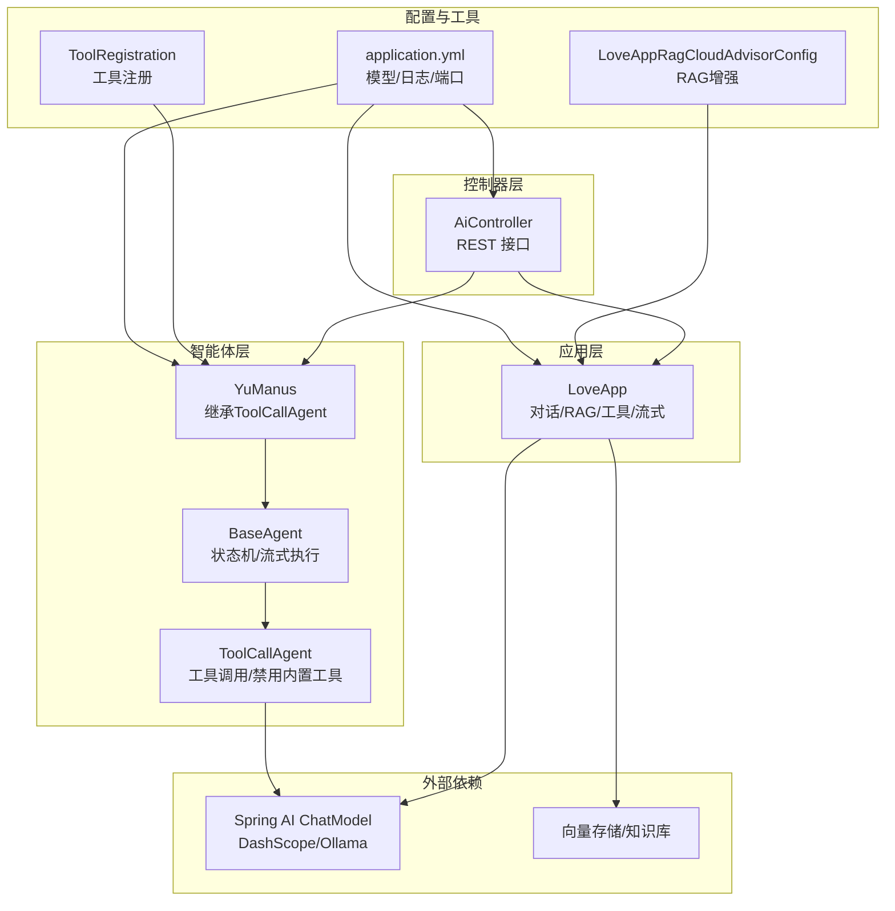
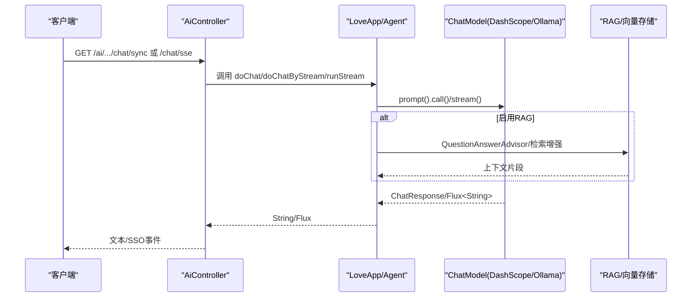
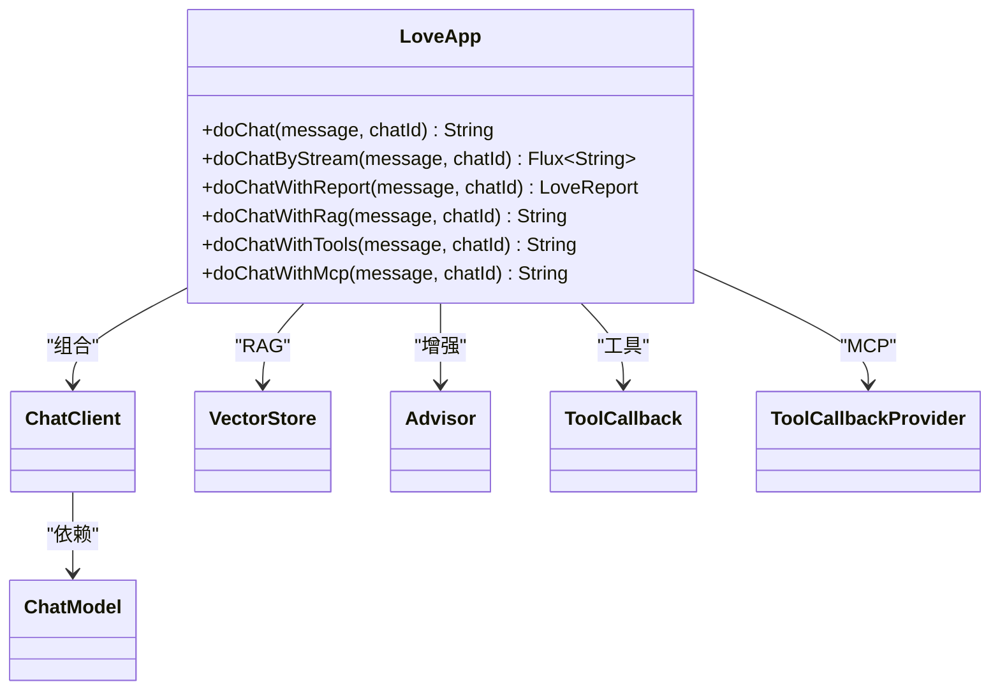
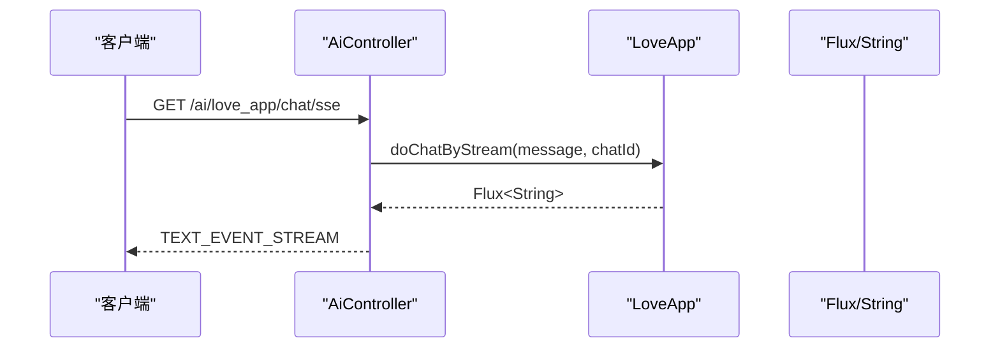
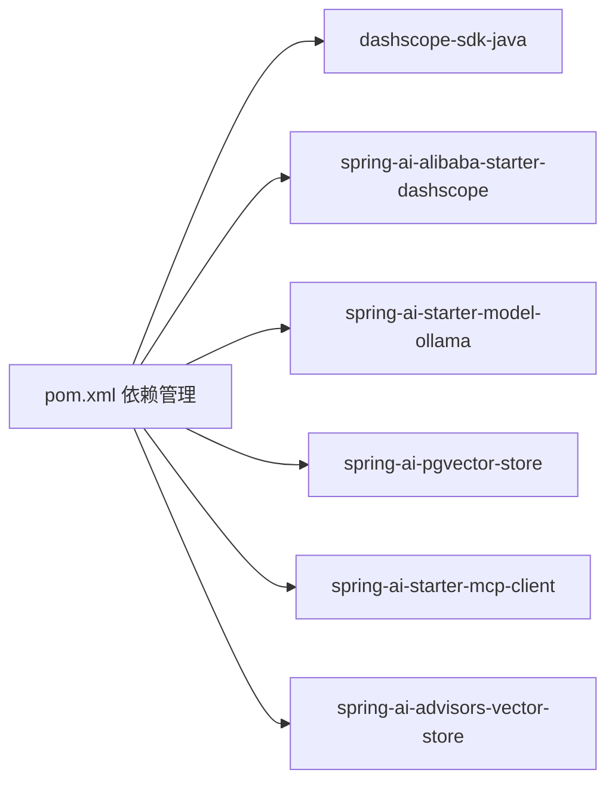

# AI模型性能优化

<cite>
**本文引用的文件**
- [LoveApp.java](file://src/main/java/com/yupi/yuaiagent/app/LoveApp.java)
- [YuManus.java](file://src/main/java/com/yupi/yuaiagent/agent/YuManus.java)
- [AiController.java](file://src/main/java/com/yupi/yuaiagent/controller/AiController.java)
- [BaseAgent.java](file://src/main/java/com/yupi/yuaiagent/agent/BaseAgent.java)
- [ToolCallAgent.java](file://src/main/java/com/yupi/yuaiagent/agent/ToolCallAgent.java)
- [ToolRegistration.java](file://src/main/java/com/yupi/yuaiagent/tools/ToolRegistration.java)
- [application.yml](file://src/main/resources/application.yml)
- [application-prod.yml](file://src/main/resources/application-prod.yml)
- [LoveAppRagCloudAdvisorConfig.java](file://src/main/java/com/yupi/yuaiagent/rag/LoveAppRagCloudAdvisorConfig.java)
- [pom.xml](file://pom.xml)
- [Dockerfile](file://Dockerfile)
- [LoveAppTest.java](file://src/test/java/com/yupi/yuaiagent/app/LoveAppTest.java)
- [YuManusTest.java](file://src/test/java/com/yupi/yuaiagent/agent/YuManusTest.java)
</cite>

## 目录
1. [引言](#引言)
2. [项目结构](#项目结构)
3. [核心组件](#核心组件)
4. [架构总览](#架构总览)
5. [详细组件分析](#详细组件分析)
6. [依赖分析](#依赖分析)
7. [性能考量](#性能考量)
8. [故障排查指南](#故障排查指南)
9. [结论](#结论)
10. [附录](#附录)

## 引言
本指南聚焦于LoveApp与YuManus两大AI调用路径在性能方面的瓶颈识别与优化策略，涵盖并发请求处理（线程池、请求队列、超时控制）、模型响应时间优化（预加载、缓存、批处理）、流式响应优化（背压、内存与网络传输）、模型选择与配置最佳实践（参数调优、硬件加速、负载均衡），以及可落地的性能监控与基准测试步骤。目标是帮助开发者在Spring Boot + Spring AI生态下，构建高吞吐、低延迟、稳定的AI服务。

## 项目结构
该项目采用Spring Boot工程，核心模块如下：
- 应用层：LoveApp负责对话、RAG、工具链路与流式输出
- 智能体层：BaseAgent/ToolCallAgent/YuManus实现多步推理与工具调用
- 控制器层：AiController暴露同步与SSE两类接口
- 配置层：application.yml集中管理模型与日志等配置
- 工具层：ToolRegistration统一注册可用工具
- RAG层：LoveAppRagCloudAdvisorConfig提供云端知识库检索增强
- 构建与容器：pom.xml与Dockerfile支撑依赖与打包部署



图表来源
- [AiController.java:1-106](file://src/main/java/com/yupi/yuaiagent/controller/AiController.java#L1-L106)
- [LoveApp.java:1-227](file://src/main/java/com/yupi/yuaiagent/app/LoveApp.java#L1-L227)
- [BaseAgent.java:1-193](file://src/main/java/com/yupi/yuaiagent/agent/BaseAgent.java#L1-L193)
- [ToolCallAgent.java:1-136](file://src/main/java/com/yupi/yuaiagent/agent/ToolCallAgent.java#L1-L136)
- [YuManus.java:1-38](file://src/main/java/com/yupi/yuaiagent/agent/YuManus.java#L1-L38)
- [ToolRegistration.java:1-38](file://src/main/java/com/yupi/yuaiagent/tools/ToolRegistration.java#L1-L38)
- [LoveAppRagCloudAdvisorConfig.java:1-39](file://src/main/java/com/yupi/yuaiagent/rag/LoveAppRagCloudAdvisorConfig.java#L1-L39)
- [application.yml:1-66](file://src/main/resources/application.yml#L1-L66)

章节来源
- [AiController.java:1-106](file://src/main/java/com/yupi/yuaiagent/controller/AiController.java#L1-L106)
- [LoveApp.java:1-227](file://src/main/java/com/yupi/yuaiagent/app/LoveApp.java#L1-L227)
- [application.yml:1-66](file://src/main/resources/application.yml#L1-L66)

## 核心组件
- LoveApp：封装ChatClient，提供同步对话、SSE流式输出、结构化报告、RAG问答、工具调用、MCP集成等能力。其流式输出基于响应式Flux，便于背压与网络传输优化。
- YuManus：基于ToolCallAgent的超级智能体，具备多步推理与工具编排能力，通过SSE异步输出中间结果。
- BaseAgent：抽象代理基类，内置状态机与SSE流式执行框架，支持超时与完成回调，便于统一管理并发与生命周期。
- ToolCallAgent：禁用Spring AI内置工具执行，改为自管工具调用与消息上下文，提升可控性与性能。
- AiController：暴露同步与SSE两类接口，SSE路径支持Flux与SseEmitter两种实现，便于对比与选型。
- ToolRegistration：集中注册所有可用工具，便于扩展与复用。
- RAG增强：通过DashScope云端知识库或PgVector向量存储提供检索增强，降低LLM幻觉与提升准确性。

章节来源
- [LoveApp.java:1-227](file://src/main/java/com/yupi/yuaiagent/app/LoveApp.java#L1-L227)
- [YuManus.java:1-38](file://src/main/java/com/yupi/yuaiagent/agent/YuManus.java#L1-L38)
- [BaseAgent.java:1-193](file://src/main/java/com/yupi/yuaiagent/agent/BaseAgent.java#L1-L193)
- [ToolCallAgent.java:1-136](file://src/main/java/com/yupi/yuaiagent/agent/ToolCallAgent.java#L1-L136)
- [AiController.java:1-106](file://src/main/java/com/yupi/yuaiagent/controller/AiController.java#L1-L106)
- [ToolRegistration.java:1-38](file://src/main/java/com/yupi/yuaiagent/tools/ToolRegistration.java#L1-L38)
- [LoveAppRagCloudAdvisorConfig.java:1-39](file://src/main/java/com/yupi/yuaiagent/rag/LoveAppRagCloudAdvisorConfig.java#L1-L39)

## 架构总览
系统采用“控制器-应用/智能体-模型”分层设计，控制器负责接入与协议适配（同步/SSO），应用/智能体负责业务编排与工具调用，模型层通过Spring AI ChatModel对接DashScope或Ollama等后端。



图表来源
- [AiController.java:1-106](file://src/main/java/com/yupi/yuaiagent/controller/AiController.java#L1-L106)
- [LoveApp.java:1-227](file://src/main/java/com/yupi/yuaiagent/app/LoveApp.java#L1-L227)
- [BaseAgent.java:1-193](file://src/main/java/com/yupi/yuaiagent/agent/BaseAgent.java#L1-L193)
- [ToolCallAgent.java:1-136](file://src/main/java/com/yupi/yuaiagent/agent/ToolCallAgent.java#L1-L136)
- [application.yml:1-66](file://src/main/resources/application.yml#L1-L66)

## 详细组件分析

### LoveApp 组件分析
- 对话与记忆：使用MessageWindowChatMemory与默认Advisor组合，支持多轮对话记忆与日志增强。
- 同步对话：通过ChatClient.prompt().call()获取完整响应，适合短文本、低延迟场景。
- 流式对话：通过prompt().stream()返回Flux<String>，前端可逐步渲染，降低首字节延迟。
- 结构化输出：通过entity(Class)解析结构化结果，适合报告类输出。
- RAG增强：支持QuestionAnswerAdvisor、云端DashScope检索、自定义增强器工厂等。
- 工具与MCP：支持工具回调数组与ToolCallbackProvider，便于扩展外部能力。



图表来源
- [LoveApp.java:1-227](file://src/main/java/com/yupi/yuaiagent/app/LoveApp.java#L1-L227)

章节来源
- [LoveApp.java:1-227](file://src/main/java/com/yupi/yuaiagent/app/LoveApp.java#L1-L227)

### YuManus 与 BaseAgent/ToolCallAgent 组件分析
- YuManus继承ToolCallAgent，设置系统提示、下一步提示、最大步数，并注入ChatClient与MyLoggerAdvisor。
- BaseAgent提供run与runStream双模式，内部使用状态机与SseEmitter异步执行，支持超时与完成回调，便于长流程的可观测性与稳定性。
- ToolCallAgent禁用Spring AI内置工具执行，改为自管工具调用与消息上下文，减少不必要的上下文污染与重复计算。

```mermaid
classDiagram
class BaseAgent {
+run(userPrompt) String
+runStream(userPrompt) SseEmitter
+step() String
-cleanup() void
}
class ToolCallAgent {
+think() boolean
+act() String
}
class YuManus
class ChatClient
class ToolCallback[]
class ToolCallbackProvider
BaseAgent <|-- ToolCallAgent
ToolCallAgent <|-- YuManus
YuManus --> ChatClient : "注入"
YuManus --> ToolCallback[] : "工具"
YuManus --> ToolCallbackProvider : "MCP"
```

图表来源
- [BaseAgent.java:1-193](file://src/main/java/com/yupi/yuaiagent/agent/BaseAgent.java#L1-L193)
- [ToolCallAgent.java:1-136](file://src/main/java/com/yupi/yuaiagent/agent/ToolCallAgent.java#L1-L136)
- [YuManus.java:1-38](file://src/main/java/com/yupi/yuaiagent/agent/YuManus.java#L1-L38)

章节来源
- [YuManus.java:1-38](file://src/main/java/com/yupi/yuaiagent/agent/YuManus.java#L1-L38)
- [BaseAgent.java:1-193](file://src/main/java/com/yupi/yuaiagent/agent/BaseAgent.java#L1-L193)
- [ToolCallAgent.java:1-136](file://src/main/java/com/yupi/yuaiagent/agent/ToolCallAgent.java#L1-L136)

### AiController 组件分析
- 同步接口：/ai/love_app/chat/sync返回完整字符串，适合简单场景。
- SSE接口：提供Flux与ServerSentEvent两种形式，便于前端渐进式渲染。
- SseEmitter接口：/ai/love_app/chat/sse_emitter使用长连接推送，适合复杂交互与断点续传。



图表来源
- [AiController.java:1-106](file://src/main/java/com/yupi/yuaiagent/controller/AiController.java#L1-L106)
- [LoveApp.java:1-227](file://src/main/java/com/yupi/yuaiagent/app/LoveApp.java#L1-L227)

章节来源
- [AiController.java:1-106](file://src/main/java/com/yupi/yuaiagent/controller/AiController.java#L1-L106)

### RAG 增强与工具链路
- RAG增强：通过DashScope云端知识库或PgVector向量存储提供检索增强，显著降低无关上下文对LLM的影响，提高准确率与响应速度。
- 工具链路：ToolRegistration集中注册工具，ToolCallAgent禁用内置工具执行，自管工具调用与消息上下文，减少重复计算与上下文膨胀。

章节来源
- [LoveAppRagCloudAdvisorConfig.java:1-39](file://src/main/java/com/yupi/yuaiagent/rag/LoveAppRagCloudAdvisorConfig.java#L1-L39)
- [ToolRegistration.java:1-38](file://src/main/java/com/yupi/yuaiagent/tools/ToolRegistration.java#L1-L38)
- [ToolCallAgent.java:1-136](file://src/main/java/com/yupi/yuaiagent/agent/ToolCallAgent.java#L1-L136)

## 依赖分析
- Spring Boot 3.4.4 + Java 21
- Spring AI Alibaba（DashScope）、Ollama、PGVector、MCP客户端等
- 通过BOM统一管理版本，确保兼容性



图表来源
- [pom.xml:1-227](file://pom.xml#L1-L227)

章节来源
- [pom.xml:1-227](file://pom.xml#L1-L227)

## 性能考量

### 并发请求处理
- 线程池与异步执行
  - BaseAgent.runStream使用CompletableFuture.runAsync异步执行，避免阻塞Web容器线程，适合长流程与工具调用。
  - AiController中SseEmitter默认超时时间较长（毫秒级），适合流式长连接场景。
- 请求队列与背压
  - LoveApp的流式输出返回Flux，由Spring WebFlux处理背压；前端可逐段消费，避免一次性缓冲大量数据。
- 超时控制
  - SseEmitter与BaseAgent均提供onTimeout/onCompletion回调，便于资源回收与状态恢复。
- 建议
  - 在高并发场景下，建议结合限流与熔断（如Resilience4j）防止下游抖动。
  - 对工具调用密集的场景，考虑将工具执行拆分为独立线程池，避免阻塞LLM推理线程。

章节来源
- [BaseAgent.java:100-177](file://src/main/java/com/yupi/yuaiagent/agent/BaseAgent.java#L100-L177)
- [AiController.java:77-92](file://src/main/java/com/yupi/yuaiagent/controller/AiController.java#L77-L92)

### 模型响应时间优化
- 预加载与连接池
  - ChatModel初始化时可配置连接池与超时参数，减少首次调用开销。
  - DashScope/Ollama后端可通过连接复用与keep-alive降低握手成本。
- 缓存机制
  - 对高频查询与固定模板，可引入应用层缓存（如Caffeine/Redis）以减少重复推理。
  - 对工具调用结果与检索片段，可缓存热点数据，缩短后续响应时间。
- 批处理技术
  - 将多个相似请求合并为批量请求（若后端支持），提升吞吐。
  - 对工具调用，尽量合并多次调用为一次LLM推理，减少往返次数。
- 参数调优
  - 调整温度、最大生成长度、top_p等参数，在准确率与延迟间权衡。
  - 对RAG场景，合理设置检索窗口与上下文截断策略。

章节来源
- [application.yml:11-21](file://src/main/resources/application.yml#L11-L21)
- [ToolCallAgent.java:48-52](file://src/main/java/com/yupi/yuaiagent/agent/ToolCallAgent.java#L48-L52)

### 流式响应优化
- 背压处理
  - 使用Flux逐块推送，前端按需消费，避免内存峰值。
  - 对慢消费者，可设置背压策略（如DROP/LATEST）保障系统稳定。
- 内存管理
  - BaseAgent.runStream在finally中清理资源，避免长时间运行导致内存泄漏。
  - 对工具调用产生的中间结果，及时释放引用，避免累积。
- 网络传输优化
  - SSE/TEXT_EVENT_STREAM适合长连接与断点续传；对弱网环境建议增加重试与心跳。
  - 控制每块大小与频率，平衡实时性与带宽占用。

章节来源
- [AiController.java:50-92](file://src/main/java/com/yupi/yuaiagent/controller/AiController.java#L50-L92)
- [BaseAgent.java:156-176](file://src/main/java/com/yupi/yuaiagent/agent/BaseAgent.java#L156-L176)

### 模型选择与配置最佳实践
- 模型选择
  - DashScope：适合中文场景与结构化输出；Ollama：本地部署，适合隐私与低延迟需求。
- 硬件加速
  - GPU/CPU资源充足时，优先选择更大参数规模的模型；对流式场景，适当降低生成长度。
- 负载均衡
  - 多实例部署时，结合Nginx/Ingress进行会话亲和或无状态分发，避免跨实例状态丢失。
- 配置要点
  - application.yml中统一管理模型与日志级别，便于灰度与回滚。

章节来源
- [application.yml:11-21](file://src/main/resources/application.yml#L11-L21)
- [Dockerfile:1-16](file://Dockerfile#L1-L16)

### 性能监控与调优步骤
- 指标采集
  - 请求QPS、P95/P99延迟、错误率、流式首字节时间、工具调用耗时、RAG命中率。
- 日志与追踪
  - 开启DEBUG级别日志，定位慢点；结合分布式追踪（如Zipkin/SkyWalking）观测端到端耗时。
- 压力测试
  - 使用JMeter/K6等工具模拟并发场景，逐步加压至瓶颈点，记录关键指标。
- 基准测试
  - 固定输入与环境，对比不同模型、参数与缓存策略下的性能差异。
- 优化闭环
  - 基于指标与日志，迭代调整线程池、缓存、批处理与参数，形成持续优化闭环。

章节来源
- [application.yml:64-66](file://src/main/resources/application.yml#L64-L66)
- [LoveAppTest.java:1-88](file://src/test/java/com/yupi/yuaiagent/app/LoveAppTest.java#L1-L88)
- [YuManusTest.java:1-23](file://src/test/java/com/yupi/yuaiagent/agent/YuManusTest.java#L1-L23)

## 故障排查指南
- SSE连接异常
  - 检查SseEmitter超时设置与onTimeout回调，确认资源清理逻辑。
- 工具调用失败
  - 查看ToolCallAgent的异常分支与消息上下文记录，定位工具参数或权限问题。
- RAG检索异常
  - 核对DashScope知识库索引与权限，检查检索窗口与上下文截断策略。
- 性能退化
  - 关注日志级别与工具链路开销，评估缓存命中率与批处理收益。

章节来源
- [BaseAgent.java:163-176](file://src/main/java/com/yupi/yuaiagent/agent/BaseAgent.java#L163-L176)
- [ToolCallAgent.java:99-103](file://src/main/java/com/yupi/yuaiagent/agent/ToolCallAgent.java#L99-L103)
- [LoveAppRagCloudAdvisorConfig.java:24-37](file://src/main/java/com/yupi/yuaiagent/rag/LoveAppRagCloudAdvisorConfig.java#L24-L37)

## 结论
通过明确的分层设计与响应式流式输出，系统在保证交互体验的同时具备良好的扩展性。结合线程池异步、缓存与批处理、合理的超时与背压策略，可在高并发场景下获得稳定且低延迟的AI服务表现。建议以监控与基准测试为抓手，持续迭代优化。

## 附录
- 部署建议
  - 使用Dockerfile进行一致化打包与运行，结合生产配置文件覆盖敏感项。
- 配置参考
  - application.yml中模型参数、日志级别与端口等关键配置项。

章节来源
- [Dockerfile:1-16](file://Dockerfile#L1-L16)
- [application.yml:1-66](file://src/main/resources/application.yml#L1-L66)