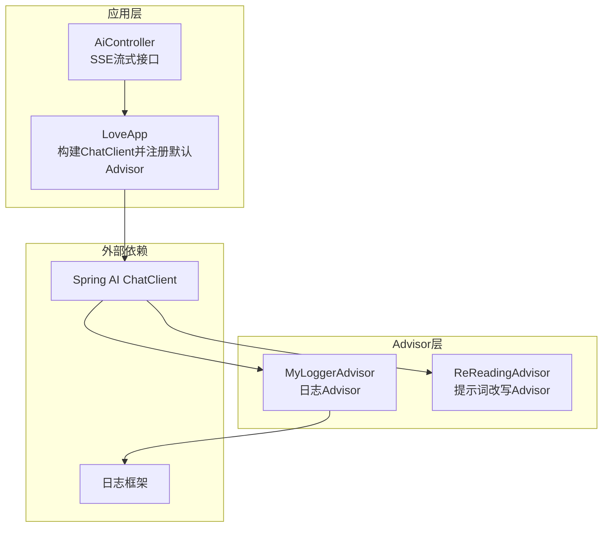
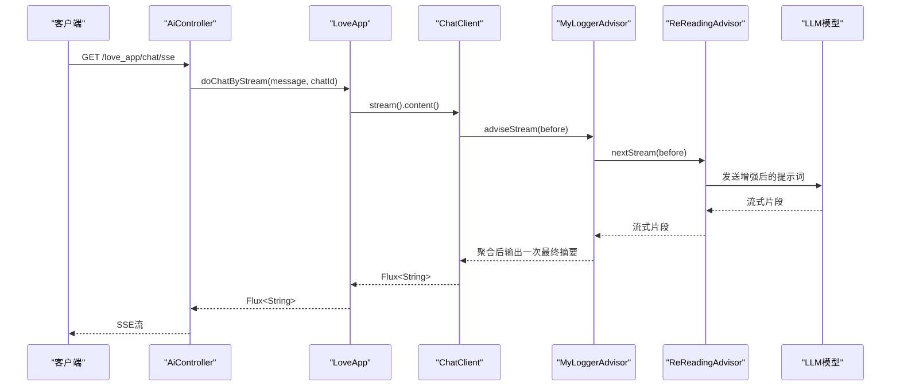
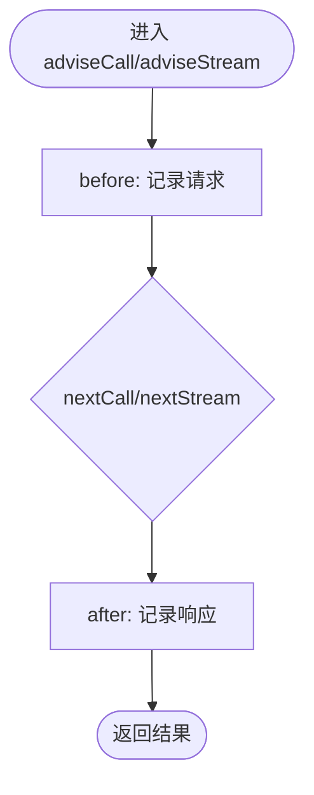
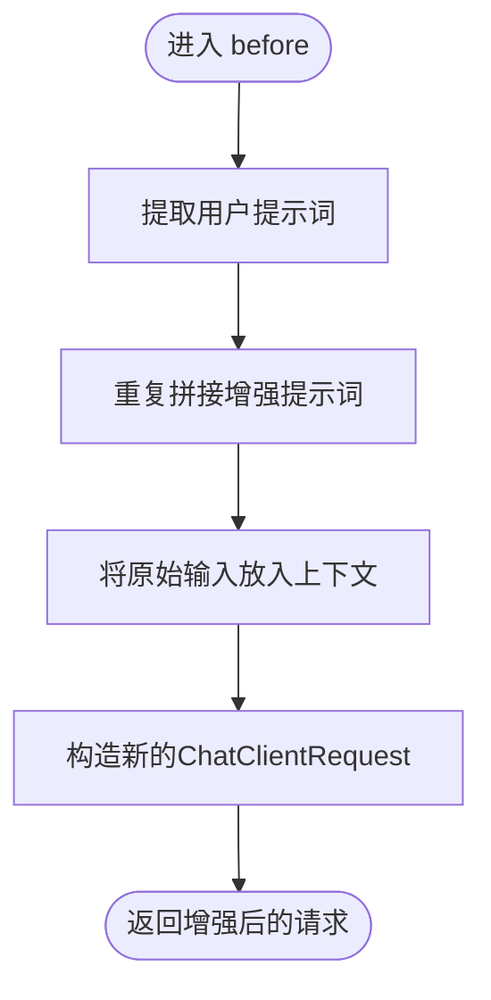
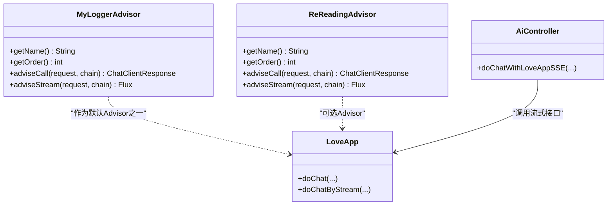

# Spring AI Advisor优化

<cite>
**本文引用的文件**
- [MyLoggerAdvisor.java](file://src/main/java/com/yupi/yuaiagent/advisor/MyLoggerAdvisor.java)
- [ReReadingAdvisor.java](file://src/main/java/com/yupi/yuaiagent/advisor/ReReadingAdvisor.java)
- [LoveApp.java](file://src/main/java/com/yupi/yuaiagent/app/LoveApp.java)
- [AiController.java](file://src/main/java/com/yupi/yuaiagent/controller/AiController.java)
- [application.yml](file://src/main/resources/application.yml)
- [pom.xml](file://pom.xml)
</cite>

## 目录
1. [简介](#简介)
2. [项目结构](#项目结构)
3. [核心组件](#核心组件)
4. [架构总览](#架构总览)
5. [组件详细分析](#组件详细分析)
6. [依赖关系分析](#依赖关系分析)
7. [性能考量](#性能考量)
8. [故障排查指南](#故障排查指南)
9. [结论](#结论)
10. [附录](#附录)

## 简介
本指南聚焦于Spring AI Advisor在本项目中的实现与性能优化，重点解析两个自定义Advisor：
- MyLoggerAdvisor：负责在同步调用与流式响应中打印请求与响应的关键信息，便于调试与可观测性。
- ReReadingAdvisor：在请求前改写用户提示词，通过“重复阅读”机制提升推理质量。

同时，本文将系统阐述Advisor链的执行顺序与性能开销、日志对性能的影响与优化策略、流式处理中的背压与操作符选择、Advisor配置最佳实践（order、异常处理、资源管理），并提供性能测试与基准对比的方法论与建议。

## 项目结构
本项目采用分层与功能模块化组织，Advisor位于advisor包，应用入口LoveApp负责构建ChatClient并注册默认Advisor，控制器AiController提供SSE流式接口。

图表来源
- [LoveApp.java:52-61](file://src/main/java/com/yupi/yuaiagent/app/LoveApp.java#L52-L61)
- [AiController.java:50-53](file://src/main/java/com/yupi/yuaiagent/controller/AiController.java#L50-L53)
- [MyLoggerAdvisor.java:18](file://src/main/java/com/yupi/yuaiagent/advisor/MyLoggerAdvisor.java#L18)
- [ReReadingAdvisor.java:16](file://src/main/java/com/yupi/yuaiagent/advisor/ReReadingAdvisor.java#L16)

章节来源
- [LoveApp.java:52-61](file://src/main/java/com/yupi/yuaiagent/app/LoveApp.java#L52-L61)
- [AiController.java:50-53](file://src/main/java/com/yupi/yuaiagent/controller/AiController.java#L50-L53)

## 核心组件
- MyLoggerAdvisor：实现CallAdvisor与StreamAdvisor，负责在请求前记录用户提示词，在响应后记录AI回复文本；流式场景通过消息聚合器合并片段后再输出一次最终摘要。
- ReReadingAdvisor：实现CallAdvisor与StreamAdvisor，请求前将用户提示词重复拼接以强化模型理解；同样支持同步与流式两种模式。
- LoveApp：在ChatClient.Builder中注册默认Advisor链，包括对话记忆与自定义Advisor；提供同步与流式对话接口。
- AiController：对外暴露SSE流式接口，将LoveApp的Flux<String>直接返回给客户端。

章节来源
- [MyLoggerAdvisor.java:18-52](file://src/main/java/com/yupi/yuaiagent/advisor/MyLoggerAdvisor.java#L18-L52)
- [ReReadingAdvisor.java:16-55](file://src/main/java/com/yupi/yuaiagent/advisor/ReReadingAdvisor.java#L16-L55)
- [LoveApp.java:52-61](file://src/main/java/com/yupi/yuaiagent/app/LoveApp.java#L52-L61)
- [AiController.java:50-53](file://src/main/java/com/yupi/yuaiagent/controller/AiController.java#L50-L53)

## 架构总览
Advisor链在ChatClient内部以责任链模式串联，每个Advisor在before阶段可修改请求或上下文，在after阶段可观察响应或进行收尾工作。同步与流式路径分别由CallAdvisorChain与StreamAdvisorChain驱动。

图表来源
- [AiController.java:50-53](file://src/main/java/com/yupi/yuaiagent/controller/AiController.java#L50-L53)
- [LoveApp.java:90-97](file://src/main/java/com/yupi/yuaiagent/app/LoveApp.java#L90-L97)
- [MyLoggerAdvisor.java:48-52](file://src/main/java/com/yupi/yuaiagent/advisor/MyLoggerAdvisor.java#L48-L52)
- [ReReadingAdvisor.java:42-45](file://src/main/java/com/yupi/yuaiagent/advisor/ReReadingAdvisor.java#L42-L45)

## 组件详细分析

### MyLoggerAdvisor实现与性能影响
- before阶段：记录用户提示词，仅在info级别输出，避免高成本格式化与序列化。
- after阶段：在同步调用中直接记录完整回复；在流式调用中通过消息聚合器将片段合并后再输出一次最终摘要，减少多次日志输出带来的噪声。
- 性能影响：
  - 日志级别为info，属于常规级别，对生产环境影响有限。
  - 同步路径：一次before + 一次after，开销较小。
  - 流式路径：before一次，after一次（聚合后），整体日志次数与同步相当，但会增加一次消息聚合的CPU与内存消耗。

图表来源
- [MyLoggerAdvisor.java:40-45](file://src/main/java/com/yupi/yuaiagent/advisor/MyLoggerAdvisor.java#L40-L45)
- [MyLoggerAdvisor.java:48-52](file://src/main/java/com/yupi/yuaiagent/advisor/MyLoggerAdvisor.java#L48-L52)

章节来源
- [MyLoggerAdvisor.java:18-52](file://src/main/java/com/yupi/yuaiagent/advisor/MyLoggerAdvisor.java#L18-L52)

### ReReadingAdvisor实现与性能影响
- before阶段：从请求中提取用户提示词，将其重复拼接到新提示词中，并将原始输入存入上下文，随后构造新的ChatClientRequest。
- 性能影响：
  - 字符串拼接与Prompt增强属于轻量计算，对CPU开销影响可忽略。
  - 对流式场景同样适用，增强后的请求将被下游链路处理。
  - 若提示词过长，字符串拼接与Prompt对象构造会有额外内存占用，需结合业务场景评估。

图表来源
- [ReReadingAdvisor.java:24-35](file://src/main/java/com/yupi/yuaiagent/advisor/ReReadingAdvisor.java#L24-L35)

章节来源
- [ReReadingAdvisor.java:16-55](file://src/main/java/com/yupi/yuaiagent/advisor/ReReadingAdvisor.java#L16-L55)

### Advisor链执行顺序与性能开销
- 默认注册顺序：对话记忆Advisor优先，然后是MyLoggerAdvisor，最后是ReReadingAdvisor（当前示例中MyLoggerAdvisor处于默认Advisor链中，ReReadingAdvisor被注释）。
- 同步调用：before -> chain.nextCall -> after。
- 流式调用：before -> chain.nextStream -> 聚合器合并 -> after。
- 性能开销来源：
  - 日志输出：info级别日志对吞吐影响小，但频繁输出仍会带来I/O与序列化成本。
  - 提示词增强：字符串拼接与Prompt对象构造成本低，但会增加请求体积与下游处理时间。
  - 聚合器：流式场景下的消息聚合会引入一次内存缓冲与一次最终输出，需关注背压与内存峰值。

章节来源
- [LoveApp.java:54-61](file://src/main/java/com/yupi/yuaiagent/app/LoveApp.java#L54-L61)
- [MyLoggerAdvisor.java:40-52](file://src/main/java/com/yupi/yuaiagent/advisor/MyLoggerAdvisor.java#L40-L52)
- [ReReadingAdvisor.java:38-45](file://src/main/java/com/yupi/yuaiagent/advisor/ReReadingAdvisor.java#L38-L45)

### 流式处理中的性能考虑
- Flux操作符：本项目直接返回ChatClient.stream().content()，由底层实现负责背压与分片。
- 背压处理：Reactor默认采用背压策略，确保下游消费者可控制消费速率，避免内存溢出。
- 输出内容：SSE控制器将Flux<String>直接推送，避免中间缓冲与转换，降低额外开销。
- 优化建议：
  - 控制日志粒度：在生产环境建议使用warn或error级别，必要时再切换到info。
  - 减少聚合：若不需要最终摘要，可移除聚合器，直接透传流式片段。
  - 上下文大小：避免在上下文中存放过大对象，防止序列化与传递成本上升。

章节来源
- [AiController.java:50-92](file://src/main/java/com/yupi/yuaiagent/controller/AiController.java#L50-L92)
- [MyLoggerAdvisor.java:48-52](file://src/main/java/com/yupi/yuaiagent/advisor/MyLoggerAdvisor.java#L48-L52)

### Advisor配置最佳实践
- order设置：当前两个Advisor均返回0，意味着它们的相对顺序取决于注册顺序。建议明确指定order值，例如将更关键的逻辑（如对话记忆）置于更靠前位置，日志与增强类Advisor置于稍后位置。
- 异常处理：在Advisor内部不建议抛出未捕获异常，应在before或after中进行容错与降级，避免中断整个链路。
- 资源管理：日志输出与消息聚合器均为轻量操作，无需显式释放；但若在Advisor中创建临时对象，应确保在finally或响应完成后及时清理。
- 动态启用：LoveApp示例展示了在不同场景下动态启用或禁用Advisor，建议根据性能需求与调试需要灵活开关。

章节来源
- [MyLoggerAdvisor.java:26-28](file://src/main/java/com/yupi/yuaiagent/advisor/MyLoggerAdvisor.java#L26-L28)
- [ReReadingAdvisor.java:48-50](file://src/main/java/com/yupi/yuaiagent/advisor/ReReadingAdvisor.java#L48-L50)
- [LoveApp.java:54-61](file://src/main/java/com/yupi/yuaiagent/app/LoveApp.java#L54-L61)

## 依赖关系分析
- MyLoggerAdvisor与ReReadingAdvisor均实现CallAdvisor与StreamAdvisor接口，依赖Spring AI ChatClient的Advisor链机制。
- LoveApp通过ChatClient.Builder注册默认Advisor链，AiController通过SSE接口直接返回Flux。
- 日志级别由application.yml统一配置，便于全局控制日志输出。

图表来源
- [MyLoggerAdvisor.java:18](file://src/main/java/com/yupi/yuaiagent/advisor/MyLoggerAdvisor.java#L18)
- [ReReadingAdvisor.java:16](file://src/main/java/com/yupi/yuaiagent/advisor/ReReadingAdvisor.java#L16)
- [LoveApp.java:52-61](file://src/main/java/com/yupi/yuaiagent/app/LoveApp.java#L52-L61)
- [AiController.java:50-53](file://src/main/java/com/yupi/yuaiagent/controller/AiController.java#L50-L53)

章节来源
- [pom.xml:50-164](file://pom.xml#L50-L164)
- [application.yml:64-66](file://src/main/resources/application.yml#L64-L66)

## 性能考量
- 日志级别与输出内容
  - 当前使用info级别输出请求与响应摘要，建议在生产环境降低日志级别或按需开启，避免过多I/O与序列化开销。
  - 若必须保留日志，建议仅输出必要字段（如会话ID、关键摘要），避免打印完整提示词与长回复。
- 流式处理
  - 使用SSE直接透传Flux，减少中间缓冲与转换。
  - 如不需要最终摘要，可移除消息聚合器，直接输出流式片段，降低CPU与内存消耗。
- 提示词增强
  - ReReadingAdvisor的增强逻辑为轻量操作，但会增加请求体积与下游处理时间，建议在需要时启用。
- 背压与内存
  - Reactor默认背压策略可有效控制内存峰值，建议配合限流与超时配置，避免长时间阻塞。
- 依赖版本
  - 项目使用Spring Boot 3.4.4与Spring AI 1.0.0，建议关注官方性能优化与补丁更新。

章节来源
- [application.yml:64-66](file://src/main/resources/application.yml#L64-L66)
- [AiController.java:50-92](file://src/main/java/com/yupi/yuaiagent/controller/AiController.java#L50-L92)
- [MyLoggerAdvisor.java:30-37](file://src/main/java/com/yupi/yuaiagent/advisor/MyLoggerAdvisor.java#L30-L37)
- [ReReadingAdvisor.java:24-35](file://src/main/java/com/yupi/yuaiagent/advisor/ReReadingAdvisor.java#L24-L35)

## 故障排查指南
- 日志未输出
  - 检查日志级别配置，确认是否已调整到DEBUG或INFO。
  - 确认Advisor是否正确注册到ChatClient，默认Advisor链与局部Advisor均可生效。
- 流式输出异常
  - 检查SSE控制器是否正确返回Flux，避免在中间环节阻塞或丢弃数据。
  - 关注客户端连接超时与断开事件，确保在finally中清理资源。
- 性能下降
  - 逐步禁用日志与增强类Advisor，定位瓶颈来源。
  - 监控内存与CPU使用，检查是否存在大量上下文对象或过长提示词。

章节来源
- [application.yml:64-66](file://src/main/resources/application.yml#L64-L66)
- [AiController.java:77-92](file://src/main/java/com/yupi/yuaiagent/controller/AiController.java#L77-L92)
- [LoveApp.java:145-172](file://src/main/java/com/yupi/yuaiagent/app/LoveApp.java#L145-L172)

## 结论
MyLoggerAdvisor与ReReadingAdvisor在本项目中分别承担可观测性与推理增强职责。通过合理设置order、控制日志级别与输出内容、优化流式处理与背压策略，可在保证功能的前提下显著降低性能开销。建议在生产环境中谨慎启用日志与增强逻辑，结合监控指标持续评估与迭代。

## 附录
- 性能测试与基准对比方法（建议）
  - 场景设计：同步调用、流式调用、开启/关闭日志、开启/关闭提示词增强。
  - 指标收集：吞吐量（requests/sec）、延迟（p50/p95/p99）、内存占用、CPU使用率。
  - 工具建议：JMH（基准测试）、Micrometer（指标采集）、Prometheus+Grafana（可视化）。
  - 实施步骤：
    1) 在不同配置组合下运行相同负载，记录指标。
    2) 对比开启/关闭日志与增强的差异，量化其性能影响。
    3) 结合业务SLA设定阈值，确定最优配置。
  - 注意事项：确保测试环境与生产环境硬件一致，避免缓存与网络因素干扰。