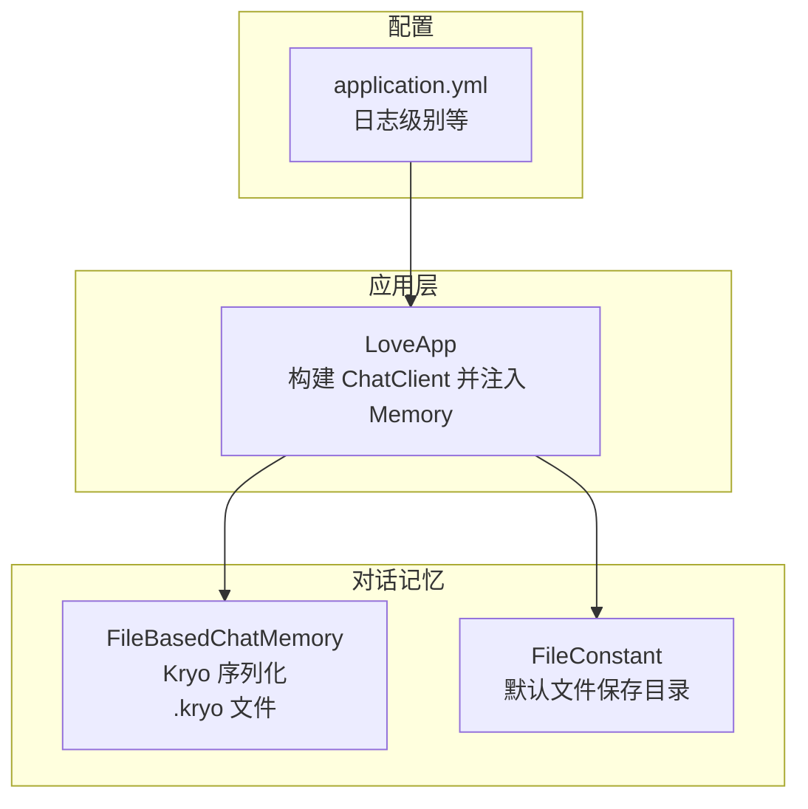
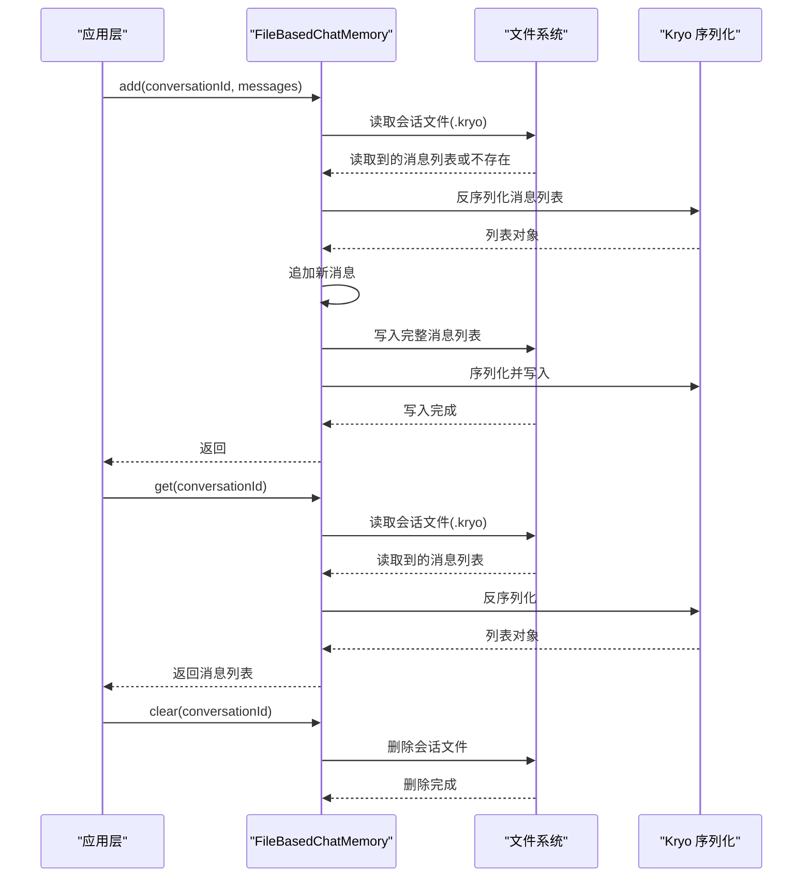
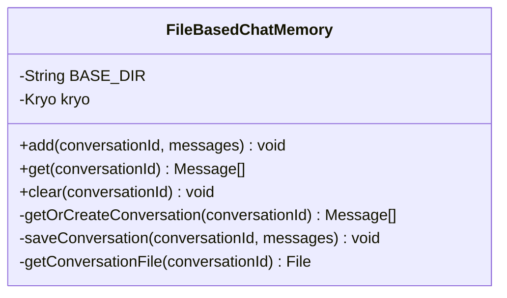
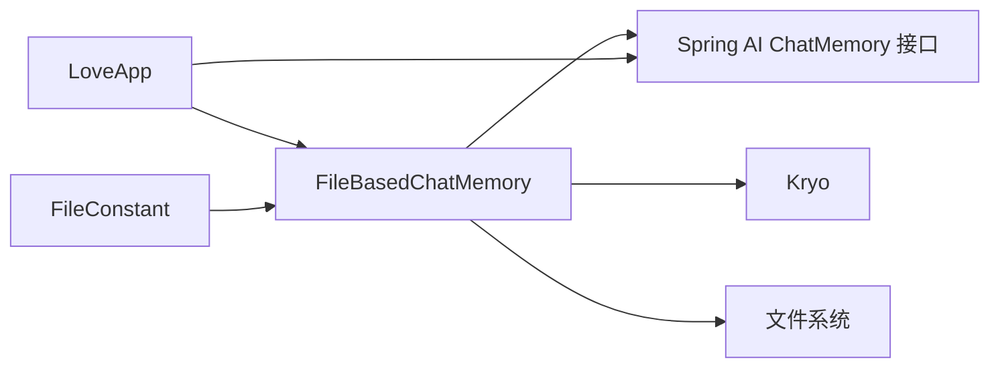
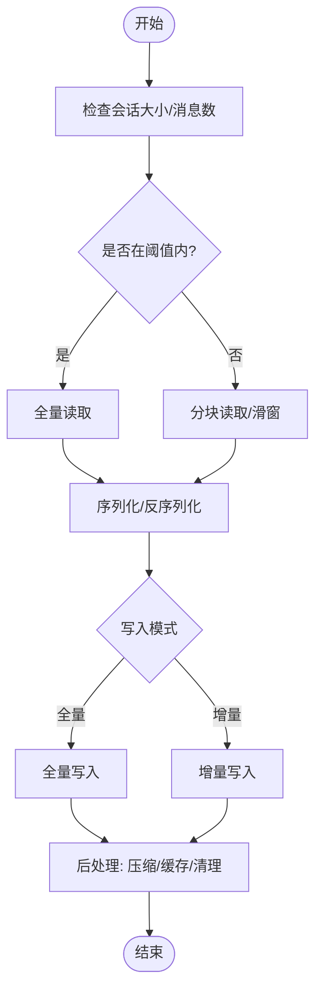

# 对话记忆优化

<cite>
**本文引用的文件**
- [FileBasedChatMemory.java](file://src/main/java/com/yupi/yuaiagent/chatmemory/FileBasedChatMemory.java)
- [FileConstant.java](file://src/main/java/com/yupi/yuaiagent/constant/FileConstant.java)
- [application.yml](file://src/main/resources/application.yml)
- [LoveApp.java](file://src/main/java/com/yupi/yuaiagent/app/LoveApp.java)
- [YuAiAgentApplicationTests.java](file://src/test/java/com/yupi/yuaiagent/YuAiAgentApplicationTests.java)
</cite>

## 目录
1. [简介](#简介)
2. [项目结构](#项目结构)
3. [核心组件](#核心组件)
4. [架构总览](#架构总览)
5. [详细组件分析](#详细组件分析)
6. [依赖分析](#依赖分析)
7. [性能考虑](#性能考虑)
8. [故障排查指南](#故障排查指南)
9. [结论](#结论)
10. [附录](#附录)

## 简介
本指南聚焦于基于文件的对话记忆系统（FileBasedChatMemory）的实现与性能优化。我们将从实现机制、数据存储结构、访问模式、内存与磁盘平衡、大文件处理策略、清理与生命周期管理、以及性能监控与瓶颈分析等方面进行系统性剖析，并提供可落地的优化建议与最佳实践，帮助在高并发与长会话场景下稳定运行。

## 项目结构
- 对话记忆实现位于 chatmemory 包中，采用 Kryo 进行序列化，文件以 .kryo 扩展名存储。
- 应用层通过 Spring AI 的 ChatMemory 接口集成，当前示例默认使用内存型记忆（MessageWindowChatMemory），文件型记忆作为可选实现被注释保留。
- 日志与配置集中在 application.yml 中，便于观察 Spring AI 的调用细节。

图表来源
- [LoveApp.java:43-62](file://src/main/java/com/yupi/yuaiagent/app/LoveApp.java#L43-L62)
- [FileBasedChatMemory.java:20-93](file://src/main/java/com/yupi/yuaiagent/chatmemory/FileBasedChatMemory.java#L20-L93)
- [FileConstant.java:6-12](file://src/main/java/com/yupi/yuaiagent/constant/FileConstant.java#L6-L12)
- [application.yml:64-66](file://src/main/resources/application.yml#L64-L66)

章节来源
- [LoveApp.java:43-62](file://src/main/java/com/yupi/yuaiagent/app/LoveApp.java#L43-L62)
- [FileBasedChatMemory.java:20-93](file://src/main/java/com/yupi/yuaiagent/chatmemory/FileBasedChatMemory.java#L20-L93)
- [FileConstant.java:6-12](file://src/main/java/com/yupi/yuaiagent/constant/FileConstant.java#L6-L12)
- [application.yml:64-66](file://src/main/resources/application.yml#L64-L66)

## 核心组件
- FileBasedChatMemory：实现 ChatMemory 接口，负责会话消息的加载、追加与持久化，使用 Kryo 序列化为二进制文件，文件名以会话 ID 命名并以 .kryo 结尾。
- FileConstant：提供默认文件保存目录常量，便于集中管理存储路径。
- LoveApp：演示如何将 ChatMemory 注入到 ChatClient，当前示例使用内存型记忆，文件型记忆作为可选实现被注释保留。
- application.yml：设置日志级别为 DEBUG，便于观察 Spring AI 的调用细节，有助于定位性能问题。

章节来源
- [FileBasedChatMemory.java:20-93](file://src/main/java/com/yupi/yuaiagent/chatmemory/FileBasedChatMemory.java#L20-L93)
- [FileConstant.java:6-12](file://src/main/java/com/yupi/yuaiagent/constant/FileConstant.java#L6-L12)
- [LoveApp.java:43-62](file://src/main/java/com/yupi/yuaiagent/app/LoveApp.java#L43-L62)
- [application.yml:64-66](file://src/main/resources/application.yml#L64-L66)

## 架构总览
FileBasedChatMemory 的工作流：
- add：读取现有会话消息（若存在），追加新消息，整体写回文件。
- get：按会话 ID 定位文件并反序列化返回消息列表。
- clear：删除对应会话文件。

图表来源
- [FileBasedChatMemory.java:43-88](file://src/main/java/com/yupi/yuaiagent/chatmemory/FileBasedChatMemory.java#L43-L88)

## 详细组件分析

### FileBasedChatMemory 实现机制与性能特点
- 存储结构
  - 文件命名：BASE_DIR/conversationId.kryo
  - 序列化：使用 Kryo 将 List<Message> 作为根对象进行读写，无需注册类型，实例化策略设为 StdInstantiatorStrategy。
- 访问模式
  - 读取：按需打开输入流，一次性反序列化整个会话列表。
  - 写入：按需打开输出流，一次性序列化整个会话列表。
  - 清理：直接删除对应文件。
- 性能特征
  - 优点：实现简单，序列化开销低，适合中小规模会话。
  - 缺点：每次 add/get 都会全量读写，对大文件会产生明显延迟；无并发控制，存在竞态风险；未做缓存与分页，内存占用随会话增长线性上升。

图表来源
- [FileBasedChatMemory.java:20-93](file://src/main/java/com/yupi/yuaiagent/chatmemory/FileBasedChatMemory.java#L20-L93)

章节来源
- [FileBasedChatMemory.java:20-93](file://src/main/java/com/yupi/yuaiagent/chatmemory/FileBasedChatMemory.java#L20-L93)

### 对话历史存储结构与访问模式
- 存储结构
  - 单会话单文件，文件名为 conversationId.kryo。
  - 文件内容为 Kryo 序列化的 List<Message>。
- 访问模式
  - 全量读写：每次 add 都会先读取再写回，适合小到中等规模会话。
  - 顺序访问：按时间顺序追加，适合多轮对话的线性历史。
- 复杂度
  - 读写复杂度近似 O(n)，n 为消息数量；频繁追加导致写放大。

章节来源
- [FileBasedChatMemory.java:68-88](file://src/main/java/com/yupi/yuaiagent/chatmemory/FileBasedChatMemory.java#L68-L88)

### 内存管理与磁盘使用平衡
- 当前实现
  - 读取时将整个会话加载到内存，适合短会话；长会话可能导致内存压力。
  - 文件大小随消息数线性增长，未做压缩或分片。
- 建议
  - 引入 LRU 缓存：仅缓存最近活跃的 N 个会话，淘汰最久未用者。
  - 分页读取：对超长会话采用滑动窗口或分页策略，避免一次性加载。
  - 增量写入：仅写入新增部分，而非全量覆盖。
  - 压缩：启用 GZIP 或 Snappy 压缩，降低磁盘占用与 IO 延迟。

章节来源
- [FileBasedChatMemory.java:68-88](file://src/main/java/com/yupi/yuaiagent/chatmemory/FileBasedChatMemory.java#L68-L88)

### 大文件处理优化技巧
- 分块读写
  - 将长会话拆分为多个片段文件，按需加载与合并。
  - 写入时采用缓冲区批量写入，减少系统调用次数。
- 缓冲区管理
  - 使用 BufferedInputStream/BufferedOutputStream 提升吞吐量。
  - 合理设置缓冲区大小（如 64KB~1MB），根据硬件与负载调整。
- 异步 I/O
  - 在高并发场景下引入异步文件操作（如 NIO.2 或 Reactor I/O），避免阻塞主线程。
  - 结合线程池与背压策略，控制并发与资源消耗。
- 压缩与去重
  - 对重复消息进行去重或压缩，显著降低存储与带宽。
  - 使用更高效的序列化格式（如 Protobuf、Avro）替代 Kryo，提升编码效率。

章节来源
- [FileBasedChatMemory.java:68-88](file://src/main/java/com/yupi/yuaiagent/chatmemory/FileBasedChatMemory.java#L68-L88)

### 清理策略与生命周期管理
- 现状
  - clear 直接删除文件，未做软删除或回收站。
  - 未实现会话过期自动清理或配额限制。
- 建议
  - 生命周期
    - 最大消息数：超过阈值时截断旧消息（如保留最近 N 条）。
    - 最大会话时长：超时自动清理，释放磁盘空间。
    - 最大文件大小：超过阈值触发归档或压缩。
  - 清理策略
    - 定期扫描：后台任务定期检查并清理过期或超限会话。
    - 增量清理：在 add 时同步检查并裁剪，避免堆积。
    - 归档与压缩：将历史会话移至冷存储或压缩归档。

章节来源
- [FileBasedChatMemory.java:55-61](file://src/main/java/com/yupi/yuaiagent/chatmemory/FileBasedChatMemory.java#L55-L61)

### 并发访问与一致性
- 现状
  - 未见显式锁或原子操作，多线程并发可能产生竞态。
- 建议
  - 会话级锁：每个 conversationId 维护独立锁，保证同一会话的读写串行化。
  - 乐观锁：引入版本号或时间戳，冲突时重试或合并。
  - 原子写：使用临时文件 + 原子替换，避免部分写入导致的数据损坏。

章节来源
- [FileBasedChatMemory.java:43-88](file://src/main/java/com/yupi/yuaiagent/chatmemory/FileBasedChatMemory.java#L43-L88)

## 依赖分析
- 外部依赖
  - Kryo：高性能 Java 序列化框架，适合对象图的快速序列化。
  - Spring AI ChatMemory 接口：统一记忆接口，便于切换实现。
- 内部耦合
  - FileBasedChatMemory 与 FileConstant 解耦良好，通过构造函数注入目录。
  - 与 LoveApp 的耦合体现在 ChatClient 的 Advisors 注入，便于替换不同记忆实现。

图表来源
- [FileBasedChatMemory.java:3-8](file://src/main/java/com/yupi/yuaiagent/chatmemory/FileBasedChatMemory.java#L3-L8)
- [LoveApp.java:14-16](file://src/main/java/com/yupi/yuaiagent/app/LoveApp.java#L14-L16)
- [FileConstant.java:6-12](file://src/main/java/com/yupi/yuaiagent/constant/FileConstant.java#L6-L12)

章节来源
- [FileBasedChatMemory.java:3-8](file://src/main/java/com/yupi/yuaiagent/chatmemory/FileBasedChatMemory.java#L3-L8)
- [LoveApp.java:14-16](file://src/main/java/com/yupi/yuaiagent/app/LoveApp.java#L14-L16)
- [FileConstant.java:6-12](file://src/main/java/com/yupi/yuaiagent/constant/FileConstant.java#L6-L12)

## 性能考虑
- 读写延迟
  - 全量读写导致延迟与 CPU 占用随 n 增长；建议分页与增量写入。
- 吞吐量
  - 使用缓冲区与压缩可显著提升吞吐；异步 I/O 降低等待时间。
- 并发访问
  - 引入会话级锁或原子写，避免竞态与数据损坏。
- 内存占用
  - 长会话易造成内存峰值；建议缓存 + 截断 + 压缩。
- 磁盘使用
  - 未压缩与无分片导致磁盘膨胀；建议归档与压缩策略。

图表来源
- [FileBasedChatMemory.java:43-88](file://src/main/java/com/yupi/yuaiagent/chatmemory/FileBasedChatMemory.java#L43-L88)

章节来源
- [FileBasedChatMemory.java:43-88](file://src/main/java/com/yupi/yuaiagent/chatmemory/FileBasedChatMemory.java#L43-L88)

## 故障排查指南
- 常见问题
  - 文件读取失败：检查文件是否存在、权限与磁盘空间。
  - 序列化异常：确认消息类型兼容 Kryo，避免循环引用。
  - 并发写入冲突：引入锁或原子写，避免竞态。
  - 内存溢出：对长会话实施截断与缓存淘汰。
- 排查步骤
  - 启用 DEBUG 日志，观察 Spring AI 的调用链路。
  - 使用系统监控工具（如 JVM 堆栈、GC 日志、磁盘 IO）定位瓶颈。
  - 对 add/get/clear 关键路径增加埋点，统计耗时与错误率。
- 修复建议
  - 为 add/get/clear 加入重试与降级逻辑。
  - 对异常进行分类处理（IO 错误、序列化错误、并发冲突）。

章节来源
- [application.yml:64-66](file://src/main/resources/application.yml#L64-L66)
- [FileBasedChatMemory.java:68-88](file://src/main/java/com/yupi/yuaiagent/chatmemory/FileBasedChatMemory.java#L68-L88)

## 结论
FileBasedChatMemory 提供了简洁可靠的文件型对话记忆实现，适合中小规模场景。针对高并发与长会话，建议引入缓存、分页、增量写入、压缩与异步 I/O 等优化手段，并完善清理与生命周期管理策略。通过合理的监控与埋点，持续评估读写延迟、吞吐量与并发表现，确保系统在生产环境中的稳定性与可扩展性。

## 附录
- 快速对照
  - 存储位置：BASE_DIR/conversationId.kryo
  - 序列化：Kryo
  - 默认目录：FileConstant.FILE_SAVE_DIR
  - 日志级别：DEBUG（application.yml）
  - 示例集成：MessageWindowChatMemory（LoveApp）

章节来源
- [FileBasedChatMemory.java:90-92](file://src/main/java/com/yupi/yuaiagent/chatmemory/FileBasedChatMemory.java#L90-L92)
- [FileConstant.java:11](file://src/main/java/com/yupi/yuaiagent/constant/FileConstant.java#L11)
- [application.yml:64-66](file://src/main/resources/application.yml#L64-L66)
- [LoveApp.java:48-51](file://src/main/java/com/yupi/yuaiagent/app/LoveApp.java#L48-L51)