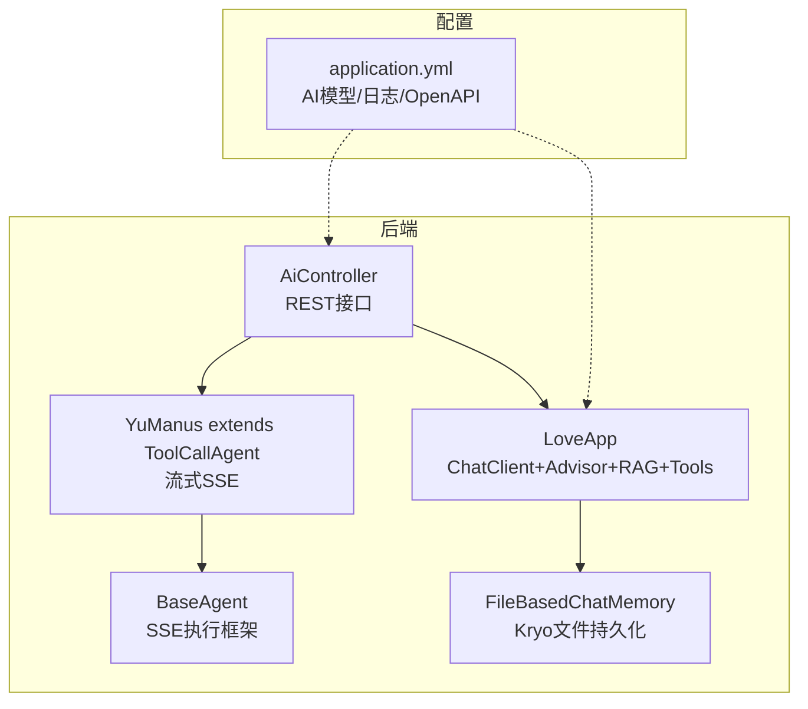
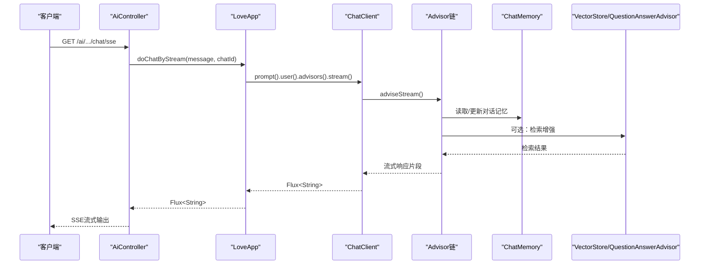
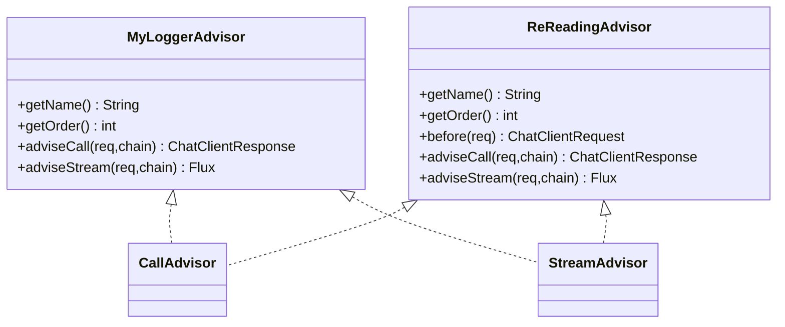
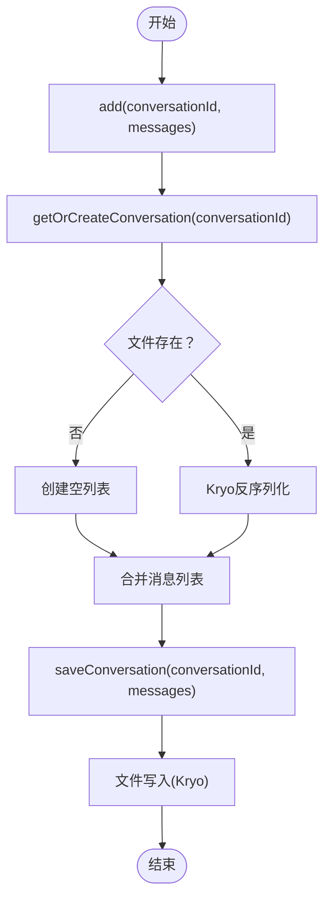
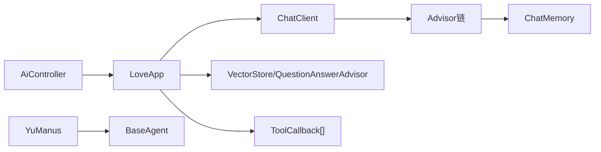

# 性能优化

<cite>
**本文引用的文件**
- [MyLoggerAdvisor.java](file://src/main/java/com/yupi/yuaiagent/advisor/MyLoggerAdvisor.java)
- [ReReadingAdvisor.java](file://src/main/java/com/yupi/yuaiagent/advisor/ReReadingAdvisor.java)
- [FileBasedChatMemory.java](file://src/main/java/com/yupi/yuaiagent/chatmemory/FileBasedChatMemory.java)
- [AiController.java](file://src/main/java/com/yupi/yuaiagent/controller/AiController.java)
- [LoveApp.java](file://src/main/java/com/yupi/yuaiagent/app/LoveApp.java)
- [YuManus.java](file://src/main/java/com/yupi/yuaiagent/agent/YuManus.java)
- [BaseAgent.java](file://src/main/java/com/yupi/yuaiagent/agent/BaseAgent.java)
- [application.yml](file://src/main/resources/application.yml)
- [QueryRewriter.java](file://src/main/java/com/yupi/yuaiagent/rag/QueryRewriter.java)
- [WebSearchTool.java](file://src/main/java/com/yupi/yuaiagent/tools/WebSearchTool.java)
- [TerminalOperationTool.java](file://src/main/java/com/yupi/yuaiagent/tools/TerminalOperationTool.java)
- [package.json](file://yu-ai-agent-frontend/package.json)
- [vite.config.js](file://yu-ai-agent-frontend/vite.config.js)
- [main.js](file://yu-ai-agent-frontend/src/main.js)
- [index.js](file://yu-ai-agent-frontend/src/router/index.js)
</cite>

## 目录
1. [简介](#简介)
2. [项目结构](#项目结构)
3. [核心组件](#核心组件)
4. [架构总览](#架构总览)
5. [详细组件分析](#详细组件分析)
6. [依赖分析](#依赖分析)
7. [性能考虑](#性能考虑)
8. [故障排查指南](#故障排查指南)
9. [结论](#结论)
10. [附录](#附录)

## 简介
本指南面向AI应用的性能优化，结合仓库中的Spring AI集成、Advisor链路、对话记忆、RAG检索、工具调用、前端构建与路由等模块，系统性地提出调优策略与最佳实践。重点覆盖以下方面：
- Spring AI Advisor的性能影响与优化（MyLoggerAdvisor、ReReadingAdvisor）
- 对话记忆系统的性能调优与内存管理（FileBasedChatMemory）
- AI模型调用的并发控制、缓存与批处理策略
- 数据库查询优化（索引、查询重写、连接池）
- 前端性能优化（资源压缩、懒加载、缓存策略）
- 运维层面的性能监控、瓶颈分析与容量规划

## 项目结构
后端采用Spring Boot工程，核心模块包括：
- 控制层：AiController对外提供同步与流式接口
- 应用层：LoveApp封装ChatClient、Advisor链、RAG与工具调用
- 代理层：BaseAgent抽象与YuManus具体实现，支持流式SSE输出
- 记忆层：FileBasedChatMemory基于Kryo序列化的文件持久化
- 配置层：application.yml定义AI模型、日志与OpenAPI等配置
- 前端：Vue3 + Vite，路由懒加载与构建优化

图示来源
- [AiController.java:18-105](file://src/main/java/com/yupi/yuaiagent/controller/AiController.java#L18-L105)
- [LoveApp.java:27-62](file://src/main/java/com/yupi/yuaiagent/app/LoveApp.java#L27-L62)
- [YuManus.java:12-37](file://src/main/java/com/yupi/yuaiagent/agent/YuManus.java#L12-L37)
- [BaseAgent.java:23-192](file://src/main/java/com/yupi/yuaiagent/agent/BaseAgent.java#L23-L192)
- [FileBasedChatMemory.java:17-93](file://src/main/java/com/yupi/yuaiagent/chatmemory/FileBasedChatMemory.java#L17-L93)
- [application.yml:1-66](file://src/main/resources/application.yml#L1-L66)

章节来源
- [AiController.java:18-105](file://src/main/java/com/yupi/yuaiagent/controller/AiController.java#L18-L105)
- [LoveApp.java:27-62](file://src/main/java/com/yupi/yuaiagent/app/LoveApp.java#L27-L62)
- [YuManus.java:12-37](file://src/main/java/com/yupi/yuaiagent/agent/YuManus.java#L12-L37)
- [BaseAgent.java:23-192](file://src/main/java/com/yupi/yuaiagent/agent/BaseAgent.java#L23-L192)
- [FileBasedChatMemory.java:17-93](file://src/main/java/com/yupi/yuaiagent/chatmemory/FileBasedChatMemory.java#L17-L93)
- [application.yml:1-66](file://src/main/resources/application.yml#L1-L66)

## 核心组件
- 控制层接口：提供同步与SSE两种模式，支持长连接与流式响应
- ChatClient与Advisor链：统一接入日志、记忆、RAG、工具等横切能力
- 记忆系统：支持内存窗口记忆与文件持久化两种实现
- 代理执行：基于SSE的流式执行框架，支持步骤控制与超时管理
- 前端路由：Vue3 + 路由懒加载，Vite构建优化

章节来源
- [AiController.java:38-104](file://src/main/java/com/yupi/yuaiagent/controller/AiController.java#L38-L104)
- [LoveApp.java:43-61](file://src/main/java/com/yupi/yuaiagent/app/LoveApp.java#L43-L61)
- [BaseAgent.java:100-177](file://src/main/java/com/yupi/yuaiagent/agent/BaseAgent.java#L100-L177)
- [FileBasedChatMemory.java:20-93](file://src/main/java/com/yupi/yuaiagent/chatmemory/FileBasedChatMemory.java#L20-L93)

## 架构总览
后端通过AiController接收请求，委托LoveApp进行对话或RAG检索，并在Advisor链中串联日志、记忆、RAG与工具回调。流式场景由BaseAgent统一管理SSE生命周期。

图示来源
- [AiController.java:50-92](file://src/main/java/com/yupi/yuaiagent/controller/AiController.java#L50-L92)
- [LoveApp.java:90-97](file://src/main/java/com/yupi/yuaiagent/app/LoveApp.java#L90-L97)
- [LoveApp.java:145-172](file://src/main/java/com/yupi/yuaiagent/app/LoveApp.java#L145-L172)

## 详细组件分析

### Spring AI Advisor性能影响与优化
- MyLoggerAdvisor
  - 作用：在调用前后打印请求与响应文本，便于观测但带来I/O开销
  - 性能考量：日志级别与频率需权衡可观测性与吞吐；建议仅在调试环境启用
  - 优化建议：生产关闭或改为采样日志；对大响应内容仅打印摘要
- ReReadingAdvisor
  - 作用：重复读取用户输入以增强推理，提升准确性但增加一次Prompt改写
  - 性能考量：额外的字符串拼接与Prompt构造；对延迟有轻微影响
  - 优化建议：按需启用；对短输入可关闭；与MyLoggerAdvisor配合使用时注意顺序

图示来源
- [MyLoggerAdvisor.java:17-53](file://src/main/java/com/yupi/yuaiagent/advisor/MyLoggerAdvisor.java#L17-L53)
- [ReReadingAdvisor.java:16-56](file://src/main/java/com/yupi/yuaiagent/advisor/ReReadingAdvisor.java#L16-L56)

章节来源
- [MyLoggerAdvisor.java:17-53](file://src/main/java/com/yupi/yuaiagent/advisor/MyLoggerAdvisor.java#L17-L53)
- [ReReadingAdvisor.java:16-56](file://src/main/java/com/yupi/yuaiagent/advisor/ReReadingAdvisor.java#L16-L56)

### 对话记忆系统优化策略
- FileBasedChatMemory
  - 实现：基于Kryo序列化/反序列化，文件名以conversationId命名
  - 性能要点：
    - 读写为IO密集型，频繁add会触发多次磁盘写入
    - 建议合并批量写入、控制消息数量、定期清理过期会话
  - 内存管理：
    - 读取时一次性加载整个会话列表，建议限制maxMessages或采用分页/游标
    - clear删除文件，避免残留占用空间
- 建议替代方案：
  - 生产优先使用内存窗口记忆（MessageWindowChatMemory），减少IO
  - 若需持久化，采用Redis等内存数据库或本地轻量KV存储

图示来源
- [FileBasedChatMemory.java:44-88](file://src/main/java/com/yupi/yuaiagent/chatmemory/FileBasedChatMemory.java#L44-L88)

章节来源
- [FileBasedChatMemory.java:17-93](file://src/main/java/com/yupi/yuaiagent/chatmemory/FileBasedChatMemory.java#L17-L93)

### AI模型调用的性能优化
- 并发控制
  - 控制层SSE默认超时较长，需结合业务场景合理设置
  - 代理执行使用CompletableFuture异步处理，避免阻塞主线程
- 缓存策略
  - 对热点查询与RAG检索结果进行缓存（如Redis），减少重复检索
  - 对工具调用结果进行短期缓存，降低外部API调用频次
- 批处理
  - 将多个小请求合并为批次，减少网络往返与模型调用次数
  - 对流式响应进行背压与节流，避免客户端积压

章节来源
- [AiController.java:77-92](file://src/main/java/com/yupi/yuaiagent/controller/AiController.java#L77-L92)
- [BaseAgent.java:100-177](file://src/main/java/com/yupi/yuaiagent/agent/BaseAgent.java#L100-L177)

### 数据库查询优化（向量检索）
- 索引优化
  - 启用HNSW等高效索引类型，设置合适维度与距离度量
- 查询重写
  - QueryRewriter对用户查询进行改写，提升召回质量
- 连接池配置
  - 合理配置最大连接数、空闲超时与超时时间，避免连接争用

章节来源
- [application.yml:32-37](file://src/main/resources/application.yml#L32-L37)
- [QueryRewriter.java:18-38](file://src/main/java/com/yupi/yuaiagent/rag/QueryRewriter.java#L18-L38)

### 前端性能优化
- 资源压缩与打包
  - 使用Vite默认生产构建，启用代码分割与Tree-shaking
- 懒加载
  - 路由组件采用动态导入，减少首屏体积
- 缓存策略
  - 利用浏览器缓存与HTTP缓存头，结合版本号避免陈旧缓存

章节来源
- [package.json:6-21](file://yu-ai-agent-frontend/package.json#L6-L21)
- [vite.config.js:1-18](file://yu-ai-agent-frontend/vite.config.js#L1-L18)
- [index.js:3-31](file://yu-ai-agent-frontend/src/router/index.js#L3-L31)

## 依赖分析
- 控制层依赖应用层；应用层依赖ChatClient、Advisor、Memory、VectorStore与工具集合
- 代理层依赖工具回调与ChatClient，提供统一的SSE执行框架
- 前端依赖Vue生态与路由懒加载

图示来源
- [AiController.java:22-29](file://src/main/java/com/yupi/yuaiagent/controller/AiController.java#L22-L29)
- [LoveApp.java:31-61](file://src/main/java/com/yupi/yuaiagent/app/LoveApp.java#L31-L61)
- [YuManus.java:12-37](file://src/main/java/com/yupi/yuaiagent/agent/YuManus.java#L12-L37)

章节来源
- [AiController.java:22-29](file://src/main/java/com/yupi/yuaiagent/controller/AiController.java#L22-L29)
- [LoveApp.java:31-61](file://src/main/java/com/yupi/yuaiagent/app/LoveApp.java#L31-L61)
- [YuManus.java:12-37](file://src/main/java/com/yupi/yuaiagent/agent/YuManus.java#L12-L37)

## 性能考虑
- 日志与观测
  - 生产关闭MyLoggerAdvisor或降级为采样日志
  - 使用application.yml调整日志级别，避免过度I/O
- 记忆与IO
  - 优先内存窗口记忆；若使用文件持久化，控制消息数量与写入频率
- 流式与并发
  - SSE超时与背压策略需结合业务场景调优
  - 异步执行避免阻塞，合理设置线程池与队列长度
- 工具调用
  - 外部API调用需限流与重试；结果缓存与熔断保护
- 前端体验
  - 路由懒加载与静态资源缓存；构建产物版本化

章节来源
- [application.yml:64-66](file://src/main/resources/application.yml#L64-L66)
- [FileBasedChatMemory.java:44-88](file://src/main/java/com/yupi/yuaiagent/chatmemory/FileBasedChatMemory.java#L44-L88)
- [AiController.java:77-92](file://src/main/java/com/yupi/yuaiagent/controller/AiController.java#L77-L92)
- [BaseAgent.java:100-177](file://src/main/java/com/yupi/yuaiagent/agent/BaseAgent.java#L100-L177)
- [package.json:6-21](file://yu-ai-agent-frontend/package.json#L6-L21)
- [vite.config.js:13-16](file://yu-ai-agent-frontend/vite.config.js#L13-L16)

## 故障排查指南
- SSE连接异常
  - 检查超时设置与网络稳定性；关注onTimeout/onCompletion回调
- 日志过多导致性能下降
  - 关闭MyLoggerAdvisor或调整日志级别
- 文件持久化写入阻塞
  - 减少写入频率、合并批量写、清理过期会话
- 工具调用失败
  - 检查外部API密钥与网络连通性；添加重试与熔断

章节来源
- [BaseAgent.java:163-176](file://src/main/java/com/yupi/yuaiagent/agent/BaseAgent.java#L163-L176)
- [application.yml:64-66](file://src/main/resources/application.yml#L64-L66)
- [FileBasedChatMemory.java:81-87](file://src/main/java/com/yupi/yuaiagent/chatmemory/FileBasedChatMemory.java#L81-L87)
- [WebSearchTool.java:36-51](file://src/main/java/com/yupi/yuaiagent/tools/WebSearchTool.java#L36-L51)

## 结论
通过在Advisor链路、对话记忆、RAG检索、工具调用与前端构建等多环节实施针对性优化，可在保证用户体验的同时显著提升系统吞吐与稳定性。建议以“可观测—内存—IO—并发—缓存”为主线，持续迭代调优策略。

## 附录
- 配置参考
  - AI模型与日志级别：见application.yml
  - OpenAPI与Knife4j：见application.yml
- 前端开发与构建
  - 依赖与脚本：见package.json
  - 路由懒加载：见index.js
  - Vite开发服务器与别名：见vite.config.js
  - 应用入口：见main.js

章节来源
- [application.yml:1-66](file://src/main/resources/application.yml#L1-L66)
- [package.json:1-22](file://yu-ai-agent-frontend/package.json#L1-L22)
- [index.js:1-47](file://yu-ai-agent-frontend/src/router/index.js#L1-L47)
- [vite.config.js:1-18](file://yu-ai-agent-frontend/vite.config.js#L1-L18)
- [main.js:1-13](file://yu-ai-agent-frontend/src/main.js#L1-L13)