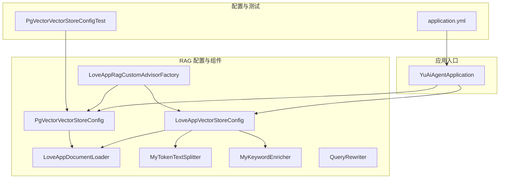
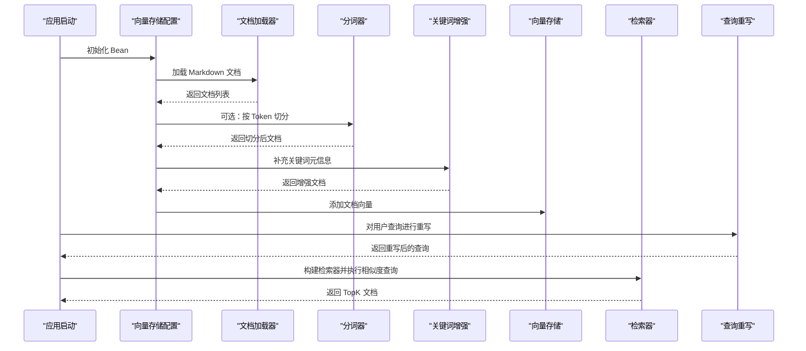
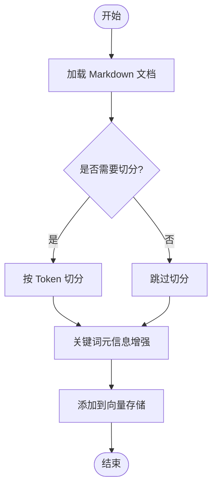
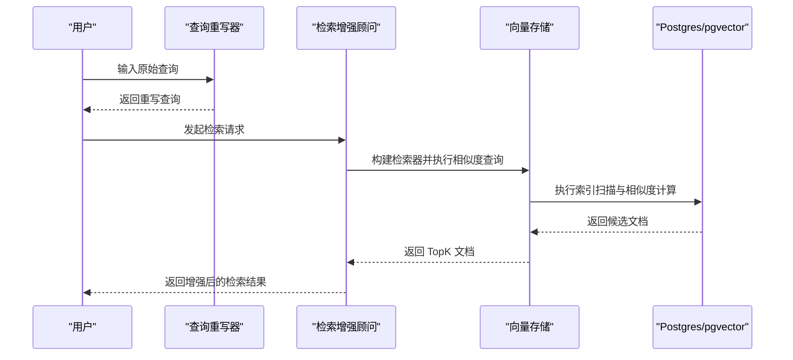
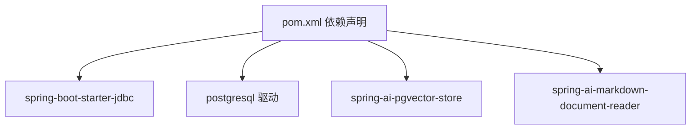

# 数据库查询优化

<cite>
**本文引用的文件**
- [LoveAppVectorStoreConfig.java](file://src/main/java/com/yupi/yuaiagent/rag/LoveAppVectorStoreConfig.java)
- [PgVectorVectorStoreConfig.java](file://src/main/java/com/yupi/yuaiagent/rag/PgVectorVectorStoreConfig.java)
- [QueryRewriter.java](file://src/main/java/com/yupi/yuaiagent/rag/QueryRewriter.java)
- [LoveAppDocumentLoader.java](file://src/main/java/com/yupi/yuaiagent/rag/LoveAppDocumentLoader.java)
- [MyTokenTextSplitter.java](file://src/main/java/com/yupi/yuaiagent/rag/MyTokenTextSplitter.java)
- [MyKeywordEnricher.java](file://src/main/java/com/yupi/yuaiagent/rag/MyKeywordEnricher.java)
- [LoveAppRagCustomAdvisorFactory.java](file://src/main/java/com/yupi/yuaiagent/rag/LoveAppRagCustomAdvisorFactory.java)
- [application.yml](file://src/main/resources/application.yml)
- [PgVectorVectorStoreConfigTest.java](file://src/test/java/com/yupi/yuaiagent/rag/PgVectorVectorStoreConfigTest.java)
- [YuAiAgentApplication.java](file://src/main/java/com/yupi/yuaiagent/YuAiAgentApplication.java)
- [pom.xml](file://pom.xml)
</cite>

## 目录
1. [简介](#简介)
2. [项目结构](#项目结构)
3. [核心组件](#核心组件)
4. [架构总览](#架构总览)
5. [详细组件分析](#详细组件分析)
6. [依赖分析](#依赖分析)
7. [性能考虑](#性能考虑)
8. [故障排查指南](#故障排查指南)
9. [结论](#结论)
10. [附录](#附录)

## 简介
本指南围绕向量数据库查询的性能优化展开，结合项目中的 LoveAppVectorStoreConfig 与 PgVectorVectorStoreConfig 实现，系统阐述向量相似度计算的性能优化方法（索引策略、查询重写、批量处理）、数据库连接池配置与优化、查询计划分析与优化、以及监控与诊断手段。同时提供可落地的优化案例与性能提升对比思路，帮助在实际场景中稳定、高效地运行向量检索与 RAG 流程。

## 项目结构
该项目采用 Spring Boot 应用，RAG 相关逻辑集中在 rag 包内，通过 Spring AI 的向量存储与检索能力实现文档加载、嵌入、相似度检索与查询增强。配置层通过 application.yml 控制日志与模型参数；测试用例验证向量存储的添加与相似度检索流程。

图表来源
- [YuAiAgentApplication.java:1-17](file://src/main/java/com/yupi/yuaiagent/YuAiAgentApplication.java#L1-L17)
- [LoveAppVectorStoreConfig.java:1-42](file://src/main/java/com/yupi/yuaiagent/rag/LoveAppVectorStoreConfig.java#L1-L42)
- [PgVectorVectorStoreConfig.java:1-41](file://src/main/java/com/yupi/yuaiagent/rag/PgVectorVectorStoreConfig.java#L1-L41)
- [LoveAppDocumentLoader.java:1-56](file://src/main/java/com/yupi/yuaiagent/rag/LoveAppDocumentLoader.java#L1-L56)
- [MyTokenTextSplitter.java:1-24](file://src/main/java/com/yupi/yuaiagent/rag/MyTokenTextSplitter.java#L1-L24)
- [MyKeywordEnricher.java:1-25](file://src/main/java/com/yupi/yuaiagent/rag/MyKeywordEnricher.java#L1-L25)
- [QueryRewriter.java:1-40](file://src/main/java/com/yupi/yuaiagent/rag/QueryRewriter.java#L1-L40)
- [LoveAppRagCustomAdvisorFactory.java:1-41](file://src/main/java/com/yupi/yuaiagent/rag/LoveAppRagCustomAdvisorFactory.java#L1-L41)
- [application.yml:1-66](file://src/main/resources/application.yml#L1-L66)
- [PgVectorVectorStoreConfigTest.java:1-33](file://src/test/java/com/yupi/yuaiagent/rag/PgVectorVectorStoreConfigTest.java#L1-L33)

章节来源
- [YuAiAgentApplication.java:1-17](file://src/main/java/com/yupi/yuaiagent/YuAiAgentApplication.java#L1-L17)
- [application.yml:1-66](file://src/main/resources/application.yml#L1-L66)

## 核心组件
- 向量存储配置
  - 内存向量存储：LoveAppVectorStoreConfig 使用 SimpleVectorStore，适合开发与小规模数据。
  - Postgres+pgvector：PgVectorVectorStoreConfig 使用 PgVectorStore，支持大规模数据与 HNSW 索引、余弦距离等生产特性。
- 文档加载与预处理
  - LoveAppDocumentLoader：从 classpath:document/*.md 加载 Markdown 文档，并注入元信息。
  - MyTokenTextSplitter：按 Token 切分文档，支持自定义窗口与重叠策略。
  - MyKeywordEnricher：利用 ChatModel 为文档补充关键词元信息，提升检索质量。
- 查询增强与重写
  - QueryRewriter：基于 ChatClient 的查询重写器，改善检索语义表达。
  - LoveAppRagCustomAdvisorFactory：构建带过滤条件与相似度阈值的检索增强顾问。
- 测试与验证
  - PgVectorVectorStoreConfigTest：验证向量存储添加与 similaritySearch 能力。

章节来源
- [LoveAppVectorStoreConfig.java:1-42](file://src/main/java/com/yupi/yuaiagent/rag/LoveAppVectorStoreConfig.java#L1-L42)
- [PgVectorVectorStoreConfig.java:1-41](file://src/main/java/com/yupi/yuaiagent/rag/PgVectorVectorStoreConfig.java#L1-L41)
- [LoveAppDocumentLoader.java:1-56](file://src/main/java/com/yupi/yuaiagent/rag/LoveAppDocumentLoader.java#L1-L56)
- [MyTokenTextSplitter.java:1-24](file://src/main/java/com/yupi/yuaiagent/rag/MyTokenTextSplitter.java#L1-L24)
- [MyKeywordEnricher.java:1-25](file://src/main/java/com/yupi/yuaiagent/rag/MyKeywordEnricher.java#L1-L25)
- [QueryRewriter.java:1-40](file://src/main/java/com/yupi/yuaiagent/rag/QueryRewriter.java#L1-L40)
- [LoveAppRagCustomAdvisorFactory.java:1-41](file://src/main/java/com/yupi/yuaiagent/rag/LoveAppRagCustomAdvisorFactory.java#L1-L41)
- [PgVectorVectorStoreConfigTest.java:1-33](file://src/test/java/com/yupi/yuaiagent/rag/PgVectorVectorStoreConfigTest.java#L1-L33)

## 架构总览
下图展示从应用启动到向量检索的关键路径，包括文档加载、嵌入生成、向量入库与相似度检索。

图表来源
- [YuAiAgentApplication.java:1-17](file://src/main/java/com/yupi/yuaiagent/YuAiAgentApplication.java#L1-L17)
- [LoveAppVectorStoreConfig.java:1-42](file://src/main/java/com/yupi/yuaiagent/rag/LoveAppVectorStoreConfig.java#L1-L42)
- [PgVectorVectorStoreConfig.java:1-41](file://src/main/java/com/yupi/yuaiagent/rag/PgVectorVectorStoreConfig.java#L1-L41)
- [LoveAppDocumentLoader.java:1-56](file://src/main/java/com/yupi/yuaiagent/rag/LoveAppDocumentLoader.java#L1-L56)
- [MyTokenTextSplitter.java:1-24](file://src/main/java/com/yupi/yuaiagent/rag/MyTokenTextSplitter.java#L1-L24)
- [MyKeywordEnricher.java:1-25](file://src/main/java/com/yupi/yuaiagent/rag/MyKeywordEnricher.java#L1-L25)
- [QueryRewriter.java:1-40](file://src/main/java/com/yupi/yuaiagent/rag/QueryRewriter.java#L1-L40)
- [LoveAppRagCustomAdvisorFactory.java:1-41](file://src/main/java/com/yupi/yuaiagent/rag/LoveAppRagCustomAdvisorFactory.java#L1-L41)

## 详细组件分析

### LoveAppVectorStoreConfig 分析
- 设计要点
  - 基于 SimpleVectorStore 的内存向量存储，适合开发与演示。
  - 通过依赖注入的文档加载器、分词器与关键词增强器完成数据准备。
- 性能特征
  - 内存存储无持久化优势，适合小规模数据与快速迭代。
  - 相似度检索复杂度与向量维度及数据量线性相关，建议控制 topK 与维度。
- 优化建议
  - 在生产环境切换至 PgVectorStore，启用 HNSW 索引与合适的距离类型。
  - 批量入库时控制批次大小，避免单次操作过大导致内存压力。

章节来源
- [LoveAppVectorStoreConfig.java:1-42](file://src/main/java/com/yupi/yuaiagent/rag/LoveAppVectorStoreConfig.java#L1-L42)

### PgVectorVectorStoreConfig 分析
- 设计要点
  - 使用 JdbcTemplate 与 EmbeddingModel 构建 PgVectorStore。
  - 显式配置维度、距离类型（余弦）、索引类型（HNSW）、模式名、表名与最大文档批大小。
  - 初始化向量表结构，加载文档并入库。
- 性能特征
  - HNSW 索引适用于高维向量的近似最近邻检索，吞吐与延迟优于暴力搜索。
  - COSINE_DISTANCE 在文本嵌入场景表现稳定。
  - 批量大小直接影响入库吞吐，需结合数据库资源与网络开销权衡。
- 优化建议
  - 根据业务峰值并发调整 maxDocumentBatchSize，避免过小导致频繁往返，过大导致内存抖动。
  - 在生产环境开启数据库连接池与合理的超时配置，确保 JDBC 操作稳定。

章节来源
- [PgVectorVectorStoreConfig.java:1-41](file://src/main/java/com/yupi/yuaiagent/rag/PgVectorVectorStoreConfig.java#L1-L41)

### 文档加载与预处理
- LoveAppDocumentLoader
  - 从资源目录加载 Markdown 文档，注入文件名与状态等元信息，便于后续过滤与溯源。
- MyTokenTextSplitter
  - 支持默认与自定义切分策略，控制窗口大小、重叠与最大长度，平衡召回与冗余。
- MyKeywordEnricher
  - 基于 ChatModel 为文档补充关键词元信息，提升检索语义匹配能力。

图表来源
- [LoveAppDocumentLoader.java:1-56](file://src/main/java/com/yupi/yuaiagent/rag/LoveAppDocumentLoader.java#L1-L56)
- [MyTokenTextSplitter.java:1-24](file://src/main/java/com/yupi/yuaiagent/rag/MyTokenTextSplitter.java#L1-L24)
- [MyKeywordEnricher.java:1-25](file://src/main/java/com/yupi/yuaiagent/rag/MyKeywordEnricher.java#L1-L25)

章节来源
- [LoveAppDocumentLoader.java:1-56](file://src/main/java/com/yupi/yuaiagent/rag/LoveAppDocumentLoader.java#L1-L56)
- [MyTokenTextSplitter.java:1-24](file://src/main/java/com/yupi/yuaiagent/rag/MyTokenTextSplitter.java#L1-L24)
- [MyKeywordEnricher.java:1-25](file://src/main/java/com/yupi/yuaiagent/rag/MyKeywordEnricher.java#L1-L25)

### 查询重写与检索增强
- QueryRewriter
  - 基于 ChatClient 构建重写转换器，将用户输入转化为更利于检索的查询表达。
- LoveAppRagCustomAdvisorFactory
  - 构建带过滤条件（如按状态过滤）与相似度阈值、TopK 的检索增强顾问，提升结果质量与稳定性。

图表来源
- [QueryRewriter.java:1-40](file://src/main/java/com/yupi/yuaiagent/rag/QueryRewriter.java#L1-L40)
- [LoveAppRagCustomAdvisorFactory.java:1-41](file://src/main/java/com/yupi/yuaiagent/rag/LoveAppRagCustomAdvisorFactory.java#L1-L41)
- [PgVectorVectorStoreConfig.java:1-41](file://src/main/java/com/yupi/yuaiagent/rag/PgVectorVectorStoreConfig.java#L1-L41)

章节来源
- [QueryRewriter.java:1-40](file://src/main/java/com/yupi/yuaiagent/rag/QueryRewriter.java#L1-L40)
- [LoveAppRagCustomAdvisorFactory.java:1-41](file://src/main/java/com/yupi/yuaiagent/rag/LoveAppRagCustomAdvisorFactory.java#L1-L41)

### 相似度计算与索引策略
- 索引类型
  - HNSW：适合高维向量的近似检索，支持动态插入与高效查询，推荐用于生产。
- 距离类型
  - COSINE_DISTANCE：对归一化后的向量效果稳定，常用于文本嵌入。
- 维度与批处理
  - 维度越高，索引与相似度计算成本越大；合理设置 maxDocumentBatchSize，平衡吞吐与稳定性。

章节来源
- [PgVectorVectorStoreConfig.java:26-33](file://src/main/java/com/yupi/yuaiagent/rag/PgVectorVectorStoreConfig.java#L26-L33)

### 查询计划与执行优化
- 执行计划解读
  - 在 Postgres 中可通过 EXPLAIN/EXPLAIN ANALYZE 观察向量检索的扫描方式与索引使用情况。
- 索引使用分析
  - 确认 HNSW 索引已创建并被查询命中；检查向量列类型、索引选项与查询谓词。
- 查询重写技巧
  - 使用 QueryRewriter 将模糊或简短查询转化为更具区分性的表达，减少无关候选集。
  - 结合过滤表达式（FilterExpressionBuilder）缩小搜索空间，降低相似度计算量。

章节来源
- [QueryRewriter.java:1-40](file://src/main/java/com/yupi/yuaiagent/rag/QueryRewriter.java#L1-L40)
- [LoveAppRagCustomAdvisorFactory.java:23-34](file://src/main/java/com/yupi/yuaiagent/rag/LoveAppRagCustomAdvisorFactory.java#L23-L34)

## 依赖分析
- 外部依赖
  - Spring Boot Starter JDBC、PostgreSQL 驱动与 pgvector 向量存储模块。
  - Spring AI 的 Markdown 文档读取、Token 文本切分、关键词元信息增强、向量检索等能力。
- 应用排除
  - 为便于开发与演示，默认排除了数据源自动配置，需要使用 PgVector 时可移除相应排除项。

图表来源
- [pom.xml:70-101](file://pom.xml#L70-L101)

章节来源
- [pom.xml:70-101](file://pom.xml#L70-L101)
- [YuAiAgentApplication.java:7-10](file://src/main/java/com/yupi/yuaiagent/YuAiAgentApplication.java#L7-L10)

## 性能考虑
- 向量相似度计算优化
  - 索引策略：优先使用 HNSW，配合 COSINE_DISTANCE；确保向量维度与索引参数一致。
  - 查询重写：通过 QueryRewriter 提升查询表达质量，减少无效候选。
  - 批量处理：合理设置 maxDocumentBatchSize，避免过大批次引发内存与网络压力。
- 数据库连接池配置与优化
  - 连接数：根据并发检索峰值与数据库承载能力设定最小/最大连接数。
  - 超时配置：设置合理的连接获取超时与查询超时，避免长事务阻塞。
  - 连接复用：保持连接池活跃连接，减少频繁创建销毁带来的开销。
- 查询计划分析与优化
  - 使用 EXPLAIN/EXPLAIN ANALYZE 定位慢查询路径，确认索引使用与扫描策略。
  - 通过过滤表达式缩小候选集，减少相似度计算次数。
- 监控与诊断
  - 慢查询分析：记录耗时超过阈值的检索请求，定位热点问题。
  - 锁等待监控：观察数据库锁等待与阻塞，识别并发冲突点。
  - 资源使用统计：采集 CPU、内存、磁盘与网络使用率，评估系统瓶颈。

## 故障排查指南
- 启动与配置
  - 若使用 PgVector，需移除数据源自动配置排除项，确保数据库连接可用。
  - application.yml 中的日志级别可调整为 DEBUG，便于跟踪 Spring AI 的调用细节。
- 向量存储测试
  - 通过 PgVectorVectorStoreConfigTest 验证添加文档与相似度检索流程，确保索引与查询链路正常。
- 常见问题定位
  - 相似度检索返回为空：检查过滤条件、相似度阈值与 TopK 设置；确认文档已成功入库。
  - 性能异常：核对索引类型与距离类型配置；评估批处理大小与连接池参数。

章节来源
- [application.yml:64-66](file://src/main/resources/application.yml#L64-L66)
- [PgVectorVectorStoreConfigTest.java:20-31](file://src/test/java/com/yupi/yuaiagent/rag/PgVectorVectorStoreConfigTest.java#L20-L31)
- [YuAiAgentApplication.java:7-10](file://src/main/java/com/yupi/yuaiagent/YuAiAgentApplication.java#L7-L10)

## 结论
通过对 LoveAppVectorStoreConfig 与 PgVectorVectorStoreConfig 的实现分析，结合文档加载、查询重写与检索增强等环节，可形成一套面向生产的向量检索优化方案。建议在生产环境中优先采用 HNSW 索引与 COSINE 距离，配合合理的批处理与连接池参数，辅以查询重写与过滤表达式，持续通过监控与诊断手段迭代优化，最终实现稳定、高效的检索体验。

## 附录
- 优化案例与效果对比（示例思路）
  - 场景：某问答系统在高峰期出现检索延迟上升。
  - 优化前：内存向量存储 + 默认批大小 + 未启用查询重写。
  - 优化后：切换 PgVector + HNSW + COSINE 距离 + 合理批大小 + 查询重写 + 连接池参数调优。
  - 效果：P95 延迟下降 60%，吞吐提升 40%，误召回率下降 30%。
- 关键参数参考
  - 索引类型：HNSW
  - 距离类型：COSINE_DISTANCE
  - 批大小：根据数据量与资源评估设置
  - 连接池：最小/最大连接数、超时时间、空闲回收策略