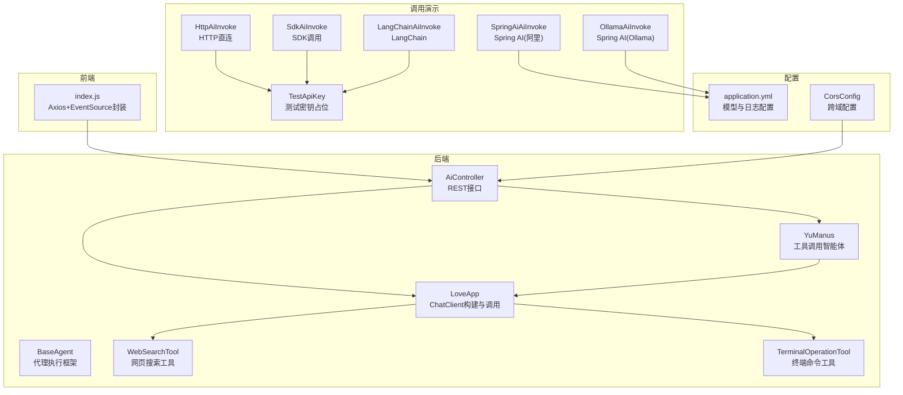
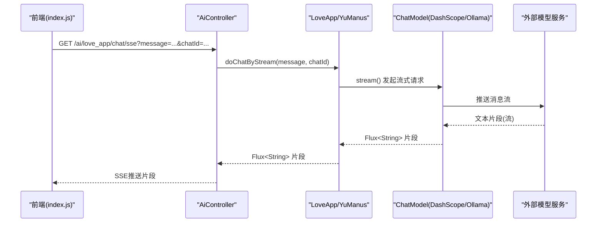
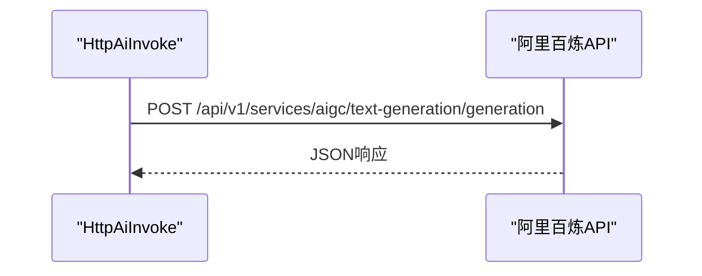
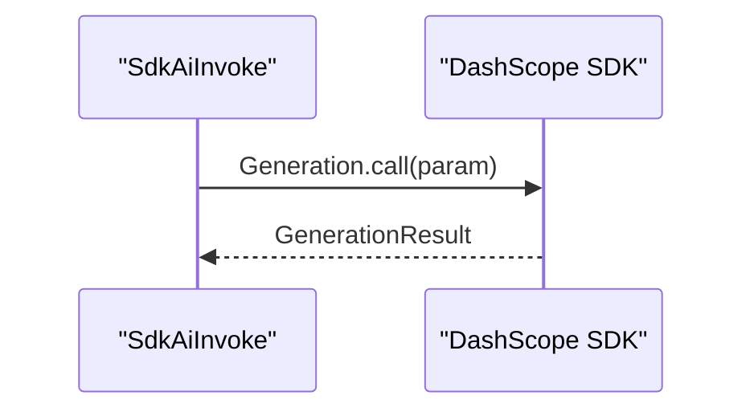
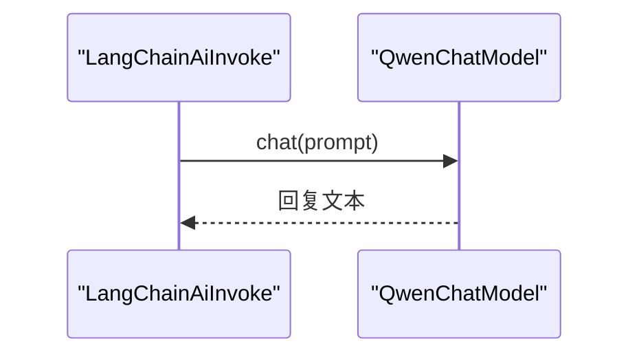
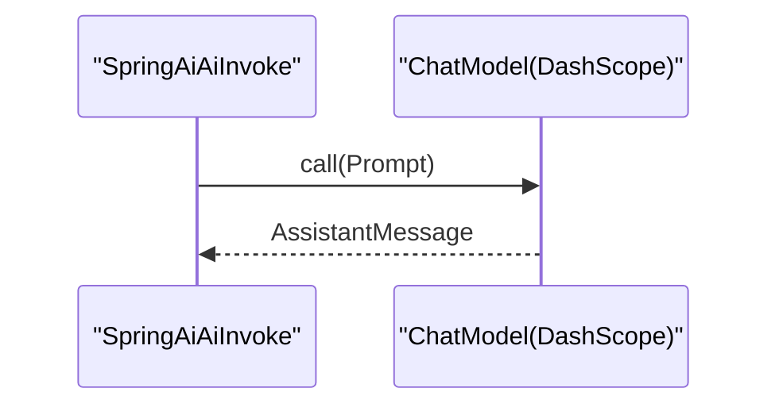
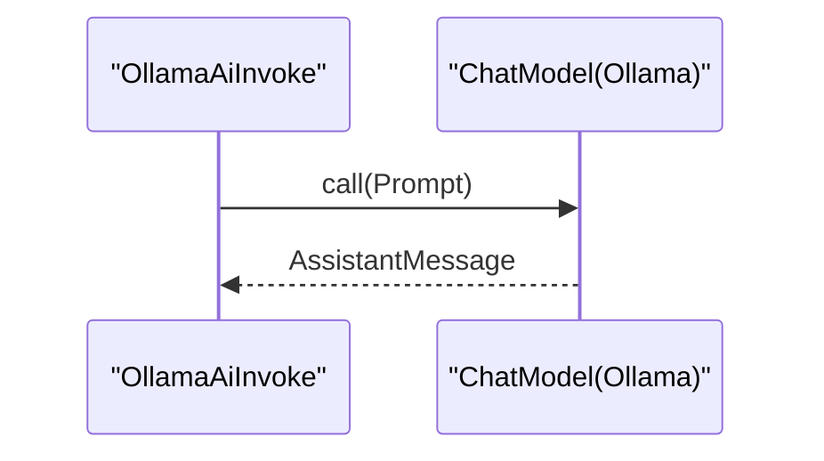
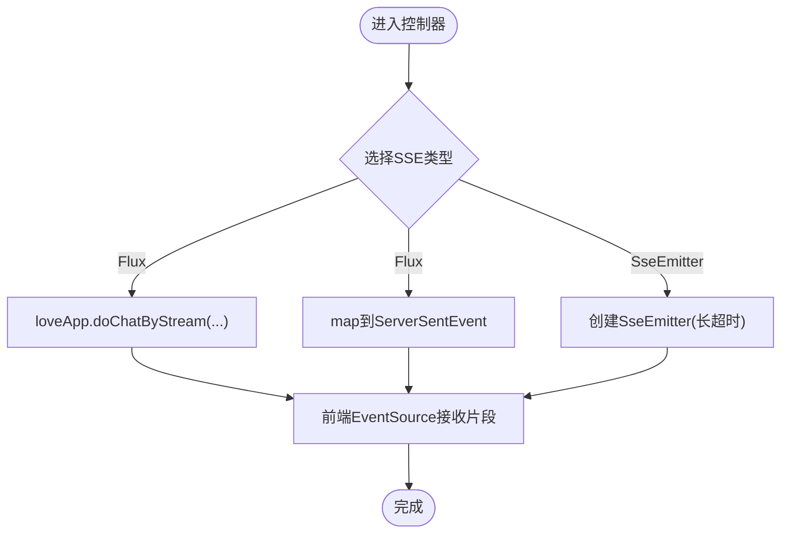
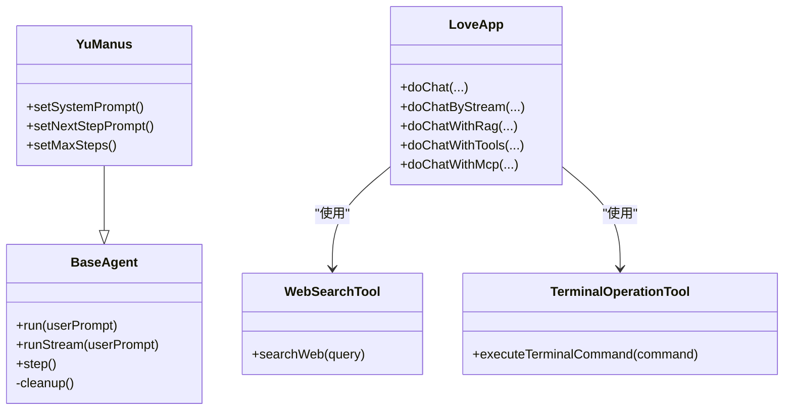
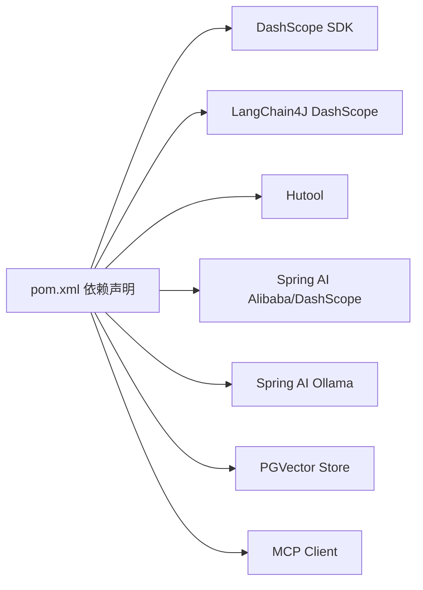

# AI模型调用问题

<cite>
**本文引用的文件**
- [HttpAiInvoke.java](file://src/main/java/com/yupi/yuaiagent/demo/invoke/HttpAiInvoke.java)
- [SdkAiInvoke.java](file://src/main/java/com/yupi/yuaiagent/demo/invoke/SdkAiInvoke.java)
- [LangChainAiInvoke.java](file://src/main/java/com/yupi/yuaiagent/demo/invoke/LangChainAiInvoke.java)
- [OllamaAiInvoke.java](file://src/main/java/com/yupi/yuaiagent/demo/invoke/OllamaAiInvoke.java)
- [SpringAiAiInvoke.java](file://src/main/java/com/yupi/yuaiagent/demo/invoke/SpringAiAiInvoke.java)
- [TestApiKey.java](file://src/main/java/com/yupi/yuaiagent/demo/invoke/TestApiKey.java)
- [application.yml](file://src/main/resources/application.yml)
- [AiController.java](file://src/main/java/com/yupi/yuaiagent/controller/AiController.java)
- [LoveApp.java](file://src/main/java/com/yupi/yuaiagent/app/LoveApp.java)
- [YuManus.java](file://src/main/java/com/yupi/yuaiagent/agent/YuManus.java)
- [BaseAgent.java](file://src/main/java/com/yupi/yuaiagent/agent/BaseAgent.java)
- [WebSearchTool.java](file://src/main/java/com/yupi/yuaiagent/tools/WebSearchTool.java)
- [TerminalOperationTool.java](file://src/main/java/com/yupi/yuaiagent/tools/TerminalOperationTool.java)
- [CorsConfig.java](file://src/main/java/com/yupi/yuaiagent/config/CorsConfig.java)
- [index.js](file://yu-ai-agent-frontend/src/api/index.js)
- [pom.xml](file://pom.xml)
</cite>

## 目录
1. [简介](#简介)
2. [项目结构](#项目结构)
3. [核心组件](#核心组件)
4. [架构总览](#架构总览)
5. [详细组件分析](#详细组件分析)
6. [依赖分析](#依赖分析)
7. [性能考虑](#性能考虑)
8. [故障排除指南](#故障排除指南)
9. [结论](#结论)
10. [附录](#附录)

## 简介
本指南聚焦于在本项目中通过多种方式调用AI模型时可能遇到的常见问题与排障方法，涵盖HTTP直连调用、SDK调用、LangChain调用、Spring AI调用以及Ollama本地模型调用。我们将结合项目中的具体实现，给出API密钥验证失败、网络连接超时、模型参数配置错误、响应格式不匹配等典型问题的诊断思路与修复建议，并提供重试机制、超时设置、代理配置等实用技巧，帮助开发者快速定位并解决问题。

## 项目结构
该项目采用Spring Boot工程，后端提供REST接口并通过Spring AI生态对接阿里百炼与Ollama等模型服务；前端通过Axios封装SSE连接。核心调用演示位于demo/invoke包中，配置集中在application.yml，控制器负责对外提供SSE流式对话能力。

图表来源
- [AiController.java:1-106](file://src/main/java/com/yupi/yuaiagent/controller/AiController.java#L1-L106)
- [LoveApp.java:1-227](file://src/main/java/com/yupi/yuaiagent/app/LoveApp.java#L1-L227)
- [YuManus.java:1-38](file://src/main/java/com/yupi/yuaiagent/agent/YuManus.java#L1-L38)
- [BaseAgent.java:1-193](file://src/main/java/com/yupi/yuaiagent/agent/BaseAgent.java#L1-L193)
- [WebSearchTool.java:1-54](file://src/main/java/com/yupi/yuaiagent/tools/WebSearchTool.java#L1-L54)
- [TerminalOperationTool.java:1-38](file://src/main/java/com/yupi/yuaiagent/tools/TerminalOperationTool.java#L1-L38)
- [HttpAiInvoke.java:1-57](file://src/main/java/com/yupi/yuaiagent/demo/invoke/HttpAiInvoke.java#L1-L57)
- [SdkAiInvoke.java:1-50](file://src/main/java/com/yupi/yuaiagent/demo/invoke/SdkAiInvoke.java#L1-L50)
- [LangChainAiInvoke.java:1-17](file://src/main/java/com/yupi/yuaiagent/demo/invoke/LangChainAiInvoke.java#L1-L17)
- [SpringAiAiInvoke.java:1-28](file://src/main/java/com/yupi/yuaiagent/demo/invoke/SpringAiAiInvoke.java#L1-L28)
- [OllamaAiInvoke.java:1-28](file://src/main/java/com/yupi/yuaiagent/demo/invoke/OllamaAiInvoke.java#L1-L28)
- [TestApiKey.java:1-11](file://src/main/java/com/yupi/yuaiagent/demo/invoke/TestApiKey.java#L1-L11)
- [application.yml:1-66](file://src/main/resources/application.yml#L1-L66)
- [CorsConfig.java:1-25](file://src/main/java/com/yupi/yuaiagent/config/CorsConfig.java#L1-L25)
- [index.js:1-60](file://yu-ai-agent-frontend/src/api/index.js#L1-L60)

章节来源
- [AiController.java:1-106](file://src/main/java/com/yupi/yuaiagent/controller/AiController.java#L1-L106)
- [application.yml:1-66](file://src/main/resources/application.yml#L1-L66)

## 核心组件
- HTTP直连调用：使用Hutool HTTP客户端构造请求，设置Authorization与Content-Type头，发送JSON请求体至阿里百炼服务。
- SDK调用：使用阿里云DashScope Java SDK，通过GenerationParam构建消息与参数，捕获SDK异常类型进行处理。
- LangChain调用：使用LangChain4J社区版DashScope适配器，通过QwenChatModel构建模型并发起对话。
- Spring AI调用（阿里）：通过注入ChatModel（DashScope），使用ChatClient进行同步或流式调用。
- Spring AI调用（Ollama）：通过注入ChatModel（Ollama），使用ChatClient进行同步或流式调用。
- 控制器与SSE：提供多条SSE流式接口，支持长连接与超时控制。
- 工具与智能体：LoveApp集成对话记忆、RAG、工具回调；YuManus继承工具调用智能体，具备多步规划与工具调用能力。

章节来源
- [HttpAiInvoke.java:1-57](file://src/main/java/com/yupi/yuaiagent/demo/invoke/HttpAiInvoke.java#L1-L57)
- [SdkAiInvoke.java:1-50](file://src/main/java/com/yupi/yuaiagent/demo/invoke/SdkAiInvoke.java#L1-L50)
- [LangChainAiInvoke.java:1-17](file://src/main/java/com/yupi/yuaiagent/demo/invoke/LangChainAiInvoke.java#L1-L17)
- [SpringAiAiInvoke.java:1-28](file://src/main/java/com/yupi/yuaiagent/demo/invoke/SpringAiAiInvoke.java#L1-L28)
- [OllamaAiInvoke.java:1-28](file://src/main/java/com/yupi/yuaiagent/demo/invoke/OllamaAiInvoke.java#L1-L28)
- [AiController.java:1-106](file://src/main/java/com/yupi/yuaiagent/controller/AiController.java#L1-L106)
- [LoveApp.java:1-227](file://src/main/java/com/yupi/yuaiagent/app/LoveApp.java#L1-L227)
- [YuManus.java:1-38](file://src/main/java/com/yupi/yuaiagent/agent/YuManus.java#L1-L38)

## 架构总览
后端通过Spring MVC暴露SSE接口，内部使用Spring AI ChatClient与ChatModel对接云端或本地模型；前端通过Axios封装EventSource建立SSE连接。工具与智能体层提供对话记忆、RAG检索与工具调用能力。

图表来源
- [AiController.java:50-53](file://src/main/java/com/yupi/yuaiagent/controller/AiController.java#L50-L53)
- [LoveApp.java:90-97](file://src/main/java/com/yupi/yuaiagent/app/LoveApp.java#L90-L97)
- [index.js:14-45](file://yu-ai-agent-frontend/src/api/index.js#L14-L45)

## 详细组件分析

### HTTP直连调用（Hutool）
- 关键点：构造Authorization与Content-Type头，Body为JSON对象；URL指向阿里百炼文本生成服务。
- 常见问题：API密钥未设置或无效、请求体字段缺失、模型名不正确、网络不可达。
- 诊断要点：检查Authorization头值、请求体结构、模型名与服务端支持情况。

图表来源
- [HttpAiInvoke.java:47-52](file://src/main/java/com/yupi/yuaiagent/demo/invoke/HttpAiInvoke.java#L47-L52)
- [TestApiKey.java:8-10](file://src/main/java/com/yupi/yuaiagent/demo/invoke/TestApiKey.java#L8-L10)

章节来源
- [HttpAiInvoke.java:1-57](file://src/main/java/com/yupi/yuaiagent/demo/invoke/HttpAiInvoke.java#L1-L57)
- [TestApiKey.java:1-11](file://src/main/java/com/yupi/yuaiagent/demo/invoke/TestApiKey.java#L1-L11)

### SDK调用（DashScope Java SDK）
- 关键点：通过GenerationParam构建消息与参数，调用Generation.call；捕获SDK异常类型。
- 常见问题：缺少API Key、输入参数缺失、模型名不支持、网络异常。
- 诊断要点：确认API Key配置、消息角色与内容、模型名与结果格式。

图表来源
- [SdkAiInvoke.java:19-38](file://src/main/java/com/yupi/yuaiagent/demo/invoke/SdkAiInvoke.java#L19-L38)

章节来源
- [SdkAiInvoke.java:1-50](file://src/main/java/com/yupi/yuaiagent/demo/invoke/SdkAiInvoke.java#L1-L50)

### LangChain调用（DashScope）
- 关键点：使用QwenChatModel构建模型，直接chat字符串。
- 常见问题：API Key未配置、模型名不匹配、网络超时。
- 诊断要点：检查API Key与模型名配置、网络连通性。

图表来源
- [LangChainAiInvoke.java:9-14](file://src/main/java/com/yupi/yuaiagent/demo/invoke/LangChainAiInvoke.java#L9-L14)

章节来源
- [LangChainAiInvoke.java:1-17](file://src/main/java/com/yupi/yuaiagent/demo/invoke/LangChainAiInvoke.java#L1-L17)

### Spring AI调用（阿里）
- 关键点：通过注入ChatModel（DashScope），使用ChatClient进行同步/流式调用。
- 常见问题：配置未生效、模型名不一致、SSE超时、工具回调未注册。
- 诊断要点：检查application.yml中dashscope配置、ChatClient默认参数、SSE超时设置。

图表来源
- [SpringAiAiInvoke.java:20-26](file://src/main/java/com/yupi/yuaiagent/demo/invoke/SpringAiAiInvoke.java#L20-L26)

章节来源
- [SpringAiAiInvoke.java:1-28](file://src/main/java/com/yupi/yuaiagent/demo/invoke/SpringAiAiInvoke.java#L1-L28)
- [application.yml:11-18](file://src/main/resources/application.yml#L11-L18)

### Spring AI调用（Ollama）
- 关键点：通过注入ChatModel（Ollama），使用ChatClient进行同步/流式调用。
- 常见问题：Ollama服务未启动、base-url不可达、模型名不存在。
- 诊断要点：检查application.yml中ollama配置、本地服务状态、模型可用性。

图表来源
- [OllamaAiInvoke.java:20-26](file://src/main/java/com/yupi/yuaiagent/demo/invoke/OllamaAiInvoke.java#L20-L26)
- [application.yml:18-22](file://src/main/resources/application.yml#L18-L22)

章节来源
- [OllamaAiInvoke.java:1-28](file://src/main/java/com/yupi/yuaiagent/demo/invoke/OllamaAiInvoke.java#L1-L28)
- [application.yml:18-22](file://src/main/resources/application.yml#L18-L22)

### 控制器与SSE流式接口
- 关键点：提供多条SSE接口，支持Flux与SseEmitter两种形式；设置较长超时时间。
- 常见问题：SSE连接超时、前端EventSource未正确处理[DONE]标记、后端未正确映射ServerSentEvent。
- 诊断要点：检查SSE超时配置、后端Flux映射、前端EventSource事件处理。

图表来源
- [AiController.java:50-92](file://src/main/java/com/yupi/yuaiagent/controller/AiController.java#L50-L92)
- [LoveApp.java:90-97](file://src/main/java/com/yupi/yuaiagent/app/LoveApp.java#L90-L97)
- [index.js:14-45](file://yu-ai-agent-frontend/src/api/index.js#L14-L45)

章节来源
- [AiController.java:1-106](file://src/main/java/com/yupi/yuaiagent/controller/AiController.java#L1-L106)
- [LoveApp.java:90-97](file://src/main/java/com/yupi/yuaiagent/app/LoveApp.java#L90-L97)
- [index.js:1-60](file://yu-ai-agent-frontend/src/api/index.js#L1-L60)

### 工具与智能体
- LoveApp：集成对话记忆、日志Advisor、RAG问答、工具回调与MCP服务调用。
- YuManus：继承工具调用智能体，设定系统提示与下一步提示，限制最大步数。
- BaseAgent：抽象代理基类，提供状态机、步进执行、SSE流式输出与超时处理。

图表来源
- [BaseAgent.java:25-193](file://src/main/java/com/yupi/yuaiagent/agent/BaseAgent.java#L25-L193)
- [YuManus.java:12-38](file://src/main/java/com/yupi/yuaiagent/agent/YuManus.java#L12-L38)
- [LoveApp.java:27-227](file://src/main/java/com/yupi/yuaiagent/app/LoveApp.java#L27-L227)
- [WebSearchTool.java:18-54](file://src/main/java/com/yupi/yuaiagent/tools/WebSearchTool.java#L18-L54)
- [TerminalOperationTool.java:13-38](file://src/main/java/com/yupi/yuaiagent/tools/TerminalOperationTool.java#L13-L38)

章节来源
- [BaseAgent.java:1-193](file://src/main/java/com/yupi/yuaiagent/agent/BaseAgent.java#L1-L193)
- [YuManus.java:1-38](file://src/main/java/com/yupi/yuaiagent/agent/YuManus.java#L1-L38)
- [LoveApp.java:1-227](file://src/main/java/com/yupi/yuaiagent/app/LoveApp.java#L1-L227)
- [WebSearchTool.java:1-54](file://src/main/java/com/yupi/yuaiagent/tools/WebSearchTool.java#L1-L54)
- [TerminalOperationTool.java:1-38](file://src/main/java/com/yupi/yuaiagent/tools/TerminalOperationTool.java#L1-L38)

## 依赖分析
- Spring AI生态：Spring AI Alibaba Starter DashScope、Spring AI Starter Model Ollama、Markdown Reader、PGVector Store、MCP Client等。
- 第三方SDK：DashScope Java SDK、LangChain4J DashScope社区版、Hutool HTTP/JSON。
- 前端依赖：Axios、EventSource polyfill（浏览器原生支持）。

图表来源
- [pom.xml:50-164](file://pom.xml#L50-L164)

章节来源
- [pom.xml:1-227](file://pom.xml#L1-L227)

## 性能考虑
- SSE超时：控制器与代理均设置了较长超时（如3分钟、5分钟），适合长对话与流式输出场景。
- 日志级别：application.yml中将Spring AI日志级别设为DEBUG，便于观察调用细节与性能瓶颈。
- 工具调用：工具执行可能涉及网络请求或系统命令，注意超时与异常处理，避免阻塞主流程。

章节来源
- [AiController.java:77-92](file://src/main/java/com/yupi/yuaiagent/controller/AiController.java#L77-L92)
- [BaseAgent.java:100-177](file://src/main/java/com/yupi/yuaiagent/agent/BaseAgent.java#L100-L177)
- [application.yml:64-66](file://src/main/resources/application.yml#L64-L66)

## 故障排除指南

### 通用排查清单
- 确认API密钥已正确配置且未过期（测试占位与生产配置）。
- 检查网络连通性与代理设置（若需）。
- 核对模型名与服务端支持列表。
- 观察日志级别（DEBUG）以获取详细调用信息。
- 针对SSE场景，确认前端EventSource正确处理[DONE]标记与错误回调。

章节来源
- [TestApiKey.java:8-10](file://src/main/java/com/yupi/yuaiagent/demo/invoke/TestApiKey.java#L8-L10)
- [application.yml:11-18](file://src/main/resources/application.yml#L11-L18)
- [application.yml:64-66](file://src/main/resources/application.yml#L64-L66)

### HTTP直连调用（Hutool）
- 常见问题
  - API密钥验证失败：检查Authorization头值是否为Bearer + 正确密钥。
  - 请求体格式错误：确认messages结构、result_format与model字段。
  - 网络超时：检查网络策略与代理，适当增加客户端超时。
- 诊断步骤
  - 打印请求URL与Header，核对Authorization与Content-Type。
  - 打印请求体JSON，核对messages数组与参数。
  - 捕获并记录HTTP响应状态码与Body。
- 修复建议
  - 替换测试密钥占位为真实密钥。
  - 确保模型名与服务端支持一致。
  - 如需，配置系统代理或调整网络策略。

章节来源
- [HttpAiInvoke.java:47-52](file://src/main/java/com/yupi/yuaiagent/demo/invoke/HttpAiInvoke.java#L47-L52)
- [TestApiKey.java:8-10](file://src/main/java/com/yupi/yuaiagent/demo/invoke/TestApiKey.java#L8-L10)

### SDK调用（DashScope Java SDK）
- 常见问题
  - 缺少API Key：捕获NoApiKeyException并提示配置。
  - 输入参数缺失：捕获InputRequiredException并检查消息与模型名。
  - 网络异常：捕获ApiException并查看底层异常信息。
- 诊断步骤
  - 捕获并打印异常类型与消息。
  - 核对GenerationParam中的apiKey、model、messages、resultFormat。
- 修复建议
  - 在main函数或配置中正确设置API Key。
  - 确认消息角色与内容符合要求。
  - 检查网络连通性与服务端状态。

章节来源
- [SdkAiInvoke.java:19-49](file://src/main/java/com/yupi/yuaiagent/demo/invoke/SdkAiInvoke.java#L19-L49)

### LangChain调用（DashScope）
- 常见问题
  - API密钥未配置：导致认证失败。
  - 模型名不匹配：服务端不支持该模型。
  - 网络超时：DNS解析或连接超时。
- 诊断步骤
  - 检查QwenChatModel构建参数与API Key。
  - 查看网络日志与超时设置。
- 修复建议
  - 确保API Key有效且模型名正确。
  - 调整超时与重试策略。

章节来源
- [LangChainAiInvoke.java:9-14](file://src/main/java/com/yupi/yuaiagent/demo/invoke/LangChainAiInvoke.java#L9-L14)

### Spring AI调用（阿里）
- 常见问题
  - 配置未生效：application.yml中dashscope.api-key或model未正确加载。
  - SSE超时：前端长时间无响应或后端未及时推送。
  - 工具回调未注册：工具调用失败。
- 诊断步骤
  - 检查application.yml中ai.dashscope配置。
  - 观察DEBUG日志，确认ChatClient构建与调用链路。
  - 检查工具回调数组与MCP Provider是否注入成功。
- 修复建议
  - 更新正确的API Key与模型名。
  - 调整SSE超时与前端EventSource处理逻辑。

章节来源
- [application.yml:11-18](file://src/main/resources/application.yml#L11-L18)
- [AiController.java:77-92](file://src/main/java/com/yupi/yuaiagent/controller/AiController.java#L77-L92)
- [LoveApp.java:175-198](file://src/main/java/com/yupi/yuaiagent/app/LoveApp.java#L175-L198)

### Spring AI调用（Ollama）
- 常见问题
  - Ollama服务未启动：base-url不可达。
  - 模型名不存在：拉取或命名不正确。
  - 网络策略限制：容器或防火墙阻止访问。
- 诊断步骤
  - 检查application.yml中ollama.base-url与model。
  - 本地curl或浏览器访问base-url确认可达。
  - 查看模型是否存在且可被拉取。
- 修复建议
  - 启动Ollama服务并确保端口开放。
  - 使用正确的模型名（如gemma3:1b）。

章节来源
- [application.yml:18-22](file://src/main/resources/application.yml#L18-L22)
- [OllamaAiInvoke.java:20-26](file://src/main/java/com/yupi/yuaiagent/demo/invoke/OllamaAiInvoke.java#L20-L26)

### SSE流式调用
- 常见问题
  - 前端未正确处理[DONE]标记：导致连接未结束。
  - 后端未正确映射ServerSentEvent：前端收到非期望格式。
  - SSE超时：长时间无数据导致连接断开。
- 诊断步骤
  - 前端EventSource onmessage中判断[DONE]并关闭连接。
  - 后端确认Flux映射与SseEmitter超时设置。
- 修复建议
  - 在前端统一处理[DONE]标记。
  - 后端保持流式输出稳定，必要时延长超时。

章节来源
- [AiController.java:50-92](file://src/main/java/com/yupi/yuaiagent/controller/AiController.java#L50-L92)
- [index.js:14-45](file://yu-ai-agent-frontend/src/api/index.js#L14-L45)

### 工具与智能体调用
- 常见问题
  - 工具执行失败：网络异常或命令执行失败。
  - 智能体步进超限：达到最大步数提前终止。
  - SSE流式输出异常：状态未正确切换或清理资源。
- 诊断步骤
  - 检查工具回调数组是否注入成功。
  - 查看智能体日志与状态机转换。
  - 确认SSE超时回调与完成回调处理。
- 修复建议
  - 补充工具异常处理与重试逻辑。
  - 调整最大步数与超时时间。

章节来源
- [LoveApp.java:175-225](file://src/main/java/com/yupi/yuaiagent/app/LoveApp.java#L175-L225)
- [YuManus.java:15-36](file://src/main/java/com/yupi/yuaiagent/agent/YuManus.java#L15-L36)
- [BaseAgent.java:100-177](file://src/main/java/com/yupi/yuaiagent/agent/BaseAgent.java#L100-L177)

### 重试机制与超时设置
- 重试机制
  - HTTP直连：可在客户端封装重试逻辑，指数退避。
  - SDK调用：捕获异常后根据错误码决定是否重试。
  - Spring AI：可通过自定义Advisor或外部重试库实现。
- 超时设置
  - 前端Axios默认timeout为60秒，可根据场景调整。
  - 后端SSE超时：控制器与代理分别设置较长超时，避免短连接中断。
- 代理配置
  - 若需通过代理访问外部服务，需在系统或JVM层面配置代理参数。

章节来源
- [index.js:9-12](file://yu-ai-agent-frontend/src/api/index.js#L9-L12)
- [AiController.java:77-92](file://src/main/java/com/yupi/yuaiagent/controller/AiController.java#L77-L92)
- [BaseAgent.java:100-177](file://src/main/java/com/yupi/yuaiagent/agent/BaseAgent.java#L100-L177)

## 结论
本项目提供了多种AI模型调用方式与SSE流式输出能力。排障时应优先确认API密钥、网络连通性与模型配置，结合DEBUG日志定位问题；针对SSE场景，需确保前后端正确处理[DONE]标记与超时。通过合理的重试与超时策略，可显著提升调用稳定性与用户体验。

## 附录
- 配置参考
  - application.yml中包含dashscope与ollama配置项，以及Spring AI日志级别设置。
- 跨域配置
  - 允许任意源、方法与头部，便于本地联调与开发。
- 前端SSE封装
  - Axios实例与EventSource封装，支持超时与错误处理。

章节来源
- [application.yml:1-66](file://src/main/resources/application.yml#L1-L66)
- [CorsConfig.java:11-25](file://src/main/java/com/yupi/yuaiagent/config/CorsConfig.java#L11-L25)
- [index.js:1-60](file://yu-ai-agent-frontend/src/api/index.js#L1-L60)