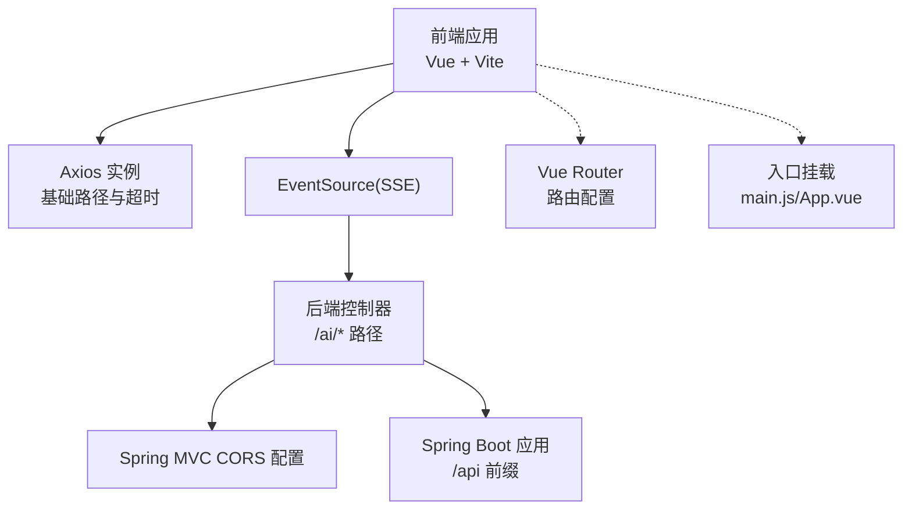
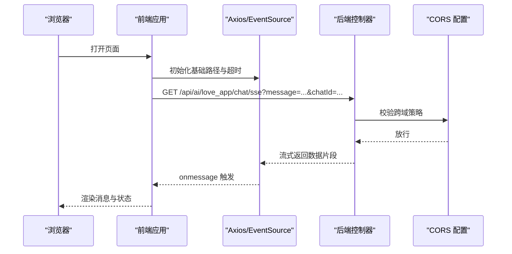
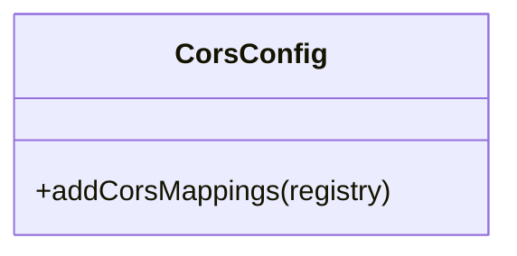
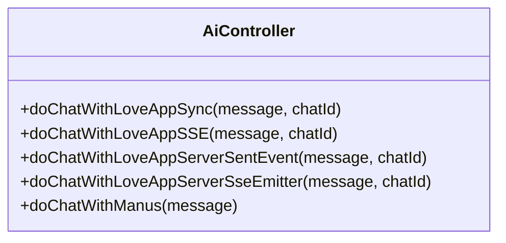
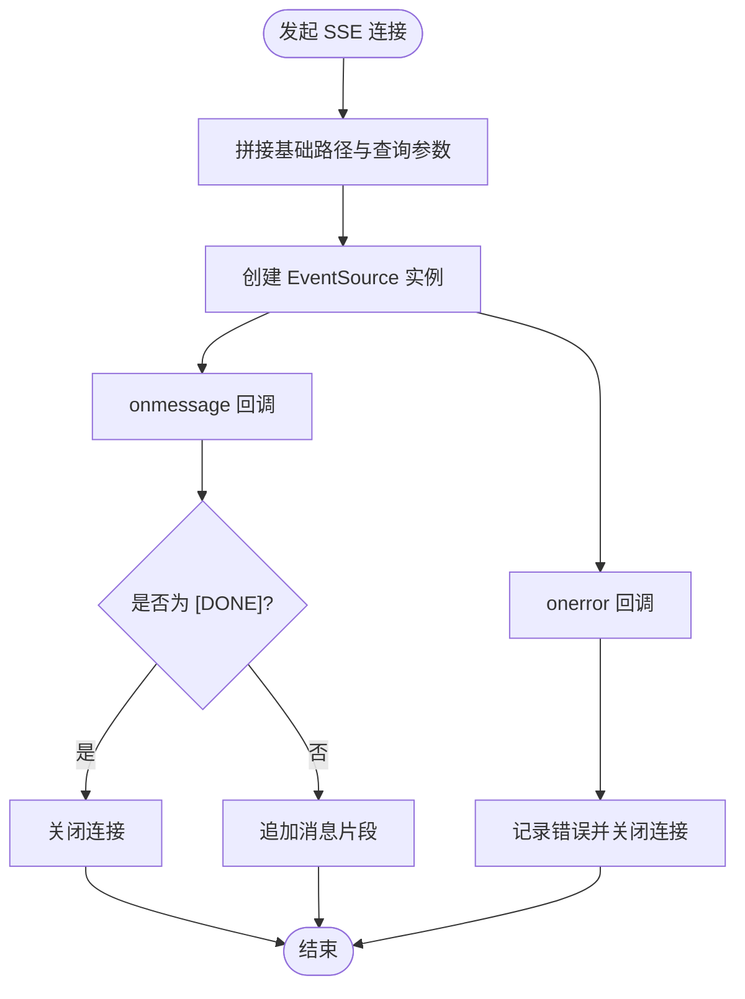
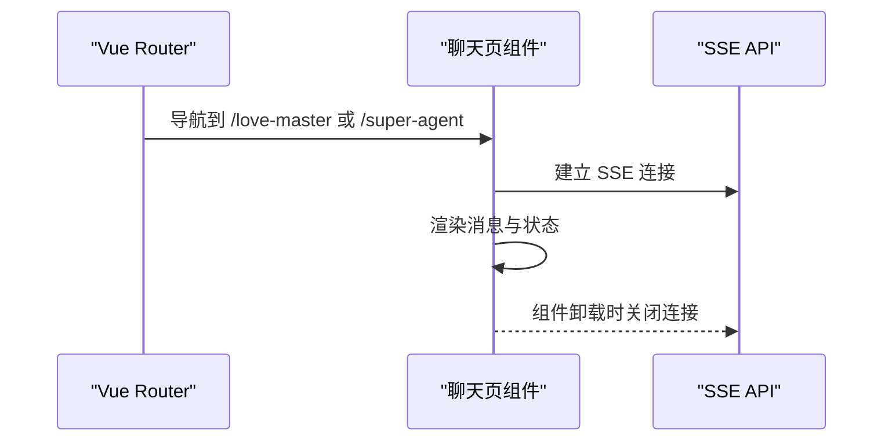
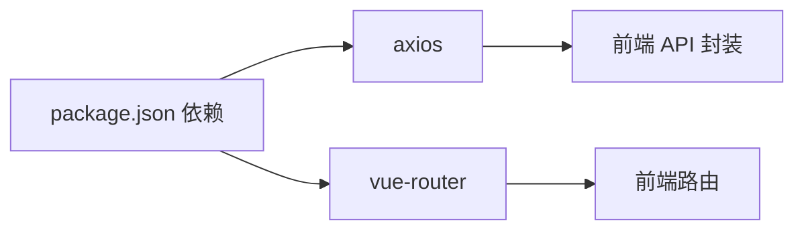

# 前后端通信问题

<cite>
**本文引用的文件**
- [CorsConfig.java](file://src/main/java/com/yupi/yuaiagent/config/CorsConfig.java)
- [AiController.java](file://src/main/java/com/yupi/yuaiagent/controller/AiController.java)
- [application.yml](file://src/main/resources/application.yml)
- [index.js](file://yu-ai-agent-frontend/src/api/index.js)
- [index.js](file://yu-ai-agent-frontend/src/router/index.js)
- [vite.config.js](file://yu-ai-agent-frontend/vite.config.js)
- [LoveMaster.vue](file://yu-ai-agent-frontend/src/views/LoveMaster.vue)
- [SuperAgent.vue](file://yu-ai-agent-frontend/src/views/SuperAgent.vue)
- [ChatRoom.vue](file://yu-ai-agent-frontend/src/components/ChatRoom.vue)
- [main.js](file://yu-ai-agent-frontend/src/main.js)
- [App.vue](file://yu-ai-agent-frontend/src/App.vue)
- [package.json](file://yu-ai-agent-frontend/package.json)
- [HealthController.java](file://src/main/java/com/yupi/yuaiagent/controller/HealthController.java)
</cite>

## 目录
1. [简介](#简介)
2. [项目结构](#项目结构)
3. [核心组件](#核心组件)
4. [架构总览](#架构总览)
5. [详细组件分析](#详细组件分析)
6. [依赖分析](#依赖分析)
7. [性能考虑](#性能考虑)
8. [故障排除指南](#故障排除指南)
9. [结论](#结论)
10. [附录](#附录)

## 简介
本指南聚焦于前后端通信问题的系统性排查与修复，覆盖以下关键场景：
- CORS 跨域问题
- API 接口调用失败
- SSE 流式传输异常
- 前端路由与基础路径配置
- 认证与令牌过期（概念性指导）
- 请求超时与网络拦截器配置
- 浏览器与抓包工具的使用技巧

目标是帮助开发者快速定位并解决浏览器控制台错误、网络请求异常、SSE 断流、路由跳转失效等问题。

## 项目结构
该仓库包含后端 Spring Boot 应用与 Vue 前端应用两部分，前端通过 Vite 开发服务器运行，后端提供 REST 与 SSE 接口，统一由 /api 前缀暴露。

图表来源
- [index.js:1-60](file://yu-ai-agent-frontend/src/api/index.js#L1-L60)
- [vite.config.js:1-18](file://yu-ai-agent-frontend/vite.config.js#L1-L18)
- [AiController.java:1-106](file://src/main/java/com/yupi/yuaiagent/controller/AiController.java#L1-L106)
- [CorsConfig.java:1-26](file://src/main/java/com/yupi/yuaiagent/config/CorsConfig.java#L1-L26)
- [application.yml:38-41](file://src/main/resources/application.yml#L38-L41)
- [index.js:1-47](file://yu-ai-agent-frontend/src/router/index.js#L1-L47)
- [main.js:1-13](file://yu-ai-agent-frontend/src/main.js#L1-L13)
- [App.vue:1-73](file://yu-ai-agent-frontend/src/App.vue#L1-L73)

章节来源
- [vite.config.js:1-18](file://yu-ai-agent-frontend/vite.config.js#L1-L18)
- [application.yml:38-41](file://src/main/resources/application.yml#L38-L41)
- [index.js:1-47](file://yu-ai-agent-frontend/src/router/index.js#L1-L47)
- [main.js:1-13](file://yu-ai-agent-frontend/src/main.js#L1-L13)
- [App.vue:1-73](file://yu-ai-agent-frontend/src/App.vue#L1-L73)

## 核心组件
- 后端 CORS 配置：允许任意源、携带凭据、放行常用方法与头，并暴露全部响应头。
- 后端控制器：提供 /ai/love_app/chat/sse 与 /ai/manus/chat 等 SSE 接口。
- 前端 Axios：基于环境变量设置基础路径，统一超时时间。
- 前端 EventSource：封装 SSE 连接，处理 [DONE] 结束标记与错误回调。
- 前端路由：定义首页与两个聊天页路由，全局设置标题。
- 开发服务器：Vite 默认开启跨域支持，前端本地开发可直连后端。

章节来源
- [CorsConfig.java:1-26](file://src/main/java/com/yupi/yuaiagent/config/CorsConfig.java#L1-L26)
- [AiController.java:1-106](file://src/main/java/com/yupi/yuaiagent/controller/AiController.java#L1-L106)
- [index.js:1-60](file://yu-ai-agent-frontend/src/api/index.js#L1-L60)
- [index.js:1-47](file://yu-ai-agent-frontend/src/router/index.js#L1-L47)
- [vite.config.js:1-18](file://yu-ai-agent-frontend/vite.config.js#L1-L18)

## 架构总览
前后端通过 /api 前缀进行通信，SSE 使用 EventSource 连接后端 /ai/* 接口；开发阶段前端本地服务默认允许跨域。

图表来源
- [application.yml:38-41](file://src/main/resources/application.yml#L38-L41)
- [CorsConfig.java:1-26](file://src/main/java/com/yupi/yuaiagent/config/CorsConfig.java#L1-L26)
- [AiController.java:50-53](file://src/main/java/com/yupi/yuaiagent/controller/AiController.java#L50-L53)
- [index.js:14-45](file://yu-ai-agent-frontend/src/api/index.js#L14-L45)

## 详细组件分析

### 后端 CORS 配置
- 允许任意源与凭据，放行常用方法与头，暴露全部响应头，避免 * 与凭据冲突。
- 适用于开发与生产环境统一跨域策略。

图表来源
- [CorsConfig.java:10-24](file://src/main/java/com/yupi/yuaiagent/config/CorsConfig.java#L10-L24)

章节来源
- [CorsConfig.java:1-26](file://src/main/java/com/yupi/yuaiagent/config/CorsConfig.java#L1-L26)

### 后端控制器与 SSE 接口
- 提供 /ai/love_app/chat/sse 与 /ai/manus/chat 等 SSE 接口，返回流式数据。
- 控制器层负责组装响应与异常处理。

图表来源
- [AiController.java:18-105](file://src/main/java/com/yupi/yuaiagent/controller/AiController.java#L18-L105)

章节来源
- [AiController.java:1-106](file://src/main/java/com/yupi/yuaiagent/controller/AiController.java#L1-L106)

### 前端 Axios 与 SSE 封装
- 基于 NODE_ENV 切换基础路径：生产使用相对路径 /api，开发使用 http://localhost:8123/api。
- 超时设置为 60000ms，适合长连接与流式传输。
- EventSource 封装处理 [DONE] 结束标记与错误回调，便于统一关闭连接。

图表来源
- [index.js:14-45](file://yu-ai-agent-frontend/src/api/index.js#L14-L45)

章节来源
- [index.js:1-60](file://yu-ai-agent-frontend/src/api/index.js#L1-L60)

### 前端路由与页面生命周期
- 路由定义首页与两个聊天页，全局守卫设置页面标题。
- 聊天页在组件销毁时主动关闭 SSE 连接，避免内存泄漏。

图表来源
- [index.js:1-47](file://yu-ai-agent-frontend/src/router/index.js#L1-L47)
- [LoveMaster.vue:123-128](file://yu-ai-agent-frontend/src/views/LoveMaster.vue#L123-L128)
- [SuperAgent.vue:170-175](file://yu-ai-agent-frontend/src/views/SuperAgent.vue#L170-L175)

章节来源
- [index.js:1-47](file://yu-ai-agent-frontend/src/router/index.js#L1-L47)
- [LoveMaster.vue:1-244](file://yu-ai-agent-frontend/src/views/LoveMaster.vue#L1-L244)
- [SuperAgent.vue:1-286](file://yu-ai-agent-frontend/src/views/SuperAgent.vue#L1-L286)

### 开发服务器与跨域
- Vite 默认开启跨域，前端本地开发可直接访问后端服务，减少跨域干扰。
- 若自定义代理，需确保代理目标与后端 /api 前缀一致。

章节来源
- [vite.config.js:13-16](file://yu-ai-agent-frontend/vite.config.js#L13-L16)

## 依赖分析
- 前端依赖 axios 与 vue-router，用于网络请求与路由管理。
- 后端通过 Spring MVC 提供 REST 与 SSE，配合 CORS 全局配置。

图表来源
- [package.json:11-16](file://yu-ai-agent-frontend/package.json#L11-L16)
- [index.js:1-1](file://yu-ai-agent-frontend/src/api/index.js#L1-L1)
- [index.js:1-1](file://yu-ai-agent-frontend/src/router/index.js#L1-L1)

章节来源
- [package.json:1-22](file://yu-ai-agent-frontend/package.json#L1-L22)

## 性能考虑
- SSE 连接应避免频繁重建，聊天页在发送新消息前先关闭旧连接再建立新连接，防止并发连接导致资源浪费。
- 前端对消息进行缓冲与节流，有助于提升渲染性能与用户体验。
- 后端流式输出应保持低延迟，避免长时间阻塞导致连接中断。

## 故障排除指南

### 一、CORS 跨域问题
- 症状
  - 浏览器控制台出现跨域错误，预检请求失败或凭据被拒绝。
  - 本地开发时出现“Access to fetch at … from origin … has been blocked by CORS policy”。
- 诊断步骤
  - 检查后端是否启用全局 CORS 配置，确认允许凭据与放行的源、方法、头。
  - 确认前端基础路径与后端 /api 前缀一致，避免相对路径与绝对路径混用。
  - 开发环境若使用代理，需确保代理目标与后端端口一致。
- 解决方案
  - 后端已配置允许任意源与凭据，无需修改。
  - 前端基础路径按 NODE_ENV 自动切换，确保开发环境指向后端端口。
  - 如需限定源，将允许源从通配改为具体域名与模式。

章节来源
- [CorsConfig.java:14-23](file://src/main/java/com/yupi/yuaiagent/config/CorsConfig.java#L14-L23)
- [application.yml:38-41](file://src/main/resources/application.yml#L38-L41)
- [index.js:3-6](file://yu-ai-agent-frontend/src/api/index.js#L3-L6)
- [vite.config.js:13-16](file://yu-ai-agent-frontend/vite.config.js#L13-L16)

### 二、API 接口调用失败
- 症状
  - 控制台出现 404、403、500 等错误；请求被拦截或重定向。
- 诊断步骤
  - 确认后端 /api 前缀与控制器映射路径正确。
  - 检查后端健康检查接口是否可用，以验证服务可用性。
  - 在浏览器网络面板中查看请求头与响应头，确认是否携带必要凭据或认证信息。
- 解决方案
  - 保持前端基础路径与后端 context-path 一致。
  - 如需认证，补充相应请求头或 Cookie（注意跨域凭据）。
  - 使用 Swagger/OpenAPI 文档校验接口签名与参数。

章节来源
- [application.yml:38-41](file://src/main/resources/application.yml#L38-L41)
- [HealthController.java:11-14](file://src/main/java/com/yupi/yuaiagent/controller/HealthController.java#L11-L14)

### 三、SSE 流式传输异常
- 症状
  - 连接建立后无数据到达；连接在短时间内断开；控制台报错。
- 诊断步骤
  - 查看浏览器网络面板中 EventSource 的连接状态与数据帧。
  - 确认后端 SSE 接口返回的数据片段是否包含 [DONE] 结束标记。
  - 检查前端 onerror 回调是否触发，记录错误原因。
- 解决方案
  - 前端在组件销毁时主动关闭 SSE，避免重复连接。
  - 后端确保流式输出完整且包含 [DONE]，避免客户端误判为异常断开。
  - 调整超时时间与心跳策略，避免中间代理或网关提前断开连接。

章节来源
- [AiController.java:50-53](file://src/main/java/com/yupi/yuaiagent/controller/AiController.java#L50-L53)
- [index.js:14-45](file://yu-ai-agent-frontend/src/api/index.js#L14-L45)
- [LoveMaster.vue:101-106](file://yu-ai-agent-frontend/src/views/LoveMaster.vue#L101-L106)
- [SuperAgent.vue:145-156](file://yu-ai-agent-frontend/src/views/SuperAgent.vue#L145-L156)

### 四、前端路由配置问题
- 症状
  - 页面刷新后路由丢失；页面标题未更新；跳转无效。
- 诊断步骤
  - 检查路由模式是否为 createWebHistory，确保与服务器静态资源部署一致。
  - 确认全局前置守卫是否正确设置页面标题。
- 解决方案
  - 保持 history 模式与服务器配置一致；如使用 hash 模式，需调整部署策略。
  - 在路由守卫中设置 meta 字段，保证标题与描述正确注入。

章节来源
- [index.js:33-45](file://yu-ai-agent-frontend/src/router/index.js#L33-L45)
- [LoveMaster.vue:34-47](file://yu-ai-agent-frontend/src/views/LoveMaster.vue#L34-L47)
- [SuperAgent.vue:34-47](file://yu-ai-agent-frontend/src/views/SuperAgent.vue#L34-L47)

### 五、API 基础地址错误
- 症状
  - 开发环境请求指向错误主机或端口；生产环境相对路径导致跨域。
- 诊断步骤
  - 检查前端基础路径是否根据 NODE_ENV 正确设置。
  - 确认后端 context-path 与前端基础路径一致。
- 解决方案
  - 生产环境使用相对路径 /api；开发环境使用 http://localhost:8123/api。
  - 如需代理，统一在 Vite 或 Nginx 中配置转发规则。

章节来源
- [index.js:3-6](file://yu-ai-agent-frontend/src/api/index.js#L3-L6)
- [application.yml:38-41](file://src/main/resources/application.yml#L38-L41)
- [vite.config.js:13-16](file://yu-ai-agent-frontend/vite.config.js#L13-L16)

### 六、认证令牌过期
- 症状
  - 请求返回 401；后续接口均失败。
- 诊断步骤
  - 检查响应头或响应体中的错误码与提示。
  - 确认前端是否在拦截器中刷新令牌并重试请求。
- 解决方案
  - 在请求拦截器中检测 401，执行刷新流程并重试。
  - 对于 SSE，需在 onerror 中识别令牌过期并引导重新登录。

章节来源
- [index.js:8-12](file://yu-ai-agent-frontend/src/api/index.js#L8-L12)

### 七、请求超时处理
- 症状
  - 网络较慢时接口超时；SSE 连接在长时间无数据时断开。
- 诊断步骤
  - 查看 Axios 超时配置与后端连接超时设置。
  - 检查中间代理或网关的超时策略。
- 解决方案
  - 增大 Axios 超时时间，适配长连接与流式传输。
  - 后端为 SSE 设置合理的超时与心跳机制。

章节来源
- [index.js:8-12](file://yu-ai-agent-frontend/src/api/index.js#L8-L12)
- [AiController.java:77-91](file://src/main/java/com/yupi/yuaiagent/controller/AiController.java#L77-L91)

### 八、网络调试工具使用指南
- 浏览器开发者工具
  - Network 面板：观察请求/响应头、状态码、SSE 数据帧与断流时机。
  - Console 面板：查看跨域错误、JS 异常与 onerror 输出。
- Postman
  - 直接调用 /api/ai/* 接口，验证后端逻辑与返回格式。
  - 使用 Events 选项卡监听 SSE，观察 [DONE] 结束标记。
- Charles/Proxy 工具
  - 抓取 HTTP 流量，定位跨域头、Cookie、认证头缺失问题。
  - 分析中间环节的断流与超时行为。

章节来源
- [index.js:14-45](file://yu-ai-agent-frontend/src/api/index.js#L14-L45)
- [AiController.java:50-53](file://src/main/java/com/yupi/yuaiagent/controller/AiController.java#L50-L53)

## 结论
通过统一的基础路径、完善的 CORS 配置、健壮的 SSE 连接与路由管理，以及系统化的网络调试手段，可有效规避前后端通信中的常见问题。建议在开发与生产环境中保持配置一致性，并在前端实现统一的错误处理与资源清理逻辑。

## 附录
- 健康检查接口：/health，返回 ok 表示服务可用。
- 常用接口
  - GET /api/ai/love_app/chat/sse?message=...&chatId=...
  - GET /api/ai/manus/chat?message=...

章节来源
- [HealthController.java:11-14](file://src/main/java/com/yupi/yuaiagent/controller/HealthController.java#L11-L14)
- [AiController.java:50-53](file://src/main/java/com/yupi/yuaiagent/controller/AiController.java#L50-L53)
- [application.yml:38-41](file://src/main/resources/application.yml#L38-L41)