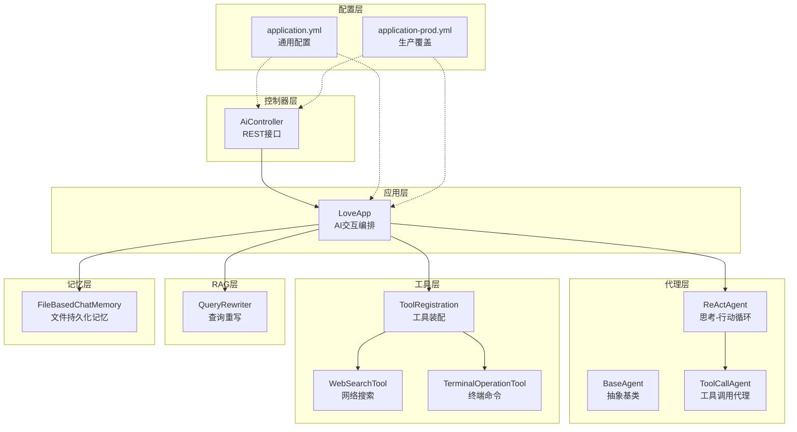
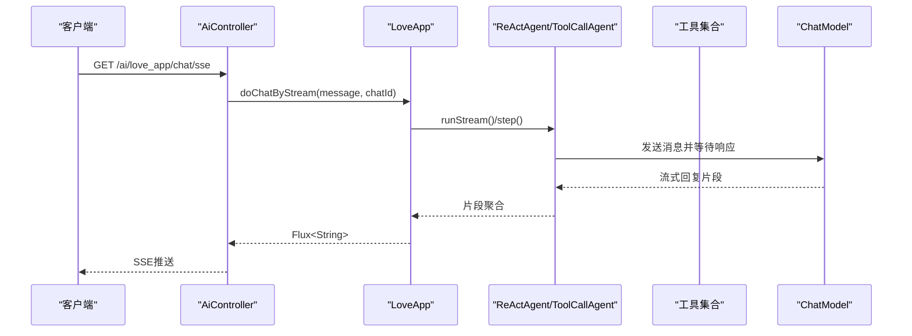
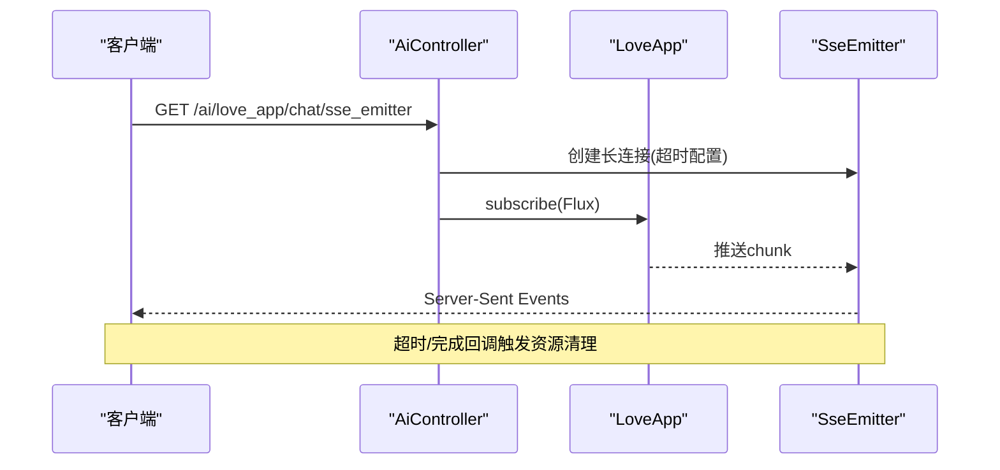
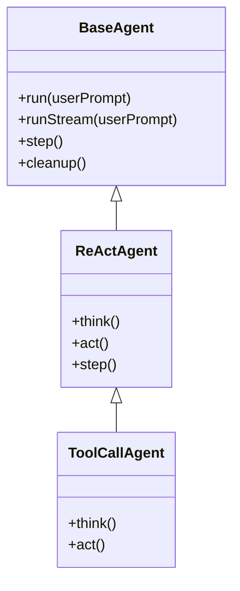
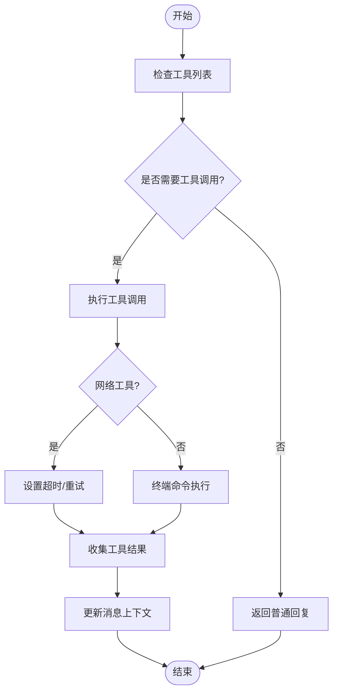
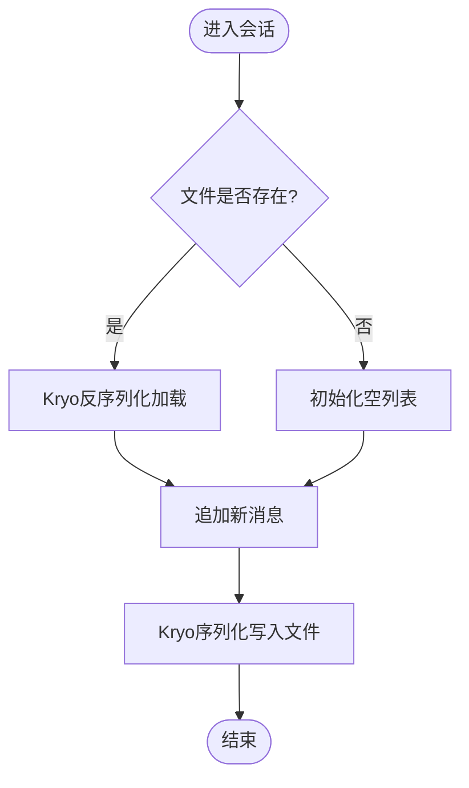
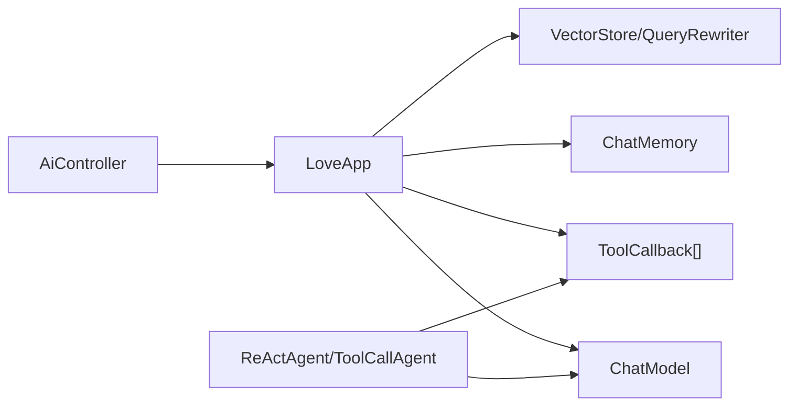

# 性能监控与优化

<cite>
**本文引用的文件**
- [YuAiAgentApplication.java](file://src/main/java/com/yupi/yuaiagent/YuAiAgentApplication.java)
- [application.yml](file://src/main/resources/application.yml)
- [application-prod.yml](file://src/main/resources/application-prod.yml)
- [AiController.java](file://src/main/java/com/yupi/yuaiagent/controller/AiController.java)
- [LoveApp.java](file://src/main/java/com/yupi/yuaiagent/app/LoveApp.java)
- [BaseAgent.java](file://src/main/java/com/yupi/yuaiagent/agent/BaseAgent.java)
- [ReActAgent.java](file://src/main/java/com/yupi/yuaiagent/agent/ReActAgent.java)
- [ToolCallAgent.java](file://src/main/java/com/yupi/yuaiagent/agent/ToolCallAgent.java)
- [FileBasedChatMemory.java](file://src/main/java/com/yupi/yuaiagent/chatmemory/FileBasedChatMemory.java)
- [MyLoggerAdvisor.java](file://src/main/java/com/yupi/yuaiagent/advisor/MyLoggerAdvisor.java)
- [ToolRegistration.java](file://src/main/java/com/yupi/yuaiagent/tools/ToolRegistration.java)
- [WebSearchTool.java](file://src/main/java/com/yupi/yuaiagent/tools/WebSearchTool.java)
- [TerminalOperationTool.java](file://src/main/java/com/yupi/yuaiagent/tools/TerminalOperationTool.java)
- [QueryRewriter.java](file://src/main/java/com/yupi/yuaiagent/rag/QueryRewriter.java)
</cite>

## 目录
1. [简介](#简介)
2. [项目结构](#项目结构)
3. [核心组件](#核心组件)
4. [架构总览](#架构总览)
5. [详细组件分析](#详细组件分析)
6. [依赖分析](#依赖分析)
7. [性能考量](#性能考量)
8. [故障排查指南](#故障排查指南)
9. [结论](#结论)
10. [附录](#附录)

## 简介
本指南聚焦于AI代理系统的性能监控与优化，围绕以下关键目标展开：
- 解决AI响应延迟、内存占用过高、数据库查询慢、工具调用阻塞等性能问题
- 明确系统性能指标监控方法（CPU使用率、内存消耗、网络I/O、磁盘I/O）
- 提供瓶颈识别技巧（热点代码分析、缓存命中率优化、异步处理改进）
- 对话记忆系统的性能影响与优化（文件读写优化、内存缓存策略、持久化频率）
- 负载测试与压力测试方法与工具使用

## 项目结构
系统采用Spring Boot微服务架构，控制器层负责对外HTTP接口，应用层封装AI交互逻辑，代理层实现思考-行动循环，工具层提供外部能力扩展，RAG模块提供检索增强，聊天记忆模块提供上下文持久化。



图表来源
- [AiController.java:1-106](file://src/main/java/com/yupi/yuaiagent/controller/AiController.java#L1-L106)
- [LoveApp.java:1-227](file://src/main/java/com/yupi/yuaiagent/app/LoveApp.java#L1-L227)
- [BaseAgent.java:1-193](file://src/main/java/com/yupi/yuaiagent/agent/BaseAgent.java#L1-L193)
- [ReActAgent.java:1-53](file://src/main/java/com/yupi/yuaiagent/agent/ReActAgent.java#L1-L53)
- [ToolCallAgent.java:1-136](file://src/main/java/com/yupi/yuaiagent/agent/ToolCallAgent.java#L1-L136)
- [ToolRegistration.java:1-38](file://src/main/java/com/yupi/yuaiagent/tools/ToolRegistration.java#L1-L38)
- [WebSearchTool.java:1-54](file://src/main/java/com/yupi/yuaiagent/tools/WebSearchTool.java#L1-L54)
- [TerminalOperationTool.java:1-38](file://src/main/java/com/yupi/yuaiagent/tools/TerminalOperationTool.java#L1-L38)
- [QueryRewriter.java:1-40](file://src/main/java/com/yupi/yuaiagent/rag/QueryRewriter.java#L1-L40)
- [FileBasedChatMemory.java:1-94](file://src/main/java/com/yupi/yuaiagent/chatmemory/FileBasedChatMemory.java#L1-L94)
- [application.yml:1-66](file://src/main/resources/application.yml#L1-L66)
- [application-prod.yml:1-2](file://src/main/resources/application-prod.yml#L1-L2)

章节来源
- [YuAiAgentApplication.java:1-18](file://src/main/java/com/yupi/yuaiagent/YuAiAgentApplication.java#L1-L18)
- [application.yml:1-66](file://src/main/resources/application.yml#L1-L66)

## 核心组件
- 控制器层：提供同步与流式接口，支持SSE推送与响应式流输出
- 应用层：封装系统提示词、记忆、工具、RAG与向量存储的编排
- 代理层：抽象基类与ReAct代理，实现思考-行动循环与异步流式执行
- 工具层：集中注册多种工具，包括网络搜索、终端命令、文件操作等
- RAG层：查询重写器，提升检索质量
- 记忆层：文件持久化聊天记忆，支持Kryo序列化

章节来源
- [AiController.java:1-106](file://src/main/java/com/yupi/yuaiagent/controller/AiController.java#L1-L106)
- [LoveApp.java:1-227](file://src/main/java/com/yupi/yuaiagent/app/LoveApp.java#L1-L227)
- [BaseAgent.java:1-193](file://src/main/java/com/yupi/yuaiagent/agent/BaseAgent.java#L1-L193)
- [ReActAgent.java:1-53](file://src/main/java/com/yupi/yuaiagent/agent/ReActAgent.java#L1-L53)
- [ToolCallAgent.java:1-136](file://src/main/java/com/yupi/yuaiagent/agent/ToolCallAgent.java#L1-L136)
- [ToolRegistration.java:1-38](file://src/main/java/com/yupi/yuaiagent/tools/ToolRegistration.java#L1-L38)
- [QueryRewriter.java:1-40](file://src/main/java/com/yupi/yuaiagent/rag/QueryRewriter.java#L1-L40)
- [FileBasedChatMemory.java:1-94](file://src/main/java/com/yupi/yuaiagent/chatmemory/FileBasedChatMemory.java#L1-L94)

## 架构总览
系统通过控制器接收请求，应用层构建ChatClient并注入记忆、工具与RAG增强，代理层驱动思考-行动循环，工具层执行外部调用，最终通过SSE或响应式流返回结果。



图表来源
- [AiController.java:50-53](file://src/main/java/com/yupi/yuaiagent/controller/AiController.java#L50-L53)
- [LoveApp.java:90-97](file://src/main/java/com/yupi/yuaiagent/app/LoveApp.java#L90-L97)
- [BaseAgent.java:100-177](file://src/main/java/com/yupi/yuaiagent/agent/BaseAgent.java#L100-L177)
- [ReActAgent.java:35-50](file://src/main/java/com/yupi/yuaiagent/agent/ReActAgent.java#L35-L50)
- [ToolCallAgent.java:59-104](file://src/main/java/com/yupi/yuaiagent/agent/ToolCallAgent.java#L59-L104)

## 详细组件分析

### 控制器与流式输出
- 同步与SSE两种调用方式，SSE通过响应式Flux与SseEmitter实现低延迟推送
- 流式接口在高并发下需关注连接超时与背压处理



图表来源
- [AiController.java:77-92](file://src/main/java/com/yupi/yuaiagent/controller/AiController.java#L77-L92)
- [BaseAgent.java:100-177](file://src/main/java/com/yupi/yuaiagent/agent/BaseAgent.java#L100-L177)

章节来源
- [AiController.java:1-106](file://src/main/java/com/yupi/yuaiagent/controller/AiController.java#L1-L106)
- [BaseAgent.java:1-193](file://src/main/java/com/yupi/yuaiagent/agent/BaseAgent.java#L1-L193)

### 应用层编排与记忆
- 默认使用内存窗口记忆，限制消息数量，降低上下文开销
- 支持开启自定义日志Advisor便于观测LLM输入输出
- RAG路径可选：本地向量存储、云服务或自定义增强器

```mermaid
classDiagram
class LoveApp {
+doChat(message, chatId)
+doChatByStream(message, chatId)
+doChatWithReport(message, chatId)
+doChatWithRag(message, chatId)
+doChatWithTools(message, chatId)
+doChatWithMcp(message, chatId)
}
class MyLoggerAdvisor
class FileBasedChatMemory
class MessageWindowChatMemory
class VectorStore
class ToolCallback[]
class QueryRewriter
LoveApp --> MyLoggerAdvisor : "可选日志增强"
LoveApp --> FileBasedChatMemory : "可选文件记忆"
LoveApp --> MessageWindowChatMemory : "默认内存记忆"
LoveApp --> VectorStore : "RAG检索"
LoveApp --> ToolCallback[] : "工具调用"
LoveApp --> QueryRewriter : "查询重写"
```

图表来源
- [LoveApp.java:1-227](file://src/main/java/com/yupi/yuaiagent/app/LoveApp.java#L1-L227)
- [MyLoggerAdvisor.java:1-54](file://src/main/java/com/yupi/yuaiagent/advisor/MyLoggerAdvisor.java#L1-L54)
- [FileBasedChatMemory.java:1-94](file://src/main/java/com/yupi/yuaiagent/chatmemory/FileBasedChatMemory.java#L1-L94)
- [QueryRewriter.java:1-40](file://src/main/java/com/yupi/yuaiagent/rag/QueryRewriter.java#L1-L40)

章节来源
- [LoveApp.java:1-227](file://src/main/java/com/yupi/yuaiagent/app/LoveApp.java#L1-L227)

### 代理与工具调用
- ReAct代理先思考再行动，异常捕获保证稳定性
- ToolCallAgent禁用内置工具执行，自管上下文与消息历史，减少框架开销



图表来源
- [BaseAgent.java:1-193](file://src/main/java/com/yupi/yuaiagent/agent/BaseAgent.java#L1-L193)
- [ReActAgent.java:1-53](file://src/main/java/com/yupi/yuaiagent/agent/ReActAgent.java#L1-L53)
- [ToolCallAgent.java:1-136](file://src/main/java/com/yupi/yuaiagent/agent/ToolCallAgent.java#L1-L136)

章节来源
- [ReActAgent.java:1-53](file://src/main/java/com/yupi/yuaiagent/agent/ReActAgent.java#L1-L53)
- [ToolCallAgent.java:1-136](file://src/main/java/com/yupi/yuaiagent/agent/ToolCallAgent.java#L1-L136)

### 工具与外部调用
- 工具集中注册，便于统一管理与扩展
- 网络搜索工具依赖外部API，需关注超时与限流
- 终端工具存在阻塞风险，需设置超时与退出码检查



图表来源
- [ToolRegistration.java:1-38](file://src/main/java/com/yupi/yuaiagent/tools/ToolRegistration.java#L1-L38)
- [WebSearchTool.java:1-54](file://src/main/java/com/yupi/yuaiagent/tools/WebSearchTool.java#L1-L54)
- [TerminalOperationTool.java:1-38](file://src/main/java/com/yupi/yuaiagent/tools/TerminalOperationTool.java#L1-L38)

章节来源
- [ToolRegistration.java:1-38](file://src/main/java/com/yupi/yuaiagent/tools/ToolRegistration.java#L1-L38)
- [WebSearchTool.java:1-54](file://src/main/java/com/yupi/yuaiagent/tools/WebSearchTool.java#L1-L54)
- [TerminalOperationTool.java:1-38](file://src/main/java/com/yupi/yuaiagent/tools/TerminalOperationTool.java#L1-L38)

### 记忆系统与持久化
- 文件持久化记忆使用Kryo序列化，适合小规模上下文
- 当前默认使用内存窗口记忆，建议根据场景选择文件或内存策略



图表来源
- [FileBasedChatMemory.java:68-88](file://src/main/java/com/yupi/yuaiagent/chatmemory/FileBasedChatMemory.java#L68-L88)

章节来源
- [FileBasedChatMemory.java:1-94](file://src/main/java/com/yupi/yuaiagent/chatmemory/FileBasedChatMemory.java#L1-L94)

## 依赖分析
- 控制器依赖应用层与工具回调数组
- 应用层依赖ChatModel、记忆、工具、RAG组件
- 代理层依赖ChatClient与工具调用管理器
- 工具层依赖外部服务与系统命令



图表来源
- [AiController.java:1-106](file://src/main/java/com/yupi/yuaiagent/controller/AiController.java#L1-L106)
- [LoveApp.java:1-227](file://src/main/java/com/yupi/yuaiagent/app/LoveApp.java#L1-L227)
- [BaseAgent.java:1-193](file://src/main/java/com/yupi/yuaiagent/agent/BaseAgent.java#L1-L193)
- [ToolCallAgent.java:1-136](file://src/main/java/com/yupi/yuaiagent/agent/ToolCallAgent.java#L1-L136)

章节来源
- [AiController.java:1-106](file://src/main/java/com/yupi/yuaiagent/controller/AiController.java#L1-L106)
- [LoveApp.java:1-227](file://src/main/java/com/yupi/yuaiagent/app/LoveApp.java#L1-L227)

## 性能考量

### 系统性能指标监控
- CPU使用率：结合容器监控与JVM采样，定位热点方法
- 内存消耗：关注堆外内存（如Kryo序列化、网络I/O缓冲）、GC停顿
- 网络I/O：统计外部API调用次数、平均耗时、错误率
- 磁盘I/O：评估文件记忆写入频率与批量策略

### 瓶颈识别与优化策略
- 热点代码分析：优先排查工具调用、网络请求、Kryo序列化与消息聚合
- 缓存命中率优化：对重复查询与工具结果进行缓存，减少重复调用
- 异步处理改进：使用CompletableFuture与响应式流，避免阻塞主线程
- 记忆策略优化：内存窗口记忆适合短对话；文件记忆适合长会话但需权衡IO成本

### 对话记忆系统的性能影响与优化
- 文件读写优化：合并写入、延迟刷盘、使用更高效的序列化格式
- 内存缓存策略：结合内存窗口记忆与LRU淘汰，限制最大消息数
- 持久化频率调整：按会话结束或阈值触发持久化，避免频繁IO

### 负载测试与压力测试
- 方法：构造并发用户、逐步提升QPS，观察延迟与错误率
- 工具：JMeter、Gatling、k6等，结合Prometheus+Grafana观测指标
- 关注点：SSE连接数、工具调用超时、RAG检索延迟、内存峰值

## 故障排查指南
- SSE连接超时：检查超时配置与网络稳定性，确保完成回调中清理资源
- 工具调用阻塞：为网络工具设置超时与重试，终端工具增加退出码检查
- 记忆读写异常：捕获IO异常并降级为内存模式，记录错误日志
- 日志Advisor：开启日志Advisor便于定位LLM输入输出与中间结果

章节来源
- [BaseAgent.java:163-176](file://src/main/java/com/yupi/yuaiagent/agent/BaseAgent.java#L163-L176)
- [WebSearchTool.java:36-52](file://src/main/java/com/yupi/yuaiagent/tools/WebSearchTool.java#L36-L52)
- [TerminalOperationTool.java:16-36](file://src/main/java/com/yupi/yuaiagent/tools/TerminalOperationTool.java#L16-L36)
- [MyLoggerAdvisor.java:30-52](file://src/main/java/com/yupi/yuaiagent/advisor/MyLoggerAdvisor.java#L30-L52)

## 结论
通过明确的监控指标、针对性的优化策略与完善的故障排查流程，可在保证用户体验的同时显著降低AI响应延迟、内存占用与外部调用阻塞风险。建议在生产环境中启用内存窗口记忆、工具缓存与异步流式输出，并配合负载测试持续验证系统性能。

## 附录

### 配置要点
- 生产配置覆盖：在生产环境覆盖通用配置，避免敏感信息泄露
- 日志级别：提高Spring AI日志级别便于观测调用细节

章节来源
- [application.yml:64-66](file://src/main/resources/application.yml#L64-L66)
- [application-prod.yml:1-2](file://src/main/resources/application-prod.yml#L1-L2)